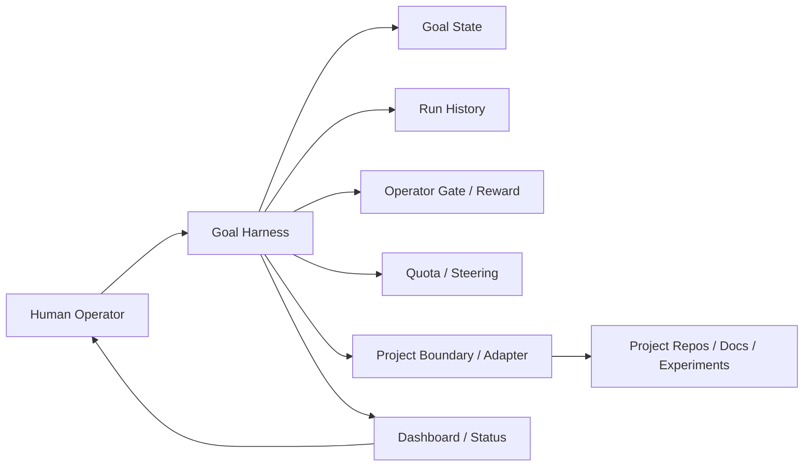

# Goal Harness

Goal Harness is a lightweight control plane for long-running agent work.

It sits above Codex App, Codex CLI, Claude Code, Cursor, heartbeat tasks, or
other goal-mode workflows. It does not replace the agent. It gives the agent
and the human operator a shared way to manage goal state, run history, gates,
human feedback, quota, and project boundaries across time.

The core idea:

> Long-running agent work should be recoverable, reviewable, handoffable, and
> safe by default. The human should judge direction, evidence, authorization,
> and feedback instead of rereading every agent thread.

## Why Goal Harness Exists

Short agent tasks usually fail because the model makes a bad local choice.
Long-running agent work fails differently: state drifts.

After several runs or several projects, the hard questions become:

- What is the current objective, and what is explicitly out of scope?
- Which document, owner decision, experiment board, or run artifact is the
  current authority?
- What did the last run actually do, and how was it validated?
- Which action needs a human or owner decision?
- Which action is read-only, and which action crosses a write or production
  boundary?
- Which project deserves the next automatic agent turn?
- How does human feedback survive into the next run?

Goal Harness makes those boundaries explicit. Its job is not to make the agent
"busier"; its job is to make long-running agent work manageable.

## Control Plane Model



Goal Harness has six core surfaces:

- **Goal State**: the durable current state for one goal: objective, non-goals,
  constraints, next action, and progress ledger.
- **Run History**: the compact event ledger for each agent turn, including
  timestamp, classification, recommended action, validation, artifact paths, and
  status-neutral accounting events.
- **Operator Gate / Reward**: human decisions and feedback bound to a specific
  run, gate, or decision.
- **Operator View**: first-screen status for the human: who needs a decision,
  who can continue, who is waiting, and who cannot cross a boundary.
- **Quota / Steering**: compute eligibility and attention allocation across
  projects.
- **Project Boundary**: a staged adapter model: read-only observer, decision
  advisor, then selective assist only after explicit authorization.

## What It Is Good For

Use Goal Harness when an agent is working across time, projects, or safety
boundaries:

- multi-week engineering or research goals;
- recurring heartbeat runs;
- multiple local projects with different states and adapters;
- experiment controllers that must wait for evidence before route decisions;
- Codex-style controller runs with scoped sub-agents;
- owner/SOP gates and human reward capture;
- public/private boundary checks before publishing;
- dashboards that should show user actions before raw run logs.

Do not use it as a replacement for project ownership. Goal Harness is a control
surface, not an autonomous production controller.

## Install

Install one shared local checkout:

```bash
git clone https://github.com/huangruiteng/goal-harness ~/goal-harness
~/goal-harness/scripts/install-local.sh
goal-harness doctor
```

The installer creates `~/.local/bin/goal-harness` and installs the
`goal-harness-project` Codex skill into `~/.codex/skills`.

By default, `goal-harness` points at a local release snapshot under
`~/.local/share/goal-harness/releases/`, not at the live checkout. The installer
also creates `goal-harness-canary`, which points at the current checkout for
selected gray-rollout automations. Use canary on one or two suitable goal
controllers first; after observation, rerun `scripts/install-local.sh` to
promote the current checkout into the default local release.

Before promoting a live checkout into the default local release, run the compact
canary-promotion readiness group:

```bash
cd ~/goal-harness
python3 examples/canary-promotion-readiness-smoke.py
```

The default command avoids browser-backed checks so it can run in CI-like
environments. It now runs the dashboard demo-readiness group, including the
structured `promotion-gate` fresh/warning contract smoke, before writing any
live readiness evidence. On success it appends one public-safe
`canary_promotion_readiness_smoke_group` event to the local Goal Harness run
history; that event is the source status, doctor, and quota guards use to clear
missing or stale promotion-readiness warnings. To include the full dashboard
demo-readiness browser path:

```bash
python3 examples/canary-promotion-readiness-smoke.py --include-browser
```

For a pure check that does not write readiness evidence, add
`--no-write-evidence`.
The isolated regression for the evidence writeback path is
`python3 examples/canary-promotion-readiness-writeback-smoke.py`; it uses a
temporary registry/runtime so it can validate the append-only event contract
without touching the live local ledger. It also runs `install-local.sh` before
and after the writeback against that same temporary HOME/runtime, proving the
installer warning is present before readiness evidence and disappears after the
canary smoke writes the event.
Automation should assert the compact structured gate instead of parsing
installer stderr:

```bash
goal-harness promotion-gate --format json
```

Promotion readiness is necessary but not sufficient when connected Codex App
heartbeats are installed. Before making a canary checkout the machine default,
also generate the local upgrade propagation plan:

```bash
goal-harness upgrade-plan --format json
```

This command inventories registry-managed controller goals, regenerates the
thin installed heartbeat prompt from the candidate CLI contract, and compares it
with an optional installed automation manifest:

```bash
goal-harness upgrade-plan \
  --installed-manifest ~/.codex/goal-harness/installed-heartbeats.json \
  --format json
```

If the plan reports unknown or stale prompt digests, update those managed
heartbeat automations/controller clients before running `scripts/install-local.sh`
for default promotion. This keeps connected projects from continuing on stale
prompt branches after the local default version changes.
Goals whose adapter stage is still `planned` or whose registry attention status
is `stage_deferred_not_installed` are reported separately under
`stage_deferred_heartbeats`; they do not count as unknown/stale managed
heartbeats and should not be installed until the operator explicitly authorizes
that project stage.
Each generated prompt summary also includes `interface_budget` fields
(`mode`, `budget_char_count`, `max_chars`, and `within_budget`) so the local
upgrade path can catch prompt bloat from the same machine contract that
`heartbeat-prompt --format json` exposes.
Use `--mode brief` or `--mode compact` only when an installed automation is
intentionally using one of the larger generated contracts.
If a registry goal has no installed heartbeat automation, record that explicitly
in the installed manifest with `installed=false` / `status=not_installed`;
unlisted registry goals remain `unknown` so default promotion cannot silently
skip a managed controller.

If a project shell cannot find or run the command, `goal-harness doctor`
reports PATH, wrapper, release snapshot, canary wrapper, installed skill
delivery-hint, Python import health, release provenance, and the latest
promotion-readiness run visible in the local event ledger, including whether
that readiness evidence is fresh enough to trust before promotion.
`scripts/install-local.sh` also prints a non-blocking warning when that
promotion-readiness evidence is missing, stale, or unknown, and points operators
back to `goal-harness doctor` plus the readiness smoke before they intentionally
promote the checkout.

## Try It In 10 Minutes

Create a disposable demo project:

```bash
export PATH="$HOME/.local/bin:$PATH"
goal-harness demo
```

The demo writes a small project under `/tmp/goal-harness-demo`, connects a
`demo-goal`, adds one user todo and one agent todo, refreshes state, and prints
status/quota output.

First-run success looks like:

- `ok: True` in the demo output;
- a project-local registry and active goal state were created;
- one user todo and one agent todo are visible;
- `refresh-state` appended a compact run;
- `status` reports a clear `waiting_on` value;
- `quota should-run` returns `should_run=True` and `state=eligible`.

Optional project-local dashboard check for this disposable demo:

```bash
cd /tmp/goal-harness-demo
goal-harness serve-status --port 8765
```

In another shell:

```bash
cd ~/goal-harness/apps/dashboard
npm install
npm run dev
```

Open the Vite URL, choose `Live`, and point it at:

```text
http://127.0.0.1:8765/status.json
```

The first screen should show the `demo-goal`, its user todo, its agent todo,
and whether the next move belongs to the user/controller, Codex, evidence,
health, or quota. This is a project-local debugging view: the disposable demo
does not sync into your shared global registry.

For the canonical multi-project dashboard, use the shared global registry view
from any directory:

```bash
goal-harness serve-status --global-registry --port 8766 --limit 80
```

To keep the canonical dashboard available after login on macOS, install the
user-level LaunchAgents from the checkout:

```bash
~/goal-harness/scripts/macos-dashboard-launchagent.sh install
```

That keeps both the global status feed and the built dashboard static app
running on loopback:

```text
http://127.0.0.1:8766/status.json
http://127.0.0.1:5174/
```

Before a demo, run `~/goal-harness/scripts/macos-dashboard-launchagent.sh status`.
It prints the live `status_contract.schema_version`; if the field is missing or
below the dashboard's expected version, run
`~/goal-harness/scripts/macos-dashboard-launchagent.sh restart` so the dashboard
does not read an older status contract from a stale daemon.

The LaunchAgent status feed is read-only for control-plane registry writes by
default. If an operator intentionally wants the dashboard Apply button to write
per-goal control-plane settings, install or restart the LaunchAgent with the
explicit opt-in flag:

```bash
~/goal-harness/scripts/macos-dashboard-launchagent.sh --enable-control-plane-write-api restart
```

The `status` command reports `control_plane_write_api: enabled|disabled`, and
the dashboard reads the same `local_dashboard_api` capability from
`/status.json`.

For a one-command public demo-readiness check from the checkout:

```bash
cd ~/goal-harness/apps/dashboard
npm run smoke:demo-readiness
```

This grouped check includes the LaunchAgent status-output contract, structured
`promotion-gate` fresh/warning contract smoke, dashboard source-contract smokes,
and browser-backed dashboard smokes.

In CI or environments without Playwright/Chrome, run the non-browser portion
from the repository root:

```bash
python3 examples/dashboard-demo-readiness-smoke.py --skip-browser
```

Use `scripts/macos-dashboard-launchagent.sh restart|stop|uninstall|status` to
operate the local services. Logs are written under
`~/Library/Logs/goal-harness/`.

## Connect A Real Project

From the project repository:

```bash
cd /path/to/your-project
goal-harness bootstrap \
  --goal-id your-project-goal \
  --objective "Improve this project through bounded, verified goal segments." \
  --goal-doc GOAL.md
```

`connect` is an alias for `bootstrap`:

```bash
goal-harness connect --goal-id your-project-goal
```

This creates or connects:

```text
your-project/
  .goal-harness/registry.json
  .codex/goals/your-project-goal/ACTIVE_GOAL_STATE.md

~/.codex/goal-harness/
  goals/<goal-id>/runs/
```

Treat real active goal state as local runtime state by default. Add these paths
to the project `.gitignore` before committing a connected goal:

```gitignore
.goal-harness/
.codex/goals/
goals/**/ACTIVE_GOAL_STATE.md
```

Commit only sanitized templates or examples, such as
`examples/active-goal-state.example.md`. Do not commit the live
`ACTIVE_GOAL_STATE.md` that a controller reads and writes during operation.

For a Codex controller goal that may spawn scoped child agents:

```bash
goal-harness bootstrap \
  --goal-id your-controller-goal \
  --spawn-allowed \
  --allowed-domain docs-map \
  --allowed-domain validation-map \
  --write-scope "docs/**"
```

Connected goals that enable spawning write `spawn_policy.mode` and expose a
compact `orchestration` projection in status/quota, so the control plane can
switch between default and multi-sub-agent execution modes.

To generate a copy-paste prompt for a Codex session that will connect a
project:

```bash
goal-harness new-project-prompt \
  --project /path/to/your-project \
  --goal-doc /path/to/your-project/GOAL.md
```

## Daily Workflow

Inspect installation and registry health:

```bash
goal-harness doctor
goal-harness registry
goal-harness check --scan-root .
```

Read status and history:

```bash
goal-harness status
goal-harness history --goal-id your-project-goal
```

Add explicit user and agent todos:

```bash
goal-harness todo add --goal-id your-project-goal --role user --text "Review the owner checklist."
goal-harness todo add --goal-id your-project-goal --role agent --text "Summarize the safe read-only evidence."
```

Append a state-only refresh after updating active state or docs:

```bash
goal-harness refresh-state --goal-id your-project-goal
```

Generate a review packet for a project agent:

```bash
goal-harness review-packet --goal-id your-project-goal
```

Use `--handoff-only --format json` when a controller needs to forward only the
minimal project-agent handoff. The JSON includes `handoff_interface_budget`
with live line/character counts and `within_budget`; status and quota guards
publish the same max-lines/max-chars contract through
`handoff_readiness.handoff_interface_budget`.

Record an operator gate decision:

```bash
goal-harness operator-gate \
  --goal-id your-project-goal \
  --decision approve \
  --reason-summary "Approve read-only map opt-in"
```

Append run-bound human reward:

```bash
goal-harness reward \
  --goal-id your-project-goal \
  --decision continue_route \
  --reward positive \
  --reason-summary "validation improved and the route is worth extending"
```

Use `--dry-run` first when turning a dashboard review into durable feedback.
Add `--write-active-state-summary` only when the operator explicitly wants the
summary appended to the goal state's progress ledger.

## Read-Only Project Maps

Complex projects should not jump directly from "registered" to "agent can
write".

Start with a read-only map:

```bash
goal-harness read-only-map --goal-id your-project-goal --dry-run
```

For connected read-only adapters, remove `--dry-run` to append a compact
`read_only_project_map` run:

```bash
goal-harness read-only-map --goal-id your-project-goal
```

The map reads bounded surfaces such as registry, active state, authority
sources, and a small project inventory. It reports project state and residual
risks without mutating project files.

For high-complexity goals whose adapter is still `planned`, keep the map as an
operator opt-in preview until the project owner or controller approves the
boundary.

See [docs/complex-project-readonly-adapter.md](docs/complex-project-readonly-adapter.md)
and [docs/field-derived-patterns.md](docs/field-derived-patterns.md).

## Quota And Heartbeats

Quota is compute eligibility, not strategy. Steering is still responsible for
choosing the right next action.

Inspect quota grouping:

```bash
goal-harness quota status
goal-harness quota plan
goal-harness quota should-run --goal-id your-project-goal
```

The `next_automatic_turn` reported by `quota plan` is only an advisory
scheduling hint: it chooses the highest-compute eligible goal, while
operator-gated, focus-waiting, waiting, throttled, paused, and health-blocked
goals stay out of the eligible lane.

`quota should-run` returns `should_run=true` only when the goal is eligible for
the next automatic turn. It can also return user todos, agent todos, gate
prompts, waiting evidence, health blockers, safe-bypass hints,
`heartbeat_recommendation`, post-handoff `delivery_batch_scale`, and
outcome-floor `delivery_outcome` / `post_handoff_outcome_gap_streak` signals.
Registry entries can also expose per-goal `control_plane` policy. For example,
`control_plane.self_repair.enabled=true` lets `quota should-run` return a
bounded `decision=self_repair` contract for repairable control-plane stalls;
missing policy defaults off, so other goals keep their normal skip or wait
behavior.
If it returns a `gate_prompt` or `operator_question`, the target heartbeat
should proactively ask that concrete user/controller gate. If open user todos
are present, do not call the turn "no new user action" while they remain open;
its report still has to list existing open user todos. When
`notify_user_on_open_todo=true`, skip delivery work and quota spend for that
blocker-push turn. When `safe_bypass_allowed=true`, the heartbeat may still do
one bounded read-only steering or analysis step that is independent of the
blocked gate.
Keep project-specific policy in registry, active state, adapter output, or
boundary rules; do not hand-edit one-off automation prompt branches.

See `docs/quota-allocation.md` for the full allocation contract.

After an automatic turn actually spends delivery compute, append one spend
event:

```bash
goal-harness quota spend-slot \
  --goal-id your-project-goal \
  --slots 1 \
  --source heartbeat \
  --execute
```

Do not append spend for quiet `should_run=false` skips, preflight failures, or
pure dry-run previews.

Do not append spend for quiet skips, pure dry-runs, or failed preflights.
After clean validation and a public/private boundary scan, routine public
commit, push, and PR creation can proceed autonomously.

Generate a guarded Codex App heartbeat body:

```bash
goal-harness heartbeat-prompt \
  --goal-id your-project-goal
```

For connected goals, the generator resolves the active state from the registry
goal `state_file`, so the installed automation does not need to carry a
hard-coded path. Pass `--active-state /path/to/ACTIVE_GOAL_STATE.md` only for a
detached state file or compatibility test.

For live App automations, use a generated thin body as the machine-default
dispatcher when the target Codex can inspect Goal Harness state and CLI output
itself:

```bash
goal-harness heartbeat-prompt --thin \
  --goal-id your-project-goal
```

Use a compact or brief body after reviewing the full lifecycle once when the
installed prompt must carry more of the decision contract inline:

```bash
goal-harness heartbeat-prompt --compact \
  --goal-id your-project-goal

goal-harness heartbeat-prompt --brief \
  --goal-id your-project-goal
```

See [docs/quota-allocation.md](docs/quota-allocation.md) and
[docs/heartbeat-automation-prompt.md](docs/heartbeat-automation-prompt.md).

## Dashboard

Serve live status JSON:

```bash
goal-harness serve-status --port 8765
```

Run the dashboard:

```bash
cd ~/goal-harness/apps/dashboard
npm install
npm run dev
```

The dashboard should answer first:

- what the human needs to judge;
- what Codex can do next;
- what is waiting on evidence;
- what boundary cannot be crossed yet.

Raw run history is a drill-down, not the first screen.

For a static fallback:

```bash
goal-harness --format json status > apps/dashboard/public/status.local.json
```

See [docs/status-data-contract.md](docs/status-data-contract.md),
[docs/dashboard-frontend-selection.md](docs/dashboard-frontend-selection.md),
and [docs/dashboard-reward-write-boundary.md](docs/dashboard-reward-write-boundary.md).

## Public / Private Boundary

Safe to publish:

- registry schema;
- runtime layout;
- adapter lifecycle;
- generic validation commands;
- sanitized examples.

Keep private:

- real local paths;
- task ids;
- production logs;
- internal document links;
- credentials;
- user-specific active goal state and local Goal Harness registry files;
- raw experiment metrics.

Run the public/private scan before publishing docs or examples:

```bash
goal-harness check \
  --scan-path README.md \
  --scan-path docs/ \
  --scan-path examples/
```

See [docs/public-private-boundary.md](docs/public-private-boundary.md).

## Documentation Map

Start here:

- [State interaction model](docs/state-interaction-model.md): durable state,
  event ledger, runtime, dashboard, reward, and controller boundaries.
- [Integration guide](docs/integration.md): connecting Goal Harness to local
  projects.
- [Attention queue](docs/attention-queue.md): how `status` derives the
  first-screen operator queue.
- [Project agent todo contract](docs/project-agent-todo-contract.md): user and
  agent todo conventions.

Control-plane extensions:

- [Quota allocation](docs/quota-allocation.md)
- [Heartbeat automation prompt](docs/heartbeat-automation-prompt.md)
- [Complex project read-only adapter](docs/complex-project-readonly-adapter.md)
- [Codex subagent orchestration](docs/codex-subagent-orchestration.md)
- [Experiment controller milestone](docs/experiment-controller-milestone.md)
- [Field-derived patterns](docs/field-derived-patterns.md)

Product and UI:

- [Dashboard frontend selection](docs/dashboard-frontend-selection.md)
- [Status data contract](docs/status-data-contract.md)
- [Dashboard reward write boundary](docs/dashboard-reward-write-boundary.md)
- [Dreaming exploration lane](docs/dreaming-exploration-lane.md)

## Command Reference

```text
bootstrap / connect     connect a project-local goal
new-project-prompt      generate a Codex prompt for project connection
demo                    create a disposable local demo goal
doctor                  diagnose installation and import health
registry                inspect registered goals
status                  show first-screen operator status
history                 read run history
refresh-state           append a state-only run
read-only-map           map a project without mutating files
operator-gate           record a human gate decision
reward                  append run-bound human reward
todo                    add user or agent todos
quota                   inspect or account for automatic agent turns
heartbeat-prompt        generate Codex App heartbeat task bodies
upgrade-plan            plan local default-upgrade heartbeat propagation
review-packet           package a CLI-visible handoff packet
serve-status            serve local status JSON for the dashboard
archive-runtime         archive obsolete runtime-only goal history
sync-global             merge project registry into the global registry
check                   run contract and public/private boundary checks
```

Use `goal-harness <command> --help` for command-specific flags.

## Current Status

Goal Harness is early. It is not a full agent platform and not an autonomous
production controller.

The current milestone is a useful shared substrate for:

- local goal state;
- run history;
- contract checks;
- operator gates;
- human reward capture;
- read-only project maps;
- multi-project status;
- quota-aware heartbeat runs;
- a small dashboard for operator visibility.

The next milestones are stronger project adapters, safer controller/sub-agent
coordination, and a more polished multi-project operator view.
