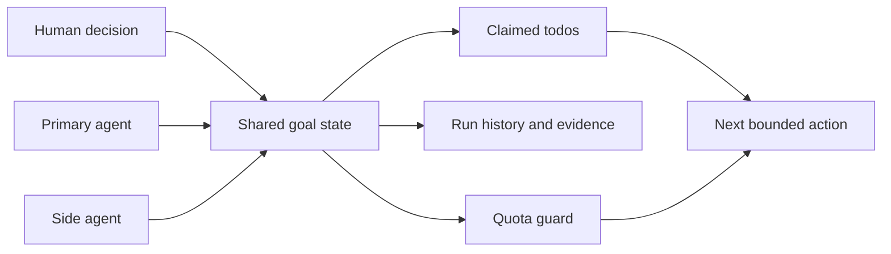
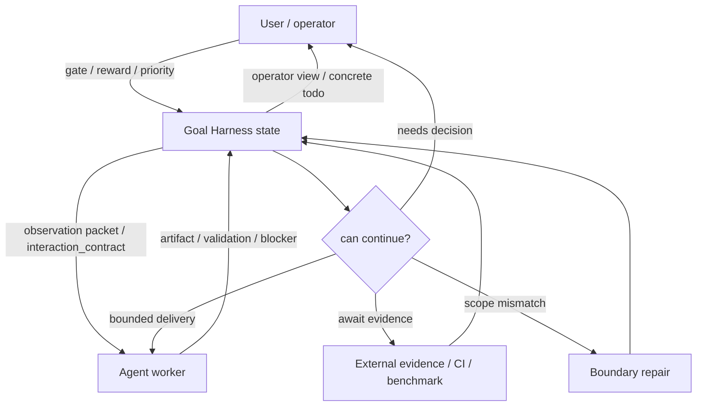
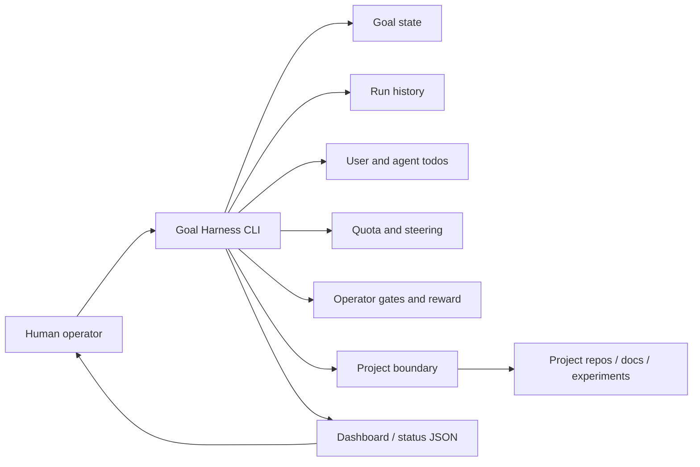

# Goal Harness

**Long-running agent work, without losing the plot.**

Goal Harness is a local control plane for AI agent projects: keep goals, gates,
todos, run history, quota, side-agent ownership, and human decisions visible
across many turns.

[Quick Start](#quick-start) · [Product Vision](docs/product/vision.md) ·
[Showcases](docs/showcases/README.md) · [Architecture](docs/architecture.md) ·
[Dashboard](#dashboard)

> Long-running agent work should be recoverable, reviewable, handoffable, and
> safe by default.

## What Is Goal Harness?

It does not replace Codex, Claude Code, Cursor, or another agent runtime. It
sits above them and gives humans and agents a shared way to track goals, gates,
run history, quota, feedback, and project boundaries across many turns.

The product promise is not "more todo lists." It is a better human-in-the-loop
control surface:

Goal Harness assumes the underlying agent loop is already capable. Its job is
to make that loop usable over long horizons: keep human judgment at high-value
decision points, keep safe fallback work moving when one lane is gated, and
stop compute spend when a turn cannot produce a verified transition.

- when a high-priority item is blocked on a human decision, the exact user todo
  stays visible instead of disappearing into chat;
- when safe fallback work exists, the agent can keep using the turn on lower
  priority validated work instead of idly waiting;
- the fallback is audited as fallback, with the blocker, boundary, evidence,
  and quota decision preserved for the next run.

For example, a benchmark rotation can mark a large local image acquisition as a
human decision, skip that gated lane, and continue safe no-upload work on other
benchmark families. The operator sees both facts: what needs a decision, and
why the agent is still allowed to make progress elsewhere.

First-screen mental model:



## See It In Action

| Case | What It Shows | Public Surface |
| --- | --- | --- |
| [Blocked P0 with safe P1/P2 rotation](docs/showcases/cases/0617-blocked-p0-safe-rotation.md) | A user-gated high-priority lane stays visible while safe fallback work continues. | Reproducible synthetic demo |
| [Goal Harness self-iteration loop](docs/showcases/cases/0619-goal-harness-self-iteration.md) | A side agent improved Goal Harness itself while the primary agent stayed focused on benchmark work. | Commit-backed public evidence case |
| [Dynamic workflow for hardware-agent development](docs/showcases/cases/0619-dynamic-workflow-hardware-agent.md) | A fuzzy multi-agent engineering workflow can converge through one shared control plane. | Redacted public-safe stub |

The full [showcase catalog](docs/showcases/README.md) keeps each case
public-safe, reproducible where possible, and ready for a future frontend
surface.

## Why It Matters

Short agent tasks usually fail because the model makes a bad local choice.
Long-running agent work fails differently: state drifts.

After several runs, several projects, or several handoffs, the hard questions
become:

- What is the current objective, and what is explicitly out of scope?
- Which document, owner decision, run artifact, or benchmark result is the
  current authority?
- What did the last agent run actually do, and how was it validated?
- Which next action belongs to the human, and which belongs to the agent?
- Which actions are safe read-only work, and which cross write, production,
  private-data, or publication boundaries?
- Which project should receive the next automatic agent turn?
- How does human feedback survive into the next run?

Goal Harness makes those questions machine-readable enough for agents and
legible enough for operators.

## Lifetime Goals

Goal Harness uses **lifetime goal** for a durable human or project intention
that can outlive any single chat thread, agent run, concrete todo, or
implementation plan. It does not grant open-ended autonomy: only the next
bounded transition is executable. The lifetime goal is the continuity layer
that keeps authority, human decisions, safety boundaries, evidence, and course
corrections legible for future humans and agents. See
[Architecture](docs/architecture.md#lifetime-goal-invariant) for the design
invariant.

## Product Vision

Goal Harness starts with AI coding, research, and benchmark loops because those
workflows make state drift easy to see. The broader product direction is a
lifetime-goal control plane for any long-running agent work where humans need
clear progress, gates, feedback, and recovery without reading raw logs.

One medium-term productization case is a creator-operator workflow: a
non-engineering user asks an agent to track social-platform trends, map them to
personal creative preferences, extract insights, draft content, and maintain a
material library. The bottleneck is not only model capability. The product has
to translate agent work into a friendly first screen: what happened, what is
happening, where it is blocked, what comes next, and how user feedback changes
the plan.

See [Product Vision](docs/product/vision.md) for the planned creator-operator
case, non-technical status model, fake-data demo path, and feedback/boundary
contract.

## Core Control Loop

Goal Harness sits between the operator, the agent loop, and external evidence.
It does not choose the model's task policy. It keeps the current facts,
boundaries, evidence, and decisions stable enough that each agent turn can be
bounded and recoverable.



The loop is intentionally conservative: user decisions become run-bound or
gate-bound events; agent work becomes artifacts, validation, or blockers;
external systems contribute evidence; and stale or missing write authority
routes to boundary repair instead of silent execution.

## What You Get



Core surfaces:

- **Goal state**: durable objective, non-goals, constraints, next actions, and
  progress for one goal.
- **Run history**: compact append-only events for each agent turn, validation
  result, blocker, benchmark result, reward, or quota spend.
- **Todos**: structured user and agent work items with explicit routing lanes
  such as `advancement_task`, `continuous_monitor`, `user_gate`, and `blocker`.
- **Quota and steering**: a guard that says whether an automatic agent turn
  should run, wait, ask the user, self-repair, or stay quiet.
- **Operator gates and reward**: human approvals and feedback tied to concrete
  runs instead of scattered chat memory.
- **Project boundary**: staged adapters that start read-only and require
  explicit authorization before write or production actions.
- **Dashboard feed**: a loopback JSON status surface and optional React UI for
  multi-project operator visibility.

## Good Fits

Use Goal Harness when agent work spans time, people, projects, or safety
boundaries:

- multi-day or multi-week engineering and research goals;
- recurring heartbeat or monitor-style agent turns;
- benchmark and experiment loops that must wait for evidence;
- projects with owner/SOP gates or human reward judgments;
- controller agents that spawn scoped child agents;
- creator, research, or operations workflows where non-engineering users need
  agent progress translated into clear state, blockers, and feedback prompts;
- public/private boundary checks before publishing artifacts;
- local dashboards that should foreground user decisions before raw logs.

Do not use Goal Harness as an autonomous production controller. It is a local
coordination substrate; project ownership and dangerous permissions stay with
the human/operator.

## Requirements

- Python 3.11+
- Git
- macOS or Linux shell environment
- Optional dashboard: Node.js 18+

The Python package has no runtime dependencies outside the standard library.

## Install

Install one shared local checkout manually, or let the Quick Start prompt ask
your agent to run these steps:

```bash
git clone https://github.com/huangruiteng/goal-harness ~/goal-harness
~/goal-harness/scripts/install-local.sh
goal-harness doctor
```

The installer creates:

- `~/.local/bin/goal-harness`, pointing at a stable local release snapshot;
- `~/.local/bin/goal-harness-canary`, pointing at the live checkout;
- the Goal Harness Codex skills under `~/.codex/skills`.

Those global skills are the intended product surface for reusable Goal Harness
agent behavior; project-specific state and private decisions stay in the local
registry and active goal files.

Use the canary wrapper for one or two selected controllers before promoting a
checkout to the default local release.

## Quick Start

If you already use Codex, Claude Code, Cursor, or another terminal agent, the
fastest path is to ask that agent to install and connect Goal Harness for the
current project. Paste this into the agent from your project repo:

```text
Install and connect Goal Harness for this project end to end. Do not stop at a
plan.

If `goal-harness` is not on PATH:
- clone https://github.com/huangruiteng/goal-harness to ~/goal-harness if it is
  not already present;
- run ~/goal-harness/scripts/install-local.sh;
- export PATH="$HOME/.local/bin:$PATH".

Then:
1. Run `goal-harness doctor`.
2. Choose a stable goal id from this repo name unless I gave one explicitly.
3. Read the project goal doc if present (`GOAL.md`, `README.md`, or the doc I
   name); otherwise ask me for a one-sentence objective.
4. Run `goal-harness connect` or `goal-harness bootstrap` for this repo with
   that goal id, objective, domain, and goal doc.
5. Read the `Onboarding Scan`, `Proposed Onboarding Candidates`,
   `Accept Candidate Commands`, and `Autonomy Choice` from the connect output.
   Briefly explain the candidate agent todos to me and ask:
   - which candidates I accept, edit, or reject;
   - whether `autonomous=yes`, meaning you may start the first accepted agent
     todo after the quota guard passes.
   Do not make me run the acceptance commands manually; run the accepted
   `goal-harness todo add ...` commands yourself. If I choose
   `autonomous=no`, stop after `goal-harness refresh-state`.
6. Ensure `.goal-harness/` and `.codex/goals/` are ignored in this project.
7. Run `goal-harness registry`, `goal-harness status`, and
   `goal-harness check --scan-root .`.
8. Report the goal id, created files, current user todo, current agent todo,
   and next safe action.

Do not commit `.goal-harness/`, `.codex/goals/`, live ACTIVE_GOAL_STATE files,
runtime registries, raw logs, credentials, or private local paths.
```

For a longer generated handoff prompt, install once and run:

```bash
goal-harness new-project-prompt \
  --project /path/to/your-project \
  --goal-doc /path/to/your-project/GOAL.md
```

The command output is meant to be pasted into Codex or Claude Code. It contains
the full guard, quota, todo, and heartbeat protocol for a new project.

Success looks like this:

- `goal-harness doctor` passes;
- the project has `.goal-harness/registry.json`;
- the project has `.codex/goals/<goal-id>/ACTIVE_GOAL_STATE.md`;
- `goal-harness status` shows the goal and who should act next;
- local runtime state is ignored, not committed.

Maintainers can validate the public fresh-clone path with:

```bash
python3 examples/fresh-clone-quickstart-smoke.py
```

## Diagnose From Your Agent

Users should not need to run diagnostic commands by hand. Ask your Codex,
Claude Code, Cursor, or terminal agent:

```text
Diagnose Goal Harness for this project end to end. Do not ask me to run shell
commands.

If `goal-harness` is missing, install or repair it first. Then run
`goal-harness diagnose` yourself, read the diagnostic packet, and use your own
reasoning to tell me:
- whether this project can currently self-drive;
- what evidence supports that answer;
- what is blocking it, if anything;
- the exact question I need to answer, if a user/controller gate exists;
- what you will do next.

Do not treat Goal Harness machine signals as the final verdict. They are
evidence for your diagnosis.
```

`goal-harness diagnose` is intentionally an agent-facing evidence packet. It
collects compact `status`, `quota should-run`, todo, interaction-contract, and
boundary signals, then gives the agent a reasoning checklist. The agent makes
the diagnosis in natural language.

If you want to try Goal Harness before connecting a real repo, create a
disposable demo goal:

```bash
export PATH="$HOME/.local/bin:$PATH"
goal-harness demo
```

Expected first-run signals:

- the output contains `ok: True`;
- a project-local registry and active goal state were created under
  `/tmp/goal-harness-demo`;
- one user todo and one agent todo are visible;
- `refresh-state` appended a compact run;
- `quota should-run` returns `should_run=True` and `state=eligible`.

Inspect the demo:

```bash
cd /tmp/goal-harness-demo
goal-harness status
goal-harness quota should-run --goal-id demo-goal
goal-harness history --goal-id demo-goal
```

## Contributing

External contributors should start with
[CONTRIBUTOR_TASKS.md](CONTRIBUTOR_TASKS.md) for public, claimable work and
[CONTRIBUTING.md](CONTRIBUTING.md) for setup, validation, and boundary rules.

Goal Harness keeps local active goal state separate from the public repository:
do not commit `.goal-harness/`, `.codex/goals/`, live
`ACTIVE_GOAL_STATE.md`, raw benchmark traces, or private operator artifacts.

## Connect A Project

Most users should let Codex or Claude Code run this through the Quick Start
prompt. If you prefer to connect a repo manually, run this from the project
repository:

```bash
cd /path/to/your-project
goal-harness bootstrap \
  --goal-id your-project-goal \
  --objective "Improve this project through bounded, verified goal segments." \
  --goal-doc GOAL.md
```

`connect` is an alias for `bootstrap`:

```bash
goal-harness connect --goal-id your-project-goal
```

This creates or connects:

```text
your-project/
  .goal-harness/registry.json
  .codex/goals/your-project-goal/ACTIVE_GOAL_STATE.md

~/.codex/goal-harness/
  goals/<goal-id>/runs/
```

Treat live goal state and registries as local runtime data. Add these paths to
the connected project `.gitignore` before committing:

```gitignore
.goal-harness/
.codex/goals/
goals/**/ACTIVE_GOAL_STATE.md
```

Commit only sanitized templates or examples, not a controller's live
`ACTIVE_GOAL_STATE.md`.

## Daily Workflow

Inspect installation and registry health:

```bash
goal-harness doctor
goal-harness registry
goal-harness check --scan-root .
```

Read status and history:

```bash
goal-harness status
goal-harness history --goal-id your-project-goal
```

Add explicit work:

```bash
goal-harness todo add \
  --goal-id your-project-goal \
  --role user \
  --text "Review the owner checklist."

goal-harness todo add \
  --goal-id your-project-goal \
  --role agent \
  --text "Summarize the safe read-only evidence." \
  --task-class advancement_task \
  --action-kind evidence_summary
```

Complete an agent todo and atomically add the next executable item:

```bash
goal-harness todo complete \
  --goal-id your-project-goal \
  --todo-id todo_ab12cd34ef56 \
  --evidence "Validated with examples/demo-cli-smoke.py" \
  --next-agent-todo "Run the next bounded validation slice." \
  --next-task-class advancement_task \
  --next-action-kind validation \
  --execute
```

Append a state-only refresh after local state/docs change:

```bash
goal-harness refresh-state --goal-id your-project-goal
```

Generate a compact handoff packet for an agent:

```bash
goal-harness review-packet --goal-id your-project-goal
```

Record an operator gate decision or run-bound reward:

```bash
goal-harness operator-gate \
  --goal-id your-project-goal \
  --decision approve \
  --reason-summary "Approve read-only map opt-in"

goal-harness reward \
  --goal-id your-project-goal \
  --decision continue_route \
  --reward positive \
  --reason-summary "validation improved and the route is worth extending"
```

## Heartbeats And Quota

Quota is compute eligibility, not strategy. It answers whether an automatic
turn may run now, and what kind of turn is allowed.

```bash
goal-harness quota status
goal-harness quota plan
goal-harness quota should-run --goal-id your-project-goal
```

The `next_automatic_turn` reported by `quota plan` is only an advisory
scheduling hint: it chooses the highest-compute eligible goal, while
operator-gated, focus-waiting, waiting, throttled, paused, and health-blocked
goals stay out of the eligible lane.

`quota should-run` returns the machine contract a heartbeat should obey:

- `should_run`: whether delivery work may run now;
- `waiting_on`: user, controller, Codex, external evidence, health, or quota;
- `work_lane_contract`: the next executable lane or monitor/blocker lane;
- `execution_obligation`: whether the agent must attempt a bounded segment;
- user and agent todo summaries;
- safe-bypass or self-repair hints, when enabled;
- the exact spend policy.

Agent todo summaries separate `first_executable_items` from
`monitor_open_items`: executable items drive the selected goal's primary action,
while monitor items stay visible as supplemental observation context and only
spend compute when they produce a material transition or blocker.

Registry entries can expose per-goal `control_plane` policy. For example,
`control_plane.self_repair.enabled=true` lets `quota should-run` return a
bounded `decision=self_repair` contract for repairable control-plane stalls;
missing policy defaults off, so other goals keep their normal skip or wait
behavior.

If `quota should-run` returns a `gate_prompt` or `operator_question`, the
target heartbeat should proactively ask that concrete user/controller gate. If
open user todos are present, do not call the turn "no new user action" while
they remain open; its report still has to list existing open user todos. When
`notify_user_on_open_todo=true`, skip delivery work and quota spend for that
blocker-push turn. When `safe_bypass_allowed=true`, the heartbeat may still do
one bounded read-only steering or analysis step that is independent of the
blocked gate.

See `docs/quota-allocation.md` for the full allocation contract.

After an automatic turn actually spends delivery compute, append one spend
event:

```bash
goal-harness quota spend-slot \
  --goal-id your-project-goal \
  --slots 1 \
  --source heartbeat \
  --execute
```

Do not append spend for quiet `should_run=false` skips, preflight failures, or
pure dry-run previews.

Generate a guarded Codex App heartbeat body:

```bash
goal-harness heartbeat-prompt --thin --goal-id your-project-goal
```

For shared-control-plane agents, pass identity and scope in the automation
prompt, then let the agent soft-claim matching todos with a registered
`--claimed-by` id:

```bash
goal-harness configure-goal --goal-id your-project-goal \
  --registered-agent codex-main-control \
  --registered-agent codex-side-bypass \
  --primary-agent codex-main-control \
  --execute

goal-harness heartbeat-prompt --compact --goal-id your-project-goal \
  --agent-id codex-side-bypass \
  --agent-scope "control-plane coordination"
```

Once `coordination.registered_agents` is set, `heartbeat-prompt` fails closed
when called without `--agent-id`; this makes stale Codex App automations surface
an upgrade error instead of silently running without identity or scope. Old goal
registries without `coordination.registered_agents` also fail closed when a
scoped heartbeat or todo claim names an agent; register the agent identity first
instead of letting workers invent claim ids. Set exactly one
`coordination.primary_agent`: that primary agent owns final review,
verification, merge, publication, and high-risk side-agent review. Side agents
are prompted to work in separate worktrees. Small AGENTS-eligible validated
changes may be self-merged with explicit Goal Harness evidence; higher-risk or
unclear work should still be handed back through a primary review todo.

See [docs/quota-allocation.md](docs/quota-allocation.md) and
[docs/heartbeat-automation-prompt.md](docs/heartbeat-automation-prompt.md).

## Dashboard

Dashboard status: experimental operator preview. The CLI and
`goal-harness status` remain the canonical daily workflow; the React dashboard
is useful for demos, public-safe fixtures, and local inspection, but it has not
yet received the same product iteration as the CLI, benchmark adapters, and
control-plane contracts.

Serve status JSON:

```bash
goal-harness serve-status --port 8765
```

Run the dashboard:

```bash
cd ~/goal-harness/apps/dashboard
npm install
npm run dev
```

For the shared multi-project view:

```bash
goal-harness serve-status --global-registry --port 8766 --limit 80
```

On macOS, keep the global feed and built dashboard running after login:

```bash
~/goal-harness/scripts/macos-dashboard-launchagent.sh install
~/goal-harness/scripts/macos-dashboard-launchagent.sh status
```

The dashboard should answer, before raw log drill-down:

- what the human needs to judge;
- what Codex can do next;
- what is waiting on evidence;
- what boundary cannot be crossed yet.

See [apps/dashboard/README.md](apps/dashboard/README.md).

## Public / Private Boundary

Safe to publish:

- registry schema and runtime layout;
- adapter lifecycle and generic control-plane contracts;
- sanitized examples and smoke fixtures;
- generic validation commands.

Keep private:

- real local paths;
- task ids and internal document links;
- production logs and raw experiment metrics;
- credentials and auth material;
- user-specific active goal state and local registries;
- raw agent sessions or benchmark traces.

Run the public/private scan before publishing docs or examples:

```bash
goal-harness check \
  --scan-path README.md \
  --scan-path docs/ \
  --scan-path examples/
```

See [docs/public-private-boundary.md](docs/public-private-boundary.md).

## Development

Run the focused CLI and contract smokes from the repository root:

```bash
python3 -m py_compile goal_harness/*.py
python3 examples/demo-cli-smoke.py
python3 examples/todo-cli-smoke.py
python3 examples/todo-lifecycle-cli-smoke.py
python3 examples/quota-contract-smoke.py
python3 examples/review-packet-cli-smoke.py
python3 examples/benchmark-run-v0-append-cli-smoke.py
git diff --check
```

For dashboard work:

```bash
cd apps/dashboard
npm install
npm run build
npm run smoke:demo-readiness
```

For release-promotion readiness:

```bash
python3 examples/canary-promotion-readiness-smoke.py
goal-harness promotion-gate --format json
goal-harness upgrade-plan --format json
```

## Documentation Map

Start here:

- [Documentation index](docs/README.md)
- [Showcase catalog](docs/showcases/README.md)
- [State interaction model](docs/state-interaction-model.md)
- [Interaction pattern catalog](docs/interaction-pattern-catalog.md)
- [Integration guide](docs/integration.md)
- [Attention queue](docs/attention-queue.md)
- [Project agent todo contract](docs/project-agent-todo-contract.md)
- [Quota allocation](docs/quota-allocation.md)
- [Heartbeat automation prompt](docs/heartbeat-automation-prompt.md)
- [Long-task cadence policy](docs/long-task-cadence-policy.md)
- [Public/private boundary](docs/public-private-boundary.md)
- [Benchmark developer workflow](docs/benchmark-developer-workflow.md)
- [Public launch narrative draft](docs/outreach/public-launch-narrative-draft.md)
- [Xiaohongshu launch draft](docs/outreach/xiaohongshu-launch-draft.md)
- [Dashboard status contract](docs/status-data-contract.md)
- [Codex subagent orchestration](docs/codex-subagent-orchestration.md)
- [Benchmark long-run design](docs/research/long-horizon-agent-benchmarks/codex-cli-long-run-benchmark-design.md)

## Command Reference

```text
bootstrap / connect     connect a project-local goal
new-project-prompt      generate a Codex prompt for project connection
demo                    create a disposable local demo goal
doctor                  diagnose installation and import health
registry                inspect registered goals
registry-boundary       classify registry local/public boundary and push policy
status                  show first-screen operator status
diagnose                build an agent-facing diagnostic evidence packet
history                 read run history
refresh-state           append a state-only run
read-only-map           map a project without mutating files
operator-gate           record a human gate decision
reward                  append run-bound human reward
todo                    add, claim, complete, update, supersede, or archive todos
quota                   inspect or account for automatic agent turns
heartbeat-prompt        generate Codex App heartbeat task bodies
upgrade-plan            plan local default-upgrade heartbeat propagation
review-packet           package a CLI-visible handoff packet
serve-status            serve local status JSON for the dashboard
archive-runtime         archive obsolete runtime-only goal history
sync-global             merge project registry into the global registry
check                   run contract and public/private boundary checks
```

Use `goal-harness <command> --help` for command-specific flags.

## Repository Quality Guard

This repository should stay readable to a new contributor. Treat these as
periodic maintainer checks:

- the README first screen explains the product before internal operations;
- quick start commands still run on a clean checkout;
- live local state is not committed;
- public/private scan is clean before docs or examples are published;
- docs linked from the README still exist and describe current CLI behavior;
- smoke commands cover the highest-risk control-plane contracts.

## Current Status

Goal Harness is early. It is not a full agent platform and not an autonomous
production controller.

The current milestone is a useful local substrate for goal state, run history,
operator gates, human reward, structured todos, quota-aware heartbeats,
read-only project maps, benchmark control-plane evidence, and a small
multi-project dashboard.

The next milestones are stronger project adapters, safer controller/sub-agent
coordination, better benchmark-runner ergonomics, a more polished operator
view, and creator/operator showcases that make the same control-plane value
legible beyond software engineering.

## License

MIT. See [LICENSE](LICENSE).
