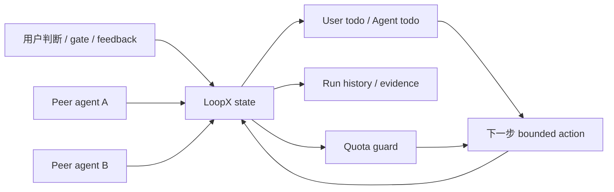

# LoopX


**面向长程 AI Agent 和平级 agent team 的 Loop Engineering 控制面。**

**一个轻量 state kernel，把静态 goal 变成动态、人类在环、可持续接力的 agent loop。**

**让复杂目标持续流转：人把控判断，agent 接力执行，状态不漂移。**

LoopX 是一个 agent-agnostic 的本地 loop-engineering 控制面。它不替代
Codex、Claude Code、Cursor 或其他 agent runtime，而是把这些 runtime
跨小时、跨天、跨交接、跨用户反馈继续工作时需要共享的状态稳定下来。

LoopX 把一次性的 prompt 或静态 goal 变成可演化、可复盘、可接力的动态
loop 状态：目标、用户决策、agent todo、认领关系、scope、scheduler hint、
quota、证据、run history 和 handoff 留在同一层轻量状态里。该等人的地方明确等人，
不该空等的安全侧路继续推进，每一次自动执行都留下边界、验证面和写回轨迹。

注册 agent 彼此平级：由 todo claim / lease、任务边界、能力门和 typed
continuation 决定下一步谁执行，不需要一个长期拥有全局权限的 leader agent。

新用户不需要一开始就设计完整 agent 平台。LoopX 提供可读的 preset 卡片：
Daily Triage、Changelog Draft、PR Watch 先做 report/draft/watch；CI Sweeper
和 Dependency Sweeper 这类高价值自动修复路径默认只给 dry-run 或 policy report，
只有显式 opt-in 后才进入隔离 worktree、verifier、quota/cost gate 和人工 review。

[English](README.md) · [快速开始](#快速开始) · [用户手册](https://my.feishu.cn/wiki/CaL5wMk9ui17ngkWzeUcMlAYnZg) · [看几个例子](#看几个例子) ·
[Showcases](docs/showcases/README.md) · [用户群与反馈](#用户群与反馈) ·
[产品愿景](docs/product/vision.md) · [架构](docs/architecture.md)

## 快速开始

最快的方式是让你已经在用的 agent 从当前项目里启动 LoopX：Codex App 用
heartbeat，Codex CLI 保留可见 TUI，其他 agent 或手动 shell 走同一个 no-clone
安装路径。

### Codex App

适合希望 LoopX 通过 Codex App heartbeat 持续推进的项目。把这段发给当前项目线程：

```text
请把当前项目接入 LoopX。
普通使用不要 clone LoopX 仓库。若 `loopx` 不在 PATH，请使用官方 no-clone
installer 安装或修复：
curl -fsSL https://raw.githubusercontent.com/huangruiteng/loopx/main/scripts/install-from-github.sh | bash

然后运行 `loopx doctor`。只在当前项目根目录操作：如果项目已存在 LoopX 状态，
请复用，不要新建或覆盖 goal；如果尚未接入，优先用 `loopx connect`，只有明确
缺少 goal 状态且需要初始化时才用 `loopx bootstrap`。确保 `.loopx/`、
`.codex/goals/`、`.local/` 不会被提交。项目连接后，用
`loopx heartbeat-prompt --thin` 生成 task body，并设置或刷新这个 Codex App
heartbeat 为每 3 分钟运行一次。然后停止，不要在接入这轮开始长任务；只汇报
goal id、当前 user gate、top agent todo 和下一步安全动作。
```

recurring heartbeat body 由 CLI 生成：

```bash
loopx heartbeat-prompt --thin --goal-id <goal-id> --agent-id <agent-id> --agent-scope "<scope>"
```

如果之后用 `loopx configure-goal` 或控制面 UI 调整
`registered_agents`，请按输出里的 `heartbeat_prompt_migration` 重新生成并更新
Codex App automation。v0.1 层级模型升级会只投影一次带稳定 migration id 的
`automation_prompt_upgrade`：先幂等更新宿主 automation，再执行 completion
command；重复 ack 是 no-op，不会反复唤醒用户。Codex App 降频时，按
`quota should-run.scheduler_hint.codex_app.ack_hint.cli_args` 执行即可；新输出会使用
`quota scheduler-ack-current` 读取最新 hint，避免手抄已过期的 reset token。

### Codex CLI

适合希望保留可见 TUI、随时观察和接管的用户。从项目 repo 打开 Codex CLI：

```bash
cd /path/to/your-project
codex
```

然后在 TUI 里粘贴一条消息：

```text
请在这个可见 Codex CLI TUI 中把当前 repo 接入 LoopX。普通使用不要 clone LoopX
仓库。若 `loopx` 不在 PATH，请使用官方 no-clone installer 安装或修复：
curl -fsSL https://raw.githubusercontent.com/huangruiteng/loopx/main/scripts/install-from-github.sh | bash

然后运行 `loopx doctor`。只在当前项目根目录操作：如果项目已存在 LoopX 状态，
请复用，不要新建或覆盖 goal；如果尚未接入，优先用 `loopx connect`，只有明确
缺少 goal 状态且需要初始化时才用 `loopx bootstrap`。确保 `.loopx/`、
`.codex/goals/`、`.local/` 不会被提交。请留在这个 TUI，不要使用隐藏 headless
执行；项目连接后，生成 thin heartbeat prompt 并把当前 Codex CLI goal 设置为
`/goal <thin task_body>`。然后停止，不要在接入这轮开始长任务，只汇报 goal id、
当前 user gate、top agent todo 和下一步安全动作。
```

这条消息就是安装、连接、heartbeat 设置和状态检查。更细的生成模板、idle/proof 边界见
[Getting Started](docs/guides/getting-started.md)。

### Claude Code

在 Claude Code 上,LoopX 以**原生 `/loop` + LoopX 控制面 MCP** 的方式运行:`/loop`
作为运行时驱动每一轮,LoopX 的 `should_run` 负责把关。适配器是 **opt-in 的**,不显式开启
就绝不写 `~/.claude`。开启后,在 Claude Code 里用 `/loopx <任务>` 设目标、再 `/loop` 推进。
opt-in 安装、scope 选择、可选的 `--harden` 闸门与卸载详见
[loopx/claude_goal_mode/README.md](loopx/claude_goal_mode/README.md)。

### 其他 Agent / 手动 Shell

Cursor、其他终端 agent 或手动 shell 都走同一个 no-clone installer。
但这里要更谨慎：非 Codex agent 只有在至少具备一种可被 LoopX 驱动的控制能力时才适合
走 agent-first 路径，例如能运行 shell/CLI、支持 goal/task 指令、能接入 automation
或 heartbeat、或者自身有 loop/scheduler。否则 LoopX 仍可记录项目状态，但用户需要把
下面的 shell 命令手动跑完。

```bash
curl -fsSL https://raw.githubusercontent.com/huangruiteng/loopx/main/scripts/install-from-github.sh | bash
export PATH="$HOME/.local/bin:$PATH"
loopx doctor
cd /path/to/your-project
loopx bootstrap \
  --goal-id your-project-goal \
  --objective "Improve this project through bounded, verified goal segments." \
  --goal-doc GOAL.md
```

成功连接后应该能看到 `.loopx/registry.json`、
`.codex/goals/<goal-id>/ACTIVE_GOAL_STATE.md`、`loopx status` 的下一步投影；
这些本地状态必须被 gitignore，不要提交到公开仓库。

命令注册是 host-specific 的，但状态路径不是。Codex 表面当前可通过 `$loopx`
或 `/skills` 里的 `loopx` 命令 facade 进入；Claude Code 在 opt-in adapter
安装后可用 `/loopx <任务>`，再用 `/loop` 推进。若某个 host 里看不到命令，先跑
`loopx slash-commands` 查看当前命令清单；项目目标可用
`loopx start-goal --guided --project . --goal-text "<任务>"` 从 shell 进入同一条
agent-safe 路径。需要低层 handoff packet 的 host/plugin 集成仍可使用
`loopx bootstrap-command-pack --project . --goal-text "<任务>"`。
完整路由和恢复细节见 [Getting Started](docs/guides/getting-started.md) 与
[host command registry contract](docs/reference/protocols/codex-app-host-command-registry-v0.md)。

## 看几个例子

想先看完整说明或证明，再读控制面细节，可以从这几个入口开始：

- [飞书用户手册](https://my.feishu.cn/wiki/CaL5wMk9ui17ngkWzeUcMlAYnZg)：
  公开 onboarding 手册，包含 Quick Start、技术/产品要点、FAQ 和精选案例。
- [Hosted Frontstage](https://huangruiteng.github.io/loopx/frontstage/)：
  公开 showcase 首页，用 canonical case cards 解释 LoopX 解决什么问题。
- [Blocked P0 with safe P1/P2 rotation](docs/showcases/cases/0617-blocked-p0-safe-rotation.md)：
  一个可复现 synthetic demo，展示用户决策保持可见时，安全侧路仍可继续推进。
- [LoopX self-iteration](docs/showcases/cases/0619-loopx-self-iteration.md)
  和 [hardware-agent workflow](docs/showcases/cases/0619-dynamic-workflow-hardware-agent.html)：
  用 public-safe 证据展示同一控制面如何协调平级 agent、scope 和 ownership。

完整案例目录见 [docs/showcases/README.md](docs/showcases/README.md)。
更完整的演示材料放在文末“可选与演进中能力”里。

### 真实长程 Loop

点击原图可以查看跨轮次保留下来的 graph / workspace、证据分支、agent 进展和终局决策。

**开源 Issue Fix：Focused PR 交付与可复用能力互相反哺。**

<a href="docs/assets/openviking-issue-fix-explore.png">
  
</a>

**Auto ML Experiment：假设、matched evidence、无效谱系、运行中复现和
promote / stop gate 留在同一张图中。**

<a href="docs/assets/auto-ml-experiment-explore.jpg">
  
</a>

**Auto Research：proposer、executor、evaluator/promoter 并行迭代，todo、quota、
证据与 targeted wake 同屏可见。**

<a href="docs/assets/auto-research-multi-agent-showcase.png">
  
</a>

## 它是什么

LoopX 不是另一个 agent runtime，也不是要替代 Codex、Claude Code、
Cursor 或其他终端 agent。更准确地说，它是 loop engineering 的控制面：
runtime 负责执行一次次 bounded agent loop，LoopX 负责保存这些 loop 继续工作所需
的动态目标状态。

| 层次 | 负责什么 |
| --- | --- |
| Codex / Claude Code / Cursor | 执行 bounded agent loop，写代码、读文件、运行命令、回复用户 |
| goal mode / automation / CLI 脚本 / TUI | 触发或调度下一次 executor loop |
| LoopX | 维护动态 loop 状态：当前目标、用户决策、agent todo、run history、quota、证据、边界和交接 |

一句话：LoopX 不是执行器，而是让 goal mode、automation、CLI 脚本或可见 TUI
触发的 agent loop 都能共享同一份动态长期目标状态。

## 为什么 Loop Engineering 需要控制面

短任务失败，常常是因为模型某一步做错了。长期任务失败，更常见的原因是
state drift。

Loop engineering 常常从一个定时器、一段长 prompt、一个 shell 脚本或一个可见
TUI session 开始。它们能证明想法，但不足以承载真实工作：一旦目标变化、用户反馈
出现、owner gate 卡住、多 agent 同时碰同一个 repo，就需要共享状态，而不是继续依赖
聊天记忆。

- 用户已经做过的决策散落在聊天里，后续 agent 不知道；
- P0 卡在 user gate 上，agent 只会空等，或者绕过人类决策继续乱跑；
- 多个 agent 同时工作，却看不到彼此认领了哪些 todo；
- 上一轮到底做了什么、怎么验证的、为什么没继续，难以复盘；
- public/private 边界、benchmark no-upload 边界、生产权限边界没有被稳定投影；
- 人类反馈没有沉淀成下一轮 agent 能读懂的控制面信号。

LoopX 的产品判断是：强能力 agent loop 已经存在，问题在于如何把它变成长期
可用、可控、可解释的协作系统。

换句话说，LoopX 想让人的多个 agent 可以持续接力，包括夜间和用户离开后的安全工作；
但接力的前提不是绕过人，而是把人类判断、scope、能力门、quota 和证据写成下一轮
agent 也能读懂的控制面。

## 它如何工作



核心对象：

- **Lifetime goal**：能跨越单个聊天、单个 agent run、单个 todo 的长期目标。
- **User gate**：需要人类判断的位置，明确停下并把问题投影出来。
- **Safe fallback**：不依赖该 gate 的安全侧路，允许继续推进并留下证据。
- **Todo ownership**：agent 通过 `claimed_by` 认领 todo，减少并发冲突。
- **Quota guard**：每次自动 heartbeat 前判断是否应该运行、等待、通知或自修复。
- **Run history**：把每轮进展、验证、blocker、reward、quota spend 记录成紧凑历史。
- **Read-first management surface**：本地 dashboard 用于项目选择、todo 搜索、
  agent lane、user gate、证据和 review 信号。
- **Performance review**：用产出数量、产出质量、token cost 和 user attention cost
  评价长期 Loop Agent 的项目级价值。

## 适合什么场景

LoopX 适合长期、多人、多 agent 或带边界的工作：

- 多天或多周的工程、研究、benchmark、实验推进；
- Codex / Claude Code / Cursor 的 recurring heartbeat 或 monitor-style 工作；
- 需要等待 CI、benchmark、外部 owner、用户判断的项目；
- 多个平级 agent 通过 claim、lease 和明确 continuation 协作；
- 需要把“agent 做了什么、卡在哪、下一步是什么”翻译给非技术用户的产品；
- 发布公开材料前需要持续检查 public/private 边界的项目。

它不适合直接作为生产自动化控制器。危险权限、生产操作、私有材料公开、发布
动作仍然应该由人类或宿主项目明确授权。

## 用户群与反馈

LoopX 还在早期，最需要真实长期 agent 任务里的反馈：控制面帮到了哪里、
哪里太重、哪些 user gate / handoff / scope 仍然不够清楚。

- 可复现 bug、安装问题、功能建议：请优先提
  [GitHub Issue](https://github.com/huangruiteng/loopx/issues)。
- 文档修正、showcase 补充、小型 public-safe 示例：欢迎直接开 PR。
- 想快速交流、试用 onboarding、一起打磨 showcase：欢迎优先加入飞书用户群；
  实现问题和贡献协作可加入飞书开发群；微信群作为备用入口，二维码可能过期，
  失效时请先走飞书或提 Issue 提醒更新。

<table>
  <tr>
    <td align="center" width="240">
      <br>
      飞书用户群
    </td>
    <td align="center" width="240">
      <br>
      飞书开发群
    </td>
    <td align="center" width="240">
      <br>
      微信用户群，可能过期
    </td>
  </tr>
</table>

## 产品化方向

当前仓库从 coding、research 和 benchmark loop 开始，因为这些场景最容易暴露
长期 agent 工作的控制面问题。中期产品化方向会继续把 LoopX 推到更广的
用户场景，例如创作者/自媒体运营：

- agent 长期探测社交平台热点；
- 根据个人创作偏好形成热点地图；
- 提取 insight，辅助文章、脚本、视频选题；
- 沉淀个人素材库和语料库；
- 用友好的首屏告诉非技术用户：做了什么、正在做什么、卡在哪里、下一步是什么。

这个方向的核心不是炫耀模型能力，而是把 agent 活动转成用户能理解、能反馈、
能约束的产品对象。见 [docs/product/vision.md](docs/product/vision.md)。

## 贡献

公开、可认领的任务见 [CONTRIBUTOR_TASKS.md](CONTRIBUTOR_TASKS.md)。贡献前请读
[CONTRIBUTING.md](CONTRIBUTING.md)，尤其是 public/private 边界、smoke 保留规则和
benchmark 证据边界。

项目角色与维护权限见 [GOVERNANCE.md](GOVERNANCE.md)，创建者与贡献者归属见
[AUTHORS.md](AUTHORS.md)，关键公开演进见
[docs/project/history.md](docs/project/history.md)，名称与标识使用见
[TRADEMARKS.md](TRADEMARKS.md)。

默认不要提交：

- `.loopx/`、`.codex/goals/`、live `ACTIVE_GOAL_STATE.md`；
- 内部文档链接、聊天截图、raw benchmark task/log/trajectory/verifier output；
- credentials、tokens、私有本地路径或生产 task id；
- 未脱敏的用户、团队、客户、项目名称。

可以提交：

- public-safe docs、case cards、synthetic demos；
- 稳定 CLI/runtime 行为的 focused smoke；
- 控制面协议、架构说明、贡献者任务；
- 明确标注 evidence boundary 的展示材料。

## 可选与演进中能力

下面这些能力不放进主线 getting-started，是为了让第一次接入保持克制。其中
Explore Graph / Explore Harness 已经是正式支持、默认关闭、按 goal opt-in 的可选
能力；更新的 adapter 仍会继续打磨 first-run UX、安全默认值和 evidence contract。

第一次跑出有用结果不需要配置这些可选能力。只有当具体任务确实需要 bounded child
agent、Explore Graph 或 Explore Harness 时，再先查看该 goal 的只读配置目录：

```bash
loopx configure-goal --goal-id <goal-id>
```

目录会给出当前值、默认值、适用条件、不会授予的权限，以及可复制的 preview /
apply / disable / verify 命令模板；完整设置面仍由
`loopx configure-goal --help` 提供。没有 `--execute` 时只做预览；不要因为能力存在
就主动开启。

### 先跑一个有用的 Loop

想先感受 LoopX 能做什么，可以从只读 preset 开始：

```bash
loopx doctor
loopx preset list
loopx preset show daily-triage
loopx start-goal --guided --project . --goal-text 'Run Daily Triage L1 for this repository: inspect LoopX status, active todos, open gates, stale signals, and next actions; write a compact report and ask before code edits or external writes.'
```

这些命令不会直接写项目状态、安装 automation、改文档或开 PR；它们渲染真实的
`/loopx`、`start-goal`、`quota should-run` 和 `heartbeat-prompt` 命令包。
项目接入后，可以用 `loopx ready-score --goal-id <goal-id> --agent-id <agent-id>`
做只读 readiness 检查，判断是否适合开启 recurring loop。

推荐先看：

- **Daily Triage L1**：从 status、todo、gate 和 single next action 生成安全项目摘要。
- **Changelog Draft L1**：把近期合并工作整理成带 PR 链接的 release-note 草稿。
- **PR Watch L1**：监听 review、CI、merge blocker，但不自动合并。
- **CI Sweeper L2 / Dependency Sweeper L2**：高价值 opt-in 修复路径，先报告，再在明确授权后尝试有边界 patch。

### Auto Research 一键启动

Auto research 是 LoopX 当前最适合展示 agent team 的实验性 preset：用户只提供一个
开放问题，preset 提供研究角色、handoff hint 和 seed todo，通用 multi-agent kernel
负责启动可见 Codex CLI pane、frontier、quota、evidence 和接管/停止控制。

```bash
loopx auto-research "How should we evaluate whether multi-agent auto research creates value?"
loopx auto-research start "How should we evaluate whether multi-agent auto research creates value?" --execute
```

第一条命令渲染 contract 和下一步 launch packet；`start --execute` 会创建隔离的
research frontier 并启动可见 lane。研究进展仍必须由 lane 做真实工作后写回 LoopX
状态，不能把启动 pane 或 tick 当成研究完成。完整路径见
[Auto-research command path](docs/guides/auto-research-command-path.md)。

### Explore Graph 和 Explore Harness（正式可选，默认关闭）

更长的探索型目标可以使用正式支持的 Explore Result Layer，以及按 goal opt-in 的
Explore Harness。
Result Layer 把探索中的 `node`、`edge`、`finding` 记录成 public-safe、append-only
的探索图，再折叠成 summary、blocked frontier、Mermaid graph 和可选 operator sink。
Harness 读取这张图、open todo、ownership、capability 和 write-scope 信息，生成只读的
todo branch plan 或 worker lane plan。

适用边界：Explore Harness 依赖可量化的评估指标来比较 baseline、treatment 和
guardrail。对于开放任务，或者评估指标无法准确量化的场景，不推荐直接使用这个
harness；这类问题更适合先沉淀成人工判断、定性研究或更小的可度量子问题。

```bash
loopx explore node --goal-id <goal-id> --title "Map the next frontier"
loopx explore finding --goal-id <goal-id> --title "Confirmed reusable contract" --node <node-id>
loopx explore summary --goal-id <goal-id>
loopx explore graph --goal-id <goal-id> --graph-format mermaid
loopx explore worker-branch-plan --goal-id <goal-id> --harness-profile generic
```

这条路径默认关闭，并且按 goal opt-in。只有注册 goal 的
`spawn_policy.explore_harness.enabled=true` 时，`todo-branch-plan` 和
`worker-branch-plan` 才会输出有效规划；即使开启，它们也不会自动 claim todo、
acquire lease、启动 worker、改状态或 spend quota，只会生成 request packet 和建议命令，
再由宿主 runtime 或人通过正常 LoopX 生命周期显式执行。完整事件模型、per-goal gate、
adaptive-resilient profile 和 MoE router profile 见
[Explore capability guide](docs/capabilities/explore/README.md)。

### 审阅和管理 Agent 工作

项目接入后，可以把管理面作为 read-first 实验入口，而不是一上来就授予更多控制权。
它用于查看已接入项目、user gate、agent lane、todo 和 evidence，让用户先看清
agent 做了什么、哪里需要判断。

```bash
loopx serve-status --global-registry --port 8766 --limit 80
cd apps/presentation/dashboard && npm run dev
```

这个入口保持保守：CLI 状态仍然是事实源，浏览器写入需要显式本地 opt-in，
review 信号不会自动变成执行权限。更完整的设计见
[intelligent management surface](docs/product/intelligent-management-surface.md)
和 [project-level reward model](docs/product/project-level-reward-model.md)。
演示者需要 timed walkthrough 时，可以使用
[3 分钟 demo script](docs/outreach/frontstage-demo-script.md)。

### 长程 Agent 应用路径

这不会替代首屏。它给已经理解控制面价值的用户快速选一个今天就能用的 LoopX 能力。
同一套 goal / todo / quota / evidence / review contract 可以承接不同应用入口，
让用户直接感知到“agent 能持续把事情往前推”的增量：

| 应用路径 | 精简命令入口 | 预期产物 | 用户可感知增量 |
| --- | --- | --- | --- |
| [Issue / PR fix loop](docs/capabilities/issue-fix/README.zh-CN.md) | `/loopx Fix <github-issue-or-pr-url>`<br>`loopx issue-fix workflow-plan` | 可复核的修复包：repro、smoke 结果、可解释 reviewer 推荐和 PR-lifecycle evidence。 | issue 和 review comment 不再只是提醒人，而是驱动 agent 持续监控到终局的闭环入口。 |
| PR-sized refactor loop | `/loopx <refactor goal>`<br>`loopx canary plan` | 可 review 的 slice 列表、验证记录、后续 todo、merge 边界。 | 增加可合并 change，而不是第二天早上面对一个巨型 diff。 |
| Research / experiment loop | `loopx auto-research start "<open question>" --execute`<br>`loopx ml-experiment preview --format json` | hypothesis、source/evidence packet、replay 或实验边界，以及下一步可验证问题。 | research 不只是一次性报告，而是可继续、可沉淀的 long-horizon loop。 |
| Explore result / harness loop | `loopx explore node\|edge\|finding`<br>`loopx explore worker-branch-plan --goal-id <id>` | public-safe 探索图、blocked frontier、Mermaid/exportable projection，以及默认关闭的 worker branch plan。 | 长程探索从隐藏笔记变成可检查拓扑和 opt-in worker planning。 |
| Multi-agent work routing | `/loopx <goal text>`<br>`loopx quota should-run`<br>`loopx todo claim` | 带 scope、lease、next action、quota 决策和 handoff state 的已认领 agent lane。 | 多个 agent 可以并行推进，同时不隐藏 ownership，也不抢同一个 todo。 |
| Knowledge / workflow connector | `loopx connect`<br>`loopx lark-kanban`<br>`loopx value-connectors` | 把 LoopX 状态投影到文档、看板、GitHub 或领域 workflow，但 LoopX 仍是状态源。 | 现有工作界面可以 agent-aware，而不是把私有状态复制进公开材料。 |
| P0 blocked -> safe fallback | `loopx quota should-run`<br>`loopx todo claim` | 在已有 goal 内由 kernel 投影具体 user gate、安全 fallback todo、quota 决策和证据边界。 | 等人决策时减少 agent 空转，同时保留人类判断。 |
| Candidate: PR conflict resolution | `/loopx Resolve merge conflicts for <github-pr-url>` | conflict patch、语义风险提示、focused validation 和 merge 前 review handoff。 | 长程 agent 高速产出后，减少机械解冲突成本，但高风险合并仍由人判断。 |

正常用 `/loopx <goal text>` 启动目标即可。表格里的命令是短入口，不是新的状态系统；
每个 adapter 仍然写入同一套 LoopX control-plane contract。
