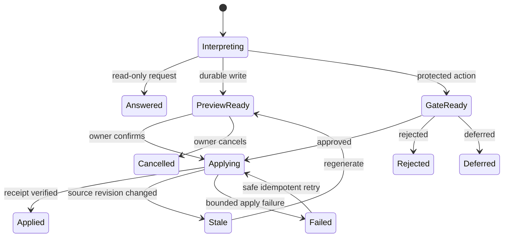

# LoopX 个人 Agent 工作区 — 最终设计

## 状态

- 产品组件面:个人 Goal 与 Agent 工作区
- 主要交互:通道式 Chat
- 默认 Agent:健康且兼容时的 Codex
- 受众:管理个人 Goals、Todos、Agent 工作与周期执行的一位所有者
- 实现目标:`apps/presentation/dashboard`
- 设计参考:[最终桌面 mockup](public/showcase/loopx-personal-agent-control-plane-final.png)
- 评审状态:所有者在 2026-08-12 批准了首屏方向


## 产品决策

LoopX 使用一个三层个人工作区:

1. 左侧单个侧栏,承载 Manager 与 Goal 目录。
2. 中央通道时间线,承载对话、进度、决策与输出。
3. 右侧上下文抽屉,承载聚焦检查与动作。

主组件面为阅读与对话优化。行不重复 `View`、`Correct`、`Open`、`Approve` 或 `Pause` 按钮。一行是一个入口;选中它打开右侧抽屉,相关的控件与聚焦 Chat 在那里可用。

自然语言请求是一等控制路径。所有者可以要求 LoopX 创建 Goal、指派 Agent、添加 Todos、配置 Goal heartbeat,或创建周期性 monitor。持久或高影响请求会在 LoopX 写入状态或开始工作之前产生结构化 preview。

## 用户成果

产品必须用很少的解释回答五个问题:

1. 现在什么需要我?
2. 我的 Agents 在做什么?
3. 最近有什么变化或完成?
4. 我如何纠正正在进行的作业而不丢失上下文?
5. 我如何描述一个 Goal 或周期任务,并让 LoopX 安全地配置它?

## 设计原则

1. **Chat 即工作区。** 对话与持久的 LoopX 投影共享一个时间序组件面。
2. **先浏览,选中后行动。** 列表保持安静;控件出现在上下文抽屉中。
3. **一个可见的主动作。** preview 或 gate 只暴露一个强调的转换。次要路径放在紧凑的溢出菜单中。
4. **自然语言变成语义提案。** 选中的 Agent 解释自由文本,并可能返回一个窄提案。LoopX 验证那个不可信提案,通过类型化 preview 显示目标与影响,并保持确认与执行权威的确定性。
5. **纠正保持连续。** 从运行中的详情抽屉发送的消息会继续所选的 Goal × Agent Session——只要它是可恢复的。
6. **Agent 身份与权威保持可见。** 每次执行、提案与输出都点名其 Agent 与相关权限边界。
7. **技术状态按需可见。** 原始 id、quota receipt、registry 发现与传输诊断保持折叠。
8. **每个可见声明都有谱系。** 进度与完成来自 Todo、run、gate、artifact 或 public-safe 事件投影。

## 信息架构

```text
LoopX Personal Workspace
├── LoopX Manager
│   ├── needs-you digest
│   ├── active Agent work
│   ├── recent outputs
│   ├── cross-Goal conversation
│   └── natural-language action proposals
├── Goals
│   └── Goal Channel
│       ├── Chat
│       ├── Tasks
│       └── Files
├── Context Drawer
│   ├── user decision
│   ├── Todo detail
│   ├── Run / Session detail and correction
│   ├── heartbeat or monitor detail
│   └── artifact preview
└── Global tools
    ├── notifications and Lark App management
    ├── theme switch
    └── owner workspace entry
```

## 桌面 shell

```text
┌────────────────────┬──────────────────────────────────┬──────────────────────┐
│ LoopX              │ LoopX Manager          Codex ▾   │ Context drawer       │
│                    │                                  │                      │
│ Manager          3 │ Channel timeline                 │ Selected object      │
│                    │                                  │ context              │
│ Goals              │ Messages                         │                      │
│ ● Goal A          2 │ Progress / decision cards       │ Focused Chat or      │
│ ● Goal B          1 │ Action previews                 │ one primary action   │
│ ○ Goal C            │ Outputs                          │                      │
│                    │                                  │ Advanced diagnostics │
│ Notify / owner     │ [Agent ▾] Composer               │ collapsed            │
└────────────────────┴──────────────────────────────────┴──────────────────────┘
```

### 单一侧栏

窄图标栏被移除。侧栏包含:

- `LoopX Manager`,包括当前关注计数;
- 活动 Goal 目录;
- 每个 Goal 的一个语义状态与可选计数;
- 底部是通知管理与所有者身份。

Goal 行的状态词汇表刻意很小:

- `Needs repair`
- `Needs you`
- `Waiting`
- `In progress`
- `Complete`
- `Quiet`

已完成的 Goals 可以移到一个过滤器之后。原始 Goal id 从不作为可见行的主导。

### 中央通道

中央组件面在两种上下文中都保持对话式:

- Manager 通道:跨 Goal 摘要、问题与动作提案。
- Goal 通道:Goal 范围的对话、Todo 进度、执行、gates 与输出。

当选中一个 Goal 时,紧凑的 `Chat`、`Tasks` 与 `Files` 选项卡会出现在标题下方。它们是导航,因此使用文本选项卡样式,不跟动作竞争。

### 上下文抽屉

抽屉只在所有者选中一行或时间线对象后打开。关闭它则展开中央通道。它通过一个稳定容器支持五种内容模式:

1. 决策详情
2. Todo 详情
3. Run / Session 详情
4. Heartbeat 或周期 monitor 详情
5. 产物预览

抽屉标题说明所选对象及其来源 Goal。`Advanced diagnostics` 保持折叠在底部。

## Manager 通道

Manager 是未选中 Goal 时的默认路由。其初始摘要按优先级排序:

1. `Needs you`
2. `Agents working`
3. `Recent outputs`

每个条目是一整行入口,带状态、简短原因与箭头。列表不包含重复的动作按钮。选中一行打开匹配的抽屉。

所有者发送消息后,普通消息与结构化提案卡加入同一时间线。有用的快捷提示限于两三个示例,例如:

- `What should I do now?`
- `Summarize today's progress.`
- `Create a recurring monitor.`

快速状态问题可以使用确定性本地投影。规划、判断与执行请求路由到选中的 Agent。

## Goal 通道

Goal 标题显示一个紧凑摘要:

```text
LoopX project development
Codex · In progress 2/3 · 1 item needs you
```

时间线支持:

1. 所有者消息;
2. Agent 回复;
3. Agent Todo 进度;
4. 执行进度;
5. 用户决策与 gates;
6. 产物与证据;
7. 动作提案与应用 receipt。

Chat 散文不能把 Todo 标记为完成。完成只出现在持久的 LoopX 转换或验证过的执行事件之后。

## Run 与 Session 呈现

LoopX 区分四个相关概念:

| 概念 | 用途 | 可见处理 |
| --- | --- | --- |
| Chat Session | 持久的 Goal × Agent × 通道对话上下文 | 隐藏在通道历史后面 |
| Run Session | 为一项 Todo 或请求的动作做的一次 Agent 执行尝试 | 人类可读的执行行/卡 |
| Turn | Chat Session 内一次所有者或 Agent 交互 | 时间线消息或流式回复 |
| Event | 有序的进度、状态或输出信号 | 紧凑的有意义更新;原始事件保持折叠 |

首屏使用易读的标签,如 `Codex · Review MR 3559`。`session_id`、上游线程标识符与传输详情留在高级诊断内部。

一条活动执行行显示:

- Goal;
- Agent;
- 任务标签;
- 紧凑的进度分数或阶段;
- 最近的有意义活动;
- 语义状态;
- 一个箭头。

选中该行打开 Run 详情。

## 同会话 Agent 纠正

Run 详情抽屉包含一个聚焦的 `Correct with <Agent>` 对话。它自动包含选中的 Goal、Todo、Run 与 Agent 范围。

示例:

```text
Owner
Focus on permission and data-leak risks. Do not submit yet.

Codex
Understood. I will stay read-only, finish the risk list, and wait for approval.

[Add direction or adjust requirements…]                         [Send]
```

纠正规则:

1. 向当前可恢复的 Chat Session 发送一个新 Turn。
2. 保留当前的 `goal_id`、`agent_id`、`session_id` 与选中的 Run 上下文。
3. 绝不因为全局 Agent 选择器变了就转移进行中的执行。
4. 把权限、workspace、受保护范围与 Agent 转移变更视为需要 preview 的类型化动作提案。
5. 显示流式可见输出与紧凑工具阶段;排除思维文本、原始工具输出、凭据与私有路径。
6. 当上游恢复失败时,保留本地历史并提供 `Retry resume` 或 `Start a new Session with this context`。绝不自动重放最后一条消息。

紧凑的 `More` 菜单包含次要运行时动作:

- 中断;
- 终态失败后重试;
- 启动新 Session;
- 关闭当前 Session。

## 自然语言控制

Manager 与 Goal 编辑器既是 Chat 输入,也是命令组件面。LoopX 把每条消息分类到以下意图族之一:

| 意图 | 示例 | 处理 |
| --- | --- | --- |
| 读取 | `Which Agents are stuck?` | 从确定性投影或选中的 Agent 回答 |
| 纠正 | `Inspect permissions first and wait before submitting.` | 权威不变时继续范围会话 |
| Goal 写入 | `Create a Goal for the Agent control plane.` | 生成类型化 preview |
| Todo 写入 | `Add a regression-test Todo and give it to Codex.` | 生成类型化 preview |
| Agent 绑定 | `Use Claude Code for research and Codex for implementation.` | 验证端点并预览绑定 |
| Goal heartbeat | `Keep this Goal moving every morning.` | 预览宿主 heartbeat 绑定与生命周期策略 |
| 周期 monitor | `Check MR status every 30 minutes.` | 预览一个有界的 `continuous_monitor` Todo 与调度 |
| 受保护转换 | `Release this version.` | 产生一个显式的运营方 gate |

### 影响感知执行

- 只读问题立即执行。
- 范围内对话纠正只要保持在现有权威信封内就立即执行。
- 持久状态变更产生结构化 preview。
- 受保护、破坏性、涉凭据、生产或外部可见的动作需要显式 gate。

每个提案记录一个 Goal revision 或等价状态指纹。应用一个过期提案不写入任何东西,并要求所有者重新生成 preview。

## Goal 创建流程

所有者可以说:

```text
Create a Goal to improve the Agent control plane. Bind the current repository,
use Codex, check progress every morning, analyze before editing, and ask me
before submitting.
```

LoopX 用一个结构化卡响应:

```text
Goal creation preview

Name             Improve the Agent control plane
Agent            Codex
Workspace        Current repository
Permission       Repository write · confirm before submit
Heartbeat        Every day at 09:00
Stop condition   Goal complete

Initial plan
1. Inspect the current control-plane implementation and permission boundary
2. Design the implementation slices and verification plan
3. Implement and validate one bounded slice at a time

[Create and start]                                      Modify settings
```

`Create and start` 执行一个幂等事务或可恢复 saga:

1. 验证目标项目与 Goal id。
2. 验证 Agent 端点、健康、能力、信任范围与工作区映射。
3. 创建或连接 Goal 及其权威边界。
4. 写入有序的初始 Todos。
5. 绑定选中的 Agent 身份。
6. 请求时生成并绑定 Goal heartbeat。
7. 刷新 public-safe 投影。
8. 创建或恢复 Goal Chat Session。
9. 只在 quota 与 gate 检查通过后启动第一个合格的有界 Turn。
10. 返回应用 receipt 并导航到新 Goal 通道。

部分失败留下可见的可恢复结果。用同一提案 id 重试不能重复 Goal、Todos、调度或第一个 Turn。

## Heartbeat 与周期 Monitor

界面接受友好语言,同时保留两个不同的 LoopX 契约。

### Goal heartbeat

Goal heartbeat 唤醒宿主 Agent 在 LoopX quota、gate、边界与调度器规则下重新评估并推进 Goal。它适合例如:

- `Keep this Goal moving every morning.`
- `Continue this Goal while there is eligible work.`

preview 显示:

- Goal 与 Agent 身份;
- 宿主 surface;
- 初始节奏;
- 权限边界;
- quota 行为;
- 通知策略;
- 停止或暂停条件。

LoopX 从 `heartbeat-prompt` 生成生命周期正文;UI 从不要求所有者编辑原始 prompt 文本或 RRULE 语法。

### 周期 monitor

周期 monitor 关注一个有界目标,并物化为带 `task_class=continuous_monitor` 的 Agent Todo。它适合例如:

- `Check MR 3559 every 30 minutes and notify me on failure.`
- `Review the daily data refresh until the migration completes.`

preview 显示:

- 目标与目标键;
- 节奏与时区;
- 下次到期时间;
- Agent;
- 通知规则;
- 通过过期、完成或其他受支持的停止条件实现的有界性;
- 预期权限与成本边界。

每次到期执行创建或恢复一个 Run Session,并把有意义的活动与输出回发到其 Goal 通道。`Tasks` 选项卡包含一个 `Scheduled and continuous` 分组。选中一个 monitor 打开其抽屉,所有者在其中可以立即运行、暂停、编辑、恢复或停止。

## 提案与 Gate 状态机



提案卡绝不计数为持久的 Goal 或 Todo 状态。只有验证过的 apply receipt 与刷新后的投影才确立成功。

## 抽屉模式

### Decision

- 确切的问题与决策范围;
- 理由与证据摘要;
- 一个主决策;
- 在 `More` 中推迟、拒绝或解释;
- 相关执行与输出。

### Todo

- Goal、所有者、任务类别、状态、依赖与下一次转换;
- 通过预览转换在需要时重新指派、阻塞、推迟、完成或创建后继。

### Run / Session

- 人类可读的身份与进度;
- 最近的有意义活动;
- 同 Session 纠正编辑器;
- 输出;
- 紧凑运行时动作;
- 高级诊断。

### Heartbeat / monitor

- 目标、Agent、节奏、时区、下一次与上一次运行;
- 通知与停止规则;
- 立即运行、暂停、编辑、恢复或停止;
- 执行历史。

### Artifact

- 支持时安全的内联预览;
- 产出 Goal、Todo、Agent 与 Run 谱系;
- 抽屉内的打开或导出控件。

## Agent 选择与绑定

标题与编辑器暴露一个紧凑的 Agent 选择器。当 Codex 健康且兼容时,新对话选择它。

每个选项显示:

- 显示名;
- provider 或 adapter 类型;
- 可用性;
- 简短能力摘要;
- 信任范围;
- 工作区兼容性。

Codex 与 Claude Code 使用它们原生的本地运行时。直接 OpenAI 或 Anthropic API-key 端点暴露同一选择器契约与一个有界的只读项目工具集(`list_files`、`search_text` 与 `read_file`)。工具路径保持项目相对,敏感目录被拒绝,原始工具结果绝不会被持久化为可见 Chat 消息。持久写入仍然通过类型化 LoopX preview 与验证过的 apply receipt。

选择会路由下一 Chat 消息。既有 Todo 所有权保持在 `claimed_by` 中,活动 Sessions 保持附着在它们原始的 Agent 上。

端点命令、远端地址、凭据引用与工作区映射保持 owner 本地。浏览器消费脱敏后的健康与能力投影。端点变更使用显式本地 CLI 或受信任宿主动作。工作区 UI 通过 Agent 选择器暴露端点可用性,而不是添加一个没有直接动作的永久页面。

## 业务对象映射

```text
Goal
├── objective
├── goal_boundary
├── Agent bindings
├── user_todos
├── agent_todos
│   └── continuous_monitor Todos
├── Chat Sessions
│   └── Turns and visible events
├── Run Sessions
│   └── evidence and artifacts
├── heartbeat host binding
└── interaction_contract
```

| LoopX 来源 | 组件面 |
| --- | --- |
| Goal 目录与 objective | 侧栏与通道身份 |
| `goal_boundary` | 提案权限摘要与诊断 |
| `user_todos` | Needs-you 行与决策抽屉 |
| `agent_todos` | Agent 工作行与 Goal 任务进度 |
| `claimed_by` | Agent 归属 |
| `continuous_monitor` 元数据 | 定时与持续任务及其抽屉 |
| Chat Session 快照 | 对话历史与恢复状态 |
| 活动 Turn 与安全事件 | 流式回复与当前阶段 |
| run 历史与证据 | 执行进度、receipts 与输出 |
| interaction contract | 接下来谁行动,哪个转换可用 |
| quota 与调度提示 | Heartbeat 资格与节奏详情 |
| Agent 管理投影 | 选择器、绑定 preview 与端点健康 |
| registry 发现 | Needs-repair 状态与诊断 |

展示代码消费稳定的 public-safe 投影。它不解析私有规划文件、provider 载荷、原始日志、凭据材料或本地绝对路径。

## 控制面 API 要求

现有 Chat Session、异步 Turn、SSE、中断与恢复 API 仍是传输基础。最终工作区添加一个带等效契约的类型化动作层:

```text
POST /api/actions/preview
POST /api/actions/{proposal_id}/apply
POST /api/actions/{proposal_id}/cancel
GET  /api/actions/{proposal_id}
```

动作 preview 请求携带:

- 自然语言输入;
- 上下文类型:Manager、Goal、Todo、Run 或 Schedule;
- 选中的 Goal、Agent 与可见对象标识符;
- 客户端生成的幂等键。

响应携带:

- 类型化动作类型;
- 人类可读摘要;
- 规范化参数;
- 预期 Goal revision 或状态指纹;
- 权限与 gate 分类;
- dry-run 或验证证据;
- 可用转换。

初始动作类型:

- `goal.create`
- `goal.update`
- `todo.create`
- `todo.update`
- `agent.bind`
- `heartbeat.bind`
- `monitor.create`
- `monitor.update`
- `gate.resolve`
- `run.correct`

当权威信封不变时,`run.correct` 可以直接路由到当前 Chat Turn 契约。所有其他持久类型都经过 preview 与 apply。

## 视觉系统

- 画布:`#FBFAF7`
- 面板:`#FFFFFF`
- 主墨色:`#20232B`
- 弱化文本:`#747A86`
- LoopX 蓝:`#2F66E9`
- 成功:`#2DAA72`
- 关注:`#D99028`
- 失败:红色,保留给终态或不安全状态
- 边框:细微的中性 1 px
- 圆角:10–12 px
- 阴影:最小化,只用于覆盖层
- 正文字号:14–16 px,行高舒适

按钮策略:

- 活动 preview 或 gate 中一个强调的主动作;
- 活动编辑器中的发送按钮;
- 次要动作为静音文本或溢出条目;
- 浏览列表中零重复的动作按钮列。

## 响应式行为

### 平板

- 把 Goal 目录折叠到抽屉之后;
- 保持中央通道全宽;
- 把上下文详情作为右侧 sheet 打开;
- 保留活动编辑器。

### 移动

- 一次只显示 Goal 目录、通道或上下文 sheet 之一;
- 用返回动作保留导航上下文;
- 把 Agent 选择作为底部 sheet 打开;
- 让 preview 确认与纠正编辑器保持在安全区之上;
- 保持 44 px 最小触控目标。

## 可访问性

- 支持跨侧栏行、时间线对象与抽屉控件的键盘导航。
- 用文本与图标语义而非仅颜色来暴露状态。
- 把焦点移入打开的抽屉,关闭时恢复到选中的行。
- 用礼貌的 live region 播报流式 Agent 消息与持久状态转换。
- 标注纠正编辑器的 Goal、Agent 与 Run 目标。
- 尊重 reduced-motion 偏好。

## 实施计划

### 阶段 1 — Shell 与浏览交互

- 移除窄全局图标栏;
- 构建单一 Manager/Goal 侧栏;
- 把关注、Agent 工作与输出列表转换为整行选择;
- 实现多态上下文抽屉;
- 移除重复的行动作按钮。

### 阶段 2 — 同会话纠正

- 添加 Run 详情对话历史;
- 把纠正消息绑定到选中的 Goal × Agent Session;
- 通过现有 SSE 流式推送新 Turn;
- 暴露恢复失败、中断、重试与新 Session 恢复。

### 阶段 3 — 自然语言动作提案

- 添加类型化 preview 与幂等 apply 契约;
- 实现 Goal 创建、有序 Todo 创建与 Agent 绑定;
- 在通道时间线中渲染提案、过期、失败与 receipt 状态。

### 阶段 4 — Heartbeat 与周期 monitor

- 分开分类 Goal heartbeat 与有界 monitor 意图;
- 通过 LoopX 策略生成 Goal heartbeat 生命周期配置;
- 创建与编辑 `continuous_monitor` Todos;
- 添加调度详情、运行历史、暂停/恢复与停止交互。

### 阶段 5 — 任务、文件与 Agent 设置

- 用相同的行/抽屉模式完成 Goal `Tasks` 与 `Files` 视图;
- 暴露脱敏端点健康与能力选项;
- 保留仅本地的端点变更与凭据边界。

### 阶段 6 — 验证与发布

- 为每个可见入口与抽屉转换做浏览器 E2E;
- 真实 Chat、流、刷新、恢复、纠正、中断与重试测试;
- 幂等 Goal/heartbeat apply 测试;
- 公共/私有边界检查;
- 定稿前首屏截图比较与所有者评审。

## 验收标准

1. 首屏包含一个侧栏,没有无法解释的图标栏。
2. 浏览列表不包含重复的动作按钮列。
3. 选中任何 needs-you、Agent 工作、调度或输出行都会打开正确的抽屉。
4. 所有者能在五秒内识别需要关注的内容、活动的 Agent 工作与最近的输出。
5. 从 Run 详情发送的纠正到达同一个可恢复的 Goal × Agent Chat Session 并保留上下文。
6. 刷新页面恢复可见历史并重新连接活动 Turn。
7. 自然语言 Goal 请求创建带 Goal、Agent、工作区、权限、Todos、heartbeat 与停止条件的结构化 preview。
8. 在所需确认之前,不写入任何 Goal、Todo、Agent 绑定、heartbeat 或周期 monitor。
9. 两次应用同一提案不能重复持久状态,也不能启动重复的第一个 Turn。
10. 请求继续 Goal 映射到 heartbeat 契约;请求关注一个有界目标映射到 `continuous_monitor` Todo。
11. 受保护操作保持为显式运营方 gates。
12. 原始 id、日志、工具输出、私有路径、凭据与 provider 载荷保持在默认可见界面之外。
13. 每条进度或输出声明仍可归属于 public-safe 的 Todo、Run、事件、gate 或产物投影。
14. 只有健康且兼容时 Codex 才是默认;不可用的 Agents 在选中之前得到解释。
15. 最终实现与批准的桌面宽度首屏设计一致,才可提交或定稿 PR。

## 首次交付范围之外

- 协作或多所有者 Goal 编辑;
- 可视化工作流构建器;
- 分析 dashboard 与 KPI 图表;
- 原始终端或工具日志渲染;
- 运行中自动 Agent 转移;
- 浏览器侧存储端点命令或凭据;
- 未经评审执行受保护的外部动作。

## 选定默认值

- LoopX Manager 是初始路由。
- Codex 是默认的健康 Agent。
- Goal Chat 是默认的 Goal 选项卡。
- 列表用于浏览;抽屉用于行动。
- 纠正继续受范围限定的 Session。
- 持久的自然语言操作使用 preview 与 apply。
- Goal heartbeat 与周期 monitor 保持为独立的类型化契约。
- 高级诊断保持折叠。
