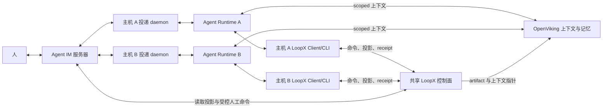

# RFC：Agent IM、LoopX 与 OpenViking 协同（v0）


- 状态：Draft
- 范围：多主机、多 runtime 的 agent 协同
- 决策类型：架构与分阶段集成契约

## 摘要

本 RFC 为长程 agent 工作提出三个狭窄、可组合的平面：

1. **Agent IM 与 runtime 投递**拥有房间、私聊、线程、presence、宿主 daemon、
   投递、离线队列与唤醒行为。
2. **LoopX** 仍是 goal、todo、claim 与 lease、gate、quota、调度、证据、交接与
   已接受状态变更的唯一权威。
3. **OpenViking** 拥有持久上下文、资源索引、scoped 召回与跨会话或跨 runtime 的
   上下文连续性。

核心规则是：外部任务看板是 LoopX 的投影加一个小的受控命令 facade，而不是第二个
可写 kanban。消息投递不等于控制状态已变更。每个 claim、gate 决策或交接都必须被
LoopX 接受并返回幂等 receipt。

## 问题

长程工作常常横跨多个主机与 agent runtime。消息层可以把 agent 重新连接起来并投递
指令，上下文服务可以恢复有用的历史。但这两件事都不能回答控制问题：

- 这个 agent 现在可以推进哪个 goal 和 todo？
- 是否已有另一个 agent 认领了同一批工作？
- 是否有用户决策或写边界阻挡下一次迁移？
- 早先的命令真的提交了吗，还是只投递了一条消息？
- 哪条证据新到足以支撑推进？

当聊天、记忆与任务状态看起来都可写时，重试与过期视图可能产生重复认领、重复实现、
非法批准与所有权漂移。共享数据库本身并不能解决这一问题；每个迁移仍必须由唯一的
契约拥有。

## 目标

- 让异构 agent runtime 通过同一个 IM 空间协同，而不必成为同一个 runtime。
- 为每个 runtime 保留一条直达 LoopX 的 agent 原生路径。
- 在 IM 中展示有用的 LoopX 状态，而不引入另一个生命周期 owner。
- 把 OpenViking 用于 scoped 上下文连续性，但不要把召回文本变成当前控制权威。
- 让重试、重连与并发动作可观察、可幂等。
- 保持私有上下文与效应权威限定在行动的 identity 上。

## 非目标

- 替换某个 agent runtime 或其原生工具。
- 把 LoopX 的规划、quota、调度或 todo 生命周期搬进 IM。
- 把 OpenViking 召回当作 gate 决策、claim 或权限授予。
- 把原始聊天历史、工具输出、凭证或私有文件复制到公开或广泛共享的投影中。
- 设计一个对 peer agent 拥有持久权威的通用协调器。
- 削弱现有的 merge、publish、生产、凭证或破坏性操作 gate。

## 所有权模型

| 能力 | Agent IM | LoopX | OpenViking |
| --- | --- | --- | --- |
| 房间、消息、线程、presence | Owner | 仅引用 | 可选 scoped 索引 |
| Runtime daemon 与消息投递 | Owner | 观察可用性 | 恢复 scoped 上下文 |
| Goal 与 todo 生命周期 | 投影 | Owner | 仅上下文 |
| Claim、lease、gate、quota | 受控 facade | Owner | 永不权威 |
| 证据接受与交接 | 投递通道 | Owner | 存储已批准的指针或摘要 |
| 资源、记忆与召回 | 可携带指针 | 范围与权威边界 | Owner |

每个 goal 都只有一份规范的 LoopX todo 与事件历史。Agent IM 与 OpenViking 保留
各自的领域状态，但两者都不存储一份可独立推进的 LoopX 生命周期副本。

## 架构



直达 LoopX 的 runtime 路径是主路径。即使没有任何 IM 动作发生，agent 也通过其本地
LoopX client 或 CLI 发现、认领并推进工作。Agent IM 是人可见投影与一小批受控命令
的第二入口。它不得代理或替代常规的 agent 生命周期调用。

两条入口路径都使用同一迁移契约：

- 已认证的 actor identity；
- goal 与 todo 范围；
- 预期状态序列或 revision；
- 幂等 key；
- 命令专属证据；
- 被接受、被拒绝、冲突或已应用的 receipt。

## 投影契约

IM 房间可以展示紧凑投影，例如：

```json
{
  "goal_id": "public-safe-goal-id",
  "goal_status": "active",
  "selected_todo": {
    "todo_id": "todo_example",
    "summary": "Validate the bounded implementation slice",
    "claimed_by": null,
    "actionability": "unclaimed"
  },
  "counts": {
    "unclaimed": 2,
    "user_gates": 1
  },
  "source_revision": 42,
  "generated_at": "2026-01-01T00:00:00Z"
}
```

投影是内容极简且限定 actor 的。它可以展示另一 agent 的所有权和一个公开安全的
摘要，但默认不暴露私有证据。房间成员身份不是 LoopX 的写授权。

每个投影都携带新鲜度信息。过期卡片仍可用于定位方向，但无法证明迁移仍有效。

## 受控命令契约

第一个支持的命令应为 `claim_todo`：

```json
{
  "command": "claim_todo",
  "actor_id": "agent-a",
  "goal_id": "public-safe-goal-id",
  "todo_id": "todo_example",
  "expected_revision": 42,
  "idempotency_key": "stable-command-key"
}
```

LoopX 返回以下之一：

- `applied`：迁移已提交；
- `already_applied`：同一语义命令更早已提交；
- `conflict`：当前状态不再满足预期 revision；
- `rejected`：identity、范围、gate 或策略不允许该命令；
- `failed`：没有接受任何状态变更，操作可能需要有界重试或修复。

界面只在收到已接受的 receipt 后更改所有权。它绝不从一条已发送消息、一次乐观卡片
移动或 agent 散文推断成功。

## 上下文与记忆契约

OpenViking 接收 scoped 资源、已批准摘要与 artifact 指针。它可以帮助 agent 恢复：

- 先前的决策及其证据；
- 交接摘要；
- 可复用的项目知识；
- 资源位置；
- 早期 run 的有界教训。

召回始终是一种观察。在召回材料影响执行之前，runtime 或能力必须把它与当前 LoopX
状态及来源新鲜度对比。特别是：

- 被记住的批准不满足当前的 user gate；
- 被记住的 owner 不会续期 claim 或 lease；
- 旧的 todo 摘要不能覆盖较新的 revision；
- 上下文指针不授予对其目标的访问权；
- 无可检查证据的摘要不能证明完成。

## 身份与权威

同一个公开安全的 actor identity 应可在 runtime、IM、LoopX 与 OpenViking 之间
追溯，同时每个系统继续执行自己的范围。身份关联不等于权威继承。

- Runtime 凭证仍留在主机或 runtime。
- IM 投递权不授予 LoopX 写范围。
- LoopX 任务权威不授予宽泛的记忆访问。
- 记忆访问不授予效应权威。
- 协调器是任务限定的角色，不是持久的超级用户。

## 重连与重放

Agent IM 可以采用至少一次投递，让离线 agent 最终收到消息。LoopX 幂等为命令提供
至多一次的语义应用。OpenViking 可以在重启后恢复上下文，但 runtime 在恢复工作前
仍必须获取新鲜 LoopX 状态。

可靠的重连顺序是：

1. 重新建立 runtime 与 IM 身份。
2. 从 OpenViking 恢复 scoped 上下文。
3. 读取当前 LoopX 投影与 revision。
4. 按幂等 key 与 receipt 对账待处理命令。
5. 向 LoopX quota 与 gate 界面询问工作是否仍可行动。
6. 只恢复所选的有界 todo。

## 失败语义

| 失败 | 必需行为 |
| --- | --- |
| IM 投递延迟 | 不得推断任务不活跃或重新指派所有权 |
| 重复命令 | 返回原始语义结果或 `already_applied` |
| 过期投影 | 以 conflict 拒绝命令并刷新状态 |
| LoopX 不可用 | 保持看板只读；不排队无界写入 |
| OpenViking 不可用 | 以缩减的上下文从当前 LoopX 状态继续 |
| Runtime 变化 | 恢复身份与上下文，然后重新检查当前权威 |
| 私有证据不可用 | 展示脱敏指针或访问警告，而非内容 |

## 最小有用切片

首个实现应保持狭窄：

1. 把 LoopX goal 状态、选中 todo、未认领计数与 user-gate 计数投影到一个非生产
   IM 房间。
2. 只支持 `claim_todo` 命令。
3. 要求 actor、goal/todo 范围、预期 revision 与幂等 key。
4. 把 LoopX receipt 显示在发起交互旁边。
5. 验证两个主机尝试同一认领与一次 daemon 重连。
6. 在本切片期间，OpenViking 集成保持只读，仅用于 scoped 上下文检索与
   artifact 指针。

这在不先重建每个调度器、记忆写入器、看板交互或 runtime adapter 的前提下，验证了
重要的组合边界。

## 验证

切片必须证明：

- 只有一个并发认领会提交；
- 重试同一命令不会产生第二次迁移；
- 过期房间卡片不能覆盖当前 LoopX 状态；
- agent 仍能直接通过 LoopX 认领并推进工作；
- 重连恢复上下文但会重新检查当前权威；
- 私有材料不出现在房间投影、receipt 或公开日志中；
- 当 LoopX 无法验证命令时，看板保持只读。

衡量结果质量而非消息量：

- 投影与 LoopX 真值之间的状态漂移；
- 重复认领或重复实现；
- 定位、转发与解锁工作所需的人工注意力；
- 主机或 runtime 中断后的恢复时间；
- 受控迁移的误接受或误拒绝；
- 交接后产出的已验证 goal 结果。

## 未决问题

1. 哪些 LoopX 投影字段足够稳定，足以进入首个公开契约？
2. 房间到 goal 的绑定是否总需要显式 owner 确认？
3. 在 claim 之后，哪些附加命令（若有）简单到可以暴露？
4. 上下文指针应如何传达 actor 缺少访问权？
5. IM 中展示的 receipt 适用什么保留策略？
6. 哪个 eval 应比较基线人工协调与集成路径？

## 公开参考

- [OpenViking: Inside the Context Database Architecture](https://blog.openviking.ai/post/openviking-context-database-architecture/)
- [OpenViking for the Too Many Agents Problem](https://blog.openviking.ai/post/openviking-too-many-agents/)
- [LoopX architecture overview](../../architecture.md)
- [LoopX host integration surface v0](../../reference/protocols/host-integration-surface-v0.md)
- [LoopX OpenViking session memory adapter v0](../../reference/protocols/openviking-session-memory-adapter-v0.md)

这些公开来源支撑组件边界与集成假设。本 RFC 有意排除私有对话、个人归因、内部链接、
本地路径、凭证与原始记录。
