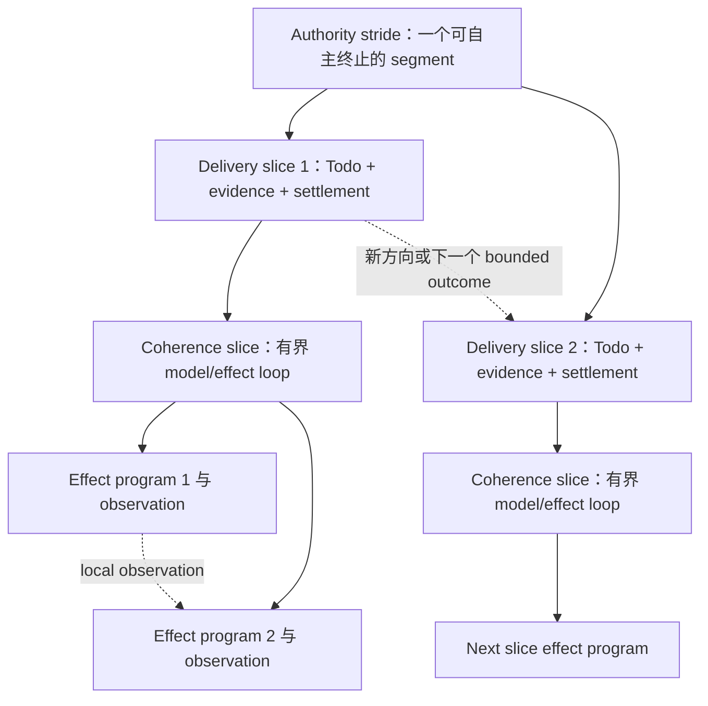

# RFC：长程 Agent 分层步幅控制 v0

| 字段 | 值 |
|---|---|
| 状态 | Draft，研究提案 |
| 日期 | 2026-08-15 |
| 作者 | LoopX maintainers |
| 范围 | Effect 反馈、有界交付、权限升级、模型资格验证与长程效率 |
| Tracking issue | [#3203](https://github.com/huangruiteng/loopx/issues/3203) |
| 源码基线 | LoopX `8b8e7b248` |

> 语言说明：
> [英文版](./hierarchical-agent-stride-control-v0.md)与本文档是语义镜像，
> 二者出现差异即为缺陷。

## 1. 决策摘要

LoopX 应把**步幅（stride）**理解为一个分层控制问题：在下一个反馈、结算或
权限边界到来前，系统应允许 agent 完成多少语义连贯的工作。

系统有三种嵌套步幅：

1. **Effect stride**：在下一个会改变决策的环境 observation 返回模型前完成的
   工作；目标单元是 coherence slice 内的一段 effect program。
2. **Delivery stride**：在下一次轻量控制干预与 durable settlement 前完成的
   工作；目标单元是一个由 Todo 拥有、有证据的 bounded delivery slice。
3. **Authority stride**：在下一次可能改变 scope、acceptance、permission 或
   direction 的重干预前完成的工作；目标单元是一个可自主终止的 segment。

这不是三个彼此独立的 timeout，也不是三个固定计数。内层由 host 与 effect
interpreter 拥有，中层由 LoopX Turn/Todo/settlement 生命周期拥有，外层由
goal、vision、gate 与人类权限拥有。内层结果可以迫使中层提前结算；中层结果
可以迫使外层提前升级权限。一次 scheduler tick 本身不能制造任何一种语义迁移。

本 RFC 提出一项 measurement-first 研究计划。最小有用切片是从现有 receipt
派生只读、provider-neutral 的 stride observation。在任何 runtime 自动扩大或
缩小步幅前，先刻画现有 standard 与 fine-grained execution。Adaptive control
先进入 shadow mode，只有反复、稳定的资格验证成立后才 promotion。

核心判断是：

> 长程效率来自把语义边界放在正确位置，而不是孤立地最大化连续工作量，或
> 最小化协议事件数量。

## 2. 为什么一个“Turn 长度”不够

长程 agent 常被一个含糊变量调节：把 turn 变长或变短。这把三个不同问题混在
了一起：

- 在模型必须重新考虑下一步前，可以执行多少因果相关的 tool effect？
- 在 evidence 与 state 必须 durable settlement 前，可以执行多少有 outcome 的
  工作？
- 在用户或 supervisor 必须作决定前，agent 可以在不变权限下自主运行多久？

一个配置无法同时回答三者。同一个模型可以安全运行很大的只读 tool program；
修改脆弱 artifact 前仍需要小 checkpoint；同时只要 goal 与 permission boundary
稳定，它又可能数小时都不需要人类注意。

相反的失败也很常见。Host 可以在每个小 Todo 后中断，反复执行 quota 与
scheduler 仪式，并在没有新权限问题时要求用户听取进展。表面上控制更强，实际
useful-work density 却坍塌了。

三层步幅模型能同时解释两端：

| 边界 | 太短 | 太长 |
|---|---|---|
| Effect 反馈 | 过多模型往返、context 回流与 tool-call 开销 | 太晚消费会改变决策的 observation，错误与副作用叠加 |
| Delivery 结算 | Todo 碎片化、重复调度、局部完成偏差 | Evidence 变旧、writeback 延迟、一个 Todo 隐藏方向变化 |
| Authority 干预 | 消耗人类注意和 supervisor 带宽，却没有新权限 | Scope drift、steering 过晚、permission 错误与不诚实的不终止 |

因此目标不是“更大步幅”，而是在当前模型与工作类型下，选择仍能保持决策连贯、
可逆性、evidence freshness 与权限正确性的最大步幅。

## 3. 术语

### 3.1 反馈层级

本文使用三种外界反馈：

1. **环境反馈**：tool result、repository state、test output、remote API response，
   以及其他可能改变下一步动作的 observation。
2. **控制反馈**：quota decision、scheduler wake、Todo state、validation result、
   writeback receipt 与 replan obligation。
3. **权限反馈**：user steering、user gate、protected-operation decision、goal 或
   acceptance change，以及合法权限主体接受或拒绝的 supervisor proposal。

环境反馈告知动作，控制反馈验证并结算有界切片，权限反馈则可能改变哪些工作是
合法的。

### 3.2 Coherence slice

**Coherence slice** 是满足下列条件的最大局部 model decision 与 tool effect
序列：

- immediate objective 与 postcondition 保持稳定；
- active hypothesis 或 implementation direction 保持稳定；
- permission 与 reversibility boundary 保持稳定；
- 判断切片是否成功所需的 evidence 保持稳定。

在 LoopX 产品边界，一个 governed Turn 应同时代表一个 bounded delivery slice
和一个 coherence slice。Host 可用一个原生模型 turn 实现，也可使用有界的多步
model/tool loop。Provider 自己对“turn”的命名不是协议合同。

### 3.3 Bounded delivery slice

**Bounded delivery slice** 是一个由 scheduler 启动、由 Todo 锚定的 outcome，
包含：

- 可验证 postcondition；
- 显式 effect、时间或工作预算；
- fresh evidence；
- targeted validation；
- durable writeback 与 settlement。

一个 bounded delivery slice 通常应与一个 coherence slice 对齐。它以一个
selected Todo 为因果锚点；在 fine-grained mode 下，只要方向未变，也可关闭一串
有界、经过 evidence qualification 的 checkpoint Todo。新方向意味着新 slice。
如果中间结果预期会改变方向或权限，一个 broad Todo 就必须拆分。

### 3.4 Autonomous segment

**Autonomous segment** 是在同一个 stable authority snapshot 下执行的一串
bounded delivery slice。它必须诚实终止于以下之一：

- 已接受的 goal 或 milestone outcome；
- 有 coverage 证明的 exhaustion 或 no-follow-up；
- concrete blocker；
- user 或 protected-operation gate；
- 显式 scope 或 acceptance change。

计时器到期、状态汇报或一个局部 Todo 完成，本身都不是 autonomous segment
的 terminal。

## 4. 当前事实与缺失部分

本节会随实现演进持续更新。Shipped behavior 以代码与 stable protocol reference
为准；本文记录研究方向。

### 4.1 今天已经存在什么

| 层级 | LoopX 当前事实 |
|---|---|
| Effect | [Agent Loop Effect Interpreter RFC](./agent-loop-effect-interpreter-v0.zh-CN.md) 已定义 typed effect request、interpretation、observation 与 settlement 语义。 |
| Turn | [LoopX Turn protocol](../../reference/protocols/loopx-turn-v0.md) 管理 decide -> execute -> validate -> commit，并把 scheduler handoff 留在 settlement 外。 |
| Delivery | Execution profile 已区分 standard 与 fine-grained Todo contract；fine-grained mode 使用 coherent-slice turn budget，并基于 fresh evidence 创建 successor。每个获准 heartbeat 仍执行完整 durable settlement。 |
| Continuation | 除同一 Turn 的 controller disposition 外，typed delivery-continuity reducer 可在 heartbeat wake 之间保留最近一次 accountable `outcome_progress` Todo，前提是同一 Todo 仍 open、actionable、capability-ready，且仍由同一 agent 拥有。 |
| Progress | Typed progress observation、repeat detection、semantic replan closure 与 evidence projection 能区分 material delta 和 maintenance。 |
| Research | [研究型探索控制面 RFC](./research-exploration-control-plane-v0.zh-CN.md) 定义了可选的 typed knowledge frontier 与 composition experiment。 |
| Authority | Goal vision、user gate、permission policy 与 peer/supervisor boundary 和 execution、scheduler 保持分离。 |

### 4.2 还缺什么

| 缺口 | 后果 |
|---|---|
| 没有共享的 stride vocabulary | Host、Todo、scheduler 与 human-attention 的变化都被当成一个泛化的“turn length”问题。 |
| 没有跨层 observation | LoopX 无法判断低吞吐究竟来自 model/tool 往返、过度频繁的 settlement，还是 authority churn。 |
| 没有面向步幅的 model capability profile | 快速 tool-using model 与较慢但协议可靠的模型大体收到静态 execution contract。 |
| 没有语义 split/merge qualification | Todo 粒度由配置或 prompt 决定，却不按真实 decision change 与 settlement cost 评估。 |
| 没有 intervention value model | Periodic report 与真正 authority change 没有分开测量。 |
| 没有 adaptive promotion path | 还没有 shadow recommendation -> bounded experiment -> promoted policy 生命周期。 |

## 5. 三层模型



三层是嵌套关系，但内层 effect 数量与外层 delivery 数量都不固定。一个 governed
Turn 通常让一个 delivery slice 与一个 coherence slice 对齐；该 slice 内可以有
多次 model/effect cycle，也可有一串 fine-grained causal checkpoint。一个
autonomous segment 可以包含一个或多个 delivery slice。语义停止条件优先于数字
上限。

### 5.1 Effect stride

**问题：**在一个会改变决策的 observation 返回模型前，应执行多少因果相关的
环境工作？

**Owner：**host agent loop、tool runtime 与 effect interpreter。

**目标单元：**coherence slice 内的一段 bounded effect program。

**继续条件：**每个 next effect 都是当前决策的因果结果；intermediate
observation 可在局部消费且不改变 governing hypothesis；effect 仍处在同一
permission 与 reversibility class；program 没有超出声明预算。

**停止条件：**observation 可能改变 next plan；出现 permission、safety 或
irreversible boundary；局部 hypothesis 被反驳；validation 所需输出已经得到；
或者 compute、wall-time、call、output ceiling 已到达。

DeepSeek Harness **Code Mode** 是扩大这层步幅的一个公开实例。模型编写一段可
loop、branch、fan out 并 post-process tool result 的 Python 或 TypeScript 程序，
不必让所有中间结果重新进入模型 context。Tool subcall 仍经过同一 policy 与
guard pipeline。因此它可以减少模型往返，又不削弱 effect authority。

Code Mode 不表示 Todo 应该变得更宽，也不表示 human review 应更少。它只改变
一层。

### 5.2 Delivery stride

**问题：**在 LoopX 验证、写 evidence、刷新 durable state 并结算切片前，应执行
多少有 outcome 的工作？

**Owner：**Todo、Turn、validation、writeback、quota 与 settlement contract。

**目标单元：**一个拥有 stable postcondition 的 bounded delivery slice 与
coherence slice。

**继续条件：**Todo postcondition 未变；fresh evidence 仍支持同一方向；successor
具有因果关联而非预先写死；没有 open replan 或 authority obligation；bounded
chain 仍在 safety ceiling 内。

**停止条件：**postcondition 已满足；evidence 改变方向；validation failure 要求
新 hypothesis；replan obligation 打开；出现 user/permission gate；继续工作会
使 evidence 和 writeback 过时。

Scheduler wake 不是 delivery closeout。正常获准执行的 open advancement Todo 从
`in_flight_continuation` settlement boundary 开始；一次 accountable
`outcome_progress` 后，只要 postcondition、claim、capability readiness 与 authority
fact 保持稳定，下一次 heartbeat 也会优先恢复同一个 Todo，而不是因 queue reorder
切换到新 sibling。Heartbeat receipt、blocking work lane、autonomous replan、control
repair、delivery denial、`outcome_gap`、Todo completion/blocking 或 claim transfer
都会结束 continuity，并把 selection 交回普通 typed frontier。

Continuation 不会创建更轻的 settlement class。每个 heartbeat 仍按现有 accountable
settlement contract 完成 validation、durable writeback 与 quota spend。新增的
`in_flight_continuation` boundary 只改变 vision-checkpoint timing：同一 Todo 的
中间进展记录 typed continuation checkpoint，不要求新的 vision decision。
Completion、durable Next Action 变化、replan、gap 与 terminal outcome 仍属于
`semantic_closeout` boundary，并保持严格 vision contract。Multi-slice burst 与
redundant scheduler-ACK suppression 仍是独立实验；sticky Todo selection 不隐含
这些能力。

Todo 粒度应由**决策稳定性**定义，而不是 line count、file count、command count
或 elapsed minute：

- 如果某个可能出现的中间 observation 会改变方向、acceptance test 或所需权限，
  Todo 就太宽；
- 如果 Todo 只记录一个不会改变 next decision 的机械依赖步骤，而且单独结算
  没有新增可复用 evidence，它就太窄。

现有 fine-grained contract 是一个有用实验，而不是最终答案。它已经允许在检查
fresh evidence 后，用一个 coherence slice 完成多个因果相关的 advancement Todo，
同时禁止预写长 runnable chain。本文围绕该行为推广测量问题，而不是替换它。

### 5.3 Authority stride

**问题：**在一次允许改变 scope、acceptance、permission 或 direction 的干预前，
agent 可以持续多久？

**Owner：**goal 与 vision acceptance、user gate、protected-action policy 与人类
权限。Supervisor 可以提出 proposal，但不会因观察或调度工作而获得权限。

**目标单元：**一个 autonomously terminable segment。

**继续条件：**authority snapshot 稳定；selected work 仍在 accepted scope 内；
没有 protected operation 需要同意；evidence 支持继续自主执行；至少一个诚实的
terminal 仍可达。

**停止条件：**goal 或 acceptance boundary 必须改变；protected action 需要授权；
ambiguity 会产生实质后果；coverage 已穷尽；concrete blocker 持续存在；或 accepted
milestone 已完成。

给人看的 progress report 不一定是重干预。Report 可以只是没有 steering authority
的 projection side effect。相反，一句改变 scope 的用户指令即使传递成本很低，
也是重干预。

## 6. 跨层控制律

### 6.1 语义边界优先于数字预算

每层都可有用于安全与成本控制的 hard ceiling，但 ceiling 不是 completion rule。
发生 semantic change 时应提前结束，也不能仅因达到 maximum 就声称成功。

### 6.2 内层 continuation 不能借用外层权限

Programmatic tool loop 可以压缩多个 effect，但不能跨 permission boundary、扩大
Todo postcondition、重新解释 acceptance，或压制 required user gate。

### 6.3 外层 continuity 不能豁免中层 settlement

Goal authority 稳定，不表示 agent 可以数小时工作而没有 fresh evidence 与 durable
writeback。Delivery settlement 是 autonomous segment 的 memory 与 replay boundary。

### 6.4 Scheduler cadence 不是 semantic cadence

Wake signal 只表示 host 可以检查当前状态。它不证明需要新 Todo、coherence slice
已经结束，或 human attention 有价值。Durable state 应使 missed/duplicate wake 可恢复。

### 6.5 更强的模型不会让每层都变宽

模型能力是多维的：

- 可靠的 tool-program composition 可能支持更大的 effect stride；
- 良好的 observation use 可能支持更大的 coherence slice；
- 较弱的 typed-protocol compliance 可能要求更小的 delivery packet；
- 即使编码吞吐很高，较差的 self-evaluation 仍要求更早 validation；
- 稳定的 long-context reasoning 可以减少重复 replan，却不会授予 protected-operation
  authority；
- 风险高或不可逆的工作无论模型多强，都可能要求较窄的 effect 与 delivery stride。

系统必须验证 model/task/profile 组合，不能给一个模型名字附上全局的“长程能力”
分数。

### 6.6 Replan 是边界迁移，不是第四种步幅

Replan 消费当前 slice 的 evidence 并选择新方向，通常会结束当前 delivery slice。
当 goal、acceptance 与 permission 不变时，它可以留在同一个 authority stride；
只有这些边界必须改变时才向外升级。

## 7. 架构集成

本 RFC 不引入第二套 execution engine。

### 7.1 与 effect interpreter 集成

内层 tool program 应编译或解释为现有 typed effect program。每个 sub-effect 仍需
policy qualification 与 receipt。Programmatic composition 改变 scheduling 与
observation return，不会让 side effect 变得 opaque。

如果未来 policy module 选择 effect-stride profile，它应产生由 effect interpreter
执行的 typed verdict。Policy 不能变成 parallel executor。

### 7.2 与 Turn 和 settlement 集成

现有 validated Turn receipt 继续作为中层证明。Settlement order 与 stable effect
identity 继续保护 validation、durable writeback 与 spend。Scheduler handoff 继续
留在 settlement 外。

第一版 stride observation 应从现有 receipt 与 run history 派生，不能要求所有
host 先采用新的 execution path。

### 7.3 与 Todo 和 replan 集成

Todo 拥有 bounded postcondition，replan 拥有 direction change。Stride controller
可以建议 split、merge、continue、settle 或 escalate，但不能关闭 Todo、伪造
evidence 或清除 replan obligation。

Research goal 还可消费研究型探索 RFC 定义的 typed frontier。Composition
experiment 可以成为一个 delivery slice；stride model 不创建第二份 research graph。

### 7.4 与 authority 集成

Goal 与 vision state 继续拥有 acceptance 权限。User gate 与 protected-operation
policy 继续拥有 permission 权限。Supervisor、dashboard 与 scheduler projection
可以建议干预，但不能静默把 proposal 变成 authority。

## 8. 测量模型

第一版实现应先测量，再控制。

### 8.1 候选只读 observation

在出现 active caller 前，本文有意不锁定最终 wire schema。一个 provider-neutral
的 `hierarchical_stride_observation_v0` 应可从现有 public-safe receipt 派生，并
包含等价于以下概念的信息：

```json
{
  "schema_version": "hierarchical_stride_observation_v0",
  "lineage": {
    "goal_id": "goal-1",
    "agent_id": "agent-1",
    "todo_id": "todo-7",
    "turn_key": "turn-12"
  },
  "effect": {
    "model_steps": 3,
    "tool_effects": 18,
    "model_visible_observations": 4,
    "completion_reason": "decision_relevant_observation"
  },
  "delivery": {
    "coherence_slices": 1,
    "checkpoint_todos_completed": 2,
    "material_deltas": 1,
    "settlement_reason": "postcondition_met",
    "evidence_fresh": true
  },
  "authority": {
    "authority_snapshot_id": "authority-3",
    "bounded_slices_since_change": 6,
    "segment_disposition": "continue"
  }
}
```

这只是 observation，不是 authority。缺失的 host metric 保持 unknown；不能从
prose 或 command name 猜测。

### 8.2 核心指标

**Effect 层**

- 每个 model-visible observation 对应的 useful tool effect；
- 避免重新进入模型 context 的 intermediate byte；
- contradictory observation 出现后的 decision correction latency；
- 每段 effect program 的 permission/irreversible-boundary violation；
- effect-program replay 与 duplicate-side-effect rate。

**Delivery 层**

- 每次 wake 与 settled Turn 产生的 qualified material delta；
- material evidence 到 durable writeback 的 settlement lag；
- Todo split、reopen、supersede 与 redundant-successor rate；
- 重复或物质等价的 progress observation；
- control-plane call、token、wall-time 与 model-attention share。

**Authority 层**

- 每个 accepted outcome 消耗的人类注意分钟数；
- 真正改变 authority 的重干预与 status-only interaction 的比例；
- late steering 使多少工作失效；
- autonomous segment 以 accepted outcome、exhaustion、blocker、gate、deletion
  或 timeout 中哪种方式结束；
- scope 与 permission violation。

**端到端**

- task success 与 acceptance quality；
- wall time、token cost、tool cost 与 human attention；
- useful-work density；
- interruption/failure 后的 recovery loss；
- review burden 与 defect escape rate。

只看次数不够。一次 control-plane call 和一次 repository-wide test 成本不同。
Evaluator 应同时保留 count、time、token 与 semantic-outcome 视图。

### 8.3 跨层 mismatch signal

Evaluator 应在不改变 runtime behavior 的前提下识别：

- **observation debt**：第一个本应改变 plan 的结果出现后，effect 仍继续执行；
- **settlement lag**：material evidence 已存在，durable writeback 却延迟；
- **fragmentation tax**：反复 settlement，却没有独立有用的 postcondition 或 evidence；
- **local-completion bias**：把 Todo completion 当成 goal/segment terminal；
- **authority churn**：重干预没有产生 authority delta；
- **authority drift**：在过时 goal、acceptance 或 permission state 下继续工作；
- **cadence coupling**：工作如何拆分由 scheduler frequency 而非 semantic state 决定。

## 9. 模型与工作类型资格验证

### 9.1 能力向量

Model profile 应来自经验并带版本。相关维度至少包括：

- tool-program construction 与局部 result handling；
- observation use 与 plan revision；
- typed packet/receipt compliance；
- long context 下的 constraint retention；
- self-evaluation calibration；
- error recovery 与 replay discipline；
- 不丢语义的 evidence summarization；
- honest terminal selection。

Profile 描述一个 host/tool contract 下的 observed capability，不授予权限。

### 9.2 工作类型

Stride qualification 至少应区分：

1. 使用可逆 tool 的 read-heavy investigation；
2. 带 targeted test 和 reviewable diff 的 code modification；
3. 发生 hypothesis 与 coverage change 的 research exploration；
4. 需要显式 gate 的 external/irreversible operation。

为第 1 类 promotion 的 profile 不能被第 4 类继承。

### 9.3 初始假设

- **H1：**对 composable read-heavy work，programmatic tool execution 可提高每个
  model-visible observation 的 useful effect，且不增加 policy escape 或 duplicate
  effect。
- **H2：**与 tiny mechanical Todo 和 broad prewritten chain 相比，decision-stable
  Todo boundary 可提高每次 settlement 的 material outcome。
- **H3：**与 periodic steering 相比，event-driven authority intervention 可减少
  human attention，且不增加 late-steering loss。
- **H4：**cross-layer mismatch 比任何单一 raw turn-length 值更能解释长程失败。
- **H5：**快速、高吞吐模型从 compact typed control packet 与 host-derived
  observation 中获得的收益，大于增加协议仪式频率的收益。

## 10. 实验计划

### 10.1 公平性要求

比较必须使用：

- 相同 task statement 与 starting repository state；
- pinned LoopX release、host、tool catalog 与 scheduler implementation；
- 运行中不 reinstall 或修改 policy；
- native 或同等可靠的 scheduling；
- public-safe result projection，而不是 raw private trajectory；
- 每个 promotion comparison cell 多次重复，`N >= 5`；
- 同时记录 success quality 与 failure-mode classification。

一次运行可以发现 bug，不能建立 optimal stride。

### 10.2 分阶段矩阵

第一轮研究应避免直接展开完整的三维组合网格。

**Stage A：刻画当前行为**

- standard LoopX execution profile；
- fine-grained profile；
- 在存在公平 adapter 时，使用没有 LoopX control settlement 的 host-native baseline。

**Stage B：只改变 effect stride**

- 原生 single-tool effect request；
- bounded programmatic tool execution；
- delivery 与 authority contract 保持一致。

**Stage C：只改变 delivery stride**

- mechanically small Todo；
- 当前 fixed bounded Todo；
- shadow-recommended decision-stable Todo；
- effect 与 authority contract 保持一致。

**Stage D：只改变 authority stride**

- periodic reporting/steering；
- authority 不变的 event-driven reporting；
- event-driven authority escalation；
- effect 与 delivery contract 保持一致。

只有这些阶段识别出 interaction 后，factorial experiment 才组合已 promotion 的
profile。

### 10.3 行为资格验证

Deterministic test 应证明 projection 与 transition semantics。Model behavior test
应另外使用真实 packet、真实 tool schema 与模型真实 next action，判断动作是否
消费了 decision-relevant observation、选择 bounded postcondition，或正确升级
authority。测试不能仅因输出包含某个关键词就通过。

## 11. 最小有用实现切片

第一版实现有意保持窄小、可逆：

1. 为 effect、delivery、authority stride 增加一套 public architecture vocabulary。
2. 在可用处从现有 Turn、settlement、Todo、quota 与 gate receipt 派生只读 stride
   observation。
3. 增加 offline evaluator，报告各层 metric 与 mismatch signal。
4. 用 public-safe fixture 刻画 standard/fine-grained profile，并至少保留一条真实
   model behavior qualification 路径。
5. 只输出 shadow recommendation，不改变 Todo selection、scheduler frequency、
   effect execution 或 user notification。

第一版应扩展最近的现有 Turn/status read model，不能新建 built-in capability、
executor、scheduler 或 generic policy framework。

## 12. Milestones

### M0：RFC 与 baseline taxonomy

- 对三层 ownership boundary 达成一致；
- 定义 current-mode characterization fixture；
- 命名 public-safe metric 与 failure class。

### M1：只读 observation 与 evaluator

- 从现有 receipt 派生 observation；
- unknown field 保持 unknown；
- 报告 effect、delivery、authority 与 cross-layer metric；
- 证明 runtime、quota、notification 与 authority behavior 均未变化。

### M2：Effect-stride qualification

- 为 bounded programmatic tool 增加一个真实 host adapter 实验；
- 证明 sub-effect 保留 policy、identity、failure 与 replay semantics；
- 在 fixed delivery profile 下与 native tool call 比较。

### M3：Delivery-stride shadow recommendation

- 从 typed postcondition/evidence transition 建议 split、keep 或 merge；
- 用独立 acceptance rule 验证建议；
- Todo 与 replan 仍是唯一 execution authority。

### M4：Authority-stride shadow recommendation

- 区分 report 与 authority-changing intervention；
- 建议 continue、report、gate 或 escalate；
- user 与 protected-operation authority 不变。

### M5：Opt-in adaptive experiment

- 只 promotion 已验证的 model/work-class/profile 组合；
- 保留 hard ceiling 与 rollback；
- 对 pinned fixed profile 做 repeated comparison；
- 任何 improvement claim 都同时公开 limitation 与 failure mode。

## 13. 验证标准

只有证明以下各项，研究计划才算合格：

1. 在相应 identity 存在时，每个 observed interval 都可归因到 stable goal、agent、
   Todo、Turn 与 authority lineage；
2. 缺失的 host detail 保持 unknown，不从 prose 猜测；
3. deterministic replay 产生同样的 stride observation 与 mismatch classification；
4. effect-program composition 保留 sub-effect policy、receipt、failure、cancellation
   与 replay boundary；
5. Todo split/merge recommendation 按 semantic postcondition 测试，不使用 string 或
   file-count heuristic；
6. 没有 authority delta 的 report 不计为 heavy steering；
7. local Todo completion 不能成为 goal 或 autonomous-segment terminal；
8. shadow mode 不改变 scheduling、quota spend、notification、gate 或 execution；
9. promoted profile 在 repeated run 中改善 end-to-end quality/cost，而不只是局部计数；
10. failure case 保持 honest terminal 且可恢复。

## 14. 非目标

本 RFC 不提出：

- 一套 universal optimal tool-call、Todo、turn 或 minute 数量；
- 强制所有 host 使用 programmatic tool calling；
- 强制每个 Todo 等于一个 native turn，或每个 turn 等于一个 Todo；
- 替换 EffectProgram、Turn settlement、Todo、replan、goal vision 或 user gate；
- 让 scheduler、supervisor、model confidence score 或 adaptive policy 获得 human
  authority；
- 用 prose、command name 或 file path 判断 semantic progress；
- 为效率扩大 permission 或 privacy boundary；
- 在出现真实 concurrent caller 前引入 concurrency、race 或 CAS 机制；
- 在测量与 stable baseline 出现前训练 generic reinforcement-learning controller；
- 公开 raw trajectory、private task content、credential 或内部运行证据。

## 15. 风险与缓解

| 风险 | 缓解 |
|---|---|
| Metric 奖励很大但错误的 slice | 同时测量 acceptance quality、correction latency、defect escape 与 recovery loss。 |
| Metric 奖励很小但仪式化的 slice | 测量独立有用的 postcondition/evidence 与 fragmentation tax。 |
| Model/host 版本使 profile 失效 | 按 model、host、tool contract、work class 与 LoopX release 版本化。 |
| Adaptive layer 相互打架 | 一次只 promotion 一层，保留 semantic stop precedence 与 hard ceiling。 |
| Programmatic tool 隐藏副作用 | 每个 sub-effect 都经过现有 policy 与 receipt pipeline。 |
| Shadow recommendation 变成隐含 authority | 标记为只读，所有动作仍走现有 Todo、replan、gate 与 user path。 |
| Benchmark-specific assumption 泄漏到 core | Observation 保持 provider-neutral，adapter detail 留在 qualification fixture。 |
| Public evidence 泄露 private work | 只保存 bounded public-safe aggregate，raw trajectory 留在仓库外。 |

## 16. 开放研究问题

1. 不依赖模型 self-report 时，哪些 observation 能在不同 host 间可靠地被判定为
   decision-relevant？
2. Todo split/merge quality 能否只靠 typed postcondition 与 evidence lineage 判断，
   还是需要 bounded model proposal？
3. 当 counterfactual path 不可观察时，如何估计 interruption regret？
4. 哪些 model capability dimension 可跨 repository 迁移，哪些必须按 work class
   重新验证？
5. Scheduler jitter 多大时仍可 normalization，超过何值后 wall-time 比较会误导？
6. Event-driven report 何时应保持 projection side effect，何时应打开真正的
   authority gate？
7. Shadow recommendation 需要多少 repeated-run evidence 才能 promotion 为 opt-in
   adaptive control？

## 17. 参考资料

- [LoopX Turn v0](../../reference/protocols/loopx-turn-v0.md)
- [Agent Loop Effect Interpreter v0](./agent-loop-effect-interpreter-v0.zh-CN.md)
- [研究型探索控制面 v0](./research-exploration-control-plane-v0.zh-CN.md)
- [Goal Vision and Replan contract v0](../../reference/protocols/goal-vision-replan-contract-v0.md)
- [DeepSeek Harness Code Mode implementation note](https://github.com/deepseek-ai/deepseek-harness/blob/master/.agents/notes/implemented/feature/2026-06-15-code-mode.md)
- [DeepSeek Harness tool execution pipeline](https://github.com/deepseek-ai/deepseek-harness/blob/master/docs/tool-execution-pipeline.md)
