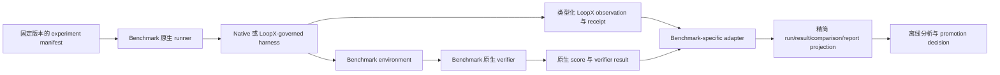

# RFC：长程 Harness Benchmark 与研究计划 v0

| 字段 | 值 |
|---|---|
| 状态 | Draft，研究计划 |
| 日期 | 2026-08-16 |
| 作者 | LoopX maintainers |
| 范围 | 外部能力证据、benchmark 协作、harness 实验与机制 qualification |
| 源码基线 | LoopX `e8d40542f` |

> 语言说明：[英文版](./long-horizon-harness-benchmark-research-program-v0.md)
> 与本文档是语义镜像；两者存在差异即视为缺陷。

## 1. 决策摘要

LoopX 应维护一套长程 harness 研究计划，并严格分成两条 lane：

1. **能力论证**：在公平、可复现的比较中，验证固定版本的 LoopX harness
   是否改善 benchmark 原生结果、效率或恢复能力。
2. **机制研究**：把 benchmark 任务作为实验环境，对 stride、evidence
   delivery、replan、研究探索、人类注意力、记忆效用和 capability evolution
   等类型化假设进行验证。

第一批外部效度组合应采用三个互补 benchmark，而不是构造一个合成总榜：

- **Agents' Last Exam（ALE）**：覆盖广泛的专业工作流、CLI/GUI 混合环境和有
  经济意义的交付物；
- **Long-Horizon Terminal Benchmark（LHTB）**：覆盖数百个相互依赖的终端动作、
  dense partial reward、verifier checkpoint 和长跑失败动态；
- **DeepSWE**：覆盖由 outcome-oriented verifier 验证的原创长程软件工程任务。

benchmark 的原生 runner、任务合同、verifier、score 与发布规则继续拥有权威。
LoopX 提供 adapter、实验 manifest、类型化控制 observation 与精简、public-safe
的结果 projection。LoopX 不得用自己的 coordination score 替换 benchmark truth。

单次运行、控制面调用次数或内部指标改善都不能证明 LoopX 能力。能力主张必须有
benchmark 原生 outcome 证据或 cost-normalized non-inferiority、treatment 完整性、
重复匹配运行与不确定性分析。机制研究可以发布负结果，也可以长期保持非 leaderboard
研究状态。

## 2. 为什么需要这套计划

LoopX 已经有若干可供选择的 benchmark 执行表面：

- provider-neutral 的 `BenchmarkAdapter` lifecycle；
- 精简的 `benchmark_run_v0`、`benchmark_result_v0`、
  `benchmark_comparison_v0` 与 `benchmark_experiment_report_v0` read model；
- run permission、route、lifecycle、attempt、failure 与 artifact boundary；
- ALE、Terminal-Bench、SkillsBench 与 AgentIssue-Bench adapter；
- passive baseline、assisted mode 与 claim boundary 文档。

这些资产是有用输入，不是新计划的架构权威。大量现有 benchmark 代码和调研早于持续的
native-versus-LoopX pilot，在抽象质量、验证深度和实际运维价值上并不均匀。只有当前真实
运行证明某个组件的 caller outcome、boundary 与 conformance contract 后，才应保留它。

当前缺少的是一份长期研究合同，明确这些基础设施究竟可以证明什么。没有这份合同，
计划可能把协议活动误当成有用工作，在看到结果后挑 case，比较不兼容的 harness，或把
多个机制打包成一个无法做因果归因的 treatment。

这套计划也需要外部广度。纯软件 benchmark 能证明工程价值，却不能证明专业工作迁移；
广泛的 CUA benchmark 能证明外部效度，却更难归因到某个 loop 机制；binary-only
benchmark 可能隐藏部分进展，而 dense-reward benchmark 又可能过度强调 verifier
cadence。三个 benchmark 组成的组合把这些限制转化为互补证据。

核心研究问题是：

> 在什么任务、模型、host 和 budget 条件下，外置 durable control plane 对经过验证的
> 长程工作产生的改善，足以覆盖其协议、延迟与复杂度成本？

### 2.1 证据与设计权威

不能混淆两套权威顺序：

1. **Benchmark truth** 来自固定版本的 upstream runner、environment、verifier、scoring
   contract 与发布规则。
2. **LoopX benchmark capability 的设计 truth** 首先来自当前 pilot 实践及其经过独立检查的
   failure mode；官方 benchmark 材料解释原生边界；既有 LoopX benchmark 代码和旧调研只是
   待验证的复用候选，不是预设架构。

因此，当前 DeepSWE pilot 是 LoopX benchmark capability 的第一份设计驱动实践。其可泛化
经验包括：arm 权限对齐、hidden answer 与 verifier 隔离、独立 completion validation、
validation 后才能 accountable settlement、精简 run reduction，以及 treatment integrity
无法证明时显式判无效。私有 trajectory 与 audit artifact 只保留为本地证据；只有泛化后的
typed contract 与 public-safe 结论可以进入仓库。

## 3. Benchmark 介绍与适配分析

本节的 benchmark 数量和 leaderboard 值是 2026-08-16 审阅时的信息快照，不是规范。
每个实验都必须固定 upstream revision、任务集、runner、verifier 与 budget。

### 3.1 Agents' Last Exam

[Agents' Last Exam](https://agents-last-exam.org/) 评估具有可验证结果的长程、
有经济价值的专业工作流。公开站点报告已经收集 1,500+ 个任务，覆盖 55 个目标
sub-industry；[论文](https://arxiv.org/abs/2606.05405)把 benchmark 组织为 13 个
industry cluster，并表明最难 tier 仍远未饱和。

公开的[评估框架](https://github.com/rdi-berkeley/agents-last-exam)把 agent harness、
类机器 sandbox 与可执行任务分离。任务包含 instruction、输入材料以及在 agent 完成后
才注入的 hidden reference；`evaluate()` 返回 `[0, 1]` score。runner 收集统一
trajectory 与 artifact，并同时支持 sandbox 内 CLI 和 sandbox 外 harness。ALE 明确保留
各 harness 自己的 loop、tool、memory 与 sub-agent，而不是用一个 step-by-step scaffold
驱动所有系统。

**最适合 LoopX 研究的问题**

- CLI 与 GUI 工作之间的跨 surface continuity；
- 异构专业软件中的 durable state 与恢复；
- 真实用户判断具有价值时的 authority 与 human-attention 研究；
- 一套 provider-neutral control plane 能否迁移到软件工程之外；
- 围绕可扩展任务 pipeline 与 verifier contract 的 benchmark 协作。

**主张限制**

- 任务异质性和 licensed environment 可能使重复 factorial study 成本很高；
- harness 级比较可能同时改变多个因素，除非严格固定 tool 与 capability surface；
- hidden reference 和原始专业 artifact 绝不能进入 LoopX 公开状态或仓库；
- 广泛 outcome 是很强的外部效度，却不能自动证明某一个机制，除非该机制被独立埋点。

### 3.2 Long-Horizon Terminal Benchmark

[LHTB](https://github.com/zli12321/LHTB) 包含 46 个 containerized task，覆盖九类
问题。任务采用 Harbor-compatible 五部分布局：metadata、instruction、environment、
hidden verifier 与 oracle solution。其公开的
[benchmark 说明](https://zli12321.github.io/LHTB/index.html)强调三种属性：数百个
相互依赖的动作、hidden/replay check 带来的 verifier resistance，以及 `[0, 1]`
continuous reward；`0.95` 是 solved threshold。

LHTB 修改版 Harbor 可以在中间 verifier 结果之后恢复 session，直到 pass 或 timeout。
它记录 checkpoint reward 与 verifier mode，而已发布的模型比较采用相同 Terminus-2
scaffold、90 分钟 budget，以及 mean reward 与 solve count。因此最终 score 和随时间变化的
progress shape 都可以观测。

**最适合 LoopX 研究的问题**

- 数百个终端动作上的 stall 与 repetition detection；
- semantic replan latency，以及新方向是否真的产生 reward progress；
- 使用 evidence/checkpoint，但不把 read 或 ACK 当成 progress；
- delivery-stride 与 interruption-cadence 研究；
- failed attempt、premature completion 或 verifier feedback 之后的恢复；
- reward area-under-curve 与 time-to-threshold 效率分析。

**主张限制**

- 修改版 Harbor 行为属于 benchmark 合同，不能复制成 LoopX 通用语义；
- 中间 verifier feedback 是 benchmark-native evidence，不是用户权限，也不是通用生产 oracle；
- identical-scaffold leaderboard 结果不能自动验证另一个 governed harness；
- dense reward 可以暴露进展，却不一定衡量代码可维护性或广泛专业迁移。

### 3.3 DeepSWE

[DeepSWE](https://deepswe.datacurve.ai/) 包含 113 个原创长程软件工程任务，覆盖
91 个活跃 repository 和五种语言。[论文](https://arxiv.org/abs/2607.07946)说明任务
从零编写，而不是从已合并修复中挖掘；手写 verifier 验证要求的功能，而不是某一个参考 patch。

官方[运行指南](https://deepswe.datacurve.ai/run)通过 Pier 暴露 Harbor-compatible
task。已发布 leaderboard 为了 scaffold 一致性统一使用 mini-swe-agent；Pier 也可以直接
驱动 Codex、Claude Code 等 CLI harness。公开 leaderboard 同时报告任务成功率、置信区间、
cost、output token 与 agent step。

**最适合 LoopX 研究的问题**

- 长程 repository 理解、实现、验证与恢复；
- durable Todo/evidence 相对强 coding-agent baseline 的价值；
- 软件工作中的 effect-stride 与 delivery-stride qualification；
- interruption/restart 后的 code-quality 与 verifier-outcome parity；
- 对其他环境发现的 capability 或 memory proposal 做 holdout evaluation。

**主张限制**

- 从公开 mini-swe-agent scaffold 切换到其他 harness 属于 harness experiment，
  不是 model-only leaderboard 比较；
- 任务和 verifier 材料不得作为 training、memory、skill 或 capability evolution 输入；
- verifier pass 本身不能证明维护成本更低或具备广泛专业迁移；
- repository trace 可能敏感且体积很大，进入 LoopX state 前必须 reduction。

### 3.4 StartupBench

[StartupBench](https://startupbench.github.io/) 评测通用 agent 在"市场验证过的
startup 工作流"上的表现。包含 97 个真实工作流任务，覆盖六个专业域（医疗健康 21、
金融 18、商业与管理 19、法律 16、STEM 与计算机 16、教育与人文 7）。任务来自获得
融资的 AI-native startup 产品、产品 demo 与用户访谈中真实委托给 agent 的工作流；
每个任务要求 agent 在接近真实的工作区约束下搜索、推理、组织、验证并交付多格式
artifact（DOCX、XLSX、PPTX、PDF、Markdown、图片、文本）。

评分是 artifact-first：每个提交先转换为 evidence view，再按细粒度加权 rubric
（平均每个任务 25.3 条）评判，而不是按答案相似度。公开的 Agent-as-Judge 框架报告
92% 人类一致性、pass 阈值为 90、九个大模型上最高平均分 73.67、top pass@1 31.27，
说明多数真实工作流交付物仍达不到生产就绪。

**最适合 LoopX 研究的问题**

- 长程 artifact 交付与多格式输出验证；
- 超越软件的专业域工作流委托（金融、法律、医疗、商业）以及控制平面能否迁移；
- 交付物质量与自我验证幻觉：agent 声称满足需求而 rubric 检查失败；
- 交付物被外部评判的 human-attention 与 authority 研究；
- 围绕 artifact 完成度与格式合规的 evidence-linked Todo/settlement。

**主张限制**

- 任务场景、参考材料与生成 artifact 不得进入 LoopX 公共 state 或可复用
  training/memory surface；
- Agent-as-Judge 是 benchmark 原生评测，不是通用生产 oracle 或权威；
- rubric 分数本身不能证明维护成本更低或广泛专业迁移，需要独立审计；
- leaderboard 是 model/scaffold 特定结果；更换 harness 是独立实验。

### 3.5 LoopsBench

[LoopsBench](https://loopsbench.ai/)（microsoft/Loopsbench）是长程终端环境软件
任务的 benchmark 与 harness。每个任务打包 agent 可见 workspace、单元级需求、
模块依赖图，以及 Docker-backed 执行环境，verifier 区分 incomplete、partial、
complete 三种完成度。任务语料通过 GitHub-native 的 task proposal 与 validation
社区化生长，发布确定性 bundle 与 SHA-256 校验；[论文](https://arxiv.org/abs/2608.00267)
公开，数据集在 [Hugging Face](https://huggingface.co/datasets/LoopsBench/LoopsBench)。
内置 adapter 覆盖 Oracle、Mini SWE-agent、SWE-agent、OpenHands、Claude Code、
Cursor、Codex、Qwen Code、Copilot。

**最适合 LoopX 研究的问题**

- 多单元长程实现：跨相连模块规划、实现、测试与恢复，且依赖图显式可见；
- partial-vs-complete verifier 语义：进展与完成可分别观测；
- 依赖图感知的工作排序与 stall/replan 研究；
- Docker/terminal 真实感与可复现的远程/本地执行；
- 单元测试失败与 verifier 反馈后的恢复，且不把 read/ACK 当作进展。

**主张限制**

- 任务语料仍在增长；每次实验必须固定 upstream revision 与精确任务集；
- incomplete/partial/complete 分层是 benchmark 合同，不得复制为通用 LoopX
  生产语义；
- Docker-backed 终端任务需要干净的网络与容器隔离 attestation；
- 早期 leaderboard 比较是暂定的，不是饱和参考。

### 3.6 WideSearch

[WideSearch](https://widesearch-seed.github.io/)（ByteDance-Seed/WideSearch）
评测 agentic broad information-seeking。包含 200 个双语任务（100 英文、100 中文）
覆盖 18 个行业，要求 agent 搜索、收集并把大规模结构化信息整理成 markdown 表格。
挑战在于操作规模与完整性，而不是单条事实的认知难度；评测用细粒度 Item F1，
含 exact-match、number-near、URL-match、date-near 与 LLM-judge 组件。
[论文](https://arxiv.org/abs/2508.07999)与[数据集](https://huggingface.co/datasets/ByteDance-Seed/WideSearch)
以 MIT 协议公开，并有 [Harbor adapter](https://github.com/harbor-framework/harbor)
支持确定性任务生成。

**最适合 LoopX 研究的问题**

- 需要 benchmark toolkit 网络放行策略（`widesearch-permitted-solving`）的
  网络研究型任务，LoopX integrity reducer 已建模该策略；
- 长程收集/完整性与幻觉：agent 必须验证规模与完整性，而不只是找到一条事实；
- 基于证据的验证（citation、URL、日期、数字），可衔接 evidence 与
  human-attention 研究；
- 跨 18 个行业的双语（中/英）泛化；
- 作为"深搜"benchmark 的互补：强调广度与体量。

**主张限制**

- 实时网络收集对时间与环境敏感；每次实验必须固定检索窗口、工具与搜索面；
- Item F1 与 LLM-judge 指标必须固定到精确合同与 judge model；
- 外部网络访问保持在 benchmark 原生 `permitted_solving` 策略内，不得泛化为
  生产网络 authority；
- 原始网页内容进入 LoopX state 前必须 reduction；benchmark 材料不得作为
  training、memory 或 skill 输入。

### 3.7 为什么这六个组成一个组合

| 证据维度 | ALE | LHTB | DeepSWE |
|---|---|---|---|
| 专业工作广度 | 主场 | 混合 | 仅软件 |
| CLI/GUI 跨 surface 工作 | 主场 | Terminal | Repository/terminal |
| Dense progress signal | 任务相关 `[0,1]` | continuous reward 主场 | 主要是 verifier outcome |
| 长 loop 动态 | 可观测 trajectory | 机制研究主场 | 强工程场景 |
| 原创/抗污染设计 | task-managed hidden reference | hidden/replay verifier resistance | 原创任务与 verifier |
| Harness 迁移证据 | 强，保留 harness | 必须显式比较 scaffold | Pier 支持多 CLI；已发布 scaffold 固定 |
| 最适合回答的 LoopX 问题 | 控制能否迁移到真实专业工作？ | loop 为什么、何时 stall 或恢复？ | 控制能否改善经过验证的软件交付？ |

计划必须在各 benchmark 的原生 metric space 中报告，不能把 ALE score、LHTB reward 与
DeepSWE pass rate 平均成一个 LoopX 数字。

第二组三个 benchmark 为同一计划补充了三个互补 surface：

| 证据维度 | StartupBench | LoopsBench | WideSearch |
|---|---|---|---|
| 工作 surface | 多格式专业 artifact | 多单元终端软件 | 大规模网络收集 |
| 核心挑战 | 交付物质量与格式合规 | 相连单元间的 partial vs complete | 规模上的广度与完整性 |
| 主要指标 | Weighted rubric / Agent-as-Judge | incomplete/partial/complete verifier 分层 | Item F1 与组件指标 |
| 长程相关性 | Artifact 组装与一致性 | 依赖图规划与恢复 | 持续的搜索/收集/验证 loop |
| 网络边界 | 工作流本地 | 容器化终端 | 求解阶段允许外部网络 |
| 最适合回答的 LoopX 问题 | 控制能否改善经验证的 artifact 交付？ | 多单元工作为何、何时 stall 或恢复？ | 证据门控的控制能否在规模上降低幻觉？ |

六个 benchmark 仍须在各自主语空间报告；StartupBench rubric、LoopsBench verifier
分层与 WideSearch Item F1 不得互相平均，也不得并入 ALE/LHTB/DeepSWE 的结果。

## 4. 主张阶梯

每个公开结果必须声明其支持的最高主张等级。

### C0：复现与 adapter fidelity

固定版本的原生 runner 可以完成 provision、execute、grade 与 reduction，且不改变任务语义。
adapter 保留 lifecycle 与 public boundary。不主张 LoopX 带来收益。

### C1：控制可观测性

LoopX 被动记录 durable state、progress、cost、recovery 与 failure attribution，且不改变
worker 决策或官方 outcome。这可以证明 auditability 或 measurement capability，不能证明
任务 uplift。

### C2：benchmark 内因果证据

匹配、重复比较隔离一个 governed mechanism 或一套完整 LoopX profile，并显示 benchmark
原生 uplift，或在 long-horizon failure metric 改善时达到 cost-normalized non-inferiority。
主张范围仅限固定 benchmark、model、harness、task stratum 与 budget。

### C3：跨 benchmark 一般性

同一个类型化机制方向在至少两个实质不同的 benchmark family 上复现，且没有
benchmark-specific semantic shortcut。effect size 可以不同；第三类 benchmark 的 null
result 也必须进入报告。

### C4：产品 promotion 证据

机制获得 C2 或 C3 证据，通过 LoopX model-behavior 与 state-machine qualification，满足
overhead 与 authority budget，并通过非 benchmark product canary。只有此时 maintainers
才可以考虑更改默认 profile。benchmark 证据本身不能改变生产默认值。

## 5. 实验合同

### 5.1 比较单位

最小实验 identity 是：

```text
(benchmark_id, benchmark_revision, task_id, task_stratum,
 environment_digest, verifier_revision, model_id, model_revision,
 harness_id, harness_revision, policy_profile, seed, budget)
```

未知值保持显式 unknown。display name、prose prompt 或“同一 model family”都不是 identity。

### 5.2 必需 arm

计划区分四种 arm：

1. **Native baseline**：benchmark 支持的 reference scaffold，或声明过的、没有 LoopX
   控制的 CLI harness。
2. **Passive LoopX**：worker decision 和 benchmark 合同完全相同，只增加只读 LoopX
   observation 与精简 settlement。
3. **Governed LoopX**：声明过的 LoopX profile 可以影响 continuation、checkpoint、
   replan、recovery 或允许的控制动作。
4. **Mechanism ablation**：只让一个具名机制与 governed parent profile 不同，其他所有
   可控字段保持一致。

assisted human 或 simulator intervention 是独立 study family，绝不能呈现为 autonomous
leaderboard arm。

对于 Codex treatment comparison，现有 Passive Baseline Protocol 仍要求匹配的 Codex
goal-mode baseline。benchmark-reference scaffold reproduction 是额外 fidelity row；它不能
替代 attribution LoopX treatment 所需的 same-host baseline。

### 5.3 公平性与 treatment 完整性

对于匹配 cell：

- 固定 task input、environment、verifier、model revision、reasoning effort、budget、
  network/tool envelope 与 starting state；
- 显式声明 runner 与 harness 差异，不能藏在 model name 后面；
- 运行期间不能更改 release、prompt policy、skill set 或 scheduler implementation；
- 两个 arm 获得相同的声明 authority envelope，并由结构化 integrity audit 证明 worker
  无法访问 hidden reference、expected answer、verifier internal 与 post-run grading material；
- 每个 treatment 都产生精简、类型化 receipt，证明哪些机制已 delivery、trigger、accept、
  reject 或未使用；
- treatment 没有送达属于 non-compliance，不是 treatment failure；
- crash、setup failure 与 verifier failure 保留独立的 attempt/failure class；
- 在看到 outcome 前登记 task selection 与 primary metric。

重复比较应使用配对 task 与 seed。每个准备 promotion 的 comparison cell 默认至少
`N >= 5`，但这不是统计功效保证。昂贵 ALE cell 可以采用预先声明的 sequential design，
但 stopping rule 不能依赖当前 effect 是否有利。

### 5.4 结果分层

每个 experiment report 必须分开保存：

- benchmark 原生 outcome；
- LoopX control-plane observation；
- cost 与 latency；
- assisted intervention（如有）；
- treatment-integrity 状态；
- benchmark-integrity 与 arm-authority-parity 状态；
- publication 与 leaderboard eligibility。

内部 control score 可以诊断行为，但不得加到原生 task score 上，也不能把失败任务变成成功。

## 6. 测量模型

### 6.1 原生结果

- benchmark score、reward 或 pass result；
- 带不确定性的 task/stratum success rate；
- 官方定义的 benchmark-native sub-score；
- 最终 artifact/verifier outcome；
- submit 与 leaderboard eligibility。

### 6.2 效率

- wall time、model token、provider cost、tool call 与 agent step；
- 与 raw score 同时报告的 score per unit cost/time；
- benchmark 原生 checkpoint 可用时的 reward area under time/step curve；
- 到首个 material delta 和各 score threshold 的时间与成本；
- honest success、exhaustion、blocker 或 no-follow-up 后未使用的 budget。

### 6.3 长程控制质量

- 物质等价 work-slice 的重复次数；
- replan obligation 之后仍被接受的 idle/maintenance loop；
- trigger-to-context、trigger-to-new-direction 与 trigger-to-material-delta latency；
- evidence 的 delivered、used、contradicted 与 ignored；
- interruption 后的 duplicated work 与 recovery loss；
- stale-state、premature-terminal、repeated-blocker 与 harness-conflict rate；
- durable settlement lag 与 resume quality；
- 把 protocol tax 拆成 model token、control call、wall time 与 attention，不能只看调用占比。

这些 measurement 必须来自 typed observation、receipt、runner event 或 verifier checkpoint。
prose similarity 与 keyword matching 不能成为 semantic truth source。

### 6.4 人类注意力

仅适用于 assisted study：

- human/simulator attention minutes 与 response latency；
- 真正改变 authority 的 gate 与 status-only interruption；
- accepted、declined、expired 与 unused wishlist item；
- intervention 避免的浪费工作；
- false escalation 与 unnecessary gate rate；
- 固定 intervention budget 下的 value of information。

### 6.5 Benchmark integrity 与反作弊

如果某个 arm 可以访问 hidden answer、reference artifact、verifier implementation detail、
post-run grading material，或拥有更宽且未声明的权限 envelope，那么结果即使正确，也不能
成为合格证据。integrity 是独立 qualification 轴，不能在评分后作为一条备注补上。

audit 必须消费结构化 runner fact：mount/file visibility、environment/capability manifest、
network policy、artifact staging phase、tool-access event、verifier invocation ownership 与
cross-arm envelope diff。不得根据模型 prose、command substring，或 solution 与 reference
answer 相似这一事实来推断作弊。

最小 disposition 为：

- `eligible`：声明 envelope 与观测到的 access 均 conformant；
- `quarantined`：证据不完整或尚不能建立 parity；
- `invalid`：forbidden source 可访问、worker 参与 grading，或 arm 存在影响 outcome 的未声明
  authority mismatch。

私有 audit 可以保留 protected evidence pointer 与精确 access event。公开 receipt 只包含稳定
run identity、固定 policy/environment digest、parity status、disposition、reason code 与
redacted evidence reference。公开 receipt 不能把未知的 private audit 升级为 `eligible`。

## 7. 架构与 ownership



ownership 遵循这些规则：

- **benchmark** 拥有 task meaning、environment、verifier、native score、submission policy
  与 benchmark version；
- **host harness** 拥有其 model/tool loop 与 provider-native execution；
- **LoopX core** 拥有 provider-neutral goal、Todo、evidence、effect、replan、settlement、
  authority 与 compact benchmark contract；
- **benchmark adapter** 拥有 runner-specific launch、observation、reduction 与 failure
  attribution；
- **research evaluator** 拥有离线 comparison，不得获得 runtime authority；
- maintainers 在独立 product validation 后拥有生产 promotion 权限。

当前 `BenchmarkAdapter` 与 compact read model 是最近的候选 owner，不是冻结架构。LHTB 与
DeepSWE 只有在真实、固定 runner call site 出现，且 pilot 证明哪些现有组件真正有用时，才
新增窄 adapter。修改版 Harbor/Pier 行为留在 adapter boundary；不能因为两个 benchmark
都使用 Harbor-compatible task 就变成 LoopX 通用 lifecycle logic。

### 7.1 从 DeepSWE pilot 孵化 benchmark capability

产品 outcome 不是“运行某个 adapter”，而是：

> 在不暴露受保护任务材料的前提下，产出可复现、通过 integrity qualification 的
> benchmark-native result 与精简 claim receipt。

这是 LoopX `benchmark` capability 的 caller contract。现有 `benchmark_runner` token 仍只是
execution-capacity 声明；它本身不授予 task access、verifier access、submission authority 或
result eligibility。benchmark-specific adapter 是 outcome contract 的 provider，不拥有通用
integrity 或 settlement truth。

第一份 cohesive capability slice 应按以下顺序从真实 DeepSWE pilot 中提炼：

1. 固定 run identity 与 native-runner preflight；
2. arm authority-envelope 声明与 parity check；
3. 私有结构化 integrity audit 与 public-safe receipt；
4. attempt lifecycle 与 failure attribution；
5. controller-owned completion validation；
6. validation 后才允许 accountable writeback 与 spend；
7. native result reduction 与 claim-level projection。

只有 characterization 证明语义一致时才保留已有代码。大型 ledger、带日期的 routing packet、
benchmark-specific prose parser 与未使用 builder，不会因为已经存在就自动成为 capability
architecture。

第一个真实 call site 应先稳定一份小型 private audit contract，再考虑 promotion。代表性
形状是：

```text
benchmark_integrity_audit_v0
  run_identity
  arm_id
  declared_authority_envelope_digest
  observed_access_summary
  cross_arm_parity
  hidden_reference_access
  verifier_material_access
  grading_owner
  disposition
  reason_codes
  private_evidence_refs
```

其公开 projection 排除 `private_evidence_refs`、raw path、tool log、task text、trajectory、
expected answer 与 verifier output。已有 `trajectory_hygiene_summary_v0` 衡量 controller 与
non-material event mix；它不能证明 benchmark integrity，也不能复用为反作弊 oracle。

## 8. 机制研究实验场

### 8.1 分层 stride

[长程 Agent 分层步幅控制 RFC](./hierarchical-agent-stride-control-v0.md)
定义 effect、delivery 与 authority stride。benchmark 应每次只 qualification 一层：

- DeepSWE：repository 调查、实现与验证时的 effect/delivery stride；
- LHTB：delivery stride、checkpoint cadence 和 contradictory verifier evidence 后的纠偏；
- ALE：异构 tool 下的 authority stride 与 cross-surface delivery。

研究应估计 model/work-class-specific response curve，而不是一个全局 tool-call 或 Todo-count
threshold。更宽并不天然更好。

### 8.2 Evidence、空转检测与 semantic replan

核心假设是 durable coverage ledger 与 semantic progress observation 能阻止重复 maintenance
工作，并让 replan 产生新的 runnable direction。read receipt 只证明 context delivery。
replan closure 必须是类型化 semantic delta，例如新 surface、hypothesis、probe family、
successor、coverage-backed exhaustion、blocker 或 no-follow-up。

LHTB 是首要动态实验场，因为 partial reward 与 checkpoint 可以显示方向变化是否产生进展。
DeepSWE 验证相同机制能否改善 repository outcome，且不依赖 reward-specific shortcut。
ALE 验证它能否迁移到异构专业工作流。

### 8.3 研究探索与组合

[研究型探索控制面 RFC](./research-exploration-control-plane-v0.md)定义 typed research
node、closure 与 explicit composition experiment。LHTB 的 research-reproduction 任务和
ALE 的分析型 workflow 可以验证 composition candidate 是否改善 coverage 或 outcome。
DeepSWE 可以验证 repository surface 之间的组合，但 pass patch 仍是最终权威。

benchmark feedback 不能直接创建 research graph truth。adapter 把 public-safe evidence
映射为 observation；research contract 决定 node 是 closed、contradicted，还是产生
composition candidate。

### 8.4 Human-attention wishlist

[Human Attention Wishlist RFC](./human-attention-wishlist-v0.md)可以作为 assisted-mode
sidecar 评估。问题不是 agent 能否生成更多 request，而是 bounded、evidence-backed wish
能否在不成为 false gate、不打断 autonomous delivery 的前提下，提高 outcome 或减少每分钟
human attention 对应的浪费工作。

ALE 是最强主实验场，因为专业 workflow 经常有真实 preference 与 expertise leverage。
LHTB 和 DeepSWE 应作为 negative control：大多数 benchmark task 没有合法 human authority
surface，因此 wishlist traffic 通常应为零。

### 8.5 Capability evolution sandbox

benchmark 可以暴露反复出现的能力缺口，但任何 benchmark run 都不能自主 install、promote
或训练 production capability。研究 lifecycle 是：

```text
typed unmet-outcome observation
  -> bounded capability candidate
  -> public-safe implementation proposal
  -> offline/unit qualification
  -> development-task validation
  -> held-out benchmark evaluation
  -> maintainer promotion or rejection
```

wishlist item 可以请求人类提供 expertise、permission 或 optional provider，但不能充当
capability approval。capability candidate 必须按 caller outcome 命名，不能按 benchmark task
或 delivery mechanism 命名。

为了避免 benchmark overfitting：

- discovery 与 evaluation task set 分离；
- task body、hidden verifier detail、trajectory 与 answer artifact 不进入 reusable memory
  或 capability package；
- promotion 要求非 benchmark product validation；
- capability provenance 记录哪些 observation 促成 proposal；
- null 或 harmful candidate 保留为研究结果，不能暗中重试到有利为止。

### 8.6 Post-outcome memory utility

[结果后记忆效用归因 RFC](./post-outcome-memory-utility-attribution-v0.md)可以把经过验证的
benchmark outcome 作为一种 evidence source。trajectory-level reward 不能建立 per-memory
causal credit。给出强 utility 前必须做 holdout replay 或 bounded ablation。benchmark 内容
绝不能以污染后续 task 的方式被保留。

## 9. Benchmark 集成计划

### 9.1 ALE

扩展已有 ALE adapter，不能创建并行集成。第一份合作 package 应包含：

1. 精确 upstream revision 与 provider/deployer characterization；
2. 在 public、license-compatible slice 上复现 native no-LoopX 结果；
3. passive LoopX trajectory/result reduction，并保持 outcome parity；
4. 一个具有 preregistered hypothesis 的 governed recovery 或 stride experiment；
5. 当 ALE maintainers 认为有用时，提供 upstream-friendly harness/deployer 或
   trace-conformance patch。

长期协作可以共同构建 scalable task pipeline：一类反复出现的真实工作、task-generation
template 与一致 verifier。LoopX 应贡献 harness 和 longitudinal evaluation 专长，不能主张
自己不具备的 domain authority。

### 9.2 LHTB

固定 repository、Harbor modification 与 `continue_until_timeout` 语义后才新增 adapter。
第一份 package 应包含：

1. oracle smoke 与一个 native Terminus-2-compatible reproduction；
2. final/checkpoint reward reduction，且不保留 raw verifier output；
3. passive stall/repetition 与 protocol-tax characterization；
4. 一个独立 semantic-replan ablation；
5. runner-to-adapter conformance test，区分 solver、verifier 与 infrastructure failure。

LoopX 只把 verifier feedback 当作此 benchmark 提供的 evidence，不得把它泛化成生产控制面
authority。

### 9.3 DeepSWE

characterize native subset run 与官方 result reduction 后才新增 Pier/Harbor adapter。
第一份 package 应包含：

1. deterministic public task sampling 与固定 Pier configuration；
2. native mini-swe-agent reproduction，用于 scaffold parity；
3. 测试 Codex 或其他 host 时，显式声明 CLI harness comparison；
4. 在相同 task/model/budget cell 上运行 passive/governed LoopX arm；
5. 报告 code change、verifier、cost、token 与 step，不把 task solution 留在 reusable state。
6. 任一 arm 成为 claim-eligible 前，完成 authority-parity 与 anti-cheating audit；
7. 采用 controller-owned Todo completion validation 与 accountable settlement，复用
   [PR #3229](https://github.com/huangruiteng/loopx/pull/3229) 已证明的通用 invariant。

DeepSWE 也是第 7.1 节 benchmark capability 的第一孵化环境。pilot 应一次提炼一个 cohesive、
经过测试的 seam；不能整体保留 legacy benchmark 目录，也不能在真实 call site 提出需求前
先重写整个目录。

### 9.4 StartupBench

固定 upstream revision、任务集与 rubric 合同后才新增 adapter。第一份 package 应包含：

1. deterministic public task sampling 与固定 workspace/参考材料；
2. 在 license-compatible slice 上做 native no-LoopX reproduction，并与公开
   rubric score 对齐 outcome parity；
3. passive LoopX trajectory/result reduction，不把任务场景、参考答案或生成
   artifact 留在 reusable state；
4. 一个带 preregistered hypothesis 的 governed delivery/recovery experiment；
5. authority-parity audit，把 Agent-as-Judge 框架视为 benchmark 原生证据，
   而不是生产 oracle。

StartupBench 材料必须留在 LoopX 公共 state、memory 与 skills 之外；只有紧凑的
qualification receipt 与 artifact 级 evidence pointer 可以进入控制平面。

### 9.5 LoopsBench

固定 repository revision、任务集、Docker image 与 verifier 语义后才新增 adapter。
第一份 package 应包含：

1. oracle smoke 与一次通过内置 adapter 的原生 reproduction；
2. 在不保留原始 verifier output 的前提下 reduction incomplete/partial/complete
   verifier outcome；
3. passive stall/repetition 与依赖图有序工作的 characterization；
4. 在固定多单元任务上做一个 semantic-replan ablation；
5. runner-to-adapter conformance 测试，区分 solver、verifier 与 infrastructure
   失败，并做干净的网络/容器隔离 attestation。

verifier 分层是 benchmark 合同：LoopX 应把它当作该 benchmark 提供的 evidence，
不得泛化为生产 completion 语义。

### 9.6 WideSearch

固定 dataset revision、检索窗口与 judge model 后才新增 adapter。第一份 package 应包含：

1. 通过 Harbor adapter 做 deterministic task generation，固定 split 与 judge
   configuration；
2. 在 public slice 上做 native no-LoopX reproduction，Item F1 parity；
3. passive LoopX reduction，在 `widesearch-permitted-solving` 策略下记录
   loopback/external network evidence，且不削弱 fail-closed 的受限资源拒绝；
4. 一个带 preregistered hypothesis 的 governed evidence-gating experiment
   （citation/URL/date/number 验证）；
5. anti-cheating audit，覆盖检索窗口固定与原始网页内容对 reusable state 的污染。

外部网络访问是 benchmark 原生 `permitted_solving`；不得成为通用生产网络
authority，也不得绕过任何模式下保持 fail-closed 的受限资源拒绝。

## 10. 协作合同

benchmark 协作应产生可 review 的 upstream value：

- 保留 benchmark 原生 task 与 verifier 语义；
- adapter 与 runner change 可以独立测试；
- 对 versioned trace、checkpoint 与 result field 达成一致，而不是解析 prose log；
- 发布精确 experiment manifest 与 claim boundary；
- 分离 benchmark-maintainer review 与 LoopX product promotion；
- 适合时把通用 runner/conformance fix 贡献给 upstream；
- 根据具体工作为 task author、benchmark maintainer、adapter author 与 research
  contributor 提供 attribution；
- 发布 null result、harness tax 与不兼容 comparison；
- 永不暴露 private task、licensed asset、hidden reference、credential、raw trajectory
  或私人协作材料。

目标不是 fork 出每个 benchmark 的 LoopX edition，而是让 LoopX 成为行为规范的 harness
participant，其结果可以被 benchmark maintainer 复现和审计。

## 11. 工程建设计划 {#11-engineering-construction-plan}

上面的研究合同定义 benchmark 结果可以证明什么；本节定义仓库应该如何建设、验证和
运行这些工程。两条阶梯刻意保持正交：

- **工程 readiness** 描述可复用 contract、runner seam、evidence boundary 与运行路径
  是否已经实现并通过 qualification；
- **主张等级（C0--C4）** 描述实验最终可以对 LoopX 说什么。达到某个工程阶段不会
  自动提升研究主张等级。

### 11.1 Ownership 分层

每个 benchmark integration 都应从最可复用到最具体地分成以下层：

1. **Provider-neutral toolkit**
   - 负责 typed permission、source/artifact boundary、integrity receipt、runtime
     observation、experiment-board projection、countability gate 与 public-safe
     post-run contract；
   - 不授予 runner、model、Docker、verifier、upload、submission 或 publication authority。
2. **Native runtime bridge**
   - 负责支持的 harness 所使用的真实 host transaction，例如 native Codex Goal transport
     与 continuation lifecycle；
   - process、environment 与 task bridge authority 仍归 runner 所有。
3. **Benchmark adapter**
   - 负责 task provisioning、benchmark-native lifecycle、verifier invocation、score
     reduction、checkpoint 语义与 benchmark-specific failure attribution；
   - 必须导入 toolkit contract，不能重新实现 generic state 或 integrity logic。
4. **Study 与 analysis layer**
   - 负责 manifest、preregistered arm selection、paired comparison、uncertainty 与
     offline interpretation；
   - 不得授予 runtime authority，也不得重写 benchmark-native result。

不要为了让 runner 可安装，就创建第二套 active benchmark package、generic score authority，
或 benchmark-specific capability。新增 module 必须有真实 caller、明确 owner、聚焦 contract
和同一变更中的 validation surface；否则应明确拆成后续阶段。

### 11.2 工程 readiness 阶段

在 PR、contributor task 与 pilot update 中统一使用以下阶段。它们是 delivery gate，不是
release promise：

- **E0：Contract 与 boundary foundation**
  - 记录 typed schema 与 ownership 决策；
  - public/private 和 authority boundary 有 negative coverage；
  - 不要求 live benchmark run。
- **E1：Native runner conformance**
  - 一个固定的 public-safe runner path 能对 synthetic 或获准 task slice 完成 preflight、
    execute、verify 与 reduce；
  - source、runtime、treatment 与 integrity receipt 在不包含 raw task material 的情况下
    生成；
  - setup、solver、verifier 与 scoring failure 保持可区分。
- **E2：Campaign operations**
  - experiment-board identity、concurrency admission、exact-job observation、runtime
    continuity、terminal closeout 与 safe reconciliation 能覆盖重复 transition；
  - provider 可以恢复或 quarantine invalid run，而不改变 score authority。
- **E3：Matched-study readiness**
  - baseline、passive、governed 与 ablation arm 有声明过的 manifest；
  - task/model/harness/budget identity、treatment delivery、integrity 与 countability
    独立检查；
  - paired analysis 与 stopping rule 在 outcome inspection 前注册。
- **E4：Replication 与 promotion readiness**
  - 一个命名机制在第二个 benchmark family 复现，或形成记录清晰的 null result；
  - protocol tax、uncertainty、authority risk 与 public/private handling 经过 review；
  - non-benchmark product qualification 与 maintainer promotion 仍是独立的必需 gate。

当前仓库最强的是 E0--E2；E3 是下一阶段工程与研究目标，E4 仍是未来 promotion gate。
一个 adapter 可以在工程上达到 E1，但其 study 仍然只有 C0；如果 E2 runtime evidence
不完整，C2 result 也不成立。

### 11.3 必需的 delivery slice

每个 benchmark engineering PR 或 contributor task 都应声明一个有界 slice，包含：

- caller outcome 与 owning layer；
- schema 或 transition contract，包括 illegal state；
- 一个真实或 synthetic call site；
- characterization 以及 negative/mutation coverage；
- compact public-safe receipt 或 projection；
- private-input boundary 与 artifact classification；
- 精确的 validation command 与 expected disposition；
- 链接回本文的文档，而不是把 benchmark-specific truth 复制进 generic toolkit docs。

优先交付完整的 vertical seam，而不是宽泛的 inactive framework。例如，adapter 应先证明
一个 native preflight 和一个 official-result reduction，再考虑添加没有 caller 的通用
campaign scheduler、大型 ledger 或 benchmark-family abstraction。

### 11.4 社区贡献路由

社区贡献者可以在公开 synthetic slice 和可复用 contract 上安全工作：

- adapter lifecycle 与 result-reduction fixture；
- integrity、source、artifact 与 authority-parity negative test；
- experiment-board transition、reconciliation 与 concurrency reducer；
- public-safe trajectory 与 case-insight projection；
- manifest validation、matched-pair analysis、uncertainty 与 protocol-tax tooling；
- 对 benchmark maintainer 友好的 trace 或 runner conformance fix；
- 明确 claim level 与 non-goal 的文档和 example。

Live task、hidden verifier、raw trajectory、credential、official submission、未公开比较
和 leaderboard operation 仍由 maintainer 负责。Contributor task 必须写明目标 base branch、
最小有用 slice、non-goal 与 validation plan；RFC 或 direction tracker 本身不授权实现。

### 11.5 工程 readiness review

在称一个 slice ready 之前，reviewer 应回答：

1. 行为由 toolkit、native runtime、benchmark adapter 还是 offline evaluator 拥有，代码
   布局是否表达了这个 ownership？
2. 是否有真实 caller 执行新 contract？如果没有，提案是否应该停留在 RFC/fixture，而不是
   变成 production structure？
3. invalid、incomplete 或 authority-mismatched run 能否 fail closed，并且不泄露私有数据、
   不会静默变成 countable？
4. public receipt 是否足够解释 classification，而无需复制 raw evidence？
5. benchmark-native score 与 LoopX control observation 是否仍然分离？
6. validation 是否覆盖 negative path 和下一种可能 mutation？
7. 这项工程最多支持哪个 C-level claim，还缺什么证据？

该 review 是普通工程 hygiene 的一部分，不授权 live run、leaderboard submission、capability
promotion 或修改 LoopX default。

## 12. 研究计划里程碑

### M0：RFC 与 source registry

- 采用 portfolio、claim ladder 与 experiment contract；
- 本地登记 durable source authority，不提交私人链接；
- 后续修改时让现有 benchmark roadmap 与本文保持一致。

### M1：原生复现与 adapter conformance

- 每个 benchmark 固定一个 public-safe task slice；
- 复现 native outcome 与 lifecycle；
- 证明 compact reducer 不改 score，也不读 forbidden artifact；
- characterize 当前 DeepSWE pilot，按已证明的 caller value 选择、删除或替换 legacy
  benchmark 组件；
- 为首个 paired cell 产出 arm-authority parity receipt 与 private integrity audit；
- 不发布 LoopX uplift claim。

### M2：Passive observability baseline

- 比较 native 与 passive LoopX arm；
- 建立 outcome parity，并测量 protocol tax、recovery artifact 与 failure attribution；
- 只有 integrity eligibility 成立后才接受 outcome parity；
- 在 governed experiment 前修复 measurement gap。

### M3：第一批 governed experiment

- DeepSWE：一个 delivery-stride 或 recovery hypothesis；
- LHTB：一个 semantic-replan/stall hypothesis；
- ALE：一个 cross-surface continuity 或 authority-stride hypothesis；
- 每个机制保持独立 comparison。

### M4：复现与跨 benchmark 分析

- 带不确定性地重复准备 promotion 的 cell；
- 在第二类 benchmark family 上验证同一 typed mechanism；
- 发布 failure-mode heterogeneity，而不是只报告 pooled mean。

### M5：Human attention 与 capability evolution

- 在固定 attention budget 下运行 assisted study；
- 在 held-out task 上评估 capability candidate；
- promotion 前要求 maintainer review 与 non-benchmark canary。

## 13. 验收标准

满足以下条件时，本 RFC 才算成功：

1. 每个 benchmark experiment 都有固定 identity 和原生 outcome；
2. native、passive、governed、ablation 与 assisted arm 无法混淆；
3. treatment delivery/use 可以通过 typed receipt 观测；
4. setup、solver、verifier 与 official-score failure 保持分离；
5. protocol tax 以 token、time、cost、call 与 attention 衡量；
6. control metric 不能覆盖 benchmark failure；
7. benchmark-specific behavior 留在 adapter；
8. benchmark material 不能暗中进入 reusable memory 或 capability；
9. capability claim 声明其 claim level 与 uncertainty；
10. negative/null result 是一等 program output；
11. public artifact 不含私人协作上下文或原始受保护 benchmark 材料；
12. run 成为 claim-eligible 前，独立审计 hidden-reference、verifier-material 与
    authority-envelope access；
13. 只有 current-pilot characterization 证明合同后，才复用现有 benchmark 代码；
14. production promotion 需要 benchmark 证据之外的 product qualification。

## 14. 非目标

- 一个通用 long-horizon score 或 leaderboard。
- 替换 benchmark-native harness、grader 或 submission rule。
- 把更多 Todo、evidence row 或 control call 当成能力。
- 用 task-specific prompt/policy knowledge 优化一个 benchmark。
- 把 hidden task、trajectory 或 verifier feedback 喂给 training。
- 从 benchmark run 自动安装 capability 或修改 LoopX default。
- 要求 ALE、LHTB 与 DeepSWE 使用同一个 runner implementation。
- 在实验改变 harness 时主张 model capability。

## 15. 风险与缓解

| 风险 | 缓解 |
|---|---|
| Harness tax 覆盖所有收益 | governed trial 前先跑 passive arm，并拆分 overhead。 |
| Model 没有遵循 treatment | typed delivery/use receipt；分类为 non-compliance。 |
| Benchmark-specific policy 泄漏到 core | adapter ownership 与 cross-benchmark typed contract。 |
| Cherry-pick task/seed | 预先声明 task stratum、paired run 和 negative selection。 |
| ALE 广度让研究功效不足 | stratified slice 与 fixed stopping rule sequential design。 |
| LHTB verifier cadence 变成通用 oracle | checkpoint 语义留在 adapter，并在其他 benchmark 复现。 |
| DeepSWE 污染 capability/memory evolution | 严格 discovery/holdout split，不保留 task 内容。 |
| 某个 arm 可以看到 hidden answer 或 verifier material | 结构化 authority-envelope parity 与 access audit；quarantine 或 invalidate 该 run。 |
| Legacy benchmark 抽象决定新 capability | 只把它们当候选；仅保留当前 pilot 证明的行为。 |
| Rich trajectory 泄露 private/protected material | compact public-safe reducer 与显式 read boundary。 |
| 一个机制打包多个行为变化 | combined profile 前先做 single-mechanism ablation。 |
| Research policy 获得生产 authority | offline evaluator 与 maintainer promotion gate。 |

## 16. 开放研究问题

1. 哪些 benchmark-native checkpoint 足够频繁，既能做因果分析，又不改变 agent 行为？
2. provider 间 model/tool latency 差异很大时，应如何估计 protocol tax？
3. 哪些 typed progress observation 能从 terminal/SWE task 迁移到异构 CUA workflow？
4. host-delivered evidence 何时优于 model-initiated read，何时会造成 context overload？
5. adaptive stride policy 能否跨 task stratum 泛化，还是应保持 model/work-class profile？
6. wishlist 改善 ALE outcome 而不鼓励依赖人类帮助所需的最小 intervention budget 是多少？
7. 在一个 benchmark 中发现的 capability candidate，有多少能通过 held-out 与
   non-benchmark qualification？
8. benchmark maintainer 与 harness researcher 如何共享 trace schema，同时不抹平有意义的
   harness 差异？

## 17. RFC 维护协议

这是活的研究 RFC，不是冻结的 benchmark 快照。

- benchmark 事实只依据官方 paper、repository、site 与 versioned runner contract 更新；
- benchmark version 变化写入带日期的 decision log；
- 私人协作材料留在本地 authority registry，只提升泛化后的 public-safe contract；
- capability 设计以当前真实运行实践优先于旧 LoopX benchmark note/code，同时 upstream
  native contract 继续拥有 benchmark truth；
- 只有具备 LoopX owner contract 与 falsifiable benchmark hypothesis 的机制才能加入本文；
- 只有提供不同 validity dimension 且有 reproducible runner/verifier path 的 benchmark
  才能加入组合；
- canonical contract 替代旧实验 schema/runner note 时，应删除 stale material。

### 决策日志

| 日期 | 决策 |
|---|---|
| 2026-08-16 | 采用 ALE、LHTB 与 DeepSWE 作为互补初始组合；区分能力论证与机制研究；要求原生 outcome 与 typed treatment integrity。 |
| 2026-08-16 | 以当前 DeepSWE pilot 驱动 LoopX benchmark capability 设计；legacy code/research 只作为复用候选，并加入结构化反作弊与 authority-parity qualification。 |
| 2026-08-23 | 增加工程 readiness 阶梯与有界 delivery-slice 规则，将仓库建设与 C0--C4 研究主张分开跟踪。 |
| 2026-08-25 | 把 StartupBench、LoopsBench 与 WideSearch 加入 benchmark primer 与集成计划，作为第二组互补 trio；每个 benchmark 必须在原生 metric space 报告，且 benchmark 材料不得进入可复用的 LoopX state。 |

## 18. 参考资料

- [Agents' Last Exam 项目](https://agents-last-exam.org/)
- [Agents' Last Exam 论文](https://arxiv.org/abs/2606.05405)
- [Agents' Last Exam 评估框架](https://github.com/rdi-berkeley/agents-last-exam)
- [Long-Horizon Terminal Benchmark 仓库](https://github.com/zli12321/LHTB)
- [LHTB benchmark report](https://zli12321.github.io/LHTB/index.html)
- [DeepSWE 项目与 leaderboard](https://deepswe.datacurve.ai/)
- [DeepSWE 论文](https://arxiv.org/abs/2607.07946)
- [DeepSWE 运行指南](https://deepswe.datacurve.ai/run)
- [StartupBench 项目](https://startupbench.github.io/)
- [StartupBench 论文](https://startupbench.github.io/assets/StartupBench.pdf)
- [LoopsBench 项目](https://loopsbench.ai/)
- [LoopsBench 仓库](https://github.com/microsoft/Loopsbench)
- [LoopsBench 论文](https://arxiv.org/abs/2608.00267)
- [LoopsBench 数据集](https://huggingface.co/datasets/LoopsBench/LoopsBench)
- [WideSearch 项目](https://widesearch-seed.github.io/)
- [WideSearch 仓库](https://github.com/ByteDance-Seed/WideSearch)
- [WideSearch 论文](https://arxiv.org/abs/2508.07999)
- [WideSearch 数据集](https://huggingface.co/datasets/ByteDance-Seed/WideSearch)
- [Benchmark 研究工作区](https://github.com/huangruiteng/loopx/blob/main/benchmark/README.md)
- [DeepSWE 研究实践](https://github.com/huangruiteng/loopx/blob/main/benchmark/deepswe/README.md)
- [旧 Benchmark 归档](https://github.com/huangruiteng/loopx/blob/main/deprecate/benchmark-legacy/README.md)
- [长程 Agent 分层步幅控制 v0](./hierarchical-agent-stride-control-v0.md)
- [研究型探索控制面 v0](./research-exploration-control-plane-v0.md)
- [Human Attention Wishlist v0](./human-attention-wishlist-v0.md)
- [结果后记忆效用归因 v0](./post-outcome-memory-utility-attribution-v0.md)
