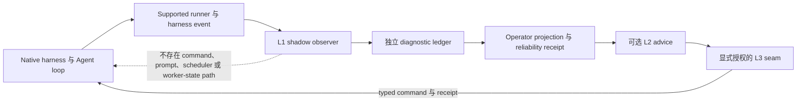

# RFC：长程 Agent 可靠性诊断与治理交付 v0

| 字段 | 值 |
|---|---|
| 状态 | Draft，产品方向与交付合同 |
| 日期 | 2026-08-16 |
| 作者 | LoopX maintainers |
| 范围 | Observer-first 可靠性诊断、有界治理交付、benchmark qualification 与可重复企业部署 |
| Source baseline | LoopX `66492032e` |

> 语言说明：本中文版与
> [English version](./long-running-agent-reliability-diagnostics-governed-delivery-v0.md)
> 互为语义镜像；两者出现实质差异即为缺陷。

## 1. 决策摘要

LoopX 应为这样一类团队建立一个收窄的产品与商业入口：它们已经让 Agent workflow
持续运行数小时或数天，但还无法证明应该把 workflow 交给完整的语义控制面。

这个入口是 **长程 Agent 可靠性诊断与治理交付**。第一步是 shadow observer：它可以解释
阶段、stall、重复、恢复、证据完整度、人工注意力和最终结果，但不改变 Agent 的 prompt、
工具、scheduler、continuation 或 authority。客户不必先要求 Agent 遵循 LoopX skill 或
state lifecycle，也可以先获得有用诊断。

控制权只能在有证据和显式授权后逐级扩大：

1. 复现原生 workflow，记录 matched baseline；
2. 接入不影响执行的 shadow observer，并证明 treatment integrity；
3. 向 operator 呈现建议，但不授予执行权；
4. 只治理预先约定的 checkpoint、gate 与 recovery seam；
5. 只有额外 lifecycle contract 已证明价值的部分，才采用完整 Semantic Control Plane。

本文不宣称 LoopX 已经拥有付费 PMF。它是一份产品方向、研究合同和交付纪律，用于发现可重复
价值，同时避免把每个客户都变成一个定制 kernel fork。

## 2. 具体示例

某软件团队有一个运行六小时的仓库 Agent。最终 patch 有时能通过，但 operator 看不到它正处于
哪个阶段、是否重复了同一 probe、崩溃后哪些证据还能保留，以及再运行一小时是否仍可能有收益。
团队目前靠盯日志和手动催促维持运行；第一次评估时，它并不希望新 planner 改变 Agent 行为。

第一次 LoopX engagement 不替换该 Agent loop，而是：

- 固定原生 harness、model、task、权限与预算；
- 通过只读 adapter 读取受支持的 harness 与 runner event；
- 将阶段、progress observation、recovery event、evidence ref、成本和 operator intervention
  归一化到独立 diagnostic ledger；
- 产出阶段 timeline、stall 与重复结论、恢复演练、evidence completeness report 和最终
  reliability receipt；
- 将 observer run 与匹配的原生 baseline 比较；
- 证明 observer 没有注入 context、调度工作、retry、stop、resume、gate 或以其他方式改变执行。

如果结果显示某个重复故障代价很高，后续 governed arm 可以允许 LoopX 在一个 checkpoint 请求
human decision，或根据 accepted receipt 恢复一次失败运行。该 authority 是新的、显式的
treatment，而不是 observation 的静默升级。

可售卖的结果不是“安装了 LoopX”，而是对三个问题给出有边界的回答：

1. 长程 workflow 在哪里、为什么失去可靠性？
2. 团队能否以可接受 overhead 和更少人工注意力观察、恢复它？
3. 哪些 control seam——如果存在——值得进入 governed deployment？

## 3. 可靠性集成等级

产品必须区分 observation、advice 与 authority。一个 dashboard 或名为“supervisor”的进程，
不会因为看得到 worker 就获得控制权。

| 等级 | 合同 | 可以写什么 | 能否影响 Agent 执行 | 最高直接 claim |
|---|---|---|---|---|
| L0 — Native baseline | 现有 harness，无 LoopX treatment | 仅原生产物 | 仅原生行为 | Benchmark 或 workflow baseline |
| L1 — Shadow Observer | 单向 event intake 与独立 diagnostic projection | LoopX 自有 diagnostic observation、evidence pointer 与 receipt | **不能**注入 prompt，也不能 scheduling、retry、stop、resume、gate、调用工具或修改 worker state | Observability、failure attribution、evidence completeness 与实测 overhead |
| L2 — Advisory Supervisor | L1 加上展示给 operator 的 typed recommendation | Recommendation 与 operator disposition receipt | 不能直接影响；human 可另行采纳或拒绝建议 | Recommendation quality 与 human-attention value |
| L3 — Governed Seams | 在具名 checkpoint、gate、recovery 或 handoff boundary 上拥有显式 authority | 授权范围内的 accepted command 与 receipt | 可以，但只限预声明 seam 和客户 authority envelope | Matched 条件下 governed treatment 的因果效果 |
| L4 — Semantic Control Plane | Goal、Todo、evidence、acceptance、quota、recovery、handoff 与 replan lifecycle | Canonical LoopX control state | 可以，但受完整 selected profile 与保留的人类 authority 约束 | 可重复的 governed long-horizon operation |

虚线表达的是一条被断言不存在的边，而不是 data path。L1 qualification 必须证明 observer
不具备 outbound execution capability。L3 会引入一条新 reviewed path，而不是隐式打开该虚线。

### 3.1 L1 non-interference 是机器合同

L1 不是“尽量被动”。其 adapter 和 deployment 必须证明：

- event 只能从 harness 或 runner 单向流入 observer；
- diagnostic state 不进入 worker context、memory、scheduler input、tool result 或 completion decision；
- 没有配置任何 control command endpoint；
- observer 失败不能暂停或导致 worker 失败；
- observation backpressure 有界且可计量；
- timestamp、event loss、sampling 和 unsupported field 均可见；
- protected task content、raw trajectory、credential 和 private workspace data
  不进入 public projection。

L1 run 如果出现未声明 callback、prompt change、scheduler hook 或更宽 permission envelope，
就不属于 passive evidence，必须 quarantine 或重新分类为 treatment arm。

### 3.2 L2 建议不是治理 authority

L2 可以说“这段工作似乎发生了物质等价重复”或“建议进行 recovery rehearsal”，但不能实际执行
恢复、终止 worker 或写入 gate decision。Operator response 与 attention time、outcome 分开记录。
这样才能区分真正有用的 diagnostic product 与隐藏的 autonomous manager。

### 3.3 L3 authority 只属于 seam

L3 从一个或少数已有真实失败成本、且有 acceptance owner 的 seam 开始，例如 review checkpoint、
crash-recovery boundary、显式 human approval 或 verifier-backed completion seam。Engagement 必须
说明 command、precondition、idempotency identity、receipt、rollback，以及仍不属于 LoopX
authority 的 action。

## 4. ICP、Buyer、User 与 Failure Mode

### 4.1 Ideal customer profile

初始 ICP 是已经拥有真实长程 Agent workflow、outcome owner 和重复运营痛点的团队。最强的早期
segment 包括：

- 工作跨 repo、environment、review 和数小时或数天的软件工程、SRE、安全与 IT operations 团队；
- 运行异构 Codex、Claude Code、shell 或 custom harness 的 AI platform 与 agent-infrastructure 团队；
- 需要 experiment lineage、negative-result retention、recovery 与 human checkpoint 的 AI4S、
  bioinformatics、robotics 与研究团队；
- 在增加 autonomy 前需要 evidence 和 authority boundary 的受监管或 audit-sensitive 团队。

Workflow 必须足够有价值，使失败、重复、人工盯盘或不可恢复状态具备可测成本。短 chatbot exchange
或 one-shot tool call 不属于目标。

### 4.2 Buyer 与运营角色

- **Economic buyer** 可以是 head of engineering、AI platform leader、research platform leader、
  security leader，或对交付 capacity 与 risk 负责的 workflow owner。
- **Outcome owner** 定义 native result 与 acceptance criteria；没有该角色，不启动正式 pilot。
- **Operator** 当前负责盯盘、干预、review evidence 或恢复失败。Operator attention 是被测成本，
  不是免费劳动力。
- **Platform 与 security owner** 批准 deployment、data、identity、retention 和 authority boundary。
- LoopX FDE 与产品工程负责 supported adapter、deployment、evaluation 和 reusable asset，
  但不会成为客户永久的 workflow operator。

### 4.3 典型 failure mode

- run 结束前，阶段与剩余工作不可见；
- worker 重复物质等价的 probe 或 maintenance loop；
- crash 丢失有效状态，或需要人工重建 context；
- interruption 后的 continuation 重做已完成工作，或越过旧 decision boundary；
- evidence 存在于 raw log 中，却无法支持 review、audit 或 handoff；
- 系统不能区分健康工作、等待、stall 和 exhaustion，导致 human 持续 polling；
- approval 与 operator nudge 没有绑定 durable scope 或 receipt；
- 一个 harness-specific fix 无法在另一 workflow 或 host 复用；
- governance 增加的 protocol、latency 或模型困惑足以降低 native task outcome。

### 4.4 明确非目标

- 默认替换客户的 model、runtime、sandbox、benchmark 或 domain workflow；
- 在 diagnostic phase 要求完整采用 LoopX skill 或 state lifecycle；
- 根据 L1 observer 宣称 task uplift；
- 把 raw log 或 keyword heuristic 当作 authoritative progress/failure truth；
- 销售没有 baseline、acceptance 或 reliability decision 的 generic monitoring dashboard；
- 承诺 autonomous department replacement 或不可审计的 outcome pricing；
- 构建 customer-specific LoopX kernel，或接受无限期免费 PoC；
- 把 star、demo、control-plane call 或 agent runtime 当作 PMF。

## 5. 客户旅程与 Stop/Go Gate

### 5.1 Discovery 与 baseline

Engagement 先选择一个 bounded workflow、一个 outcome owner 和一个 matched baseline contract。
Discovery 记录：

- native task outcome 与 acceptance owner；
- 固定的 harness、model、tool、permission、environment 与 budget；
- 当前 failure 与 recovery process；
- operator intervention 与 attention minute；
- data classification、retention、deployment 与 authority boundary；
- diagnostic result 将支持的具体 decision。

**Stop gate：** workflow 缺少 outcome owner、可复现或可重建 baseline、固定预算、可测 acceptance
result，或无权观察必要 event 时，不进入 pilot。

### 5.2 Passive diagnostic

以 shadow mode 部署 L1。在解释发现前，先验证 adapter fidelity 与 non-interference。输出为
diagnostic packet，包含：

- stage 与 progress timeline；
- typed stall、repetition、recovery 与 failure attribution；
- evidence 与 handoff completeness；
- cost、wall-clock 与 attention accounting；
- event-loss 与 unsupported-signal disclosure；
- candidate governed seam，每个都绑定已观察成本与 rollback path；
- 不超出所收集证据的 final receipt。

**停止或保持 passive：** event fidelity 不足、overhead 超过约定预算、无法满足 private-data
boundary，或发现无法改变 operator decision 时，不得为了制造价值而增加 authority。

### 5.3 Advisory 或 governed pilot

客户可以选择 L2 recommendation 或一个 bounded L3 seam。Pilot 在执行前登记新 treatment、
authority envelope、expected benefit、negative-transfer threshold、rollback 与 matched comparison。

**Stop gate：** 没有显式 authority owner、经过测试的 fail-closed command/receipt path、native
outcome metric 和能发现 harm 的 baseline 时，不进入 L3。由 human 执行的建议仍属于 L2 assisted
evidence，不能报告成 autonomous uplift。

### 5.4 Acceptance

Acceptance 在固定预算下比较预声明指标。成功 pilot 必须同时呈现 native outcome 与 governance
cost；不能因为 dashboard 好看或 LoopX 生成了很多 event 就通过。

Acceptance packet 包含：

- matched baseline 与 treatment identity；
- native outcome 与 uncertainty 或 case-level result；
- efficiency、recovery、attention、evidence、overhead 与 negative-transfer result；
- treatment-integrity 与 data-boundary receipt；
- deployment 与 rollback evidence；
- reusable-asset inventory 与 customer-only work disclosure；
- accepted next level、remain-passive decision 或 no-follow-up。

### 5.5 Repeatable deployment 与 ongoing service

只有验收通过的 seam 才进入 versioned deployment pack。Ongoing service 可提供 managed history、
replay、governance、migration、support 与 SLA，但 workflow 必须保持在 supported Harness 与
extension boundary 上。第二次部署必须复用 adapter、policy、eval 或 dashboard contract，
而不是再次打开 kernel。

**Stop gate：** 没有可信的第二次使用、运行仍依赖原 FDE、upgrade 需要 customer fork，或 initial
delivery 后 recurring value 消失时，不得把该 motion 称为 repeatable。

## 6. 参考 Offer：两到四周 Reliability Pilot

该参考合同定义 scope，不定义价格，也不承诺收益。

### Week 0 / 启动前 qualification

- 确认 workflow、buyer、outcome owner、operator 与 data owner；
- 固定 baseline identity、task strata、budget 与 primary metric；
- 批准 observer data envelope 与 deployment route；
- discovery stop gate 不满足时拒绝 engagement。

### Week 1 / baseline 与 adapter fidelity

- 复现或重建 native baseline；
- 连接一个 supported read-only adapter；
- 证明 event coverage、clock semantic、loss behavior 与 non-interference；
- 建立初始 operator-attention 与 recovery baseline。

### Week 2 / passive diagnostic

- 在 matched envelope 下运行 L1；
- 交付 stage、stall/repetition、recovery、evidence 与 overhead analysis；
- review candidate seam，并决定 remain-passive、stop 或进入 bounded treatment。

### Weeks 3–4 / 可选 governed seam 与 acceptance

- 在获得授权时 qualify 一个 L2 或 L3 treatment；
- 运行预声明 comparison 与 rollback rehearsal；
- 交付 acceptance packet、reusable asset、runbook 与 handover；
- governed treatment 不成立时记录 no-follow-up decision。

Pilot 不包括 open-ended workflow redesign、无关 model tuning、无限 integration、超出已声明 authority
的 production write、leaderboard submission 或 customer-only kernel fork。

## 7. Evaluation 与 Benchmark Contract

### 7.1 Matched arm

产品 evaluation 复用 benchmark program 的 arm taxonomy：

1. **Native baseline** — 没有 LoopX observation 或 control。
2. **Passive LoopX / L1** — worker decision surface 不变，只增加独立 observation 与 settlement。
3. **Governed LoopX / L3 或 L4** — 已声明 profile 可以影响具名 seam。
4. **Mechanism ablation** — 与 governed parent 相比，只有一个 mechanism 不同。

L2 assisted study 单独报告，因为 human action 属于 treatment。当无法实时重复 workflow 时，replay
或历史 baseline 可以支持 discovery，但证据更弱，不能包装成 matched causal comparison。

### 7.2 必测指标

每份 acceptance plan 都要在执行前选择 primary metric，并报告所有适用 guardrail：

| 维度 | 必需 evidence |
|---|---|
| Native task outcome | Benchmark-native score/pass、客户 acceptance result、quality result 或其他 workflow-owned outcome |
| Token、cost 与 wall clock | Raw total、相对 matched baseline 的差值、time to first material delta 与 time to final outcome |
| Recovery | Eligible failure、successful recovery、recovery rate、time to recovery、重复工作与 state/evidence loss |
| Human attention | Intervention count、attention minute、response latency、false escalation，以及真正改变 outcome 或 authority 的 intervention |
| Evidence completeness | Required evidence 是否存在、lineage 是否完整、unsupported/missing signal 与 review/handoff readiness |
| Governance overhead | Control call、observer CPU/I/O、latency、storage、model-context tax 与 operational complexity；必须分解报告，不能压成一个百分比 |
| Negative transfer | Native-outcome regression、额外 time/cost、false stall/gate、阻止有效 continuation、model confusion 或新 harness failure |

Threshold 必须按 workflow 在 pilot 前登记。Native outcome 高但 attention 或 recovery cost 不可接受，
仍可能不成立商业 case。Observability 改善而 outcome 不变，可以通过 L1 diagnostic acceptance，
但不能通过 L3 uplift claim。

### 7.3 与 C0–C4 evidence ladder 的关系

- **C0** 验证 native reproduction 与 adapter fidelity。
- **C1** 是 L1 的目标：不改变 worker decision 或 official outcome 的可靠 observation。
- **C2** 是对单一 pinned benchmark/workflow family 中 L3/L4 treatment 提出因果 claim 的必要条件。
- **C3** 证明相同 typed mechanism direction 可以跨物质不同的 benchmark family 迁移。
- **C4** 在改变 default 或进入 shipped promotion 前，增加 model-behavior、state-machine qualification、
  overhead/authority budget 与 non-benchmark product canary。

[长程 Harness Benchmark 与研究计划](./long-horizon-harness-benchmark-research-program-v0.zh-CN.md)
中的 portfolio 提供互补环境：LHTB 特别适合 stall、repetition 与 recovery dynamic；DeepSWE 适合
repository delivery 与 interruption recovery；ALE 适合异构 professional workflow 与 operator
surface。每个 benchmark 保留自己的 runner、verifier、metric 与 publication rule；LoopX 不把它们
压成一个商业分数。

### 7.4 Observer mode 的 treatment integrity

L1 需要 first-class integrity receipt，至少记录：

- 固定的 worker、model、task、environment、tool 与 budget；
- adapter 与 observer revision；
- 消费的 event source 与 field；
- 已配置 outbound control endpoint，必须为空；
- 是否有 observation 进入 worker context 或 scheduling input；
- observer resource use、dropped event 与 clock uncertainty；
- `eligible`、`quarantined` 或 `invalid` disposition 及 reason code。

该 receipt 让“介于 LoopX 和 no LoopX 之间”成为可测试的产品模式，而不是营销措辞。

## 8. 每次 FDE Engagement 必须沉淀的 Reusable Asset

每次 engagement 都必须留下 versioned、documented asset set。Customer-only configuration 可以
保持私有，但产品合同与可复用机制不能只留在某个工程师的笔记里。

| Asset | 最小 reusable content | Reuse gate |
|---|---|---|
| Adapter | Versioned event/identity mapping、loss/clock semantic、privacy boundary、fixture 与 conformance check | 第二个兼容 workflow 或 host 无需 kernel change 即可复用合同 |
| Deployment pack | Local/private/BYOC profile、configuration schema、install/upgrade/rollback、health check 与 support bundle | Reinstall/rollback 不依赖原 FDE |
| Policy pack | 具名 observer/advisory/governed profile、authority envelope、retention、alert/gate rule 与 safe default | Policy 是 supported contract 上的数据/config，不是 core 中的 customer code |
| Eval pack | Baseline manifest、task 或 public-safe task descriptor、metric、integrity audit、reducer 与 acceptance template | 同一 evaluation 能比较未来 release，而不重写 expected truth |
| Dashboard 与 receipt | Stable projection、stage/failure/attention view、evidence lineage、treatment identity 与 export | Reviewer 无需 raw private log 即可重建 decision |

Engagement 必须报告 reusable work、customer-only work、deferred generalization 与下一条可信 reuse
path。不得产生：

- 无限期免费或无边界 proof of concept；
- customer-specific kernel fork；
- 解析 private source file 或 raw log 的 one-off dashboard；
- 只编码在 prose 中的 policy；
- expected result 从 implementation 推导出来的 private eval；
- 对原 delivery engineer 的永久依赖。

## 9. 开源与付费边界

Open core 必须足以检查、操作并离开系统。商业价值来自 packaging、operation、organizational
control 与 accountable delivery，而不是关闭 customer state 的语义。

### Open 与 local-first

- durable goal、Todo、evidence、acceptance、authority、handoff、recovery、quota 与 replan schema
  及 semantic protocol；
- local control-plane core、CLI、export 与 public-safe projection；
- provider-neutral adapter 与 capability contract；
- 可用的 self-host path 与 versioned state migration contract；
- local benchmark/evaluation primitive 与 integrity receipt schema。

### Paid 或 managed

- supported Enterprise Harness distribution 与 certified adapter；
- private、air-gapped 或 BYOC deployment 与 managed upgrade；
- enterprise connector 与 domain pack；
- RBAC、SSO、policy administration、audit、residency、deletion 与 signed export；
- hosted/managed history、retention、replay、alert、review queue 与 recovery operation；
- SLA、incident response、migration、backup/restore、support 与 training；
- Managed Semantic Control Plane 与 accountable、bounded FDE delivery。

客户保留可导出的 identity、state meaning、evidence lineage 与 local/self-hosted exit path。Hosting
不会授予 LoopX 或 provider 读取 private workspace、批准 gate、publish、merge 或 production change
的权限。

## 10. 与当前 LoopX 架构的关系

### 10.1 Operator surface

L1 和 L2 消费显式 public-safe projection。Operator surface 可以展示 stage、evidence ref、recovery
state、cost、attention 与 diagnostic finding，但不能解析某个客户的 private source document、
inline raw trajectory，也不能在 L1 渲染 write control。可见 recommendation 不等于 accepted gate
或 command。

### 10.2 Shared goal authority

L1 没有 shared goal authority。它可以观察带 stale 标记的 projection，或在独立 namespace 存储
diagnostic receipt，但不能 claim work 或修改 canonical aggregate。L3/L4 coordination 需要显式
per-goal opt-in，并遵守 shared-goal authority RFC 定义的 command、precondition、idempotency、
receipt 与 provider boundary。Storage 或 messaging provider 永远不会成为 LoopX authority。

### 10.3 Python canonical 与 TypeScript draft

在当前 TypeScript parity experiment 期间，Python 仍是 canonical control-plane implementation。
本文定义 language-neutral product/receipt contract，不 promote TypeScript draft，也不创建第二
authority。TypeScript operator/observer 可以在 parity qualification 后消费 read-only projection；
write path 与 decision kernel 在各自 migration gate 通过前，仍属于当前 canonical owner。

### 10.4 Benchmark research 与产品交付

Benchmark RFC 拥有 experiment identity、native truth、C0–C4 claim 与 publication discipline。
本文拥有 customer journey、sellable offer、authority ladder、FDE asset contract 与产品 promotion
gate。Benchmark result 可以 qualify mechanism；field engagement 仍必须证明 customer acceptance、
deployment reuse、privacy 与 operational supportability。

### 10.5 Ecosystem 与 runtime boundary

Observer 应通过 supported runner event、host adapter 或 provider-neutral projection 接入，而不是
吸收客户 runtime。Partner integration 属于事实 adoption evidence，不等于 recurrence 或 willingness
to pay 的证明。

## 11. 风险与 Failure Containment

- **Authority creep：** passive observer 静默开始改变 prompt 或 continuation。缓解方式：one-way
  architecture、empty command envelope 与 treatment-integrity receipt。
- **False diagnosis：** 不完整 event 导致错误 stall/failure label。缓解方式：typed source coverage、
  unknown state、confidence/eligibility disposition，以及 L1 无 write authority。
- **Protocol tax 与 negative transfer：** governance 消耗的 latency、token 或 attention 足以伤害
  native task。缓解方式：matched budget、overhead 分解、native outcome guardrail 与 rollback。
- **Surveillance 与 privacy：** observation 收集了超出运营需要的 private content。缓解方式：
  metadata-first projection、minimization、显式 retention/deletion、scoped evidence pointer 与
  local/BYOC mode。
- **Services trap：** 每个成功都依赖 custom engineering。缓解方式：强制 reusable asset、second-use
  gate、禁止 kernel fork，并分别核算 software、delivery 与 ongoing operation。
- **Benchmark overfitting：** control rule 改善一个 verifier，却伤害真实 workflow。缓解方式：C0–C4
  ladder、cross-family evidence、negative result 与 non-benchmark canary。
- **Proof theater：** dashboard、call、star 或单次 demo 替代 outcome evidence。缓解方式：预声明 native
  metric 与显式 claim level。
- **Premature managed authority：** isolation、restore、deletion 与 on-call economics 尚未证明，
  hosted operation 就扩大 authority。缓解方式：observer 与 private/BYOC first，以及显式 promotion gate。

## 12. Roadmap 与 Promotion Criteria

### P0 — Contract 与 shadow-observer prototype

交付一个 provider-neutral observer envelope、integrity receipt、compact diagnostic projection，
以及针对一个真实 harness event source 的 deterministic fixture。证明 no-outbound-control invariant
与 bounded failure behavior。

**Exit：** C0 adapter fidelity 加一条 eligible C1 observer run；报告 public/private boundary 与
overhead；不存在 production authority。

**Checkpoint（2026-09）：** P0 的 contract 部分已以默认关闭的 built-in capability
`reliability-diagnostics` 与 extension provider `dsh-session-events`（位于
`packages/dsh-loopx-plugin`）落地：provider-neutral envelope 与 stats record、integrity receipt、
read-only diagnostic projection、deterministic DSH-shaped fixture，以及首次写入 ledger 之前的
producer 侧 public-safety 拒绝。P0 exit 之前仍未完成：在真实 `dsh` session 上的 eligible C1
observer run、overhead 测量报告，以及下文 decision 4 的 ledger retention 与 deletion profile。

### P1 — Benchmark-qualified diagnostic pilot

在至少一个合适 benchmark family 和一个 non-benchmark rehearsal 上运行 matched native/L1 arm。
建立 stage、stall/repetition、recovery、evidence、attention 与 overhead measure；negative/null result
必须保留可见。

**Exit：** repeated C1 evidence、一个有用的 diagnostic decision、operator receipt，并且 baseline 与
passive arm 之间没有无法解释的 outcome 差异。

### P2 — Bounded governed seam

选择一个 evidence-backed 且有 outcome owner 的 seam。实现 typed command/receipt/rollback path，
并与 matched parent profile 比较。

**Exit：** scoped C2 evidence 或诚实 no-follow-up；通过 model-behavior 与 state-machine qualification；
没有超出预声明 guardrail 的 authority、privacy 或 native-outcome regression。

### P3 — Repeatable delivery

用 versioned adapter、deployment pack、policy pack、eval pack 与 dashboard/receipt 完成参考 pilot。
至少在第二个 workflow 或兼容 deployment 上复用一项 material asset，且不 fork kernel。

**Exit：** customer acceptance、handover、upgrade/rollback、second-use evidence，并分别核算 reusable
与 customer-only work。一次成功 engagement 仍然不是 PMF。

### P4 — Shipped product direction

只有 supported distribution、operator surface、data/authority boundary 与 recurring operation 经受
独立使用后，才从 Incubation promote。至少一个 governed mechanism 需要 C4 evidence；observer mode
需要在 supported adapter 之间具备稳定 conformance；managed form 需要验证 export、restore、
deletion、tenancy、support 与 incident response。

**Exit：** maintainer 能明确 shipped contract、supported profile、acceptance/rollback、repeated
deployment path、owner、support boundary，以及 initial FDE 离开后仍持续使用的 evidence。Promotion
是 repository decision，不是销售叙事。

## 13. 产品 Stop/Go 规则

潜在 engagement 缺少以下任一项时，不进入正式 pilot：

- accountable outcome owner；
- native outcome 与 matched baseline，或被显式标为更弱的 baseline；
- fixed budget 与预声明 acceptance criteria；
- 获批的 data、authority 与 rollback envelope；
- bounded delivery scope 与 handover；
- 产出 asset 的可信 second reuse path。

Observation 对 decision 无用、negative transfer 超过 guardrail、authority 无法显式化，或唯一成功
路径是 custom kernel work 时，program 必须停止或保持 passive。

Star、一次 demo、一个 passing task、一次内部部署、control-plane call volume 或好看的 dashboard 都
不是 PMF。提出更强 commercial claim 前，必须有 paid recurrence、accepted outcome、reuse、managed
advantage 与 sustainable delivery evidence。

## 14. 仍需 Owner 决策

1. 首个产品 pilot 应选择哪个 initial ICP 与 reference workflow：software delivery、security/SRE，
   还是 research/AI4S？
2. 哪个 event source 与 harness 应定义 P0 shadow-observer conformance fixture？
   **已决定（2026-09）：DeepSeek Harness（`dsh`）session events。** LoopX 已有 typed `dsh`
   Turn host 与 same-session plugin，其只读 `session/event`、`agent/status`、`agent/error`、
   `session/disposed` hook 让 observer 能在既有打包边界内被证明 non-interfering。Pi 仍是
   对比候选；与 Desktop Execution Frontends RFC 共享的 harness 选型评估是后续交付物，结论将记录在此。
3. 第一份两到四周 offer 默认应停在 L1 diagnostic，还是在进入任何 L3 seam 前增加可选 L2 advisory week？
4. 第一份 local/private/BYOC deployment pack 应包含哪些 data-retention、deletion 与 support profile？
5. 第一份 promotion packet 必须使用哪个 benchmark family 与 non-benchmark canary？
6. 当方向从 Incubation 走向 Shipped，谁负责 product acceptance、delivery reuse 与 support readiness？

## 15. 与现有文档的关系

- [商业化与 SaaS 机会评估](../../product/roadmaps/saas-opportunity-assessment.zh-CN.md)
  定义更广的 open/paid thesis、product ladder 与 FDE discipline。本文将其收窄为 observer-first
  offer 与 promotion contract。
- [长程 Harness Benchmark 与研究计划](./long-horizon-harness-benchmark-research-program-v0.zh-CN.md)
  拥有 benchmark truth、matched arm、C0–C4 evidence 与 research integrity。
- [Agent Management Observability MVP](../../product/surfaces/agent-management-observability-mvp.md)
  定义 L1/L2 operator surface 复用的 read-only projection posture。
- [Desktop Execution Frontends](./desktop-execution-frontends-v0.zh-CN.md) 定义 Mode B，即由 LoopX
  Desktop 启动并监督 Pi 或 `dsh` 的 Managed Agent Runtime。L1 shadow observer 是该模式下
  Desktop-owned runtime supervisor 之下的被动诊断层：其 integrity receipt 与 read-only projection
  是 supervisor 可以投影的输入，observer 本身不获得 supervisor 的任何 authority。
- [Shared Goal Authority 与 State Provider](./shared-goal-authority-state-provider-v0.zh-CN.md)
  定义只有在 L3/L4 使用 shared coordination 时才需要的 authority/provider boundary。
- [TypeScript Control-Plane Migration](./typescript-control-plane-migration-v0.zh-CN.md)
  在 TypeScript candidate 通过 parity qualification 期间，维持 Python canonical。
- [Ecosystem Adoption and Derivatives](../../community/ecosystem-adoption.zh-CN.md)
  记录事实性的 public adoption，不能替代 product outcome 或 commercial evidence。
