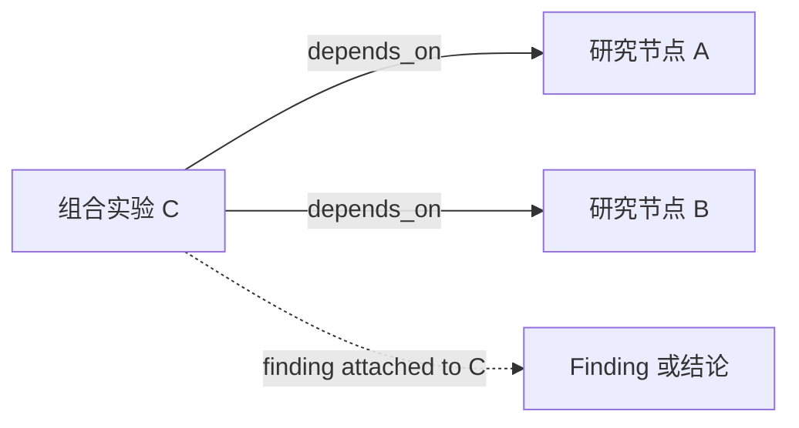
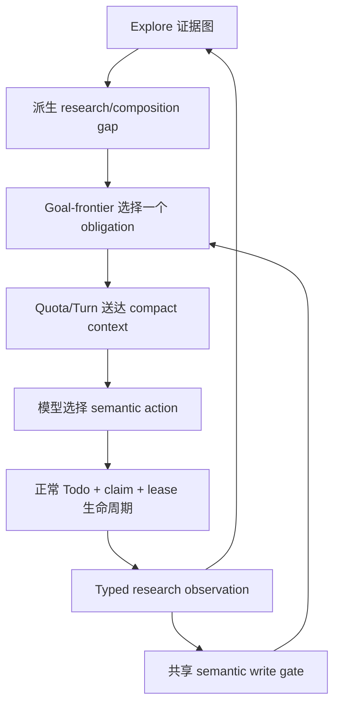

# RFC：研究型探索控制面 v0

| 字段 | 值 |
|---|---|
| 状态 | Draft，等待维护者评审 |
| 日期 | 2026-08-13 |
| 作者 | LoopX maintainers |
| 范围 | 研究证据、覆盖、组合前沿、replan 集成、执行交接与资格验证 |
| 源码基线 | LoopX `7f67d51c6` |

> 语言说明：
> [英文版](./research-exploration-control-plane-v0.md)与本文档是语义镜像，
> 二者出现差异即为缺陷。

## 1. 决策摘要

LoopX 应把研究理解为**类型化知识前沿的受控演进**，而不是一串很长的
Todo，也不是一个无边界的“换个方向再试试”。

第一个新增能力是**组合前沿（composition frontier）**。当两个已分别研究
的节点存在显式、证据关联的联合验证理由时，LoopX 应把这条尚未验证的关系
保存为 gap。这个 gap 可以派生 replan obligation，并形成普通的 runnable
successor。只有带证据的组合实验结果或带证据的 dismissal 才能关闭 gap；读取
上下文、ACK packet、完成无关 Todo 或换句话重复结论都不能关闭它。

本 RFC 作出六项架构决策：

1. **Explore 拥有研究拓扑与证据。** Goal-frontier 只消费有界投影，不再构建
   第二份研究图。
2. **研究 observation 组合现有 progress contract。** 不向
   `typed_progress_observation_v0` 静默加入研究专用字段。
3. **联合 probe 是 experiment 节点。** 它依赖输入节点；二元
   `joint_probe` 直连边不是执行记录。
4. **第一版组合 trigger 只接受显式候选。** 共享 closure constraint 可以先在
   shadow mode 中排序，但在证明精度前不能自动生成所有两两 obligation。
5. **Replan 由语义状态变化关闭，而不是由协议仪式关闭。** 上下文送达、手动
   read、prose ACK 和重复 terminal claim 都不是研究进展。
6. **执行继续走 LoopX 正常生命周期。** Explore planner 和 harness 保持只读；
   Todo、quota、claim、lease、writeback 和 spend 的权限边界不变。

更大的目标不是把所有 LoopX goal 都改造成“研究任务”，而是为结果依赖探索、
假设修正、负面证据和不同方向组合的 goal，提供一个可选且有界的底座。

## 2. 为什么研究需要独立的控制面视角

常规实现工作往往有已知目标和大体单调的路径：选择 Todo、修改 artifact、
验证，然后关闭或继续。研究工作的失败面不同：

- 下一步有价值的动作取决于最新证据；
- 负面结果即使不修改 artifact，也可能有价值；
- 多个单独穷尽的方向可能发生相互作用；
- 广泛探索看起来一直在动，却可能没有产生新知识；
- 过早关闭和组合爆炸都可能发生；
- 预先写好的长 Todo 链可以维持活动表象，却掩盖底层问题已经变化。

LoopX 已经具备大部分所需部件：

- `typed_progress_observation_v0` 标识 work slice，并区分 advanced、
  unchanged、blocked、exhausted 与 no-follow-up；
- repeat detector 能从物质等价的连续 observation 派生 obligation；
- semantic writeback 接受新 surface、hypothesis、probe family、grounded
  successor、concrete blocker 和 coverage-backed terminal result；
- host 能把有界 evidence 与 uncovered frontier 投影进下一个 action packet；
- Explore 保存 append-only node、typed edge、finding 与 public-safe evidence
  reference；
- Todo、quota、claim、lease 和 spend 拥有可执行工作。

缺失的是关系型知识。当前 novelty 主要是原子性的：“新 surface”“新
hypothesis”或“新 probe family”。它无法持久表达：A 和 B 都已研究，二者的
独立结论都已知，但 A x B 的相互作用仍未验证。

这个缺口会产生两种坏结果：

1. 即使显式 interaction hypothesis 仍然开放，LoopX 也把单点穷尽当作全局
   穷尽。
2. 模型非正式地重新发现了组合，但这条关系没有持久化，下一轮无法区分它和
   又一次临时 probe。

## 3. 目标

本 RFC 旨在：

- 用类型化、public-safe identity 表达研究 coverage、closure 与 composition；
- 不解析 prose 也能检测重复或彼此隔离的探索；
- 保留负面证据与 coverage boundary；
- 把合格的 knowledge gap 变成唯一、因果明确、可运行的方向；
- 区分 context delivery 和“上下文确实改变下一步动作”的证据；
- 在中断和 replay 下避免重复实验或丢失 gap；
- 让 hot quota packet 足够小，使协议跟随较弱的模型也能执行；
- 同时验证确定性状态语义和模型实际选择的 tool behavior；
- 暴露诚实的 terminal outcome：finding、coverage exhausted、concrete
  blocker、dismissal 或 no follow-up；
- 通过有测量证据的 milestone 演进，而不是提前搭建框架。

## 4. 非目标

本 RFC 不提出：

- 通用科学方法引擎或 autonomous lab；
- 自动组合所有 closed node；
- 用 prose classifier 判断研究意图、closure、novelty 或 similarity；
- 替换 Explore 的通用 knowledge graph；
- 第二套 Todo scheduler、agent launcher、settlement executor 或 quota path；
- 强制常规实现 goal 使用 research observation；
- 根据模型 confidence 自动产生 truth claim；
- 自动执行不安全、昂贵、外部或需要权限的 probe；
- 保证 composition 一定产生正面 finding；
- 面向研究命令的通用 Kleisli 或 middleware framework；
- 在真实执行 caller 出现前设计 n-ary composition、并发实验或 CAS 语义。

## 5. 当前事实与缺失部分

本节会随实现落地持续更新。Shipped behavior 以 protocol reference 和代码为
准；本 RFC 记录方向与 milestone 状态。

### 5.1 今天已经存在什么

| 能力 | 当前事实 |
|---|---|
| 类型化 work-slice progress | `typed_progress_observation_v0` 记录稳定语义维度、result class、coverage、blocker 和 evidence id。 |
| 空转检测 | 连续且物质等价的 typed observation 可以派生 replan trigger。 |
| Semantic replan closure | 新类型化维度、grounded successor、concrete blocker 或 coverage-backed terminal result 可以关闭当前 obligation。 |
| Host-delivered context | Quota 可以投影 compact coverage ledger 与 uncovered frontier，不要求手动 evidence-read 仪式。 |
| Explore evidence | Explore 拥有 append-only node、edge、finding 与有界 public-safe projection。 |
| Explore planning | 可选 branch planner 保持只读，并把执行交还 quota、Todo、claim 和 lease。 |
| Model behavior qualification | 真实 function-tool 对话可以验证模型是否读取真实 packet 并选择真实 semantic writeback。 |

### 5.2 还缺什么

| 缺口 | 后果 |
|---|---|
| 没有 typed closure basis | Terminal 结论无法脱离 prose 说明究竟是哪项 constraint 使其成立。 |
| 没有 composition candidate | 分别研究过的节点之间的关系无法持久化。 |
| 没有 composition experiment identity | Replay 可能重复调度 joint probe，或把 Todo 错当成实验结果。 |
| 没有 composition gap projection | Goal-frontier 无法区分 atomic exhaustion 和未验证 interaction。 |
| 没有研究专用 qualification matrix | 测试尚未证明 candidate→gap→experiment→result 的因果链。 |
| inferred combination 没有 promotion evidence | 共享 constraint 的精度还不足以直接触发 obligation。 |

## 6. 研究状态模型

该模型包含五个 durable concept 和两个 derived concept。

### 6.1 Goal-level research contract

Research mode 是叠加在现有 goal vision 与 Explore opt-in 上的显式 per-goal
policy，不能创建第二份 goal statement。在 composition 变成 enforceable 之前，
goal boundary 需要明确：

- research exploration 已启用；
- 哪个 active vision 或 question 的 acceptance 仍是权威；
- exhaustion 或 no-follow-up claim 使用的 coverage scope；
- composition 是 `disabled`、`explicit_only`，还是后续已 promotion 的 policy；
- allowed terminal outcome，以及拥有这些 outcome 的 user/safety gate。

第一版实现应扩展最近的现有 Explore goal config，而不是新增 capability。没有这
份显式 policy 时，Explore evidence 仍可用于 diagnostics 与 presentation，但不
派生 composition obligation。

Research node 与 finding 可以向 goal vision 提供 evidence，但仅仅变成
`resolved` 不会修改 goal acceptance；局部完整的 composition frontier 也不表示
整个 goal 已完成。

### 6.2 Durable concept

1. **Research node**：Explore log 中的 question、area、hypothesis、experiment
   或 artifact。
2. **Research observation**：一个有界 work slice 的类型化结果，可归因到
   research node 和 evidence。
3. **Closure basis**：支持 terminal 或 bounded 结论的 typed constraint 与
   coverage。
4. **Composition candidate**：一个显式、evidence-linked 的主张，说明两个
   research node 应联合验证。
5. **Composition experiment**：一等 Explore experiment node，通过
   `depends_on` edge 连接所有 input node。

### 6.3 Derived concept

1. **Composition gap**：没有 active、completed 或合法 dismissed composition
   experiment 的 eligible composition candidate。
2. **Research frontier**：提供给 replan 与 status consumer 的 atomic gap、
   composition gap 和 terminal coverage 的有界投影。

### 6.4 为什么 experiment 必须是 node

对输入节点 A 和 B，组合实验是 C：



在 Explore 图中，C 保存指向 A、B 的 `depends_on` edge。这个表示：

- 后续可支持超过两个输入，而不用修改 edge 语义；
- probe 有自己的 lifecycle 与 evidence；
- 区分“输入可能组合”的 hypothesis 和“joint experiment 已运行”的 proof；
- 让 replay identity 稳定；
- 复用现有 `experiment` node kind、`depends_on` edge、attached finding，以及
  适用时的 `supports`/`refutes` relation。

A、B 之间的 `joint_probe` 直连边会把 candidate、execution 和 result 压成一条
含义模糊的 relation。本 RFC 拒绝该形态。

## 7. Typed contract 方向

以下 schema 是设计目标，而非已经发布的 protocol。最终 wire form 必须连同
active caller、protocol reference 和 focused validation 一起引入。

### 7.1 组合，而不是静默修改 v0

`typed_progress_observation_v0` 是通用 work-item contract，研究 metadata 属于
Explore。目标 envelope 如下：

```json
{
  "schema_version": "typed_research_observation_v0",
  "progress": {
    "schema_version": "typed_progress_observation_v0",
    "work_item_id": "todo-42",
    "surface_id": "routing-boundary",
    "hypothesis_id": "alternate-ordering",
    "probe_kind": "order-differential",
    "result_class": "exploration_exhausted",
    "coverage_scope_id": "routing-order-v1",
    "coverage_complete": true,
    "evidence_ids": ["ev-routing-order"]
  },
  "explore_node_id": "node-routing-boundary",
  "closure_basis": {
    "schema_version": "research_closure_basis_v0",
    "disposition": "bounded",
    "constraints": [
      {
        "kind": "decision",
        "id": "parameter-normalization",
        "role": "decisive"
      }
    ],
    "evidence_ids": ["ev-routing-order"]
  },
  "composition_candidates": [
    {
      "target_node_id": "node-filter-interaction",
      "basis": "explicit",
      "interaction_kind": "shared_constraint",
      "evidence_ids": ["ev-routing-order", "ev-filter-boundary"]
    }
  ]
}
```

该 envelope 组合 generic progress observation，不复制其 result-class 逻辑。Core
progress consumer 可以读取 `progress`；Explore 拥有 closure 与 composition
validation。未来 `refresh-state` 集成可以通过一个带 receipt 的 effect program
写入两部分，但不能因此创建第二个 generic settlement executor。

### 7.2 Typed closure basis

`closure_basis.constraints[]` 是 typed data，不是任意 string list。初始 `kind`
词表应保持 domain-neutral 且足够小：

- `stage`
- `decision`
- `invariant`
- `dependency`
- `resource`
- `policy`

每项 constraint 有稳定 opaque `id`，role 为 `decisive` 或 `supporting`。有序
list 可以描述 path，但匹配只使用 typed identity，绝不使用 substring overlap。
Terminal observation 还必须携带 coverage scope 和 evidence；closure path 不能
替代 coverage。

### 7.3 显式 composition candidate

第一版只接受 `basis=explicit`。`interaction_kind` 是“为什么 joint test 可能有
价值”的类型化主张：

- `shared_constraint`
- `producer_consumer`
- `state_interference`
- `order_dependency`
- `resource_coupling`
- `unknown_interaction`

这些值描述 candidate，不宣称 finding。Candidate identity 使用 goal id 加排序
后的 input node id 集合，因此 A x B 与 B x A 不会生成重复 gap。

每条 observation 的 `composition_candidates` 必须有上限。Candidate 必须引用同
一 goal 中的已知 node，并引用已归因到 input 的 public-safe evidence。Unknown
node、local path、prose-only target 和 cross-goal ref 都 fail closed。

### 7.4 Action signature 与兼容性

当 research observation 可以关闭 replan obligation 时，action signature 必须
包括：

- 当前 obligation id；
- research observation schema version；
- Explore node id；
- composition experiment 或 candidate 的 normalized input node id；
- generic progress fingerprint；
- evidence id 或其有界 digest。

如果加入 research field 却不更新 action signature，adapter 可能丢掉 composition
语义却仍宣称 semantic parity。Compatibility test 必须拒绝这种漂移。

## 8. Composition gap 派生

### 8.1 v0 eligibility

只有同时满足以下条件，candidate 才成为 `composition_required` gap：

1. candidate 是显式的，并引用至少两个已知 Explore node；
2. 每个 input 都有带 evidence、可归因的 terminal observation；
3. 每个 input 的 terminal state 都 eligible；
4. 不存在具有同一 canonical input set 的 active experiment 或带 evidence 的
   result；
5. candidate 未被合法 dismissed；
6. gap 位于配置的 per-goal 与 per-agent projection budget 内。

v0 eligible terminal state 包括：

- coverage-backed `exploration_exhausted`；
- coverage-backed `no_followup`；
- 有等价 typed observation 支持的 Explore `resolved` 或 `dead_end` node。

`unchanged` 不是 closed node。它可以触发普通 stall replan，但不能证明某个方向
已经完成独立研究，可以进入 composition closure 分析。

`blocked` 默认不 eligible。后续 milestone 只有在 blocker scope 与 resume
semantics 类型化后，才可以允许带 evidence 的**内生（intrinsic）** blocker。
临时 permission、resource、user 或 scheduler blocker 不能表示独立研究已经
穷尽。

### 8.2 共享 constraint 不是 v0 trigger

共享 decisive closure constraint 的两个 terminal node 可能值得研究，但自动
组合这些 node 并不安全：

- 公共 infrastructure constraint 可能连接许多无关 node；
- 同一 stage 后的 N 个 node 会产生 O(N^2) pair；
- 共享 rejection boundary 也可能说明彼此独立，而不是存在 interaction；
- false obligation 会增加协议成本，并把注意力从更有价值的 frontier 移开。

因此，shared constraint 最初只能生成**shadow ranking signal**。把它提升为
inferred candidate trigger，必须先取得 precision 数据、采用有界 candidate
generation，并显式更新 RFC decision log。绝不能用 `closure_path` prose 的
string matching 实现。

### 8.3 有界投影

Canonical Explore projection 可以包含全部 public-safe eligible gap，但 hot
control-plane packet 不应该如此。

默认 quota action packet 应携带：

```json
{
  "composition_frontier": {
    "schema_version": "composition_frontier_projection_v0",
    "pending_count": 3,
    "selected_gap": {
      "gap_id": "composition-gap-opaque",
      "input_node_ids": ["node-a", "node-b"],
      "required_outcome": "schedule_or_resolve_composition_experiment"
    }
  }
}
```

一个 agent turn 最多选择一个 obligation。Status 与 drill-down command 可以展示
另一份有界 list 和 total count。任何 hot path 都不能枚举所有 candidate pair
或复制完整 evidence body。

### 8.4 有界的模型自主选择（延后实现）

Eligibility 与 ranking 是两个不同的判断。控制面负责证明 candidate 合法、仍然
pending、位于当前 goal/agent scope，并满足 evidence、capability、authority 与
projection budget；它不应把结构排序伪装成“成功概率”。当只有一个 eligible gap
时可以直接投影它。当同时存在多个 eligible gap 时，后续实现应向模型交付最多三
张 public-safe、类型化 candidate card，让模型选择最值得先执行的一个。

Candidate card 至少应有界地携带：

- experiment 与 normalized input node identity；
- `interaction_kind` 与 typed closure basis；
- 每个 input 的 terminal result class 和 compact evidence abstract；
- proposed probe family、capability readiness、cost class 与 prior joint-attempt count；
- 当前 obligation id 与允许的 outcome。

模型的选择目标是预期研究价值，而不是自报的成功率。第一版使用 ordinal、typed
维度比较 breakthrough plausibility、information gain、falsifiability、execution
cost、duplicate risk 与 capability readiness；在没有校准 evidence 前，不发布或
消费表面精确的数值 probability。模型 confidence 只是 routing metadata，不能产生
finding、关闭 composition gap 或升级 goal acceptance truth。

模型必须返回有界的 `composition_selection_v0` receipt，至少包括当前 obligation
id、从交付 candidate set 中选择的 experiment ref、typed selection reasons、
confidence bucket，以及被放弃候选的有界 typed reason。Semantic write gate 必须
验证：

1. obligation identity 仍是当前义务；
2. selected experiment 属于本轮实际交付的 candidate set；
3. candidate 仍 eligible，且没有 active bound successor；
4. successor 同时绑定 obligation 与 experiment identity；
5. selection receipt 不被误当成 experiment outcome evidence。

确定性排序只可作为显式配置、可观测的弱模型 fallback，不能静默宣称它选中了
“最有希望”的 candidate。M4 应先用真实 model-tool behavior 与重复 live shadow
证明模型能够读取 candidate cards、选择合法候选并产生 meaningful experiment 或
justified dismissal；本 RFC 不要求 M2 实现该选择协议。

## 9. Composition gap 生命周期

尽管 gap truth 从 durable Explore event 派生，它仍有因果生命周期：

```text
candidate -> pending -> scheduled -> observing -> observed
                       |              |
                       |              +-> pending（中断或无效结果）
                       +-> pending（Todo 关闭但没有结果）

candidate/pending -> dismissed（带证据）
pending/scheduled -> deferred（typed resume condition）-> pending
```

### 9.1 状态含义

- `candidate`：存在显式 relation，但 input closure 尚未完成。
- `pending`：input eligible，且没有覆盖它的 experiment。
- `scheduled`：一个 runnable Todo 和 experiment identity 已绑定到 gap。
- `observing`：执行开始，lease 或当前 work slice 已标识 experiment。
- `observed`：Explore 中已有带 evidence 的 experiment result。
- `dismissed`：evidence 证明拟议组合重复、无效、不安全或超出 goal scope。
- `deferred`：typed blocker 有 resume condition；gap 仍为真，但不会伪装成
  runnable。

### 9.2 什么关闭什么

调度 grounded successor 是有效的 semantic replan delta。它关闭**当前 replan
obligation**，因为新 runnable direction 已经存在；它不关闭 **composition
gap**。

只有以下情况关闭 composition gap：

- bound experiment 记录带 evidence 的 outcome；或
- 带 evidence 的 dismissal 说明 candidate 不是有价值或合法的 experiment。

Todo 完成但没有 experiment result 时，gap 重新打开。改写 Todo、记录无关
finding、读取 evidence 或重复 blocker 都不会推进 lifecycle。

## 10. Ownership 与 effect 边界

| 层 | 拥有 | 不得拥有 |
|---|---|---|
| Explore | Research node、typed relation、closure basis、composition candidate、experiment evidence、canonical gap query | Quota、claim、lease、launch、spend 或 goal acceptance truth |
| Goal-frontier | 当前 obligation 的优先级，以及 composition gap 的有界消费 | 第二份 research graph 或 prose 推断语义 |
| Quota / Turn envelope | Compact context delivery、selected obligation、allowed outcome、scheduler handoff | Canonical evidence write 或 experiment success proof |
| Todo / task lease | Runnable successor、ownership、lease 与 execution lineage | 仅凭 Todo completion 推导 research truth |
| Semantic write gate | Exact obligation identity、grounded successor、typed observation、evidence 与合法 transition | Manual-read ritual、legacy ACK-only closure 或 prose classification |
| Explore harness | 显式 opt-in 下的只读 ranking 与 candidate planning | Todo creation、claim、lease、worker launch、state write 或 spend |
| Presentation | Explore projection 的 public-safe rendering | 解析 private research source 或成为 evidence authority |

端到端流程是：



这与 Agent Loop Effect Interpreter RFC 兼容。Context delivery、Todo creation、
experiment execution、observation writeback 和 quota spend 是分别带 receipt 的
不同 effect。相似 packet shape 不足以证明需要 shared executor；还必须存在两个
共享 execution authority 的真实 caller。

## 11. Replan 集成

### 11.1 Trigger 优先级

Composition 是一个 frontier source，而不是唯一 source。Goal-frontier reducer
必须保持一张有序、类型化的 rule table。Composition 只能在更高权限 gate 和已
存在 runnable successor 被处理后进入。

合理的初始顺序是：

1. 现有 exact obligation；
2. blocking user 或 handoff gate；
3. 已有 runnable bound successor；
4. 当前 vision 或 goal-acceptance obligation；
5. 普通 succession、stall 或 long-chain obligation；
6. eligible composition gap；
7. monitor/exhaustion fallback。

最终顺序需要用 current reducer 语义的 characterization fixture 证明。
Composition 不能掩盖 user decision、runnable Todo 或 vision acceptance gap。

### 11.2 因果 identity

每次 transition 必须保留：

```text
composition_gap_id
  -> replan_obligation_id
  -> successor_todo_id
  -> explore_experiment_node_id
  -> result evidence ids
```

只有这条 lineage 可以压制或关闭 gap。无关 deferred Todo、其他 agent 的
experiment 或旧 obligation ACK 都不能冒充。

### 11.3 Semantic outcome

Composition obligation 接受的 outcome 是：

- `new_runnable_composition_experiment`；
- `composition_experiment_observed`；
- 带 evidence 的 `composition_candidate_dismissed`；
- 带 typed resume/terminal scope 的 `new_concrete_blocker`；
- 只有 declared coverage 包含该 composition candidate 时，才接受 coverage-
  backed goal-level `exploration_exhausted` 或 `no_followup`。

`context_delivered`、`evidence_read`、`acknowledged`、`unchanged`、重复 blocker
和无关 new surface 都不足以关闭该 obligation。

### 11.4 Host-delivered research context

Host 应投影：

- selected gap id；
- input node id 与 compact conclusion；
- 有界 evidence ref；
- required outcome；
- allowed terminal action；
- 精确的 writeback/successor contract。

模型应该选择并执行研究动作，而不是花一个 turn 猜哪个 evidence command 能
满足协议仪式。Delivery receipt 证明 context 到达；observation 证明下一步是否
真正使用了 context。

## 12. 写时强制

Write gate 必须复用 quota 所用的同一 current goal-frontier 与 Explore gap
projection。只从 run history 读取 obligation 不够，因为 vision、frontier 与
composition obligation 都可能在 prior compact run 不存在时派生。

Composition obligation 打开期间，gate 拒绝：

- maintenance 或 `unchanged` writeback；
- 未绑定当前 gap 与 obligation 的 successor；
- 没有 coverage 与 evidence 的 terminal result；
- input node 未知或不匹配的 composition experiment；
- 没有 experiment observation 的 Todo closeout；
- 作为 semantic completion 提交的 manual read 或 legacy ACK；
- 没有 typed supersession reason，却重复已覆盖 input set 的 experiment
  identity。

Gate 只接受上述 lifecycle 的合法 transition。Error output 应指出当前
obligation id、缺失 typed field 或非法 transition，以及一个 canonical next
command；不能 dump 完整 graph 或 private evidence。

## 13. 复杂度与安全预算

研究能力只有在它节省的重复成本高于自身成本时才有价值。

### 13.1 Cardinality 规则

- 永不枚举所有 closed node pair。
- 限制每条 observation 的显式 candidate 数量。
- Canonicalize input set，保证 idempotency。
- 每个 agent turn 最多选择一个 composition obligation。
- Full gap list 不进入 hot quota packet。
- 必须声明 overflow/read-drilldown policy，不能静默截断 material gap。
- 只有真实 caller 证明 binary experiment 不够时，才引入 n-ary candidate
  generation。

精确数值上限是结合 qualification 数据选择的 protocol constant，不是藏在
renderer 或 prompt 中的 magic number。修改这些值属于 behavior change，需要
packet-budget 与 model-behavior evidence。

### 13.2 Authority 规则

- 在首个 milestone 通过 qualification 前，该能力按 goal default-off。
- 启用 research projection 不授予 network、filesystem-write、worker、claim、
  lease、quota 或 external-system authority。
- Experiment 仍需经过普通 capability、permission、user、budget、scheduler 与
  safety gate。
- 不安全或需要权限的组合可以 dismissed 或 deferred；gap 存在不等于授权执行。

### 13.3 Public/private 边界

Durable public-safe research event 可以包含 opaque id、typed relation kind、
compact summary、coverage id 和 public relative evidence ref，但不得包含：

- raw prompt、reasoning、transcript、trajectory 或 provider response；
- raw benchmark task text、verifier output 或 private incident log；
- credential、header、token 或 secret；
- local absolute path；
- private document、private link、customer 或 organization context；
- 未脱敏 external payload。

Private research input 留在仓库外。Graph 只保存 source boundary 允许的有界
public-safe observation 或 opaque pointer。

## 14. 资格验证策略

测试从合法与非法 state transition 推导，不能从当前实现输出反推 expected
result。

### 14.1 P0：状态机与 replay matrix

枚举以下流程的合法 prefix 与中断点：

```text
candidate -> pending -> scheduled -> observing -> observed/dismissed
```

至少证明：

- 没有显式 candidate 就没有 v0 composition gap；
- `unchanged` 不能关闭 input node；
- scheduling 改变 replan state，但不改变 gap truth；
- Todo 完成而无 experiment result 时，gap 重新打开；
- 同一 canonical input set 最多调度一个 active experiment；
- 旧 obligation、无关 Todo 或无关 evidence 不能关闭当前 gap；
- observation 之前失败不会产生 false result；
- 每次 durable write 后 replay 都 idempotent。

### 14.2 P0：跨投影 conformance

对同一个 synthetic goal，quota、status、Turn envelope 与 refresh-state write
gate 必须在以下方面一致：

- selected gap 和 obligation identity；
- active bound successor；
- required semantic outcome；
- gap 是否仍 open；
- public-safe evidence ref；
- scheduler 仍位于 research settlement 之外。

### 14.3 P0：Model tool behavior

行为测试必须接近真实 LoopX turn：

1. 构造 hermetic public-safe goal，包含两个独立 covered node 和一个显式
   composition candidate；
2. 调用真实 `quota should-run` path；
3. 通过真实 function-tool conversation 送达 actual compact packet；
4. 让模型选择下一条 tool action；
5. 只在 temporary fixture state 中执行 allowlisted command；
6. 判断 selected action 是否创建或观测正确绑定的 composition experiment；
7. 只持久化 compact receipt 与 digest，不持久化 prompt 或 raw response。

模型不能通过输出 test-only field、以某关键词开头、读一个文件或重复 expected
label 通过测试。Negative arm 应包括 isolated repeat、unrelated novelty、
candidate omission、pre-obligation ACK、Todo-only completion 和无 evidence 的
terminal closure。

确定性 scripted transport 只验证 harness 与 protocol decoder，不是 live-model
evidence。Promotion 需要 allowlisted model 的重复、低频 live qualification 和
显式 owner review。

### 14.4 P1：Mutation test

以下 mutation 应失败：

- 从 experiment identity 丢掉一个 input node；
- 重排 non-commutative experiment plan；
- 从 closure 删除 evidence；
- 把共享 prose 当作 typed shared constraint；
- 接受 `unchanged` 为 terminal；
- 仅依据 Todo status 关闭 gap；
- 接受不同 obligation id；
- replay 后重复 experiment effect；
- 从 adapter action signature 省略 research semantics。

### 14.5 P1：Public-safe incident replay

只保留能保护 durable behavior 的 generalized synthetic case：

- frontier-derived obligation 打开时仍接受 repeated maintenance；
- context 已送达，但之后没有 semantic action；
- 无关 runnable Todo 掩盖特定 gap；
- 已完成长链没有 outcome checkpoint；
- 显式 composition candidate 在跨轮时丢失。

Raw trajectory 与 private benchmark artifact 必须留在本地，绝不成为 fixture。

### 14.6 P2：并发

只有真实 concurrent writer 能调度或观测同一 experiment 时，才开始 race/CAS
测试。在此之前，deterministic identity、file locking、claim、lease 与 replay
test 已足够。不要为假想 caller 增加 distributed coordination abstraction。

## 15. 评估与 claim 边界

该能力的成功不由新增 Todo 或 replan event 数量决定。Qualification 应比较：

- 每个有用 finding 对应的 materially repeated work slice；
- 到下一个 semantic delta 的时间和 tool call 数；
- 真正产生新 runnable direction 的 replan obligation 比例；
- composition-candidate precision：eligible gap 中产生 meaningful experiment
  或 justified dismissal 的比例；
- autonomous-selection yield：模型选择相对于显式 deterministic fallback 产生
  meaningful experiment 或 justified dismissal 的比例；
- out-of-set/invalid selection rate，以及 selection 后到 semantic outcome 的时间；
- duplicate experiment rate；
- false-obligation rate；
- protocol/tooling call 占比；
- honest terminal rate 与 unsupported-exhaustion rate；
- 重复 matched run 下的 external task outcome；
- 普通非研究 goal 的 regression。

Shared closure constraint 的 shadow inference 应记录 candidate precision 与
estimated packet cost，但不创建 obligation。只有它改善 research outcome 或
convergence，且没有不可接受的 false-obligation 或 protocol-cost 增长时，才可
promotion。

单次 benchmark 不能证明 general uplift。可信 claim 需要 stable release、stable
scheduler/harness、matched starting state、repeated arm、事先声明的 stopping
rule，以及 model variance 与 control-plane failure 的分离。

## 16. Milestones

| Milestone | 交付物 | Promotion gate | 状态 |
|---|---|---|---|
| M0 | RFC、current-state inventory 与显式 ownership decision | Maintainer review；无 runtime behavior | Draft |
| M1 | Characterization fixture，以及 Explore 中的 typed research observation 与 closure contract | Deterministic normalization、privacy、compatibility 与 negative test | 未开始 |
| M2 | Explicit-only composition candidate、canonical gap projection 与 read-only status shadow | 不做 pairwise inference；packet 有界；projection parity | 部分实现（#3173：显式 experiment 投影与 successor binding） |
| M3 | Goal-frontier obligation、精确 Todo/experiment lineage 与共享 write-time gate | State/replay matrix 与 premerge canary 通过 | 未开始 |
| M4 | 有界 multi-candidate card、`composition_selection_v0`、真实 model-tool behavior qualification 与重复 live shadow | 模型从交付 candidate set 中自主选择合法 semantic action；选择质量不劣于 declared fallback；只保留 compact receipt | 未开始 |
| M5 | Shared-constraint candidate 在 shadow mode 中排序 | 有 precision/cost evidence；不自动触发 | 未开始 |
| M6 | 可选 inferred trigger | 显式 maintainer decision 与量化 promotion threshold | 延后 |
| M7 | N-ary composition 或并发调度 | 存在真实 second-order caller 与 authority boundary | 延后 |

### 16.1 最小有用实现切片

M1 与 M2 是第一组可评审切片：

- 不增加 scheduler 或 executor；
- composition gap 保持 read-only、default-off；
- 只接受显式 candidate；
- 修改 Explore projection 前先 characterization；
- 证明 public safety、canonical identity 与 bounded projection；
- 在 status 中展示 candidate 与 gap，但暂不阻止 writeback。

M3 是第一个 behavior-changing slice。它应单独成 PR，使 obligation 与 write gate
能够独立于 evidence schema 评审和回滚。

## 17. 被拒绝的替代方案

### 17.1 自动组合拥有共享 closure stage 的 node

v0 拒绝。共享 infrastructure 会制造 false pair 与 quadratic growth；该方向只
保留为后续 shadow-ranking hypothesis。

### 17.2 直接向 generic progress v0 添加 `closure_path` 与 `composes_with`

拒绝。它会在没有 version boundary 的情况下改变既有 generic contract 语义，
并把 Explore knowledge 搬进 work-item schema。应使用 Explore-owned research
envelope 组合现有 progress observation。

### 17.3 用 direct edge 保存 `joint_probe`

拒绝。它无法区分 candidate、scheduled experiment、execution 和 result。应使用
带 dependency 的 experiment node。

### 17.4 让 Explore harness 创建 successor Todo

拒绝。Harness 保持只读。它可以推荐 bound experiment，但执行必须回到正常
Todo/quota/claim/lease 生命周期。

### 17.5 把任意 runnable Todo 当作充分的研究 continuation

拒绝。无关 Todo 会掩盖精确 knowledge gap。只有位于该 gap causal lineage 中的
Todo 才能压制重复 replan。

### 17.6 通过 evidence-log read 或 ACK 关闭 replan

拒绝。Context delivery 不等于 semantic use。必须产生新的 grounded action 或
evidence-backed terminal result。

### 17.7 把所有 core path 泛化成一个 research/effect executor

拒绝，直到真实 adapter 共享 execution authority。Shared algebra 与 typed receipt
有价值，但仅有相似 data 不足以证明需要 generic executor registry。

## 18. 开放问题

1. 哪些 typed blocker scope 足以让 blocked input 具备 composition eligibility？
2. Composition experiment 是否可以用不同 probe family supersede 相同 input 的
   旧 experiment？需要什么 evidence？
3. 哪些 interaction kind 能跨多个研究 domain 预测有价值组合，又不会把
   domain-specific vocabulary 放进 core？
4. 什么 packet/candidate budget 能给协议跟随较弱的模型足够 context，又不恢复
   protocol tax？
5. Goal acceptance 是否要求全部高优先级 composition gap 都 observed/dismissed，
   还是应由 goal 声明显式 research coverage policy？
6. Shared-constraint ranking signal 何时获得从 shadow evidence 到 enforceable
   trigger 的 promotion 资格？
7. 第二个真实 caller 是否需要 reusable composition-experiment builder，还是
   Explore CLI 仍是正确 owner？

## 19. RFC 维护协议

这是 living RFC，不是 append-only diary。

- Shipped behavior 改变时更新**当前事实与缺失部分**。
- 在 milestone 落地或退役的同一 PR 中更新 milestone table。
- Ownership、trigger policy、eligibility 或 promotion gate 改变时，在下方记录
  简短 decision-log entry。
- 替换 stale statement，而不是追加平行的历史章节。
- 稳定 wire contract 移到 `docs/reference/protocols/`，在此链接并让本文保持
  architecture focus。
- Implementation tutorial 放进 control-plane course，user/operator instruction
  放进 capability docs，不在此重复。
- 不加入 private experiment result、raw model trace、internal link 或 local path。
- 后续 abstraction 必须有 active caller 并通过 scope-fit review，不能只因为
  milestone 仍 open。

### Decision log

| 日期 | 决策 |
|---|---|
| 2026-08-13 | 采用 Explore 作为 canonical research-topology owner；v0 选择 explicit-only composition candidate；joint work 表示为 experiment node；shared-constraint inference 延后到 shadow qualification。 |
| 2026-08-13 | 将 eligibility 与 ranking 分离：控制面拥有合法、有界 candidate set，模型在多个 eligible candidate 中自主择优；selection receipt 只证明调度选择，不构成 research truth。该协议延后到 M4，不进入 #3173 的首期 runtime。 |

## 20. RFC 验收标准

满足以下条件后，RFC 可从 Draft 转为 Accepted：

- ownership boundary 不创建第二份 research graph 或 executor；
- 第一切片不依赖 inferred pair generation 也有独立价值；
- typed contract 避免 prose classification 和静默修改 v0；
- gap、obligation、Todo、experiment 与 evidence lineage 明确无歧义；
- qualification plan 能拒绝 protocol ceremony 与 test-only behavior；
- complexity、authority 与 privacy budget 都显式；
- milestone promotion 依赖 evidence 和真实 caller；
- 中英文文档保持语义镜像。
