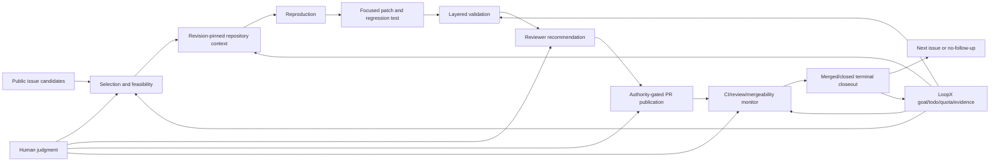

# Issue-Fix Capability

[中文](README.zh-CN.md) · [Capability index](../README.md) ·
[Workflow contract](protocols/issue-fix-workflow-contract-v0.md) ·
[Acceptance loop](protocols/issue-fix-acceptance-loop-v0.md) ·
[Reviewer recommendation](protocols/issue-fix-reviewer-recommendation-v0.md) ·
[Reviewer request](protocols/issue-fix-reviewer-request-v0.md) ·
[Reviewer notification sinks](protocols/issue-fix-reviewer-notification-sinks-v0.md)

Issue-fix is LoopX's product path for turning a public repository issue into a
small, validated, reviewable pull request and then keeping that PR moving until
its lifecycle has a clear outcome. The capability is designed for a
long-running issue-to-PR employee, not for a one-shot code generator: LoopX
keeps goal state, todos, authority, repository evidence, validation, reviewer
routing, monitors, human gates, and terminal closeout outside any single chat
turn.

The core product outcome is a focused fix PR when the issue is suitable. A
public comment or justified triage remains useful for rejecting unsuitable
candidates or recording a concrete blocker, but it is not a substitute for the
fix-PR path when that path is feasible.

## What LoopX Provides Underneath

You do not need to know LoopX before using this capability. The shortest mental
model is: a coding agent can inspect and change a repository, while LoopX is the
local-first control plane that remembers what the agent is trying to achieve,
decides what may run next, exposes progress to people, and keeps the work alive
across chat turns and external waits.

GitHub remains the source of truth for issues, code, checks, reviews, and merge
state. LoopX adds the missing employee-control layer between a host agent and
GitHub:

| LoopX foundation | What it contributes to issue/PR fixing |
| --- | --- |
| Durable goal state | Keeps the objective, acceptance target, current status, next action, and compact outcome evidence after one model turn ends. |
| Todo ownership and routing | Separates agent work from concrete human decisions; records priority, `claimed_by`, blockers, successors, handoffs, and monitor work so two agents do not silently do the same task. |
| Kanban/status projection | Projects the same todo truth into a human-visible board or dashboard without making the board a second state machine. People can see who owns the issue, what was produced, and what is waiting. |
| Quota and scheduler policy | Uses `quota should-run` to decide whether a bounded work segment should run now, wait, repair state, or stay quiet. Unchanged polling backs off and does not count as delivery progress. |
| Authority and interaction gates | Separates technical capability from permission. Private material, public comments, push, PR creation, review requests, merge, and production actions can each require explicit recorded authority. |
| Evidence and repository context | Pins conclusions to a repository revision, source trust, freshness, repo-relative references, reproduction, and validation. Compact evidence survives; raw logs, credentials, and private bodies do not leak into public state. |
| Replan and handoff contracts | Converts CI failure, reviewer correction, missing information, or a stale branch into a runnable successor, a concrete blocker, or a scoped human question instead of losing the correction in chat. |
| Continuous monitors | Watches CI, review, mergeability, maintainer comments, stale branches, merged, and closed states; writes back only material transitions and terminates with an explicit outcome. |
| Public/private boundary checks | Scans public artifacts and keeps local paths, credentials, runtime state, raw transcripts, tool logs, and private evidence out of commits and PRs. |

The issue-fix capability composes these generic foundations into domain packets
and CLI commands. The host agent still reads code, edits the worktree, runs
tests, and performs separately authorized GitHub actions. This division is what
turns “generate a patch once” into a visible, resumable issue-to-PR employee:

```text
public issue
  -> durable goal and claimed todo
  -> revision-pinned evidence and reproduction
  -> focused patch and validation
  -> explainable reviewer route and authority gate
  -> PR monitor and material-transition replan
  -> merged/closed outcome, successor, or explicit no-follow-up
```

## Product Position

LoopX is the control plane, not the coding model or GitHub itself.

| Layer | Responsibility |
| --- | --- |
| Host agent/runtime | Read code, reproduce the bug, edit files, run tests, and perform explicitly authorized git/GitHub actions. |
| Issue-fix capability | Build public-safe workflow, feasibility, repository-context, reviewer, validation, and PR-lifecycle packets. |
| LoopX kernel | Persist goal/todo ownership, quota, authority, evidence, monitor, replan, and human-interaction state. |
| Repository/GitHub | Remain authoritative for code, policy, CI, review, mergeability, and terminal PR state. |
| Human maintainer | Own design judgment, repository policy, sensitive/private context, and any action outside recorded authority. |

The issue-fix packet builders do not silently publish. A host agent may create
or update a PR only when the current LoopX boundary records that authority and
repository policy allows it. Merge remains a separate decision unless it is
explicitly authorized.

## End-To-End Design



### 1. Candidate selection

The first round should select one issue. Prefer public open issues with a
traceback, failing test, minimal reproduction, bounded change scope, and a
repository-native focused validation surface. Avoid issues that require
private data, credentials, production systems, large design debates, or broad
semantic changes.

Every candidate should receive one explicit route:

- `fix_pr`: reproduction and validation are credible and scope is bounded;
- `comment_only`: a public clarification or diagnosis adds value, but a safe
  patch is not ready;
- `triage_only`: evidence is insufficient, scope is oversized, or following up
  would not add value.

The long-running employee's primary acceptance target is `fix_pr`; the other
routes protect quality and maintainer attention.

### 2. Repository-grounded understanding

The authority order is:

1. current checkout evidence;
2. repository-scoped historical memory;
3. external expert or bot advice.

Read repository policy, architecture, nearby source and tests, validation
commands, and recent related fixes at the pinned revision. Compact this into
`issue_fix_repository_context_input_v0`, including revision, repo-relative
source references, evidence aspect, source trust, and freshness. Memory and
expert conclusions are advisory until verified in the current checkout.

### 3. Reproduction before modification

Separate four outcomes instead of flattening every failure into a product bug:

- product bug reproduced;
- test or fixture bug;
- environment/dependency failure;
- report remains under-specified or cannot currently be reproduced.

When possible, make the existing focused test fail for the reported contract
before changing production code. Preserve compact pass/fail and command-label
evidence, not raw logs or local paths.

### 4. Focused patch and regression proof

Use a clean worktree and branch from the latest approved base revision. Keep
the patch small, explainable, and consistent with nearby repository patterns.
Add or adjust a focused test that would fail without the fix. Expand validation
only in proportion to risk.

### 5. Reviewer recommendation and default request

Reviewer selection is part of the control plane because a correct patch can
still stall when the wrong person is asked to review it. LoopX now provides:

```bash
loopx issue-fix reviewer-plan \
  --repo-path /path/to/approved/repo \
  --repo owner/repo \
  --base-ref origin/main \
  --exclude-reviewer @pull-request-author \
  --exclude-author-name "PR Author Git Name" \
  --reviewer-sources-json reviewer-sources.json \
  --execute \
  --format json
```

After the PR exists, a host with standing `external_review_request` or
`publish` authority should notify the default reviewer directly:

```bash
loopx issue-fix reviewer-request \
  --url https://github.com/owner/repo/pull/123 \
  --repo-path /path/to/approved/repo \
  --base-ref origin/main \
  --reviewer-sources-json reviewer-sources.json \
  --notification-sinks-json local-private-notification-sinks.json \
  --execute \
  --format json
```

The current evidence order is deliberately conservative:

1. repository `CODEOWNERS` matches for each changed path;
2. caller-verified public maintainer maps whose most-specific path route names
   a primary contact;
3. commit history for the exact changed path;
4. nearest module-directory history when a new file has no usable path
   history;
5. maintainer-map fallback or cross-module contacts when no scoped route
   applies or the primary contact is excluded.

The packet ranks candidates with source kinds, reason codes, changed-path
coverage, history counts, recency, confidence, public `source_refs`, compact
matched-route evidence, and whether a GitHub handle is actually requestable.
It never captures the maintainer-map body or commit email addresses, never
records the local repo path, and `reviewer-plan` never sends a review request.
`reviewer-request` fetches the live PR author, existing review requests,
completed reviews, LoopX-marked reviewer comments, and live comments that
explicitly mention a reviewer and ask for review; excludes them
automatically; and asks the top remaining requestable candidate. It first uses
a formal GitHub review request. Only when GitHub confirms that this action lacks
permission does it fall back to one concise PR comment mentioning the same
reviewer. The command reads the PR again and verifies either provider state or
the fallback comment marker plus public URL before claiming success. A retry
recognizes either the marker or a bounded explicit review-request comment and
sends no duplicate comment; ordinary mentions and discussion do not suppress a
request. Network and unknown provider errors remain blockers rather than
triggering comments. History is
read at the base revision so feature-branch commits do not recommend the
author; `--exclude-author-name` covers unresolved git-name aliases.
When a human confirms that an unresolved git display name belongs to a specific
GitHub account, `--identity-map-json` records that compact mapping as verified
identity evidence and reranks the same repository-native contribution evidence.

`--notification-sinks-json` optionally adds a secondary notification after
canonical GitHub coverage is verified. The first adapter uses an explicitly
named, project-dedicated Lark/Feishu bot profile to mention the same reviewer in
an approved group and read the message back. It rejects default/shared bot
identities, never selects a different reviewer, and never copies the local bot
profile, destination, member mapping, or raw provider response into public
state. A stable hashed receipt prevents duplicate sends across retries.

Long-running goals can register the local-private sink pointer once with
`configure-goal --issue-fix-reviewer-notification-config`. Subsequent
`reviewer-request --goal-id ... --project ...` calls discover it automatically,
use explicit reader/user and sender/bot profiles without changing the machine
default, verify mapped reviewer `open_id` values with the sender app before
sending, and persist only new
`sha256:` receipts in the PR lifecycle row. If that row is missing, execute
mode auto-materializes it from a fresh compact GitHub lifecycle read before
the external notification. Restart/retry returns `already_notified`; no
notification ledger or public config path is added.

`--reviewer-sources-json` is the bridge for repository-specific public routing
knowledge. The host reads an approved public source, such as a maintainer-map
issue or repository document, and supplies only stable source id, public URL,
trust, freshness, observation time, path-prefix/glob routes, and
primary/fallback handles. LoopX
does not fetch or persist the raw page. The output keeps the URL beside each
candidate so a maintainer can audit why that person was selected.

`CODEOWNERS` remains the strongest repository-native signal. Commit volume is
only evidence of familiarity; it is not proof of maintainership, availability,
or review authority. See the [reviewer recommendation
contract](protocols/issue-fix-reviewer-recommendation-v0.md) for scoring,
identity, and future-signal details, and the [reviewer request
contract](protocols/issue-fix-reviewer-request-v0.md) for the external-write,
idempotency, and verification rules. Secondary delivery, dedicated-bot
isolation, local-private identity mapping, and readback are defined by the
[reviewer notification sink
contract](protocols/issue-fix-reviewer-notification-sinks-v0.md).

### 6. PR publication and public-write boundary

Before an external write, prepare a public-safe package containing:

- problem and root cause;
- bounded diff summary;
- focused and expanded validation;
- risk and omissions;
- reviewer evidence;
- PR body or comment draft.

PR creation, public comments, push, merge, and publish are external writes.
The host agent may perform only the actions covered by current boundary
authority. Reviewer notification is also an external write, but a standing
`external_review_request` or `publish` authority lets the agent perform the
formal request and its permission-only comment fallback automatically without
another user prompt. This does not authorize arbitrary comments.
Recommendation packets themselves remain read-only.

### 7. Continuous PR lifecycle

After a PR exists, create a `continuous_monitor` todo with a stable target and
cadence. `loopx issue-fix pr-lifecycle` projects compact public PR metadata
into one of four decisions:

- `runnable_successor`: CI failed, review requested changes, or the branch
  needs an actionable replan;
- `monitor_continuation`: checks/review are still pending or nothing material
  changed;
- `user_gate`: an explicit human decision is required;
- `no_followup`: the PR is merged or closed and the monitor can terminate.

Identical polls should not create work, consume delivery quota, or spam the
maintainer. Material transitions must produce a successor, concrete blocker,
or structured no-follow-up; the agent must not stop silently in monitor-only
state.

When a review or public maintainer comment contains a concrete correction, the
host compacts it into `issue_fix_maintainer_correction_input_v0` and passes it
to `pr-lifecycle`. The compact input keeps only the correction kind, a public
source reference, a bounded summary, and one of: verification plus PR update
path, a concrete ambiguity question, or missing authority scopes. It never
copies the raw review/comment body.

With `--execute-transition`, an `actionable_patch` creates exactly one
`issue_fix_maintainer_correction_patch` todo claimed by the registered agent.
`semantic_ambiguity` and `missing_authority` create a concrete user gate that
blocks that same agent. `unchanged` creates no todo. The normalized correction
fingerprint and deterministic todo text make retries idempotent, while terminal
merged/closed state still takes precedence over late feedback.

### 8. Terminal closeout and repeatability

At merged/closed state, persist compact lifecycle evidence, close the monitor,
sync the management surface, record residual risk, and choose one of:

- next issue selection;
- a concrete rollout/follow-up todo;
- a blocker or superseding route;
- structured no-follow-up.

One merged PR proves a delivery slice. Repeating the loop on independent issues
tests whether the system is a durable employee rather than a scripted demo.

## Implemented Surfaces

| Surface | Command or path | Current responsibility |
| --- | --- | --- |
| Workflow plan | `loopx issue-fix workflow-plan` | Compose body-free metadata, intake, branch plan, validation label, ordered todo previews, gates, and PR-readiness blockers. |
| Repository context | `--repository-context-json` | Pin policy, architecture, change-scope, reproduction, and validation evidence with trust and freshness. |
| Feasibility | `loopx issue-fix feasibility` | Select exactly one `fix_pr`, `comment_only`, or `triage_only` route and optionally persist compact domain state. |
| Reviewer plan | `loopx issue-fix reviewer-plan` | Rank explainable reviewer candidates from CODEOWNERS, caller-verified public maintainer maps, and changed-path/module history without requesting review. |
| Reviewer notification | `loopx issue-fix reviewer-request` | Under standing authority, exclude the live PR author and existing coverage, request the top candidate, fall back to one verified `@reviewer` comment only on permission denial, and avoid duplicates. |
| PR lifecycle | `loopx issue-fix pr-lifecycle` | Project CI, review, merge state, draft, merged, and closed signals into monitor transitions. |
| Maintainer correction | `loopx issue-fix pr-lifecycle --maintainer-correction-json ... --execute-transition` | Turn bounded public review feedback into one claimed patch successor, a concrete user gate, or a quiet unchanged poll. |
| Acceptance fixture | `loopx issue-fix acceptance-fixture` | Prove failure-before, minimal patch, and pass-after in a deterministic fixture. |
| Git branch fixture | `loopx issue-fix repo-branch-fixture` | Exercise the same repair contract through a temporary git branch. |
| Caller repo branch | `loopx issue-fix caller-repo-branch` | Inspect an approved local repo, create/claim an issue branch, and run caller-declared validation. |
| Content bridge | `loopx content-ops issue-fix-*` | Reuse body-free public metadata/intake boundaries. |
| Long-running control | `loopx todo`, `quota`, `refresh-state`, `lark-kanban` | Persist ownership, gates, compute decisions, progress, evidence, and visible Kanban state. |

The capability module lives at `loopx/capabilities/issue_fix/`; domain-state
rows live in the existing issue-fix domain pack rather than a parallel context
ledger.

## Truth And Evidence Model

### Revision-pinned repository context

Repository context should answer:

| Question | Required evidence |
| --- | --- |
| What revision is authoritative? | Full base revision and branch relationship. |
| What can change? | Repo-relative source/test references and nearby patterns. |
| How is the issue reproduced? | Focused command or compact observed contract. |
| How is the fix validated? | Repository-native focused validation and risk-based expansion. |
| Which source is trusted? | Repository policy/current code first; memory/expert sources marked advisory. |
| Is the evidence fresh? | Revision or timestamp tied to the current checkout. |

### Public-safe evidence

Packets preserve compact classifications and references. They do not preserve:

- raw issue/comment bodies by default;
- raw validation, git, provider, or expert output;
- local absolute paths;
- credentials or private material;
- transcript/tool capture or automatic memory writeback without an approved
  isolation boundary.

### Environment vs product attribution

An unavailable dependency, killed process, or missing service is environment
evidence. It may block a validation surface without refuting the product bug.
Conversely, a failing legacy test does not prove the new patch caused the
failure; compare the pinned base and changed hunks before attribution.

## Reviewer Routing Contract

The reviewer recommendation layer separates three concepts:

1. **ownership evidence**: CODEOWNERS, caller-verified public maintainer maps,
   and path/module contribution history;
2. **review recommendation**: explainable ranked candidates;
3. **review request**: a default post-PR action governed by repository policy
   and explicit or standing boundary authority.

Current scoring gives CODEOWNERS matches dominant weight. A current verified
maintainer-map primary contact ranks above history-only familiarity, while map
fallback contacts rank below primary routing. Trust and freshness reduce map
weight. A new file falls back to its nearest module directory only when no
non-excluded exact-path history is usable. The packet exposes matched routes,
source links, and reason codes instead of presenting a score as authority.

The default policy requests one top requestable candidate when authority is
active. Existing requested or completed review counts toward that limit. The
request is complete only after provider readback confirms it.

Important safeguards:

- fetch and exclude the live PR author, existing reviewers, and explicitly
  unavailable reviewers;
- do not expose commit email addresses;
- do not treat bots, anonymous identities, or unresolved names as requestable;
- cap candidates and show path coverage;
- retain public source references while rejecting local/private source URLs and
  raw maintainer-map bodies;
- keep team handles distinct from individual handles;
- respect required-review and branch-protection policy outside the ranking;
- never infer merge authority from reviewer familiarity.

Planned signals, added only with real call sites and public-safe evidence:

- automatic discovery of checked-in package/module maintainer metadata beyond
  caller-supplied source packets;
- recent review participation and accepted-review history;
- reviewer load, stale request detection, and fallback routing;
- bus-factor/risk hints when one person dominates a critical module;
- GitHub identity resolution for public git authors without noreply handles;
- explicit repository allow/deny lists and team membership verification.

## Human Interaction Model

Humans should be interrupted for decisions, not routine progress. Typical
concrete user gates are:

- private reproduction material or credentials are required;
- architecture or behavior scope is genuinely ambiguous;
- repository policy requires a specific reviewer or owner approval;
- public write authority is missing;
- maintainer feedback changes the intended behavior;
- merge or production authority is not recorded.

CI pending, unchanged monitor polls, routine reviewer evidence collection, and
repository-native focused validation remain agent work. A visible Kanban can
project todo ownership, status, evidence, blockers, and outputs without becoming
a second source of truth.

## Public Pilot Evidence

The first public end-to-end pilot selected
[OpenViking issue #3102](https://github.com/volcengine/OpenViking/issues/3102),
published a focused fix, passed required CI and review, and reached
[merged PR #3115](https://github.com/volcengine/OpenViking/pull/3115). The case
validated the host-agent loop around revision-pinned context, reproduction,
focused validation, authority-gated publication, continuous monitoring,
terminal closeout, Kanban visibility, and successor planning.

The pilot also produced generic LoopX control-plane feedback in
[PR #1784](https://github.com/huangruiteng/loopx/pull/1784). Pilot evidence is
advisory for product design until the corresponding generic changes are merged;
the current repository revision remains authoritative.

## Roadmap

### Current stage

- public metadata and route selection;
- repository-context provenance;
- deterministic and caller-repo repair artifacts;
- focused validation evidence;
- reviewer recommendation from CODEOWNERS, public repository-declared routing
  sources, and repository-native contribution evidence;
- authority-gated, idempotent reviewer notification with formal-request-first,
  permission-only comment fallback, and PR readback;
- PR lifecycle projection and provider-neutral maintainer-correction succession;
- LoopX todo/quota/monitor/Kanban integration through the host agent.

### Next stage

- trigger the goal-default reviewer request directly from PR-ready transitions;
- resolve public GitHub identities and repository teams without leaking email;
- make publication authority visible per external action;
- make unchanged lifecycle observations physically idempotent everywhere;
- add a reusable terminal acceptance report across repeated issues.

### Longer-term stage

- multi-repository issue portfolios with bounded concurrency;
- maintainer preference learning from public accepted/rejected outcomes;
- reviewer load balancing and bus-factor awareness;
- evaluate validated-outcome memory utility across repeated issues before any
  default enablement or session-memory expansion;
- Open Knowledge Format interoperability after the repository-context contract
  stabilizes;
- project-level metrics for accepted fixes, cycle time, human attention,
  regressions, and boundary incidents.

## Success Metrics

Track outcomes, not agent activity:

- selected issues that reach a focused PR;
- focused PRs accepted or merged;
- failure-before/pass-after proof rate;
- unrelated regression rate;
- time from issue selection to review-ready and terminal state;
- number and type of human interventions;
- reviewer recommendation acceptance/override rate;
- unchanged monitor polls skipped;
- public/private boundary incidents;
- LoopX generic gaps fixed or converted into concrete claimed todos.

## Conversational `/loopx` Entry

On a host with the LoopX slash entry, start the long-running goal directly:

```text
/loopx Fix https://github.com/owner/repo/issues/123
```

For a manually integrated host, inspect the command pack and then start the
same exact goal text through the guided CLI transaction:

```bash
loopx bootstrap-command-pack --project .
loopx start-goal --guided --project . \
  --goal-text "Fix https://github.com/owner/repo/issues/123"
```

The conversational entry does not bypass issue selection, authority, or
validation. It creates the durable goal/todo/host-loop route from which the
issue-fix commands below can be executed.

## Feasibility Decision

`loopx issue-fix feasibility` selects exactly one of `fix_pr`, `comment_only`,
or `triage_only`. A `fix_pr` decision requires bounded change scope plus a
named reproduction and validation surface. The compact decision belongs in the
existing issue-fix domain state before writing todos for the chosen route; it
does not create a parallel workflow ledger.

## Repository Context

Both workflow planning and feasibility accept
`--repository-context-json <compact-context.json>`. The input must pin the
current revision and keep source references repo-relative. Current checkout
evidence remains authoritative; memory and expert conclusions stay advisory
until verified. The public
[OpenViking pilot handoff](openviking-pilot-handoff.md) shows how the real
pilot applies that evidence order without introducing a repository-specific
control path.

They also accept either `--repository-memory-json
<compact-search-read-result.json>` or a configured context provider. The
provider path is deliberately layered: the reusable LoopX context-provider
module owns OpenViking CLI/version/service preflight, bounded explicit
`search -> read`, time/result caps, fail-open errors, and authority-gated
resource sync. Issue-fix owns the domain query, revision-scoped namespace,
mapping retrieved resources back to repo-relative files, and exact current
checkout verification. There is no repository-name special case.

Set `LOOPX_ISSUE_FIX_REPOSITORY_MEMORY_PROVIDER_CONFIG` to a local-private
`issue_fix_repository_memory_provider_config_v0` file, or pass
`--repository-memory-provider-json`. When the configured provider, public
scope, current revision, and caller-approved checkout are available,
`workflow-plan` and `feasibility` run the provider by default. An explicit
`--repository-memory-json` still overrides the environment default. LoopX
hashes provider references, keeps every memory source advisory, allows patch
influence only for canonical-text exact matches or parser chunks whose
non-empty lines match the pinned checkout at least 98% (transport line
endings and one terminal newline are normalised), and
persists only the compact hook projection in the existing repository context.
Unverified hits contribute counts only; their summaries are not persisted.
Provider unavailability, empty retrieval, or a missing checkout is fail-open;
raw memory bodies, automatic transcript capture, private namespaces,
credentials, and provider config paths are never retained.

Minimal local provider config (the revision must also appear in `scope_ref`):

```json
{
  "schema_version": "issue_fix_repository_memory_provider_config_v0",
  "enabled": true,
  "provider": "openviking",
  "namespace": "public-repository",
  "visibility": "public",
  "scope_ref": "viking://resources/public-repository/<git-revision>",
  "repository_revision": "<full-git-revision>",
  "max_results": 3,
  "timeout_seconds": 15,
  "sync_timeout_seconds": 180,
  "resource_references": ["src/module.py", "tests/test_module.py"],
  "writeback_enabled": false,
  "writeback_scope_ref": "viking://resources/public-repository/<git-revision>",
  "workspace_scope": "owner-repo",
  "peer_scope": "issue-fix-agent"
}
```

Resource indexing is intentionally separate from retrieval. Use
`loopx issue-fix repository-memory-sync` to preview a bounded set of
repo-relative public files; add `--execute` only after the provider-resource
write is authorized. Re-running the same immutable revision scope is
idempotent when stored content still matches and stops on a conflict instead
of replacing or auto-renaming it. Retrieval and resource sync use separate
bounded timeouts because semantic indexing can legitimately take longer than
read-only search.

Validated-outcome writeback is a separate, default-off hook. It runs only when
the caller explicitly adds `--write-repository-memory`, the local provider
config independently sets `writeback_enabled: true`, delivery evidence says
`completed`, validation says `passed`, the delivery evidence has a stable
`recorded_at`, the outcome revision matches the configured public resource
scope, and `--repo-path` proves with git that delivery `commit_ref` is an
ancestor of that pinned revision. Divergent, missing, or unresolved commits
block before the provider is called. Squash flows should record the final
merge/squash commit, not a superseded feature-branch commit. The checkout path
and raw git output are never retained. LoopX writes one distilled fact containing
revision, provenance, freshness, public outputs, risks, a stable supersession
key, and explicit workspace/peer scopes. A content hash selects the immutable
target, so an identical retry reads and accepts the existing fact without a
second write; conflicting content stops instead of overwriting. Raw
transcripts, tool logs/results, expert answers, credentials, private material,
and captured local paths are rejected. The provider packet retains only opaque
refs and compact receipts.

The OpenViking adapter deliberately uses deterministic `viking://resources/`
writeback for this first contract. It does not call experimental `ov
add-memory`, because that command creates a fresh session and currently accepts
no idempotency key. Conversation/session capture therefore remains out of
scope and requires a separate owner decision even when validated-outcome
writeback is enabled.

Default enablement is an evidence decision rather than an installation side
effect. A project should first dogfood the hook across several independent
issue/context runs and a restart boundary. Make it a packaged default only
when it repeatedly contributes novel checkout-verified evidence without stale,
misleading, or boundary-unsafe retrieval; otherwise keep it explicit opt-in
with the same fail-open behavior.

## PR Lifecycle Monitor

After publication, `loopx issue-fix pr-lifecycle` and a `continuous_monitor`
todo keep CI, review, maintainer correction, mergeability, stale branch, and
terminal status visible. Publication, review requests, merge, and access to
private material remain explicit gates. Each material transition must yield a
`runnable_successor`, concrete blocker, or structured no-follow-up; unchanged
polls remain quiet and do not spend delivery quota.

Pass `--issue-ref` when persisting PR lifecycle state. This explicit public-safe
link lets the outcome read model join the PR to its issue without guessing from
branch names, titles, or text.

To convert bounded feedback into durable work, supply a compact correction and
explicitly execute the transition:

```bash
loopx issue-fix pr-lifecycle \
  --url https://github.com/owner/repo/pull/123 \
  --issue-ref issues_100 \
  --metadata-json pr-metadata.json \
  --maintainer-correction-json correction.json \
  --goal-id issue-fix-goal \
  --project /path/to/approved/repo \
  --claimed-by issue-fix-agent \
  --execute-transition \
  --format json
```

The correction source is provider-neutral: any public HTTPS or repo-relative
reference may be used, while the current PR monitor remains the authoritative
lifecycle source. Exact retries neither add another successor nor rewrite the
same lifecycle row.

## Status And Output View

Todo cards answer **what the agent should do next**. They do not, by
themselves, answer **what happened to one issue**. `loopx issue-fix outcome`
fills that read-model gap without creating another ledger or lifecycle state
machine. It derives one stable `issue_fix_outcome_projection_v0` case from the
existing feasibility row, revision-pinned repository context, optional compact
delivery evidence, and optional PR lifecycle row.

Compact delivery evidence uses `outcome_status=in_progress|completed|blocked`
and `validation_status=passed|failed|partial|not_run`. Terminal PR state still
takes precedence, while an explicit blocked delivery remains visible over a
non-terminal wait such as pending CI.

The case card exposes the selected route and current stage; issue and PR links;
repository revision and context fingerprint; reproduction and validation
status; repo-relative changed files and commit ref when explicitly supplied;
checks, review, mergeability, and terminal result; remaining risks; and the next
action. Missing delivery evidence remains `declared` or unknown—PR existence is
never treated as proof that focused validation passed.

The packet is directly consumable by `loopx lark-kanban sync-projection`.
Execution todos remain separate cards, while the stable outcome card is keyed
by repository and issue. A merged, closed, or triaged terminal card remains
visible by default so the board shows outputs instead of only active work.
Shared sinks continue to apply the existing local-path, private-link, and
private-reference redaction boundary.

The default `loopx lark-kanban sync-loopx-todos` path also derives all issue
outcomes from the goal's existing feasibility and PR lifecycle domain state and
upserts them beside todo rows. A feasibility row therefore appears as issue work
even before a PR exists; a PR enriches that row only when its lifecycle
observation carries the matching `repo` and explicit `issue_ref`. Numeric issue
aliases (`#123`, `issue_123`, `issues/123`) canonicalize to `issues_123` on
write and when reading legacy rows, so equivalent explicit links cannot silently
fall into the unlinked count. This automatic closeout projection adds no outcome
ledger or second state machine.

Supplying `--delivery-evidence-json` alone is a read-only preview. Add
`--write-delivery-evidence` after focused validation to store its validated,
public-safe compact form inside the existing feasibility row. Later default
outcome and Kanban syncs then retain the validation, changed files, commit, output
links, and risks instead of falling back to the feasibility declaration. The
write flag rejects an ad hoc `--feasibility-json` source so the destination is
always the stable goal-scoped row.
Repeating the same compact evidence is an unchanged, no-write operation.

The Lark adapter renders this as a first-class issue dimension rather than
only flattening the packet into `Evidence`. Outcome rows set
`Work Item Type=Issue Fix` and populate `Repository`, `Issue`, `Pull Request`,
`Route`, `Stage`, `Validation`, and `Outcome`. `Issue Fix Outcomes` provides the
table view; `Issue Fix Kanban` groups the same rows by `Stage`. Existing boards
gain the missing fields and views through idempotent `lark-kanban setup
--execute` schema reconciliation.

## Commands

```bash
# Preview the complete issue-fix workflow.
loopx issue-fix workflow-plan \
  --url https://github.com/owner/repo/issues/123 \
  --repo-path /path/to/approved/repo \
  --repository-context-json context.json \
  --repository-memory-json compact-search-read-result.json \
  --validation-label "focused unit test" \
  --format json

# Or configure the reusable OpenViking provider once. The config stays local
# and binds a public viking:// scope to the exact repository revision.
export LOOPX_ISSUE_FIX_REPOSITORY_MEMORY_PROVIDER_CONFIG=/path/to/provider.json
loopx issue-fix workflow-plan \
  --url https://github.com/owner/repo/issues/123 \
  --repo-path /path/to/approved/repo \
  --repository-context-json context.json \
  --repository-memory-query "affected module reproduction validation" \
  --validation-label "focused unit test" \
  --format json

# Select one route and persist compact goal-scoped feasibility state.
loopx issue-fix feasibility \
  --url https://github.com/owner/repo/issues/123 \
  --reproduction-status confirmed \
  --reproduction-label "focused contract repro" \
  --scope-class bounded \
  --validation-label "focused unit test" \
  --repository-context-json context.json \
  --repository-memory-json compact-search-read-result.json \
  --goal-id example-goal \
  --format json

# Recommend reviewers without requesting external review.
loopx issue-fix reviewer-plan \
  --repo-path /path/to/approved/repo \
  --repo owner/repo \
  --base-ref origin/main \
  --exclude-reviewer @pull-request-author \
  --exclude-author-name "PR Author Git Name" \
  --reviewer-sources-json reviewer-sources.json \
  --execute \
  --format json

# Notify the default top non-author reviewer and verify the formal request or permission fallback.
loopx issue-fix reviewer-request \
  --url https://github.com/owner/repo/pull/456 \
  --repo-path /path/to/approved/repo \
  --base-ref origin/main \
  --reviewer-sources-json reviewer-sources.json \
  --goal-id example-goal \
  --project /path/to/approved/repo \
  --execute \
  --format json

# Project PR lifecycle into LoopX continuation state.
loopx issue-fix pr-lifecycle \
  --url https://github.com/owner/repo/pull/456 \
  --issue-ref issues_123 \
  --fetch-metadata \
  --goal-id example-goal \
  --format json

# Derive one issue status/output projection from existing domain state.
loopx issue-fix outcome \
  --goal-id example-goal \
  --project /path/to/approved/repo \
  --repo owner/repo \
  --issue-ref issues_123 \
  --pr-ref pull_456 \
  --delivery-evidence-json delivery-evidence.json \
  --write-delivery-evidence \
  --repository-memory-provider-json provider.json \
  --write-repository-memory \
  --repo-path /path/to/approved/repo \
  --agent-id codex-issue-fix \
  --format json
```

## Validation

```bash
python3 examples/issue-fix-capability-guide-smoke.py
python3 examples/issue-fix-reviewer-recommendation-smoke.py
python3 examples/issue-fix-reviewer-request-smoke.py
python3 examples/issue-fix-reviewer-notification-sink-smoke.py
python3 examples/issue-fix-workflow-plan-smoke.py
python3 examples/issue-fix-workflow-contract-smoke.py
python3 examples/issue-fix-repository-context-smoke.py
python3 examples/issue-fix-repository-memory-smoke.py
python3 examples/issue-fix-validated-memory-writeback-smoke.py
python3 examples/issue-fix-feasibility-smoke.py
python3 examples/issue-fix-pr-lifecycle-smoke.py
python3 examples/issue-fix-maintainer-correction-smoke.py
python3 examples/issue-fix-outcome-projection-smoke.py
python3 examples/issue-fix-acceptance-loop-smoke.py
loopx canary premerge --from-git-diff
```

## Non-Goals

- LoopX does not bypass repository review or branch protection.
- Reviewer recommendation is not reviewer assignment or availability proof.
- The capability does not default to automatic merge or production actions.
- It does not store raw transcripts, tool logs, expert answers, credentials, or
  private issue material in public state.
- It does not add repository-specific branches such as `if repo == ...` to the
  generic control plane.
