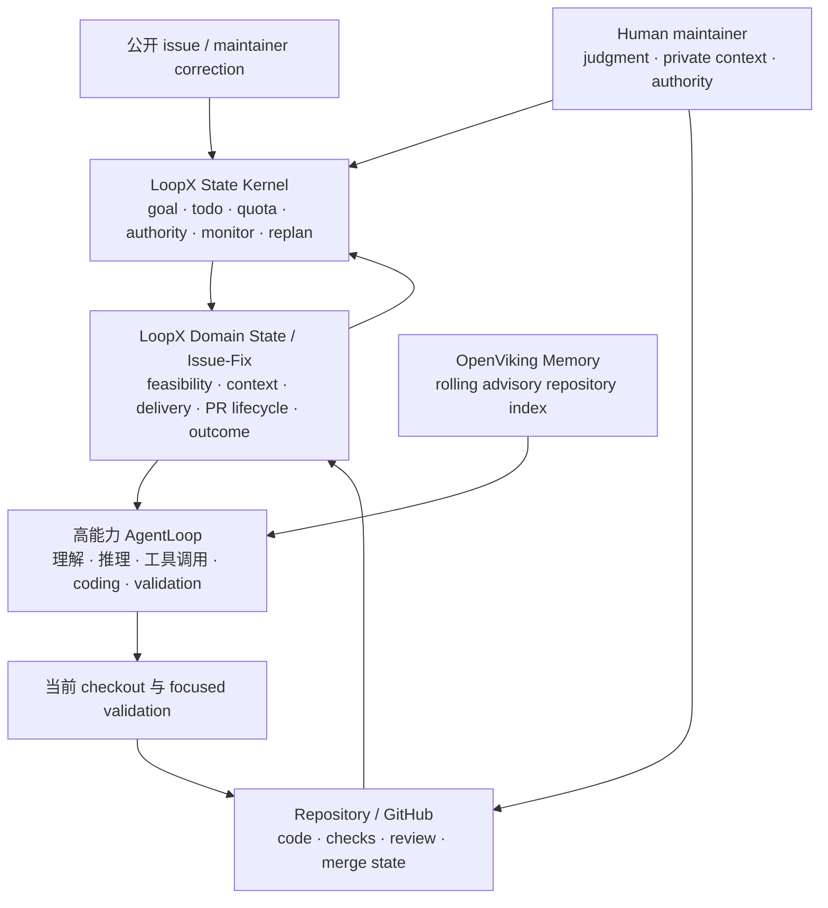
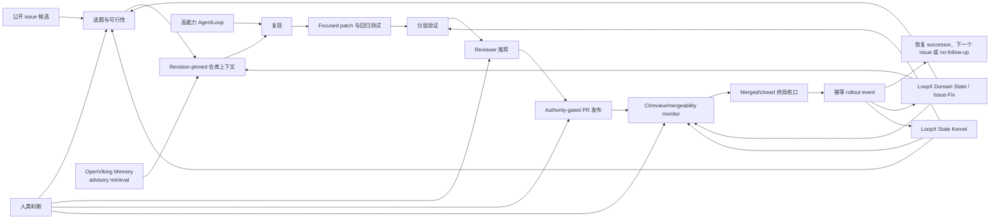

# Issue-Fix 能力

[English](README.md) · [能力目录](../README.md) ·
[工作流协议](protocols/issue-fix-workflow-contract-v0.md) ·
[Agent 发现缺陷转公开 Issue](protocols/issue-fix-discovered-issue-promotion-v0.md) ·
[验收循环](protocols/issue-fix-acceptance-loop-v0.md) ·
[Reviewer 推荐协议](protocols/issue-fix-reviewer-recommendation-v0.md) ·
[Reviewer 邀请协议](protocols/issue-fix-reviewer-request-v0.md) ·
[Reviewer 通知 Sink](protocols/issue-fix-reviewer-notification-sinks-v0.md) ·
[Lark 反馈 Inbox](../lark-event-inbox.md)

**把一条公开 issue 持续推进成小而聚焦、验证充分、可审阅的 PR，并跟进到
merged、closed 或明确 no-follow-up。** 这是 Issue-Fix 的核心产品承诺。

```text
/loopx Fix https://github.com/owner/repo/issues/123
```

它不是“一次 prompt 生成一个 patch”，而是一个可跨模型 turn、聊天线程、CI 等待和
review 往返持续工作的 issue→PR loop agent。它把四类互补能力组合在同一条交付链路中：

- **LoopX State Kernel** 提供长程持续交付所需的 goal、todo、quota、authority、
  scheduler、monitor、replan 和 terminal closeout；
- **OpenViking Memory** 提供可选的垂域仓库记忆，让 agent 找回历史实现、失败模式和
  已验证经验，但影响 patch 的命中仍必须回到当前 checkout 验证；
- **LoopX Domain State（Issue-Fix 垂域状态）** 在通用 kernel 之上保存 issue 领域的
  feasibility、repository context、delivery evidence、reviewer route、PR lifecycle
  和 outcome；
- **高能力 AgentLoop** 提供理解、推理、工具调用和代码执行能力，可以是 Codex、
  Claude Code 或其他 host agent runtime，LoopX 不绑定某个模型或 agent loop。

四层组合的目标不是把模型包装成“像人”的口号，而是补齐成熟工程交付真正依赖的
连续性、记忆、领域状态和执行智力，让 loop agent 能以接近资深工程师的方式持续推进
复杂任务，而不是每轮重新开始。

当 issue 适合修复时，核心产出是 focused fix PR。公开 comment 或有理有据的 triage
仍可用于拒绝不合适候选、澄清信息或记录具体 blocker，但不能在 `fix_pr` 可行时
替代 PR 主路径。

## 四层能力组合

| 能力层 | 它解决什么 | 在 Issue-Fix 中的真实边界 |
| --- | --- | --- |
| **LoopX State Kernel：持续交付** | 让目标、ownership、compute 决策、等待、恢复和收口跨 turn 持续存在。 | 它是 local-first 控制面，不负责替 agent 写代码，也不替 GitHub 决定 checks、review 或 merge state。 |
| **OpenViking Memory：垂域记忆** | 从稳定的 rolling 默认分支索引和已验证 outcome 中找回相关实现、历史修复与验证模式，减少重复探索。 | 当前是显式配置、advisory、fail-open 的可选能力；命中只有通过当前 checkout 的 exact-content 或高置信 parser-chunk 验证后才能影响 patch，validated-outcome writeback 默认关闭。 |
| **LoopX Domain State：Issue-Fix 垂域状态扩展** | 保存 `fix_pr` / `comment_only` / `triage_only` 决策、仓库上下文、交付证据、reviewer、PR lifecycle 和 outcome。 | 复用现有 goal-scoped domain pack；它不是第二套 todo、quota 或 workflow engine，也不保存 raw issue/comment/log。 |
| **AgentLoop：执行智力** | 阅读 issue 和代码、复现、推理、编辑 worktree、运行测试、处理 review correction。 | AgentLoop 可替换且必须遵守 LoopX authority、仓库政策和验证合同；“模型更强”不等于拥有发布、merge 或 production authority。 |

四层缺一不可，但职责不能混在一起：**智力不等于连续性，记忆不等于当前状态，领域
状态不等于执行，控制面也不等于事实源。** Repository/GitHub 始终是 issue、代码、CI、
review、mergeability 和 PR 终局的权威来源；人类 maintainer 仍负责设计判断、敏感上下文
和超出已记录 authority 的动作。



## LoopX 底座提供什么

使用这项能力不要求先理解全部协议。最短的心智模型是：AgentLoop 负责理解仓库和修改
代码；OpenViking Memory 提供经过当前 checkout 复核的历史线索；LoopX Domain State
保存垂域进度；LoopX State Kernel 决定下一步能否运行、是否需要人、何时等待或恢复。

GitHub 仍然是 issue、代码、checks、review 和 merge state 的事实源。LoopX 补上 host
agent 与 GitHub 之间缺失的“数字员工控制层”：

| LoopX State Kernel 能力 | 在 issue/PR fix 场景中的作用 |
| --- | --- |
| 持久化 goal state | 在一次模型 turn 结束后继续保存 objective、acceptance target、current status、next action 和紧凑 outcome evidence。 |
| Todo ownership 与 routing | 区分 agent 工作和具体人类决策；记录 priority、`claimed_by`、blocker、successor、handoff 和 monitor，避免多个 agent 无声重复做同一任务。 |
| Kanban/status 投影 | 把同一份 todo 事实投影到人可见的看板或 dashboard，但不让看板变成第二套状态机。人可以看到谁负责、产出了什么、在等什么。 |
| Quota 与 scheduler policy | 通过 `quota should-run` 决定现在应执行有界工作、等待、修状态还是安静跳过；unchanged poll 会退避，也不冒充 delivery progress。 |
| Authority 与 interaction gate | 把“技术上能做”与“被允许做”分开。私有材料、公开 comment、push、建 PR、请求 review、merge 和 production action 都可分别要求明确 authority。 |
| Evidence 与 repository context | 把结论固定到 repository revision、source trust、freshness、repo-relative reference、reproduction 和 validation；保留紧凑证据，不把 raw log、凭据或私有正文带进公开状态。 |
| Replan 与 handoff contract | 把 CI failure、reviewer correction、信息缺失或 stale branch 转成 runnable successor、具体 blocker 或有范围的人类问题，而不是让修正消失在聊天里。 |
| Continuous monitor | 跟踪 CI、review、mergeability、maintainer comment、stale branch、merged 和 closed；只写回 material transition，并以明确 outcome 终止。 |
| 事件驱动的 wait/resume | 把 PR merged 等权威外部变化转换成幂等、public-safe 的 rollout event。等待 `resume_when=pr_merged:#123` 的 todo 通过正常 status/quota 投影恢复为 runnable，而不是依赖聊天记忆或让 webhook 直接执行任意代码。 |
| Public/private boundary check | 扫描公开 artifact，阻止本地路径、credentials、runtime state、raw transcript、tool log 和私有 evidence 进入 commit/PR。 |

Issue-Fix capability 把 State Kernel、Memory hook、Domain State 和 AgentLoop 组合成领域
packet 与 CLI。Host agent 仍负责读代码、修改 worktree、跑测试，以及执行另行授权的
GitHub 动作。正是这种分工，把“一次性生成 patch”变成可见、可恢复、可持续的
issue→PR 数字员工：

```text
公开 issue
  -> 持久化 goal 与已认领 todo
  -> revision-pinned evidence 与复现
  -> focused patch 与 validation
  -> 可解释 reviewer route 与 authority gate
  -> PR monitor 与 material-transition replan
  -> merged/closed evidence 与幂等 rollout event
  -> 恢复 successor、下一个 issue 或明确 no-follow-up
```

## 产品定位

LoopX 是 agent-agnostic 控制面，不是 coding model，也不是 GitHub 本身。

| 层次 | 职责 |
| --- | --- |
| AgentLoop / host runtime | 提供执行智力：读代码、复现、修改文件、运行测试，并执行已明确授权的 git/GitHub 动作。 |
| OpenViking Memory | 提供可选的 rolling 默认分支索引与已验证垂域记忆；命中在当前 checkout 验证前只作 advisory。 |
| LoopX Domain State / Issue-Fix | 生成并保存 public-safe 的 feasibility、repository-context、delivery、reviewer、PR-lifecycle 和 outcome packet。 |
| LoopX State Kernel | 持久化 goal/todo ownership、quota、authority、evidence、monitor、replan 和人机交互状态。 |
| Repository/GitHub | 继续作为代码、仓库政策、CI、review、mergeability 和 PR 终局的事实源。 |
| Human maintainer | 负责设计判断、仓库政策、敏感/私有上下文，以及超出已记录 authority 的动作。 |

Issue-Fix packet builder 不会偷偷发布。只有当前 LoopX boundary 已记录相应 authority，
且仓库政策允许时，host agent 才能创建或更新 PR。Merge 是独立决策，除非也被明确授权。

## 端到端设计



### 1. 候选筛选

第一轮只选一个 issue。优先公开、open、带 traceback、failing test、最小复现、
变更范围可控，并且存在 repository-native focused validation 的问题。避免依赖私有
数据、凭据、生产系统、大型设计争议或宽泛语义变化的候选。

每个候选必须明确选择一条路：

- `fix_pr`：复现和验证可信，范围可控；
- `comment_only`：公开澄清或诊断有价值，但尚不具备安全 patch 条件；
- `triage_only`：证据不足、范围过大，或继续跟进没有实际价值。

长程数字员工的主验收是 `fix_pr`；另外两条路用于保护质量和 maintainer 注意力。

### 2. 以当前仓库为准的理解

证据优先级严格为：

1. 当前 checkout 的证据；
2. 能映射回当前 revision、并通过 checkout 内容验证的 OpenViking Memory 命中；
3. 尚未验证的 memory、外部 expert 或 bot 建议。

在 pinned revision 阅读仓库政策、架构、附近源码和测试、验证命令以及近期相关修复，
再压缩成 `issue_fix_repository_context_input_v0`：包含 revision、repo-relative
source ref、证据类别、source trust 与 freshness。第二层的权威性来自 checkout 验证，
不是来自“被记住”本身；第三层始终只作 advisory。任何影响 patch 的结论都必须在当前
checkout 验证。

### 3. 先复现，再修改

不要把所有失败都解释成产品 bug，要区分：

- 产品 bug 已复现；
- 测试或 fixture bug；
- 环境/依赖失败；
- issue 信息仍不足或当前无法复现。

如果条件允许，先让现有 focused test 因报告中的 contract 失败，再改生产代码。
只记录紧凑的 pass/fail 和命令标签，不记录 raw log 或本地路径。

### 4. Focused patch 与回归证明

从最新获批 base revision 创建干净 worktree 和独立分支。补丁保持小、可解释，
遵循附近代码模式；新增或调整一个“没有修复就会失败”的 focused test。验证范围随风险
逐步扩大，而不是一开始就跑无边界的全仓测试。

### 5. Reviewer 推荐与默认邀请

Reviewer 路由属于控制面，因为 patch 正确但 reviewer 找错，同样会让 PR 长期停滞。
LoopX 现在提供：

```bash
loopx issue-fix reviewer-plan \
  --repo-path /path/to/approved/repo \
  --repo owner/repo \
  --base-ref origin/main \
  --exclude-reviewer @pull-request-author \
  --exclude-author-name "PR Author Git Name" \
  --reviewer-sources-json reviewer-sources.json \
  --execute \
  --format json
```

PR 创建后，只要 host 已有持续生效的 `external_review_request` 或 `publish`
authority，就应直接通知默认 reviewer：

```bash
loopx issue-fix reviewer-request \
  --url https://github.com/owner/repo/pull/123 \
  --repo-path /path/to/approved/repo \
  --base-ref origin/main \
  --reviewer-sources-json reviewer-sources.json \
  --notification-sinks-json local-private-notification-sinks.json \
  --execute \
  --format json
```

当前证据优先级刻意保持保守：

1. 每个改动路径命中的仓库 `CODEOWNERS`；
2. 经 caller 验证的公开 maintainer map 中，最具体 path route 指定的 primary contact；
3. 改动文件本身的提交历史；
4. 新文件没有可用 path history 时，回退到最近 module 目录的提交历史；
5. 没有具体 route，或 primary contact 被排除时，使用 maintainer map 的 fallback / 跨模块联系人。

Packet 输出候选的 source kind、reason code、改动路径覆盖、history 次数、recency、
confidence、公开 `source_refs`、紧凑的命中 route，以及是否真的有可请求的 GitHub
handle。它不保存 maintainer map 原文或 commit email，不记录本地 repo path，且
`reviewer-plan` 本身不会发送 review request。
`reviewer-request` 会读取 live PR author、已有 review request、已完成 review、带
LoopX marker 的 reviewer comment，以及明确 `@reviewer` 并请求 review 的已有公开
comment，自动排除已有覆盖，再通知剩余候选中排名最高且
可请求的人。它先发送正式 GitHub review request；只有 GitHub 明确返回权限不足时，
才降级为一条简短 PR comment 并 `@` 同一 reviewer。命令会再次读取 PR，验证正式
request，或 fallback comment 的语义 review 意图与公开 URL 后才报告成功。重试会识别旧 marker，
也会在 reviewer mention 附近存在明确 review 请求句式时识别旧 comment；普通提及和
讨论不会抑制 request，因此不会重复 comment，也不会因弱语义误判。网络错误和无法
分类的 provider 错误仍然是 blocker，不会触发 comment。History 固定读取 base
revision，避免 feature branch 自己的提交把作者推荐回来；
`--exclude-author-name` 用于排除无法解析成 GitHub handle 的 git-name alias。
权限不足时的 fallback 是给 reviewer 看的产品文案，不是内部回执。它会说明关联
issue 和 PR 标题概括的改动，并指向 PR 描述中的动机、验证与风险；新评论不再暴露
幂等 marker。
workflow plan 还会投影 `issue_fix_pr_description_contract_v0`，复用 PR review
五块结构中的动机、改动思路、具体改动、验证、对主干风险与未覆盖。代码类改动还必须
提供最小的“关键代码或伪代码”与“修复后复现”；后者可使用仓库 CLI，或 focused
代码/测试入口。只有复杂改动才可选配 infographic，且不能替代文字证据。“我的整体评价”
属于 reviewer verdict，不会让 PR 作者预先写进描述。
当人确认某个 unresolved git display name 对应具体 GitHub 账号时，
`--identity-map-json` 会把这条紧凑映射作为 verified identity evidence，并基于原有
repository-native contribution evidence 重新排序；它只解析身份，不虚构 ownership。

`--notification-sinks-json` 可增加并行 reviewer channel。配置后的 GitHub request 与
Lark 群通知是两项独立义务：LoopX 会分别尝试；权限不足时的 GitHub comment 只作为
GitHub request 自己的 fallback，不替代 Lark。第一个 Lark adapter 使用显式指定、项目专属的 Lark/飞书 bot profile，在获批群里
`@` 同一 reviewer 并回读消息。它拒绝默认或共享 bot 身份，不会另选 reviewer，也不会
把本地 bot profile、群 ID、成员映射或 raw provider response 写进 public state。
每个逻辑通知只输出稳定的哈希 receipt，重试时凭 receipt 跳过重复发送。

长程 goal 可以通过
`configure-goal --issue-fix-reviewer-notification-config` 一次登记本地私有 sink
指针。之后 `reviewer-request --goal-id ... --project ...` 会自动发现它，显式使用
reader/user 与 sender/bot 两套 profile，不改变机器默认 profile；发送前验证映射的
reviewer 在 sender app 自己的 `open_id` namespace 中确实属于目标群，并且只把新增
`sha256:` receipt 写回 PR lifecycle row。若该 row 尚不存在，execute mode 会先通过
一次新的紧凑 GitHub lifecycle 读取自动创建它，再执行外部通知。
重启或重试直接返回 `already_notified`，不会新增 notification ledger，也不会公开配置路径。

同一份本地私有 sink config 可以引用通用的 `lark_event_inbox_config_v0`。Reviewer 群
配置后，issue-fix 通过 `reviewer-feedback-inbox` 自动绑定该 inbox；host collector 不依赖
agent 常驻，heartbeat 定期 drain 明确发给专用 bot 的消息。只有当对应 PR/todo/vision
变更或 no-follow-up rationale 已写回后，消息才会被 ack。

`--reviewer-sources-json` 是“项目特有找人知识”进入通用能力的桥。Host 先读取获批的
公开 maintainer-map issue 或仓库文档，只提供稳定 source id、公开 URL、trust、
freshness、观测时间、path prefix/glob route，以及 primary/fallback handle。LoopX 不抓取或保存
原页面；输出把来源链接留在候选旁边，让 maintainer 能审计“为什么找这个人”。

`CODEOWNERS` 是最强的 repository-native 信号。提交量只说明“可能熟悉”，不代表
maintainer 身份、可用性或 review authority。评分、身份解析与未来信号详见
[Reviewer 推荐协议](protocols/issue-fix-reviewer-recommendation-v0.md)。
外部写、幂等与回读验证规则见
[Reviewer 邀请协议](protocols/issue-fix-reviewer-request-v0.md)。二次触达、项目专属 bot
隔离、本地私有身份映射与消息回读详见
[Reviewer 通知 Sink 协议](protocols/issue-fix-reviewer-notification-sinks-v0.md)。

### 6. PR 发布与公开写边界

外部写入前应准备 public-safe package：

- 问题与根因；
- 有边界的 diff 摘要；
- focused 与扩大验证；
- 风险和未覆盖项；
- reviewer 证据；
- PR body/comment 草稿。

PR 创建、公开 comment、push、merge 和 publish 都是外部写操作。Host agent 只能
执行当前 boundary authority 覆盖的动作。Reviewer notification 同样是外部写，但持续
生效的 `external_review_request` 或 `publish` authority 允许 agent 不再重复询问用户，
自动完成正式 request，以及仅在权限不足时使用的一条 `@reviewer` fallback comment；
这不授权任意 public comment。Recommendation packet 始终保持只读。

### 7. 持续 PR 生命周期

PR 存在后，创建带稳定 target 和 cadence 的 `continuous_monitor` todo。
`loopx issue-fix pr-lifecycle` 把紧凑的公开 PR metadata 投影成四种决策：

- `runnable_successor`：CI 失败、review 请求修改，或分支需要可执行 replan；
- `monitor_continuation`：checks/review 仍在等待，或没有 material change；
- `user_gate`：需要明确的人类决策；
- `no_followup`：PR 已 merged/closed，monitor 可以终止。

相同 poll 不应制造工作、消费 delivery quota 或打扰 maintainer。Material transition
必须生成 successor、具体 blocker 或结构化 no-follow-up；agent 不能静默停在
monitor-only。

当 review 或公开 maintainer comment 包含具体 correction 时，host 将其压缩成
`issue_fix_maintainer_correction_input_v0` 再交给 `pr-lifecycle`。输入只保留 correction
类型、公开 source reference、有限摘要，以及三类必要信息之一：验证计划与 PR 更新路径、
具体歧义问题、或缺失 authority scope；不会复制 review/comment 原文。

显式使用 `--execute-transition` 时，`actionable_patch` 只创建一个由当前注册 agent 认领的
`issue_fix_maintainer_correction_patch` todo；`semantic_ambiguity` 与
`missing_authority` 创建会阻塞同一 agent 的具体 user gate；`unchanged` 不创建 todo。
标准化 correction fingerprint 与确定性 todo 文本保证重试幂等，merged/closed terminal
state 仍优先于迟到反馈。

当 connected lifecycle writeback 观察到 `MERGED`，LoopX 还会追加一条带 repository
scope、public-safe 且幂等的 `pr_merge` rollout event。Todo resume 投影消费这条事件：例如
`resume_when=pr_merged:#123` 会变成 `resume_ready=true`，后续一次
`status` / `quota should-run` 就能把它当作普通 runnable work 选中。相同 merged
observation 重放时复用稳定 event id，不会制造第二次 transition。

这是一条事件驱动链，而不是 webhook 与业务代码硬耦合：

```text
GitHub 报告 MERGED
  -> issue-fix lifecycle 持久化 terminal evidence
  -> LoopX 发出幂等 pr_merge rollout event
  -> resume_when 投影变为 ready
  -> quota 在后续有界 turn 选择 successor
```

Merged PR 不会直接执行任意 callback，rollout event 也不会授予新的 write authority。
[LoopX PR #1883](https://github.com/huangruiteng/loopx/pull/1883) 是该 contract 的实现与
回归证据。

### 8. Terminal closeout 与可重复性

到 merged/closed 状态后，持久化紧凑 lifecycle evidence、关闭 monitor、同步管理面、
记录剩余风险，并选择：

- 下一个 issue；
- 明确 rollout/follow-up todo；
- blocker 或 superseding route；
- 结构化 no-follow-up。

一个 merged PR 证明一次 delivery slice；在独立 issue 上重复，才能证明它是稳定数字
员工，而不是 scripted demo。

## 已实现能力面

| 能力面 | 命令或路径 | 当前职责 |
| --- | --- | --- |
| AgentLoop host entry | `/loopx Fix <issue-url>`、guided start/command pack | 把同一目标交给 Codex、Claude Code 或其他 host agent；LoopX 只约束交付协议，不绑定模型。 |
| State Kernel | `loopx todo`、`quota`、`refresh-state`、scheduler/monitor | 保存 ownership、authority、compute、replan、wait/resume 和 terminal closeout。 |
| OpenViking Memory hook | `--repository-memory-*`、`repository-memory-sync` | 有界读取稳定 rolling 默认分支索引中的 advisory evidence；当前 checkout 验证后才影响 patch，手工 resource sync 与 validated-outcome writeback 分别授权。 |
| LoopX Domain State / Issue-Fix | `loopx/domain_packs/issue_fix.py`、`issue-fix outcome` | 在现有 goal 内保存 feasibility、PR lifecycle 与紧凑 delivery evidence，并派生稳定 outcome；不建立平行 workflow ledger。 |
| Workflow plan | `loopx issue-fix workflow-plan` | 组合 body-free metadata、intake、branch plan、validation label、todo preview、gate 和 PR-readiness blocker。 |
| Repository context | `--repository-context-json` | 用 trust/freshness 固定 policy、architecture、change-scope、reproduction 和 validation 证据。 |
| Feasibility | `loopx issue-fix feasibility` | 在 `fix_pr`、`comment_only`、`triage_only` 中只选一条，并可写入紧凑 domain state。 |
| Agent 发现缺陷转公开 Issue | [`loopx issue-fix promote-discovered-issue`](protocols/issue-fix-discovered-issue-promotion-v0.md) | 在相邻真实工作中复现新缺陷后，要求同时检查 open/closed issue；在 `publish` authority 下创建或复用唯一公开 issue，回读验证 PR closing reference，并原子替换 `discovered-*` 占位行，使看板和指标只保留一条 case。 |
| Reviewer plan | `loopx issue-fix reviewer-plan` | 从 CODEOWNERS、经验证的公开 maintainer map 与改动 path/module history 生成可解释候选，但不请求 review。 |
| Reviewer notification | `loopx issue-fix reviewer-request` | 在持续 authority 下排除 live PR author 与已有覆盖，优先正式邀请；仅在权限不足时降级为一条经回读验证的 `@reviewer` comment，并保证重试不重复。 |
| PR lifecycle | `loopx issue-fix pr-lifecycle` | 把 CI、review、merge state、draft、merged、closed 信号投影为 monitor transition。 |
| Merge 后自动恢复 | `pr_merge` rollout event + todo `resume_when` | 把 connected terminal merge evidence 转成一条幂等事件，使 blocked/deferred successor 通过 status/quota 恢复为 runnable。 |
| Maintainer correction | `loopx issue-fix pr-lifecycle --maintainer-correction-json ... --execute-transition` | 把有限公开反馈转成一个已认领 patch successor、具体 user gate，或安静的 unchanged poll。 |
| 指标投影 | [`loopx issue-fix metrics`](protocols/issue-fix-metrics-projection-v0.md) | 严格区分仓库存量基线与 agent 可归因产出；组合现有 feasibility/PR lifecycle 行和调用方提供的公开快照，输出 delta、比例、产出清单与缺失数据，不新增 ledger。 |
| 仓库快照 | `loopx issue-fix repository-snapshot` | 显式采集有界的公开 GitHub stock/flow 与已知 issue/PR 状态；可选地只把物质日变化写入现有 issue-fix domain state。 |
| 指标补充组合 | `loopx issue-fix metrics-supplement` | 从现有 issue-fix 状态派生已筛选 issue、triage 终局、自动 terminal closeout、完整覆盖的首推 CI 和显式 memory 证据；按覆盖起点从紧凑 operator-gate/纠正历史组合人工介入，并从已有 rollout evidence 组合显式 capability-gap todo 生命周期；其他计数仍可通过紧凑事件批次进入，对覆盖不足或尚无证据的指标保持缺失而非填零。 |
| Explore 进展图 | `lark-kanban sync-loopx-todos` + Explore result layer | 把关键 issue 选择、复现、PR 发布/终局、能力缺口生命周期和 todo supersession 幂等投影为“交付、能力提升”两条主线；只有语义 digest 变化才更新已配置的飞书图。 |
| Projection source reconcile | `lark-kanban sync-projection --reconcile-source` | 普通 sync 保持非破坏；只有调用方声明输入是完整 source snapshot 后，才能先预览、再显式退役该 namespace 内的远端 orphan row 和本地 stale record mapping。 |
| Acceptance fixture | `loopx issue-fix acceptance-fixture` | 在 deterministic fixture 中证明 failure-before、minimal patch、pass-after。 |
| Git branch fixture | `loopx issue-fix repo-branch-fixture` | 在临时 git branch 中运行同一修复 contract。 |
| Caller repo branch | `loopx issue-fix caller-repo-branch` | 检查获批本地 repo、创建/认领 issue branch、运行 caller-declared validation。 |
| Content bridge | `loopx content-ops issue-fix-*` | 复用 body-free public metadata/intake 边界。 |
| 可见投影 | `status`、`lark-kanban`、dashboard | 从同一 kernel/domain state 派生人可读 issue、outcome、gate 与 `Monthly Impact`，不建立第二套事实源。 |

Capability module 位于 `loopx/capabilities/issue_fix/`。Domain state 复用现有
issue-fix domain pack，不额外创建平行 context ledger。OpenViking adapter 位于通用
context-provider 边界，Issue-Fix 只提供领域 query、revision scope、repo-relative 映射与
checkout 验证；AgentLoop 继续拥有实际工具执行。

### 自动进展图

默认 Kanban todo sync 会从既有 issue-fix domain state、todo metadata 与 rollout
event 组合一份 public-safe Explore 投影。稳定 result id 保证重试幂等；poll 时间戳与
unchanged monitor 不进入语义 digest，因此不会反复改写飞书图。若飞书写入中断，只有成功
同步后才推进 sink digest，下一轮仍会重试。

这条路径**不需要**开启 Explore Harness。Result graph 是给人查看的投影；Harness 是另一套
显式 opt-in 的 worker planning 能力。事实源仍是 issue-fix domain state 和 rollout event，
图只把两条故事连起来：OpenViking issue/PR 的交付进展，以及 agent 可复用能力的提升。

Canonical Base 行与 owner-facing Docx 画板是两个独立 sink。项目可以把 Docx 作为根级资源
放进 Kanban 所在的同一个 Base，再用 `loopx explore feishu-visual-configure` 注册其中的
whiteboard。自动同步分别记录 row digest 与 visual digest，因此“底表写成功”不会再被误报成
“可视图已发布”；画板写入失败时仍保持 runnable，下一轮只重试 visual sink，不重复改写未变化
的 Nodes、Edges、Findings。

## Truth 与 Evidence 模型

### Revision-pinned repository context

Repository context 应回答：

| 问题 | 必需证据 |
| --- | --- |
| 哪个 revision 有权威性？ | 完整 base revision 与 branch 关系。 |
| 哪些文件可变？ | Repo-relative source/test ref 与附近实现模式。 |
| 如何复现？ | Focused command 或紧凑 observed contract。 |
| 如何验证修复？ | Repository-native focused validation 与风险驱动的扩大验证。 |
| 哪种 source 更可信？ | 仓库政策/当前代码优先，memory/expert 标为 advisory。 |
| 证据是否新鲜？ | Revision 或 timestamp 与当前 checkout 绑定。 |

### Public-safe evidence

Packet 保存紧凑分类和 reference，不保存：

- 默认不复制 raw issue/comment body；
- raw validation、git、provider 或 expert 输出；
- 本地绝对路径；
- credentials 或私有材料；
- 未获批准的 transcript/tool 自动捕获或 memory writeback。

### 环境问题与产品问题分离

依赖缺失、进程被 kill、服务不可用属于环境证据，可能阻塞某个 validation surface，
但不能自动推翻产品 bug。反过来，legacy test 失败也不能证明新 patch 有问题；必须对比
pinned base 与改动 hunk 后再归因。

## Reviewer 路由 Contract

Reviewer recommendation 明确拆开三个概念：

1. **ownership evidence**：CODEOWNERS、经 caller 验证的公开 maintainer map，及
   path/module contribution history；
2. **review recommendation**：可解释的排序候选；
3. **review request**：受仓库政策与显式或持续 boundary authority 管理的默认 PR 后动作。

当前评分让 CODEOWNERS 占主导权重。current + verified 的 maintainer-map primary
contact 高于仅有 history 的熟悉度，fallback contact 低于 primary；trust 与 freshness
会降低 map 权重。新文件仅在没有可用 exact-path history 时回退到最近 module 目录。
Packet 输出命中 route、source link 和 reason，不把分数伪装成 authority。

默认策略在 authority 生效时邀请 1 位排名最高且可请求的候选。已有 requested/completed
review 会占用这个名额；只有 provider 回读确认后才算完成。

重要防护：

- 读取并排除 live PR author、已有 reviewer 和明确不可用 reviewer；
- 不暴露 commit email；
- bot、匿名身份或未解析 name 不得视为 requestable；
- 限制候选数量并展示 path coverage；
- 保留公开来源链接，但拒绝本机/私有来源 URL 和 maintainer map 原文；
- team handle 与个人 handle 分开；
- 排序之外仍遵守 required-review 与 branch-protection policy；
- 不从代码熟悉度推断 merge authority。

只有出现真实 call site 和 public-safe evidence 后才加入的规划信号：

- 自动发现 caller-supplied packet 之外、仓库内声明的 package/module maintainer metadata；
- 最近 review 参与和 accepted-review history；
- reviewer load、stale request 与 fallback routing；
- 关键 module 由单人主导时的 bus-factor 风险；
- 无 noreply handle 的公开 git author 到 GitHub identity 的解析；
- 仓库显式 allow/deny list 与 team membership 验证。

## 人机交互模型

人应当为判断被打扰，而不是为例行进度被打扰。典型 user gate：

- 需要私有复现材料或凭据；
- architecture/behavior scope 确实存在歧义；
- 仓库政策要求特定 reviewer 或 owner approval；
- 缺少公开写 authority；
- maintainer feedback 改变预期行为；
- merge/production authority 未记录。

CI pending、相同 monitor poll、例行 reviewer 证据收集和 repository-native focused
validation 都属于 agent 工作。可见 Kanban 可以投影 todo ownership、status、evidence、
blocker 和 output，但不能成为第二个事实源。

## OpenViking 的公开用法与 Pilot 证据

OpenViking 同时承担两个公开角色：它是首个持续 issue-fix pilot 的目标仓库，也是 LoopX
通用 context-provider 边界后的可选 repository-memory provider。接入 Memory 不会让
OpenViking 取代当前 checkout；影响 patch 的权威仍是当前源码与测试。

目前有代表性的公开 issue/PR 已覆盖多个独立模块：

| 公开案例 | Focused outcome | 能力证据 |
| --- | --- | --- |
| [issue #3102](https://github.com/volcengine/OpenViking/issues/3102) → [merged PR #3115](https://github.com/volcengine/OpenViking/pull/3115) | 为 OpenClaw session message 发送 `peer_id`。 | 第一条端到端 fix、focused validation、发布、review、merge monitor、terminal closeout 和 Kanban outcome。 |
| [issue #3090](https://github.com/volcengine/OpenViking/issues/3090) → [merged PR #3121](https://github.com/volcengine/OpenViking/pull/3121) | 接受 sparse indexed rerank result。 | 第二个独立模块、repository-native reviewer routing、review notification fallback 与重复 lifecycle。 |
| [issue #3124](https://github.com/volcengine/OpenViking/issues/3124) → [merged PR #3148](https://github.com/volcengine/OpenViking/pull/3148) | 在 usage telemetry 产生前仍显示已配置 VLM。 | 从 validated outcome 提炼 reusable knowledge，并用未来式症状 query 找回，但不虚报 decision influence。 |
| [issue #3152](https://github.com/volcengine/OpenViking/issues/3152) → [PR #3176](https://github.com/volcengine/OpenViking/pull/3176) | 让 user scope 的嵌套 resource write 在直接父目录触发语义刷新。 | 第一次在 fresh issue 上实测 rolling index，并将决策影响、陈旧性与 retrieval 数量分开记录。 |

具体的 OpenViking memory 运行使用 revision-scoped 的公开
`viking://resources/.../<git-revision>` namespace。#3148 的 delivery commit 被证明是 pinned
revision 的 ancestor 后，LoopX 写入一条 `issue_fix_reusable_knowledge_input_v0`：包含
症状、复现、root cause、violated invariant、repair pattern、focused validation 与适用边界。
等价于“usage telemetry 为空时 configured model 从 status 消失”的 query 找回了该知识的
overview 和正文；exact read 读回 causal 与 boundary 字段。这证明可发现性，不证明它已帮助
未来 patch，因此只有不同的新 issue 真正使用后才记录 decision influence。

第一次 fresh-issue rolling-index dogfood 的结论是“正向但有限”
（`positive-but-mixed`），而不是笼统成功。
对 issue #3152，按症状和 module 的 query 定位了相关源码和附近测试，closeout 前的
validation query 也找回了 focused test surface；但 causal query 较弱，没有决定 patch。
所有真正被使用的 locator 都在当前 checkout revision
`5bfa9b617ecff478f825ca435a35bc4222b30582` 重新读取并确认；reproduction 与代码修改
均来自该 checkout。因此这次只记录对 `change_scope` 和 `validation` 有用，memory
对 patch 的 authority 为 0，陈旧或未验证结果不进入紧凑 repository context。在更多独立
issue 证明更强价值之前，rolling-main retrieval 继续保持可选与 fail-open。

Pilot 也推动了通用 LoopX 修复：[PR
#1784](https://github.com/huangruiteng/loopx/pull/1784) 建立早期控制面基础，[PR
#1883](https://github.com/huangruiteng/loopx/pull/1883) 让 merged PR evidence 恢复依赖 todo，
[PR #1887](https://github.com/huangruiteng/loopx/pull/1887) 则把 reusable repository
knowledge 与 audit-only delivery outcome 分开。权威依据是已合并的 LoopX revision 与 focused
smoke，而不是 pilot 叙事本身。

## Roadmap

### 当前阶段

- 公开 metadata 与 route selection；
- repository-context provenance；
- deterministic/caller-repo repair artifact；
- focused validation evidence；
- 基于 CODEOWNERS、公开 repository-declared routing source 与 repository-native
  contribution evidence 的 reviewer recommendation；
- 带 authority、幂等、正式 request 优先、权限不足 comment fallback 和 PR 回读验证的
  reviewer 自动通知；
- PR lifecycle projection 与 provider-neutral maintainer-correction succession；
- 幂等 `pr_merge` event 投影与 todo `resume_when` 恢复；
- issue/outcome Kanban、repository snapshot、可归因 impact metric 与 `Monthly Impact`；
- rolling 默认分支 OpenViking retrieval、一次 fresh-issue 实测、显式
  reusable-knowledge writeback 与诚实的 decision-influence 计数；
- host agent 驱动的 LoopX todo/quota/monitor/Kanban 集成。

### 下一阶段

- 从 PR-ready transition 直接触发 goal-default reviewer request；
- 在不泄露 email 的前提下解析公开 GitHub identity 与 repository team；
- 按外部动作显示 publication authority；
- 让相同 lifecycle observation 在所有路径上物理幂等；
- 在多个独立 fresh issue 上重复 dogfood 两阶段 repository-memory retrieval，记录
  confirmed/refuted/stale 以及对 reproduction、scope、patch 或 validation 的具体影响；
- 为 reusable knowledge 增加 revision lineage supersession 与 stale quarantine；
- 跨重复 issue 生成统一 terminal acceptance report。

### 更长期

- 多仓库 issue portfolio 与有界并发；
- 从公开 accepted/rejected outcome 学习 maintainer preference；
- reviewer load balancing 与 bus-factor awareness；
- 只有在多个 fresh issue 上产生正向 decision influence、且没有有害 stale guidance 后，
  才决定是否作为 packaged default；
- repository-context contract 稳定后的 Open Knowledge Format 互操作；
- 在已实现的每日 snapshot 与 Monthly Impact 投影之上，构建有界的多仓库 reporting 与
  portfolio rollup。

## 成功指标

衡量 outcome，而不是 agent 活跃度：

- 选中 issue 到 focused PR 的比例；
- focused PR accepted/merged 比例；
- failure-before/pass-after 证明率；
- 无关 regression 率；
- issue selection 到 review-ready/terminal 的时间；
- 跨 turn、重启和外部等待后的可恢复率；
- 人工介入次数和类型；
- reviewer recommendation 接受/覆盖率；
- 经 checkout 验证后真正影响决策的 memory 命中率，以及 stale/misleading 命中率；
- feasibility、delivery、PR lifecycle 和 terminal outcome 投影的完整率；
- 跳过的 unchanged monitor poll；
- public/private boundary incident；
- pilot 暴露的通用 LoopX gap 是否修复或转成具体 claimed todo。

`loopx issue-fix metrics` 是这些指标的只读汇总边界。期初仓库快照只描述仓库
存量；agent 产出从 0 开始，由当前 goal 已有的 feasibility 和 PR lifecycle 行归因。
当前公开快照提供仓库流量，也可以刷新 PR/issue 的当前状态，但不会改写 lifecycle
历史。可选 supplement 补充人工介入、首次 push CI、能力增量、memory 利用等尚未
原生进入这些行的公开计数。证据缺失时输出 `not_available` 和原因码，绝不偷填 0。
Memory impact 会明确区分 `memory_retrievals`、
`memory_verified_decision_influence`、`memory_verified_patch_influence` 与
`memory_stale_results`；读到或确认一个结果，本身不证明它改变了 issue-fix 决策。
同一 packet 还提供稳定的 `impact_rows`；通用 Lark sink 会把它们投影到
`Monthly Impact` 视图，保留 baseline、current、delta、比例分子分母、公开来源、
更新时间和缺失数据原因。能力增量会把 found、fixed 和
real-callsite-verified 分成三行，避免把发现量、交付量和真实产品路径证明混为一谈。

## 对话式 `/loopx` 入口

Host 已提供 LoopX slash entry 时，直接启动长程目标：

```text
/loopx Fix https://github.com/owner/repo/issues/123
```

这一条入口启动的是同一个四层 loop：State Kernel 创建可恢复的 goal/todo 与 heartbeat，
LoopX Domain State 固定当前 Issue-Fix 领域阶段，配置存在时 OpenViking Memory 提供
历史线索，当前 AgentLoop 再执行复现、patch、validation 和后续 PR lifecycle。没有配置
Memory 时流程仍可 fail-open 继续，不会阻塞基础 issue fix。

手工集成的 host 先查看 command pack，再用完全相同的目标文本启动 guided CLI
transaction：

```bash
loopx bootstrap-command-pack --project .
loopx start-goal --guided --project . \
  --goal-text "Fix https://github.com/owner/repo/issues/123"
```

对话入口不会跳过 issue 筛选、authority 或 validation；它负责创建持久化的
goal/todo/host-loop 路由，后续再执行下方 issue-fix 命令。

## Feasibility 决策

`loopx issue-fix feasibility` 必须在 `fix_pr`、`comment_only`、`triage_only`
中唯一选择一条 route。`fix_pr` 需要 bounded change scope，以及明确命名的
reproduction 和 validation surface。应先把紧凑决策写入现有 issue-fix domain state，
再为选定 route 写 todos；不要另建并行 workflow ledger。

## Repository Context

Workflow plan 与 feasibility 都接受
`--repository-context-json <compact-context.json>`。输入必须 pin 当前 revision，并使用
repo-relative source ref。当前 checkout 证据保持最高权威；memory/expert 结论在当前
仓库验证前只作 advisory。公开的
[OpenViking pilot handoff](openviking-pilot-handoff.md) 展示真实 pilot 如何应用该证据
顺序，同时不引入仓库特判控制路径。

两者既接受 `--repository-memory-json <compact-search-read-result.json>`，也可以调用已配置的
context provider。这里采用明确分层：LoopX 通用 context-provider module 负责 OpenViking
CLI/版本/服务 preflight、有上限的显式 `search -> read`、超时与结果 cap、fail-open，
以及需要独立授权的 resource sync；issue-fix 只负责领域 query、稳定 repository scope、
把命中映射回 repo-relative 文件，并对当前 checkout 做 exact-content 验证。通用层不会写
`repo == OpenViking` 一类特判。

可以把本地私有 `issue_fix_repository_memory_provider_config_v0` 路径写入
`LOOPX_ISSUE_FIX_REPOSITORY_MEMORY_PROVIDER_CONFIG`，也可以显式传
`--repository-memory-provider-json`。当 provider、公开 scope、当前 revision 和调用方批准的
checkout 都可用时，`workflow-plan` 与 `feasibility` 默认调用 provider；显式
`--repository-memory-json` 仍可覆盖环境默认。LoopX 会 hash provider ref，始终把 memory
source 保持为 advisory；只有与当前 checkout 文件做 canonical-text exact match，或
非空行匹配率至少 98% 的 parser chunk，才允许影响 patch（仅归一化传输层换行符与一个
末尾换行）。
未验证命中只进入计数，其摘要不会持久化。紧凑 hook projection 仍写入现有 repository
context，不建立第二套 ledger。Provider 不可用、空结果或 checkout 缺失时 fail-open；raw
memory body、自动 transcript capture、私有 namespace、凭据和 provider 配置路径都不会被保留。

长程运行默认使用 provider 自己维护的一份公开默认分支稳定索引。当前 checkout revision
由 issue-fix 调用方传入，只用于验证，不编码进 provider scope：

```json
{
  "schema_version": "issue_fix_repository_memory_provider_config_v0",
  "enabled": true,
  "provider": "openviking",
  "namespace": "public-repository",
  "visibility": "public",
  "revision_policy": "rolling_default_branch",
  "scope_ref": "viking://resources/public-repository/owner-repo/main",
  "max_results": 3,
  "timeout_seconds": 15,
  "sync_timeout_seconds": 180,
  "resource_references": ["src/module.py", "tests/test_module.py"],
  "service_ownership_receipt_path": ".loopx/context-provider-service.json",
  "writeback_enabled": false,
  "writeback_scope_ref": "viking://resources/public-repository/owner-repo/outcomes/<git-revision>",
  "workspace_scope": "owner-repo",
  "peer_scope": "issue-fix-agent"
}
```

刷新节奏由 provider 负责。对 OpenViking，可以对公开 `main` 配置低频原生整仓 watch：首次
导入建立索引，之后持续对同一个稳定目标做 reconcile。LoopX 不再为每个 checkout 派生新
scope，不保存 active revision，也不会等待 activation receipt 才允许检索。rolling index 的
命中始终只是 advisory：LoopX 把它映射回 repo-relative 文件，并在当前 checkout 验证后，
才允许影响 reproduction、change scope、patch 或 validation；未验证或过期命中只保留计数。

普通 retrieval 与 provider 自己维护的 watch 不需要 LoopX 进程租约；但由 LoopX 主动触发的
rolling sync 可能从短生命周期 agent host 发起长时间外部写入，因此语义不同。写入前，LoopX
要求持久外部服务或 supervisor 提供本地
`context_provider_service_ownership_receipt_v0`，其中声明 provider、服务身份、generation 与
仍存活的进程 id。LoopX 会在 sync 前后各读取一次，不向公开 packet 暴露收据路径或进程 id；
缺失时保持零写入并明确阻塞。若调用期间 generation 或进程发生变化，结果会标为
`restart_detected_no_resume`：已经完成或 pending 的写入与耗时仍作为新增的一次 attempt 计入，
但不会伪装成断点续跑。该 contract 对 provider 通用，也不会让 LoopX 变成 provider 进程管理器。

有意维护 immutable corpus 时仍可使用 `pinned` 兼容模式。此时
`repository_revision` 必须匹配调用方 checkout，且 revision 必须出现在 `scope_ref`：

```json
{
  "schema_version": "issue_fix_repository_memory_provider_config_v0",
  "enabled": true,
  "provider": "openviking",
  "namespace": "public-repository",
  "visibility": "public",
  "revision_policy": "pinned",
  "scope_ref": "viking://resources/public-repository/owner-repo/<git-revision>",
  "repository_revision": "<full-git-revision>",
  "resource_references": ["src/module.py", "tests/test_module.py"]
}
```

Resource indexing 与 retrieval 刻意分离。先用
`loopx issue-fix repository-memory-sync` 预览有限数量的 repo-relative 公开文件，只在明确
需要手工 sync 时使用；provider resource write 已获授权后才加 `--execute`。rolling 默认路径
通常交给 provider watch。显式 provider 提交后发生 transport failure 时，会先有界读回目标
再决定是否重试。只读 retrieval 与 resource sync 使用独立且有上限的 timeout，因为语义
索引通常比 search/read 更慢。

Validated-outcome writeback 是另一条默认关闭的 hook。只有调用方显式增加
`--write-repository-memory`、本地 provider config 另行设置
`writeback_enabled: true`、delivery evidence 为 `completed`、validation 为 `passed`，且
delivery evidence 带有稳定 `recorded_at`、outcome revision 与公开 resource scope 一致，
并且 `--repo-path` 能通过 git 证明 delivery `commit_ref` 是该 pinned revision 的 ancestor
时才会执行。Commit 缺失、无法解析或与 revision 分叉时，会在调用 provider 之前阻塞。
Squash flow 应记录最终 merge/squash commit，而不是已经被替代的 feature-branch commit。
Checkout path 与 raw git output 都不会保留。LoopX 只写入一条 distilled fact：
revision、provenance、freshness、公开产出、风险、稳定 supersession key，以及显式的
workspace/peer scope。内容 hash 决定 immutable target，因此相同重试会读取并接受已有 fact，
不会二次写入；内容冲突则停止，不覆盖旧事实。Raw transcript、tool log/result、expert answer、
凭据、私有材料和已捕获本地路径都会被拒绝；provider packet 只保留 opaque ref 与紧凑收据。

没有 `reusable_knowledge` 的 outcome 仍是审计事实：它能证明交付了什么，但不会被提升为
patch guidance。兼容用的 `issue_fix_reusable_knowledge_input_v0` 继续支持已有调用方；新的终局
outcome 应使用 `issue_fix_repository_learning_card_input_v0`。LoopX 只在 issue-fix stage 已经
merged、comment-published 或 triage-complete 时接受 learning card，并写入独立的
`repository-learning-cards` collection。两种 contract 都要求：

- 可检索的症状签名与 focused reproduction contract；
- 经当前 checkout 验证的 root cause 与 violated invariant；
- repair pattern、focused validation contract 和 repo-relative verification refs；
- 明确的适用边界与不适用边界。

Repository learning card 还必须显式给出 confidence、repo-relative affected modules、有限的
失效条件、revalidation contract，以及
`current_checkout_verification_required: true`。落盘 card 会把这些字段与 writeback envelope
已经强制校验的 source revision、outcome `observed_at`、公开 evidence URL、validation、commit
和 provenance 合并；同时只保存 verification refs 的 SHA-256 digest，不保存原始文件内容。
Retrieval 只暴露有限的 card metadata，所有引用文件在当前 checkout 仍与 digest 一致时才标记
confirmed；引用缺失或变化则保持 unverified。因此它可以作为可检索的历史假设，但不能自行授权
patch：初始 decision influence 始终为 0，后续 issue 还必须检查失效条件并完成 revalidation
contract，之后才可记录其对 reproduction、scope、patch 或 validation 的实际影响。

这个区分避免把 PR 标题、changed files 和“测试通过”误当成可复用诊断。与当前 checkout
一致也不自动代表产生了价值。只有 retrieval 明确记录它实际改变了哪个决策
（`reproduction`、`change_scope`、`patch` 或 `validation`），才计入 decision influence；
provider 仅完成 search/read 时 influence 为 0。

读取安排在三个有限节点：诊断前按症状和 module 查找候选历史；本地复现后按已观察到的
causal path 或 invariant 做定向检索，并在当前 checkout 对每个 hit 确认或反驳；closeout 前
按修改 module 与 invariant 检索既有 validation surface 和 negative boundary。整个过程中，
当前源码、测试与文档始终是 authority。

Whole source file、raw issue/PR discussion、transcript、tool output、未验证假设、reviewer
身份映射与 LoopX control-plane state 都不应写成可复用仓库知识。当前源码属于 rolling repository
resource index；reviewer routing 来自实时 repository ownership 信号；LoopX 运行经验留在
LoopX state。

OpenViking adapter 的第一版刻意使用可确定定位的 `viking://resources/` 写回，不调用实验性的
`ov add-memory`。后者会新建 session，当前没有 idempotency key；因此即使 validated-outcome
writeback 已开启，conversation/session 自动捕获仍不在本能力边界内，必须另行获得 owner 决策。

是否默认开启必须由真实证据决定，而不是安装即默认。项目应先在多个独立 issue/context
run 和至少一次重启边界上 dogfood；只有当该 hook 能反复以新颖、经 checkout 验证的证据
实际改变具体 issue-fix 决策，且没有陈旧、误导或边界越界结果时，才作为打包默认能力。
Retrieval 数量本身不代表成功；否则保留为显式可选能力，同时继续保持 fail-open。

## PR Lifecycle Monitor

发布后，`loopx issue-fix pr-lifecycle` 与 `continuous_monitor` todo 持续跟踪 CI、
review、maintainer correction、mergeability、stale branch 和 terminal status。
发布、review request、merge 与读取私有材料继续作为 explicit gate。每次 material
transition 必须生成 `runnable_successor`、具体 blocker 或结构化 no-follow-up；
unchanged poll 保持安静且不消耗 delivery quota。

持久化 PR lifecycle 时应传入 `--issue-ref`。这个显式、public-safe 的关联让 outcome
read model 可以把 PR 精确连接到 issue，而不用从分支名、标题或正文中猜测。

要把有限反馈变成 durable work，提供紧凑 correction 并显式执行 transition：

```bash
loopx issue-fix pr-lifecycle \
  --url https://github.com/owner/repo/pull/123 \
  --issue-ref issues_100 \
  --metadata-json pr-metadata.json \
  --maintainer-correction-json correction.json \
  --goal-id issue-fix-goal \
  --project /path/to/approved/repo \
  --claimed-by issue-fix-agent \
  --execute-transition \
  --format json
```

Correction source 是 provider-neutral 的：可以使用任意公开 HTTPS 或 repo-relative
reference，而当前 PR monitor 仍是 lifecycle authority。完全相同的重试既不会新增
successor，也不会重写同一 lifecycle row。

## 状态与产出视图

Todo 卡回答的是**agent 下一步要做什么**，但它本身不能完整回答**某个 issue 最后发生了
什么**。`loopx issue-fix outcome` 补上这层 read model，同时不新增 ledger，也不新增
生命周期状态机。它从现有 feasibility row、revision-pinned repository context、可选的
紧凑 delivery evidence，以及可选的 PR lifecycle row，派生一张稳定的
`issue_fix_outcome_projection_v0` case 卡。

紧凑 delivery evidence 使用 `outcome_status=in_progress|completed|blocked` 与
`validation_status=passed|failed|partial|not_run`。PR terminal state 仍保持最高优先级；
但在非终态等待（例如 CI pending）中，显式 blocked delivery 不会被掩盖。

Case 卡展示 route 与当前 stage、issue/PR 链接、repository revision 与 context
fingerprint、reproduction 和 validation 状态、显式提供时的 repo-relative changed files
与 commit ref、checks/review/mergeability/terminal result、剩余风险和下一动作。缺失的
delivery evidence 会保持 `declared` 或 unknown；LoopX 不会因为 PR 已存在，就伪装
focused validation 已通过。

该 packet 可以直接交给 `loopx lark-kanban sync-projection`。执行 todo 继续作为独立
卡片，稳定 outcome 卡则以 repository + issue 为 key。merged、closed 或 triaged 的
终态卡默认保留可见，让看板能展示产出，而不只展示活跃工作。Shared sink 继续复用
现有 local-path、private-link 与 private-reference redaction 边界。

默认的 `loopx lark-kanban sync-loopx-todos` 还会从目标已有的 feasibility 与 PR
lifecycle domain state 推导全部 issue outcome，并与 todo 行一起 upsert。因而 feasibility
一经落盘，即使还没有 PR，也会作为 issue work 出现在看板；只有 lifecycle observation
带有相同 `repo` 和显式 `issue_ref` 时，PR 才会补充到该行。数字 issue 别名
（`#123`、`issue_123`、`issues/123`）会在写入和读取旧行时统一为 `issues_123`，
避免等价的显式关联静默落入 unlinked 计数。这个自动 closeout projection 不会新增
outcome ledger，也不会建立第二套状态机。

只传 `--delivery-evidence-json` 仍是只读预览。focused validation 完成后，加上
`--write-delivery-evidence`，LoopX 会把经过校验、public-safe 的紧凑证据写回现有
feasibility row。之后默认 outcome 与看板同步会继续保留 validation、changed files、
commit、output links 与 risks，而不会降回 feasibility 阶段的声明值。写入模式拒绝
`--feasibility-json` 临时来源，确保目标始终是稳定的 goal-scoped row。
相同的紧凑证据重复执行时会返回 unchanged，不重复写盘。

Lark adapter 会把它渲染成一等 issue 维度，而不只是把 packet 压平写进 `Evidence`。
Outcome 行设置 `Work Item Type=Issue Fix`，并填写 `Repository`、`Issue`、
`Pull Request`、`Route`、`Stage`、`Validation`、`Outcome` 和 `Context Tags`。
这个有界多选字段独立展示 route、stage、复现/验证状态、测试改动、多文件范围与已落地的
repository context，不复制自由文本 evidence。`Issue Fix Outcomes` 提供表格视图，
`Issue Fix Kanban` 按 `Stage` 分组展示同一批行。已有看板通过幂等的
`lark-kanban setup --execute` schema reconciliation 自动补齐缺失字段和视图。

## 命令

```bash
# 预览完整 issue-fix workflow。
loopx issue-fix workflow-plan \
  --url https://github.com/owner/repo/issues/123 \
  --repo-path /path/to/approved/repo \
  --repository-context-json context.json \
  --repository-memory-json compact-search-read-result.json \
  --validation-label "focused unit test" \
  --format json

# 也可以一次配置通用 OpenViking provider。配置只留在本机，并把公开
# viking:// scope 绑定到精确 repository revision。
export LOOPX_ISSUE_FIX_REPOSITORY_MEMORY_PROVIDER_CONFIG=/path/to/provider.json
loopx issue-fix workflow-plan \
  --url https://github.com/owner/repo/issues/123 \
  --repo-path /path/to/approved/repo \
  --repository-context-json context.json \
  --repository-memory-query "affected module reproduction validation" \
  --validation-label "focused unit test" \
  --format json

# 选择唯一 route，并持久化 goal-scoped feasibility state。
loopx issue-fix feasibility \
  --url https://github.com/owner/repo/issues/123 \
  --reproduction-status confirmed \
  --reproduction-label "focused contract repro" \
  --scope-class bounded \
  --validation-label "focused unit test" \
  --repository-context-json context.json \
  --repository-memory-json compact-search-read-result.json \
  --goal-id example-goal \
  --format json

# 把真实工作中发现并复现的缺陷提升为唯一公开 issue。结构化输入保存
# open/closed 去重证据和 revision-pinned 公开事实；重试不会重复建 issue 或看板行。
loopx issue-fix promote-discovered-issue \
  --goal-id example-goal \
  --project /path/to/connected/project \
  --promotion-json discovered-issue-promotion.json \
  --execute \
  --format json

# 只读投影仓库影响与可归因产出，不写入新状态。
loopx issue-fix metrics \
  --goal-id public-issue-fix-goal \
  --project /path/to/connected/project \
  --repo owner/repo \
  --repository-baseline-json baseline.json \
  --repository-current-json current.json \
  --supplement-json optional-public-counts.json \
  --format json

# 推荐 reviewer，但不发送外部 review request。
loopx issue-fix reviewer-plan \
  --repo-path /path/to/approved/repo \
  --repo owner/repo \
  --base-ref origin/main \
  --exclude-reviewer @pull-request-author \
  --exclude-author-name "PR Author Git Name" \
  --reviewer-sources-json reviewer-sources.json \
  --execute \
  --format json

# 在持续 authority 下通知默认 top non-author reviewer，并验证正式 request 或权限 fallback。
loopx issue-fix reviewer-request \
  --url https://github.com/owner/repo/pull/456 \
  --repo-path /path/to/approved/repo \
  --base-ref origin/main \
  --reviewer-sources-json reviewer-sources.json \
  --goal-id example-goal \
  --project /path/to/approved-repo \
  --execute \
  --format json

# 把 PR lifecycle 投影到 LoopX continuation state。
loopx issue-fix pr-lifecycle \
  --url https://github.com/owner/repo/pull/456 \
  --issue-ref issues_123 \
  --fetch-metadata \
  --goal-id example-goal \
  --format json

# 从现有 domain state 派生一张 issue 状态/产出卡。
loopx issue-fix outcome \
  --goal-id example-goal \
  --project /path/to/approved/repo \
  --repo owner/repo \
  --issue-ref issues_123 \
  --pr-ref pull_456 \
  --delivery-evidence-json delivery-evidence.json \
  --write-delivery-evidence \
  --repository-memory-provider-json provider.json \
  --write-repository-memory \
  --repo-path /path/to/approved/repo \
  --agent-id codex-issue-fix \
  --format json
```

## Validation

```bash
python3 examples/issue-fix-capability-guide-smoke.py
python3 examples/issue-fix-reviewer-recommendation-smoke.py
python3 examples/issue-fix-reviewer-request-smoke.py
python3 examples/issue-fix-reviewer-notification-sink-smoke.py
python3 examples/issue-fix-workflow-plan-smoke.py
python3 examples/issue-fix-workflow-contract-smoke.py
python3 examples/issue-fix-repository-context-smoke.py
python3 examples/issue-fix-repository-memory-smoke.py
python3 examples/issue-fix-validated-memory-writeback-smoke.py
python3 examples/issue-fix-feasibility-smoke.py
python3 examples/issue-fix-discovered-issue-promotion-smoke.py
python3 examples/issue-fix-pr-lifecycle-smoke.py
python3 examples/issue-fix-metrics-projection-smoke.py
python3 examples/issue-fix-repository-snapshot-smoke.py
python3 examples/issue-fix-metrics-supplement-smoke.py
python3 examples/issue-fix-capability-gap-metrics-smoke.py
python3 examples/issue-fix-maintainer-correction-smoke.py
python3 examples/issue-fix-outcome-projection-smoke.py
python3 examples/issue-fix-explore-projection-smoke.py
python3 examples/issue-fix-acceptance-loop-smoke.py
loopx canary premerge --from-git-diff
```

## 非目标

- LoopX 不绕过 repository review 或 branch protection。
- Reviewer recommendation 不等于 reviewer assignment 或 availability proof。
- 默认不自动 merge，也不执行 production action。
- Public state 不保存 raw transcript、tool log、expert answer、credentials 或私有 issue material。
- Generic control plane 不加入 `if repo == ...` 一类仓库特判。
