# 交互模式目录


LoopX 积累了很多用户 / Agent / state 交互的经验教训。State 交互模型解释架构；
本目录则记录那些我们希望每个 controller、heartbeat、dashboard 和 benchmark runner
都以同样方式处理的、可重复出现的情形。

当一个好的用例、坏的用例、事故或产品洞察揭示出一种可复用的交互形态时，
就使用本文档。每个模式都应具体到足以驱动实现、测试和 dashboard 文案，
而无需让未来的 Agent 再去挖掘聊天历史。

要查看保持目录、state 定义与状态机对齐的简短产品图，见
[`docs/product/core-control-plane/`](../product/core-control-plane)。
下面的目录仍是详细的 IP 注册表；核心图是把这些 IP 与运行时状态和合法转移
连接起来的图视角。

## 模式模板

每个模式都应回答：

- **Trigger（触发）**：哪些 status、quota、todo、run-history 或边界信号会让该
  模式激活；
- **Importance（重要度）**:`P0` 指能阻塞或错误路由 controller turn 的热路径行为，
  `P1` 指持久的运维行为，`P2` 指专门或实验特定的行为；
- **User channel（用户通道）**：用户必须被打断、只需被通知，还是不被联系；
- **Agent channel（Agent 通道）**：Codex 必须做什么、可以做什么、禁止做什么；
- **State contract（状态契约）**：证明该模式被表达的持久字段；
- **Bad smell（不良信号）**：模式缺失时系统通常怎样失败；
- **Visual model（视觉模型）**：一个可用于产品说明的 Mermaid 图、状态表或决策树；
- **Validation（验证）**：保护该行为的 smoke、fixture 或文档检查。

示例保持 public-safe。不要复制原始 benchmark 任务、原始轨迹、私有日志、verifier
输出尾部、凭据、内部 URL 或本地机器路径。

## 目录维护与验证设计

目录是给可复用的用户 / Agent / state 交互形态用的。不要仅仅因为维护者需要
一种验证技巧、smoke 组、发布清单、dashboard 卡片或上线流程，就添加一个新 IP。
这些都是目录的用途，而不是目录模式本身。

当出现新的仓库行为时，在最低的持久层级更新目录：

- 如果行为已被某个 IP 覆盖，就把新的 smoke、fixture、协议文档或视觉说明
  加到该 IP 的验证或细节里；
- 如果多个现有 IP 必须一起检查，就把验证 bundle 记录到相关的发布/就绪或
  工作流文档里，并指回那些现有 IP；
- 只有当行为本身就是一个可重复的交互，拥有自己的触发、用户通道、Agent 通道、
  状态契约、不良信号和验证时，才分配一个新 IP。

因此 canary 与就绪组默认应参考目录，而不是扩张目录。一个 canary 可以采样
Work Routing、State And Boundary、Evidence Lifecycle、Human Decision 和
Planning Governance 模式，但除非 canary 行为本身是未来 controller 必须路由
的运行时/状态交互，否则不应成为独立 IP。

### 模式到 Canary 设计矩阵

目录模式是设计许多 canary 配置的词汇表，而不是一个固定 canary。从被改动的面出发，
识别它可能回归的模式族，然后选择最小的、用 public-safe fixture 覆盖那些模式的
profile。好的 canary 会解释每个检查为什么存在、它诊断的是哪类失败。

用这些原型作为可复用的选择层：

| Canary 原型 | 首要问题 | 典型触发面 | Fixture 深度 | 成本档位 | 失败通常意味着 |
| --- | --- | --- | --- | --- | --- |
| 热路径路由 canary | 下一个 Agent turn 能否正确路由、回退、监控或恢复？ | `quota should-run`、status、review packet、heartbeat prompt、scheduler hint | 合成活跃状态加紧凑 run-history fixtures | 便宜 | controller 可能错误地 spend、stop、notify 或选择 todo |
| 范围化决策 canary | 用户关卡、reward、批准和延迟恢复是否具体且有作用域？ | user todo 投影、operator gate、reward、decision-scope schema | fixture 状态加 dry-run 决策追加/预览 | 便宜到中等 | 用户可能看到含糊的诉求，或 Agent 把范围化 gate 当成全局的 |
| 投影与边界 canary | 紧凑状态是否与 todo、声明、权威、作用域、租约和公共/私有边界一致？ | active-state 解析器、todo 生命周期、任务图、connector 策略、`loopx check` | fixture 状态加边界扫描；不含私有来源正文 | 便宜到中等 | dashboard/status 可能解释错误的 blocker，或授出错误的写/读作用域 |
| 证据生命周期 canary | 外部证据能否不靠原始日志、任务文本、轨迹或 verifier 尾部就变得可计数？ | benchmark adapter、CI handle、公开 PR 元数据、紧凑证据归约器 | 紧凑合成或 public-handle fixture；默认不启动真实 benchmark | 中等 | 证据可能不可见、被重复计数或泄漏私有/原始材料 |
| 规划治理 canary | replan、repair、cadence 和 plan-to-todo 写回是否改变机器可见的边界？ | 自主 replan、repair delta、dreaming、cadence hints、slash-command 规划 | 合成停滞历史加 todo/writeback fixtures | 便宜 | 系统可能只在建议散文上循环，而不改变可执行状态 |
| 产品/就绪 canary | 一个被晋升的产品面能否解释并渲染相关投影？ | dashboard/frontstage/release/readiness 面 | 路由或渲染 fixture；仅在视觉行为被晋升时用浏览器 | 中等到深 | operator UI 可能看起来很健康，却隐藏了损坏的 route、gate 或证据语义 |

在挑选命令前，先把 P0/P1 目录行映射到 canary 原型：

| 模式族 | P0/P1 模式覆盖 | 默认 Canary 原型 | 触发面 | 最小有用 Fixture | 失败含义 |
| --- | --- | --- | --- | --- | --- |
| Work Routing | IP-001、IP-002、IP-003、IP-007、IP-008、IP-021、IP-029 | 热路径路由 canary；涉及 cadence 或 repair 时用规划治理 canary | `quota should-run`、`interaction_contract`、`work_lane_contract`、scheduler hint、handoff todo 状态 | 一个合格 delivery fixture、一个 blocked/fallback fixture、一个 quiet 或 monitor fixture | Agent turn 路由不安全：可能错误地 spend、wait、notify 或选择 fallback |
| Human Decision | IP-004、IP-014、IP-017、IP-027 | 范围化决策 canary；首屏人文案变化时用产品/就绪 canary | user todos、decision scope、operator-gate/reward 预览、延迟恢复候选 | 一个具体用户诉求、一个范围化非阻塞 gate、一个 preview-or-append dry run | 人类可能被问错问题，或 Agent 在缺少所需决策时继续推进 |
| State And Boundary | IP-005、IP-006、IP-011、IP-016、IP-019、IP-020、IP-022、IP-023、IP-025、IP-026、IP-028 | 投影与边界 canary；投影喂入 quota/status 时用热路径路由 canary | active state、todo 元数据、任务图、权威来源、claim lease、connector 运行时策略、公共/私有扫描 | fixture 状态加结构化投影检查；被触碰公共文件的边界扫描 | 紧凑状态与可执行真相分化，dashboard 和 Agent 可能信任过期或不安全的权威 |
| Evidence Lifecycle | IP-012、IP-015 | 证据生命周期 canary；证据被渲染时用产品/就绪 canary | 外部 handle 观察、benchmark 生命周期归约器、紧凑结果投影 | 带原始材料排除断言的紧凑 public-safe 证据 fixture | 进度证据可能缺失、重复计数或使用不安全的原始材料表示 |
| Planning Governance | IP-010、IP-013、IP-018、IP-024 | 规划治理 canary；cadence 变化影响执行时用热路径路由 canary | 停滞 run history、自主 replan 义务、repair delta、cadence hint、plan-to-todo 写回 | 两个 turn 的停滞 fixture 加 repair/writeback delta 断言 | Agent 可能一直用散文规划，而机器可见边界保持不变 |

P2 模式也可以有 canary，但应由显式的领域 profile 选择，而不是被拉进每个
默认 profile。如果某个 P2 模式成为已交付面的热路径，就把该行为晋升，
或添加一个小 profile 特定的 canary，带显式 owner，并为其他 profile 标注
不适用说明。

当一个 PR 触及多个模式族时，组合覆盖被触碰面的最小原型集合。默认不要构建一个
庞大的"万能 canary"。对普通运行时变更，优先便宜的路由/投影 profile；
对 benchmark 或外部 handle 变更添加证据生命周期检查；只有当视觉或端到端的面
被晋升时才添加浏览器或深度集成。

普通 PR、发布和重构评审使用这个选择顺序：

1. 从改动文件和被触碰的面出发，而不是从 PR 标题出发。
2. 把这些面映射到目录模式族，选择能捕捉可能回归的最便宜原型。
3. 只有当该面有已知产品路线时才添加一个当前仓库领域 profile，例如 PR 评审、
   发布晋升、monitor 调度、控制面重构、状态写正确性、frontstage 上线或
   benchmark adapter 就绪。
4. 保持默认 profile 在 fixture 级或 dry-run 检查上。只有当 PR 晋升了那个确切的面，
   或 owner 明确要求晋升就绪时，才拉进深度、浏览器、外部或写回检查。
5. 当热路径与冷路径面都变了时，把热路径 canary 保持得足够小，足以证明
   route/spend/notify 行为，然后为扩展的 inspector 或评审面添加冷路径细节检查。

具体示例：

| 评审情形 | 选择器形态 | 默认 Profile 选择 | 仅在以下情况添加深度检查 |
| --- | --- | --- | --- |
| PR 评审或 self-merge 工作流 | `loopx/pr_review.py` 下的改动文件、`skills/loopx-pr-review/`、GitHub 公开探针或 PR merge 策略文档 | PR 评审 / merge 领域 profile；公开 handle 证据变化时加 Human Decision 或 Evidence Lifecycle | PR 改变 posting、approval、merge 或外部 GitHub 写行为 |
| 发布或安装晋升 | release-readiness 文档、安装器/更新/包装代码、`loopx doctor`、`loopx update` 或 canary 包装行为 | release-promotion 领域 profile 加 Work Routing 和 State And Boundary 检查 | 晋升真实发布快照、App 包装、dashboard 或写回证据 |
| 控制面重构 | `loopx/quota.py`、`loopx/status.py`、scheduler 策略、todo 投影或 review-packet 路由变化 | control-plane-refactor 领域 profile 加 Work Routing 和 State And Boundary 检查 | 移动宽泛策略接缝、改变公共 JSON 字段或触碰 monitor/scheduler 写回 |

现有契约优先规则：canary 规划应先消费当前公共运行时/status 面，再提议
新的运行时契约。优先把 `quota should-run`、`status`、`review-packet`、
`loopx check`、当前 smoke fixtures、`loopx canary plan` 输出和 fixture 级
`loopx canary run` 检查当作第一层证据。`loopx canary run` 默认必须无写：
它可以执行选定的仓库本地 fixture 检查，但不应写晋升证据、创建运行时契约、
轮询外部目标，或运行深度/浏览器检查——除非显式选择了更深的 profile。
只有当这些面无法表达未来 controller 必须路由的可重复交互时，新运行时契约才有理由。
这种情况下，先停在 review packet：指明最小缺失行为，列出被拒绝的现有契约替代方案，
陈述兼容性与迁移风险，并在实现前向 owner 提交聚焦的 smokes。

## 决策作用域模型

用户关卡不是全局布尔值。一等公民的模型是范围化决策：机器面向的 schema 是
[`decision_scope_v0`](../reference/protocols/decision-scope-v0.md)。

兼容性 todo 元数据遵循同一规则。在多 Agent 目标中，一个开放的 `user_gate` todo
在只有一条 lane 等待时必须携带 `blocks_agent=<registered-agent>`；当决策刻意阻塞
每个已注册 Agent 时则用 `global_gate=true`。未加作用域的多 Agent `user_gate`
是投影 bug，而不是安全回退到全局 operator gate。

- 一个 **decision/gate** 指明仍然需要的权威，例如私有材料读取、资源开销、写边界、
  生产动作、公开提交或产品方向选择；
- 一个 **agent action** 指明它依赖的权威和它将产生的效果，例如只读分析、本地代码编辑、
  外部运行、私有源同步或 dashboard 写入；
- controller 把两者当作作用域关系来比较：
  `gate covers action`、`gate does not cover action` 或 `scope is ambiguous`。

这让产品行为保持简单：

| 关系 | 用户通道 | Agent 通道 |
| --- | --- | --- |
| gate 覆盖所选动作且不存在独立 fallback | 询问具体的用户 todo | 停止被 gate 的 delivery；不 spend |
| gate 覆盖所选动作但存在独立 fallback | 通知具体的用户 todo | 执行 fallback，验证，写回，spend 一次 |
| gate 不覆盖所选动作 | 若有用则保持 gate 可见 | 正常执行所选动作 |
| 作用域含糊 | 询问/修复投影 | 不要从散文推断权限 |

持久的目标 schema 应显式表达这种关系，而不是依赖提示记忆或文本匹配：

```text
user_todo.decision_scope = {
  kind: private_read | write_scope | resource | production | public_claim | direction,
  granularity: action | lane | goal | project | global,
  scope_key: "...",
  expires_at?: "..."
}

agent_todo.required_decision_scopes[] = [...]
agent_todo.required_write_scopes[] = [...]
agent_todo.safety_class = read_only | local_write | external_run | protected_write
```

从 `action_kind`、标题或文本做的兼容性推断，只允许作为过渡层。如果显式作用域缺失
且推断不自信，正确行为是投影修复或用户/controller 关卡，而不是静默回退。

Markdown 文本推断是 lint，不是关卡真相。在热路径里，`quota should-run` 应优先
结构化字段，如 `task_class`、`decision_scope`、`required_decision_scopes`、
`safety_class`、`user_todo_summary` 和 `interaction_contract`。
对 `Next Action` 的自由文本解析只为捕获那些从没被投影成 todo 的旧状态中的
人类可读等待或可执行动作。它绝不能覆盖当前的
`interaction_contract.user_channel.action_required=false` 加一个开放 agent todo。
LLM 辅助解释属于冷路径提议或编写辅助工具：它可以建议把散文转成结构化 todo，
但绝不能直接决定 delivery gate、spend 策略或写权限。

## 可选 OM/HITL Overlay Schema

下面的 IP ID 是稳定的交互模式。不要仅仅因为 dashboard、operator 管理工作流或
human-in-the-loop 评审需要额外标签，就创建新 IP。优先使用附加到现有 quota、
status、review-packet、run 或目录模式上的可选 overlay。

这些 overlay 是描述性和分析性的。它们绝不能取代 `interaction_contract`、
`todo` 元数据、`goal_boundary` 或 run 边界奖励事件作为执行真相源。

### `human_ai_role_contract_v0`

当一个模式需要说明谁决策、谁行动、谁检查结果，而又不改变底层 IP 时，用这个
overlay。

```text
human_ai_role_contract_v0 = {
  applies_to: quota_payload | status_card | review_packet | catalog_pattern | run,
  human_role: owner | reviewer | operator | evaluator | none,
  ai_role: executor | observer | drafter | verifier | router,
  decision_owner: human | ai | shared | external,
  validation_owner: human | ai | tool | external,
  handoff_contract?: "what must be true before the other party acts",
  forbidden_substitution?: ["things the AI must not decide for the human"]
}
```

### `ops_metric_overlay_v0`

用这个 overlay 围绕一个交互衡量运维负载与质量，而不改变路由语义。

```text
ops_metric_overlay_v0 = {
  operator_interruptions: integer,
  concrete_user_todo_count: integer,
  agent_delivery_attempts: integer,
  quiet_noop_count: integer,
  repair_delta_count: integer,
  blocked_minutes?: number,
  evidence_quality?: missing | surface | compact | verifier_backed,
  notes?: "public-safe compact summary"
}
```

### `escalation_failure_type_v0`

当一个坏用例需要归类为什么 handoff 或升级失败时，用这个 overlay。它是事故分析标签，
不是权限检查。

```text
escalation_failure_type_v0 =
  missing_concrete_user_todo
  | wrong_agent_blocked
  | stale_next_action
  | hidden_blocked_priority
  | no_repair_delta
  | scope_projection_gap
  | capability_bridge_missing
  | private_boundary_ambiguous
  | external_evidence_missing
```

这些 overlay 应保持可选，直到某个 UI 或 controller 路径消费它们。当运行时开始依赖
某一个时，添加一个聚焦 smoke 并更新相关 IP 的验证列表，而不是给目录重新编号。

## 模式族

把模式族当作第一层路由。它们让目录在模式数量增长后仍可读，也让 skill、dashboard 和
benchmark 评审更容易请求"相关的交互模式族"，而不用扫过每一个 IP。

| 模式族 | 用途 | 何时从这里入手 |
| --- | --- | --- |
| Work Routing | 决定 Agent 是应 delivery、fallback、recover 还是 stay quiet。 | quota/status 说工作可以跑，但下一个行动被阻塞、只监控或结果很薄 |
| Human Decision | 表示用户、owner、simulator、reward、批准和延迟恢复时刻，而不隐藏确切诉求。 | 一个用户动作、纠正、批准、延迟 gate 或 run 边界判断改变了 Agent 应做的事 |
| State And Boundary | 让紧凑控制面真相与 todo、作用域、租约、权威和写边界对齐。 | state 说一套，而 todo、权限或权威来源暗示另一套 |
| Evidence Lifecycle | 让外部证据和 benchmark 工作不复制原始日志或任务数据就可计数。 | benchmark、CI、模型 run 或外部 handle 必须在可观察生命周期状态中推进 |
| Planning Governance | 控制 replanning、dreaming、cadence 和未来工作写回，而不把聊天变成状态。 | Agent 正在规划、扩大工作、提议未来路线或发布 top todos |

## 目录

目录行按模式族分组，并在每个模式族内按重要度排序。
`P0` 指能阻塞或误路由 controller turn 的热路径行为；`P1` 指热路径健康后应保留的
持久运维行为；`P2` 指专门或实验特定的行为。即使显示顺序变化，IP ID 保持稳定。

### Work Routing

热路径执行决策：deliver、fallback、recover 或 stay quiet。

| 重要度 | ID | 名称 | 主要 owner | 用户通道 | Agent 通道 |
| --- | --- | --- | --- | --- | --- |
| P0 | IP-001 | Bounded Delivery | Agent | 不打断 | 实现、验证、写回，spend 一次 |
| P0 | IP-002 | Blocked Priority With Safe Fallback | Agent 加用户可见通知 | 通知，不要求回复 | 在暴露被阻塞的高优先级工作后继续安全 fallback |
| P0 | IP-003 | Scoped Gate With Safe Fallback | 用户加 Agent | 通知具体的范围化 gate | 执行无依赖 fallback；不做被 gate 的动作 |
| P0 | IP-029 | Handoff Todo Gate State | Status/quota | 除非 handoff 本身由用户持有，否则不打断 | 把 `blocks_agent` todo 生命周期映射进 wait、successor replan 或具体 successor 路由 |
| P0 | IP-021 | Per-Todo Capability Gate | CLI 项目，Agent 决策 | 仅在缺失能力由 owner 持有时询问 | 暴露可运行的执行候选；Agent 选一个，否则修复 bridge 或跳过 |
| P0 | IP-007 | Outcome Floor Recovery | Agent | 通常不打断 | 只产出缺失的 outcome 规模证据或 blocker |
| P1 | IP-008 | Monitor Quiet Skip | CLI/controller | 不通知 | 提交一个 turn 收据并记录停滞观察，然后 stay quiet |

### Human Decision

人类诉求、批准、干预和从奖励中得到的教训。

| 重要度 | ID | 名称 | 主要 owner | 用户通道 | Agent 通道 |
| --- | --- | --- | --- | --- | --- |
| P0 | IP-004 | Concrete User Todo Projection | 用户 | 用具体 todo/问题询问或通知 | 不要躲在泛化 "owner gate" 文案后面 |
| P0 | IP-027 | Deferred Gate Resume | Status/quota 加 controller | 仅当恢复 gate 仍由用户持有时通知 | 在开放 lane 后保持延迟工作可见；就绪时要求生命周期 replan，而不是无候选等待 |
| P0 | IP-014 | Decision Write Preview And Append | 用户/operator | 显式预览/应用决策 | 只追加确切的 run 绑定奖励或 gate 决策事件 |
| P1 | IP-017 | User Reward Lesson Promotion | 用户加 LoopX | 仅在教训改变 route/priority/boundary 时确认 | 在继续前把纠正提升为持久教训、todo 或投影 |
| P2 | IP-009 | Active User Assistance | 用户 simulator / operator | 有界干预 | 注入经审计的用户帮助，而不泄漏 reward/oracle 信号 |

### State And Boundary

投影、权威、写作用域和租约完整度。

| 重要度 | ID | 名称 | 主要 owner | 用户通道 | Agent 通道 |
| --- | --- | --- | --- | --- | --- |
| P0 | IP-005 | State Projection Gap | Agent | 除非缺用户 todo，否则不询问 | 在普通 delivery 前修复 todo/state 投影 |
| P0 | IP-006 | Checkpointed Scope Mismatch | CLI/controller | 询问或修复边界投影 | 不执行写作用域未被投影的动作 |
| P0 | IP-026 | Agent-Scoped No-Candidate Gap | Status/quota | 不打断 | 投影作用域耗尽或 Agent 作用域等待，而不是强推 delivery |
| P1 | IP-011 | Authority Material Intake | Agent 加注册表 | 仅在 gate/冲突时通知 | 在依赖材料前注册脱敏的来源契约 |
| P1 | IP-016 | Task Lease Claim | Controller/agent | 除非冲突需要决策，否则不打断 | 用 TTL、写作用域和冲突策略声明有界工作 |
| P1 | IP-019 | Peer Scoped Continuation | 已注册 peer | 除非作用域/评审含糊，否则不打断 | peer 声明有界工作，遵守任务工作区策略，然后直接完成或用 typed successor |
| P1 | IP-020 | Todo Claim / Supersede / Successor Lifecycle | Agent 加 controller | 除非 successor 是用户 todo 或冲突需要决策，否则不打断 | delivery 前声明；替代过期工作；用 successor 或无后续理由完成切片 |
| P1 | IP-022 | Claimed Todo Visibility And Agent-Lane Next Action | Status/quota/frontstage | 不打断 | 把 scheduler 候选与已声明工作可见性 lane 分开，并暴露当前 Agent 的切片 |
| P1 | IP-023 | Status Neutral Run Window | Status/quota/history | 不打断 | 状态权威忽略中性 run 噪声，同时把它保留为停滞证据 |
| P1 | IP-025 | Experimental Diagnostic Sidecar Boundary | Runtime/protocol owner | 除非 opt-in 证明要求用户行动，否则不打断 | 在验证产品通用 schema 之前，把证明/调试结论保持为 sidecar 诊断 |
| P1 | IP-028 | Connector Runtime Boundary | Connector/runtime owner | 仅在所需 owner 决策缺失时通知 | 在浏览器或 API connector 读取自动加载原始材料前，强制执行运行时允许/拒绝策略 |

### Evidence Lifecycle

外部 handle、benchmark 转移和可计数证明。

| 重要度 | ID | 名称 | 主要 owner | 用户通道 | Agent 通道 |
| --- | --- | --- | --- | --- | --- |
| P0 | IP-012 | External Evidence Observation | Agent/controller | 除非 handle 缺失需要 owner 输入，否则不打断 | 观察紧凑 handle/结果；不启动 benchmark/model 工作 |
| P1 | IP-015 | Benchmark Lifecycle Countability | Benchmark adapter/controller | 默认不打断 | 只通过紧凑可计数生命周期 gate 推进 |

### Planning Governance

Replanning、dreaming、cadence 和未来工作写回。

| 重要度 | ID | 名称 | 主要 owner | 用户通道 | Agent 通道 |
| --- | --- | --- | --- | --- | --- |
| P0 | IP-013 | Autonomous Replan Vs Advisory Dreaming | Agent/controller，晋升时加用户 | 只就晋升/决策询问 | 修复停滞 delivery；保持 dreaming 提议不可执行 |
| P1 | IP-024 | Repair Delta Contract | Agent/controller | 除非 repair 创建用户 todo，否则不打断 | 自修复/replan 必须改变机器可见边界，或记录 no-op/blocker |
| P1 | IP-010 | Cadence Hint | Agent/controller | 默认不打断 | 当 turn 显得太薄时，表面一个低置信 hint |
| P1 | IP-018 | Plan To Todo Writeback | Agent 加 LoopX | 除非创建用户 todo，否则不打断 | 把面向用户的计划写进 todo、Next Action 或 refresh-state |

## 视觉模型

目录不仅应支持实现，还应支持合作伙伴和用户面的解释。保持图 public-safe 且通用。
优先展示 actor 边界、决策归属和 fallback 行为的图，不包含原始项目或 benchmark 证据。

运行时状态机是解释以下问题的最紧凑方式：为什么 LoopX 可能运行、等待用户、
等待证据、修复过期投影或在不花配额的情况下 stay quiet。

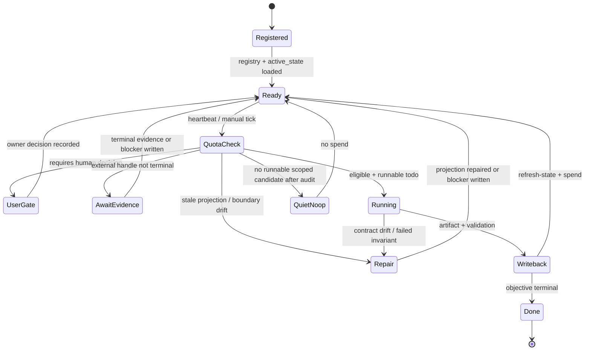
```mermaid
stateDiagram-v2
    [*] --> Registered
    Registered --> Ready: registry + active_state loaded
    Ready --> QuotaCheck: heartbeat / manual tick
    QuotaCheck --> UserGate: requires human decision
    QuotaCheck --> AwaitEvidence: external handle not terminal
    QuotaCheck --> Running: eligible + runnable todo
    QuotaCheck --> QuietNoop: no runnable scoped candidate after audit
    QuotaCheck --> Repair: stale projection / boundary drift
    Running --> Writeback: artifact + validation
    Running --> Repair: contract drift / failed invariant
    AwaitEvidence --> Ready: terminal evidence or blocker written
    UserGate --> Ready: owner decision recorded
    Writeback --> Ready: refresh-state + spend
    Writeback --> Done: objective terminal
    Repair --> Ready: projection repaired or blocker written
    QuietNoop --> Ready: no spend
    Done --> [*]
```

最小的可复用路由图随后展示 quota guard 如何把这些生命周期状态投影为当前 tick
的 `interaction_contract`：

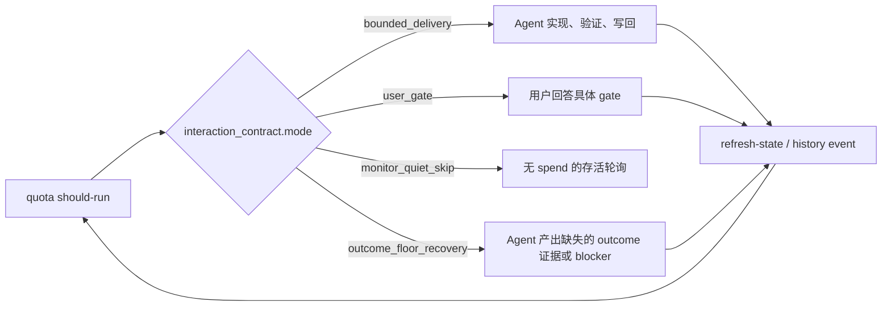
```mermaid
flowchart LR
  Q["quota should-run"] --> C{"interaction_contract.mode"}
  C -->|"bounded_delivery"| A["Agent 实现、验证、写回"]
  C -->|"user_gate"| U["用户回答具体 gate"]
  C -->|"monitor_quiet_skip"| M["无 spend 的存活轮询"]
  C -->|"outcome_floor_recovery"| R["Agent 产出缺失的 outcome 证据或 blocker"]
  A --> S["refresh-state / history event"]
  U --> S
  R --> S
  S --> Q
```

被阻塞优先级的 fallback 模式值得单独的公开演示，因为它抓住了产品品味：
不要在 gate 上空转，也不要在做 fallback 工作时藏起 gate。

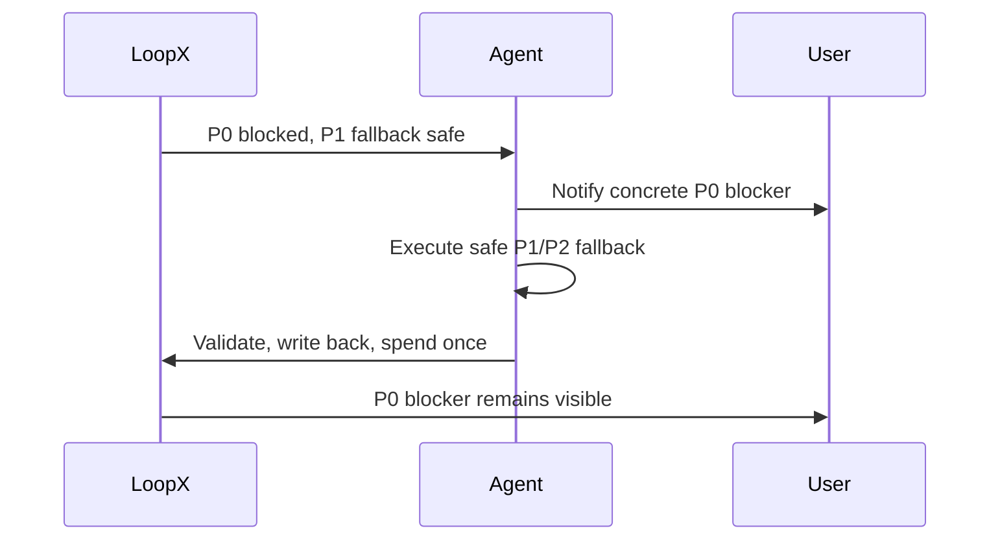
```mermaid
sequenceDiagram
  participant GH as LoopX
  participant Agent as Agent
  participant User as User
  GH->>Agent: P0 blocked, P1 fallback safe
  Agent->>User: Notify concrete P0 blocker
  Agent->>Agent: Execute safe P1/P2 fallback
  Agent->>GH: Validate, write back, spend once
  GH->>User: P0 blocker remains visible
```

未来的公开面可以包括：

- 嵌在 README/docs 里的静态 SVG 或 Mermaid 图；
- 前三个模式的假数据 dashboard 漫游；
- 一个简短的动画视频，展示"P0 gate + safe fallback"，不含私有 benchmark 产物；
- 一个可向潜在协作者讲解的公开演示脚本。

## 模式细节

模式细节沿用与目录相同的模式族顺序。每个模式族内，P0 模式在前，
随后是 P1 和 P2 模式。IP 编号是稳定身份，不是显示优先级。

### Work Routing

#### IP-001 Bounded Delivery

**触发**

- `quota should-run.should_run=true`；
- `interaction_contract.mode=bounded_delivery`；
- `interaction_contract.agent_channel.must_attempt=true`；
- 没有私有、凭据、生产、破坏性或未投影写作用域的 blocker 生效。

**预期行为**

控制面把硬资格边界与有界、非穷举的引导建议分开投影。Agent 选择一个合格的有界
片段，即使它不在显示的建议里，也通过当前 turn guard 绑定该选择、执行工作、
运行聚焦验证、写持久状态或历史，并在验证后的 delivery 后恰好 spend 一次。

**视觉模型**


```mermaid
flowchart LR
  Q["合格 quota"] --> A["选择有界片段"]
  A --> D["产出 artifact 或 blocker"]
  D --> V["聚焦验证"]
  V --> W["持久写回"]
  W --> S["spend 一次"]
```

**不良信号**

Agent 只读了一个文件就发状态更新，或没有验证过的 artifact 或 blocker 就 spend 配额。

**验证**

- `examples/control_plane/work-lane-contract-smoke.py`
- `examples/control_plane/heartbeat-quota-flow-smoke.py`
- `loopx check`

#### IP-002 Blocked Priority With Safe Fallback

**触发**

- 一个更高优先级的 agent todo 被阻塞；
- 一个较低优先级的 todo 可执行且安全；
- `blocked_priority_fallback.notify_user=true` 或等效的 quota/status 投影存在；
- 用户行动可能有用，但所选 fallback 不需要先得到用户回复。

**预期行为**

面向用户的消息必须保留被阻塞的高优先级条目，以及为什么使用 fallback 的原因。
Agent 可以继续安全 fallback，但绝不能默默让 fallback 成为主叙事。

示例形状：

```text
Core lane is blocked on <decision/resource>. I will continue <safe fallback>
now, and the pending user todo remains <concrete ask>.
```

**视觉模型**

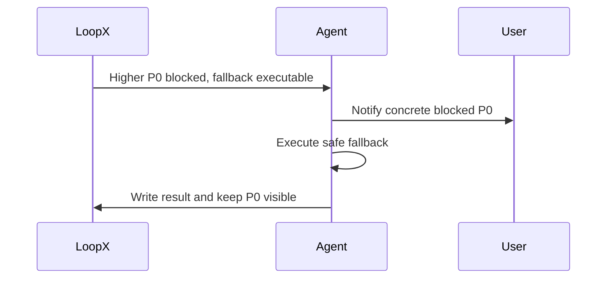
```mermaid
sequenceDiagram
  participant GH as LoopX
  participant Agent as Agent
  participant User as User
  GH->>Agent: Higher P0 blocked, fallback executable
  Agent->>User: Notify concrete blocked P0
  Agent->>Agent: Execute safe fallback
  Agent->>GH: Write result and keep P0 visible
```

**不良信号**

Agent 在还有其他安全工作时完全冻结在 gate 上，或默默处理低优先级条目，
而用户失去对 P0 blocker 的视野。

**验证**

- `examples/control_plane/todo-first-open-summary-smoke.py`
- `docs/heartbeat-automation-prompt.md`

#### IP-003 Scoped Gate With Safe Fallback

**触发**

- 一个开放 user todo 是真正的 gate，而不只是建议性上下文；
- gate 可以作用域化到一个选定的 Agent 动作、lane、资源或边界；
- 另一个可执行 agent todo 与那个 gate 相互独立；
- fallback 仍处于公共/私有、写作用域、资源和配额边界内。

**预期行为**

用户通道仍必须通知具体的 gate。Agent 通道不能执行被 gate 的动作，但在配额与
安全允许时，应继续独立的 fallback。这是双通道状态，不是矛盾：

```text
user_action_required=true
agent_action_required=true
agent_action=<independent fallback>
```

controller 应暴露一个持久字段，如 `scoped_user_gate_fallback`，其中包含：

- 被阻塞的用户 gate；
- 被 gate 的 agent 条目；
- 所选的 fallback；
- 允许只在验证后的 fallback 写回后 spend 的 spend 策略。

最佳长期实现是显式作用域元数据：`user_todo.decision_scope` 和
`agent_todo.required_decision_scopes`。运行时文本或 `action_kind` 推断只是
旧目标状态的兼容桥。

当一个用户 gate 携带 `blocks_agent=<agent-id>` 时，该元数据已经是硬作用域边界。
目标 Agent 仍必须停下并表露具体的用户决策。其他 Agent 应把 gate 保留为诊断可见，
但如有独立的可执行 todo，就不应把它算进自己的 `open_count`、`gate_open_items`
或 `user_channel.action_required`。对于那些 Agent，一个只由其他 Agent 的 gate 派生的
`operator_gate` 状态应成为 Agent 作用域的合格 lane，而不是全局 owner gate。

**视觉模型**

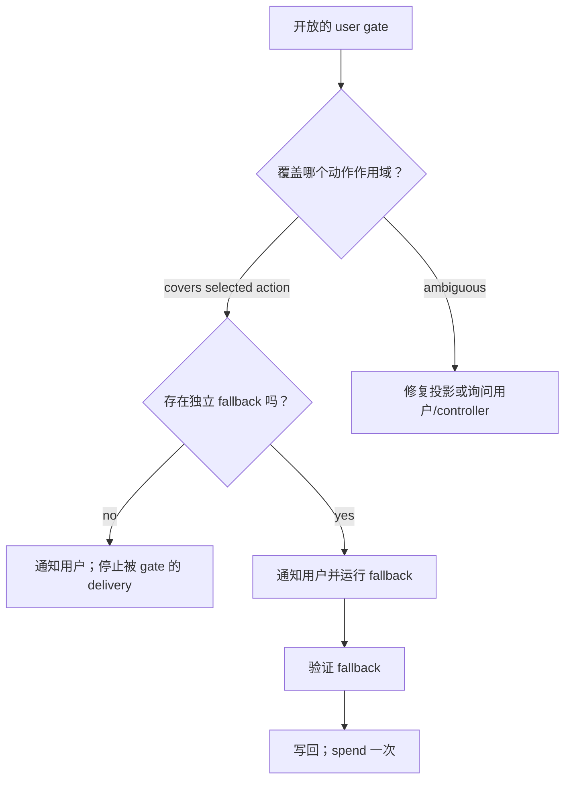
```mermaid
flowchart TD
  G["开放的 user gate"] --> S{"覆盖哪个动作作用域？"}
  S -->|"covers selected action"| F{"存在独立 fallback 吗？"}
  S -->|"ambiguous"| R["修复投影或询问用户/controller"]
  F -->|"no"| U["通知用户；停止被 gate 的 delivery"]
  F -->|"yes"| D["通知用户并运行 fallback"]
  D --> V["验证 fallback"]
  V --> W["写回；spend 一次"]
```

**不良信号**

payload 说 `must_attempt_work=true` 和 `do_not_cancel_on_block=true`，
但 `interaction_contract.agent_channel.delivery_allowed=false` 只是因为
`requires_user_action=true`。于是 Agent 永远重复 gate，尽管另一个安全 todo 可用。

相反的不良信号同样危险：Agent 默默继续工作，不点明被阻塞的用户决策，
于是 fallback 成为主叙事，人类失去关键 gate。

第三个不良信号是 Agent 作用域用户 gate 越界。一个用户 todo 说它阻塞一个已注册
peer，但 quota 对每个 `--agent-id` 调用都把它当成全局 operator gate。
非目标 Agent 于是停下，尽管它有自己的可运行 todo。这不是 IP-026 作用域耗尽；
这是 IP-003 作用域元数据被 user-todo 阻塞摘要忽略。

**验证**

- `regression/scoped-user-gate-fallback-contract.py`
- `examples/protocol/protocol-action-packet-smoke.py`
- `examples/control_plane/work-lane-contract-smoke.py`
- `examples/control_plane/quota-agent-scoped-user-gate-smoke.py` 用于 `blocks_agent`
  作用域的用户 gate：只阻塞目标 Agent，同时保留其他 Agent 的 delivery。
- `docs/archive/incidents/agent-scoped-user-gate-overreach-incident-20260624.md`

#### IP-021 Per-Todo Capability Gate

**触发**

- 可见的可执行 agent todos 声明 `required_capabilities`，例如 `shell`、
  `filesystem_write`、`benchmark_runner`、`external_evidence_poll`、`network`
  或 `credentials`；
- `quota should-run` 有配额可花，但当前 launcher 可能不具备最高优先级 todo
  所需的全部能力；
- 可能有多个可执行 todo 可见，包括多个 P0 或多个 P1 候选。

**预期行为**

能力是逐 todo 的执行预检，不是全局 Agent profile，也不是权限授予。
`status` 应投影每个 todo 的 `required_capabilities`；`quota should-run` 应在
可见可执行队列上派生一个只读的 `capability_gate`。
不要仅仅因为某个 todo 是为了开发、修复或 parity 检查该能力，就把它声明为
required。对那个输出侧用 `target_capabilities`。例如，一个产品路径 parity todo
可以声明 `required_capabilities=shell` 和 `target_capabilities=benchmark_runner`：
即使目标 bridge 能力缺失，gate 也可以把它投影为可运行的修复工作。

controller 按投影顺序扫描可执行候选并分类它们，但不下最终的 todo 决定。
如果第一个 P0 需要 `benchmark_runner`，而第二个 P0 只需要 shell/filesystem 能力，
那么可运行的 P0 与任何后面的可运行 fallback 都会被投影在
`capability_gate.runnable_candidates` 里；被阻塞的高优先级条目仍保留在
`capability_gate.blocked_candidates` 中可见。`recommended_action` 保持为
路由上下文，不是选定的可运行 todo。
如果第一个 P0 不是要运行 benchmark，而是要修复或物化 benchmark bridge，
那么它应出现在 `runnable_candidates` 中，带 `target_capabilities`、
`capability_repair_mode=true` 和 `capability_action=repair_bridge`，
而不是藏在一个价值更低的 fallback 后面。

当 `capability_gate.action=run` 时，决策契约是：

- `decision_owner=agent`；
- `selection_policy=agent_steering_audit_over_runnable_candidates`；
- `runnable_candidates` 是本 turn 的允许候选集；
- 对当前 peer，通过 `blocks_agent` 加 `unblocks_todo_id` 解除其他 peer 阻塞的
  同优先级候选排序在普通积压之前，因此候选列表和 `agent_lane_next_action`
  暴露相同的 handoff 优先级；
- `capability_repair_mode=true` 的候选是允许的修复/开发工作，对象是缺失的
  `target_capabilities` bridge，而不是直接通过那个缺失 bridge 执行；
- `blocked_candidates` 是当前无法运行的高或同优先级工作的可见集；
- Agent 必须从 `runnable_candidates` 中选择实际 todo，然后验证并写回所选工作。

如果没有可见的可执行 todo 可以运行，gate 选择：

- 对本地 bridge 缺口（如 `benchmark_runner`、`external_evidence_poll`、
  `worker_bridge` 或 `cli_bridge`），以及观察到的运行时供给缺口（如 `network`），
  使用 `repair_bridge`；
- 对 owner 持有的能力（如 `credentials` 或 `production_access`）使用 `ask_owner`；
- 当缺失能力不受支持且没有已知的安全修复或 owner 行动时，用 `skip`。

对混合缺失集，gate 分别投影 `owner_missing`、`repair_missing` 和
`resolution_steps`。未解决的 owner 持有能力在交互决策上优先，
因此本地 bridge 修复不能掩盖具体的用户行动。运行时能力缺口不进入
`owner_missing`：Agent 观察或修复 launcher bridge，然后如实声明能力可用。
一旦 owner 持有的能力被提供且其具体 gate 被解决，其余 bridge 修复返回
Agent lane。

当非依赖 fallback 可运行时，同样的解决信息必须存续。
`resolution_bindings` 把每个缺失能力与其 owner 和确切的 `blocked_todo_ids` 分组。
交互 CLI 通道投影幂等的 todo 写：owner 持有的缺口变成与 `unblocks_todo_id`
链接的范围化 `user_gate` todos；可修复缺口变成 agent 推进 todos，其
`target_capabilities` 指明正在物化的 bridge。用户通道在 owner 持有缺口时被通知，
而 Agent 通道继续一个不相关的可运行 todo。不支持缺口保持显式，但不会编造用户工作。

这些 todos 记录责任与谱系，而不是能力真相。launcher 必须验证真实 callsite，
并为当前预检与 spend 再次声明 `--available-capability`；完成 todo 本身绝不授予能力。

真正有额外能力的 launcher 应把它同时传给 `quota should-run` 和
`quota spend-slot` 的 `--available-capability`，使预检与记账阶段一致。

**视觉模型**

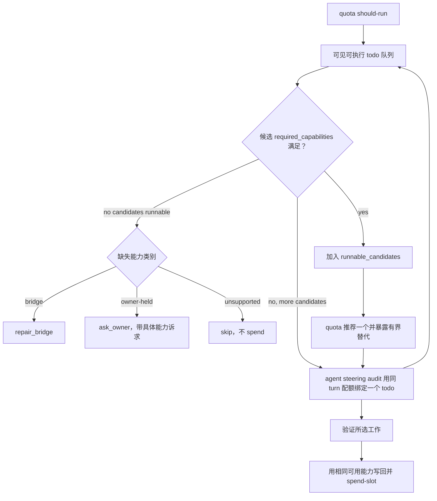
```mermaid
flowchart TD
  Q["quota should-run"] --> E["可见可执行 todo 队列"]
  E --> C{"候选 required_capabilities 满足？"}
  C -->|"yes"| R["加入 runnable_candidates"]
  C -->|"no, more candidates"| B["加入 blocked_candidates"]
  B --> E
  C -->|"no candidates runnable"| M{"缺失能力类别"}
  M -->|"bridge"| P["repair_bridge"]
  M -->|"owner-held"| U["ask_owner，带具体能力诉求"]
  M -->|"unsupported"| S["skip，不 spend"]
  R --> A["quota 推荐一个并暴露有界替代"]
  A --> B["agent steering audit 用同 turn 配额绑定一个 todo"]
  B --> V["验证所选工作"]
  V --> W["用相同可用能力写回并 spend-slot"]
```

**不良信号**

系统把配额资格当作最近 todo 可运行的证明，然后在缺失 benchmark/network/工具链
能力上反复失败。相反的不良信号是过度阻塞：一个 P0 需要缺失的 runner，
但另一个 P0 或 P1 可运行且安全；controller 冻结，而不是投影可运行集让 Agent 选。

**验证**

- `docs/project-agent-todo-contract.md`
- `docs/quota-allocation.md`
- `examples/capability-gate-smoke.py`
- `examples/control_plane/todo-cli-smoke.py`

#### IP-007 Outcome Floor Recovery

**触发**

- 反复的 surface-only 工作已越过 outcome floor；
- `safe_bypass_kind=outcome_floor_recovery` 或
  `heartbeat_recommendation.recommended_mode=outcome_floor_recovery`；
- quota 暴露一个具体的 `must_advance` 目标。

**预期行为**

Agent 只能做有界恢复：产出 `must_advance` 指名的缺失证据，或写出解释为何无法
产出该证据的 blocker。普通的 docs/status 传播应等待。

**视觉模型**

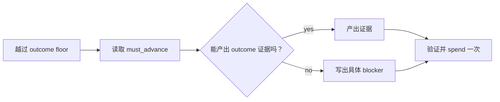
```mermaid
flowchart LR
  F["越过 outcome floor"] --> T["读取 must_advance"]
  T --> E{"能产出 outcome 证据吗？"}
  E -->|"yes"| P["产出证据"]
  E -->|"no"| B["写出具体 blocker"]
  P --> V["验证并 spend 一次"]
  B --> V
```

**不良信号**

系统持续改进 wrapper、摘要或队列，却从不产出判断目标是否有效的证据。

**验证**

- `docs/archive/incidents/outcome-floor-safe-bypass-incident-20260606.md`
- `examples/control_plane/quota-plan-smoke.py`
- `examples/upgrade-plan-smoke.py`

#### IP-008 Monitor Quiet Skip

**触发**

- `should_run=false`；
- `effective_action=monitor_quiet_skip`；
- 没有激活的用户 gate、用户 todo blocker、外部 handle 观察或自修复义务。

**预期行为**

heartbeat 把稳定 turn id 传给 `quota should-run`。guard 提交一个幂等收据，
幂等追加无 spend 的停滞观察，并返回后续决策。自动化保持存活；monitor-only 的
quiet skip 不是完成或删除信号。观察记录 `quota_monitor_target_v0`，
使下一个 guard 能区分无害的未变化 watch 与同一目标重复。

Status 和 diagnose 应把未变化的 monitor-only 工作显示为 `waiting_on=monitor_signal`，
`severity=watch`，同时保留 quota 决策 `effective_action=monitor_quiet_skip`。
这使 monitor 保持可见，而不显得像立即要跑的 Codex 工作或用户/controller 关卡。
同一具体 Todo 或目标连续六次未变化的 due/external 执行应投影出一个
`dead_monitor_repeat` 自主 replan 义务；Agent 必须在另一次真实执行前写出
watch-lane 过期、具体 blocker、todo supersede 或可运行 successor todo。
为未来 monitor 的 turn 范围 heartbeat 存活收据不算执行。

**视觉模型**

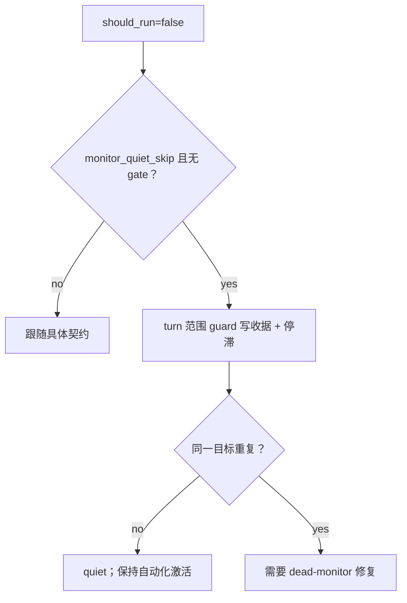
```mermaid
flowchart TD
  N["should_run=false"] --> M{"monitor_quiet_skip 且无 gate？"}
  M -->|"no"| C["跟随具体契约"]
  M -->|"yes"| P["turn 范围 guard 写收据 + 停滞"]
  P --> D{"同一目标重复？"}
  D -->|"no"| Q["quiet；保持自动化激活"]
  D -->|"yes"| A["需要 dead-monitor 修复"]
```

**不良信号**

heartbeat 因为没变化而自己停止，或把配额花在无意义的重复 status 上。
另一个失败模式是把 monitor-only 工作呈现为立即的 Codex 行动；Agent 于是
一直在 watch lane 尝试 delivery，而不是 stay quiet 或写具体 blocker。

**Public-safe 坏用例**

2026-06-21 的 monitor-only replan 停滞是这个模式的 canonical public-safe 坏用例。
它的可复用形态不绑定任何私有项目：

```text
effective_action=monitor_quiet_skip
user_channel.action_required=false
user_todo_summary.open_count=0
agent todo lane contains only monitor-style work
recent history repeats monitor-poll / replan-adjacent rows
no runnable todo, blocker, successor, supersede, or watch-lane expiry changed
```

目录与 dashboard 文案应把它命名为 watch 状态。watch lane 可以保持可见，
可以追加一次无 spend 存活轮询，但不能渲染为立即的 Codex delivery
或用户/controller 批准 gate。如果同一 watch 目标越过过期阈值重复，
IP-024 拥有 repair delta：写 blocker、successor、supersede 或显式 watch-lane
延续，而不是再花一个 delivery turn 在散文上。

**验证**

- `examples/control_plane/heartbeat-quota-flow-smoke.py`
- `examples/control_plane/quota-plan-smoke.py`
- `docs/heartbeat-automation-prompt.md`
- `docs/archive/incidents/monitor-only-replan-stall-incident-20260621.md`

### Human Decision

#### IP-004 Concrete User Todo Projection

**触发**

- `interaction_contract.user_channel.action_required=true`；或
- `user_todo_summary.open_count > 0`。

**预期行为**

heartbeat、status、dashboard 或 review packet 必须点名具体的用户 todo/问题。
它不能只说 "owner gate" 或 "waiting on user"。如果 payload 说需要用户行动，
但没有投影具体 todo/问题，正确的消息是状态投影 bug：

```text
specific user todo is not projected; repair LoopX state projection
```

当 `action_required=false` 且 `user_todo_summary.open_count=0` 时，系统可以说
没有用户 todo，且不应暗示投影故障。

**视觉模型**

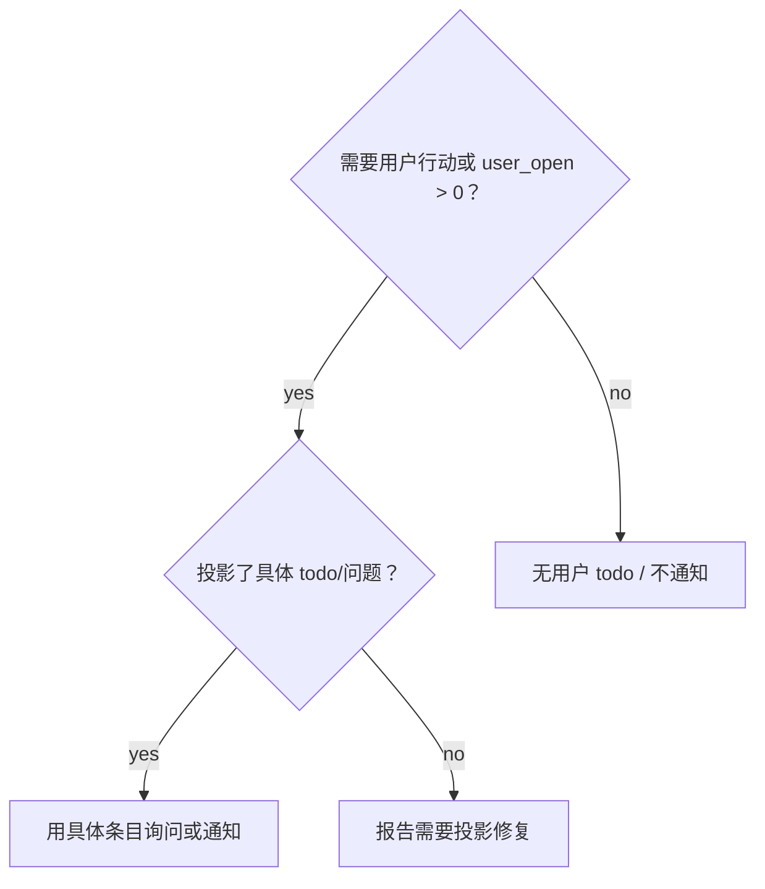
```mermaid
flowchart TD
  U{"需要用户行动或 user_open > 0？"}
  U -->|"yes"| C{"投影了具体 todo/问题？"}
  C -->|"yes"| A["用具体条目询问或通知"]
  C -->|"no"| R["报告需要投影修复"]
  U -->|"no"| N["无用户 todo / 不通知"]
```

**不良信号**

用户反复看到含糊的 gate 消息，却无法说出需要什么决策。

**验证**

- `docs/heartbeat-automation-prompt.md`
- `examples/control_plane/quota-plan-smoke.py`
- `examples/control_plane/heartbeat-quota-flow-smoke.py`

#### IP-027 Deferred Gate Resume

**触发**

- 一个 todo 有 `status=deferred`，且带有机器可读的恢复条件，如
  `resume_when=todo_done:<todo_id>` 或解除阻塞链接，如 `unblocks_todo_id`；
- status 能把条件求值成 `resume_condition` 和 `resume_ready`；
- 延迟条目属于当前 Agent 已声明或未声明，且作用域 Agent 处于唤醒状态；并且
- 没有普通开放的当前 Agent 或未声明推进 todo 应优先于恢复 handoff。

**预期行为**

延迟 todos 表示停在恢复 gate 后面的闲置工作。gate 可能是用户 todo、普通 peer
评审 handoff、前置实现 todo、资源决策或另一个有界控制面条件。这让它成为
Human Decision / gate-resume 模式，而不是 no-todo 模式。

Status 和 quota 应在排序后的开放 todo lane 之后保持延迟工作可见：

- `deferred_items`：延迟 todos 的有界可见性；
- `deferred_resume_candidates`：就绪延迟 todos 的有界可见性；
- `current_agent_deferred_resume_candidates`、`unclaimed_deferred_resume_candidates`
  和 `other_agent_deferred_resume_candidates`，用于 Agent 作用域 payload。

就绪的延迟工作不是无候选状态。如果一个当前 Agent 或未声明的延迟条目就绪，
且没有开放的当前 Agent/未声明推进 todo 优先于它，quota 应返回现有的
`successor_replan_required` / `deferred_resume_projection` 契约：

```text
effective_action=successor_replan_required
normal_delivery_allowed=false
execution_obligation.contract=deferred_resume_projection
interaction_contract.agent_channel.must_attempt=true
interaction_contract.agent_channel.quiet_noop_allowed=false
```

有界动作是生命周期修复：重新打开延迟 todo，用当前 successor 替代它，
或记录一个 public-safe 的无后续理由。只有在该写回之后，普通 delivery 才能恢复。
如果恢复条件仍由用户持有或含糊，IP-004 / IP-003 拥有面向用户的诉求。
如果没有就绪的延迟条目，IP-026 可以把作用域边界分类为 `scope_exhausted`、
`agent_scope_wait` 或 `reassignment_required`。

一个无关的 `user_action` 在这种状态下只是双通道通知。它可以设置
`user_channel.notify=NOTIFY` 和 `user_channel.non_blocking=true`，
但 Agent 通道必须保持 `must_attempt=true`、`delivery_allowed=false` 和
`quiet_noop_allowed=false`；生命周期 CLI 动作和活跃 scheduler cadence 保持权威。
空开放积压检测必须把这一选定的控制面义务算作 Agent 工作，而不是把通知提升为
`notify,wait`。

**视觉模型**

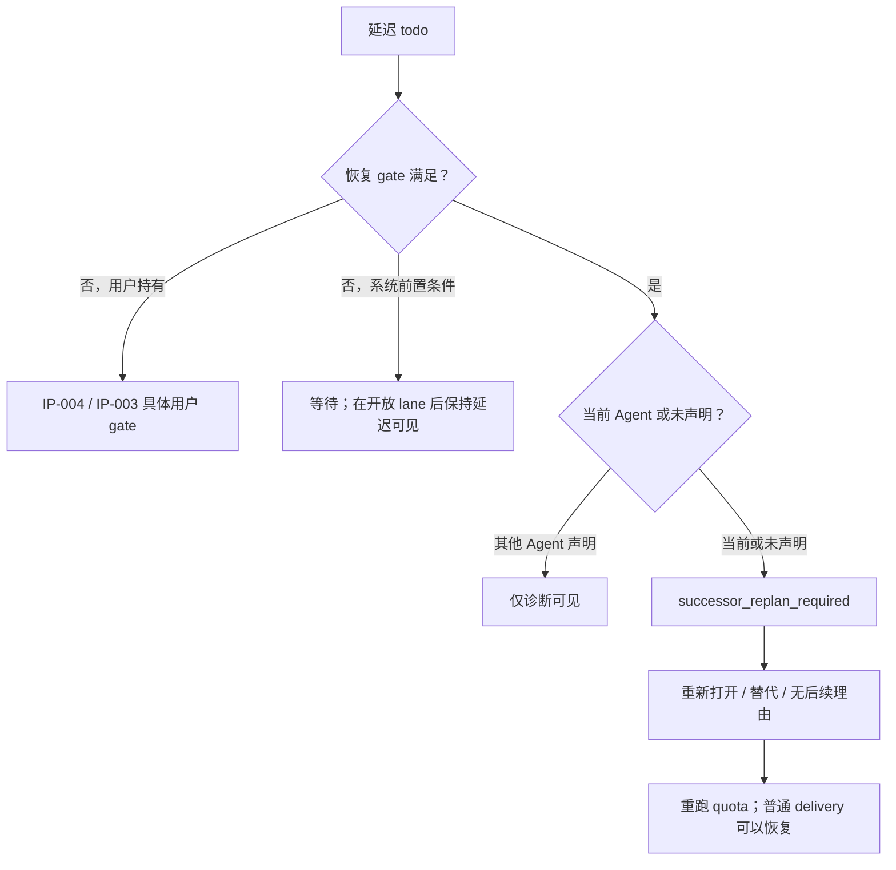
```mermaid
flowchart TD
  D["延迟 todo"] --> G{"恢复 gate 满足？"}
  G -->|"否，用户持有"| U["IP-004 / IP-003 具体用户 gate"]
  G -->|"否，系统前置条件"| W["等待；在开放 lane 后保持延迟可见"]
  G -->|"是"| C{"当前 Agent 或未声明？"}
  C -->|"其他 Agent 声明"| O["仅诊断可见"]
  C -->|"当前或未声明"| R["successor_replan_required"]
  R --> L["重新打开 / 替代 / 无后续理由"]
  L --> Q["重跑 quota；普通 delivery 可以恢复"]
```

**不良信号**

就绪的延迟 successor 只在 Agent 作用域的无候选 payload 里渲染。当前 peer
报告"没有可运行的"，尽管系统知道先前的 gate 现已满足。相反的失败也不好：
在生命周期步骤之前把延迟条目混进普通开放积压，使过期或未来工作凌驾于
活跃的开放任务。

**验证**

- `examples/control_plane/work-lane-contract-smoke.py` 覆盖就绪延迟 successor
  返回 `successor_replan_required` 而不是 quiet no-op。
- `examples/control_plane/quota-resume-gated-open-todo-smoke.py` 覆盖在无关
  非阻塞用户行动保持可见时的相同必需 successor replan。
- `examples/control_plane/todo-durability-fixture-smoke.py` 覆盖解析
  `resume_when=todo_done:<todo_id>` 并在开放条目后投影就绪延迟候选。
- `docs/project-agent-todo-contract.md`
- `docs/quota-allocation.md`
- `docs/status-data-contract.md`
- `skills/loopx-self-repair/references/repair-patterns.md` 记录
  `deferred_gate_resume_misclassified` 供事故分类。

#### IP-029 Handoff Todo Gate State

**触发**

- 一个 todo 携带 `blocks_agent=<agent-id>`，并代表该 Agent 的评审、handoff、
  解除阻塞或 owner 工作；
- todo 状态在 open/blocked、done、deferred 或 superseded 之间变化；
- todo 可以通过 `unblocks_todo_id`、`resume_when=todo_done:<todo_id>` 或
  `superseded_by` 指名后续；并且
- `quota should-run --agent-id <agent-id>` 需要决定该 Agent 应等待、replan
  还是运行具体 successor。

**预期行为**

`blocks_agent` todos 不只是积压行。它们是 Agent 间的 gate 状态。
Status 应使用 `todo_handoff_gate_v0`，从完整 todo 列表而不只是开放 lane，
投影 `agent_todos.handoff_gates[]`。

| gate_state | Todo 条件 | Quota 效果 |
| --- | --- | --- |
| `blocking` | 作用域 Agent 的非终态 handoff todo | 返回 `agent_scope_wait`；点名负责的 reviewer/agent，而不是唤醒被阻塞 Agent 做 delivery |
| `cleared_without_successor` | 已完成的 handoff 没有稳定 successor 或 supersede 链接 | 返回 `successor_replan_required`；重新打开、替代或记录无后续理由 |
| `cleared_with_successor` | 已完成的 handoff 通过 `unblocks_todo_id`、`resume_when` 或 `superseded_by` 链接到 successor | 通过普通 todo 选择路由到具体 successor |
| `cleared_no_followup` | 已完成的 handoff 携带 `no_followup=true` 加紧凑理由 | 保持终态历史；不唤醒被阻塞 Agent 做 successor replan |
| `superseded` | handoff todo 携带 `superseded_by` | 保持历史；不因过期 gate 唤醒被阻塞 Agent |
| `deferred` | handoff todo 停在未满足的恢复条件后面 | 保持诊断可见；IP-027 拥有就绪延迟恢复路径 |

Quota 排序很重要。当前 Agent 普通推进仍赢得普通 delivery。如果没有就绪的
普通当前 Agent successor，当前 Agent 的 `blocking` handoff 胜过过期的 done
handoff。`cleared_without_successor` handoff 胜过通用的 IP-026 无候选等待，
因为它表示 handoff 状态变了但不存在可重放的 successor。
只有这些检查之后，IP-026 才可分类 `scope_exhausted` 或 `agent_scope_wait`。

**视觉模型**

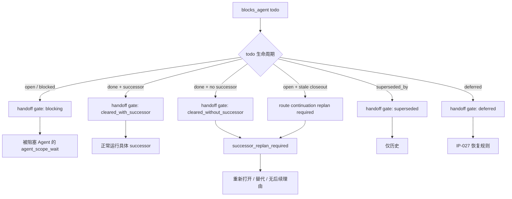
```mermaid
flowchart TD
  T["blocks_agent todo"] --> S{"todo 生命周期"}
  S -->|"open / blocked"| B["handoff gate: blocking"]
  B --> W["被阻塞 Agent 的 agent_scope_wait"]
  S -->|"done + successor"| C["handoff gate: cleared_with_successor"]
  C --> N["正常运行具体 successor"]
  S -->|"done + no successor"| R["handoff gate: cleared_without_successor"]
  R --> L["successor_replan_required"]
  L --> F["重新打开 / 替代 / 无后续理由"]
  S -->|"open + stale closeout"| X["route continuation replan required"]
  X --> L
  S -->|"superseded_by"| H["handoff gate: superseded"]
  H --> I["仅历史"]
  S -->|"deferred"| D["handoff gate: deferred"]
  D --> P["IP-027 恢复规则"]
```

**不良信号**

完成的评审/handoff todo 消失，因为只有开放 lane 喂入 quota，于是被阻塞 Agent
落入含糊的 `agent_scope_wait`。相反的不良信号同样有害：过期的 done handoff
凌驾于活跃的开放评审 blocker，于是 Agent 在真实 reviewer 持有的 gate 仍开放时
replan。两者都是状态机 bug，不是提示措辞 bug。

第三个不良信号是开放的 handoff gate，其动作本身已是过期的 handoff 收尾。
该 gate 不再是活跃的 reviewer 决策。它应投影 `route_continuation_replan_required`，
使 quota 唤醒 successor replan 来重新打开、替代或用无后续理由关闭过期路线。

**验证**

- `loopx/control_plane/todos/handoff_gate.py` 拥有 `todo_handoff_gate_v0` 投影。
- `examples/control_plane/quota-cleared-blocker-successor-gate-smoke.py` 覆盖
  `blocking`、`cleared_without_successor`、`cleared_with_successor` 和
  `superseded` gate 状态。
- `docs/quota-allocation.md`
- `docs/status-data-contract.md`
- `skills/loopx-self-repair/references/repair-patterns.md` 记录
  `handoff_gate_state_projection_gap` 供事故分类。

#### IP-014 Decision Write Preview And Append

**触发**

- operator 正在记录一个 run 绑定的 `human_reward`；或
- operator/controller 正在记录一个 `operator_gate` 决策；
- dashboard 或 loopback server 想要写出一个决策事件，而不只是渲染 status。

**预期行为**

决策写必须确切目标、紧凑、浏览器来源时预览，且只追加。
`human_reward` 附着到一个选定的 run 行。`operator_gate` 记录一个决策 run，
而对批准来说，还记录一个恢复契约，强制接收 Agent 在执行前重新读取
当前 registry、active state、quota、repo 状态、策略和 run 状态。

浏览器奖励追加需要显式本地能力、loopback 来源、匹配的 `preview_id`、
未变化的选定 run、未变化的 payload、未变化的原始 index 计数、public-safe 文本，
以及恰好一次 overlay 追加。Dashboard gate 追加保持禁用，直到存在单独的等效握手。

**视觉模型**

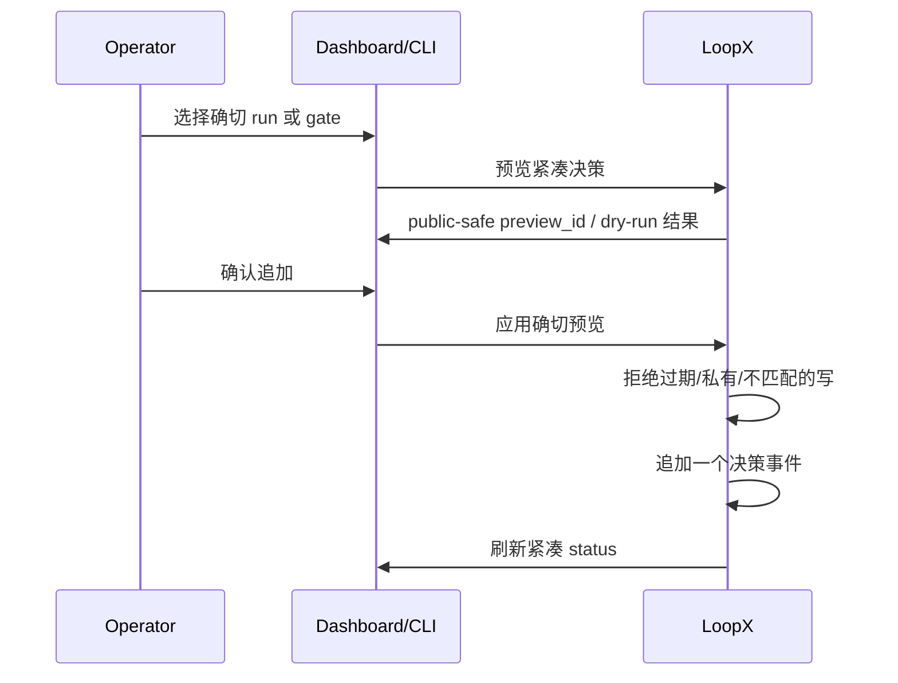
```mermaid
sequenceDiagram
  participant User as Operator
  participant UI as Dashboard/CLI
  participant GH as LoopX
  User->>UI: 选择确切 run 或 gate
  UI->>GH: 预览紧凑决策
  GH->>UI: public-safe preview_id / dry-run 结果
  User->>UI: 确认追加
  UI->>GH: 应用确切预览
  GH->>GH: 拒绝过期/私有/不匹配的写
  GH->>GH: 追加一个决策事件
  GH->>UI: 刷新紧凑 status
```

**不良信号**

dashboard 把本地奖励/gate 写做得像普通表单提交，或一个已批准的 gate
在没有新鲜决策点重读的情况下被当作持久写权威。

**验证**

- `docs/reference/contracts/reward-gate-direct-write-contract.md`
- `docs/reference/contracts/dashboard-reward-write-boundary.md`
- `examples/reward-gate-direct-write-contract-smoke.py`
- `examples/reward-append-api-smoke.py`
- `examples/dashboard-reward-append-browser-smoke.mjs`
- `examples/project/operator-gate-resume-contract-smoke.py`

#### IP-017 User Reward Lesson Promotion

**触发**

- 用户显式纠正产品路线、优先级、benchmark 协议、安全边界或运维规则；
- 纠正取代一个当前 todo、`recommended_action`、路线假设或 benchmark adapter 计划；
- 如果纠正只留在聊天里，未来 Agent 很可能重复旧假设。

**预期行为**

Agent 必须暂停普通 delivery 选择，并在继续前把纠正提升为持久状态。
最小的持久提升是以下之一：

- 更新活跃 `Next Action` 和相关开放的 `Agent Todo`；
- 追加或准备一个 run 绑定的 `human_reward` / 运维教训事件；
- 为产品/运行时变更添加具体 successor todo；
- 如果情形可复用，更新本目录或自修复模式表。

纠正应记录：

- 被纠正的规则；
- 作用域，如 goal、项目、benchmark 族、路线或 adapter；
- 被取代的假设；
- 下一步实现步骤的 owner；
- 未来 `quota should-run` 或 posthoc parity 检查能看到该规则的验证。

这与隐藏的模型记忆不同。模型可能记得对话，但 LoopX 必须暴露一个可重放钩子
给未来 Agent。

**视觉模型**

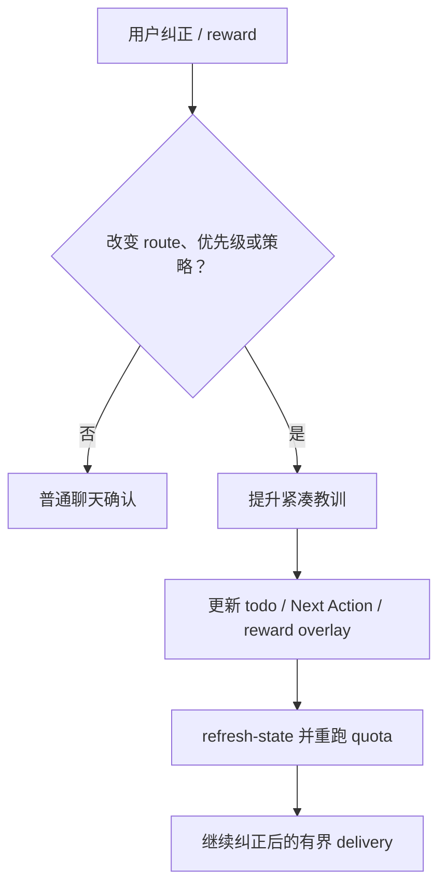
```mermaid
flowchart TD
  U["用户纠正 / reward"] --> S{"改变 route、优先级或策略？"}
  S -->|"否"| C["普通聊天确认"]
  S -->|"是"| P["提升紧凑教训"]
  P --> T["更新 todo / Next Action / reward overlay"]
  T --> Q["refresh-state 并重跑 quota"]
  Q --> A["继续纠正后的有界 delivery"]
```

**不良信号**

用户说"三个 benchmark 应在远程开发机上跑，但 Codex 留在本地，远程主机只是执行环境"；
随后的 Agent turn 把缺失远程 Codex/Codex-ACP 当作主要 blocker，或继续跟随
过期的纯本地 benchmark staging todo。

**验证**

- `skills/loopx-self-repair/references/repair-patterns.md`
- `docs/state-interaction-model.md`
- 未来的 `user_reward_lesson_projection_gap` status/quota smoke，检查显式运维教训
  被投影进 `recommended_action`、活跃 `Agent Todo` 或状态投影修复警告。

#### IP-009 Active User Assistance

**触发**

- 实验或产品 lane 显式启用活跃用户协助；
- 存在干预预算/频率策略；
- 隐藏测试、reward/pass/fail、预期解和凭据对 worker 保持隐藏。

**预期行为**

assistant 或用户 simulator 可以通过经审计的通道提供有界帮助。结果必须是标记为
assisted，且不得并入官方自主得分声明。

**视觉模型**

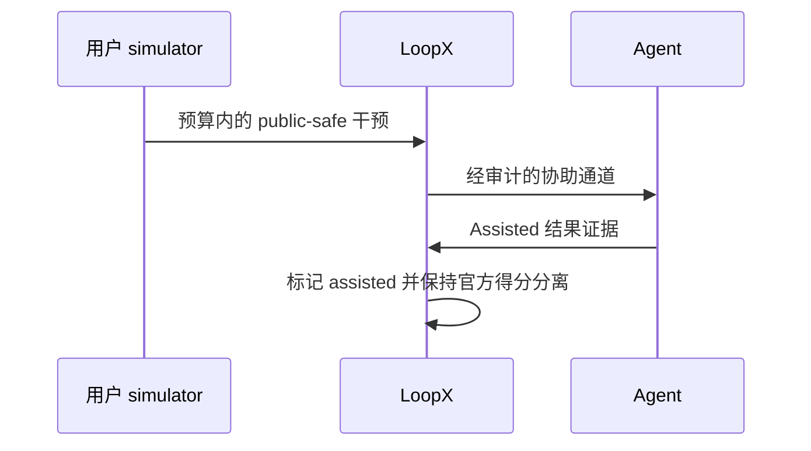
```mermaid
sequenceDiagram
  participant Sim as 用户 simulator
  participant GH as LoopX
  participant Agent as Agent
  Sim->>GH: 预算内的 public-safe 干预
  GH->>Agent: 经审计的协助通道
  Agent->>GH: Assisted 结果证据
  GH->>GH: 标记 assisted 并保持官方得分分离
```

**不良信号**

系统把一个 run 称为 "LoopX uplift"，而处理组其实看到了 reward 信号、
oracle 信息或无界的人类提示。

**验证**

- `examples/worker-bridge-active-user-after-start-observation-smoke.py`
- `examples/worker-bridge-install-contract-smoke.py`
- benchmark active-user 协议文档。

### State And Boundary

#### IP-005 State Projection Gap

**触发**

- quota 说工作合格或 `must_attempt=true`；
- `agent_todo_summary.open_count=0` 且 `user_todo_summary.open_count=0`；
- `Next Action`、handoff 散文或最近的 run history 仍包含可操作的工作。
- 兼容性 lint 在 `Next Action` 中看到显式用户等待散文，但不存在结构化
  `User Todo` 或 `interaction_contract.user_channel` gate。

**预期行为**

下一步应是 replan / todo 扩展 / blocker 写回，而不是普通 delivery。
在 controller 假装没有工作之前，必须先修复机器投影。

当结构化字段存在时，它们比 Markdown lint 更权威。如果
`interaction_contract.user_channel.action_required=false`、
`user_todo_summary.open_count=0`，且存在可执行 agent todo，
controller 应继续有界 Agent 工作，而不是要求 Agent 报告"具体 user todo 未投影"。
反之，如果存在真实的 owner/user gate，它必须表示为具体用户 todo 或范围化决策，
而不是只用 `Next Action` 里的散文。

**视觉模型**

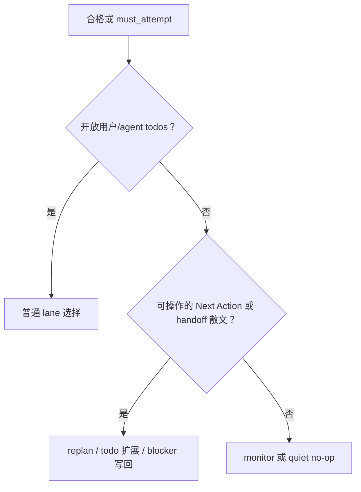
```mermaid
flowchart TD
  E["合格或 must_attempt"] --> O{"开放用户/agent todos？"}
  O -->|"是"| D["普通 lane 选择"]
  O -->|"否"| P{"可操作的 Next Action 或 handoff 散文？"}
  P -->|"是"| R["replan / todo 扩展 / blocker 写回"]
  P -->|"否"| M["monitor 或 quiet no-op"]
```

**不良信号**

人类能在散文里看到下一个行动，但机器投影看不到开放 todo，自动化漂进
monitor-only no-op。

**验证**

- `examples/state-projection-gap-smoke.py`
- `examples/project/onboarding-no-scan-projection-smoke.py`
- `docs/project-agent-todo-contract.md`

#### IP-006 Checkpointed Scope Mismatch

**触发**

- 所选 todo 或 `recommended_action` 需要写一个作用域；
- `goal_boundary.write_scope` 不包含该作用域；
- 可能存在历史 owner 决策，但它没有被投影进当前边界契约。

**预期行为**

LoopX 应返回边界投影修复或具体的用户/controller gate。Agent 不应执行该写，
也不应在真实 blocker 是缺失作用域投影时把 turn 花在纯仓库 handoff 上。

只有结构化的 checkpoint 权威能扩展运行时边界。以散文写的历史批准还不够。
registry 可以携带 `coordination.checkpointed_boundary_authority[]` 条目，包含：

- `schema_version=checkpointed_boundary_authority_v0`；
- `write_scope`；
- `source` 或等效的 public-safe 出处；
- `recorded_at`；
- 可选 `expires_at`；
- `decision=approve` 且状态活跃。

新鲜的已批准条目被编译进 `goal_boundary.write_scope`，并在
`goal_boundary.checkpointed_boundary_authority` 下暴露。过期、拒绝、
缺出处或缺时间戳的条目只保持诊断可见；它们不授权写。

**视觉模型**

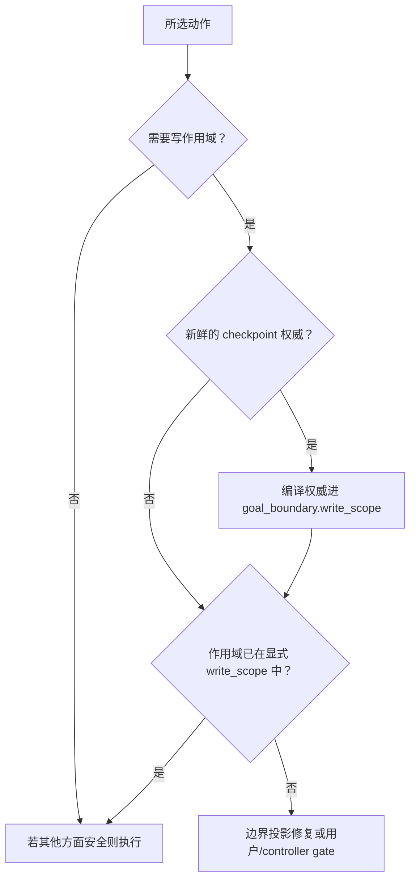
```mermaid
flowchart TD
  A["所选动作"] --> S{"需要写作用域？"}
  S -->|"否"| E["若其他方面安全则执行"]
  S -->|"是"| C{"新鲜的 checkpoint 权威？"}
  C -->|"是"| P["编译权威进 goal_boundary.write_scope"]
  C -->|"否"| B{"作用域已在显式 write_scope 中？"}
  P --> B
  B -->|"是"| E
  B -->|"否"| R["边界投影修复或用户/controller gate"]
```

**不良信号**

控制面记得用户曾批准某条路径，但当前 quota 边界阻塞它，于是 Agent
在小 handoff 上循环，而不是修复 checkpoint 决策。

**验证**

- `examples/control_plane/quota-action-scope-guard-smoke.py`；
- `examples/project/configure-goal-smoke.py`；
- `docs/state-interaction-model.md` checkpointed 决策章节。

#### IP-011 Authority Material Intake

**触发**

- worker 发现或收到持久设计文档、研究备忘、owner packet、迁移报告、benchmark 论文、
  外部注册表，或其他未来 Agent 可能需要的来源；
- 目标项目和 `goal_id` 已知；
- 材料可以表示为 public-safe 元数据，而无需存储原始 URL、文档 id、本地路径、
  来源正文、评论、凭据或私有日志。

**预期行为**

Agent 应首先识别拥有项目，然后在该项目的权威面注册紧凑来源契约。
如果项目有受跟踪的 `docs/meta/DOC_REGISTRY.yaml`，先更新那个权威映射。
如果没有，则通过 `authority_registry.topic_authority` 和
`authority_registry.project_materials` 使用项目本地 `.loopx/registry.json`。
这个区别是存储/发布边界，不是两个竞争权威系统：受跟踪的 `DOC_REGISTRY`
文件是供评审的项目资产，而被忽略的 `authority_registry` fallback 是
LoopX 控制面状态。

存储的材料应回答它是什么、有多新鲜、治理哪个主题、是否需要 owner 评审或读权限，
以及冲突如何解决。注册步骤不应读取或摘要材料正文。

**视觉模型**

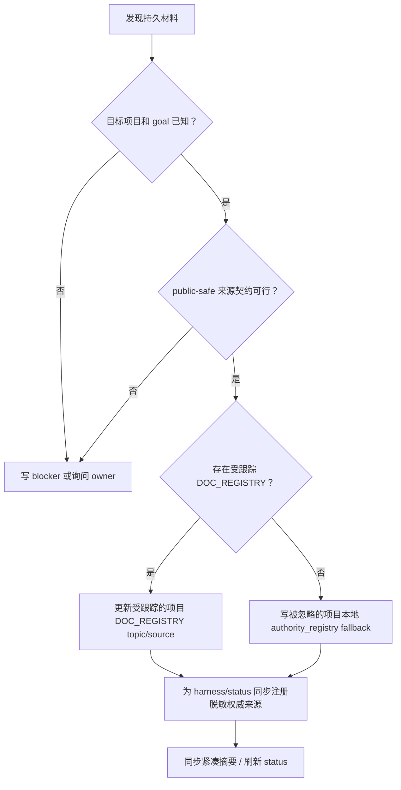
```mermaid
flowchart TD
  M["发现持久材料"] --> P{"目标项目和 goal 已知？"}
  P -->|"否"| B["写 blocker 或询问 owner"]
  P -->|"是"| R{"public-safe 来源契约可行？"}
  R -->|"否"| B
  R -->|"是"| D{"存在受跟踪 DOC_REGISTRY？"}
  D -->|"是"| Y["更新受跟踪的项目 DOC_REGISTRY topic/source"]
  D -->|"否"| L["写被忽略的项目本地 authority_registry fallback"]
  Y --> C["为 harness/status 同步注册脱敏权威来源"]
  L --> C
  C --> S["同步紧凑摘要 / 刷新 status"]
```

**不良信号**

Agent 只在聊天里记住重要文章或设计，或因为 meta controller 是当前仓库
就注册到它里面，而材料其实属于另一个已连接项目。

**验证**

- `docs/operations/authority-source-registration.md`
- `examples/register-authority-source-smoke.py`
- `examples/import-doc-registry-authority-smoke.py`
- `examples/platform-migration-material-registry-smoke.py`

#### IP-016 Task Lease Claim

**触发**

- 多个 Agent、heartbeat、子 worker 或 frontstage 通道视图可能对同一 todo 行动；
- 所选工作有一个有界的 `todo_id`、owner、TTL、写作用域和幂等键；
- 系统需要在不让真相进入聊天的情况下防止重复工作、重复 spend 或重叠写。

**预期行为**

`claimed_by` 保持为默认的软路由信号。当 host 有具体的排他写需求时，
它可以显式获取 `task_lease_v0`：对单个有界 todo 的限时硬租约。
Pending 键是 `(goal_id, todo_id)`：`goal_id` 指明控制面 lane，
`todo_id` 指明其中工作条目。同一 goal 内的不同 todo 不会仅仅因为共享 goal 而冲突；
只有同一 `todo_id` 的竞争 pending 租约或重叠写作用域才应冲突。
Status 暴露可选租约能力是否可用，通道投影可以渲染提供的租约行。
租约不由 `quota should-run` 强制，也不覆盖 `goal_boundary`、用户关卡、
能力或写作用域检查。

当租约激活且所选动作在其作用域内时，owner 可以继续。当竞争 worker 看到活跃的
重叠租约时，它必须选择非重叠 fallback、等待或表露冲突。过期的租约在授权继续工作前
需要清理或续约。

**视觉模型**

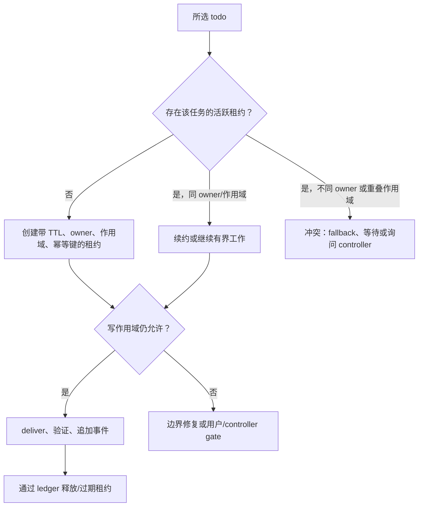
```mermaid
flowchart TD
  T["所选 todo"] --> A{"存在该任务的活跃租约？"}
  A -->|"否"| C["创建带 TTL、owner、作用域、幂等键的租约"]
  A -->|"是，同 owner/作用域"| R["续约或继续有界工作"]
  A -->|"是，不同 owner 或重叠作用域"| K["冲突：fallback、等待或询问 controller"]
  C --> W{"写作用域仍允许？"}
  R --> W
  W -->|"是"| D["deliver、验证、追加事件"]
  W -->|"否"| G["边界修复或用户/controller gate"]
  D --> X["通过 ledger 释放/过期租约"]
```

**不良信号**

两个 worker 重复同一任务、双倍 spend 配额或写重叠文件，因为唯一的归属信号
是一条聊天消息或 dashboard 标签。

**验证**

- `docs/product/roadmaps/frontstage-channel-lease-roadmap.md`
- `docs/architecture.md` 本地服务器 / daemon 路线图
- `examples/control_plane/task-lease-runtime-smoke.py`。

#### IP-019 Peer Scoped Continuation

**触发**

- 一个共享控制面目标声明 `coordination.agent_model=peer_v1` 和
  `coordination.registered_agents`；
- 一个 peer 有建议性 profile/作用域，以及一个当前 Agent 或未声明的 todo；
- 任务、goal、能力和仓库策略允许所选动作。

**预期行为**

控制面保持身份与归属可见，而不把作用域变成等级，也不把宽泛作用域拷进
todo 元数据。peet 声明一个具体的有资格 todo：

```bash
loopx todo claim \
  --goal-id <goal-id> \
  --todo-id <todo_id> \
  --claimed-by <peer-agent-id>
```

当所选任务写仓库状态时，`agent_workspace_guard_v1` 强制任务/仓库隔离策略。
跨仓库任务声明一等字段 `task_repository=git:<host>/<path>` todo；
quota 把当前 origin 与该身份匹配，且仍要求链接的 worktree。该字段不携带
Agent 作用域也不授予写，goal 仓库在字段缺失时仍是 fallback。
只读和 monitor-only 工作不因 Agent 身份而要求隔离 checkout。
当一个切片小、经过验证且被仓库策略允许时，peer 可以 self-merge 并带证据完成：

```bash
loopx todo complete \
  --goal-id <goal-id> \
  --todo-id <todo_id> \
  --claimed-by <peer-agent-id> \
  --self-merged \
  --evidence "<commit, validation, and self-merge summary>"
```

完成使用 typed 任务策略。`independent_handoff` 创建非阻塞 successor，
`same_agent_non_delivery` 与同一 peer 保持延续，评审仍是普通 action kind。
`excluded_agents` 表达罕见的执行者分离约束；`unblocks_todo_id` 表达依赖谱系。
没有任何 profile 或 goal 字段提供隐式 reviewer。`claimed_by` 保持软 owner，
不是权限授予：quota、用户关卡、边界、能力、写作用域和仓库规则仍然适用。

因为提示文本本身不是可靠 guard，当一个写仓库任务从非 git、无关或非隔离
checkout 运行时，`quota should-run --agent-id <peer-agent-id>` 投影
`workspace_guard`。该状态下 `normal_delivery_allowed=false` 且
`interaction_contract.mode=agent_workspace_repair`：唯一允许的动作是移动到
合规的 worktree/分支并在编辑前重跑 guard。工作区修复是预检，不 spend 配额。

可问责结算使用同一 typed 边界，但不假设所有 delivery 都是仓库写。
Git 支持的 delivery 记录 canonical `git_repository` 工作区身份。
一个已注册的单 Agent、非 Git 目标可以改为记录无路径的 `local_goal` 身份
（`loopx:<goal-id>`），在其注册项目根内运行。该身份足以用于因果 quota 结算，
但绝不接受为写仓库 peer 所需的独立 Git worktree 的替代品。

同一作用域身份必须贯穿整个成功 turn。如果 `quota should-run` 是用
`--agent-id <peer-agent-id>` 求值的，解释同一 turn 控制面状态的后续命令，
尤其是 `refresh-state` 和 `quota spend-slot`，在子命令支持时应使用同一
已注册 `--agent-id`。否则 spend/记账预览可能被当作未加作用域的自动化求值，
并报告 `automation_prompt_upgrade_required`，即使 delivery 决策是在有效的 peer
作用域下做出的。修复不是忽略该警告；修复是在 guard、写回、记账和上线证据中
保留身份信封。

**视觉模型**

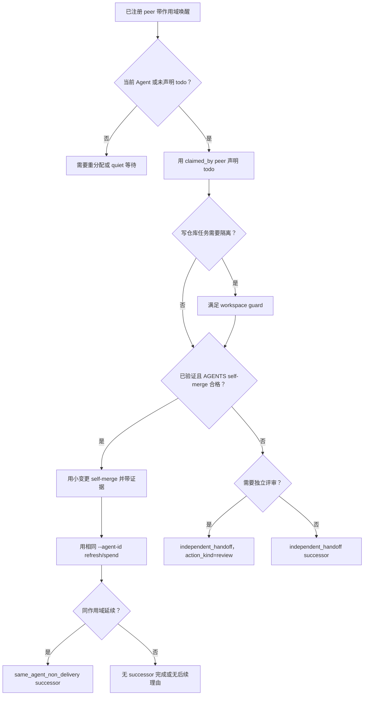
```mermaid
flowchart TD
  S["已注册 peer 带作用域唤醒"] --> T{"当前 Agent 或未声明 todo？"}
  T -->|"否"| Q["需要重分配或 quiet 等待"]
  T -->|"是"| C["用 claimed_by peer 声明 todo"]
  C --> W{"写仓库任务需要隔离？"}
  W -->|"是"| B["满足 workspace guard"]
  W -->|"否"| V
  B --> V{"已验证且 AGENTS self-merge 合格？"}
  V -->|"是"| M["用小变更 self-merge 并带证据"]
  M --> I["用相同 --agent-id refresh/spend"]
  I --> K{"同作用域延续？"}
  K -->|"是"| N["same_agent_non_delivery successor"]
  K -->|"否"| X["无 successor 完成或无后续理由"]
  V -->|"否"| R{"需要独立评审？"}
  R -->|"是"| P["independent_handoff，action_kind=review"]
  R -->|"否"| H["independent_handoff successor"]
```

**不良信号**

Agent 从所选任务禁止的工作区编辑、从聊天记忆而不是共享 todo 列表选择工作、
把作用域编进 todo 元数据、self-merge 宽泛或运行时敏感工作，或臆造隐式评审 owner。
相关的坏味道是把"提示说要用 worktree"当作充分的产品保护；guard 必须在第一次
文件编辑前就机器可见。另一个坏味道是作用域 peer run 传了 `quota should-run
--agent-id ...`，但后来不加 `--agent-id` 就 spend，产生一个像过期自动化提示
而不是已完成作用域 turn 的未加作用域记账快照。

**验证**

- `docs/project-agent-todo-contract.md`
- `docs/integrations/codex-subagent-orchestration.md`
- `docs/heartbeat-automation-prompt.md`
- `examples/control_plane/todo-lifecycle-cli-smoke.py`
- `examples/control_plane/todo-cli-smoke.py`
- `examples/control_plane/todo-concurrent-write-lock-smoke.py`
- `examples/control_plane/heartbeat-prompt-smoke.py`
- `examples/control_plane/peer-agent-workspace-guard-smoke.py`

#### IP-020 Todo Claim / Supersede / Successor Lifecycle

**触发**

- 所选 agent todo 有稳定 `todo_id`，当前 Agent 即将在上面花一个 delivery turn；
- 一个 todo 因用户改了路线、新证据使旧措辞错误，或一个更窄的替代应成为第一个
  可执行条目而过期；
- 一个非平凡切片完成，但功能仍需要上线、产品路径证明、文档、benchmark 证据、
  遥测或评审；
- 多个已注册 Agent 能看到同一清单，且需要在不用作用域弄脏 todo 元数据的情况下
  让归属可见。

**预期行为**

Agent 在 delivery 前声明具体工作：

```bash
loopx todo claim \
  --goal-id <goal-id> \
  --todo-id <todo_id> \
  --claimed-by <agent-id>
```

`claimed_by` 是软 owner，不是权限。它必须对照已注册 Agent id 检查，
且不得绕过 quota、用户关卡、写边界、仓库策略、验证或公共/私有扫描。

当一个开放 todo 是错的而不是不完整时，Agent 应替代它，而不是就地编辑其文本
或标记完成：

```bash
loopx todo supersede \
  --goal-id <goal-id> \
  --todo-id <todo_id> \
  --reason "<public-safe reason>" \
  --next-agent-todo "<replacement executable action>"
```

Supersede 把旧工作条目保留为历史，记录 `superseded_by`，让替代成为持久的
当前路线。用于路线变更、过期的 benchmark lane、收窄的 blocker 或用户纠正的优先级。

当一个非平凡切片完成后，完成必须要么创建 successor todo，要么记录为什么不需要
successor：

```bash
loopx todo complete \
  --goal-id <goal-id> \
  --todo-id <todo_id> \
  --evidence "<public-safe validation or artifact>" \
  --next-agent-todo "<next rollout/proof/docs/review step>"
```

Successor todos 是轻量生命周期模型。LoopX 不应长出很多功能状态，如
slice_done、rolled_out 或 proven_in_product，除非出现 UI/运行时需求。
一个 done todo 表示当前切片已完成；successor 表达下一个切片。如果确实没有后续，
完成说明必须包含紧凑的无后续理由。

**视觉模型**

```mermaid
flowchart TD
  S["所选的开放 todo"] --> C{"由该 Agent 声明？"}
  C -->|"否"| L["用 claimed_by 声明"]
  C -->|"是"| W["交付有界切片"]
  L --> W
  W --> V{"已验证？"}
  V -->|"否"| B["写 blocker 或保持 todo 开放"]
  V -->|"是"| R{"旧 todo 仍描述路线？"}
  R -->|"否"| U["用替代 todo supersede"]
  R -->|"是"| F{"需要后续？"}
  F -->|"是"| N["带 successor todo 完成"]
  F -->|"否"| X["带无后续理由完成"]
  U --> Q["refresh-state / quota 投影 successor"]
  N --> Q
  X --> Q
```

**不良信号**

Agent 不声明 todo 就开始工作、路线纠正后改写开放 todo 使历史丢失、
一次 PR 后不建 successor 就标记宽泛功能完成、只在聊天里创建 successor，
或把 `claimed_by` 当作忽略 gate 和边界的权限。

**验证**

- `docs/project-agent-todo-contract.md`
- `examples/control_plane/todo-lifecycle-cli-smoke.py`
- `examples/control_plane/todo-cli-smoke.py`
- `examples/control_plane/todo-concurrent-write-lock-smoke.py`
- 未来 status/quota smoke，验证 `todo supersede` 和
  `todo complete --next-agent-todo` 后第一个可执行 successor 投影。

#### IP-022 Claimed Todo Visibility And Agent-Lane Next Action

**触发**

- status 或 quota 汇总一个开放工作多于小 scheduler top-N 可显示的 todo 集；
- 已注册 peer 使用 `claimed_by`，尤其当一个 peer 的作用域工作可能排在另一个
  peer 声明的高优先级工作后面；
- dashboard、review packet 或 heartbeat prompt 需要显示归属、当前 Agent 工作
  和 monitor 责任，而不改变 scheduler 选择哪个可执行 todo。

**预期行为**

Todo 投影有两个职责，不应塌缩成一个列表：

1. **调度**：为当前 guard、能力检查和 steering audit 选择窄的可运行候选集。
2. **可见性**：让人、dashboard 和范围化 Agent 能观察到归属、已声明工作和
   monitor lane。

Status 和 quota 仍可暴露 `first_open_items`、`first_executable_items` 和
`executable_backlog_items` 作为紧凑 scheduler 面。它们还应投影有界可见性 lane：

- `unclaimed_priority_open_items`：按优先级排序的未声明工作，Agent 可以考虑声明；
- `claimed_open_items`：可能不在 scheduler top-N 内的已声明工作；
- `claimed_advancement_open_items`：已声明的可执行 delivery 工作；
- `claimed_monitor_open_items`：已声明的持续 monitor 工作；
- 对 Agent 作用域 quota payload，`current_agent_claimed_open_items`、
  `current_agent_claimed_advancement_items`、`current_agent_claimed_monitor_items`
  和 `claimed_by_others_items`。

面向 Agent 的默认 lane 上限应保持克制，当前为每 lane 16 条，并用计数字段显示
有更多工作。需要超过这一点的富 frontstage 视图应使用分页或过滤投影，
而不是膨胀每个 heartbeat/quota payload。Monitor lane 除非记录实质转移或 blocker，
否则保持可见性上下文；不应因为被声明就偷走推进槽位。

当一个已声明可见性 lane 的条目多于 lane 上限时，截断应 claims 平衡，
而不是原始 top-N。先按优先级和来源位置排序已声明条目，再按 `claimed_by` 分组，
在上限内取每 claimant 的公平切片，然后用排序后的余量填补剩余槽位。
目标不是严格的轮转显示顺序；而是防止一个 Agent 的长队列藏住另一个 Agent
的已声明工作。

Agent 作用域 quota 随后在可见性平衡后应用焦点排序：当前 Agent 已声明条目第一，
未声明条目第二，其他 Agent 已声明条目最后且权重更低。其他 Agent 的声明保持可见，
在没有更好选择时可以检查，但不应挤掉当前 Agent 自己的已声明推进或真正未声明的工作。
`claimed_by` 保持软归属信号，不是锁、租约、能力授予或 gate 绕过。

对于 Agent 作用域执行 payload，quota 还可以暴露窄的 `agent_lane_next_action`
对象，`schema_version=agent_lane_next_action_v0`。它从同一作用域可运行队列派生：
优先 `capability_gate.runnable_candidates`，然后
`agent_todo_summary.first_executable_items`，然后
`agent_todo_summary.executable_backlog_items`；过滤掉其他 Agent 声明的 todos；
先选当前 Agent 声明的 todos 再选未声明 fallback，并在该声明桶内优先
`capability_repair_mode=true` 的同优先级普通可运行工作。这个对象是 Agent lane
指针，不是目标级路线改写，因此必须包含 `preserves_goal_next_action=true`。
Status 可以为 `--agent-id` 观察附加同一对象，但不得用它取代条目
`recommended_action`、`project_asset.next_action`、owner 或等待 lane。

**视觉模型**

```mermaid
flowchart TD
  T["解析后的 todo 集"] --> S["scheduler lanes: first/open/executable 候选"]
  T --> B["已声明 lane 的 claimant 平衡截断"]
  B --> V["可见性 lanes: claimed、unclaimed、monitor"]
  S --> Q["quota/能力 guard 选择可运行候选集"]
  Q --> A["推荐加非穷举建议"]
  A --> B["Agent 可绑定任何当前合格 todo"]
  Q --> N["面向 --agent-id 作用域 turn 的 agent_lane_next_action"]
  V --> F["dashboard/frontstage/review packet 显示归属"]
  V --> C{"存在 Agent 身份？"}
  C -->|"是"| M["当前 Agent claimed > unclaimed > 其他 Agent claimed"]
  C -->|"否"| G["全局 claimed/unclaimed 归属视图"]
  F --> H["人看到谁拥有什么，而不改变 scheduler 结果"]
```

**不良信号**

一个 peer 声明了 productization todo，但 status/quota 只暴露前几个按优先级
排序的 benchmark todos。Agent 于是显得空闲，或未声明工作显得可用，
尽管控制面已经知道其 owner。相反的不良信号同样有害：一个大的已声明工作列表
被直接喂进 scheduler 或 heartbeat prompt，造成嘈杂路由，monitor 工作挤掉
选中的推进 lane。

另一个具体坏用例：operator 让 Agent 监控一个 PR 直到 merge，但 Agent
编辑通用 heartbeat 自动化提示，加入那个 PR 特定的轮询逻辑。这把一个 monitor
目标耦合到 scheduler，让自动化更难从 `heartbeat-prompt` 重新生成，
并在 PR 关闭时冒删除或改动整个 heartbeat 的风险。正确表示是 `continuous_monitor`
todo，可选带 `unblocks_todo_id`，而 heartbeat 保持通用并通过 status/quota/todo
投影发现 monitor。

**验证**

- `docs/status-data-contract.md`
- `examples/control_plane/todo-first-open-summary-smoke.py`
- `examples/control_plane/work-lane-contract-smoke.py` 用于 `agent_lane_next_action_v0`
  在保留目标级 `Next Action` 的同时暴露当前 peer 的 TUI 切片。
- `examples/control_plane/status-markdown-smoke.py` 用于 `status --agent-id`
  渲染相同 Agent lane 指针而不替换项目路线。
- PR #262 / commit `292a2c8`：附加 status/quota 可见性 lane，带 16 条
  Agent 面上限。

#### IP-026 Agent-Scoped No-Candidate Gap

**触发**

- `quota should-run --agent-id <agent>` 返回 `should_run=true` 或
  `interaction_contract.agent_channel.must_attempt=true`；
- 同一 payload 没有 `agent_lane_next_action`；
- `current_agent_claimed_advancement_items` 为空；
- 没有为该 Agent 投影可运行候选；
- 没有当前 Agent 或未声明的就绪延迟恢复候选；并且
- 推荐行动指向另一个 Agent 的 lane、超出作用域的 lane，或当前 Agent 无法安全
  推进的目标级路线。

**预期行为**

Agent 作用域 quota 必须区分"目标有可运行工作"与"该 Agent 有可运行工作"。
当当前 Agent 没有作用域内候选时，quota 不应强推一个 delivery turn。
该模式只在 guard 也检查了 IP-027 且未找到就绪的当前 Agent 或未声明延迟恢复候选，
并且 IP-029 未找到当前 Agent 的应等待或 replan 的 handoff gate 状态后适用。
如果就绪的延迟恢复候选存在，IP-027 拥有 `successor_replan_required` 路径；
如果 handoff 评审 todo 状态已变，IP-029 拥有 handoff 等待或 successor-replan 路径。
IP-026 不得把任一种情况吞成"没有可运行的"。

当作用域边界确实为空时，quota 应投影这些机器状态之一：

- `scope_exhausted`：没有当前 Agent 或未声明候选匹配注册 Agent profile 与边界；
- `agent_scope_wait`：一个显式阻塞的评审/handoff 依赖由另一个 peer 拥有，
  必须清掉后当前 peer 才可继续；
- `reassignment_required`：存在有用工作，但归属必须先改变，该 Agent 才能
  把它当作自己的 lane。

交互契约随后应设置：

```text
agent_channel.must_attempt=false
agent_channel.delivery_allowed=false
agent_channel.quiet_noop_allowed=true
```

用户通道保持安静，除非存在具体用户 todo。推荐行动应点名作用域条件，
而不是借用全局目标级路线。Peer 应允许不 spend 的 no-op，或在 delivery
再次允许前声明新暴露的作用域内 todo。

该模式是 IP-022 的运行时对偶。IP-022 让已声明、延迟、handoff 和 Agent lane
工作可见；IP-026 说明作用域开放边界为空、IP-027 未找到就绪延迟 gate 恢复、
且 IP-029 未找到作用域 Agent 的 handoff todo gate 状态时该做什么。
如果唯一明显的 blocker 是一个 `blocks_agent` 指向不同 Agent 的用户 todo，
IP-003 在 IP-026 之前拥有该情况：把那个其他 Agent 的 gate 从当前 Agent
的阻塞用户摘要中过滤掉，然后判断当前 Agent 是否仍有可运行工作。如果有，
delivery 可以继续；如果没有，IP-026 可以分类剩余的空边界。

**视觉模型**

```mermaid
flowchart TD
  Q["quota should-run --agent-id 侧"] --> F{"当前 Agent 边界？"}
  F -->|"当前 Agent 候选"| D["允许有界 delivery"]
  F -->|"未声明作用域内候选"| C["Agent 可在 delivery 前声明"]
  F -->|"无开放候选"| R{"IP-027 就绪延迟恢复？"}
  R -->|"是"| P["让位给 IP-027"]
  R -->|"否"| G{"IP-029 handoff gate 状态？"}
  G -->|"blocking 或 cleared_without_successor"| K["让位给 IP-029"]
  G -->|"无"| X["scope_exhausted / agent_scope_wait"]
  F -->|"只有其他 Agent 或超出作用域工作"| X
  X --> N["quiet no-op，不 spend"]
  X --> H["属于 Agent 可推进、merge 或重分配"]
  H --> Q
```

**不良信号**

一个 peer heartbeat 收到 `should_run=true`、`delivery_allowed=true` 和
`quiet_noop_allowed=false`，即使 `agent_lane_next_action=None`、
`current_agent_claimed_advancement_items=[]`，唯一推荐是另一个 Agent 的
benchmark 或运行时 lane。Agent 要么在重复空 heartbeat 中空转，要么冒险在其
注册作用域之外工作。相关的失败是把就绪延迟 successor 当作该无候选模式的
一部分，而不是路由它走 IP-027 的 gate-resume 生命周期；或把 handoff todo
生命周期变化当作通用 Agent 等待，而不是路由它走 IP-029。相反的不良信号
同样有害：延迟或 handoff 条目混进开放 todo 列表，使过期或未来工作凌驾于
活跃的开放任务。

**验证**

- 未来的 quota/status 回归，两个已注册 peer，所有可运行工作被另一个 peer 声明，
  当前 `--agent-id` 调用返回 `reassignment_required`，除非存在显式阻塞评审依赖；
- `examples/control_plane/work-lane-contract-smoke.py` 应覆盖空当前 Agent
  边界不能产生 `delivery_allowed=true`；
- `docs/project-agent-todo-contract.md`
- `docs/quota-allocation.md`
- `docs/status-data-contract.md`
- `examples/control_plane/quota-agent-scoped-user-gate-smoke.py` 用于相邻情形：
  用户 gate 真实但作用域到另一个 Agent，因此不得制造当前 Agent 作用域耗尽。
- `examples/control_plane/quota-cleared-blocker-successor-gate-smoke.py` 用于相邻
  情形：一个 `blocks_agent` handoff todo 直接控制作用域 gate。
- `skills/loopx-self-repair/references/repair-patterns.md` 记录
  `agent_scoped_no_candidate_gap` 和 `handoff_gate_state_projection_gap`
  供事故分类。

#### IP-023 Status Neutral Run Window

**触发**

- `quota should-run` 报告没有用户行动或 quiet monitor 行为，但 `status` /
  `diagnose --limit N` 回退到过期的 registry 状态、controller gate 或更老的
  connected-without-run 状态；
- 最近历史被 status 中性条目主导，如 quota monitor 轮询、slot-spend 记录、
  就绪 ping 或纯显示刷新；
- 一个短的 UI/历史上限把最新有意义的状态转移藏在可见窗口刚好前面。

**预期行为**

Status、diagnose、quota 和 history 应共享同一中性 run 分类契约。中性 run
对 cadence 与停滞分析是真实证据，但它们本身不是权威状态转移。
计算当前控制面状态时，实现应在内部窗口上推理，窗口足够宽以跳过中性噪声，
找到最新有意义的状态 run，再为 UI 显示裁剪 run 列表。

UI 显示上限不得成为控制面推理窗口。用户可以要 `--limit 5` 保持输出紧凑，
但状态选择仍应看得足够远，避免投影出假的 controller/user gate。如果内部
推理窗口内不存在有意义的状态 run，status 应显式说明，而不是发明一个 gate。

**视觉模型**

```mermaid
flowchart LR
  H["最近 run history"] --> N["分类中性 vs 有意义 run"]
  N --> W["在内部状态窗口上推理"]
  W --> M{"找到有意义状态 run？"}
  M -->|"是"| S["从该 run 投影当前 status"]
  M -->|"否"| U["报告 unknown/无信号，不造假 gate"]
  S --> D["把显示行裁剪到 UI 上限"]
  N --> E["保留中性行作为停滞/cadence 证据"]
```

**不良信号**

一个 monitor-only 循环填满最近五行历史，于是 `status --limit 5` 声称 Agent
需要 controller 连接或用户决策，即使 quota 说 `monitor_quiet_skip` 且没有
开放用户 todo。坏状态不是存在 monitor 行；而是表现上限改变了控制面的含义。

**验证**

- `docs/status-data-contract.md`
- `skills/loopx-self-repair/references/repair-patterns.md`
- 未来回归：最近 N 个 run 是中性，第 N+1 个 run 是权威状态转移。

#### IP-025 Experimental Diagnostic Sidecar Boundary

**触发**

- 一个路线特定的证明或调试工具发出 verdict 字段，如 Codex CLI 可见的 attach
  决策、runtime-idle blocker、延续结果或 fallback 契约；
- 实现提议把这些 verdict 复制进稳定的热路径 Agent packet、status schema、
  dashboard 契约或 `protocol_action_packet_v0`；
- verdict 语义仍依赖一个实验面、人类观察、仅 fixture 的证明或临时产品问题。

**预期行为**

实验性证明/调试 verdict 先是 sidecar 诊断。它们可以 public-safe、结构化、
有版本、有用，但在抽象成为产品通用并跨消费面验证之前，不会成为稳定
Agent 面 packet 字段。

稳定热路径应继续表达通用控制面义务：用户行动、Agent 行动、work lane、gate 状态、
quiet-noop 允许、spend 策略和紧凑行动标签。路线特定证明字段留在拥有其证据的
sidecar 里。对当前 Codex CLI/TUI 路径，`visible_session_proof_required`、
`runtime_idle_evidence_required`、`same_tui_visible_attach_accepted`、
`accepted_for_same_tui_automation`、`continuation_outcome` 和
`fallback_contract` 等 verdict 属于可见 attach/proof 或观察 packet，
不属于 `protocol_action_packet_v0` 或常规 quota/status packet 形状。

从 sidecar 晋升到稳定 schema 需要显式 schema 决策：

- 字段名不绑定某一条路线的调试措辞；
- 至少一个非 Codex-CLI 或未来运行时消费者可以在无需重新解释的情况下使用同一抽象；
- 公共/私有边界与 no-transcript/no-session-file 约束已有文档；
- 失败模式表示为通用义务或 blocker，而不是产品 spike 标签；
- smoke 测试证明 sidecar verdict 与稳定 packet 都保持兼容。

Codex CLI/TUI 的后果窄但重要：手动同开放 TUI 观察可以证明第一次 bootstrap
延续保持可见，而计划的同 TUI attach 仍被证明/空闲要求阻塞。这个区别是有效证据，
但不应强迫每个 Agent heartbeat 或 dashboard 行学习 Codex 特定 verdict 字段。

**视觉模型**

```mermaid
flowchart TD
  P["实验证明或调试 packet"] --> V["路线特定 verdict 字段"]
  V --> S{"产品通用抽象已验证？"}
  S -->|"否"| D["保持为 sidecar 诊断；有用时从 docs/status 链接"]
  S -->|"是"| R["写 schema 决策与兼容 smoke"]
  R --> H["把通用字段晋升进稳定热路径 packet"]
  D --> C["稳定 packet 保持通用用户/agent/gate/spend 义务"]
  H --> C
```

**不良信号**

一个证明 spike 直接给通用运行时 packet 加 `same_tui_visible_attach_accepted`
或 `visible_session_proof_required`，未来 Agent 开始把 Codex CLI 调试 verdict
当作通用路由字段。相反的不良信号是彻底丢失证明：诊断 sidecar 是 public-safe
且有用，但没有文档或 smoke 说明它为何未进稳定 schema。

**验证**

- `docs/reference/protocols/protocol-action-packet-decision-v0.md`
- `docs/product/runtimes/codex-cli/codex-cli-same-open-tui-continuation-observation.md`
- `examples/interaction-pattern-catalog-smoke.py`
- `examples/codex-cli-visible-attach-acceptance-smoke.py`

#### IP-028 Connector Runtime Boundary

**触发**

- 一个 connector todo 或 packet 提议对真实服务运行浏览器、聊天、平台或文档
  connector；
- 来源状态是 `private_needs_review`、`metadata_only`，或其他受 owner gate 约束的
  状态；
- 活跃 connector 路线可以在 Agent 阻止之前自动加载来源正文、消息列表、派生报告、
  媒体或参与数据。

**预期行为**

Connector packet 必须在首次浏览器/API 运行前携带机器可读运行时策略。
策略说明批准前允许哪些探针、禁止哪些 URL 或路径前缀、是否允许浏览器打开，
以及什么 owner 决策解除下一阶段。对私有 connector，安全默认只是 gate 投影。
对公开元数据 connector，安全默认是有界的元数据探针，而不是打开可能自动加载
时间线、媒体或分析的页面。

该模式补充 IP-004。IP-004 让 owner 诉求具体；IP-028 防止 connector 运行时
在诉求仍待决时意外消费被 gate 的材料。

**状态契约**

```text
connector_runtime_policy = {
  schema_version: content_ops_connector_runtime_policy_v0,
  access_mode: public_metadata_only | private_metadata_only | synthetic_fixture_only,
  safe_default: head_only_metadata_probe | gate_projection_only | fixture_only,
  browser_open_allowed_before_gate: false,
  allowed_probe_methods: [...],
  forbidden_url_path_prefixes_before_approval: [...],
  forbidden_before_approval: [...]
}
```

**不良信号**

Agent 因为页面看起来像方便的 UI 而打开私有 connector 的默认 web 路线，
但该路线自动调用消息列表或消息详情 API。另一个坏味道是把公开社交 profile
当作 "metadata only"，而浏览器自动下载时间线、帖子正文、媒体或参与流。

**验证**

- `docs/reference/protocols/content-ops-surface-v0.md`；
- `examples/content-ops-public-handle-observation-smoke.py`；
- `examples/content-ops-private-connector-gate-smoke.py`；
- `examples/interaction-pattern-catalog-smoke.py`。

### Evidence Lifecycle

#### IP-012 External Evidence Observation

**触发**

- `waiting_on=external_evidence`、一个已启动的外部 worker 正在被轮询，或
  `interaction_contract.mode=external_evidence_observation`；
- 所选动作是证据观察、紧凑结果摄入或紧凑 blocker 写回；
- benchmark/model/Docker/cloud 执行未被当前 guard 显式授权。

**预期行为**

Agent 必须区分观察外部 handle 与启动新外部工作。如果存在紧凑 handle，
它可以轮询或摄入紧凑 public-safe 结果文件。如果所需 handle 缺失，
正确动作是紧凑 blocker 或投影修复，而不是 quiet no-op。Benchmark 执行、
模型调用、Docker、cloud 作业、上传和 leaderboard 路径保持阻塞，
除非 guard 显式选择该工作。

**视觉模型**

```mermaid
flowchart TD
  E["外部证据模式"] --> H{"可观察 handle 存在？"}
  H -->|"否"| B["写紧凑 blocker / 修复投影"]
  H -->|"是"| P{"紧凑结果或失败标记存在？"}
  P -->|"否"| O["有界轮询；未变化不 spend"]
  P -->|"是"| I["摄入紧凑结果或 blocker"]
  I --> V["验证边界并写事件"]
  V --> N["下一个 guard 决策"]
```

**不良信号**

heartbeat 把外部证据等待当作无害 quiet skip，即使 guard 要求可观察 handle；
或它从只被授权观察的 meta/controller 轮询里启动 benchmark run。

**验证**

- `regression/external-evidence-observation-real-codex.py`
- `examples/benchmark-lifecycle-state-smoke.py`
- `docs/state-interaction-model.md`

#### IP-015 Benchmark Lifecycle Countability

**触发**

- 一个 benchmark adapter、runner wrapper 或 reducer 观察 preflight、launch、
  materialization、紧凑结果、比较、声明评审或 learning-ledger 证据；
- controller 正在决定一个进程启动、用例尝试、得分、预算 spend、重跑或公开声明
  是否可计数。

**预期行为**

Benchmark 工作应通过紧凑生命周期 gate 推进，而不是原始 runner 叙述。
`process_started` 本身不是用例进入。用例进入从 `job_root_materialized`
或更晚开始。预算/计数与候选选择需要紧凑结果摄入、声明边界评审，以及适用时
的 learning-ledger 状态。终态失败标记可以关闭一个已启动尝试，
而不使它成为用例尝试或 benchmark 预算事件。

**视觉模型**

```mermaid
flowchart LR
  P["preflight 就绪"] --> L["进程已启动"]
  L --> M{"job root / trial 已物化？"}
  M -->|"否"| B["不可计数；物化 blocker"]
  M -->|"失败标记"| F["终态紧凑失败收尾"]
  M -->|"是"| R["紧凑结果摄入"]
  R --> C["声明 / 归属评审"]
  C --> G{"learning ledger 就绪？"}
  G -->|"否"| W["阻塞预算计数 / 候选切换"]
  G -->|"是"| K["允许预算计数"]
```

**不良信号**

在紧凑生命周期状态说明可计数之前，一个 runner PID、分离进程、过期活跃作业
或原始日志尾部被当作 benchmark 用例尝试或得分声明的证据。

**验证**

- `benchmark/README.md`
- `benchmark/deepswe/README.md`
- `examples/benchmark-candidate-source-boundary-smoke.py`
- `examples/benchmark-run-permission-policy-smoke.py`

### Planning Governance

#### IP-013 Autonomous Replan Vs Advisory Dreaming

**触发**

- 无进展连续段、重复动作循环、阶段转移或周期评审阈值使阻塞的
  `autonomous_replan_obligation_v0` 在 active state、status、quota 或 run history
  中可见；或
- 一个后台规划 lane 把 `dreaming_proposal_v0` /
  `server_managed_planning_contract_v0` 作为建议性上下文表露。

**预期行为**

自主 replan 义务是可执行的修复工作：拆分、添加、退役或重新排序 todos，
使下一个 delivery 片段可以推进。Dreaming proposal 在 operator/controller 决策
与正常 quota/边界检查晋升它之前都是建议性的。Dreaming proposal 可以与阻塞
replan 义务并排显示，但它们保持侧 lane：在阻塞 replan 义务不存在或解决之前，
它们只能支持评审或修复，不能进入晋升/执行。两条 lane 不得互相塌缩。

Replan 收尾是语义且因果绑定的。一个正常的已验证进度刷新可以记录有效工作，
但它不能静默关闭 `autonomous_replan_obligation_v0`。Quota 先把证据日志投影成
紧凑覆盖 ledger 并发出一个不透明 `obligation_id`；在有界切片后，Agent 写一个
typed 观察。当结果是可运行 successor 时，Todo 转移本身就是收据：

```bash
loopx todo add \
  --goal-id <goal-id> \
  --role agent \
  --task-class advancement_task \
  --action-kind <typed-action> \
  --target-key <stable-execution-target> \
  --text '[P0] <bounded next slice>' \
  --claimed-by <agent-id> \
  --replan-obligation-id <current-obligation-id>
```

Todo 行原子地携带绑定到当前确切义务的语义收据，并返回
`host_action=end_current_heartbeat`；successor 在下一个 heartbeat 运行，
而不是在 replan turn 里。该命令只在 host 拥有具体有界目标时投影；
通用规划指导不能变成 successor。当无目标已知时，typed 观察使用投影的
`refresh-state` 模板。接受的结局是 typed 的：新面、假设、探针族、当前可运行
successor、有证据的 blocker、有覆盖支撑的终端，或——仅对 vision 衍生的职责——
一条新鲜证据链接的 vision 路径。分类散文、证据读取收据、调用者声明的修复种类，
或绑定到更早义务的 ACK，都不能关闭当前义务。

`refresh-state` 在任何持久写之前重算与 quota 相同的完整目标边界上下文。
因此一个实质等价的观察、重复 blocker、无根基 successor 或纯维护写回会 fail closed；
它不能制造安静的假进展循环。

**视觉模型**

```mermaid
flowchart TD
  S["status / run history"] --> R{"阻塞 replan 义务可见？"}
  S --> D{"存在 dreaming proposal？"}
  D -->|"是"| V["显示建议性 dreaming 侧 lane"]
  D -->|"否"| Z["无 dreaming 侧 lane"]
  R -->|"是"| A["执行有界 replan 修复"]
  A --> T["更新 todos / 指导"]
  T --> C["追加结构化 replan ACK"]
  C --> Q["重跑 quota guard"]
  V -. "可支持修复；被阻塞时无 delivery spend" .-> A
  R -->|"否"| G{"dreaming proposal 有资格晋升？"}
  G -->|"是"| U["通过用户或 controller gate 询问/晋升"]
  U --> P{"已晋升且边界批准？"}
  P -->|"是"| Q
  P -->|"否"| X["proposal 保持不可执行"]
  G -->|"否"| N["正常选定的交互模式"]
```

**不良信号**

来自 dreaming/规划 lane 的 proposal 在晋升前携带 `agent_command` 或花 delivery
配额。相反的失败同样昂贵：重复无进展证据被当作可选头脑风暴，而不是必需的
状态修复。更微妙的失败是把 `autonomous_replan_validated_*` 或另一个进度分类
当作 replan ACK；这隐藏了 Agent 是否真的拆分/退役/添加了所需的控制面工作并关闭了
义务。相关的坏用例是一个 replan ACK 记录了努力，但把完全相同的 monitor/action
推荐留作下一条机器可见路线。

**验证**

- `examples/autonomous-replan-obligation-smoke.py`
- `regression/autonomous-replan-vs-dreaming-contract.py`
- `docs/archive/incidents/monitor-only-replan-stall-incident-20260621.md`
- `docs/archive/incidents/agent-scoped-replan-precedence-incident-20260703.md`

#### IP-024 Repair Delta Contract

**触发**

- 自修复、replan 或无进展处理记录了活动，但下一个 quota/status packet 返回相同
  monitor/action 推荐；
- 重复的 monitor-only、replan 或 repair 相邻 run 没有创建新的可运行 todo、blocker、
  successor、supersede 记录、用户 gate、能力变化、workspace guard 变化或
  monitor 目标变化；
- Agent 说它修复了状态，但修复前后的机器可见工作边界完全相同。

**预期行为**

成功的修复/replan 必须改变机器可见边界。这些面中至少一个应变化：

- 所选 `effective_action` 或 interaction contract；
- 可运行 todo 集、已声明 work lane、successor 或 supersede 关系；
- 具体用户问题/todo 或 blocker；
- 能力/workspace guard 结局；
- monitor 目标、过期、watch-lane 理由或证据 handle；
- active-state Next Action 或 goal-boundary 投影。

如果这些都不变，修复应记录为 no-op 或未解决 blocker，而不是进度。
下一个安全动作应是创建缺失的 successor/blocker/supersede/watch-lane 记录，
或用明确理由说明当前 monitor 刻意安静。这与 IP-013 的 replan ACK 分开：
ACK 关闭义务，而 delta 契约证明关闭它没有隐藏同一卡住的路线。

**视觉模型**

```mermaid
flowchart TD
  R["自修复或 replan run"] --> B["快照前后边界"]
  B --> C{"有机器可见 delta？"}
  C -->|"是"| P["记录进度并重跑 quota"]
  C -->|"否"| N["分类 repair_noop / replan_noop"]
  N --> D{"为何无 delta？"}
  D -->|"过期路线"| S["替代或创建 successor todo"]
  D -->|"真实 blocker"| K["记录 blocker 或用户 todo"]
  D -->|"刻意 watch"| W["记录 monitor 目标 + 过期"]
```

**不良信号**

Agent 执行 replan、追加一行历史并报告循环已处理。下一个 heartbeat 仍收到
相同推荐行动、相同 monitor 目标、相同 todo 集和相同缺乏 blocker。
那不是解决的修复；那是叙述更好的未闭合控制面循环。

**验证**

- `docs/archive/incidents/monitor-only-replan-stall-incident-20260621.md`
- `skills/loopx-self-repair/references/repair-patterns.md`
- `examples/control_plane/heartbeat-quota-flow-smoke.py`
- 未来回归：比较修复与 replan 收尾 run 的前后边界字段。

#### IP-010 Cadence Hint

**触发**

- 最近合格 turn 有一个薄进展连续段；
- delivery 反复落在 `single_surface`、仅状态或浅层文档上，没有连贯 artifact；
- 没有安全边界阻止更大的片段。

**预期行为**

controller 把派生的 cadence hint 当作低置信引导信号。当 hint 说 `thin_progress`
且推荐 `widen` 时，下一个合格 turn 通常应包含 artifact、聚焦验证和状态写回，
或写一个说明为何 widen 不安全的 blocker。

**视觉模型**

```mermaid
flowchart TD
  R["最近 turns"] --> S{"薄进展连续段 >= 阈值？"}
  S -->|"否"| C["保持当前 cadence"]
  S -->|"是"| B{"安全可行 widen？"}
  B -->|"否"| G["询问 gate 或写 blocker"]
  B -->|"是"| W["加宽下一个合格片段"]
  W --> D["artifact + 验证 + 写回"]
```

**不良信号**

Agent 的原生长任务能力因控制面持续要求它做微小 heartbeat 形状步骤而退化，
或 host 把派生 hint 当作硬权限或时机策略。

**验证**

- `docs/operations/long-task-cadence-policy.md`
- `examples/long-task-cadence-policy-smoke.py`

#### IP-018 Plan To Todo Writeback

**触发**

- Agent 告诉用户一个已连接的 LoopX 计划、top-todo 列表、路线变更、benchmark
  分支策略、废弃策略或优先级栈；
- 计划包含具体的未来 P0/P1/P2 工作、用户行动、路线决策或清理/废弃承诺；
- 未来 Agent 需要那个计划来选择下一个有界片段。

**预期行为**

面向用户的计划本身不是持久控制面状态。在最终回复前，Agent 必须做以下之一：

- 添加或更新具体的 `Agent Todo` / `User Todo` 条目；
- 刷新 `Next Action` 或最新 run 的 `recommended_action`；
- 写一个 public-safe 文档/目录条目并添加对应 todo；
- 显式说明计划是推测性的，未执行任何写回。

这使模型的理解、用户的心智计划与 LoopX 状态免于分化。它也阻止后来的 heartbeat
跟随过期的 `recommended_action`，即使前一个 turn 已经解释了更好的路线。

**视觉模型**

```mermaid
flowchart TD
  P["Agent 解释计划 / top todos / 路线变更"] --> C{"具体未来工作？"}
  C -->|"否"| A["正常回答"]
  C -->|"是"| W{"写回目标"}
  W --> T["todo add/update"]
  W --> N["Next Action / refresh-state"]
  W --> D["文档/目录加 todo"]
  W --> R["无写回理由"]
  T --> Q["quota/status 可投影它"]
  N --> Q
  D --> Q
  R --> F["最终说明是推测性/无持久变化"]
```

**不良信号**

Agent 说"当前 Top Todo: P0 cloud Codex login, P0 pull clean benchmark
workspaces, P1 split-control retrospective, P1 branch hygiene runbook"，
但活跃 LoopX 状态只包含一个宽泛 P0，且没有任何 P1 successor 工作。
下一个自动化于是表现得像计划从未存在。

**验证**

- `skills/loopx-project/SKILL.md`
- `skills/loopx-self-repair/references/repair-patterns.md`
- `examples/control_plane/heartbeat-prompt-smoke.py`
- 未来 status/quota smoke：标记没有 todo 或 refresh-state 写回的面向用户计划。

## 维护规则

以下任一情况发生时，添加或更新模式：

1. 一个好用例展示了可复用的产品行为；
2. 一个坏用例或事故揭示了缺失的状态投影；
3. 一个 smoke 编码了尚未向人类解释的行为；
4. 一个 dashboard/status 字段改变了下一个行动的 owner。

每个新模式应链接至少一条验证路径。如果验证尚不存在，把它标记为未来 smoke，
而不是隐藏缺口。

当一个模式对合作伙伴/用户解释有用时，添加视觉产物或显式标记视觉为未来工作。
好视觉应展示归属与允许的下一个行动，而不只是实现模块的方框。

不要让它成为第二个真相源。真相源仍是运行时状态、quota/status payload 和事件 ledger。
本目录是那些 payload 必须表达的情形的人类维护地图。
