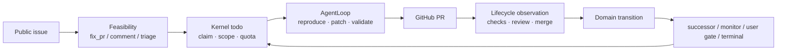
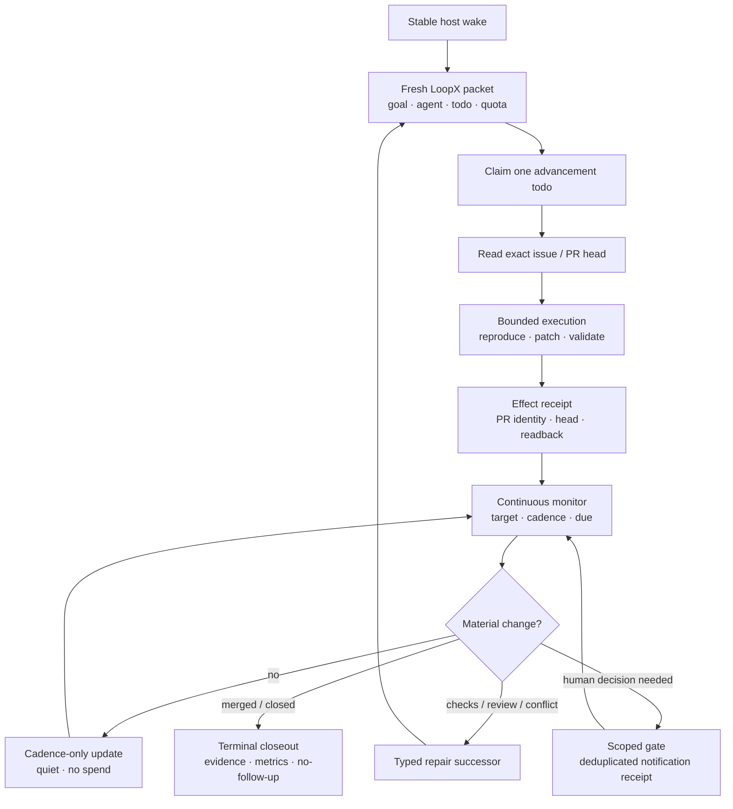
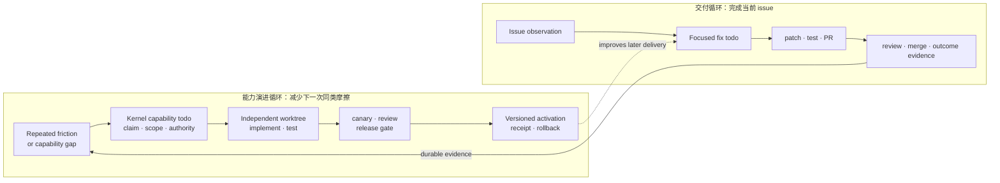
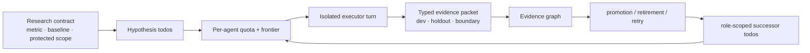
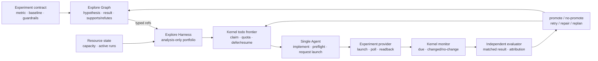
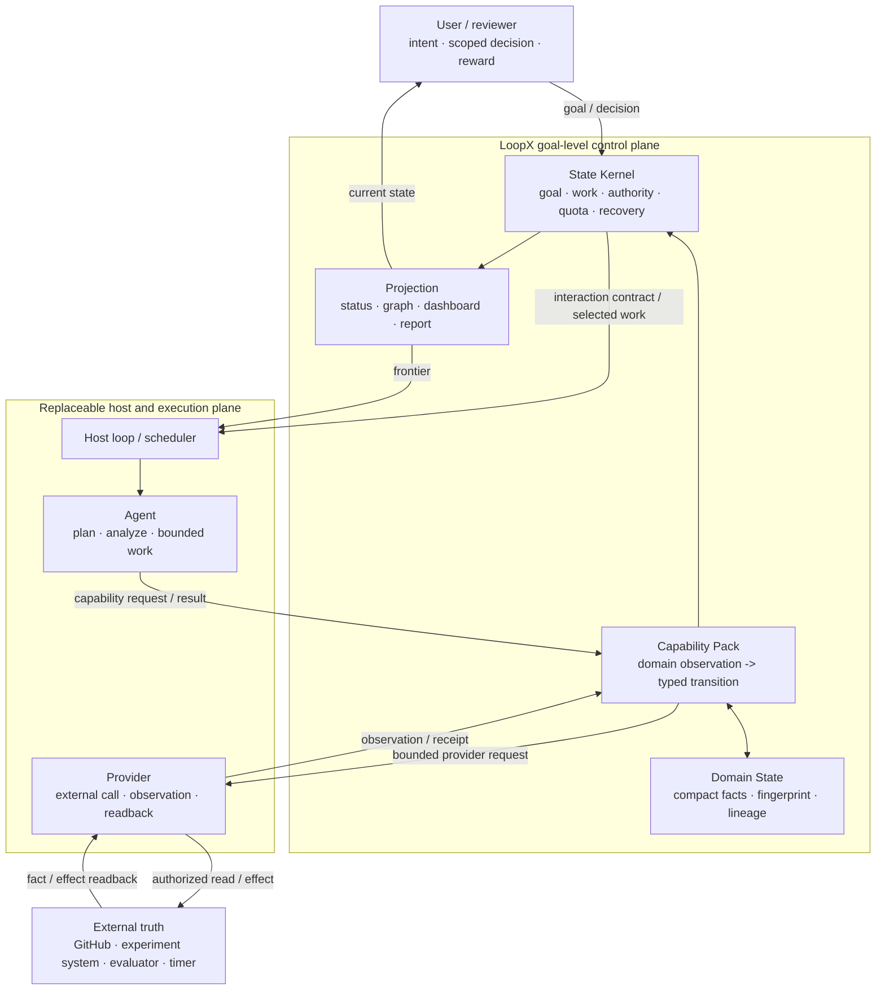
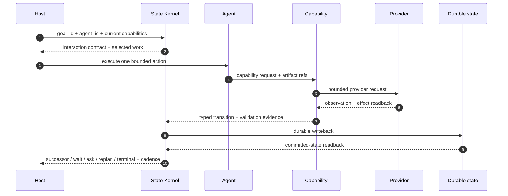
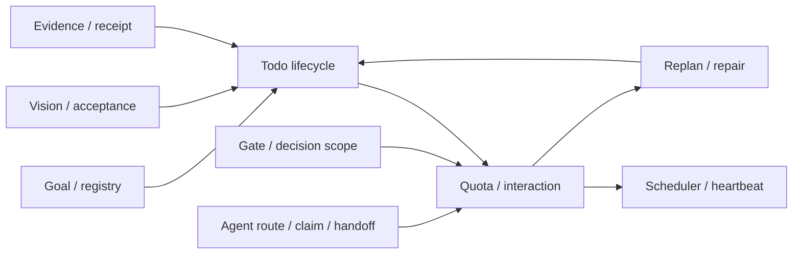

# 第 2 讲：从三个 Showcase 理解 LoopX 架构
> [English](02-goal-control-plane-architecture.md)

> **本讲结论：** LoopX 让不同领域的长程 Agent 复用同一套外置目标、工作、权限、证据与
> 恢复内核。Issue-Fix、Single-Agent Auto ML 和 Multi-Agent Auto Research 的业务状态完全
> 不同，但都把有限模型上下文中的一次执行放进
> `观察事实 -> 领域判断 -> Kernel 决策 -> 有界执行 -> 证据写回 -> 下一轮恢复`。

建议时长：110 分钟。Showcase 50 分钟、架构与生命周期 30 分钟、代码入口 20 分钟、
评审练习 10 分钟。

## 本讲解决什么问题

第一次接触 LoopX 的开发者通常先看到 registry、todo、quota、scheduler、event、domain
state 等大量名词。直接从模块或状态枚举开始，很难回答一个更基本的问题：这些机制为什么
需要同时存在？

答案从模型边界开始：模型只在当前上下文中推理，而 goal 要跨上下文压缩、session、Agent、
host 和外部系统变化继续成立。长程系统因此需要逐层外置控制信息：

```text
prompt / transcript
  -> host-persisted goal objective and lifecycle
  -> project-owned structured control state
  -> per-Turn packet compiled from current state
```

Codex 原生 Goal 已经完成关键的第一步：`thread/goal/set` 把 objective、status 与可选预算绑定到
thread，`thread/goal/get` 允许读回，host 可以围绕它继续 `turn/start`。LoopX 解决的不是
“再存一遍 goal string”，而是原生 Goal 故意没有承担的项目控制状态：todo graph、claim、
scoped gate、effect receipt、跨 host cadence、领域 observation、replan 和 recovery。每轮模型
只接收这些状态派生出的 compact interaction contract，而不是全部历史。

长程 Agent 的困难不只在模型推理。一次模型 turn 结束后，下面的事实仍要继续成立：

- 目标和验收标准没有随聊天上下文消失；
- 外部世界变化后，Agent 能区分“继续做”“等一等”“问人”和“已经结束”；
- 多个 Agent 不会把软认领、执行占用和写权限混成同一个 owner；
- 一次成功调用不会在缺少验证和写回时被误报成进展；
- 失败、重启、换 session 后，下一轮从已提交事实恢复，而不是重猜上一轮发生了什么。

LoopX 解决的是这组 **goal-level control-plane** 问题：无人干预时靠确定性合同跑稳，有人
干预时把反馈写成 scoped decision、路线修订或经验，使下一轮跑得更好。先看三个差异很大的
产品闭环，再从它们共同需要的机制推导架构。

完成本讲后，开发者应该能够：

1. 用 Issue-Fix、Single-Agent Auto ML 和 Auto Research 解释 LoopX 的产品价值；
2. 区分 Agent、Provider、Capability 与 Kernel 四种运行责任；
3. 沿一个领域 observation 找到 Kernel transition 和下一步 work item；
4. 判断一个新 capability 是否复用了内核，还是悄悄创建了第二套控制面；
5. 解释一次交付怎样沉淀为受控的能力演进，而不把 memory、reward 或 runtime 变成隐式 authority。

## 先分清四种运行责任

LoopX 的目录、状态文件和执行角色不是同一个分类维度。读一轮真实执行时，先问四个
owner：

| 角色 | 负责什么 | 不负责什么 |
| --- | --- | --- |
| **Agent** | 通过 host/runtime 完成方案、分析、工具使用和一次有界执行 | goal 的持久生命周期与未授权 effect |
| **Provider** | 外部调用，返回 observation、effect result 与 readback | 领域 transition 与 todo 状态 |
| **Capability** | 调用者结果合同、领域规则、归一化、validator 与 typed transition proposal | claim、gate、quota、scheduler 与 durable write |
| **LoopX Kernel** | todo、claim、gate、monitor、quota、已接受 writeback、恢复与调度 | 领域推理与 provider 实现 |

一次调用有两条方向相反的路径：

```text
执行：Agent -> Capability -> Provider -> external system
控制：Provider readback -> Capability transition proposal -> Kernel
恢复：Kernel -> next todo / gate / monitor / turn -> Agent
```

Domain State、evidence、receipt 和 projection 是这些角色交换或派生的工件，不是第五个
owner。Extension 负责 provider 的安装、启停、升级和分发，也不是第五种运行责任；
host/runtime 承载 session、工具和调用，也不新增领域 decision owner。

## Showcase A：PR Issue Fix

Issue-Fix 的产品承诺是：把一条公开 issue 持续推进成小而聚焦、验证充分、可审阅的 PR，
并跟进到 merged、closed 或明确 no-follow-up。它不是“一次 prompt 生成 patch”，因为真实
交付还包含候选判断、复现、修改、CI、review correction、冲突、通知、等待和终局收口。



### 为什么一个 PR Issue Bot 能跨很多轮稳定运行

一个长期运行的 PR Issue Bot 看起来像在连续工作，实际执行却由许多短 Turn 组成：有的
Turn 修代码，有的只等待 CI，有的发现 review 变化后返工，还有的在外部 effect 状态不确定时
先 readback。下面是一个真实运行案例经过公开安全抽象后的控制链：



这条链没有要求同一个模型上下文一直存活。稳定性来自每个中断点都留下足够的 committed
fact，使下一轮可以重新计算 frontier：

| 运行中断或变化 | 外置合同 | 下一轮为什么不会重猜或重复执行 |
| --- | --- | --- |
| session 结束、host 重启 | stable wake body + 从最新 state 编译的 per-Turn packet | 唤醒入口保持稳定，动态 todo、quota 和 gate 每轮重算 |
| 一个修复正在执行 | advancement todo + claim + bounded write scope | 一次只推进已认领工作，不把等待和执行混在同一条任务里 |
| PR 被作者或 reviewer 更新 | repository、PR number、head SHA 与 observation revision | 复审绑定 exact head；旧结论不会覆盖新 revision |
| CI 和 review 没有变化 | observation fingerprint + `material_change=false` + `next_due_at` | 只更新 cadence，不重复通知、不制造进展，也不 spend |
| checks 失败、review 要求修改或分支冲突 | typed transition + repair/correction successor | 把失败变成可认领的下一步，不靠聊天记住“回来修” |
| 需要人的 review 或批准 | scoped gate + notification effect/readback receipt | 问题、对象和去重 identity 可验证；提醒失败或重试不会变成多次 effect |
| 外部写入结果不确定 | effect receipt + provider readback/reconcile | 先确认外部事实，再决定 retry、successor 或 closeout |
| PR merged、closed 或明确不再跟进 | terminal evidence + no-follow-up rationale | monitor 可关闭，后续 Turn 不会继续轮询已经结束的工作 |

因此，这个 bot 的“稳定执行”不是一段永不中断的推理，也不是一个永不犯错的 Agent。它允许
模型、session、host 和外部系统在边界处失败，但不允许丢失已经确认的事实、effect identity
和下一步恢复路径。长程稳定的目标，是让错误可发现、可归因、可恢复；即使 Agent 犯错，
已提交事实仍然有效，系统仍能形成下一步 frontier。

这也是后续课程的索引：第 3 讲解释 packet 与一次 Turn，第 5 讲解释 claim、successor 和
handoff，第 7 讲解释 monitor cadence 与 quiet wake，第 8 讲解释 evidence、reconcile 和
self-repair。这里先记住一个判断标准：**稳定不是不中断，而是每次中断后都能从外置事实恢复。**

### 一条交付主线，怎样反哺执行系统

真实的长程 Issue-Fix 不只会修复产品代码。连续交付还可能反复暴露同一类系统摩擦：每次都
缺少同一种 observation、同一个 lifecycle rule 经常误判，或者某个 provider 没有稳定
readback。此时合理的下一步不是让当前 Agent 在运行中直接改写自己，而是把 **能力缺口也
变成普通、可认领、可验证的工作**。



这里有两个闭环，但只有一套控制面。右侧交付循环负责当前 issue；左侧能力演进循环把可复用
缺口交付成新版本。两者都经过 todo、claim、scoped authority、验证与 durable writeback。
虚线表示新能力只影响后续交付，不会倒改已经完成的事实。

| 发现了什么 | 可以做什么 | 不能自动做什么 |
| --- | --- | --- |
| reward、用户反馈或 outcome evidence 显示重复摩擦 | 形成带来源、期望结果和 guardrail 的 capability-gap 候选 | 直接创建外部 effect 或宣布新版本可用 |
| memory 找回历史尝试、失败模式与验证结果 | 帮助去重、选方案并补充 evidence lineage | 把旧经验当作当前事实、claim 或 release authority |
| Kernel 接受并认领 capability todo | 在独立 worktree 中修改 core、Capability Pack、extension/provider 或 host adapter | 越过 todo scope 顺手重构无关系统 |
| test、canary、review 与 release gate 通过 | 生成 versioned artifact、activation receipt，并让后续 Turn 使用新能力 | 用“自进化”名义跳过兼容性验证和 rollback |

能力落在哪里仍按 ownership 判断：稳定、provider-neutral 的调用者结果合同进入
Capability Pack；可选或独立版本的实现进入 extension/provider；host 特有的 session、工具
和事件适配留在 host adapter。只有 LoopX 默认必须拥有的通用生命周期规则才进入 Kernel。

因此，“系统能力自进化”不是第七个架构层，也不是模型拥有了修改自身的特权。它是同一条
goal-level lifecycle 管理的一类进阶工作：交付证据发现缺口，Kernel 授权改进，独立执行面
产出候选版本，验证与发布合同决定是否激活，readback 和 guardrail 决定保留还是回滚。

这条链路可以直接映射到四种运行责任：

| 角色 | Issue-Fix 中的实现 |
| --- | --- |
| Agent | 通过 host/runtime 读代码、建 worktree、修改、测试并执行已授权 GitHub 动作 |
| Provider | 读取 repository、checks、review、merge state，并返回操作 readback |
| Capability | 计算 feasibility，把 PR observation 翻译成有限 transition |
| Kernel | 管理 todo、claim、gate、quota、monitor、successor 与 terminal |

Repository / GitHub 仍是外部权威事实源；Issue-Fix Domain State 只保存带稳定 key、
fingerprint 和 lineage 的紧凑工件。

### 一次 PR observation 怎样变成下一步工作

`loopx/capabilities/issue_fix/pr_lifecycle.py` 的 `_decide_transition()` 不直接改 todo，也不
直接调用 GitHub。它把 PR observation 压成 Kernel 能理解的 proposal。下面是保留关键
分支优先级的语义伪代码，不是仓库 API 的逐字摘录：

```python
if state == "MERGED":
    return transition(decision="no_followup", task_class="terminal_transition")
if failing_checks:
    return transition(decision="runnable_successor", task_class="advancement_task")
if review_decision == "CHANGES_REQUESTED":
    return transition(decision="runnable_successor", task_class="advancement_task")
if pending_checks:
    return transition(decision="monitor_continuation")
```

实际代码还处理 draft、branch conflict、已修复并等待 re-review 等状态。这里重要的是返回值
边界：`runnable_successor` 只是建议创建后续工作，`monitor_continuation` 只是建议继续观察，
`no_followup` 只是终局候选。Kernel 仍会检查 todo authority、decision scope、capability、
workspace、quota 和 continuation policy。

低层调用路径可以这样读：

```text
build_issue_fix_feasibility_packet
  -> upsert_issue_fix_feasibility_ledger_jsonl
  -> Kernel writes a normal todo / gate
  -> AgentLoop produces a focused fix and PR
  -> build_issue_fix_pr_lifecycle_monitor_packet
  -> _decide_transition
  -> upsert_issue_fix_pr_lifecycle_ledger_jsonl
  -> Kernel writes successor / monitor / terminal closeout
```

Domain State 的 upsert 会按 `repo + issue_ref` 或 `repo + pr_ref` 保持稳定 identity，并用
observation fingerprint 抑制 unchanged poll。它保存紧凑事实和已验证 receipt，不保存 raw
issue body、raw check log、凭据或本地路径。GitHub 仍是权威来源，Domain State 只负责让
下一轮不必从聊天里重建领域连续性。

完整案例见 [Issue-Fix 能力](../../../loopx/capabilities/issue_fix/README.zh-CN.md) 和
[State Kernel × Domain State 案例](../../../loopx/capabilities/issue_fix/docs/state-kernel-domain-state-case-study.zh-CN.md)。

## Showcase B：Multi-Agent Auto Research

Auto Research 的产品承诺是：多个研究 Agent 围绕同一 research contract 持续提出假设、
执行实验、评价证据并形成 promotion、retirement 或 retry 候选。研究树可以被投影出来，
但不需要一个拥有整棵树的 coordinator agent。



默认角色不是层级，而是写入不同 typed record 的 equal peers：

| Role | 主要产物 | 不能做什么 |
| --- | --- | --- |
| Curator | research contract、metric、protected scope | 选择赢家或修改受保护 evaluator |
| Hypothesis proposer | 有 grounding 和 todo lineage 的 hypothesis | 用同一材料同时声称独立 novelty |
| Executor | 隔离实验、dev/holdout result、evidence packet | 自行 promotion 或隐藏失败尝试 |
| Evaluator / promoter | promotion、retirement、retry candidate | 把 dev-only lift 当成最终证据 |
| Product narrator | public-safe evidence graph 与案例叙事 | 发明指标或改写 source state |

### 没有中央研究经理，研究怎样继续

`run_auto_research_worker_loop()` 只轮询一组可见 lane。每个 worker turn 都重新读取当前
agent 的 quota 和 research frontier，再执行一个被选中的 todo：

```python
for agent_id in agent_ids:
    turn = run_auto_research_worker_turn(
        goal_id=goal_id,
        agent_id=agent_id,
        ...,
    )
if no_lane_has_action:
    stop_reason = "no_runnable_frontier"
```

真正的选择发生在 `load_auto_research_worker_frontier()`：它先调用
`build_quota_should_run(..., agent_id=agent_id)`，再把 rollout evidence 投影成该 agent
可见的 research frontier。worker 不拥有全局 executor queue，也不能因为看见一个假设就
越过 claim 和 quota。

另一端，`build_research_decision_candidates()` 根据 evidence graph 产生有限结果：

| 证据状态 | 下一步 |
| --- | --- |
| dev 改善但缺少 holdout | 创建或暴露 holdout successor |
| holdout 改善且 boundary clean | 进入 promotion review 或满足目标策略 |
| negative / guardrail evidence | 形成 retirement candidate |
| 尝试未计分但可恢复 | 保留 retry candidate 与 artifact ref |
| 无 runnable frontier 且完成条件满足 | quiet completion |

低层调用路径可以这样读：

```text
build_auto_research_preset_summary
  -> role profiles + initial todos
  -> run_auto_research_worker_loop
  -> run_auto_research_worker_turn
  -> build_auto_research_evidence_packet + rollout append
  -> build_research_evidence_graph_from_rollout_events
  -> build_research_decision_candidates
  -> build_auto_research_completion_status
  -> role-scoped successor / promotion gate / quiet completion
```

Auto Research 是建立在通用 multi-agent kernel 上的 thin preset：preset 提供角色、领域默认值
和 successor hints；goal、todo、claim、quota、evidence、handoff 与完成语义仍由 Kernel
拥有。更完整的角色合同见
[Auto Research Lane Contract](../../reference/protocols/auto-research-lane-contract-v1.md)。

## Showcase C：Single-Agent Auto ML

Single-Agent Auto ML 的产品承诺是：一个长期工作的 Agent 围绕稳定的指标和发布边界，
持续提出候选、实现特征或目标函数、发起昂贵的外部实验、等待结果、解释收益，并把正负
证据转成下一轮路线。这里没有多角色协作，困难仍然很大：

- 训练与评估是昂贵、异步、反馈稀疏的外部 effect；
- short/long 等资源池容量有限，候选不能看见就启动；
- baseline、数据窗口、代码 revision 和 evaluator 不一致时，结果不可比较；
- 运行失败可能是基础设施问题，不能被错误归因为模型假设失败；
- no-promote 结果同样有价值，必须关闭近邻方向，避免下一轮重复试错；
- Agent 需要跨数百轮保留假设谱系，却不能把全部日志重新塞进模型上下文。

这个案例把 Explore Graph、Explore Harness 与 Kernel 放进一条真实链路：



图中只有经过 Kernel 接受的 transition 才能改变工作生命周期。Explore Graph 上的
`supports`、`refutes`、`depends_on` 或 `leads_to` 是证据关系，不是执行边；Explore Harness
输出的是候选组合和风险说明，不是 claim、launch 或 spend receipt。

### Graph 记住什么，Harness 计算什么

| 组件 | 输入 | 产物 | 明确不拥有 |
| --- | --- | --- | --- |
| **Explore Graph** | 已验证 hypothesis、experiment、finding 与 typed edge | 可追溯 evidence topology、当前探索 frontier、负向知识 | todo、资源槽、launch、promotion |
| **Explore Harness** | Graph refs、todo 候选、expected evidence、scope conflict、resource capacity | analysis-only branch/portfolio、排序、hazard、可选 suggested commands | claim、lease、provider effect、quota spend |
| **ML Experiment Capability** | metric contract、matched windows、baseline/candidate、guardrail、task readback | compact result、hypothesis ledger、replan/promotion proposal | 通用 lifecycle 与未授权 launch |
| **LoopX Kernel** | 当前 todo/gate/monitor、capability、workspace、receipt、cadence | 合法 frontier、defer/resume、accepted transition、下一次唤醒 | 指标解释与候选科学价值 |

在单角色场景中，Harness 常以 `analysis_only` 工作：它可以指出“当前两个短实验槽最值得
放入哪两类候选”，但不需要也不应该创建 child agent。单个 Agent 读取这个建议后，仍只从
Kernel 领取一个合法 todo；资源不足的候选用 `deferred + resume_when` 表达，运行中的外部
任务用 `continuous_monitor` 表达。

Graph 与 Harness 因而形成互补：

```text
Graph: durable exploration memory
  -> Harness: current evidence/resource-aware proposal
  -> Kernel: legal action selection and authority
  -> Agent + provider: one bounded effect
  -> validator: comparable result and attribution
  -> Graph: append positive, negative, or diagnostic evidence
```

Graph 可以独立开启，只记录探索；Harness 也可以只做临时规划，不写 Graph。两者同时开启
时，仍要保留这条单向 authority 边界。否则一条错误 finding 就可能直接触发昂贵实验，
或者 planner 的高分会被误当成 promotion 证据。

### 一次真实实验怎样跨很多轮稳定推进

下面是一条 public-safe 的运行路径。它保留真实长程实验的控制合同，不包含项目、平台、
任务号、私有路径或生产指标：

1. 用户先确认 primary metric、user/global guardrails、matched baseline、数据窗口和预算；
2. Agent 为候选实现做代码 revision、单测、数据资格和 serving-neutrality preflight；
3. Explore Harness 根据 Graph 中尚未证伪的方向、近邻重复、expected evidence 和资源容量，
   生成 analysis-only portfolio；
4. Kernel 只暴露当前可执行候选；容量不足的 todo 延后，已启动任务转为 monitor；
5. Provider 执行已授权 launch，返回绑定候选、revision、窗口和外部 task identity 的 receipt；
6. 后续 Turn 只在 monitor 到期时 poll；unchanged poll 更新 cadence，不计 material spend；
7. 终态 readback 交给独立 evaluator，先检查可比性，再区分模型结果与基础设施结果；
8. 达到 metric 与 guardrail 的候选形成 promotion proposal；负向结果形成 no-promote evidence；
   基础设施失败形成 repair/retry successor，不能进入模型优劣判断；
9. 新 finding 与 edge 追加到 Explore Graph，Harness 再基于更新后的拓扑提出下一批候选。

这条链路解释了“稳定跑”的来源：模型负责每轮判断和实现，长期连续性来自外置 contract、
todo、资源状态、monitor、receipt、result ledger 与 Graph。换 session 或上下文压缩后，
下一轮不必记住旧对话，只需读取当前合法 frontier 和关联 evidence refs。

### 算法探索与系统能力演进要分开

实验可能发现当前系统缺少一个可复用 feature、reader、evaluator 或在线/离线一致性能力。
这时不能让实验 todo 顺手修改并发布运行系统。合理路径是：

```text
experiment evidence
  -> capability-gap todo
  -> independent implementation and compatibility validation
  -> versioned offline/online artifact
  -> release gate + activation receipt + rollback
  -> later experiments may consume the new capability
```

实验路线回答“哪个候选值得继续”，能力演进路线回答“系统是否应获得一种新能力”。两条路线
可以共享 evidence lineage，但拥有不同 workspace、authority、validator 和 release gate。
Reward Memory 可以帮助回忆历史失败模式或偏好，仍不能替代当前 Graph evidence、Kernel
authority 或 release receipt。

公开的实现入口见 [Domain Capability Packs](../../product/domain-capability-packs.md) 与
[Explore Capability](../../../loopx/capabilities/explore/README.md)。

## 三个 Showcase 共同揭示的架构

Issue-Fix 处理 GitHub 生命周期，Single-Agent Auto ML 处理昂贵异步实验，Auto Research
处理多角色假设与指标证据。三者没有共享业务状态，却共享同一条控制面闭环。四种运行责任
在三个领域中的对应关系如下：

| 责任 | Issue-Fix | Single-Agent Auto ML | Auto Research |
| --- | --- | --- | --- |
| **Agent** | coding agent | one experiment owner lane | research worker lane |
| **Provider** | repository、GitHub、notification | training/evaluation system、artifact store | evaluator、artifact store、public research source |
| **Capability** | feasibility 与 PR lifecycle decision | metric/window contract、result attribution、replan proposal | role defaults、evidence decision、successor rules |
| **Kernel** | patch todo、CI monitor、publish gate | resource-gated todo、task monitor、promotion gate | role todo、per-agent frontier、promotion gate |

Domain State 保存 feasibility、PR lifecycle、experiment result、hypothesis 或 evidence graph
等紧凑连续性；Projection 生成 status、Kanban、frontier 或 report。二者都是工件或 read model，不另行获得
运行 authority。这给出四个关键约束：

1. Provider 可以获取事实或执行已授权动作，但不能自行决定生命周期；
2. Capability 可以增加领域判断，但不能复制 Kernel 的 todo、quota、gate 或 authority；
3. Domain State 可以保存领域连续性，但不能把 observation 直接变成外部 effect；
4. reward、memory 和交付证据可以提出能力缺口，但新版本仍须经过普通 todo、验证、发布、
   readback 与 rollback 合同。

## Goal Control Plane Authority Map

下面的总览图不是源码层次图。它表示事实、决策、执行和回执怎样跨边界流动。



读图时先记住四种运行责任，再看两个工件边界：

1. **Kernel 拥有 goal lifecycle。** Host 被唤醒不等于获得 delivery 权限，一轮结束也不等于
   goal 完成。
2. **Capability 拥有翻译规则。** 它理解 `CHANGES_REQUESTED`、experiment result 或
   holdout metric，但只返回 typed proposal。
3. **Provider 拥有外部 I/O。** 它返回 bounded observation 或 readback，不决定后续 transition。
4. **Agent 拥有有界执行。** 模型和工具负责实现，不把聊天摘要升级成长期事实。
5. **Domain State 保存领域连续性。** 它不拥有 claim、quota、全局 authority 或外部写权限。
6. **Projection 只读。** 看板、图和报告可以提交显式命令，不能靠修改展示文本改变 source state。

## 一次通用 Goal Transition

三个 Showcase 都可以压成同一条生命周期：



关键不变量：

- observation 不是 transition；
- proposal 不是 authority；
- result 不是 accepted result；
- accepted result 在 durable writeback 后才构成进展；
- spend 晚于验证与写回；
- scheduler proposal 在 host apply 并形成 ACK 前仍未结算。

第 6 到第 8 讲会分别展开 quota decision、host scheduler 和 evidence/writeback。第 2 讲只需
确认：这些阶段让长程工作可以被重放、归因和恢复。

## 多个协作状态机，不是一个巨型枚举

LoopX 不把所有业务状态放进一个 `status` 字段。Kernel 维护多个可组合 contract：



领域状态不会加入这张图成为第二套 Kernel。Issue-Fix 把 checks 和 review 翻译成通用 work
transition；Single-Agent Auto ML 把外部 task 与可比较 metric 翻译成 monitor、promotion、
no-promote 或 retry；Auto Research 把 evidence graph 翻译成通用 successor、gate 或
completion。Kernel 只需要计算这些 transition 是否可执行、由谁执行，以及写回后下一轮
怎样恢复。

详细状态体和 legal transition 分别由
[State Definitions](../../product/core-control-plane/state-definitions.md) 与
[State Machines](../../product/core-control-plane/state-machine.md) 维护。

## Host 接入：交换协议，不替换 Runtime

Codex App、Codex CLI 或 managed-agent 平台可以继续拥有 session、actor、tool、workspace、
runtime event、cancel 和 retry。接入 LoopX 时，只需对齐四个面：

| 接入面 | Host 提供 | LoopX 提供 |
| --- | --- | --- |
| Identity | session / actor 与 `goal_id`、`agent_id` 的关联 | goal、agent、todo identity |
| Observation | 新外部事实与当前 capability | canonical state 与 domain transition input |
| Decision | 接收并执行 bounded action | quota、interaction contract、scope、cadence proposal |
| Receipt | result、artifact、effect readback | validation、durable writeback、recovery 与 projection |

如果 host 已拥有某个 Task DAG 的 lifecycle，LoopX 默认只做 projection 与 guard。只有显式
选择 LoopX 为该工作项 controller 并授予 scoped authority 后，LoopX 才写相应 lifecycle。

## 开发者代码地图

第一次读代码时，不要从包目录顺序展开。沿一条产品结果回到共同内核：

| 阅读目的 | 函数级入口 | 代表验证 |
| --- | --- | --- |
| Issue 是否值得形成 fix work | `build_issue_fix_feasibility_packet` | `examples/issue-fix-feasibility-smoke.py` |
| PR observation 怎样变成下一步 | `build_issue_fix_pr_lifecycle_monitor_packet`、`_decide_transition` | `examples/issue-fix-pr-lifecycle-smoke.py` |
| Issue-Fix 领域事实怎样幂等保存 | `upsert_issue_fix_pr_lifecycle_ledger_jsonl` | `examples/issue-fix-workflow-e2e-smoke.py` |
| ML 候选怎样形成默认关闭的 advisory packet | `build_ml_experiment_advisory_packet` | `examples/ml-experiment-domain-pack-smoke.py` |
| Explore evidence 与资源怎样形成只读组合建议 | `build_explore_worker_branch_plan`、`resolve_explore_harness_gate` | `examples/explore-worker-plan-gate-smoke.py` |
| Explore finding 怎样形成可重建拓扑 | `append_explore_result_events`、`build_explore_graph_view` | `examples/explore-result-layer-smoke.py` |
| Auto Research role 怎样声明 | `build_auto_research_preset_summary` | `examples/auto-research-dev-thin-preset-smoke.py` |
| 每个研究 lane 怎样重新进入 Kernel | `load_auto_research_worker_frontier`、`run_auto_research_worker_turn` | `examples/auto-research-worker-turn-smoke.py` |
| 研究证据怎样形成决策 | `build_research_decision_candidates`、`build_auto_research_completion_status` | `examples/auto-research-layered-e2e-acceptance-smoke.py` |
| 通用 Kernel 怎样选择本轮动作 | `build_quota_should_run`、`build_interaction_contract` | 第 6 讲的 quota smokes |
| 一轮结果怎样写回并恢复 | `run_loopx_turn_once`、`refresh-state` | 第 7、8 讲的 transaction / refresh smokes |

这条阅读路线同时覆盖 high-level product loop 和 low-level implementation seam。开发者先问
“这个函数把哪种领域事实翻译成哪种通用 transition”，再看 schema、fingerprint、ordered
rules 和 writeback；这样比从一个大文件逐行阅读更容易辨认真正的 ownership。

## 评审一个新 Capability

面对新的领域 pack、MCP、memory provider、dashboard 或 multi-agent preset，依次问：

1. **External truth**：领域事实来自哪里，稳定 identity 是什么？
2. **Domain State**：哪些紧凑事实需要跨 turn 保存，哪些 raw material 必须留在外部？
3. **Translation**：领域 observation 会产生哪些有限 transition？
4. **Kernel reuse**：todo、claim、gate、quota、scheduler、evidence 和 terminal 是否仍由 Kernel 拥有？
5. **Execution**：谁应用外部 effect，哪些动作需要独立 authority？
6. **Receipt**：如何证明 effect 作用于正确对象，并与 proposal、todo、agent 和 revision 建立 lineage？
7. **Recovery**：重复观察、crash、换 session 或外部状态变化后，从哪里恢复？
8. **Projection**：展示面能否从 source state 重建，是否避免了反向成为事实源？
9. **Evolution**：若交付会反哺系统能力，缺口由什么证据触发，改动属于 core、Capability
   Pack、extension/provider 还是 host adapter，又如何独立验证、版本化激活和回滚？

如果 capability 需要自己维护一套 runnable、ownership、retry、terminal 和 scheduler，它通常
已经偏离 capability 边界，正在形成第二个控制面。

## 课程导航

如果你需要在一小时内先建立“长程任务为什么会跑偏、怎样识别局部循环、何时 retry、
replan 或 self-repair”的整体心智模型，可以先读
[长程任务如何收敛](topic-long-horizon-convergence.md)，再按下面的代码课程深入各层。

| 后续讲次 | Issue-Fix | Single-Agent Auto ML | Auto Research |
| --- | --- | --- | --- |
| 第 3 讲 | 从目标到第一个 fix todo | 从候选到一次 bounded experiment Turn | 从 research question 到初始 role todo |
| 第 4 讲 | feasibility / PR lifecycle 与 Kernel state | task/result ledger、Graph 与外部事实 | evidence event、graph 与 projection |
| 第 5 讲 | patch successor、monitor、review handoff | launch、monitor、evaluate、replan 工作图 | role claim、lane successor、equal peer |
| 第 6 讲 | checks pending 为何 quiet | capacity/defer 与 promotion gate | per-agent frontier 与 promotion gate |
| 第 7 讲 | PR monitor cadence 与外部 readback | training/eval monitor 与分层 backoff | worker loop、no-action 与重新唤醒 |
| 第 8 讲 | validation、notification receipt、terminal | 模型证据、infra diagnosis、no-promote | dev/holdout evidence、retirement、completion |
| 第 9、10 讲 | lifecycle rule 与 PR delivery oracle | experiment contract 与 promotion oracle | evidence rule 与独立 oracle |
| 第 11 讲 | Capability Pack 与 Domain State | ML pack + Explore Graph/Harness | thin preset 与 multi-agent 产品层 |

## 课后检查

1. 为什么 `CHANGES_REQUESTED` 不应直接修改 Kernel todo？
2. 为什么 Auto Research 可以没有一个拥有整棵研究树的 coordinator？
3. Issue-Fix 的 PR lifecycle 与 Kernel todo lifecycle 分别拥有什么？
4. Explore Graph 与 Explore Harness 为什么都不能直接 launch experiment？
5. 外部训练任务失败时，怎样判断它是模型证据还是基础设施诊断？
6. dev metric 提升后，为什么 executor 不能自行 promotion？
7. 一个新 capability 至少需要定义哪些 identity、transition、receipt 和 recovery contract？

下一讲沿同一条共同生命周期运行第一次真实 Loop：用户只表达目标后，guided start、todo、
heartbeat、quota、writeback 和 spend 怎样串成可恢复闭环。
