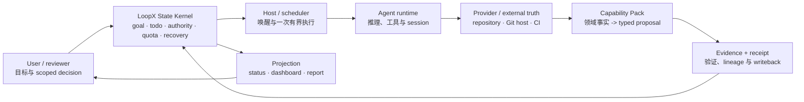

# 概念导读：先把 LoopX 放进一张图

> **导读结论：** LoopX 是长程 Agent 的控制面。它不替代业务系统、领域专家或执行工具，
> 而是让一个跨多轮、多 Agent、多外部系统的目标持续知道：事实是什么、谁能做什么、
> 下一步何时运行、什么证据允许继续，以及失败后从哪里恢复。

建议时长：25 分钟。本导读面向第一次接触 LoopX 的读者；读完后再进入
[第 0 讲](00-goal-control-plane-architecture.md)的架构和代码路径。

## 先从数据面与控制面开始

假设一个开源项目让 Agent 持续把公开 issue 推进成可审阅的修复 PR。它需要判断 issue 是否
可行动、读取代码、复现问题、在独立 worktree 修改、运行测试，并跟进 CI、review 与 merge。

两类系统承担不同责任：

| 平面 | 回答的问题 | 典型对象 |
| --- | --- | --- |
| 数据面 / execution plane | 具体读写、测试、构建、review 或合并怎样执行？ | repository、Git host、CI service、runtime、provider API |
| 控制面 / control plane | 为什么现在做这一步，谁有权做，完成后怎样继续？ | goal、todo、gate、quota、scheduler、evidence、receipt |

代码仓库最清楚当前提交，Git host 最清楚 issue、review 与 merge state，CI 服务最清楚检查结果。
它们继续拥有领域权威事实。LoopX 不复制这些系统，而是记录为什么观察它们、
哪个结果满足哪个验收条件，以及下一轮应继续、等待、询问、重规划、修复还是结束。

一句话区分两者：

```text
数据面执行工作；控制面组织工作的生命周期。
```

## 一张总图



这不是一条永远顺利的流水线。每次 writeback 后，Kernel 都要根据新事实重新决定：

```text
continue | wait | ask | replan | repair | terminal
```

## 第一组概念：目标与工作

### Goal 不是一条 prompt

**Goal** 是跨 session 持续存在的目标边界。它至少需要说明：

- 期望结果和验收标准；
- 不允许越过的权限、成本或安全边界；
- 当前可用的 capability 和资源；
- 哪些事实仍不确定；
- 怎样判断已经完成或应停止。

聊天记录可以帮助理解 goal，但不能作为唯一事实源。session 结束、模型更换或上下文压缩后，
goal lifecycle 仍应可恢复。

### Todo 不是普通 checklist

**Todo** 是工作图中的一个有身份对象。它可以表示：

- 当前可执行的 advancement work；
- 等待外部变化的 monitor；
- 需要明确决定的 user action；
- 前一步成功后才出现的 successor；
- terminal closeout 前必须满足的证明。

Todo 之间可以有依赖、归属、证据和 continuation 关系。勾选一项并不自动证明 goal 完成；
Kernel 还要检查它是否提交了预期 transition，以及是否仍有未满足的 acceptance。

### Frontier 是“此刻可能推进的边界”

**Frontier** 不是所有 todo 的列表，而是结合依赖、claim、gate、capability、quota 和新鲜度后，
当前 Agent 真正可见、可运行或需要等待的工作集合。多个 equal peer 可以看到不同 frontier，
而不需要一个长期拥有全局上下文的中心 Agent。

## 第二组概念：能力与实现

### Capability 按调用者结果命名

**Capability** 是稳定的调用者合同：输入什么，承诺产生什么结果，需要哪些证据，可能怎样失败。

例如，“判断 issue 是否适合形成修复 PR”是 capability；“调用 Git host CLI”通常只是实现机制。前者对调用者有
独立价值，后者应由 provider 或内部 helper 承担。

### Provider 是具体实现者

**Provider** 连接真实系统并实现 capability，例如 repository host、通知服务、Git host 或
CI service。Provider 可以替换，但必须保留 capability 的输入、结果、错误和 receipt 合同。

外部系统仍是事实源。Provider 应读取、执行并返回 bounded observation，不应悄悄维护第二套
goal、todo 或 quota 状态机。

### Extension 是交付边界

**Extension** 是可独立安装、升级、启停或分发的 provider 包。它可以实现已有 capability，
也可以携带只属于自己的命令和生命周期。

不要为了让一个 extension 可安装就虚构 capability。只有当 LoopX 调用者真的需要一个
provider-neutral 的稳定结果合同时，才应把它提升为公共 capability。

### Capability Pack 与 Domain State

**Capability Pack** 理解领域 observation，并把它翻译成有限的 typed proposal；
**Domain State** 保存紧凑、稳定、有 lineage 的领域连续性。

它们都不能替代 Kernel：

- Capability 可以建议创建 successor，不能绕过 todo authority 直接分配工作；
- Domain State 可以保存 PR lifecycle observation，不能因为单项检查通过就自行获得 merge 权限；
- Provider 可以执行已授权 effect，不能把调用成功冒充 goal 完成。

## 第三组概念：执行与时间

### Agent、runtime 与 host

这三个名词解决不同问题：

| 对象 | 主要责任 |
| --- | --- |
| Agent lane | 工作和证据归属于谁，可看见哪部分 frontier |
| Runtime | 使用哪个模型、工具、session 和执行环境完成一次推理 |
| Host | 怎样启动 runtime、提供 capability、执行 effect、回收进程并返回结果 |

Agent 是控制面身份，不等同于某个固定模型或进程。更换 runtime 不应改变 todo 的归属、授权
或证据 lineage。

### Turn 是一次有界动作

**Turn** 从一份带版本和 lineage 的只读 snapshot 开始，完成一个有界判断或动作，返回 typed
result。它不是整个长期任务。

一次 Turn 可以：

- 读取当前 frontier；
- 选择并执行一项已授权工作；
- 观察外部事实；
- 形成 proposal、evidence 或 receipt；
- 写回后结束。

下一 Turn 应重新读取 canonical state，而不是默认继承上一次模型的记忆。

### Scheduler 与 heartbeat 只负责“何时再看”

**Scheduler** 管理 cadence、due time 和 stateful backoff；**heartbeat** 是 host 的周期唤醒入口。
它们不决定业务上该发布、晋级或结束，也不会因为被唤醒就自动获得写权限。

典型过程是：

```text
Kernel 提议下一次 cadence
  -> host 应用 RRULE / timer
  -> host readback 实际值
  -> ACK 绑定当前 proposal
  -> 到期后 heartbeat 重新读取状态
```

“timer 已更新”“Agent 被唤醒”“本轮没有动作”是三种不同事实。

## 第四组概念：权限与占用

### Claim、lease 与 gate 不是同一种约束

| 概念 | 回答的问题 | 典型生命周期 |
| --- | --- | --- |
| Claim | 这项工作由哪个 Agent lane 接手？ | 可交接、释放或完成 |
| Lease | 当前执行窗口是否被占用，何时过期？ | 短期、可续租、可回收 |
| Gate | 哪个 scoped decision 尚未满足？ | 由对应 authority 明确解决 |

Claim 不自动授予生产写权限，lease 不代表长期 ownership，普通 user todo 也不自动冻结整个 goal。
Gate 必须带清晰 scope；若 scope 缺失，应修复投影或状态，而不是猜测它约束所有 Agent。

### Authority 决定谁能提交哪种 transition

LoopX 将“能看见”“能提出 proposal”“能执行 effect”“能提交 terminal”分开。一个 Agent 可以
有能力分析发布风险，却没有权执行发布；host 可以执行 API 调用，却不能自行扩大 proposal scope。

这种区分使人工审批可以只约束不可逆步骤，而不阻塞其他可验证工作。

## 第五组概念：事实、证明与视图

### Evidence 证明判断所依赖的事实

**Evidence** 可以是测试结果、指标、版本、diff、外部状态或经过裁剪的日志摘要。高质量 evidence
应说明 source、lineage、时间、新鲜度和适用范围。

“命令返回 0”通常只能证明进程退出成功，不能证明业务效果已发生。

### Effect receipt 证明外部动作确实发生

**Proposal** 表示准备做什么；**effect receipt** 表示哪个 provider 在什么目标上实际做了什么，
并绑定 proposal identity。必要时还要 readback 外部系统的最终状态。

```text
proposal -> authority check -> provider effect -> readback -> receipt -> state commit
```

如果进程在 effect 成功后、receipt 写回前崩溃，稳定 identity 和幂等规则应让恢复逻辑先 reconcile，
而不是盲目重复动作。

### Canonical state 与 projection

**Canonical state** 是可重放的生命周期事实；**projection** 是从这些事实生成的 status、dashboard、
报告或通知。

Projection 可以针对不同角色重新组织信息，但不能反向成为第二套真相。发现 dashboard 与 CLI
状态矛盾时，应修 projection 或 source contract，而不是手工修改两个地方让它们暂时一致。

## 第六组概念：路线与系统修复

### Replan 修路线

当新证据表明原路线不可行、长期无实质推进、候选空间耗尽或 acceptance 改变时，**replan** 更新
vision/frontier。它回答：“目标不变或已修订的情况下，下一条合理路线是什么？”

重试同一个失败动作、延长 monitor 或改写一段说明都不自动构成 replan。

### Self-repair 修控制面或 Agent 行为

当问题来自状态投影漂移、错误 attribution、缺失 scope、adapter 合同破坏、重复无效动作或
Agent 持续违反运行协议时，**self-repair** 修的是系统规则、状态或行为合同。

它不能通过降低 gate、丢弃矛盾证据或把失败标成完成来恢复运行。

## 一个中性的端到端例子

下面用 LoopX 的公开 Auto PR Issue Fix 场景串起这些概念。

1. 用户把“为公开 issue 形成小而聚焦、验证充分的修复 PR，并跟进到明确终局”写成 goal，
   同时声明允许的仓库、写入范围和 merge authority。
2. `issue-feasibility` capability 读取 issue 与 repository context，判断它应进入 `fix_pr`、
   `comment`、`triage` 或 `no_followup`。Domain State 保存稳定 issue identity、紧凑 observation 和
   fingerprint，不复制 raw issue body。
3. Kernel 根据 feasibility proposal 创建修复 todo。Agent lane claim 后，runtime 在一次 Turn 中
   复现问题、定位 owner，并给出变更与验证计划；claim 只表示工作归属，不自动获得 merge 权限。
4. Repository provider 在独立 worktree 应用聚焦修改并运行本地验证。Commit 与测试 evidence 写回后，
   host 才执行已授权的 push/create-PR effect，并记录与 proposal 绑定的 receipt。
5. PR 进入 monitor。Scheduler 在 checks 或 review 可能变化时再次唤醒；monitor 只刷新 Git host 的
   权威 observation，不把“仍在等待”冒充进展，也不重复创建 PR。
6. 若 CI 失败，Capability Pack 产生 runnable repair successor；若收到 `CHANGES_REQUESTED`，则创建
   review correction successor；若 checks 尚未结束，则保留 monitor continuation。
7. 当 exact head 的 checks 和 review 满足验收时，merge proposal 仍受 scoped authority gate 约束。
   其他不依赖该 gate 的工作可以继续，Agent 不能因为 CI 绿色自行扩大权限。
8. 获得批准后，host 执行 merge，Git provider readback merged commit，并把 effect receipt 写回
   canonical state。若 merge 已发生但 writeback 中断，恢复过程先 reconcile，而不是再次 merge。
9. `MERGED`、issue closed 或明确 no-follow-up observation 触发 terminal closeout。Status、dashboard
   和报告都从同一组 canonical state 与 evidence 重建。

这条链路里，repository、Git host 和 CI 决定外部事实；Capability Pack 解释这些事实；
Kernel 决定生命周期；host/runtime 完成一次有界执行；scheduler 决定何时再观察。

## LoopX 不负责什么

理解边界与理解能力同样重要。LoopX 不会自动提供：

- 正确的 issue 优先级、修复方案或风险接受标准；
- 对任意外部系统可靠的 provider；
- repository access、merge authority 或安全例外；
- Agent 输出天然可信的保证；
- 用一个通用状态机消除所有领域差异；
- 在 evidence 不足时替用户做高风险价值判断。

LoopX 提供的是让这些能力可以被组合、约束、观察和恢复的共同内核。

## 带着六个问题进入后续课程

之后阅读任何一讲或评审一个控制面改动，都先问：

1. 事实由谁拥有？
2. 哪个对象把 observation 翻译成 proposal？
3. 谁有权执行和提交 transition？
4. 什么 evidence 或 receipt 证明它发生了？
5. 下一轮为何是 continue、wait、ask、replan、repair 或 terminal？
6. 崩溃、重复、超时或证据冲突时怎样恢复？

## 阅读导航

| 想继续理解的问题 | 对应课程 |
| --- | --- |
| Kernel、Capability Pack、Domain State 怎样分层？ | [第 0 讲](00-goal-control-plane-architecture.md) |
| 一个 goal 第一次怎样真正跑起来？ | [第 1 讲](01-first-real-loop.md) |
| registry、event、active state、projection 各自拥有什么？ | [第 2 讲](02-state-substrate.md) |
| todo、claim、lease、gate 和 equal peer 怎样组合？ | [第 3 讲](03-work-graph-and-peers.md) |
| should-run 为什么会返回 deliver、wait、ask、repair 或 quiet？ | [第 4 讲](04-quota-decision-kernel.md) |
| scheduler、heartbeat、RRULE 和 ACK 的边界是什么？ | [第 5 讲](05-host-scheduler-and-heartbeat.md) |
| evidence、replan 和 self-repair 何时触发？ | [第 6 讲](06-evidence-refresh-and-self-repair.md) |
| 怎样实现和验证一条新的控制面规则？ | [第 7 讲](07-engineering-a-control-plane-rule.md) |
| 自主 Agent 交付需要哪些分层质量门禁？ | [第 8 讲](08-autonomous-agent-quality-gates.md) |
| Extension、Explore 与领域产品怎样复用 Kernel？ | [第 9 讲](09-extension-layer.md) |

完成导读后，从[第 0 讲](00-goal-control-plane-architecture.md)开始按真实代码路径学习。
