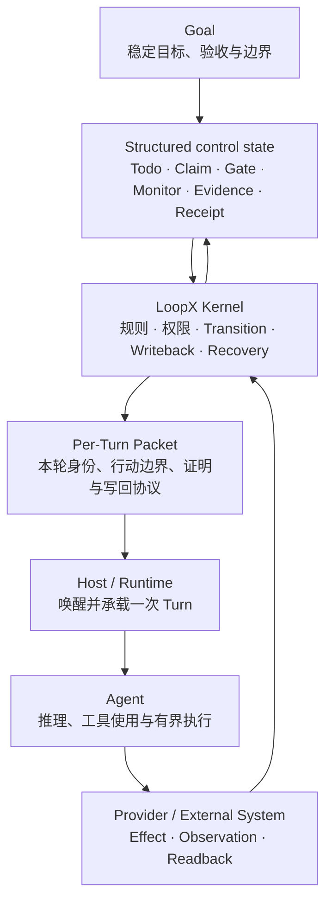

# Goal、Control State、Kernel 与 Packet：初学者心智模型
> [English](goal-control-state-kernel-packet-mental-model.md)

> **结论：** Goal 给出稳定方向，structured control state 记录当前动态局面，Kernel
> 校验并提交合法的状态迁移，Packet 把当前局面编译成 Agent 这一轮可以执行的行动协议。

这四个名称不是四个并列模块，也不是四份状态。最简单的记法是：

```text
Goal：要去哪
Structured control state：现在走到哪、谁能做什么
Kernel：按照什么规则继续走并正式记账
Packet：这一轮具体走哪一步
```

## Goal 不是所有状态的总和

狭义的 Goal 通常只保存相对稳定的内容：

- goal identity；
- objective 与 acceptance；
- boundary 与 authority；
- active、complete 等整体生命周期。

围绕 Goal 不断变化的 todo、claim、gate、monitor、evidence、receipt 和 run lineage，属于
**goal 作用域下的 structured control state**。日常口语里如果把 `goal state` 泛指这两部分，
可以说它代表这个目标的整体状态；在读 schema 和代码时则应把稳定 Goal 与动态 control state
分开。

```text
某个 Goal 作用域下的控制状态
├── Goal：稳定目标、验收与边界
├── Todo：当前工作与依赖
├── Claim / lease：谁负责、占用是否有效
├── Gate：正在等待谁批准什么
├── Monitor：等待哪个外部变化、何时再观察
├── Evidence / receipt：结论与外部 effect 的证明
└── History / recovery：怎样走到这里、中断后如何继续
```

## 四者分别是什么

| 名称 | 是什么 | 主要内容或职责 | 不是什么 |
| --- | --- | --- | --- |
| Goal | 稳定方向锚点 | objective、acceptance、boundary、authority、goal lifecycle | 全部动态工作状态 |
| Structured control state | Goal 作用域下的动态总账 | todo、claim、gate、monitor、quota、evidence、receipt、lineage、recovery | 原始 transcript 或外部系统的复制品 |
| Kernel | 状态迁移与恢复引擎 | authority 校验、transition 接受、writeback、replay、closeout | 状态文件、领域推理器或 Provider |
| Packet | 一次 Turn 的行动协议 | identity、selected work、允许/禁止动作、proof boundary、next command、writeback contract | 长期事实源或全部历史 |

Kernel 不是状态本身，而是管理通用生命周期、校验写入并使状态可恢复的规则引擎。Packet
也不是第二份状态，它只是从当前状态生成的一次性只读投影：Packet 丢失可以重建，canonical
state 丢失则可能无法正确恢复。

外部系统仍然拥有各自的权威事实。例如 repository 拥有当前代码，Git host 拥有 PR 与
review 状态，CI 拥有检查结果。LoopX 保存的是：为什么观察这些对象、观察结果支持哪个判断、
哪个 transition 已被接受，以及下一轮应怎样继续。

## 完整闭环



按执行顺序理解：

1. Goal 提供长期方向、验收标准和边界。
2. Structured control state 保存当前工作前沿、权限、等待和证据。
3. Kernel 联合 Capability 规则，读取当前状态和新鲜外部 observation，判断合法下一步。
4. CLI 将判断投影成本轮 Packet。
5. Host 唤醒 Runtime 中的 Agent；Agent 按 Packet 完成一次 bounded Turn。
6. 外部 effect 由已授权的 Host/Provider 执行，并通过 readback 取得实际结果。
7. Result、evidence、proposal 和 readback 不能直接改状态；Kernel 验证后才接受 transition。
8. 下一轮重新读取状态并生成新 Packet，不能默认继承上一轮 Packet。

## Packet 由什么生成

Packet 不是只从一条 Goal objective 生成，而是组合：

```text
稳定 Goal
+ 当前 Todo / Gate / Monitor / Claim
+ 当前 Agent identity 与 workspace scope
+ authority 与 quota
+ 已验证 Evidence / Receipt
+ 新鲜的外部 Observation
+ Kernel 与 Capability 规则
```

然后压缩成本轮有限上下文可以安全消费的工单。下面是概念示例，不是具体协议的完整 schema：

```yaml
packet:
  goal: 修复 issue #42 并推进到明确终局
  selected_todo: 检查 PR #88 当前 head 的 CI
  agent_lane: pr-maintainer
  allowed:
    - 读取 checks 和 review
  forbidden:
    - 重复创建 PR
    - 未经批准 merge
  transitions:
    pending: 继续 monitor
    failed: 创建 repair successor
    passed: 检查 review 与 merge authority
  writeback:
    - observation
    - evidence_ref
    - next_monitor_time
```

Packet 必须足够薄，避免把全部历史塞回模型；也不能薄到遗漏 identity、authority、required
proof 和 writeback。它是过程协议，不是普通提示词摘要。

## 一次 Auto PR Issue Fix Turn

假设 Goal 是：

```text
修复公开 issue #42，形成小而聚焦、验证充分的 PR，并推进到明确终局。
```

当前 control state 已经记录：PR #88 已创建，当前 head 是 `abc123`，由 `pr-maintainer`
负责，CI 仍在运行，merge authority 属于用户。Kernel/CLI 因此生成一份 monitor Packet：

```text
检查 PR #88 的 exact head abc123；
只读取 checks 和 review；
不要重复创建 PR，不要未经授权 merge；
pending 时继续 monitor，failed 时提出 repair successor。
```

Host 唤醒 Agent，Provider 从 Git host 读回：

```text
PR 当前 exact head：abc123
CI：FAILED
失败检查：linux-path-test
```

Capability 将 observation 解释成 proposal：完成本次 monitor observation，并创建 runnable
repair successor。Kernel 再检查 observation identity、Agent scope、successor 合法性、authority
与 lineage；验证通过后才正式更新 control state：

```yaml
todos:
  - id: monitor-pr-88
    status: completed
    result: CI_FAILED
  - id: repair-linux-path-test
    status: open
    predecessor: monitor-pr-88

evidence:
  head: abc123
  failed_check: linux-path-test
```

Goal 的 objective 没有改变；改变的是它下面的动态工作前沿。下一轮 Packet 会选择
`repair-linux-path-test`，要求复现、修改、验证和受控 writeback。

## 每轮通常改变什么

| 对象 | 变化频率 | 一轮结束后通常怎样变化 |
| --- | --- | --- |
| Goal objective | 最稳定 | 通常不变；只有用户改变目标或存在明确的目标修订 authority 时才改 |
| Goal lifecycle | 低频 | acceptance audit 后可能由 active 变为 complete |
| Control state | 持续变化 | todo、claim、gate、monitor、evidence、receipt 和 lineage 更新 |
| Packet | 每轮重建 | 本轮结束即失效；下轮从最新状态重新生成 |
| Transcript | 本轮临时 | 可被压缩或丢弃，只提取经过验证且影响后续决策的事实 |

Replan 通常也不会随意改写最终 objective。它先修订路线、vision checkpoint 或当前 frontier：

```text
稳定 Goal：把 issue #42 推进到明确终局
旧路线：直接复现并修复
新路线：先请求缺失的复现信息，再决定 fix_pr、comment 或 no_followup
```

如果需要扩大仓库范围、改变验收标准或获得 merge 权限，应形成明确的 user/owner decision，
而不是由 Agent 以“重新规划”为理由自行扩权。

## Result 为什么不能直接成为状态

Agent 说“CI 已通过，建议合并”只是 result 或 proposal，不是 canonical truth。完整路径应是：

```text
Agent result
  -> Provider 读取 Git host
  -> 确认 exact head 的 CI 与 review
  -> Capability 验证领域规则并形成 merge proposal
  -> Kernel 检查 merge authority、lineage 和既有 receipt
  -> Host 执行已授权 merge
  -> Provider readback merged commit
  -> Kernel 接受 receipt 并更新 canonical state
```

这条路径可以处理最危险的中断窗口：外部 merge 已成功，但本地 writeback 尚未完成。恢复时先
readback/reconcile，再补记 receipt，不能重复 merge。

## 一句话检查理解

准确的表述是：

> Goal 提供稳定方向，Goal 对应的 structured control state 保存动态局面。Kernel 联合
> Capability 根据目标、当前状态和新鲜外部事实生成 Packet。Host 唤醒 Runtime 中的 Agent，
> Agent 按 Packet 完成一次 Turn。结果经过 evidence、Provider readback 和 authority 验证后，
> 由 Kernel 接受为状态迁移并更新 control state，再生成下一轮 Packet；只有整体完成或获得
> 明确的目标修改授权时，Goal 本身的生命周期或内容才会变化。

更短的记忆版是：

```text
Goal 给方向，State 记局面，Kernel 管迁移，Packet 发工单。
```
