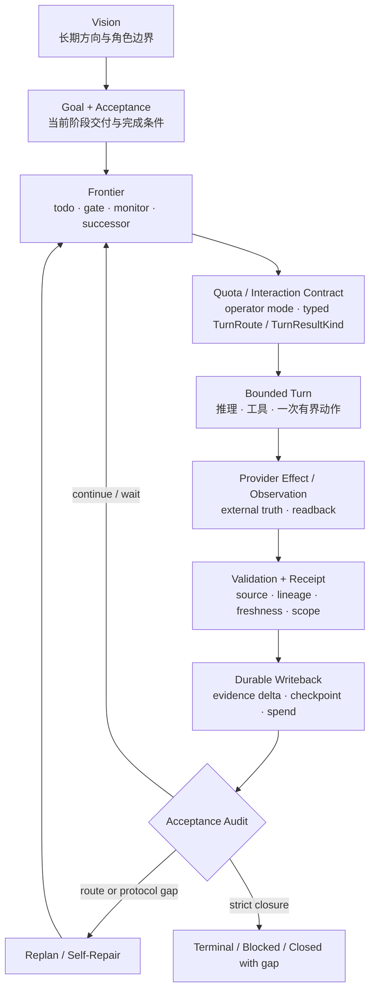

# 专题讲：长程任务如何收敛：不跑偏、不陷入局部循环
> [English](topic-long-horizon-convergence.md)

> **本讲结论：** 长程任务的稳定性不来自一次更长的推理，也不来自让 Agent 永远保持活跃。
> 它来自一组跨 Turn 持续成立的收敛合同：方向由 Vision、Goal 与 Acceptance 约束，工作由
> Frontier 选择，外部动作由 Authority 与 Receipt 约束，进展由 Durable Evidence Delta
> 定义；当证据不再增加或路线失效时，系统进入 Wait、Replan 或 Self-Repair，而不是重复
> 同一个动作。

建议时长：60 分钟。问题定义 8 分钟、核心闭环 12 分钟、防跑偏 10 分钟、防循环 12 分钟、
双 Showcase 回放 10 分钟、接入边界与问答 8 分钟。

本讲是一篇可以独立分享的课程专题。第一次接触 LoopX 的读者不必先读完第 1 到第 11 讲；
需要补充概念时可回到[概念导读](00-concept-primer.md)，需要进入实现时再沿本讲末尾的阅读
路线下钻。

## 这堂课回答什么

“长程、复杂任务如何不跑偏、不陷入局部循环”包含两个不同问题：

1. **方向问题**：Agent 做了很多局部正确的事，当前 Todo 却逐渐替代了原始目标；
2. **活性问题**：Agent 没有偏离目标，却在同一失败、同一等待或同一类候选上重复消耗。

两者不能只靠更好的 prompt 解决。Prompt 可以提醒当前模型，但不能保证提醒跨 session、
runtime、Agent handoff 和外部状态变化继续成立。也不能仅靠一个终点 Judge 解决：
Judge 可以判断“是否完成”，却未必能告诉下一轮“路线为什么失效、应该改变什么”。

本讲完成后，开发者应该能够：

1. 区分目标漂移、局部循环、合法重试、外部等待与探索收缩；
2. 解释为什么 Turn 是执行窗口，Accepted Transition 才是进展单位；
3. 用方向、权限、证据、Delta、活性和终局六条不变量审查长程系统；
4. 解释 Replan、Self-Repair、Monitor Backoff 和 Explore 各自解决哪类停滞；
5. 解释 successor todo 怎样把局部完成接回 Goal，而不是制造无限任务链；
6. 把 PR Issue Fix 与 Auto Research 映射到同一套收敛闭环；
7. 判断 LoopX、领域 Capability、Provider、Evaluator 与现有 Agent Runner 分别必须提供什么。

本讲不承诺：

- 给任意模糊目标自动生成正确验收标准；
- 让模型的每次方案判断都正确；
- 用一个通用 planner 替代领域 evaluator；
- 让 Graph、Harness、scheduler 或 supervisor 获得隐藏的执行权限；
- 把“运行时间更长”直接解释为“结果质量更高”。

## 一小时讲授路线

| 时间 | 主问题 | 讲授产物 |
| --- | --- | --- |
| 0-8 分钟 | 什么叫跑偏，什么叫局部循环？ | 四类运行状态与两个反例 |
| 8-20 分钟 | 多个短 Turn 怎样构成一个长程闭环？ | 一张总图与六条不变量 |
| 20-30 分钟 | 怎样约束方向而不冻结计划？ | Vision -> Goal -> Acceptance -> Frontier / Successor |
| 30-42 分钟 | 怎样识别空转并退出局部最优？ | Evidence Delta、Backoff、Replan、Self-Repair |
| 42-52 分钟 | 同一机制怎样覆盖工程交付与研究探索？ | Issue Fix / Auto Research 并行回放 |
| 52-60 分钟 | 怎样嵌入现有 Runner，哪些能力仍不成熟？ | 最小接入合同、能力边界与问答 |

讲授时只保留一张主闭环图，并选择两到三段核心伪代码解释状态怎样移动。真实文件路径、
完整 CLI 细节和扩展实验留在课后材料，避免把这一小时讲成模块目录巡礼。

## 前置知识：先把 LoopX 的核心抽象放对位置

这一节可以作为课前材料，也可以占用开场后的 5 分钟。理解 LoopX 不需要先记住所有 CLI，
但要先区分三类东西：

```text
方向与完成条件：
  Vision -> Goal -> Acceptance

长期控制状态：
  Todo / Frontier -> Claim / Authority -> Evidence / Receipt
  Domain State -> 某个 Capability Pack 的领域连续性

本轮执行协议：
  Quota / Interaction Contract -> Turn -> Scheduler
```

它们分别解决“为什么做”“现在合法做什么”“这一轮怎样执行”。把三层混在一起，通常会
出现两类错误：

- Runner 用一段 prompt 同时保存目标、计划、权限和历史，session 一换就失去事实源；
- Kernel 试图理解所有领域细节，最后既复制 evaluator，又难以支持新的项目。

### 十个抽象的最小背景

| 抽象 | 它拥有的事实 | 它不负责什么 |
| --- | --- | --- |
| Vision | 长期方向、角色边界、路线何时应重新审视 | 不选择当前动作 |
| Goal | 当前阶段 objective、scope 与 stop condition | 不等同于 Todo 列表 |
| Acceptance | 什么证据允许宣称阶段完成 | 不替代 validator |
| Todo / Frontier | 当前工作身份、owner、gate、monitor、successor | 不自行修改 Goal |
| Claim / Authority | 谁可处理工作，谁可执行哪类 effect | 不证明 effect 已发生 |
| Evidence / Receipt | observation、revision、scope、effect 与 lineage | 不自动授予下一步权限 |
| Domain State | 某个 pack 的紧凑领域 observation、判断与稳定 identity | 不拥有 quota、claim、permission 或外部真相 |
| Capability / Provider | 领域事实归一化；外部 effect 与 readback | 不拥有通用 lifecycle |
| Quota / Interaction Contract | 将当前状态编译为本轮 operator-facing mode（deliver / wait / ask / repair / quiet 等简述）；typed Turn 见 `LoopXTurnRoute` / `LoopXTurnResultKind` | 不执行 Agent runtime |
| Turn / Scheduler | 一次有界执行；决定何时再次唤醒 | 不把“被唤醒”当成进展 |

其中 Capability 与 Provider 容易混淆：

```text
Provider:
  "PR head-A 的 checks 是 failed，外部任务 run-17 已 terminal。"

Capability:
  "这条 observation 应形成 diagnostic successor，
   或形成 matched result / infra failure / promotion candidate。"

Kernel:
  "谁能 claim，是否有 quota，是否需要 gate，
   transition 怎样 writeback，何时再唤醒，能否 terminal。"
```

### Domain State：垂域里的语义锚点

通用 Kernel 知道一个 Todo 是否 runnable、谁 claim、何时 monitor，却不应该硬编码
`CHANGES_REQUESTED`、matched baseline、dev/holdout 或 promotion candidate 的领域含义。
如果这些事实只留在 raw log 或上一轮对话里，下一位 Agent 很容易：

- 忘记哪个 revision、window 或 evaluator 才是当前判断依据；
- 重复已经失败的近邻方案；
- 把“checks 变绿”或“dev lift”这类局部代理信号误当成最终 Acceptance；
- 在 session 或 Agent handoff 后重新猜一遍领域阶段。

Domain State 保存的正是这一段跨 Turn 的紧凑领域连续性：

```text
external source of truth
  -> Provider observation
  -> Capability normalization
  -> Domain State: stable key + compact facts + fingerprint + lineage
  -> typed transition proposal
  -> Kernel authority / quota / todo / gate / scheduler
```

它对“防跑偏”的作用，与 Goal/Acceptance 不同：

| 防漂移层 | 约束什么 | 缺失时的典型错误 |
| --- | --- | --- |
| Vision / Goal / Acceptance | 长期方向与完成标准 | Todo 或代理指标替代原目标 |
| Domain State | 当前领域对象已被权威观察和判断成什么 | 忘记 PR/实验阶段，重复或错误解释 observation |
| Kernel State | 谁能在什么边界内推进哪一步 | 越权执行、重复调度、丢失 successor |

两个 Showcase 可以直接看到它的价值：

| 场景 | 稳定 identity | Domain State 保存 | 防止的漂移 |
| --- | --- | --- | --- |
| PR Issue Fix | `repo + issue_ref`、`repo + pr_ref` | feasibility、exact-head checks、review/merge state、notification receipt | 把旧 head 的绿色结果用于新 commit；重复处理已覆盖 review |
| Auto Research / ML Experiment | hypothesis/experiment、revision、window、evaluator contract | matched result、dev/holdout、guardrail、support/refute、promotion/retirement proposal | 只记当前最好分数；把 infra failure 当模型负证据；反复探索已证伪 family |

Domain State 仍不是新的事实源、memory dump 或第二套 Kernel。GitHub、训练系统和 evaluator
继续拥有外部真相；pack 只保存可重算、可比较、可幂等更新的紧凑 read model。下面的伪代码
展示这条窄边界：

```python
def translate_domain_observation(kernel_snapshot, provider, pack):
    observation = provider.observe()
    domain_row = pack.normalize(observation)

    write = upsert_domain_state_jsonl(
        pack.ledger_path,
        domain_row,
        key=pack.stable_key(domain_row),
        unchanged_fn=pack.same_material_observation,
    )

    proposal = pack.propose_transition(
        domain_state=domain_row,
        kernel_state=kernel_snapshot,
    )
    return validate_with_kernel_authority(proposal, writeback=write)
```

这里的 `upsert_domain_state_jsonl` 只提供稳定 key、文件锁、原子替换与幂等 upsert；领域
schema 和 proposal 属于 pack，最终是否执行仍由 Kernel 判断。

一小时分享讲到这条边界即可。需要设计新 pack 时，再深入
[第 4 讲：Core State、Domain State 与 Runtime Artifact](04-state-substrate.md#core-statedomain-state-与-runtime-artifact)、
[Domain Capability Packs](../../product/domain-capability-packs.md)和
[Issue-Fix State Kernel × Domain State 案例](../../../loopx/capabilities/issue_fix/docs/state-kernel-domain-state-case-study.zh-CN.md)。

所以 LoopX 不是一个包办所有推理的“大 Agent”。它更像一个长期控制内核：领域层提供
可判定事实，host 执行 bounded Turn，Kernel 维护跨 Turn 仍需成立的身份、权限、证据和
恢复合同。

## 开场：两种“看起来一直在推进”

先看两个经过公开安全抽象的失败案例。

### PR Issue Fix：每轮都在修，CI 仍停在同一个失败

一个 Agent 收到公开 issue 后完成复现、修改和本地测试，创建 PR。CI 失败后，它再次读取
日志、修改代码、推送；下一轮仍是相同 failure family。连续几轮都有 diff、commit 和命令
输出，但关键事实没有变化：

- 失败来自错误的测试环境，不来自候选 patch；
- 新 commit 没有增加能区分这两种解释的证据；
- 每轮 Agent 都把“有新 diff”当成“更接近 issue acceptance”；
- 没有 successor、diagnostic branch 或 route correction 被写回。

这是局部循环。Agent 没有忘记“修复 issue”，却把“继续改代码”固化成唯一动作。

### Auto Research：dev 指标持续改善，研究目标悄悄变成了 dev 指标

另一个 Agent 围绕 research contract 提出假设并运行实验。多个候选在 dev set 上改善，
于是系统不断扩展同一类近邻方案。它看起来在产生越来越好的结果，但：

- holdout 没有运行，或者 evaluator 与候选共享了受保护信息；
- primary metric 与 guardrail 没有形成 matched comparison；
- negative result 没有进入 evidence graph，近邻方案不会被排除；
- “dev lift”逐渐替代了“满足 research acceptance”。

这是目标漂移。每个实验都可能执行正确，但优化代理指标的过程已经离开原目标。

两个失败的共同点，不是模型不够聪明，而是系统没有把“什么约束方向、什么构成新证据、
什么变化才值得再花一轮”变成可继承的状态。

## 先区分四种运行状态

长程系统不能把所有未完成都称为“继续”。至少要区分四种状态：

| 状态 | 核心特征 | 正确处理 |
| --- | --- | --- |
| 合法迭代 | 新输入、新 revision 或新 evidence 使下一步可区分 | 继续一个 bounded Turn |
| 外部等待 | 当前没有可执行动作，但恢复条件和下一观察时间明确 | Monitor、backoff、quiet |
| 目标漂移 | 局部代理目标开始替代 Goal/Acceptance | Vision checkpoint、acceptance audit、replan |
| 局部循环 | 动作重复，但没有新增信息、状态 Delta 或失败区分度 | Stop repeating、diagnose、replan 或 self-repair |

“重复”本身不是错误。CI 从 pending 变成 failed 后再次处理是合法迭代；外部训练任务未结束时
按 due time 轮询也是合法等待。循环的判定依赖三件事：

1. 输入事实是否变化；
2. 本轮是否产生新的、可归因的 evidence；
3. 下一步计划是否因此发生有意义的变化。

三者都没有变化，却继续执行同一类动作，才是需要治理的空转。

## 工程意义上的“收敛”

本讲使用的收敛不是数学上对任意任务的最优性证明。它是一组可审计的运行性质：

1. 每个 Accepted Transition 都能追溯到稳定 Goal 和当前 Acceptance；
2. 每个消耗资源的 Turn 都产生有效 Evidence Delta，或明确证明为什么只能等待；
3. 未满足 Acceptance 且没有合法 Frontier 时，系统不会永久 quiet，而会产生 Replan 或 Repair obligation；
4. 已满足局部 Todo 但仍有 gate、monitor、successor、vision gap 或 external receipt 缺口时，系统不会误判终局；
5. 当继续工作的预期信息增益不足、权限缺失或风险不可接受时，系统可以诚实地 blocked、retired 或 closed-with-gap。

可以把长程推进压成两个判断：

```text
Safety:
  这次 transition 是否有权限、有证据、作用于正确对象？

Liveness:
  acceptance 尚未满足时，系统是否仍有合法的 next frontier，
  或者已经形成明确的 wait / replan / repair / stop？
```

Safety 防止错误推进；Liveness 防止永远不推进。只做 Safety，系统可能非常谨慎地卡死；
只做 Liveness，系统可能持续产生动作却逐渐越界。长程收敛需要两者同时成立。

## 一张主闭环：Turn 不是进展单位



这张图中最重要的区分是：

```text
Turn       = 一次有界执行窗口
Result     = Turn 返回的产物或观察
Transition = 被验证并允许写入的状态变化
Progress   = 与 Acceptance 相关的 durable transition
```

一个 Turn 可以成功执行却没有 Progress，例如 monitor 到期后发现外部状态未变。一个 Result
也可以有业务价值却不能完成目标，例如 dev metric 提升但缺少 holdout。反过来，一个修复
外部 receipt lineage 的短 Turn，可能没有新代码，却恢复了后续所有 Turn 的正确归因。

因此，长程系统不能用下面这些信号单独计算进展：

- Agent 回复了；
- 命令退出码为 0；
- 创建了文件或 commit；
- 外部任务已经启动；
- Todo 被标成 done；
- scheduler 已经再次唤醒；
- 模型说“下一步继续观察”。

只有 validation、receipt、durable writeback 和 acceptance audit 共同成立，Result 才成为
控制面接受的 Progress。

### 核心代码一：一轮怎样从 Decision 走到 Commit

下面是 `build_quota_should_run`、`build_interaction_contract` 与
`run_loopx_turn_once` 的教学压缩版。它是结构化伪代码，不是稳定 Python API：

```python
def advance_one_turn(status, goal_id, agent_id, host):
    decision = build_quota_should_run(
        status,
        goal_id=goal_id,
        agent_id=agent_id,
        available_capabilities=host.capabilities(),
    )
    contract = decision["interaction_contract"]

    # User notification and Agent execution are separate channels.
    host.deliver_user_channel(contract["user_channel"])

    if not contract["agent_channel"]["must_attempt"]:
        host.apply_scheduler_hint(decision.get("scheduler_hint"))
        return {"kind": "quiet_or_wait", "spent": False}

    todo = claim_selected_frontier(decision)
    plan = build_turn_plan(decision, todo)

    execution = run_loopx_turn_once(
        plan,
        host_runner=host.run,
        task_validator=independent_validator,
        writeback=append_durable_delta,
        spend=append_quota_spend,
        scheduler=apply_and_ack_scheduler,
        execute=True,
    )
    return execution
```

真实 Turn transaction 使用预定义且顺序固定的可恢复事务阶段：

```text
host_execute
  -> typed_result
  -> validation
  -> durable_writeback
  -> quota_spend
  -> scheduler_apply
  -> scheduler_ack
```

这组事务阶段有两个作用：

1. **恢复**：journal 已经记录 `durable_writeback` 时，重启后不能再次执行外部 effect；
2. **归因**：只有 validation 通过并写回成功，才允许 spend；scheduler apply 与 ACK 也有
   独立 proposal identity。

`interaction_contract` 还把三条通道分开：

```python
contract = {
    "user_channel": {
        "action_required": False,
        "notify": "DONT_NOTIFY",
    },
    "agent_channel": {
        "must_attempt": True,
        "delivery_allowed": True,
        "quiet_noop_allowed": False,
    },
    "cli_channel": {
        "spend_after_validation": True,
        "next_cli_actions": ["..."],
    },
}
```

这解释了为什么“需要提醒用户”“Agent 必须工作”“CLI 允许 spend”不能压成一个
`should_run` 布尔值。长程系统必须能表达：用户无需响应但 Agent 可继续、Agent 只能 quiet、
或用户需要做具体决定但其他 lane 仍可执行。

## 六条收敛不变量

### 方向不变量：每个 Todo 都必须能回到 Acceptance

```text
Vision
  -> Goal boundary
  -> Acceptance
  -> Todo / Frontier
  -> Bounded Turn
```

Todo 可以被替换，计划可以变化，Vision 也可以在新证据下被 patch；但任何当前可执行工作
都应能回答：

- 它在减少哪个 acceptance gap？
- 若成功，哪个事实会变化？
- 若失败，下一轮会增加什么区分度？
- 它为什么属于当前 Agent lane？

不能回答这些问题的 Todo 很可能只是局部方便项。连续出现这类 surface-only work，即使每轮
都小而安全，也可能把系统带离 primary outcome。

### 权限不变量：Proposal、Effect 与 Commit 分开

一个 Agent 可以提出 merge、promotion 或 launch proposal，不代表它有权执行；Provider 执行
了外部 effect，也不代表它有权修改 Goal lifecycle。

```text
proposal
  -> authority and scope check
  -> provider effect
  -> external readback
  -> effect receipt
  -> validated state commit
```

这条边界防止“为了保持活性”而越过安全线。等待 scoped gate 时，独立工作仍可继续；但
不可逆动作必须留在对应 authority 下。

### 证据不变量：Observation 不是 Transition

Evidence 至少要绑定：

- source 和权威事实面；
- goal、todo、agent 或 run identity；
- revision、head、window 或 evaluator contract；
- 时间和 freshness；
- 适用 scope；
- 结果怎样支持、反驳或限制某个判断。

Issue Fix 中，CI 绿色必须绑定 exact head；Auto Research 中，metric 必须绑定候选、数据窗口、
baseline 与 evaluator。脱离这些 identity 的“结果很好”不能安全进入下一轮。

### Delta 不变量：没有 Material Delta，就不把忙碌当推进

Material Delta 可以是：

- 新 artifact 与验证结果；
- 新外部 observation；
- 新 effect receipt/readback；
- successor、supersede、gate 或 blocker；
- acceptance/vision patch；
- confirmed/refuted finding；
- 明确的 no-follow-up 或 terminal evidence。

单纯重写总结、重复 ACK、再次读取同一状态、unchanged monitor poll，都不构成 delivery
progress。它们可以更新 cadence 或 compact counter，但不应消耗与交付相同的 spend。

### 活性不变量：Acceptance 未满足时，Frontier 不能无解释地消失

如果所有 Todo 都 done，但仍存在：

- active monitor；
- blocked successor；
- user/reviewer gate；
- handoff obligation；
- missing vision checkpoint；
- unresolved acceptance gap；
- retryable sink/readback；
- blocker 的 resume route；

系统就不能 terminal。相反，若 acceptance 尚未满足而 runnable frontier 已空，控制面必须
暴露 Replan 或 Repair obligation，不能让 scheduler 永久 quiet。

### 终局不变量：完成、停止与承认缺口都需要证明

长程系统必须允许多个诚实终态：

| 终态 | 所需证明 |
| --- | --- |
| Complete | acceptance 满足，外部 effect 已 read back，frontier 严格关闭 |
| Blocked | 同一阻塞稳定存在，resume condition 或所需 authority 明确 |
| Retired / No-promote | 负向证据足以关闭当前候选或方向 |
| Rolled back | activation 与 rollback receipt 均绑定 exact revision |
| Closed with gap | 剩余缺口、原因和不再继续的依据明确 |

“没有更多想法”不是终态证据；“暂时看不到 Todo”也不是。

### 核心代码二：Terminal 是严格合取，不是 Todo 为空

下面的伪代码把终局审计压成一个可 review 的 predicate：

```python
def terminal_ready(state):
    return all(
        [
            state.acceptance.verified,
            state.external_effects.read_back,
            state.open_advancement_count == 0,
            state.open_monitor_count == 0,
            state.blocking_gate_count == 0,
            state.ready_successor_count == 0,
            state.handoff_obligation_count == 0,
            state.retryable_writeback_count == 0,
            state.vision_checkpoint.satisfied,
        ]
    )
```

实际系统还会按领域加入 merge、promotion、rollback 或 `no_followup` 证明，但结构不变：
终局是多项权威事实的合取。任何一个计数或 readback 缺失，都应产生明确 gap，而不是让
空 Frontier 冒充 Complete。

## 防跑偏：方向必须外置，但不能冻结

### Vision、Goal、Acceptance 与 Todo 各自回答不同问题

| 层 | 回答的问题 | 不能替代什么 |
| --- | --- | --- |
| Vision | 为什么长期工作，向什么标准收敛？ | 不选择当前 Todo，不授予权限 |
| Goal | 当前阶段要交付什么，边界是什么？ | 不替代 runnable frontier |
| Acceptance | 什么证据允许宣称这一阶段完成？ | 不直接执行验证或 effect |
| Todo | 下一步由谁、在什么条件下做什么？ | 不自行改写长期方向 |

这条约束链让计划可以灵活变化，同时保持目标连续。它也解释了为什么“写一份大计划然后一直
执行”不是长程控制面：外部事实变化后，大计划会过期；没有 Vision 和 Acceptance checkpoint，
Agent 只能在旧计划与新聊天之间猜测。

### Vision Checkpoint 不是例行总结

Material closeout 后，系统需要回答三个问题之一：

1. 当前 Vision 是否因新证据而变化；
2. Vision 未变化的理由是什么；
3. 当前 Vision frontier 是否已经被 successor、supersede 或 no-follow-up 正确关闭。

若三者都没有，Todo 即使完成，也可能只证明局部工作结束。Vision checkpoint 的作用是迫使
系统比较“这轮实际推进”与“长期方向”，防止局部产物悄悄成为新目标。

### Successor Todo：让局部完成留下可执行的下一段责任

长程任务最常见的薄弱点，不是 Agent 做不完当前 Todo，而是它做完一个局部切片后，只留下
“继续优化”“看看 CI”或“后续再处理”。这类自然语言意图没有稳定 identity、owner、触发
条件和 lineage；session 或 Agent 一换，局部成果就很容易被误判成 Goal 已完成。

Successor todo 把这段隐式意图改写成控制面事实：

```text
parent + material evidence
  -> successor identity + remaining acceptance gap
  -> owner / capability / resume condition
  -> next runnable frontier
```

它在一定程度上替代了宿主 `/goal` 或 session plan 常承担的“跨 Turn 续航”职能：下一轮不必
依赖模型回忆上一轮打算做什么，而是读取已经验证、可 claim 的 Frontier。但它**不替代**
Vision、Goal 或 Acceptance。Successor 只能说明“接下来由谁在什么条件下做什么”，不能自行
决定“为什么继续”“何时算完成”或“是否获得新的外部权限”。

当前 Todo closeout 时，控制面必须得到下面三类结果之一：

1. 创建并绑定 successor，当前局部证据明确说明它继续缩小哪个 Acceptance gap；
2. 写入 gate、monitor、blocker 或 `resume_when`，说明后继为什么暂时不可运行；
3. 用 terminal evidence 明确记录 `no_followup`，证明不是因为 Agent 没想到下一步。

教学伪代码可以压成一个局部闭包合同：

```python
def close_todo(parent, evidence, result, acceptance):
    if acceptance.is_satisfied_by(evidence):
        return complete(parent, evidence=evidence, no_followup=True)
    if result.next_work:
        successor = add_todo(result.next_work, gap=result.remaining_gap)
        link_successor(parent, successor.todo_id)
        return complete(parent, evidence=evidence)
    if result.wait_condition:
        return defer(parent, evidence=evidence, resume_when=result.wait_condition)
    raise SuccessionGap("acceptance remains open but no continuation was recorded")
```

有两个容易忽略的边界：

- `successor_todo_ids` 只表达 lineage，不会自动暂停仍为 open 的 parent。若 parent 已无独立
  immediate action，必须显式 complete 或 defer；否则两个 Todo 都可能继续进入 quota。
- 不要为每个 shell command、Turn 或微小子步骤创建 successor。Successor 应出现在有
  material closeout、owner/handoff 变化、外部等待或路线变化的语义边界；长链本身应触发
  Vision/Acceptance checkpoint，而不是继续机械加节点。

因此，successor 机制提升工程质量的方式并不是“让 Agent 多干活”，而是迫使每个局部交付
同时交代证据、剩余缺口和下一段责任。它把“完成当前 PR”与“完成整个 Goal”之间原本容易
丢失的推理，变成可验证、可恢复、可审计的状态转移。

### 两个 Showcase 的方向锚点

| 约束层 | PR Issue Fix | Auto Research |
| --- | --- | --- |
| Vision | 把公开问题推进到可审阅、可验证、明确终局 | 围绕 research contract 增加可信知识或达到目标指标 |
| Goal | 当前 issue、repository、允许变更范围 | 当前 research question、资源与保护边界 |
| Acceptance | focused fix、测试、exact-head checks/review、closeout | metric、baseline、holdout、guardrail、promotion/retirement |
| Todo | reproduce、patch、monitor、review correction | hypothesis、execute、evaluate、holdout、retire/retry |
| Forbidden proxy | “有新 commit”替代“issue 已解决” | “dev lift”替代“research acceptance 已满足” |

方向锚点不是静态不变。Reviewer 改变 public contract、实验否定原假设、用户缩小目标范围，
都可以触发 patch；变化必须形成带 source、scope 和 Delta 的状态，而不是只留在聊天里。

### 人的反馈也必须先分类

同一句“继续”可能表达不同含义：

| 人工输入 | 正确状态落点 |
| --- | --- |
| 允许 exact head 执行 merge | scoped decision receipt |
| 当前修复方向错了 | evidence + replan + successor |
| 这个 run 结果很好 | run-bound reward |
| 以后摘要更短 | reviewed preference candidate |
| 某类失败应先查环境 | procedural experience candidate |

偏好、评价和授权不能混成一个布尔字段。否则人的纠偏会在下一轮被错误扩大，反而成为新的
漂移来源。

## Turn 合同：让有限上下文安全接力

### 每轮只消费当前需要的状态

Canonical state 不应整份塞进模型上下文。Machine host 应显式请求 JSON packet，并让当前
Agent 只看到：

- stable `goal_id`、`agent_id`、selected todo identity；
- 当前 objective、acceptance 和必要 Vision checkpoint；
- 可执行 scope、capability、gate 与 workspace boundary；
- bounded evidence refs；
- 本轮允许的 action 与 writeback contract；
- 下一次 cadence 或 terminal gap。

典型入口是：

```bash
loopx --format json quota should-run \
  --goal-id <goal-id> \
  --agent-id <agent-id>
```

Markdown 可以服务人类阅读，但自编排 Runner 不应解析展示文本恢复控制语义。

### Turn 的最小事务边界

```text
1. read current packet and lineage
2. claim / validate selected work
3. execute one bounded action
4. collect artifact, observation and effect receipt
5. validate source, identity, scope and freshness
6. write durable state delta
7. read back committed state
8. spend only after accepted progress
9. apply scheduler hint and ACK exact proposal when required
```

进程可能在任一步崩溃。恢复不能只靠“再跑一次”：

- effect 前失败，可以从执行前状态重试；
- effect 成功但 receipt 未写回，应先 readback/reconcile；
- writeback 成功但 spend 未结算，应恢复 accounting，不能重做 effect；
- scheduler 已应用但 ACK 丢失，应绑定 proposal identity 补 ACK。

### Turn 当前不需要成为统一 Runtime

不同 host 对 session、tool、cancel、retry 和 process lifecycle 的实现仍可能不同。接入方不必
等待一个包办所有 Agent 的通用 Turn runtime；先对齐四个稳定面即可：

| 稳定面 | 最小要求 |
| --- | --- |
| Identity | host session 能映射到 stable goal/agent/todo |
| Snapshot | 本轮读取的 packet 带 version/lineage |
| Effect | 外部动作有 proposal、authority、readback 与 receipt |
| Commit | validated delta 能写回并读回，失败 phase 可恢复 |

Turn 在这里是控制面交换协议和事务边界，不是要求所有 Agent 平台采用同一种执行框架。

### 轻量 Skill 的位置

CLI 是状态与决策 truth；轻量 skill 或 system instruction 负责约束 Agent 使用这份 truth：

- 每轮先读 packet；
- 先 claim，再执行；
- 不从聊天猜 authority；
- 只做 bounded action；
- 验证写回后再 spend；
- required gate 要给用户具体问题；
- quiet 时不制造 delivery。

Codex、Claude Code、自研 Agent 或远端开发机可以用各自方式承载这些行为约束。Skill 的安装
路径不是产品合同，CLI packet、state schema 和 receipt 才是。

## 防循环：先判断“有没有增加信息”

### 可观测信号

局部循环通常不会主动声明自己是循环。控制面需要组合多个信号：

| 信号 | 可能说明什么 | 不能单独推出什么 |
| --- | --- | --- |
| 相同 todo 连续被选择 | successor 或 failure classification 缺失 | Agent 必然无能力 |
| 相同 result hash / observation fingerprint | 外部事实未变化 | monitor 应立即停止 |
| 相同 failure family 重复出现 | route、workspace 或 capability 可能错误 | 业务假设一定错误 |
| 新 artifact 但 acceptance gap 不变 | surface-only progress | artifact 没有任何价值 |
| frontier 为空且 acceptance 未满足 | succession/replan gap | goal 应自动 complete |
| 候选集中在同一近邻 family | exploration diversity 不足 | 应随机扩展所有分支 |
| dev 改善但 holdout 不变 | evaluator 或假设泛化不足 | 模型永远不可改进 |

当前 LoopX 工作流常把连续两轮 no-progress 作为触发 Self-Repair 的操作性阈值。它不是所有
领域的数学定律。昂贵实验、长时间构建和低频外部事件需要领域化 cadence；关键是 streak
必须按 agent lane、monitor target 或 failure identity 归因，不能让一个 lane 的变化替另一个
lane 清零。

### 核心代码三：先分类 Delta，再决定 Retry、Wait 或 Replan

下面的 reducer 展示为什么 Loop detection 不能只比较“是否执行了命令”：

```python
def reduce_turn(before, observation, result, lane):
    delta = classify_material_delta(
        before=before,
        observation=observation,
        result=result,
        acceptance=lane.acceptance,
    )

    if delta.is_material:
        return Transition(
            kind="validated_progress",
            evidence=delta.evidence,
            reset_no_progress_streak=True,
            spend=True,
        )

    if lane.is_monitor and observation.authoritative_but_unchanged:
        return Transition(
            kind="wait",
            next_due=backoff(lane.cadence),
            spend=False,
        )

    streak = lane.no_progress_streak + 1
    if streak >= lane.replan_threshold:
        return Transition(
            kind=classify_replan_or_repair(before, result),
            required_delta=["successor", "route", "blocker", "vision"],
            spend="only_after_required_delta_writeback",
        )

    return Transition(kind="bounded_retry", spend=False)
```

这段伪代码故意不让“新日志”“新总结”或“命令成功”自动进入 `is_material`。Materiality
必须由 Acceptance、authoritative observation 和 lineage 共同判断。

### Monitor 必须能 quiet

Monitor 只负责观察权威外部事实：

```text
not due
  -> no poll, no spend

due + unchanged
  -> one bounded poll
  -> update result hash / compact count / next due
  -> quiet, no delivery spend

due + material change
  -> evidence writeback
  -> successor / gate / blocker / terminal candidate
```

Stateful backoff 让“没有变化”成为一等结果。否则固定 heartbeat 会把等待变成热循环，并让
run history、token 和用户注意力都被重复信息占满。

### Replan 不是 Retry

Retry 保持同一路线，只重新执行一次。Replan 必须改变机器可见状态：

- 新增、删除或重排 Todo；
- 创建 successor 或 supersede 旧工作；
- 修改 gate、blocker 或 resume condition；
- patch Acceptance 或 Vision；
- 改变 capability/workspace/provider route；
- 用 evidence 关闭候选或记录 no-follow-up。

```text
ACK only                         -> replan_noop
same action with no new basis    -> retry loop
new evidence + route delta       -> valid replan
```

Replan 的价值不是“想一个新点子”，而是让下一轮看到不同的合法 Frontier。

### Replan 的真实复杂度：不是一个 Selector，而是一条可恢复控制链

如果只看下一段 ordered rules，容易把 Replan 理解成“检查若干布尔值，然后决定要不要重新
规划”。真实实现更接近一个小型 policy compiler：

```text
Detect
  读取 Todo、Vision、Gate、Monitor、Run History 与既有 ACK
    -> Reduce
       归一化成当前 Agent 可解释的 Frontier facts
         -> Select
            按 first-match policy 选择唯一拥有解释权的规则
              -> Compile
                 把规则编译成 typed Replan obligation
                   -> Enforce
                      Quota / interaction contract 把 obligation 变成 must-attempt
                        -> Settle
                           写回可追责 Delta，以 fresh ACK 关闭当前 Frontier
```

六层分别回答不同问题：

| 层 | 核心问题 | 典型产物 |
| --- | --- | --- |
| Detect | 哪些权威状态发生了什么？ | Todo summary、Acceptance gap、monitor streak、run evidence |
| Reduce | 这些状态对当前 Agent 的 Frontier 意味着什么？ | `GoalFrontierReplanFacts` |
| Select | 多个信号冲突时，谁拥有本轮解释权？ | `GoalFrontierReplanRuleDecision` |
| Compile | 该缺口允许怎样修，何时必须停？ | `autonomous_replan_obligation` |
| Enforce | 这是建议、等待，还是必须执行的控制面动作？ | `interaction_contract.mode=autonomous_replan` |
| Settle | 什么变化足以证明没有原地打转？ | Delta contract、frontier-scoped ACK、next Frontier |

这条链刻意没有一个“万能 planner”。Detector、Frontier policy、obligation builder、Quota
和 writeback 各自保留边界。复杂度来自这些合同的组合，而不是来自一个超长函数。

一小时现场主讲只需保留这张六层链、ordered rules 的三组优先级、Guidance/ACK 不一致
案例和后面的端到端 trace，约 10 到 12 分钟。下面“之一”到“之六”是讲师备课与课后下钻
材料，不要求逐行投屏；这样既能说明真实复杂度，也不会把专题变成模块目录巡礼。

### 核心代码四之一：先从多个 Read Model 归一化 Facts

入口
`loopx/control_plane/goals/goal_frontier.py::derive_goal_frontier_replan_obligation_from_summaries`
并不直接对原始 Markdown 或聊天做判断。它先消费已经归一化的 user/agent Todo summary、
work lane、Vision/Acceptance gap、既有 obligation 与最新 ACK：

```python
agent_counts = summary_task_counts(agent_todo_summary)
frontier_counts = frontier_advancement_counts(
    agent_todo_summary,
    agent_id=agent_id,
)

succession_gaps = succession_gap_items(
    agent_todo_summary,
    agent_id=agent_id,
)
acceptance_gaps = compact_acceptance_gaps(
    raw_acceptance_gaps,
    agent_id=agent_id,
)
monitor_trigger = monitor_no_change_streak_trigger(
    agent_todo_summary,
    agent_id=agent_id,
)
long_chain_trigger = long_todo_chain_trigger(
    agent_todo_summary,
    agent_id=agent_id,
)

facts = GoalFrontierReplanFacts(
    existing_replan_required=is_required(existing_obligation),
    blocking_handoff_gate_count=blocking_handoff_gates(
        agent_todo_summary,
        agent_id=agent_id,
    ),
    ready_deferred_successor_count=ready_deferred_successors(
        agent_todo_summary,
        agent_id=agent_id,
    ),
    succession_gap_count=len(succession_gaps),
    acceptance_gap_count=len(acceptance_gaps),
    selectable_frontier_advancement=(
        frontier_counts.current_agent + frontier_counts.unclaimed
    ),
    long_todo_chain_triggered=long_chain_trigger is not None,
    monitor_no_change_streak_triggered=monitor_trigger is not None,
    monitor_only_lane=is_monitor_only_lane(work_lane),
    monitor_count=agent_counts.monitor,
    ...
)
```

这一层有三个容易漏掉的性质：

1. **Agent scope**：其他 peer 已 claim 的 advancement 是诊断信息，不会自动变成当前 Agent
   的 runnable Frontier；否则一个 peer 的工作会错误压住另一个 peer 的 Replan。
2. **正负事实并存**：`acceptance_gap_count > 0` 还不够。若已有 selectable work 能满足它，
   就不应 Replan；若 watch-lane continuation 得到 Acceptance 授权，也不应强行造工作。
3. **历史只能经 ACK 进入当前判断**：长 Todo 链是否已经被审视、watch lane 是否已确认，
   不能从自然语言推断，只能读取带 Delta contract 的 durable ACK。

所以 `Facts` 不是原始状态的字段搬运，而是一个 agent-scoped、authority-aware 的语义
reducer。Selector 的确定性依赖这一层先把“谁的工作”“哪种 gap”“哪个 Frontier”归一化。

### 核心代码四之二：Frontier Replan 是有顺序的规则，不是自由发挥

`select_goal_frontier_replan_rule` 使用 first-match policy。下面保留了与本专题相关的主要
顺序：

```python
def select_frontier_rule(facts):
    ordered_rules = [
        ("existing_obligation", facts.existing_replan_required, False),
        ("blocking_handoff_gate", facts.blocking_handoff_gate_count > 0, False),
        (
            "ready_deferred_successor",
            facts.ready_deferred_successor_count > 0
            and not facts.successor_vision_required,
            False,
        ),
        ("open_user_todo", facts.blocking_user_open_count > 0, False),
        ("todo_succession_gap", facts.succession_gap_without_frontier, True),
        ("vision_acceptance_gap", facts.unsatisfied_gap_without_frontier, True),
        ("long_todo_chain", facts.long_todo_chain_triggered, True),
        ("current_agent_blocker", facts.current_agent_blocker_count > 0, False),
        (
            "monitor_no_change_streak",
            facts.monitor_only_lane and facts.monitor_streak_triggered,
            True,
        ),
        ("not_monitor_only", not facts.monitor_only_lane, False),
        ("no_open_monitor", facts.monitor_count <= 0, False),
        ("advancement_remains", facts.advancement_count > 0, False),
        ("monitor_frontier_exhausted", True, True),
    ]
    return first_matching_rule(ordered_rules)
```

第三列表示是否派生新的 Replan obligation。`False` 不表示规则“什么也没做”，而是说明已经
找到一个足以解释当前 Frontier 的既有 authority、工作或等待状态，应短路后续 planner；
`True` 才表示控制面发现了没有合法 Frontier 覆盖的 gap，需要产生新的显式义务。

逐条读取时，每个 rule 可以压成下面一句：

| 顺序 | Rule | 一句精讲 | 派生 obligation |
| --- | --- | --- | --- |
| 1 | `existing_obligation` | 已有 scoped Replan obligation 仍有效，继续履行它，不能重复生成另一份。 | 否 |
| 2 | `blocking_handoff_gate` | Handoff、独立 review 等 gate 已拥有下一次状态转移；在 gate 解决前 planner 不得绕行。 | 否 |
| 3 | `ready_deferred_successor` | 已有 deferred successor 满足恢复条件且不需要新的 Vision 判断，直接把它恢复为 Frontier。 | 否 |
| 4 | `open_user_todo` | 存在真正阻塞当前路径的用户工作；系统应等待具体输入，不能把缺少 authority 误写成 Replan。 | 否 |
| 5 | `todo_succession_gap` | Advancement 已完成，但没有 successor 或 `no_followup` 理由，且没有其他 advancement 接续；必须补上局部闭包。 | 是 |
| 6 | `vision_acceptance_gap` | Acceptance 仍有缺口，但没有满足它的 selectable work，或 successor 需要 Vision 决策；必须重建方向与 Frontier。 | 是 |
| 7 | `long_todo_chain` | 可选 Todo 链超过有界阈值；先做 Vision checkpoint、分组或裁剪，不能用无绑定 ACK 跳过。当前 obligation 只能由匹配其 id 的 semantic delta 闭合。 | 是 |
| 8 | `current_agent_blocker` | 当前 Agent 已有具体 blocker 解释为什么不能推进；下一步由 blocker 的 resume route 决定，而不是再造计划。 | 否 |
| 9 | `monitor_no_change_streak` | Monitor-only lane 连续 unchanged 达到阈值；必须用 expiry、blocker、supersede 或 successor 结束热等待。 | 是 |
| 10 | `not_monitor_only` | 当前 lane 并非纯 monitor 等待；monitor exhaustion 规则不适用，交还普通 advancement 路径处理。 | 否 |
| 11 | `no_open_monitor` | 根本没有 open monitor，不能以“monitor frontier 耗尽”为由派生 Replan；更早的 succession/Vision gap 已优先检查。 | 否 |
| 12 | `advancement_remains` | 当前 Agent 或全局 Frontier 仍有 advancement work；旁边的 monitor 不能让整个 Goal 进入 Replan。 | 否 |
| 13 | `monitor_frontier_exhausted` | 前述护栏均未命中，只剩 monitor、没有 advancement，也没有当前 obligation 绑定的 semantic closure；必须明确 successor、expiry、supersede 或 `no_followup`。 | 是 |

顺序因此分成三层：

1. 先尊重已有 authority 与既有 Frontier：obligation、gate、successor、用户输入；
2. 再修复真正的连续性或方向 gap：succession、Vision/Acceptance、长链；
3. 最后审计 monitor-only 尾部：有 ACK/blocker/advancement 就短路，否则派生 Replan。

Ordered rule 让“为什么这轮没有 replan”也可解释、可测试。否则多个各自合理的 signal
会在不同调用方里形成不一致优先级。

### 核心代码四之三：Rule 会编译成不同的 Obligation

`derives_obligation=True` 只表示发现了未被合法 Frontier 覆盖的 gap，还没有说明 Agent
应该做什么。下一层按 rule 编译 typed obligation：

```python
decision = select_goal_frontier_replan_rule(facts)

if not decision.derives_obligation:
    return None

if decision.rule is TODO_SUCCESSION_GAP:
    return obligation(
        triggers=succession_gap_items,
        guidance=["create_successor", "link_successor", "record_no_followup"],
        allowed_outcome=[
            "new_runnable_successor",
            "coverage_backed_no_followup",
        ],
        priority="P0",
    )

if decision.rule is VISION_ACCEPTANCE_GAP:
    return obligation(
        triggers=acceptance_gaps,
        guidance=[
            "create_successor",
            "update_agent_vision",
            "record_evidence_gap",
            "record_no_followup",
        ],
        allowed_outcome=[
            "new_runnable_successor",
            "fresh_vision_path_outcome",
            "coverage_backed_no_followup",
        ],
        priority="P0",
    )

if decision.rule is LONG_TODO_CHAIN:
    return obligation(
        triggers=[long_chain_trigger],
        guidance=[
            "use_host_projected_coverage_ledger",
            "group_or_prune_todo_chain",
            "update_agent_vision",
            "create_successor",
        ],
        allowed_outcome=[
            "new_runnable_successor",
            "fresh_vision_path_outcome",
        ],
        priority="P1",
    )

if decision.rule in {MONITOR_NO_CHANGE_STREAK, MONITOR_FRONTIER_EXHAUSTED}:
    return obligation(
        triggers=[monitor_trigger_or_exhaustion],
        guidance=[
            "set_watch_expiry",
            "write_blocker",
            "supersede_monitor",
            "create_successor",
        ],
        allowed_outcome=[
            "new_runnable_successor",
            "new_concrete_blocker",
            "coverage_backed_no_followup",
        ],
        priority="P1",
    )
```

真实 payload 还携带：

- `agent_id`：谁有义务处理；
- `stall_threshold` 与 `trigger_count`：为什么现在触发；
- `triggers`：可回读的证据，而不是一句“感觉卡住了”；
- `todo_actions`：允许写回的最小动作；
- `stop_condition`：遇到 private material、credential、destructive git、production
  action 或 owner-only decision 时停止；
- `frontier_identity`：需要精确关闭某个 blocked-successor Frontier 时的身份。

不同 rule 不能压成一个“请重新规划”提示。Succession gap 要求补局部连续性；Vision gap
要求重新对齐 Acceptance；long chain 要求压缩或重组候选；monitor exhaustion 要求结束
无期限等待。它们共享 obligation envelope，但不共享领域决策。

### 核心代码四之四：既有 Obligation 与 ACK 需要做 Scope 和 Freshness 校验

`build_goal_frontier_projection_context_from_status` 负责把既有 obligation、最新 ACK、
Vision gap 与新派生规则合成当前 read model。其骨架可以压成：

```python
obligation = select_existing_obligation(
    item,
    project_asset,
    agent_id=agent_id,
)
scope = scope_decision(obligation, agent_id, registered_agents)
if scope.required and not scope.applies:
    obligation = None

latest_ack = latest_replan_ack(
    status_payload,
    goal_id=goal_id,
    agent_id=agent_id,
)
acceptance_gaps = derive_acceptance_gaps(
    agent_profile,
    latest_agent_vision,
    latest_missing_vision_checkpoint,
)

if (
    ack_satisfies_obligation(latest_ack, obligation, acceptance_gaps)
    and ack_matches_agent(latest_ack, agent_id)
    and ack_matches_frontier(latest_ack, obligation)
):
    obligation = None

derived = derive_goal_frontier_replan_obligation_from_summaries(
    ...,
    existing_replan_obligation=obligation,
    latest_replan_ack=latest_ack,
    acceptance_gaps=acceptance_gaps,
)
return projection(replan_obligation=derived or obligation)
```

这里防止三种“伪完成”：

1. **错 Agent ACK**：peer A 的 Replan 不能替 peer B 关闭 obligation；
2. **旧 Frontier ACK**：相同文案再次出现，不代表仍是同一个 blocked successor；
3. **过期 ACK**：ACK 早于最新 trigger evidence 时，不能证明新问题已处理。

因此 `autonomous_replan_ack_matches_frontier` 除了比较 `frontier_identity`，还会比较 ACK
时间和 trigger 时间。ACK 是当前 obligation 的结算凭证，不是“历史上曾经授权过”的通行证。

### 核心代码四之五：Quota 把 Obligation 提升为 Must-Attempt

Obligation 进入 Quota 后不能再被普通 `monitor_quiet_skip` 或 `agent_scope_wait` 吞掉。
`interaction_contract` 将其投影为独立模式：

```python
if autonomous_replan_obligation.required:
    contract = {
        "mode": "autonomous_replan",
        "agent_channel": {
            "must_attempt": True,
            "primary_action": "execute one bounded replan slice",
        },
        "cli_channel": {
            "spend_allowed_now": False,
            "spend_after_validation": True,
        },
    }
```

它表达的是一项机器执行义务，而不是用户提醒。即使用户当前没有待办，Agent 也必须先处理
Replan，再回到 monitor 或普通 advancement。反过来，若真正缺少 owner-only authority，
前面的 `open_user_todo` 或 gate rule 已经短路，不会把用户决策伪装成自主 Replan。

### 核心代码四之六：只有绑定当前义务的 Semantic Delta 才能结算

Agent 执行 bounded Replan 后，至少要写回一种 typed outcome：

```text
new_surface                         新覆盖面
new_hypothesis                      新假设
new_probe_family                    新探测族
new_runnable_successor              当前状态中真实 runnable 的 successor
new_concrete_blocker                新 blocker + evidence
coverage_backed_exploration_exhausted / no_followup
fresh_vision_path_outcome           vision-derived 义务的 evidence-linked path
```

结算顺序仍遵守 writeback-before-spend，但 evidence read 已由 host projection 交付：

```python
obligation = quota.replan_action_packet
context = quota.replan_context              # host-projected evidence ledger
result = execute_one_bounded_replan_slice(context)

delta = qualify_typed_progress(
    result.progress_observation,
    baseline=context.uncovered_frontier.baseline,
    current_runnable_successors=current_state.runnable_successors,
)
require(delta.accepted and delta.obligation_id == obligation.obligation_id)
writeback(delta)
read_back_semantic_receipt()
spend_one_slot()
```

classification、手工 ACK、读收据和 caller 自报 repair kind 都不是结算凭证。写时 gate
先重算与 quota 相同的完整 goal frontier，再检查 typed delta；因此旧 periodic ACK 不能关闭
随后轮换出的 vision/frontier obligation，重复维护写回也不能落盘。

### 工程案例：为什么“读过 evidence + ACK”仍会形成 Replan 环

旧实现把 detection、guidance 与 closure 分散在不同语义里：quota 能从 vision/frontier
派生新义务，写时 gate 却只看 run-history；Agent 又可以用不绑定当前义务的 ACK 或
`source_audit_progress` 继续写回。结果是新义务一直存在、维护写回一直被接受。

新实现把三处收敛到同一条因果链：

```text
quota + refresh-state
  -> shared full goal-frontier reducer
  -> obligation_id + required typed outcomes
  -> host-projected evidence coverage
  -> typed progress observation
  -> semantic delta bound to exact obligation_id
```

其中 `read receipt` 只表示 `context_delivered`，不能关闭 obligation；新 evidence id 本身也
不算方向变化。系统只接受覆盖维度变化、状态中真实存在的 runnable successor、新 blocker，
或带覆盖证明的终态。这样 guidance、writeback schema 与 acceptance 使用的是同一组 enum，
而不是两份 prose 或 repair-kind 列表。

对 `repeat_until_closed` vision，maintenance-only continuation 不能结算；对确实应该等待的
`as_needed` 场景，等待应留在有 cadence、expiry、resume condition 的 monitor Todo 生命周期
中，而不是冒充 replan 成功。这个区分避免把“合法等待”与“方向改变”压进同一个 ACK。

### 端到端 Trace：为什么一次 Replan 之后还可能继续 Replan

假设当前状态同时包含：

- Todo A 已完成，但没有 successor 或 `no_followup`；
- Acceptance 仍有 gap；
- 只剩一个 unchanged monitor；
- 当前 Agent 没有 runnable advancement。

因为 selector 是 first-match，系统不会一次把三个问题揉成一份大计划：

| 轮次 | Reduce 后的关键事实 | 命中规则 | 必须写回的 Delta | 下一轮变化 |
| --- | --- | --- | --- | --- |
| T1 | succession gap + acceptance gap + monitor-only | `todo_succession_gap` | successor 或 `no_followup` | 先补局部连续性 |
| T2a | successor 已 runnable | `ready_deferred_successor` 或 `advancement_remains` | 不派生新 obligation | 执行 successor |
| T2b | 记录 `no_followup`，但 Acceptance gap 仍无 Frontier | `vision_acceptance_gap` | Vision patch、evidence gap 或新 successor | 重新对齐方向 |
| T3 | Acceptance 已闭合，只剩有界 watch lane | 当前 obligation 绑定的 coverage-backed `no_followup` | 不派生新 obligation | 按 cadence quiet |
| T3-alt | Monitor 无 expiry 且连续 unchanged | `monitor_no_change_streak` | expiry、blocker、supersede 或 successor | 结束热等待 |

这个 trace 展示了 Replan 的两个关键特性：

1. **最小闭包**：每次只修当前最高优先级 gap，不生成无法验证的全局大计划；
2. **可重复收敛**：写回后重新 Reduce，下一条规则才有机会获得解释权，直到出现 runnable
   Frontier、合法等待或显式终局。

所以 Replan 的复杂性不应表现为“模型能想多少方案”，而应表现为：

```text
同一组 durable facts
  -> 唯一可解释 decision
  -> 有界 typed obligation
  -> 可验证 state delta
  -> 不同且合法的 next Frontier
```

这也是它能够对抗局部循环的根本原因：系统不奖励“又思考了一次”，只承认下一轮机器可见
Frontier 的可追责变化。

### Self-Repair 与 Replan 修的不是同一层

| 问题来源 | 应使用 |
| --- | --- |
| 领域路线被证伪、候选空间耗尽、acceptance 改变 | Replan |
| projection 缺字段、scope 错误、claim/lease 漂移 | Self-Repair |
| Provider effect 不确定、receipt 丢失 | Reconcile / Self-Repair |
| 外部状态未变但未来仍可能变化 | Monitor + Backoff |
| 权威判断缺失 | Scoped Gate |

Self-Repair 不能靠降低 gate、猜测缺失 payload 或把失败改名为成功恢复运行。Replan 也不能
用来掩盖控制面本身的错误。

## Explore：让负向证据改变下一轮候选

### Graph 解决“试过什么，为什么不再试”

只保存当前最好分数，会让下一轮重复已失败方案。Explore Graph 保存的是 append-only result
log 及其 projection：

```text
hypothesis --leads_to--> experiment
experiment --supports/refutes--> finding
finding --depends_on--> evaluator contract
negative finding --rules_out--> near-neighbor family
```

Graph 的价值不只是展示研究树，而是保存负向知识和 lineage。它不拥有 Todo、claim、launch、
promotion 或 quota。

### Harness 解决“当前哪些分支更值得产生信息”

Explore Harness 读取：

- 当前 Todo 候选；
- Graph evidence refs；
- expected evidence；
- scope/capability conflicts；
- resource capacity；
- candidate diversity。

它输出 analysis-only portfolio、rank、hazard 和可选 suggested commands。真正执行仍要经过
普通 quota、claim、lease、workspace、Provider effect 与 receipt。

Graph 和 Harness 应独立启用：

| Graph | Harness | 合适场景 |
| --- | --- | --- |
| off | off | 普通确定性交付 |
| on | off | 先积累探索证据和负向知识 |
| off | on | 临时分析候选，不保存 topology |
| on | on | 证据拓扑已经稳定，需要 advisory portfolio |

对 evaluator 尚不清楚、指标不可比较、资源 identity 不稳定的项目，先用 Graph 记录证据，
不要急着启用 Harness。当前 Harness 的稳妥定位仍是只读规划器，不是自动 launch controller。

### 不需要先引入多层级 Agent

单个长期 Agent 同样会遇到候选重复、资源等待和目标漂移。先把一个 Goal、一个 Frontier、
一组 receipt 和一个 evaluator 跑通，通常比先创建 supervisor/child hierarchy 更重要。

多 Agent 只在工作可以形成独立 lane、scope 和 evidence 时增加并发。即使启用多个 equal peer，
也不需要一个永久拥有全局 truth 的中央 Agent；共享 State Kernel 和 per-agent frontier
已经提供协作基础。Planner 或 supervisor 可以提出建议，但不能因此获得 durable leader authority。

## 质量门禁：防止系统自证正确

### 三层证明

复杂任务的结果要同时证明三件事：

| 层 | 问题 | 例子 |
| --- | --- | --- |
| Result | 最终 postcondition 是否满足？ | 测试通过、holdout 达标 |
| Causality | 变化是否由当前候选或 Turn 产生？ | pre 不满足、post 满足、revision/window 匹配 |
| Control plane | 这次 Turn 是否 committed 且有合法 receipt？ | writeback、readback、scope、spend |

若 baseline 在 Agent 执行前就已经满足，即使执行后仍满足，也不能声称本轮产生了 improvement。
若结果通过但 Turn 未 committed，也不能用分数补齐缺失的控制面事实。

### Issue Fix 的独立 Oracle

- issue acceptance 与 repository boundary；
- focused test 与 regression check；
- exact commit/head 的 CI；
- reviewer decision 与 merge readback；
- 终局 issue/PR state。

Agent 的总结可以解释这些证据，不能替代它们。

### Auto Research 的独立 Oracle

- research contract 与 primary metric；
- matched baseline、candidate 与数据窗口；
- dev/holdout 隔离；
- protected evaluator；
- user/global guardrail；
- promotion/retirement gate。

Executor 不能评价并 promotion 自己的 dev-only 结果。Explore Graph 也只能消费 evaluator 已接受
的 finding，不能把 planner 排名转成科学结论。

### 门禁也要按风险分层

不是每轮都运行最昂贵的 Judge。稳定 schema、transition rule 和 identity 先用 deterministic
test；真实 Agent 是否正确理解 packet，再用 actual-default model behavior gate；明确宣称
长程 outcome 提升时，才需要 matched stable/candidate baseline。

门禁过重会让系统停止迭代，门禁过轻会让系统自证正确。风险分层本身也是收敛机制的一部分。

## 双 Showcase 回放：同一套 Kernel，不同领域事实

下面沿同一生命周期并行观察 PR Issue Fix 与 Auto Research。

| 阶段 | PR Issue Fix | Auto Research | 共同不变量 |
| --- | --- | --- | --- |
| 目标合同 | 修复公开 issue，并推进到可审阅、验证充分的明确终局 | 围绕 research contract 形成可验证提升或可信负向结论 | Goal/Acceptance 先于 Todo |
| 初始 Frontier | feasibility、reproduce、patch | curator contract、hypothesis proposal | Todo 有 identity、scope、owner |
| Bounded Turn | 在独立 worktree 修改并跑 focused test | 隔离执行一个 hypothesis | 一轮只交付 bounded action |
| 外部 Effect | push/create PR，读取 exact head | launch experiment，绑定 revision/window | Authority、readback、receipt |
| 等待 | checks/review monitor | external run/holdout monitor | due、result hash、backoff、quiet |
| 新证据 | CI failure、review correction、merge state | dev/holdout result、guardrail、infra failure | Observation 经 Capability 翻译 |
| 局部循环 | 相同失败反复改代码，没有 diagnostic evidence | 重复近邻假设，只优化 dev proxy | 无 Material Delta 不算推进 |
| 路线变化 | repair successor、缩小复现、修 workspace/provider | retire family、切新假设、补独立 evaluator | Replan 必须产生 Frontier Delta |
| 质量门禁 | exact-head tests/review/merge authority | matched holdout/promotion authority | Result、Causality、Commit 分离 |
| 终局 | merged、closed 或 no-follow-up | promoted、retired、retryable blocked 或 closed-with-gap | Strict terminal audit |

### 回放 A：Issue Fix 怎样退出重复 CI 失败

1. `T_fix` 产生 patch 和本地验证，PR receipt 绑定 `head-A`；
2. `M_ci` 到期，权威 observation 显示 failure family `F_env`；
3. Capability 创建 diagnostic successor，而不是直接要求另一个 patch；
4. diagnostic Turn 证明失败来自测试环境与目标配置不一致，形成 provider/workspace route delta；
5. 旧的 patch retry 被 supersede，新的 `T_revalidate` 绑定修复后的环境；
6. `head-A` 的 checks 通过后，merge 仍等待 scoped authority；
7. host 执行 merge 并 readback merged commit，terminal audit 关闭 monitor 与 successor。

退出循环的关键不是“第三次终于改对代码”，而是失败被重新分类，新 Turn 增加了能区分代码
问题与环境问题的证据。

### 回放 B：Auto Research 怎样退出 dev-only 局部最优

1. `H1` 在 dev set 改善，形成 holdout successor，而不是 promotion；
2. holdout 没有改善，Evaluator 产生 `refutes` finding；
3. Graph 把 finding 绑定 evaluator contract，并排除 `H1` 的近邻 family；
4. Harness 读取负向边和当前资源，提出跨 family 的 analysis-only portfolio；
5. Kernel 只暴露满足 scope、capacity 和 quota 的 `H2`；
6. `H2` 的 matched holdout 同时满足 metric 与 guardrail，形成 promotion candidate；
7. promotion gate 和 activation receipt 结算后，Goal 决定继续探索还是严格关闭。

退出局部最优的关键不是随机增加更多 Agent，而是让负向证据真正改变候选空间。

## 自编排 Runner 的最小接入合同

一个已有远端 Agent、custom CLI 或 workflow supervisor 不需要把执行层迁入 LoopX。最小集成
可以保持以下分工：

| 现有 Runner 继续拥有 | LoopX 拥有 |
| --- | --- |
| session、runtime、模型、工具、cancel、process retry | goal、todo、claim、gate、quota、evidence、cadence、recovery |
| workspace 与外部 API 调用 | scope、effect proposal、receipt/readback contract |
| 领域 worker 的具体实现 | 当前合法 frontier 与 accepted transition |

推荐接入顺序：

1. 建立 stable `goal_id`、`agent_id` 与 workspace identity；
2. 把目标、acceptance、authority 和可用 capability 写入 Goal boundary；
3. 每轮显式调用 JSON `quota should-run`，消费 `interaction_contract`；
4. 对 selected todo 执行 claim/lease 与 scope 检查；
5. 运行一个 bounded Turn，不在 Runner 内维护第二套长期 Todo truth；
6. Provider 返回 observation、effect readback 与 typed receipt；
7. 验证后 refresh/writeback，读回 committed state，再结算 spend；
8. 按 scheduler hint 应用 cadence，需要时 ACK exact proposal；
9. 只有 `terminal_no_followup` 或明确 operator decision 才停止长期唤醒。

领域方必须补齐的不是另一套 scheduler，而是：

- 可操作的 Acceptance；
- 权威 observation source；
- effect identity 与 readback；
- evaluator / validation；
- failure attribution；
- domain-specific terminal facts。

如果这些事实仍然只能由人读长日志后主观判断，LoopX 可以先管理 Todo、Gate、Monitor 和
Evidence refs，但不能替领域系统宣布收敛。

更完整的接入路径见[把 LoopX 嵌入你的 Agent Runner](../../guides/custom-agent-runner-integration.zh-CN.md)。

## 什么时候不应启用更复杂的规划

下面几种情况适合先收缩问题，而不是增加 Agent 或 Harness：

1. Acceptance 仍是一句价值判断，没有可观察的 proxy 与人工 gate；
2. Provider 不能返回稳定 task/effect identity；
3. baseline、window、revision 或 evaluator 不可比较；
4. 失败无法区分业务假设、基础设施和权限问题；
5. negative result 没有合法写回位置；
6. 一个 Goal/Frontier 尚未跑通，就准备增加多层 supervisor；
7. planner 输出会直接触发不可逆 effect。

此时最有价值的工作通常是完善 Domain Pack、receipt、evaluator 或 public-safe evidence，
而不是提高 branch width。

## 当前能力边界

LoopX 已经提供的通用机制包括：

- 外置 Goal、Vision、Todo、Claim、Gate、Quota 与 run history；
- agent-scoped Frontier 与 Interaction Contract；
- Monitor、scheduler hint、stateful backoff 与 ACK；
- evidence、effect receipt、refresh、spend 和 terminal audit；
- Replan、Vision checkpoint 与常见 projection Self-Repair；
- default-off Explore Graph/Harness 与领域 Capability Pack 边界。

仍需领域和 host 共同完善的部分包括：

- 高质量 Acceptance 与 independent evaluator；
- 不同外部系统的 effect/readback provider；
- 复杂任务的信息增益或候选多样性度量；
- host-specific Turn recovery 与 cancellation；
- 长程 outcome 的 matched evaluation；
- 高风险动作的 operator authority 与 rollback。

这条边界很重要。控制面可以保证状态不依赖某个 session、动作不静默越权、证据可归因、
停滞可见并可形成下一步；它不能保证任意模型一定找到最优方案。

## 讲授收束：六个问题

面对一个声称可以自主运行数小时或数天的 Agent 系统，先问：

1. **方向**：当前工作怎样追溯到 Vision、Goal 与 Acceptance？
2. **单位**：系统把 Turn、Result、Transition 和 Progress 区分开了吗？
3. **证据**：什么外部 readback 或 independent oracle 允许状态前进？
4. **停滞**：没有新证据时，系统怎样 quiet、backoff、replan 或 repair？
5. **权限**：planner、scheduler、provider 和 Agent 谁能提议，谁能执行，谁能 commit？
6. **终局**：什么条件允许 complete、blocked、retired 或 closed-with-gap？

六个问题都有结构化答案，长程任务才不依赖某个模型“记得初心”或某个人持续充当调度器。

```text
不跑偏：
  每个 Frontier 都受 Vision / Goal / Acceptance 约束。

不空转：
  每个消耗资源的 Turn 都要增加证据、改变状态，或诚实等待。

能恢复：
  每个 Effect 和 Transition 都有 identity、receipt、writeback 与 readback。

能停止：
  Terminal 来自严格 audit，不来自 Todo 为空或 Agent 自述完成。
```

## 延伸实验

这些实验不占一小时主讲时间。

### 实验一：给一次“忙碌但不推进”分类

准备一条 fixture：

- Todo 连续三轮 selected；
- 每轮都有新日志摘要；
- external observation fingerprint 不变；
- acceptance gap 不变；
- 没有 successor、replan delta 或 next due 变化。

要求学习者判断：

1. 哪些字段只是 activity；
2. 哪些字段本应形成 Material Delta；
3. 应进入 wait、replan 还是 self-repair；
4. 本轮是否允许 spend。

### 实验二：为两个 Showcase 写同一张状态表

分别选择：

- PR checks 连续失败；
- dev 提升但 holdout 失败。

为两者填写：

| 字段 | 内容 |
| --- | --- |
| source fact |  |
| current acceptance gap |  |
| selected todo |  |
| accepted evidence |  |
| forbidden inference |  |
| next frontier delta |  |
| terminal condition |  |

若两个案例都能填入同一结构，说明领域事实与 Kernel lifecycle 已经正确分层。

### 实验三：审查一个自研 Runner

沿下面的恢复点主动注入失败：

1. effect 前；
2. effect 后、receipt 前；
3. writeback 后、spend 前；
4. scheduler apply 后、ACK 前。

检查 Runner 是否会重复 effect、丢失 identity、重复 spend 或永久等待。

## 核心代码领读

| 机制 | 入口 | 读代码时要确认 |
| --- | --- | --- |
| 本轮决策 | `loopx/control_plane/quota/should_run.py::build_quota_should_run`（prepare/packet 在 `should_run_prepare.py`、`should_run_packet.py`） | 多种 source facts 怎样收敛成一个 interaction decision |
| Agent-facing packet | `loopx/control_plane/work_items/interaction_contract.py::build_interaction_contract` | selected work、gate、replan、terminal 是否完整投影 |
| Goal frontier replan | `loopx/control_plane/goals/goal_frontier/replan_rules.py::select_goal_frontier_replan_rule` | runnable、gate、succession gap、monitor exhaustion 的优先级 |
| Vision checkpoint | `loopx/state_refresh.py::build_vision_checkpoint` | material closeout 后如何防止局部目标替代长期方向 |
| Todo succession | `loopx/control_plane/todos/succession_warning.py::build_open_parent_successor_advisory`、`loopx/control_plane/todos/completion_policy.py::resolve_completion_policy` | successor 为什么只记录 lineage，open parent 为什么仍需显式 complete/defer |
| Turn transaction | `loopx/control_plane/turn_driver/executor.py::run_loopx_turn_once` | phase failure 怎样恢复，何时允许 commit |
| Domain State seam | `loopx/domain_state.py::default_domain_state_file_path`、`upsert_domain_state_jsonl` | goal/pack 分区、稳定 key、原子 upsert 和 unchanged observation |
| Issue lifecycle | `loopx/capabilities/issue_fix/pr_lifecycle.py::build_issue_fix_pr_lifecycle_monitor_packet` | 外部 PR observation 怎样变成有限 proposal |
| Explore result log | `loopx/capabilities/explore/result_log.py::append_explore_result_events` | finding/edge 怎样幂等保存且不获得执行权 |
| Explore planning | `loopx/capabilities/explore/worker_branch_plan.py::build_explore_worker_branch_plan` | analysis-only 输出怎样受 scope/capacity/gate 限制 |
| Research decision | `demo/auto_research/research_state.py::build_research_decision_candidates` | dev/holdout/negative evidence 怎样形成 promotion、retirement、retry |
| Research completion | `demo/auto_research/research_state.py::build_auto_research_completion_status` | no runnable frontier 为什么不自动等于完成 |

## 代表性验证

1. `examples/control_plane/goal-frontier-replan-rules-smoke.py`
2. `tests/control_plane_ts/quota_monitor_poll_commit.test.ts`
3. `examples/control_plane/monitor-poll-writeback-smoke.py`
4. `examples/project/goal-vision-refresh-state-budget-smoke.py`
5. `examples/project/goal-vision-replan-contract-smoke.py`
6. `examples/issue-fix-pr-lifecycle-smoke.py`
7. `examples/explore-result-layer-smoke.py`
8. `examples/explore-worker-plan-gate-smoke.py`
9. `examples/auto-research-layered-e2e-acceptance-smoke.py`
10. `tests/control_plane/test_goal_frontier_replan_rules.py`

这些验证分别证明局部机制。要证明“长程收敛”这一组合性质，还需要把方向、evidence、
frontier、cadence、authority 和 terminal 放在同一条 case trace 中推演，不能只看一个
happy-path smoke。

## 延伸阅读

1. [概念导读：先把 LoopX 放进一张图](00-concept-primer.md)
2. [第 2 讲：从三个 Showcase 理解 LoopX 架构](02-goal-control-plane-architecture.md)
3. [第 3 讲：从 Showcase 到第一次真实 Loop](03-first-real-loop.md)
4. [第 7 讲：Host、Heartbeat 与 Stateful Backoff](07-host-scheduler-and-heartbeat.md)
5. [第 8 讲：证据、Refresh 与 Self-Repair](08-evidence-refresh-and-self-repair.md)
6. [第 10 讲：Agent 自主写代码时的分层质量门禁](10-autonomous-agent-quality-gates.md)
7. [第 11 讲：扩展层、Explore 与 Multi-Agent 产品](11-extension-layer.md)
8. [Long-Horizon Agent State Protocol](../../reference/protocols/long-horizon-agent-state-protocol-v0.md)
9. [Goal / Vision / Replan Contract](../../reference/protocols/goal-vision-replan-contract-v0.md)
10. [Core Control-Plane State Machine](../../product/core-control-plane/state-machine.md)
11. [Domain Capability Packs](../../product/domain-capability-packs.md)
12. [Issue-Fix State Kernel × Domain State 案例](../../../loopx/capabilities/issue_fix/docs/state-kernel-domain-state-case-study.zh-CN.md)

## 课后检查

1. 为什么一个 Turn 成功不能直接证明 Goal 有进展？
2. 合法重试与局部循环最重要的区分是什么？
3. Vision checkpoint 为什么不能被一段“目标未变化”套话替代？
4. Replan 与 Self-Repair 分别修哪一层？
5. Monitor unchanged 时为什么既不能 spend，也不能自动停止 scheduler？
6. Explore Graph 保存负向证据后，为什么仍不能直接创建或 launch Todo？
7. Auto Research 的 dev lift 为什么只允许产生 holdout successor？
8. PR checks 绿色后，为什么 merge 仍需要 exact-head authority 与 readback？
9. 自研 Runner 接入 LoopX 时，最小 Turn 合同包含哪四个稳定面？
10. 哪些事实必须由领域 Capability、Provider 或 Evaluator 提供，LoopX Kernel 不能代替？
11. Domain State 如何帮助垂域 Agent 防漂移，又为什么不能拥有 claim、quota 或外部写权限？
12. Successor todo 替代了宿主 `/goal` 的哪部分职能，又有哪些 Goal/Acceptance 职能不能替代？
