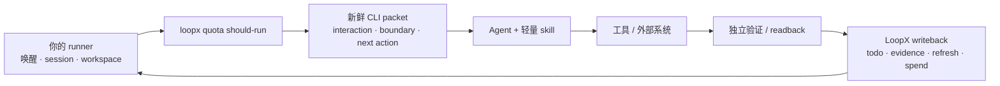

# 把 LoopX 嵌入你的 Agent Runner

[English](custom-agent-runner-integration.md)

这篇指南面向已经在远端开发机、自有 Agent CLI 或工作流 supervisor 中运行 Agent 的
开发者。你不需要替换现有 runtime，也不需要把领域编排搬进 LoopX。保留自己的 runner，
把 LoopX 作为跨 Turn 的持久控制面合同即可。

想先看最短公共契约？从
[最小自定义 Runtime 示例](minimal-custom-runtime-example.zh-CN.md) 开始，并运行
`python3 examples/custom-runtime-minimal-cli-turn-smoke.py`。进阶 typed Turn 路径是另一条：
`python3 examples/loopx-turn-fake-host-walkthrough-smoke.py`。

最小心智模型只有三部分：

| 部件 | 负责什么 | 不负责什么 |
| --- | --- | --- |
| **LoopX CLI** | 持久化 goal、todo、claim、gate、quota、evidence、monitor、scheduler hint 和已接受的 writeback | Agent 推理、工具或外部系统本身 |
| **轻量 skill / re-entry instruction** | 教 Agent 每轮读取新鲜 LoopX packet、遵守边界、验证并写回 | 保存当前任务状态或再造一个 scheduler |
| **你的 runner** | 唤醒、workspace/session、调用 Agent，以及应用真实 timer/scheduler 值 | LoopX policy、隐式授权或领域事实 |

CLI 是事实源，skill 是小型行为合同，你的 runner 是 loop driver。



## 不需要先建设什么

不需要常驻的 leader Agent、第二套编排数据库，也不需要为每件事定义一个 LoopX
Capability。Agent 可以根据目标做方案、拆任务、调用工具，并根据新事实创建 successor todo。

Agent A 完成后若应由 Agent B 接力，A 通过 LoopX 写入或链接 successor todo；下一次 host
唤醒重新读取 frontier，由 B 认领即可。无需一个中央模型记住并人工路由整个交接。

只有当调用方需要稳定、provider-neutral 的结果合同，并且 observation 归一化、验证和
transition policy 可复用时，才值得新增 Capability；外部实现放在 Provider 后面。普通推理、
仓库修改和一次性工具使用仍然属于 Agent 工作。

## 接入 Custom Host

先在拥有项目 workspace 的机器上安装 CLI：

```bash
python3 -m pip install --upgrade loopx
loopx doctor --agent-type other-agent
```

不要自己猜一套固定命令，让 LoopX 生成当前 custom-host packet：

```bash
loopx agent-onboard \
  --agent-type other-agent \
  --project . \
  --goal-id <goal-id> \
  --agent-id <agent-id> \
  --task-text "<第一个任务>" \
  --available-capability shell
```

packet 会返回当前 doctor/install、bootstrap command pack、quota guard 和 recheck
命令。只声明 host 真实具备的 capability。`--available-capability` 表示观察到的执行能力，
不授予权限，也不能替代 user gate。

对于 `other-agent`，doctor 会有意跳过 `~/.codex/skills` 检查。CLI 健康与 workflow
交付是两件事：custom host 仍需通过自己的 skill manifest 或等价 prompt injection，
从同一 LoopX revision 交付 `loopx-project`、`loopx-pr-program`、
`loopx-pr-review`、`loopx-doc-registry`、`loopx-benchmark` 和
`loopx-self-repair`。`loopx-benchmark` 只在 LoopX 管理的 benchmark 实验任务中
触发；加载它不授予 benchmark runner 或私有证据读取权限。当当前 goal 启用
`change_quality_qualification` 时，onboarding packet 会额外把
`loopx-change-quality` 列为 active project skill；host 需要交付该 workflow，
或注入等价的自包含 prepare packet 指令。随后 readback integration mode、
loaded skill ids 和 source revision。不要假设未知 host 采用 Codex、Claude 或
OpenCode 的目录布局。加载质量 skill 不代表启用，是否生效由当前 goal policy 决定。

如果 host 没有 skill 系统，就注入等价的 `SKILL.md` 指令，并保留一段短
re-entry instruction，要求 Agent：

1. 为当前 goal 与 Agent 读取新鲜 JSON quota packet；
2. 遵守 `interaction_contract`、`goal_boundary` 和 selected todo；
3. 只做一次有界动作，并验证真实 postcondition；
4. 通过 LoopX 写回结果；
5. 在下次唤醒前应用并 ACK scheduler hint。

这段 re-entry instruction 应保持稳定，不能缓存上一轮 CLI packet、todo 列表、cadence 或
项目 policy。

## 跑一个自驱动 Tick

机器路径使用 JSON：

```bash
loopx --format json \
  --registry "$HOME/.codex/loopx/registry.global.json" \
  quota should-run \
  --goal-id <goal-id> \
  --agent-id <agent-id> \
  --available-capability shell
```

然后按以下闭环运行：

1. **决策：** 把 `should-run` 和 `interaction_contract` 当作 gate。quiet、wait 或
   monitor-only 不调用模型，也不花 quota。
2. **路由：** user channel 要求动作时，展示具体 user todo 或问题；缺少 payload 时不要只说
   “owner gate”。
3. **认领：** 在可写执行前 claim selected executable todo。独立交接默认保持 unclaimed，
   除非已有明确 assignment。
4. **执行：** 只把当前 objective、selected todo、boundary、紧凑 evidence ref 和 writeback
   contract 交给 Agent，让它动态规划本轮有界动作。
5. **验证：** 读取真实 repository、测试、CI、服务或 Provider 结果。Agent 自称完成不是 proof。
6. **写回：** complete、update、block、defer 或新增 successor todo，记录紧凑 evidence，
   再运行 `refresh-state`。
7. **计费：** 只有验证通过并完成持久 writeback 后才 spend。validator 失败、cadence 更新、
   quiet monitor poll 和 no-op retry 都不 spend。
8. **调度：** runner 应用当前 scheduler hint，readback 实际生效值，再执行 packet 返回的
   ACK CLI。

非平凡交付前，先读取 goal 的 change-quality policy。启用后运行
`change-quality prepare`，review 精确 final diff，并记录 receipt。没有 skill 系统的
custom host 可以直接消费自包含的 prepare packet。`safe_fix` 允许一次有界修复；
`strict_receipt` 会让 `canary premerge --goal-id <goal-id>` 拒绝缺失或已失效的
receipt。

每次新唤醒都重新从第 1 步开始，不能依赖模型记忆或缓存 packet 续跑。

## 选择合适的执行边界

接入深度有两种，都合理；无论选择哪种，外层唤醒与调度循环仍由你的 runner 负责：

```text
outer runner: 唤醒 -> 一次有界执行 -> 应用 scheduler hint -> 下次唤醒
LoopX Turn:              决策 -> 执行 -> 验证 -> 提交
```

| 路径 | 适用情况 | 边界 |
| --- | --- | --- |
| **直接编排 CLI** | 你的 runner 已经会调用 Agent，并能独立验证结果 | runner 消费 `quota should-run`、todo lifecycle、refresh、spend 和 scheduler ACK 合同 |
| **LoopX Turn adapter（experimental）** | 希望由一条 typed command 完成 plan、调用一次 bounded host、验证和 commit | 使用 `turn run-once` 的内置 `codex-cli` adapter，或薄 `generic-cli` adapter |

直接编排 CLI 是当前兼容基线；LoopX Turn 是 runner 内部 experimental 的
transaction boundary，不是常驻 scheduler 或多 Agent 调度中枢。每个 tick 只能有一个
decide、validate、writeback 和 spend owner；同一逻辑动作不能同时跑手工闭环与
`turn run-once`。

新的 Turn 接入应被视为开发与 qualification 工作。依赖它之前，需要证明 host adapter
能返回 typed result contract、validator 与执行器独立、retry/resume/replay 不会重复产生
effect，并且外层 runner 能正确应用和 ACK scheduler state。这些正是继续提升 Turn
成熟度的 extension / contribution surface；Agent 进程退出码或从 transcript 猜结果不能
替代这些证明。

## 验收清单

在把集成称为“自主运行”前，至少证明：

- runner 重启后能从 LoopX state 恢复，不依赖 transcript replay；
- 具体 user action 会被投影，同时无关的安全 todo 仍可继续；
- 两个 Agent 不会静默认领同一份工作；
- 验证失败不能完成 todo 或 spend quota；
- scheduler 应用和 ACK 幂等；
- raw transcript、credentials、私有路径和无界日志不进入 LoopX state；
- Agent 能通过 successor todo 接力，不依赖常驻 leader。

精确读写合同见
[Host Integration Surface v0](../reference/protocols/host-integration-surface-v0.md)；
可选的 typed Turn 路径见
[Run One LoopX Turn With Codex CLI](../product/runtimes/codex-cli/loopx-turn-codex-cli-quickstart.md)。
