# Interaction Pattern Catalog

LoopX has accumulated many user / agent / state interaction lessons.
The state interaction model explains the architecture; this catalog records the
repeatable situations we want every controller, heartbeat, dashboard, and
benchmark runner to handle the same way.

Use this document when a good case, bad case, incident, or product insight
reveals a reusable interaction shape. Each pattern should be specific enough to
drive implementation, tests, and dashboard copy without requiring future agents
to mine chat history.

For the short product map that keeps the catalog, state definitions, and state
machine aligned, see
[`docs/product/core-control-plane/`](product/core-control-plane/). The catalog
below remains the detailed IP registry; the core map is the graph lens that
connects those IPs to runtime states and legal transitions.

## Pattern Template

Each pattern should answer:

- **Trigger**: which status, quota, todo, run-history, or boundary signals make
  the pattern active;
- **Importance**: `P0` for hot-path behaviors that can block or misroute a
  controller turn, `P1` for durable operational behaviors, and `P2` for
  specialized or experiment-specific behaviors;
- **User channel**: whether the user must be interrupted, only notified, or not
  contacted;
- **Agent channel**: what Codex must do, may do, or must not do;
- **State contract**: durable fields that prove the pattern is represented;
- **Bad smell**: how the system usually fails when the pattern is missing;
- **Visual model**: one Mermaid diagram, state table, or decision tree that can
  be used in product explanation;
- **Validation**: smoke, fixture, or doc check that protects the behavior.

Keep examples public-safe. Do not copy raw benchmark tasks, raw trajectories,
private logs, verifier output tails, credentials, internal URLs, or local
machine paths.

## Catalog Maintenance And Validation Design

The catalog is for reusable user / agent / state interaction shapes. Do not add
a new IP merely because a maintainer needs a validation technique, smoke group,
release checklist, dashboard card, or rollout procedure. Those are uses of the
catalog, not catalog patterns by themselves.

When a new repo behavior appears, update the catalog at the lowest durable
level:

- if the behavior is already covered by an IP, add the new smoke, fixture,
  protocol doc, or visual explanation to that IP's validation or details;
- if several existing IPs must be checked together, document the validation
  bundle in the relevant release/readiness or workflow doc and point back to
  those existing IPs;
- only allocate a new IP when the behavior itself is a repeatable interaction
  with its own trigger, user channel, agent channel, state contract, bad smell,
  and validation.

Canary and readiness groups should therefore be catalog-informed rather than
catalog-expanding by default. A canary may sample Work Routing, State And
Boundary, Evidence Lifecycle, Human Decision, and Planning Governance patterns,
but it should not become a standalone IP unless the canary behavior itself is a
runtime/state interaction that future controllers must route.

### Pattern-To-Canary Design Matrix

Catalog patterns are the vocabulary for designing many canary profiles, not one
fixed canary. Start from the changed surface, identify the pattern families it
can regress, then choose the smallest profile that exercises those patterns with
public-safe fixtures. A good canary explains why each check is present and what
kind of failure it diagnoses.

Use these archetypes as the reusable selection layer:

| Canary Archetype | Primary Question | Typical Trigger Surface | Fixture Depth | Cost Tier | Failure Usually Means |
| --- | --- | --- | --- | --- | --- |
| Hot-path route canary | Will the next agent turn route, fallback, monitor, or recover correctly? | `quota should-run`, status, review packet, heartbeat prompt, scheduler hint | synthetic active state plus compact run-history fixtures | cheap | a controller may spend, stop, notify, or select a todo incorrectly |
| Scoped decision canary | Are user gates, reward, approvals, and deferred resumes concrete and scoped? | user todo projection, operator gate, reward, decision-scope schema | fixture state plus dry-run decision append/preview | cheap to medium | the user may see a vague ask, or an agent may treat a scoped gate as global |
| Projection and boundary canary | Does compact state match todos, claims, authority, scopes, leases, and public/private boundaries? | active-state parser, todo lifecycle, task graph, connector policy, `loopx check` | fixture state plus boundary scan; no private source bodies | cheap to medium | dashboard/status may explain the wrong blocker or grant the wrong write/read scope |
| Evidence lifecycle canary | Can external evidence become countable without raw logs, task text, trajectories, or verifier tails? | benchmark adapter, CI handle, public PR metadata, compact evidence reducer | compact synthetic or public-handle fixture; no real benchmark launch by default | medium | evidence may be invisible, over-counted, or leak private/raw material |
| Planning governance canary | Does replan, repair, cadence, and plan-to-todo writeback change the machine-visible frontier? | autonomous replan, repair delta, dreaming, cadence hints, slash-command planning | synthetic stalled history plus todo/writeback fixtures | cheap | the system may loop on advisory prose without changing executable state |
| Product/readiness canary | Can a promoted product surface explain and render the relevant projections? | dashboard/frontstage/release/readiness surface | route or render fixture; browser only when visual behavior is promoted | medium to deep | the operator UI may look healthy while hiding broken route, gate, or evidence semantics |

Map P0/P1 catalog rows to canary archetypes before picking commands:

| Family | P0/P1 Pattern Coverage | Default Canary Archetypes | Trigger Surfaces | Minimum Useful Fixture | Failure Meaning |
| --- | --- | --- | --- | --- | --- |
| Work Routing | IP-001, IP-002, IP-003, IP-007, IP-008, IP-021, IP-029 | Hot-path route canary; Planning governance canary when cadence or repair is involved | `quota should-run`, `interaction_contract`, `work_lane_contract`, scheduler hint, handoff todo state | one eligible delivery fixture, one blocked/fallback fixture, one quiet or monitor fixture | agent turn routing is unsafe: it may spend, wait, notify, or choose fallback incorrectly |
| Human Decision | IP-004, IP-014, IP-017, IP-027 | Scoped decision canary; Product/readiness canary when first-screen human copy changes | user todos, decision scope, operator-gate/reward preview, deferred resume candidates | one concrete user ask, one scoped non-blocking gate, one preview-or-append dry run | humans may be asked the wrong question, or an agent may continue without the needed decision |
| State And Boundary | IP-005, IP-006, IP-011, IP-016, IP-019, IP-020, IP-022, IP-023, IP-025, IP-026, IP-028 | Projection and boundary canary; Hot-path route canary when the projection feeds quota/status | active state, todo metadata, task graph, authority source, claim lease, connector runtime policy, public/private scan | fixture state plus structured projection check; boundary scan for touched public files | compact state and executable truth diverge, so dashboards and agents may trust stale or unsafe authority |
| Evidence Lifecycle | IP-012, IP-015 | Evidence lifecycle canary; Product/readiness canary when evidence is rendered | external handle observation, benchmark lifecycle reducer, compact result projection | compact public-safe evidence fixture with raw-material exclusion assertions | progress evidence may be missing, double-counted, or represented with unsafe raw material |
| Planning Governance | IP-010, IP-013, IP-018, IP-024 | Planning governance canary; Hot-path route canary when cadence changes affect execution | stalled run history, autonomous replan obligation, repair delta, cadence hint, plan-to-todo writeback | two-turn stalled fixture plus repair/writeback delta assertion | the agent may keep planning in prose while the machine-visible frontier stays unchanged |

P2 patterns may still have canaries, but they should be selected by an explicit
domain profile instead of being pulled into every default profile. If a P2
pattern becomes hot-path for a shipped surface, promote the behavior or add a
small profile-specific canary with an explicit owner and non-applicability note
for other profiles.

When a PR touches several families, compose the smallest set of archetypes that
covers the touched surfaces. Do not build a giant "everything canary" by
default. Prefer a cheap route/projection profile for ordinary runtime changes,
add evidence lifecycle checks for benchmark or external-handle changes, and add
browser or deep integration only when a visual or end-to-end surface is being
promoted.

Use this selection order for ordinary PR, release, and refactor review:

1. Start from changed files and touched surfaces, not from the PR title.
2. Map those surfaces to catalog families and choose the cheapest archetype
   that can catch the likely regression.
3. Add one current-repo domain profile only when the surface has a known
   product route, such as PR review, release promotion, monitor scheduling,
   control-plane refactor, state-write correctness, frontstage rollout, or
   benchmark adapter readiness.
4. Keep default profiles on fixture-level or dry-run checks. Pull in deep,
   browser, external, or writeback checks only when the PR promotes that exact
   surface or the owner explicitly asks for promotion readiness.
5. When hot-path and cold-path surfaces both changed, keep the hot-path canary
   small enough to prove route/spend/notify behavior, then add a cold-path
   detail check for the expanded inspector or review surface.

Concrete examples:

| Review Situation | Selector Shape | Default Profile Choice | Add Deep Checks Only When |
| --- | --- | --- | --- |
| PR review or self-merge workflow | changed files under `loopx/pr_review.py`, `skills/loopx-pr-review/`, GitHub public probe, or PR merge policy docs | PR review / merge domain profile plus Human Decision or Evidence Lifecycle when public-handle evidence changed | the PR changes posting, approval, merge, or external GitHub write behavior |
| Release or install promotion | release-readiness docs, installer/update/wrapper code, `loopx doctor`, `loopx update`, or canary wrapper behavior | release-promotion domain profile plus Work Routing and State And Boundary checks | promoting a real release snapshot, app wrapper, dashboard, or writeback evidence |
| Control-plane refactor | `loopx/quota.py`, `loopx/status.py`, scheduler policy, todo projection, or review-packet route changes | control-plane-refactor domain profile plus Work Routing and State And Boundary checks | moving a broad policy seam, changing public JSON fields, or touching monitor/scheduler writeback |

Existing-contract-first rule: canary planning should consume current public
runtime/status surfaces before proposing a new runtime contract. Prefer
`quota should-run`, `status`, `review-packet`, `loopx check`, current smoke
fixtures, `loopx canary plan` output, and fixture-level `loopx canary run`
checks as the first evidence layer. `loopx canary run` must stay no-write by
default: it may execute selected repository-local fixture checks, but it should
not write promotion evidence, create runtime contracts, poll external targets,
or run deep/browser checks unless that deeper profile is explicitly selected. A
new runtime contract is justified only when these surfaces cannot represent a
repeatable interaction that future controllers must route. In that case, stop at
a review packet first: name the minimal missing behavior, list the existing
contract alternatives rejected, state compatibility and migration risk, and
propose focused smokes for owner review before implementation.

## Decision Scope Model

User gates are not global booleans. The first-class model is a scoped decision:
the machine-facing schema is
[`decision_scope_v0`](reference/protocols/decision-scope-v0.md).

Compatibility todo metadata follows the same rule. In a multi-agent goal, an
open `user_gate` todo must carry `blocks_agent=<registered-agent>` when only
one lane is waiting, or `global_gate=true` when the decision intentionally
blocks every registered agent. An unscoped multi-agent `user_gate` is a
projection bug, not a safe fallback to a global operator gate.

- a **decision/gate** names the authority still needed, such as a private
  material read, resource spend, write boundary, production action, public
  submission, or product-direction choice;
- an **agent action** names the authority it depends on and the effect it will
  produce, such as read-only analysis, local code edit, external run, private
  source sync, or dashboard write;
- the controller compares the two as a scope relation:
  `gate covers action`, `gate does not cover action`, or `scope is ambiguous`.

This keeps the product behavior simple:

| Relation | User Channel | Agent Channel |
| --- | --- | --- |
| gate covers selected action and no independent fallback exists | ask concrete user todo | stop gated delivery; no spend |
| gate covers selected action but an independent fallback exists | notify concrete user todo | execute fallback, validate, write back, spend once |
| gate does not cover selected action | keep gate visible if useful | execute selected action normally |
| scope is ambiguous | ask/repair projection | do not infer permission from prose |

The durable target schema should make this relation explicit rather than
relying on prompt memory or text matching:

```text
user_todo.decision_scope = {
  kind: private_read | write_scope | resource | production | public_claim | direction,
  granularity: action | lane | goal | project | global,
  scope_key: "...",
  expires_at?: "..."
}

agent_todo.required_decision_scopes[] = [...]
agent_todo.required_write_scopes[] = [...]
agent_todo.safety_class = read_only | local_write | external_run | protected_write
```

Compatibility inference from `action_kind`, title, or text is allowed only as a
transition layer. If explicit scope is missing and inference is not confident,
the correct behavior is projection repair or a user/controller gate, not a
silent fallback.

Markdown text inference is a lint, not the gate truth. In the hot path,
`quota should-run` should prefer structured fields such as `task_class`,
`decision_scope`, `required_decision_scopes`, `safety_class`,
`user_todo_summary`, and `interaction_contract`. Free-text parsing of
`Next Action` exists only to catch legacy states where a human-readable wait or
executable action was never projected into a todo. It must not override a
current `interaction_contract.user_channel.action_required=false` plus an open
agent todo. LLM-assisted interpretation belongs in a cold-path proposal or
authoring helper; it may suggest converting prose into a structured todo, but
must not decide delivery gates, spend policy, or write permission directly.

## Optional OM/HITL Overlay Schemas

The IP IDs below are stable interaction patterns. Do not create a new IP only
because a dashboard, operator-management workflow, or human-in-the-loop review
needs extra labels. Prefer optional overlays that attach to an existing quota,
status, review-packet, run, or catalog pattern.

These overlays are descriptive and analytic. They must not replace
`interaction_contract`, `todo` metadata, `goal_boundary`, or run-bound reward
events as the execution source of truth.

### `human_ai_role_contract_v0`

Use this overlay when a pattern needs to say who decides, who acts, and who
checks the result without changing the underlying IP.

```text
human_ai_role_contract_v0 = {
  applies_to: quota_payload | status_card | review_packet | catalog_pattern | run,
  human_role: owner | reviewer | operator | evaluator | none,
  ai_role: executor | observer | drafter | verifier | router,
  decision_owner: human | ai | shared | external,
  validation_owner: human | ai | tool | external,
  handoff_contract?: "what must be true before the other party acts",
  forbidden_substitution?: ["things the AI must not decide for the human"]
}
```

### `ops_metric_overlay_v0`

Use this overlay to measure operating load and quality around an interaction
without changing routing semantics.

```text
ops_metric_overlay_v0 = {
  operator_interruptions: integer,
  concrete_user_todo_count: integer,
  agent_delivery_attempts: integer,
  quiet_noop_count: integer,
  repair_delta_count: integer,
  blocked_minutes?: number,
  evidence_quality?: missing | surface | compact | verifier_backed,
  notes?: "public-safe compact summary"
}
```

### `escalation_failure_type_v0`

Use this overlay when a bad case should classify why a handoff or escalation
failed. It is an incident-analysis label, not a permission check.

```text
escalation_failure_type_v0 =
  missing_concrete_user_todo
  | wrong_agent_blocked
  | stale_next_action
  | hidden_blocked_priority
  | no_repair_delta
  | scope_projection_gap
  | capability_bridge_missing
  | private_boundary_ambiguous
  | external_evidence_missing
```

The overlays should stay optional until a UI or controller path consumes them.
When a runtime starts depending on one, add a focused smoke and update the
relevant IP's validation list instead of renumbering the catalog.

## Pattern Families

Use families as the first routing layer. They keep the catalog readable as the
number of patterns grows, and they make it easier for skills, dashboards, and
benchmark reviews to ask for "the relevant interaction family" instead of
scanning every IP.

| Family | Purpose | Start Here When |
| --- | --- | --- |
| Work Routing | Decide whether the agent should deliver, fallback, recover, or stay quiet. | quota/status says work may run, but the next action is blocked, monitor-only, or outcome-thin |
| Human Decision | Represent user, owner, simulator, reward, approval, and deferred-resume moments without hiding the exact ask. | a user action, correction, approval, deferred gate, or run-bound judgment changes what the agent should do |
| State And Boundary | Keep compact control-plane truth aligned with todos, scopes, leases, authority, and write boundaries. | state says one thing but todos, permissions, or authority sources imply another |
| Evidence Lifecycle | Make external evidence and benchmark work countable without copying raw logs or task data. | a benchmark, CI, model run, or external handle must advance through observable lifecycle states |
| Planning Governance | Control replanning, dreaming, cadence, and future-work writeback without turning chat into state. | the agent is planning, widening work, proposing future routes, or publishing top todos |

## Catalog

Catalog rows are grouped by family and sorted by importance inside each family.
`P0` means hot-path behavior that can block or misroute a controller turn;
`P1` means durable operational behavior that should be preserved once the hot
path is healthy; `P2` means specialized or experiment-specific behavior.
IP IDs remain stable even when display order changes.

### Work Routing

Hot-path execution decisions: deliver, fallback, recover, or stay quiet.

| Importance | ID | Name | Primary Owner | User Channel | Agent Channel |
| --- | --- | --- | --- | --- | --- |
| P0 | IP-001 | Bounded Delivery | Agent | no interruption | implement, validate, write back, spend once |
| P0 | IP-002 | Blocked Priority With Safe Fallback | Agent plus user-visible notification | notify without requiring an answer | continue safe fallback after exposing blocked higher-priority work |
| P0 | IP-003 | Scoped Gate With Safe Fallback | User plus agent | notify concrete scoped gate | execute non-dependent fallback; no gated action |
| P0 | IP-029 | Handoff Todo Gate State | Status/quota | no interruption unless the handoff itself is user-held | map `blocks_agent` todo lifecycle into wait, successor replan, or concrete successor routing |
| P0 | IP-021 | Per-Todo Capability Gate | CLI projects, agent decides | ask only when missing capability is owner-held | expose runnable executable candidates; agent chooses one, otherwise repair bridge or skip |
| P0 | IP-007 | Outcome Floor Recovery | Agent | usually no interruption | produce missing outcome-scale evidence or blocker only |
| P1 | IP-008 | Monitor Quiet Skip | CLI/controller | no notification | append at most one no-spend poll, then stay quiet |

### Human Decision

Human asks, approvals, interventions, and reward-derived lessons.

| Importance | ID | Name | Primary Owner | User Channel | Agent Channel |
| --- | --- | --- | --- | --- | --- |
| P0 | IP-004 | Concrete User Todo Projection | User | ask or notify with concrete todo/question | do not hide behind generic "owner gate" text |
| P0 | IP-027 | Deferred Gate Resume | Status/quota plus controller | notify only when the resume gate is still user-held | keep deferred work visible after open lanes; when ready, require lifecycle replan instead of no-candidate wait |
| P0 | IP-014 | Decision Write Preview And Append | User/operator | explicit preview/apply decision | append only exact run-bound reward or gate decision event |
| P1 | IP-017 | User Reward Lesson Promotion | User plus LoopX | acknowledge only when lesson changes route/priority/boundary | promote correction into durable lesson, todo, or projection before continuing |
| P2 | IP-009 | Active User Assistance | User simulator / operator | bounded intervention | inject audited user help without leaking reward/oracle signals |

### State And Boundary

Projection, authority, write scope, and lease integrity.

| Importance | ID | Name | Primary Owner | User Channel | Agent Channel |
| --- | --- | --- | --- | --- | --- |
| P0 | IP-005 | State Projection Gap | Agent | no user ask unless a user todo is missing | repair todo/state projection before ordinary delivery |
| P0 | IP-006 | Checkpointed Scope Mismatch | CLI/controller | ask or repair boundary projection | do not execute action whose write scope is not projected |
| P0 | IP-026 | Agent-Scoped No-Candidate Gap | Status/quota | no interruption | project scope exhaustion or agent-scope wait instead of forcing delivery |
| P1 | IP-011 | Authority Material Intake | Agent plus registry | notify only on gate/conflict | register redacted source contract before relying on material |
| P1 | IP-016 | Task Lease Claim | Controller/agent | no interruption unless conflict requires decision | claim bounded work with TTL, write scope, and conflict policy |
| P1 | IP-019 | Peer Scoped Continuation | Registered peer | no interruption unless scope/review is ambiguous | peer claims scoped work, obeys task workspace policy, then completes directly or uses a typed successor |
| P1 | IP-020 | Todo Claim / Supersede / Successor Lifecycle | Agent plus controller | no interruption unless successor is a user todo or conflict needs decision | claim before delivery; supersede stale work; complete slices with successor or no-follow-up rationale |
| P1 | IP-022 | Claimed Todo Visibility And Agent-Lane Next Action | Status/quota/frontstage | no interruption | keep scheduler candidates separate from claimed-work visibility lanes and expose the current agent's slice |
| P1 | IP-023 | Status Neutral Run Window | Status/quota/history | no interruption | ignore neutral run noise for state authority while retaining it as stall evidence |
| P1 | IP-025 | Experimental Diagnostic Sidecar Boundary | Runtime/protocol owners | no interruption unless an opt-in proof asks for user action | keep proof/debug verdicts as sidecar diagnostics until a product-general schema is validated |
| P1 | IP-028 | Connector Runtime Boundary | Connector/runtime owners | notify only if the required owner decision is missing | enforce runtime allow/deny policy before browser or API connector reads can autoload raw material |

### Evidence Lifecycle

External handles, benchmark transitions, and countable proof.

| Importance | ID | Name | Primary Owner | User Channel | Agent Channel |
| --- | --- | --- | --- | --- | --- |
| P0 | IP-012 | External Evidence Observation | Agent/controller | no interruption unless handle missing needs owner input | observe compact handles/results; do not launch benchmark/model work |
| P1 | IP-015 | Benchmark Lifecycle Countability | Benchmark adapter/controller | no interruption by default | advance only through compact countable lifecycle gates |

### Planning Governance

Replanning, dreaming, cadence, and future-work writeback.

| Importance | ID | Name | Primary Owner | User Channel | Agent Channel |
| --- | --- | --- | --- | --- | --- |
| P0 | IP-013 | Autonomous Replan Vs Advisory Dreaming | Agent/controller plus user when promoted | ask only for promotion/decision | repair stalled delivery; keep dreaming proposal non-executable |
| P1 | IP-024 | Repair Delta Contract | Agent/controller | no interruption unless repair creates a user todo | self-repair/replan must change the machine-visible frontier or record a no-op/blocker |
| P1 | IP-010 | Cadence Hint | Agent/controller | no interruption by default | surface a low-confidence hint when turns look too thin |
| P1 | IP-018 | Plan To Todo Writeback | Agent plus LoopX | no interruption unless a user todo is created | write user-facing plans into todos, Next Action, or refresh-state |

## Visual Model

The catalog should support partner and user-facing explanation, not only
implementation. Keep diagrams public-safe and generic. Prefer diagrams that
show actor boundaries, decision ownership, and fallback behavior without raw
project or benchmark evidence.

The runtime state machine is the most compact way to explain why LoopX may
run, wait for a user, wait for evidence, repair a stale projection, or stay
quiet without spending quota.

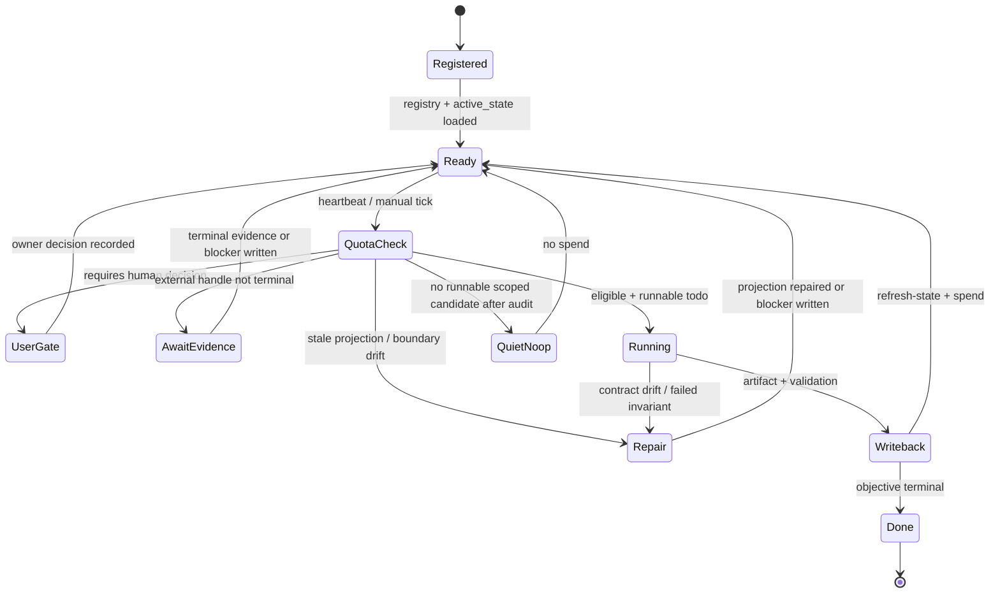
```mermaid
stateDiagram-v2
    [*] --> Registered
    Registered --> Ready: registry + active_state loaded
    Ready --> QuotaCheck: heartbeat / manual tick
    QuotaCheck --> UserGate: requires human decision
    QuotaCheck --> AwaitEvidence: external handle not terminal
    QuotaCheck --> Running: eligible + runnable todo
    QuotaCheck --> QuietNoop: no runnable scoped candidate after audit
    QuotaCheck --> Repair: stale projection / boundary drift
    Running --> Writeback: artifact + validation
    Running --> Repair: contract drift / failed invariant
    AwaitEvidence --> Ready: terminal evidence or blocker written
    UserGate --> Ready: owner decision recorded
    Writeback --> Ready: refresh-state + spend
    Writeback --> Done: objective terminal
    Repair --> Ready: projection repaired or blocker written
    QuietNoop --> Ready: no spend
    Done --> [*]
```

The smallest reusable routing diagram then shows how the quota guard projects
those lifecycle states into an `interaction_contract` for the current tick:

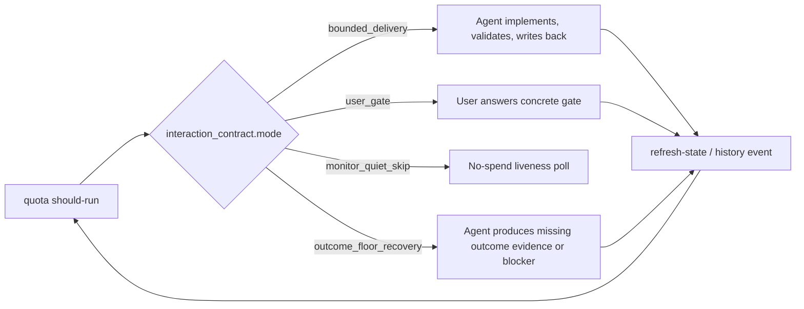
```mermaid
flowchart LR
  Q["quota should-run"] --> C{"interaction_contract.mode"}
  C -->|"bounded_delivery"| A["Agent implements, validates, writes back"]
  C -->|"user_gate"| U["User answers concrete gate"]
  C -->|"monitor_quiet_skip"| M["No-spend liveness poll"]
  C -->|"outcome_floor_recovery"| R["Agent produces missing outcome evidence or blocker"]
  A --> S["refresh-state / history event"]
  U --> S
  R --> S
  S --> Q
```

The blocked-priority fallback pattern deserves its own public demo because it
captures the product taste: do not idle on a gate, and do not hide the gate
while doing fallback work.

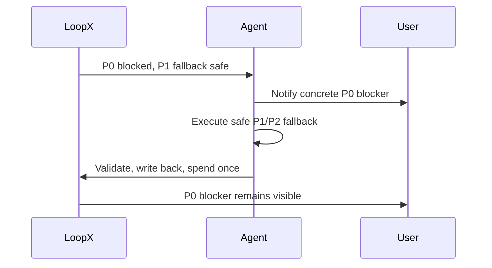
```mermaid
sequenceDiagram
  participant GH as LoopX
  participant Agent as Agent
  participant User as User
  GH->>Agent: P0 blocked, P1 fallback safe
  Agent->>User: Notify concrete P0 blocker
  Agent->>Agent: Execute safe P1/P2 fallback
  Agent->>GH: Validate, write back, spend once
  GH->>User: P0 blocker remains visible
```

Future public surfaces can include:

- static SVG or Mermaid diagrams embedded in README/docs;
- a fake-data dashboard walkthrough for the first three patterns;
- a short animated video showing "P0 gate + safe fallback" with no private
  benchmark artifacts;
- a public demo script that can be narrated to potential collaborators.

## Pattern Details

Pattern details use the same family order as the catalog. Within each
family, P0 patterns come first, followed by P1 and P2 patterns. The IP
number is stable identity, not display priority.

### Work Routing

#### IP-001 Bounded Delivery

**Trigger**

- `quota should-run.should_run=true`;
- `interaction_contract.mode=bounded_delivery`;
- `interaction_contract.agent_channel.must_attempt=true`;
- no private, credential, production, destructive, or unprojected write-scope
  blocker applies.

**Expected behavior**

The agent chooses one bounded segment, performs the work, runs focused
validation, writes durable state or history, and spends exactly once after the
validated delivery.

**Visual Model**

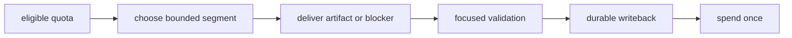
```mermaid
flowchart LR
  Q["eligible quota"] --> A["choose bounded segment"]
  A --> D["deliver artifact or blocker"]
  D --> V["focused validation"]
  V --> W["durable writeback"]
  W --> S["spend once"]
```

**Bad smell**

The agent sends a status update after reading only one file, or spends quota
without a validated artifact or blocker.

**Validation**

- `examples/control_plane/work-lane-contract-smoke.py`
- `examples/control_plane/heartbeat-quota-flow-smoke.py`
- `loopx check`

#### IP-002 Blocked Priority With Safe Fallback

**Trigger**

- a higher-priority agent todo is blocked;
- a lower-priority todo is executable and safe;
- `blocked_priority_fallback.notify_user=true` or equivalent quota/status
  projection is present;
- user action may be useful, but the selected fallback does not require the
  user answer before proceeding.

**Expected behavior**

The user-facing message must preserve the blocked higher-priority item and the
reason the fallback is being used. The agent may continue the safe fallback, but
must not let the fallback become the main story silently.

Example shape:

```text
Core lane is blocked on <decision/resource>. I will continue <safe fallback>
now, and the pending user todo remains <concrete ask>.
```

**Visual Model**

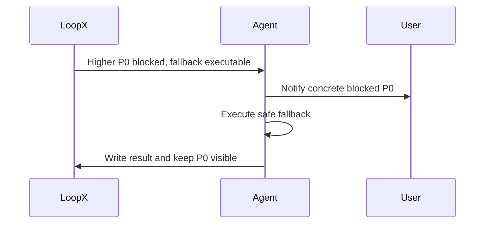
```mermaid
sequenceDiagram
  participant GH as LoopX
  participant Agent as Agent
  participant User as User
  GH->>Agent: Higher P0 blocked, fallback executable
  Agent->>User: Notify concrete blocked P0
  Agent->>Agent: Execute safe fallback
  Agent->>GH: Write result and keep P0 visible
```

**Bad smell**

The agent either freezes completely on a gate even though other safe work is
available, or silently works on lower-priority items while the user loses sight
of the P0 blocker.

**Validation**

- `examples/control_plane/todo-first-open-summary-smoke.py`
- `docs/heartbeat-automation-prompt.md`

#### IP-003 Scoped Gate With Safe Fallback

**Trigger**

- an open user todo is a real gate, not just advisory context;
- the gate can be scoped to one selected agent action, lane, resource, or
  boundary;
- another executable agent todo is independent of that gate;
- the fallback remains inside public/private, write-scope, resource, and quota
  boundaries.

**Expected behavior**

The user channel must still notify the concrete gate. The agent channel must
not execute the gated action, but should continue the independent fallback when
quota and safety allow it. This is a dual-channel state, not a contradiction:

```text
user_action_required=true
agent_action_required=true
agent_action=<independent fallback>
```

The controller should expose a durable field such as
`scoped_user_gate_fallback` with:

- the blocked user gate;
- the gated agent item(s);
- the selected fallback;
- a spend policy that permits spending only after validated fallback writeback.

The best long-term implementation is explicit scope metadata:
`user_todo.decision_scope` and `agent_todo.required_decision_scopes`. Runtime
text or `action_kind` inference is only a compatibility bridge for older goal
states.

When a user gate carries `blocks_agent=<agent-id>`, that metadata is already a
hard scope boundary. The target agent must still stop and surface the concrete
user decision. Other agents should keep the gate diagnostically visible but
must not count it as their own `open_count`, `gate_open_items`, or
`user_channel.action_required` if they have an independent executable todo.
For those agents, an `operator_gate` state derived only from the other-agent
gate should become an agent-scoped eligible lane, not a global owner gate.

**Visual Model**

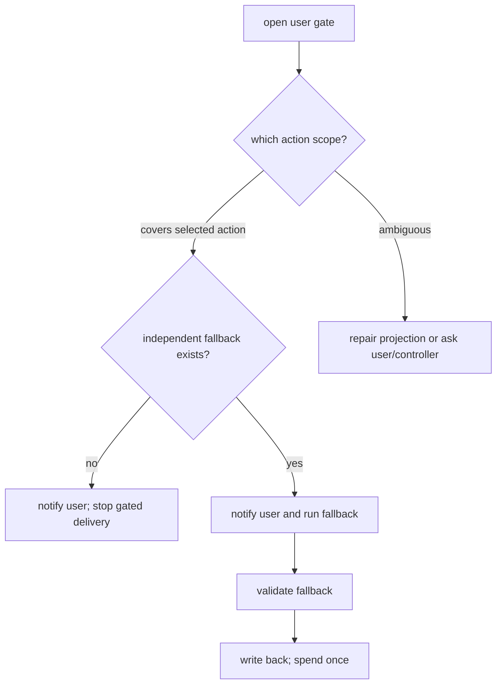
```mermaid
flowchart TD
  G["open user gate"] --> S{"which action scope?"}
  S -->|"covers selected action"| F{"independent fallback exists?"}
  S -->|"ambiguous"| R["repair projection or ask user/controller"]
  F -->|"no"| U["notify user; stop gated delivery"]
  F -->|"yes"| D["notify user and run fallback"]
  D --> V["validate fallback"]
  V --> W["write back; spend once"]
```

**Bad smell**

The payload says `must_attempt_work=true` and `do_not_cancel_on_block=true`,
but `interaction_contract.agent_channel.delivery_allowed=false` only because
`requires_user_action=true`. The agent then repeats the gate forever even
though another safe todo is available.

The opposite bad smell is also dangerous: the agent silently continues work
without naming the blocked user decision, so the fallback becomes the main
story and the human loses the critical gate.

A third bad smell is an agent-scoped user gate overreach. A user todo says it
blocks one registered peer, but quota treats it as a global
operator gate for every `--agent-id` call. The non-target agent then stops even
though it has its own runnable todo. This is not IP-026 scope exhaustion; it is
IP-003 scope metadata being ignored by the user-todo blocking summary.

**Validation**

- `regression/scoped-user-gate-fallback-contract.py`
- `examples/protocol/protocol-action-packet-smoke.py`
- `examples/control_plane/work-lane-contract-smoke.py`
- `examples/control_plane/quota-agent-scoped-user-gate-smoke.py` for `blocks_agent` scoped
  user gates that block only the target agent while preserving other-agent
  delivery.
- `docs/archive/incidents/agent-scoped-user-gate-overreach-incident-20260624.md`

#### IP-021 Per-Todo Capability Gate

**Trigger**

- visible executable agent todos declare `required_capabilities`, such as
  `shell`, `filesystem_write`, `benchmark_runner`, `external_evidence_poll`,
  `network`, or `credentials`;
- `quota should-run` has quota to spend, but the current launcher may not have
  every capability required by the highest-priority todo;
- more than one executable todo may be visible, including multiple P0 or
  multiple P1 candidates.

**Expected behavior**

Capability is a per-todo execution preflight, not a global agent profile and
not a permission grant. `status` should project each todo's
`required_capabilities`; `quota should-run` should derive a read-only
`capability_gate` over the visible executable queue.
Do not declare a capability as required merely because the todo is meant to
develop, repair, or parity-check that capability. Use `target_capabilities` for
that output side of the work. For example, a product-path parity todo can
declare `required_capabilities=shell` and `target_capabilities=benchmark_runner`:
the gate may project it as runnable repair work even while the target bridge
capability is absent.

The controller scans executable candidates in projection order and classifies
them, but it does not make the final todo choice. If the first P0 requires
`benchmark_runner` but the second P0 only needs shell/filesystem capability,
both the runnable P0 and any later runnable fallback are projected in
`capability_gate.runnable_candidates`; blocked higher-priority items remain
visible in `capability_gate.blocked_candidates`. `recommended_action` remains
routing context, not a chosen runnable todo.
If the first P0 is not trying to run the benchmark but to repair or materialize
the benchmark bridge itself, it should appear in `runnable_candidates` with
`target_capabilities`, `capability_repair_mode=true`, and
`capability_action=repair_bridge` instead of being hidden behind a lower-value
fallback.

When `capability_gate.action=run`, the decision contract is:

- `decision_owner=agent`;
- `selection_policy=agent_steering_audit_over_runnable_candidates`;
- `runnable_candidates` is the allowed candidate set for this turn;
- for the current peer, same-priority candidates that unblock another peer via
  `blocks_agent` plus `unblocks_todo_id` are ordered before ordinary backlog,
  so the candidate list and `agent_lane_next_action` expose the same handoff
  priority;
- candidates with `capability_repair_mode=true` are allowed repair/development
  work for a missing `target_capabilities` bridge, not direct execution through
  that missing bridge;
- `blocked_candidates` is the visible set of higher- or same-priority work
  that cannot currently run;
- the agent must choose the actual todo from `runnable_candidates`, then
  validate and write back that chosen work.

If no visible executable todo can run, the gate chooses:

- `repair_bridge` for local bridge gaps such as `benchmark_runner`,
  `external_evidence_poll`, `worker_bridge`, or `cli_bridge`;
- `ask_owner` for owner-held capabilities such as `network`, `credentials`, or
  `production_access`;
- `skip` when the missing capability is unsupported and no safe repair or owner
  action is known.

For a mixed missing set, the gate projects `owner_missing`, `repair_missing`,
and `resolution_steps` separately. An unresolved owner-held capability takes
precedence for the interaction decision, so a local bridge repair cannot hide
the concrete user action. Once the launcher truthfully declares that owner-held
capability available, the user gate disappears and any remaining bridge repair
returns to the agent lane.

Launchers that really have an extra capability should pass it to both
`quota should-run` and `quota spend-slot` with `--available-capability`, so the
preflight and accounting phases agree.

**Visual Model**

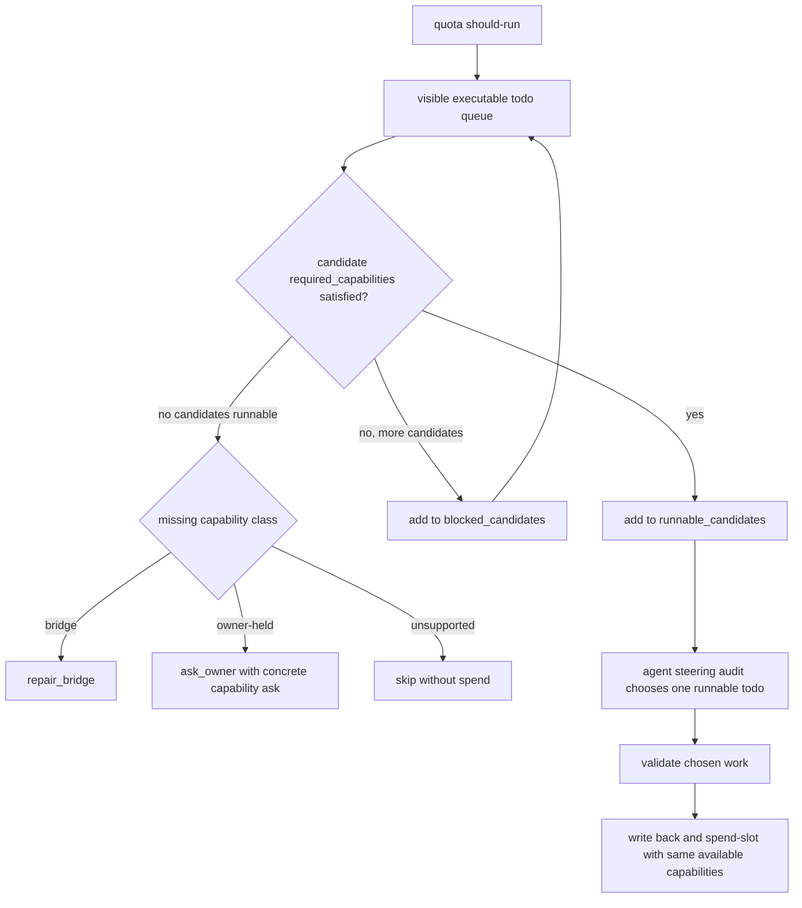
```mermaid
flowchart TD
  Q["quota should-run"] --> E["visible executable todo queue"]
  E --> C{"candidate required_capabilities satisfied?"}
  C -->|"yes"| R["add to runnable_candidates"]
  C -->|"no, more candidates"| B["add to blocked_candidates"]
  B --> E
  C -->|"no candidates runnable"| M{"missing capability class"}
  M -->|"bridge"| P["repair_bridge"]
  M -->|"owner-held"| U["ask_owner with concrete capability ask"]
  M -->|"unsupported"| S["skip without spend"]
  R --> A["agent steering audit chooses one runnable todo"]
  A --> V["validate chosen work"]
  V --> W["write back and spend-slot with same available capabilities"]
```

**Bad smell**

The system treats quota eligibility as proof that the nearest todo can run,
then repeatedly fails on missing benchmark/network/tooling capability. The
opposite bad smell is over-blocking: one P0 needs a missing runner, but another
P0 or P1 is runnable and safe; the controller freezes instead of projecting the
runnable set for the agent to choose from.

**Validation**

- `docs/project-agent-todo-contract.md`
- `docs/quota-allocation.md`
- `examples/capability-gate-smoke.py`
- `examples/control_plane/todo-cli-smoke.py`

#### IP-007 Outcome Floor Recovery

**Trigger**

- repeated surface-only work has crossed the outcome floor;
- `safe_bypass_kind=outcome_floor_recovery` or
  `heartbeat_recommendation.recommended_mode=outcome_floor_recovery`;
- quota exposes a concrete `must_advance` target.

**Expected behavior**

The agent may do only the bounded recovery: produce the missing evidence named
by `must_advance`, or write the blocker explaining why that evidence cannot be
produced. Ordinary docs/status propagation should wait.

**Visual Model**

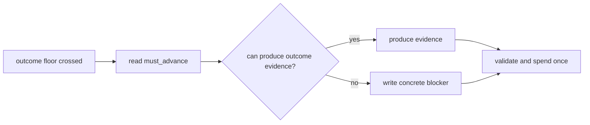
```mermaid
flowchart LR
  F["outcome floor crossed"] --> T["read must_advance"]
  T --> E{"can produce outcome evidence?"}
  E -->|"yes"| P["produce evidence"]
  E -->|"no"| B["write concrete blocker"]
  P --> V["validate and spend once"]
  B --> V
```

**Bad smell**

The system keeps improving wrappers, summaries, or queues while never producing
the evidence needed to decide whether the goal is working.

**Validation**

- `docs/archive/incidents/outcome-floor-safe-bypass-incident-20260606.md`
- `examples/control_plane/quota-plan-smoke.py`
- `examples/upgrade-plan-smoke.py`

#### IP-008 Monitor Quiet Skip

**Trigger**

- `should_run=false`;
- `effective_action=monitor_quiet_skip`;
- no user gate, user todo blocker, external handle observation, or self-repair
  obligation is active.

**Expected behavior**

The agent may append at most one no-spend monitor poll, rerun the guard, and
then stay quiet. The automation remains alive; monitor-only quiet skips are not
completion or deletion signals. The poll records `quota_monitor_target_v0` so
the next guard can distinguish a harmless unchanged watch from the same target
repeating.

Status and diagnose should display unchanged monitor-only work as
`waiting_on=monitor_signal` with `severity=watch`, while retaining the quota
decision `effective_action=monitor_quiet_skip`. This keeps the monitor visible
without making it look like immediate Codex work or a user/controller gate.
Six consecutive no-spend polls for the same target should project a
`dead_monitor_repeat` autonomous replan obligation; the agent must write a
watch-lane expiry, concrete blocker, todo supersede, or successor runnable todo
before another quiet poll.

**Visual Model**

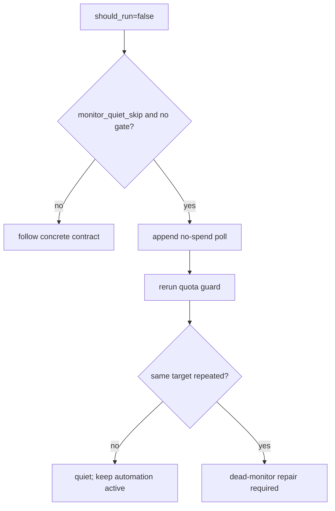
```mermaid
flowchart TD
  N["should_run=false"] --> M{"monitor_quiet_skip and no gate?"}
  M -->|"no"| C["follow concrete contract"]
  M -->|"yes"| P["append no-spend poll"]
  P --> R["rerun quota guard"]
  R --> D{"same target repeated?"}
  D -->|"no"| Q["quiet; keep automation active"]
  D -->|"yes"| A["dead-monitor repair required"]
```

**Bad smell**

The heartbeat stops itself because nothing changed, or spends quota on a
no-op status repetition. Another failure mode is presenting monitor-only work
as an immediate Codex action; the agent then keeps trying to deliver from a
watch lane instead of staying quiet or writing a concrete blocker.

**Public-safe bad case**

The 2026-06-21 monitor-only replan stall is the canonical public-safe bad case
for this pattern. Its reusable shape is not tied to any private project:

```text
effective_action=monitor_quiet_skip
user_channel.action_required=false
user_todo_summary.open_count=0
agent todo lane contains only monitor-style work
recent history repeats monitor-poll / replan-adjacent rows
no runnable todo, blocker, successor, supersede, or watch-lane expiry changed
```

Catalog and dashboard copy should name that as a watch state. A watch lane may
remain visible, and it may append one no-spend liveness poll, but it must not
render as immediate Codex delivery or as a user/controller approval gate. If
the same watch target repeats past the stale threshold, IP-024 owns the repair
delta: write a blocker, successor, supersede, or explicit watch-lane
continuation rather than spending another delivery turn on prose.

**Validation**

- `examples/control_plane/heartbeat-quota-flow-smoke.py`
- `examples/control_plane/quota-plan-smoke.py`
- `docs/heartbeat-automation-prompt.md`
- `docs/archive/incidents/monitor-only-replan-stall-incident-20260621.md`

### Human Decision

#### IP-004 Concrete User Todo Projection

**Trigger**

- `interaction_contract.user_channel.action_required=true`; or
- `user_todo_summary.open_count > 0`.

**Expected behavior**

The heartbeat, status, dashboard, or review packet must name the concrete user
todo/question. It must not say only "owner gate" or "waiting on user". If the
payload says user action is required but no concrete todo/question is projected,
the correct message is a state projection bug:

```text
specific user todo is not projected; repair LoopX state projection
```

When `action_required=false` and `user_todo_summary.open_count=0`, the system
may say there is no user todo and should not imply a projection fault.

**Visual Model**

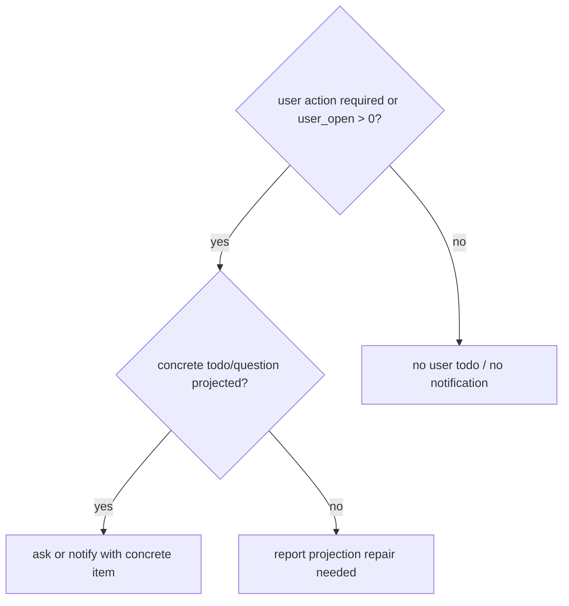
```mermaid
flowchart TD
  U{"user action required or user_open > 0?"}
  U -->|"yes"| C{"concrete todo/question projected?"}
  C -->|"yes"| A["ask or notify with concrete item"]
  C -->|"no"| R["report projection repair needed"]
  U -->|"no"| N["no user todo / no notification"]
```

**Bad smell**

The user sees repeated vague gate messages and cannot tell what decision is
needed.

**Validation**

- `docs/heartbeat-automation-prompt.md`
- `examples/control_plane/quota-plan-smoke.py`
- `examples/control_plane/heartbeat-quota-flow-smoke.py`

#### IP-027 Deferred Gate Resume

**Trigger**

- a todo has `status=deferred` and a machine-readable resume condition such as
  `resume_when=todo_done:<todo_id>` or an unblock link such as
  `unblocks_todo_id`;
- status can evaluate the condition into `resume_condition` and
  `resume_ready`;
- the deferred item is current-agent claimed or unclaimed for the scoped agent
  that is awake; and
- no ordinary open current-agent or unclaimed advancement todo should outrank
  the resume handoff.

**Expected behavior**

Deferred todos represent parked work behind a resume gate. The gate may be a
user todo, ordinary peer handoff for review, prerequisite implementation todo, resource
decision, or another bounded control-plane condition. That makes this a
Human Decision / gate-resume pattern, not a no-todo pattern.

Status and quota should keep deferred work visible after sorted open todo
lanes:

- `deferred_items`: bounded visibility for deferred todos;
- `deferred_resume_candidates`: bounded visibility for ready deferred todos;
- `current_agent_deferred_resume_candidates`,
  `unclaimed_deferred_resume_candidates`, and
  `other_agent_deferred_resume_candidates` for agent-scoped payloads.

Ready deferred work is not a no-candidate state. If a current-agent or
unclaimed deferred item is ready and no open current-agent/unclaimed
advancement todo outranks it, quota should return the existing
`successor_replan_required` / `deferred_resume_projection` contract:

```text
effective_action=successor_replan_required
normal_delivery_allowed=false
execution_obligation.contract=deferred_resume_projection
interaction_contract.agent_channel.must_attempt=true
interaction_contract.agent_channel.quiet_noop_allowed=false
```

The bounded action is lifecycle repair: reopen the deferred todo, supersede it
with a current successor, or record a public-safe no-follow-up rationale. Only
after that writeback may normal delivery resume. If the resume condition is
still user-held or ambiguous, IP-004 / IP-003 owns the user-facing ask. If no
ready deferred item exists, IP-026 may classify the scoped frontier as
`scope_exhausted`, `agent_scope_wait`, or `reassignment_required`.

**Visual Model**

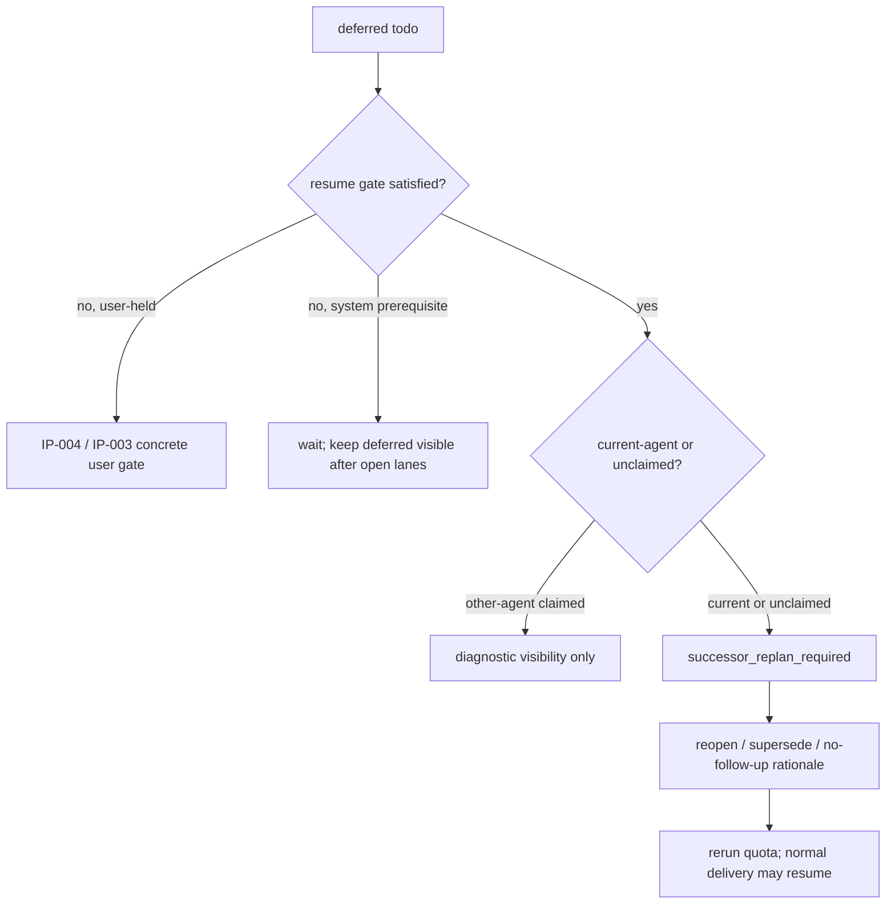
```mermaid
flowchart TD
  D["deferred todo"] --> G{"resume gate satisfied?"}
  G -->|"no, user-held"| U["IP-004 / IP-003 concrete user gate"]
  G -->|"no, system prerequisite"| W["wait; keep deferred visible after open lanes"]
  G -->|"yes"| C{"current-agent or unclaimed?"}
  C -->|"other-agent claimed"| O["diagnostic visibility only"]
  C -->|"current or unclaimed"| R["successor_replan_required"]
  R --> L["reopen / supersede / no-follow-up rationale"]
  L --> Q["rerun quota; normal delivery may resume"]
```

**Bad smell**

A ready deferred successor is rendered only inside an agent-scoped
no-candidate payload. The current peer reports "nothing runnable" even though the
system knows a previous gate is now satisfied. The opposite failure is also
bad: deferred items are mixed into ordinary open backlog before the lifecycle
step, so stale or future work outranks live open tasks.

**Validation**

- `examples/control_plane/work-lane-contract-smoke.py` covers a ready deferred successor
  returning `successor_replan_required` instead of a quiet no-op.
- `examples/control_plane/todo-durability-fixture-smoke.py` covers parsing
  `resume_when=todo_done:<todo_id>` and projecting ready deferred candidates
  after open items.
- `docs/project-agent-todo-contract.md`
- `docs/quota-allocation.md`
- `docs/status-data-contract.md`
- `skills/loopx-self-repair/references/repair-patterns.md` records
  `deferred_gate_resume_misclassified` for incident triage.

#### IP-029 Handoff Todo Gate State

**Trigger**

- a todo carries `blocks_agent=<agent-id>` and represents review, handoff,
  unblock, or owner work for that agent;
- the todo status changes among open/blocked, done, deferred, or superseded;
- the todo may name a follow-up via `unblocks_todo_id`,
  `resume_when=todo_done:<todo_id>`, or `superseded_by`; and
- `quota should-run --agent-id <agent-id>` needs to decide whether the agent
  should wait, replan, or run a concrete successor.

**Expected behavior**

`blocks_agent` todos are not only backlog rows. They are inter-agent gate
states. Status should project `agent_todos.handoff_gates[]` from the complete
todo list, not only from open lanes, using `todo_handoff_gate_v0`.

| gate_state | Todo condition | Quota effect |
| --- | --- | --- |
| `blocking` | non-terminal handoff todo for the scoped agent | return `agent_scope_wait`; name the owning reviewer/agent rather than waking the blocked agent for delivery |
| `cleared_without_successor` | done handoff with no stable successor or supersede link | return `successor_replan_required`; reopen, supersede, or record no-follow-up rationale |
| `cleared_with_successor` | done handoff linked to a successor via `unblocks_todo_id`, `resume_when`, or `superseded_by` | route to the concrete successor through normal todo selection |
| `cleared_no_followup` | done handoff carries `no_followup=true` with a compact rationale | keep as terminal history; do not wake the blocked agent for successor replan |
| `superseded` | handoff todo carries `superseded_by` | keep as history; do not wake the blocked agent from the stale gate |
| `deferred` | handoff todo is parked behind an unsatisfied resume condition | keep diagnostic visibility; IP-027 owns the ready-deferred resume path |

Quota ordering matters. Current-agent ordinary advancement still wins normal
delivery. If no ordinary current-agent successor is ready, a current-agent
`blocking` handoff wins over stale done handoffs. A
`cleared_without_successor` handoff wins over generic IP-026 no-candidate wait
because it means the handoff state changed but no replayable successor exists.
Only after those checks may IP-026 classify `scope_exhausted` or
`agent_scope_wait`.

**Visual Model**

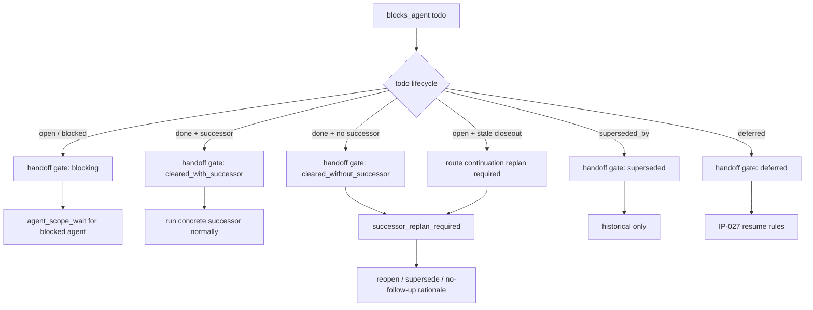
```mermaid
flowchart TD
  T["blocks_agent todo"] --> S{"todo lifecycle"}
  S -->|"open / blocked"| B["handoff gate: blocking"]
  B --> W["agent_scope_wait for blocked agent"]
  S -->|"done + successor"| C["handoff gate: cleared_with_successor"]
  C --> N["run concrete successor normally"]
  S -->|"done + no successor"| R["handoff gate: cleared_without_successor"]
  R --> L["successor_replan_required"]
  L --> F["reopen / supersede / no-follow-up rationale"]
  S -->|"open + stale closeout"| X["route continuation replan required"]
  X --> L
  S -->|"superseded_by"| H["handoff gate: superseded"]
  H --> I["historical only"]
  S -->|"deferred"| D["handoff gate: deferred"]
  D --> P["IP-027 resume rules"]
```

**Bad smell**

A done review/handoff todo disappears because only open lanes feed quota, so
the blocked agent falls into a vague `agent_scope_wait`. The opposite bad smell
is also harmful: a stale done handoff outranks a live open review blocker, so
the agent replans while a real reviewer-owned gate is still open. Both are
state-machine bugs, not prompt wording bugs.

A third bad smell is an open handoff gate whose action is already a stale
handoff closeout. That gate is no longer a live reviewer decision. It should
project `route_continuation_replan_required` so quota wakes successor replan to
reopen, supersede, or close the stale route with a no-follow-up rationale.

**Validation**

- `loopx/control_plane/todos/handoff_gate.py` owns the
  `todo_handoff_gate_v0` projection.
- `examples/control_plane/quota-cleared-blocker-successor-gate-smoke.py` covers
  `blocking`, `cleared_without_successor`, `cleared_with_successor`, and
  `superseded` gate states.
- `docs/quota-allocation.md`
- `docs/status-data-contract.md`
- `skills/loopx-self-repair/references/repair-patterns.md` records
  `handoff_gate_state_projection_gap` for incident triage.

#### IP-014 Decision Write Preview And Append

**Trigger**

- the operator is recording a run-bound `human_reward`; or
- the operator/controller is recording an `operator_gate` decision;
- a dashboard or loopback server wants to write a decision event rather than
  only render status.

**Expected behavior**

Decision writes must be exact-target, compact, previewed when browser-originated,
and append-only. `human_reward` attaches to one selected run row. `operator_gate`
records a decision run and, for approvals, a resume contract that forces the
receiving agent to re-read current registry, active state, quota, repo status,
policy, and run state before executing.

Browser reward append requires an explicit local capability, loopback origin,
matching `preview_id`, unchanged selected run, unchanged payload, unchanged raw
index count, public-safe text, and exactly one overlay append. Dashboard gate
append remains disabled until a separate equivalent handshake exists.

**Visual Model**

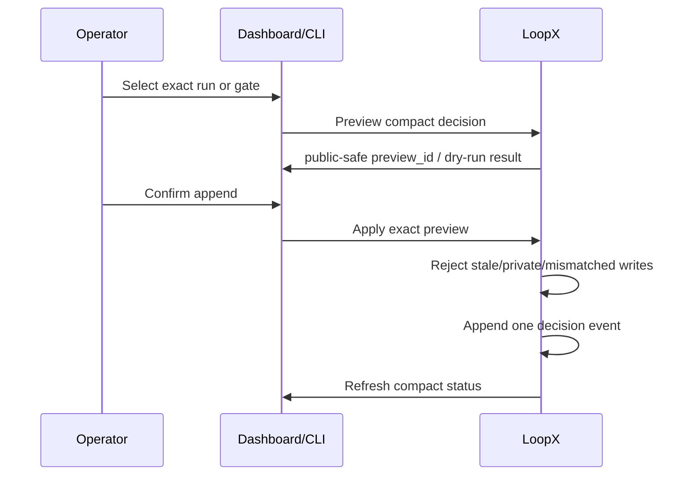
```mermaid
sequenceDiagram
  participant User as Operator
  participant UI as Dashboard/CLI
  participant GH as LoopX
  User->>UI: Select exact run or gate
  UI->>GH: Preview compact decision
  GH->>UI: public-safe preview_id / dry-run result
  User->>UI: Confirm append
  UI->>GH: Apply exact preview
  GH->>GH: Reject stale/private/mismatched writes
  GH->>GH: Append one decision event
  GH->>UI: Refresh compact status
```

**Bad smell**

The dashboard makes local reward/gate writes feel like ordinary form submission,
or an approved gate is treated as durable write authority without a fresh
decision-point re-read.

**Validation**

- `docs/reward-gate-direct-write-contract.md`
- `docs/dashboard-reward-write-boundary.md`
- `examples/reward-gate-direct-write-contract-smoke.py`
- `examples/reward-append-api-smoke.py`
- `examples/dashboard-reward-append-browser-smoke.mjs`
- `examples/project/operator-gate-resume-contract-smoke.py`

#### IP-017 User Reward Lesson Promotion

**Trigger**

- the user explicitly corrects a product route, priority, benchmark protocol,
  safety boundary, or operating rule;
- the correction supersedes a current todo, `recommended_action`, route
  assumption, or benchmark adapter plan;
- future agents would be likely to repeat the old assumption if the correction
  remains only in chat.

**Expected behavior**

The agent must pause ordinary delivery selection and promote the correction
into durable state before continuing. The minimal durable promotion is one of:

- update active `Next Action` and the relevant open `Agent Todo`;
- append or prepare a run-bound `human_reward` / operating-lesson event;
- add a concrete successor todo for the product/runtime change;
- update this catalog or the self-repair pattern table if the situation is
  reusable.

The correction should record:

- corrected rule;
- scope, such as goal, project, benchmark family, route, or adapter;
- superseded assumption;
- owner of the next implementation step;
- validation that future `quota should-run` or posthoc parity checks can see
  the rule.

This is not the same as hidden model memory. The model may remember the
conversation, but LoopX must expose a replayable hook for future agents.

**Visual Model**

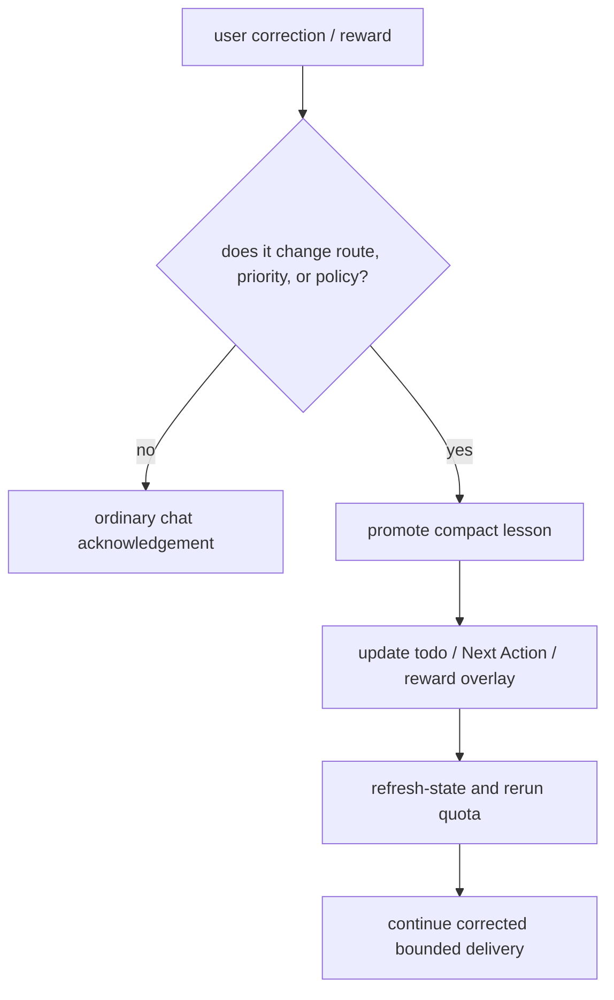
```mermaid
flowchart TD
  U["user correction / reward"] --> S{"does it change route, priority, or policy?"}
  S -->|"no"| C["ordinary chat acknowledgement"]
  S -->|"yes"| P["promote compact lesson"]
  P --> T["update todo / Next Action / reward overlay"]
  T --> Q["refresh-state and rerun quota"]
  Q --> A["continue corrected bounded delivery"]
```

**Bad smell**

The user says "the three benchmarks should run on the remote development
machine, but Codex stays local and the remote host is only the execution
environment"; a later agent turn treats missing remote Codex/Codex-ACP as the
main blocker or keeps following a stale local-only benchmark staging todo.

**Validation**

- `skills/loopx-self-repair/references/repair-patterns.md`
- `docs/state-interaction-model.md`
- future `user_reward_lesson_projection_gap` status/quota smoke that checks
  explicit operating lessons are projected into `recommended_action`,
  active `Agent Todo`, or a state-projection repair warning.

#### IP-009 Active User Assistance

**Trigger**

- the experiment or product lane explicitly enables active user assistance;
- an intervention budget/frequency policy exists;
- hidden tests, reward/pass/fail, expected solutions, and credentials remain
  hidden from the worker.

**Expected behavior**

The assistant or user simulator may provide bounded help through an audited
channel. Results must be labeled as assisted and must not be merged into
official autonomous score claims.

**Visual Model**

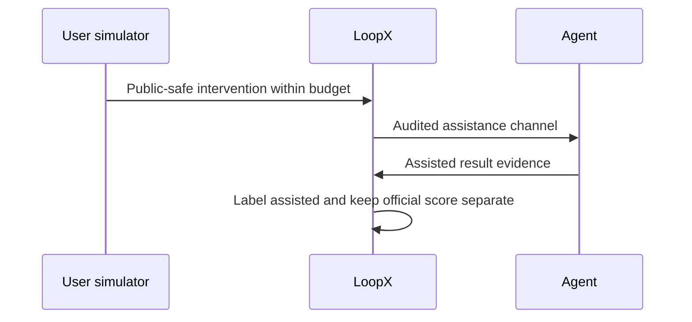
```mermaid
sequenceDiagram
  participant Sim as User simulator
  participant GH as LoopX
  participant Agent as Agent
  Sim->>GH: Public-safe intervention within budget
  GH->>Agent: Audited assistance channel
  Agent->>GH: Assisted result evidence
  GH->>GH: Label assisted and keep official score separate
```

**Bad smell**

The system calls a run "LoopX uplift" when the treatment secretly saw
reward signals, oracle information, or unbounded human hints.

**Validation**

- `examples/worker-bridge-active-user-after-start-observation-smoke.py`
- `examples/worker-bridge-install-contract-smoke.py`
- benchmark active-user protocol docs.

### State And Boundary

#### IP-005 State Projection Gap

**Trigger**

- quota says work is eligible or `must_attempt=true`;
- `agent_todo_summary.open_count=0` and `user_todo_summary.open_count=0`;
- `Next Action`, handoff prose, or recent run history still contains
  actionable work.
- compatibility lint sees explicit user-wait prose in `Next Action`, but no
  structured `User Todo` or `interaction_contract.user_channel` gate exists.

**Expected behavior**

The next step should become replan / todo expansion / blocker writeback rather
than normal delivery. Machine projection must be repaired before the controller
pretends there is no work.

When structured fields are present, they are authoritative over Markdown lint.
If `interaction_contract.user_channel.action_required=false`,
`user_todo_summary.open_count=0`, and an executable agent todo exists, the
controller should continue bounded agent work instead of asking the agent to
report "具体 user todo 未投影". Conversely, if a real owner/user gate exists, it
must be represented as a concrete user todo or scoped decision rather than only
as prose in `Next Action`.

**Visual Model**

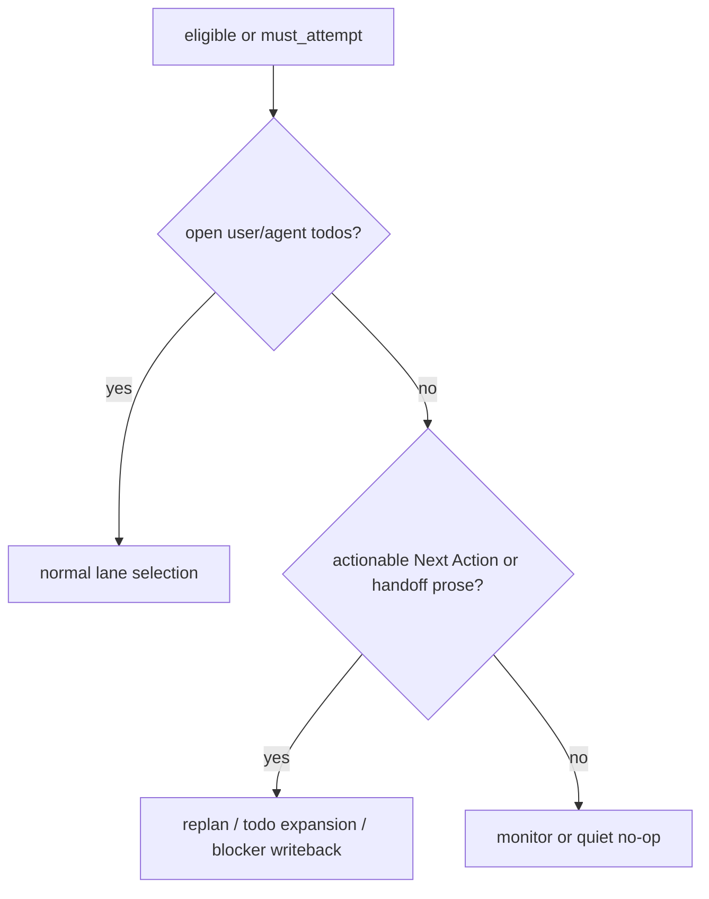
```mermaid
flowchart TD
  E["eligible or must_attempt"] --> O{"open user/agent todos?"}
  O -->|"yes"| D["normal lane selection"]
  O -->|"no"| P{"actionable Next Action or handoff prose?"}
  P -->|"yes"| R["replan / todo expansion / blocker writeback"]
  P -->|"no"| M["monitor or quiet no-op"]
```

**Bad smell**

Humans can see a next action in prose, but the machine projection sees no open
todo and the automation drifts into monitor-only no-ops.

**Validation**

- `examples/state-projection-gap-smoke.py`
- `docs/project-agent-todo-contract.md`

#### IP-006 Checkpointed Scope Mismatch

**Trigger**

- the selected todo or `recommended_action` requires writing a scope;
- `goal_boundary.write_scope` does not include that scope;
- a historical owner decision may exist, but it is not projected into the
  current boundary contract.

**Expected behavior**

LoopX should return boundary projection repair or a concrete
user/controller gate. The agent should not execute the write, and should not
spend turns on repo-only handoff if the real blocker is missing scope
projection.

Only structured checkpointed authority can extend the runtime boundary. A
historical approval written in prose is not enough. The registry may carry
`coordination.checkpointed_boundary_authority[]` entries with:

- `schema_version=checkpointed_boundary_authority_v0`;
- `write_scope`;
- `source` or equivalent public-safe provenance;
- `recorded_at`;
- optional `expires_at`;
- `decision=approve` and active status.

Fresh approved entries are compiled into `goal_boundary.write_scope` and
exposed under `goal_boundary.checkpointed_boundary_authority`. Expired,
rejected, missing-provenance, or missing-timestamp entries remain visible only
as diagnostics; they do not authorize writes.

**Visual Model**

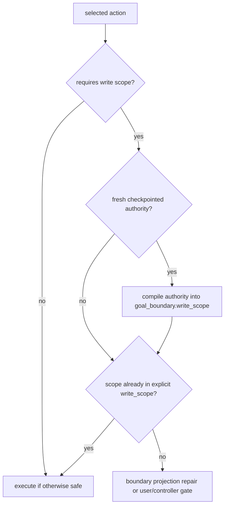
```mermaid
flowchart TD
  A["selected action"] --> S{"requires write scope?"}
  S -->|"no"| E["execute if otherwise safe"]
  S -->|"yes"| C{"fresh checkpointed authority?"}
  C -->|"yes"| P["compile authority into goal_boundary.write_scope"]
  C -->|"no"| B{"scope already in explicit write_scope?"}
  P --> B
  B -->|"yes"| E
  B -->|"no"| R["boundary projection repair or user/controller gate"]
```

**Bad smell**

The control plane remembers that a user once approved a path, but the current
quota boundary blocks it, so agents loop on small handoffs instead of repairing
the checkpointed decision.

**Validation**

- `examples/control_plane/quota-action-scope-guard-smoke.py`;
- `examples/project/configure-goal-smoke.py`;
- `docs/state-interaction-model.md` checkpointed decision sections.

#### IP-011 Authority Material Intake

**Trigger**

- a worker discovers or receives a durable design doc, research memo, owner
  packet, migration report, benchmark paper, external registry, or other source
  that future agents may need;
- the target project and `goal_id` are known;
- the material can be represented as public-safe metadata without storing raw
  URLs, document ids, local paths, source bodies, comments, credentials, or
  private logs.

**Expected behavior**

The agent should first identify the owning project, then register a compact
source contract in that project's authority surface. If the project has a
tracked `docs/meta/DOC_REGISTRY.yaml`, update that authority map first. If it
does not, use the project-local `.loopx/registry.json` through
`authority_registry.topic_authority` and `authority_registry.project_materials`.
This distinction is a storage/publication boundary, not two competing authority
systems: tracked `DOC_REGISTRY` files are project assets for review, while the
ignored `authority_registry` fallback is LoopX control-plane state.

The stored material should answer what it is, how fresh it is, which topic it
governs, whether owner review or read access is needed, and how conflicts are
resolved. It should not read or summarize the material body as part of the
registration step.

**Visual Model**

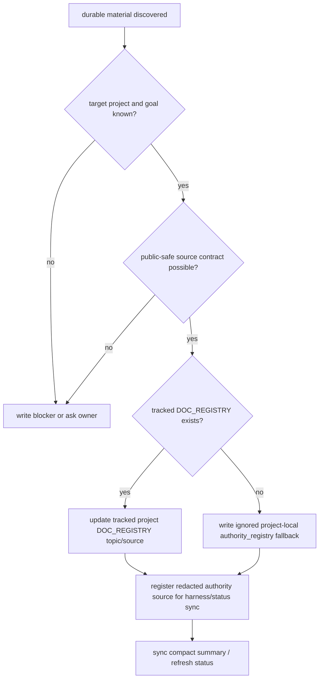
```mermaid
flowchart TD
  M["durable material discovered"] --> P{"target project and goal known?"}
  P -->|"no"| B["write blocker or ask owner"]
  P -->|"yes"| R{"public-safe source contract possible?"}
  R -->|"no"| B
  R -->|"yes"| D{"tracked DOC_REGISTRY exists?"}
  D -->|"yes"| Y["update tracked project DOC_REGISTRY topic/source"]
  D -->|"no"| L["write ignored project-local authority_registry fallback"]
  Y --> C["register redacted authority source for harness/status sync"]
  L --> C
  C --> S["sync compact summary / refresh status"]
```

**Bad smell**

An agent remembers an important article or design only in chat, or registers it
into the meta controller because that is the current repo, even though the
material belongs to another connected project.

**Validation**

- `docs/authority-source-registration.md`
- `examples/register-authority-source-smoke.py`
- `examples/import-doc-registry-authority-smoke.py`
- `examples/platform-migration-material-registry-smoke.py`

#### IP-016 Task Lease Claim

**Trigger**

- multiple agents, heartbeats, child workers, or frontstage channel views may
  act on the same todo;
- the selected work has a bounded `todo_id`, owner, TTL, write scope, and
  idempotency key;
- the system needs to prevent duplicate work, duplicate spend, or overlapping
  writes without moving truth into chat.

**Expected behavior**

`claimed_by` remains the default soft routing signal. When a host has a concrete
exclusive-write need, it may explicitly acquire `task_lease_v0`: an expiring
hard lease over one bounded todo. The pending key is `(goal_id, todo_id)`:
`goal_id` names the control-plane lane, while `todo_id` names the work item
inside it. Different
todos inside the same goal do not conflict merely because they share a goal;
only competing pending leases for the same `todo_id` or overlapping write
scopes should conflict. Status exposes whether the optional lease capability is
available, and channel projections may render supplied lease rows. The lease is
not enforced by `quota should-run` and does not override `goal_boundary`, user
gates, capabilities, or write-scope checks.

When a lease is active and the selected action is inside its scope, the owner
may proceed. When a competing worker sees an active overlapping lease, it must
choose a non-overlapping fallback, wait, or surface a conflict. Expired leases
need cleanup or renewal before they authorize continued work.

**Visual Model**

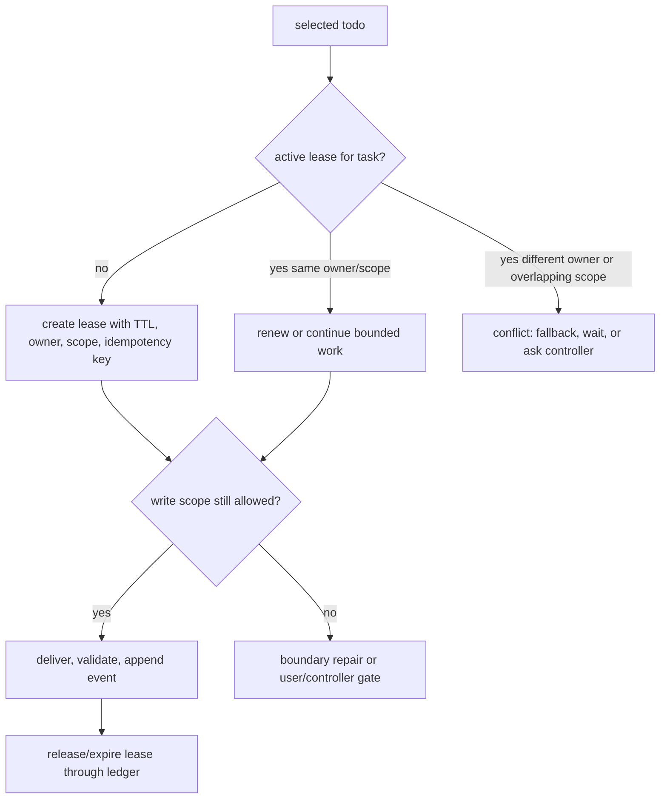
```mermaid
flowchart TD
  T["selected todo"] --> A{"active lease for task?"}
  A -->|"no"| C["create lease with TTL, owner, scope, idempotency key"]
  A -->|"yes same owner/scope"| R["renew or continue bounded work"]
  A -->|"yes different owner or overlapping scope"| K["conflict: fallback, wait, or ask controller"]
  C --> W{"write scope still allowed?"}
  R --> W
  W -->|"yes"| D["deliver, validate, append event"]
  W -->|"no"| G["boundary repair or user/controller gate"]
  D --> X["release/expire lease through ledger"]
```

**Bad smell**

Two workers repeat the same task, double-spend quota, or write overlapping
files because the only ownership signal was a chat message or dashboard label.

**Validation**

- `docs/frontstage-channel-lease-roadmap.md`
- `docs/architecture.md` local server / daemon roadmap
- `examples/control_plane/task-lease-runtime-smoke.py`.

#### IP-019 Peer Scoped Continuation

**Trigger**

- a shared-control-plane goal declares `coordination.agent_model=peer_v1` and
  `coordination.registered_agents`;
- a peer has an advisory profile/scope and a current-agent or unclaimed todo;
- task, goal, capability, and repository policy permit the selected action.

**Expected behavior**

The control plane keeps identity and ownership visible without turning scope
into rank or copying broad scope into todo metadata. The peer claims one
concrete eligible todo:

```bash
loopx todo claim \
  --goal-id <goal-id> \
  --todo-id <todo_id> \
  --claimed-by <peer-agent-id>
```

When the selected task writes repository state, `agent_workspace_guard_v1`
enforces the task/repository isolation policy. Read-only and monitor-only work
does not require an isolated checkout merely because of agent identity. When a
slice is small, validated, and allowed by repository policy, the peer may
self-merge and complete with evidence:

```bash
loopx todo complete \
  --goal-id <goal-id> \
  --todo-id <todo_id> \
  --claimed-by <peer-agent-id> \
  --self-merged \
  --evidence "<commit, validation, and self-merge summary>"
```

Completion uses typed task policy. `independent_handoff` creates a non-blocking
successor, `same_agent_non_delivery` keeps a continuation with the same peer,
and review remains an ordinary action kind. `excluded_agents` expresses the
rare executor-separation constraint; `unblocks_todo_id` expresses dependency
lineage. No profile or goal field supplies an implicit reviewer. `claimed_by`
remains a soft owner and not a permission grant: quota, user gates, boundaries,
capabilities, write scopes, and repository rules still apply.

Because prompt text alone is not a reliable guard, `quota should-run --agent-id
<peer-agent-id>` projects `workspace_guard` when a repository-writing task is
running from a non-git, unrelated, or non-isolated checkout. In that state
`normal_delivery_allowed=false` and
`interaction_contract.mode=agent_workspace_repair`: the only allowed action is
to move to a compliant worktree/branch and rerun the guard before editing.
Workspace repair is preflight and does not spend quota.

The same scoped identity must be carried through the whole successful turn.
If `quota should-run` was evaluated with `--agent-id <peer-agent-id>`, follow-up
commands that interpret the same turn's control-plane state, especially
`refresh-state` and `quota spend-slot`, should use that same registered
`--agent-id` when the subcommand supports it. Otherwise the spend/accounting
preview can be evaluated as an unscoped automation and report
`automation_prompt_upgrade_required` even though the delivery decision was
made under a valid peer scope. The fix is not to ignore that warning; the
fix is to preserve the identity envelope across guard, writeback, accounting,
and rollout evidence.

**Visual Model**

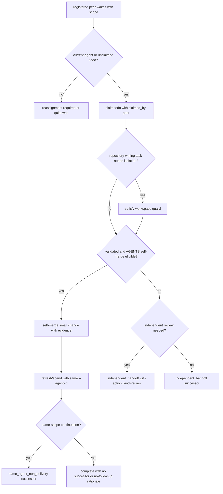
```mermaid
flowchart TD
  S["registered peer wakes with scope"] --> T{"current-agent or unclaimed todo?"}
  T -->|"no"| Q["reassignment required or quiet wait"]
  T -->|"yes"| C["claim todo with claimed_by peer"]
  C --> W{"repository-writing task needs isolation?"}
  W -->|"yes"| B["satisfy workspace guard"]
  W -->|"no"| V
  B --> V{"validated and AGENTS self-merge eligible?"}
  V -->|"yes"| M["self-merge small change with evidence"]
  M --> I["refresh/spend with same --agent-id"]
  I --> K{"same-scope continuation?"}
  K -->|"yes"| N["same_agent_non_delivery successor"]
  K -->|"no"| X["complete with no successor or no-follow-up rationale"]
  V -->|"no"| R{"independent review needed?"}
  R -->|"yes"| P["independent_handoff with action_kind=review"]
  R -->|"no"| H["independent_handoff successor"]
```

**Bad smell**

An agent edits from a workspace forbidden by the selected task, chooses work
from chat memory instead of the shared todo list, encodes scope into todo
metadata, self-merges broad or runtime-sensitive work, or invents an implicit
review owner. A related bad smell is treating
"the prompt said use a worktree" as sufficient product protection; the guard
must be machine-visible before the first file edit. Another bad smell is a
scoped peer run that passes `quota should-run --agent-id ...` but later
spends without `--agent-id`, producing an unscoped accounting snapshot that
looks like a stale automation prompt instead of the completed scoped turn.

**Validation**

- `docs/project-agent-todo-contract.md`
- `docs/codex-subagent-orchestration.md`
- `docs/heartbeat-automation-prompt.md`
- `examples/control_plane/todo-lifecycle-cli-smoke.py`
- `examples/control_plane/todo-cli-smoke.py`
- `examples/control_plane/todo-concurrent-write-lock-smoke.py`
- `examples/control_plane/heartbeat-prompt-smoke.py`
- `examples/control_plane/peer-agent-workspace-guard-smoke.py`

#### IP-020 Todo Claim / Supersede / Successor Lifecycle

**Trigger**

- a selected agent todo has a stable `todo_id` and the current agent is about
  to spend a delivery turn on it;
- a todo has become stale because the user changed the route, new evidence made
  the old wording wrong, or a narrower replacement should become the first
  executable item;
- a non-trivial slice is complete but the feature still needs rollout,
  product-path proof, docs, benchmark evidence, telemetry, or review;
- multiple registered agents can see the same checklist and need ownership to
  be visible without moving scope into todo metadata.

**Expected behavior**

The agent claims concrete work before delivery:

```bash
loopx todo claim \
  --goal-id <goal-id> \
  --todo-id <todo_id> \
  --claimed-by <agent-id>
```

`claimed_by` is a soft owner, not permission. It must be checked against
registered agent ids and must not bypass quota, user gates, write boundaries,
repository policy, validation, or public/private scans.

When an open todo is wrong rather than merely incomplete, the agent should
supersede it instead of editing its text in place or marking it done:

```bash
loopx todo supersede \
  --goal-id <goal-id> \
  --todo-id <todo_id> \
  --reason "<public-safe reason>" \
  --next-agent-todo "<replacement executable action>"
```

Supersede preserves the old work item as history, records `superseded_by`, and
makes the replacement the durable current route. Use it for route changes,
stale benchmark lanes, narrowed blockers, or user-corrected priorities.

When a non-trivial slice is completed, the completion must either create a
successor todo or record why no successor is needed:

```bash
loopx todo complete \
  --goal-id <goal-id> \
  --todo-id <todo_id> \
  --evidence "<public-safe validation or artifact>" \
  --next-agent-todo "<next rollout/proof/docs/review step>"
```

Successor todos are the lightweight lifecycle model. LoopX should not
grow many feature states such as slice_done, rolled_out, or proven_in_product
unless a UI/runtime need appears. A done todo means the current slice is done;
the successor expresses the next slice. If there is truly no follow-up, the
completion note must include a compact no-follow-up rationale.

**Visual Model**

```mermaid
flowchart TD
  S["selected open todo"] --> C{"claimed by this agent?"}
  C -->|"no"| L["claim with claimed_by"]
  C -->|"yes"| W["deliver bounded slice"]
  L --> W
  W --> V{"validated?"}
  V -->|"no"| B["write blocker or keep todo open"]
  V -->|"yes"| R{"old todo still describes the route?"}
  R -->|"no"| U["supersede with replacement todo"]
  R -->|"yes"| F{"follow-up needed?"}
  F -->|"yes"| N["complete with successor todo"]
  F -->|"no"| X["complete with no-follow-up rationale"]
  U --> Q["refresh-state / quota projects successor"]
  N --> Q
  X --> Q
```

**Bad smell**

The agent starts work without claiming the todo, rewrites an open todo after a
route correction so history is lost, marks a broad feature done after one PR
without a successor, creates a successor only in chat, or treats `claimed_by` as
permission to ignore gates and boundaries.

**Validation**

- `docs/project-agent-todo-contract.md`
- `examples/control_plane/todo-lifecycle-cli-smoke.py`
- `examples/control_plane/todo-cli-smoke.py`
- `examples/control_plane/todo-concurrent-write-lock-smoke.py`
- future status/quota smoke that verifies first executable successor projection
  after `todo supersede` and `todo complete --next-agent-todo`.

#### IP-022 Claimed Todo Visibility And Agent-Lane Next Action

**Trigger**

- status or quota summarizes a todo set with more open work than the small
  scheduler top-N can show;
- registered peers use `claimed_by`, especially when one peer's scoped work may
  sit behind higher-priority work claimed by another peer;
- a dashboard, review packet, or heartbeat prompt needs to show ownership,
  current-agent work, and monitor responsibilities without changing which
  executable todo the scheduler selects.

**Expected behavior**

Todo projection has two jobs that should not collapse into one list:

1. **Scheduling**: choose a narrow set of runnable candidates for the current
   guard, capability check, and steering audit.
2. **Visibility**: keep ownership, claimed work, and monitor lanes observable
   for humans, dashboards, and scoped agents.

Status and quota may still expose `first_open_items`,
`first_executable_items`, and `executable_backlog_items` as compact scheduler
surfaces. They should also project bounded visibility lanes:

- `unclaimed_priority_open_items`: priority-ranked unclaimed work that an agent
  may consider claiming;
- `claimed_open_items`: claimed work that may be outside the scheduler top-N;
- `claimed_advancement_open_items`: claimed executable delivery work;
- `claimed_monitor_open_items`: claimed continuous-monitor work;
- for agent-scoped quota payloads,
  `current_agent_claimed_open_items`,
  `current_agent_claimed_advancement_items`,
  `current_agent_claimed_monitor_items`, and `claimed_by_others_items`.

The default agent-facing lane cap should remain modest, currently 16 items per
lane, with count fields showing when more work exists. Rich frontstage views
that need more than this should use a paged or filtered projection rather than
inflating every heartbeat/quota payload. Monitor lanes remain visibility
context unless they record a material transition or blocker; they should not
steal the advancement slot simply because they are claimed.

When a claimed visibility lane has more items than the lane cap, truncation
should be claimant-balanced rather than raw top-N. First sort claimed items by
priority and source position, then group them by `claimed_by`, take a fair
per-claimant slice within the cap, and fill any remaining slots from the
priority-ordered remainder. The goal is not strict round-robin display order;
it is to keep one agent's long queue from hiding another agent's claimed work.

Agent-scoped quota then applies focus ordering after visibility balancing:
current-agent claimed items first, unclaimed items second, and other-agent
claimed items last with lower weight. Other-agent claims remain visible and may
be inspected when nothing better is available, but they should not crowd out
the current agent's own claimed advancement or genuinely unclaimed work.
`claimed_by` remains a soft ownership signal, not a lock, lease, capability
grant, or gate bypass.

For agent-scoped execution payloads, quota may also expose a narrow
`agent_lane_next_action` object with
`schema_version=agent_lane_next_action_v0`. It is derived from the same scoped
runnable queue: prefer `capability_gate.runnable_candidates`, then
`agent_todo_summary.first_executable_items`, then
`agent_todo_summary.executable_backlog_items`; filter out other-agent claimed
todos; select current-agent claimed todos before unclaimed fallback, and within
that claim bucket prefer `capability_repair_mode=true` before ordinary runnable
work of the same priority. This object is an agent-lane pointer, not a goal-level route rewrite,
so it must include `preserves_goal_next_action=true`. Status may attach the same
object for `--agent-id` observation, but it must not replace the item
`recommended_action`, `project_asset.next_action`, owner, or waiting lane.

**Visual Model**

```mermaid
flowchart TD
  T["parsed todo set"] --> S["scheduler lanes: first/open/executable candidates"]
  T --> B["claimed lane claimant-balanced truncation"]
  B --> V["visibility lanes: claimed, unclaimed, monitor"]
  S --> Q["quota/capability guard chooses runnable candidate set"]
  Q --> A["agent steering audit chooses actual todo"]
  Q --> N["agent_lane_next_action for --agent-id scoped turns"]
  V --> F["dashboard/frontstage/review packet shows ownership"]
  V --> C{"agent identity present?"}
  C -->|"yes"| M["current-agent claimed > unclaimed > other-agent claimed"]
  C -->|"no"| G["global claimed/unclaimed ownership view"]
  F --> H["human sees who owns what without changing scheduler result"]
```

**Bad smell**

A peer claims a productization todo, but status/quota only expose the
first few priority-ranked benchmark todos. The agent then appears idle or
unowned work appears available even though the control plane already knows its
owner. The opposite bad smell is also harmful: a large claimed-work list is fed
directly into the scheduler or heartbeat prompt, causing noisy routing and
monitor work to crowd out the selected advancement lane.

Another concrete bad case: an operator asks the agent to monitor one PR until
merge, but the agent edits a generic heartbeat automation prompt to include
that PR-specific polling logic. That couples one monitor target to the
scheduler, makes the automation harder to regenerate from `heartbeat-prompt`,
and risks deleting or mutating the whole heartbeat when the PR closes. The
correct representation is a `continuous_monitor` todo, optionally with
`unblocks_todo_id`, while the heartbeat remains generic and discovers the
monitor through status/quota/todo projection.

**Validation**

- `docs/status-data-contract.md`
- `examples/control_plane/todo-first-open-summary-smoke.py`
- `examples/control_plane/work-lane-contract-smoke.py` for `agent_lane_next_action_v0`
  preserving the goal-wide `Next Action` while surfacing the current peer's TUI
  slice.
- `examples/control_plane/status-markdown-smoke.py` for `status --agent-id` rendering the same
  agent-lane pointer without replacing the project route.
- PR #262 / commit `292a2c8`: additive status/quota visibility lanes with a
  16-item agent-facing cap.

#### IP-026 Agent-Scoped No-Candidate Gap

**Trigger**

- `quota should-run --agent-id <agent>` returns `should_run=true` or
  `interaction_contract.agent_channel.must_attempt=true`;
- the same payload has no `agent_lane_next_action`;
- `current_agent_claimed_advancement_items` is empty;
- no runnable candidate is projected for that agent;
- no current-agent or unclaimed deferred resume candidate is ready; and
- the recommended action points at another agent's lane, an out-of-scope lane,
  or a goal-level route the current agent cannot safely advance.

**Expected behavior**

Agent-scoped quota must distinguish "the goal has runnable work" from "this
agent has runnable work." When the current agent has no in-scope candidate,
quota should not force a delivery turn. This pattern applies only after the
guard has also checked IP-027 and found no ready current-agent or unclaimed
deferred resume candidate, and after IP-029 has found no current-agent handoff
gate state that should wait or replan. If a deferred resume candidate is ready,
IP-027 owns the `successor_replan_required` path; if a handoff review todo has
changed state, IP-029 owns the handoff wait or successor-replan path. IP-026
must not swallow either case as "nothing runnable."

When the scoped frontier is truly empty, quota should project one of these
machine states:

- `scope_exhausted`: no current-agent or unclaimed candidate matches the
  registered agent profile and boundary;
- `agent_scope_wait`: an explicit blocking review/handoff dependency is owned
  by another peer and must clear before the current peer can continue;
- `reassignment_required`: useful work exists, but ownership must be changed
  before this agent may treat it as its lane.

The interaction contract should then set:

```text
agent_channel.must_attempt=false
agent_channel.delivery_allowed=false
agent_channel.quiet_noop_allowed=true
```

The user channel remains quiet unless a concrete user todo exists. The
recommended action should name the scoped condition, not borrow the global
goal-level route. A peer should be allowed to no-op without spend, or
claim a newly exposed in-scope todo before delivery becomes allowed again.

This pattern is the runtime counterpart of IP-022. IP-022 makes claimed,
deferred, handoff, and agent-lane work visible; IP-026 says what to do when the
scoped open frontier is empty, IP-027 has not found a ready deferred gate
resume, and IP-029 has not found a handoff todo gate state for the scoped
agent.
If the only apparent blocker is a user todo with `blocks_agent` pointing at a
different agent, IP-003 owns the case before IP-026: filter that other-agent
gate out of the current agent's blocking user summary, then decide whether the
current agent still has runnable work. If it does, delivery may continue; if it
does not, IP-026 can classify the remaining empty frontier.

**Visual Model**

```mermaid
flowchart TD
  Q["quota should-run --agent-id side"] --> F{"current-agent frontier?"}
  F -->|"current-agent candidate"| D["bounded delivery allowed"]
  F -->|"unclaimed in-scope candidate"| C["agent may claim before delivery"]
  F -->|"no open candidate"| R{"IP-027 ready deferred resume?"}
  R -->|"yes"| P["defer to IP-027"]
  R -->|"no"| G{"IP-029 handoff gate state?"}
  G -->|"blocking or cleared_without_successor"| K["defer to IP-029"]
  G -->|"none"| X["scope_exhausted / agent_scope_wait"]
  F -->|"only other-agent or out-of-scope work"| X
  X --> N["quiet no-op, no spend"]
  X --> H["owning agent may advance, merge, or reassign"]
  H --> Q
```

**Bad smell**

A peer heartbeat receives `should_run=true`,
`delivery_allowed=true`, and `quiet_noop_allowed=false` even though
`agent_lane_next_action=None`, `current_agent_claimed_advancement_items=[]`,
and the only recommendation is another agent's benchmark or runtime lane. The
agent either churns through repeated empty heartbeats or risks working outside
its registered scope. A related failure is treating a ready deferred successor
as part of this no-candidate pattern instead of routing it through IP-027's
gate-resume lifecycle, or treating a handoff todo lifecycle change as generic
agent wait instead of routing it through IP-029. The opposite bad smell is also
harmful: deferred or handoff items are mixed into the open todo list, so stale
or future work outranks live open tasks.

**Validation**

- future quota/status regression with two registered peers where all runnable
  work is claimed by the other peer and the current `--agent-id` call returns
  `reassignment_required` unless an explicit blocking review dependency exists;
- `examples/control_plane/work-lane-contract-smoke.py` should cover that an empty
  current-agent frontier cannot produce `delivery_allowed=true`;
- `docs/project-agent-todo-contract.md`
- `docs/quota-allocation.md`
- `docs/status-data-contract.md`
- `examples/control_plane/quota-agent-scoped-user-gate-smoke.py` for the nearby case where
  a user gate is real but scoped to a different agent and therefore must not
  create current-agent scope exhaustion.
- `examples/control_plane/quota-cleared-blocker-successor-gate-smoke.py` for the nearby
  case where a `blocks_agent` handoff todo directly controls the scoped gate.
- `skills/loopx-self-repair/references/repair-patterns.md` records
  `agent_scoped_no_candidate_gap` and `handoff_gate_state_projection_gap` for
  incident triage.

#### IP-023 Status Neutral Run Window

**Trigger**

- `quota should-run` reports no user action or quiet monitor behavior, but
  `status` / `diagnose --limit N` falls back to a stale registry state,
  controller gate, or older connected-without-run state;
- recent history is dominated by status-neutral entries such as quota monitor
  polls, slot-spend records, readiness pings, or display-only refreshes;
- a short UI/history limit hides the latest meaningful state transition just
  behind the visible window.

**Expected behavior**

Status, diagnose, quota, and history should share the same neutral-run
classification contract. Neutral runs are real evidence for cadence and stall
analysis, but they are not authoritative state transitions by themselves. When
computing the current control-plane state, the implementation should reason
over an internal window wide enough to skip neutral noise and find the latest
meaningful state run before trimming the run list for UI display.

UI display limit must not become the control-plane reasoning window. A user can
ask for `--limit 5` to keep output compact, but state selection should still
look far enough back to avoid projecting a fake controller/user gate. If no
meaningful state run exists inside the internal reasoning window, status should
say that explicitly instead of inventing a gate.

**Visual Model**

```mermaid
flowchart LR
  H["recent run history"] --> N["classify neutral vs meaningful runs"]
  N --> W["reason over internal state window"]
  W --> M{"meaningful state run found?"}
  M -->|"yes"| S["project current status from that run"]
  M -->|"no"| U["report unknown/no signal without fake gate"]
  S --> D["trim displayed rows to UI limit"]
  N --> E["retain neutral rows as stall/cadence evidence"]
```

**Bad smell**

A monitor-only loop fills the most recent five history rows, so `status --limit
5` claims the agent needs a controller connection or user decision even though
quota says `monitor_quiet_skip` and no user todo is open. The bad state is not
that monitor rows exist; it is that a presentation limit changed the meaning of
the control plane.

**Validation**

- `docs/status-data-contract.md`
- `skills/loopx-self-repair/references/repair-patterns.md`
- future regression where the latest N runs are neutral and the N+1 run is the
  authoritative state transition.

#### IP-025 Experimental Diagnostic Sidecar Boundary

**Trigger**

- a route-specific proof or debug tool emits verdict fields, such as Codex CLI
  visible attach decisions, runtime-idle blockers, continuation outcomes, or
  fallback contracts;
- an implementation proposes copying those verdicts into a stable hot-path
  agent packet, status schema, dashboard contract, or `protocol_action_packet_v0`;
- the verdict semantics still depend on one experimental surface, a human
  observation, a fixture-only proof, or a temporary product question.

**Expected behavior**

Experimental proof/debug verdicts are sidecar diagnostics first. They may be
public-safe, structured, versioned, and useful, but they do not become stable
agent-facing packet fields until the abstraction is product-general and
validated across the surfaces that will consume it.

The stable hot path should keep expressing generic control-plane obligations:
user action, agent action, work lane, gate state, quiet-noop allowance, spend
policy, and compact action label. Route-specific proof fields stay in the
sidecar that owns their evidence. For the current Codex CLI/TUI path, verdicts
such as `visible_session_proof_required`,
`runtime_idle_evidence_required`, `same_tui_visible_attach_accepted`,
`accepted_for_same_tui_automation`, `continuation_outcome`, and
`fallback_contract` belong in the visible attach/proof or observation packet,
not in `protocol_action_packet_v0` or the routine quota/status packet shape.

Promotion from sidecar to stable schema needs an explicit schema decision:

- the field name is not tied to one route's debug wording;
- at least one non-Codex-CLI or future-runtime consumer can use the same
  abstraction without reinterpretation;
- public/private boundaries and no-transcript/no-session-file constraints are
  documented;
- failure modes are represented as generic obligations or blockers, not as
  product-spike labels;
- smoke tests prove both the sidecar verdict and the stable packet remain
  compatible.

The Codex CLI/TUI consequence is narrow but important: a manual
same-open-TUI observation can prove that the first bootstrap continuation stayed
visible, while scheduled same-TUI attach remains blocked by proof/idle
requirements. That distinction is valid evidence, but it should not force every
agent heartbeat or dashboard row to learn Codex-specific verdict fields.

**Visual Model**

```mermaid
flowchart TD
  P["experimental proof or debug packet"] --> V["route-specific verdict fields"]
  V --> S{"product-general abstraction validated?"}
  S -->|"no"| D["keep as sidecar diagnostic; link from docs/status when useful"]
  S -->|"yes"| R["write schema decision and compatibility smoke"]
  R --> H["promote generic field into stable hot-path packet"]
  D --> C["stable packet keeps generic user/agent/gate/spend obligations"]
  H --> C
```

**Bad smell**

A proof spike adds `same_tui_visible_attach_accepted` or
`visible_session_proof_required` directly to a generic runtime packet, and
future agents start treating a Codex CLI debug verdict as a universal routing
field. The opposite bad smell is losing the proof entirely: the diagnostic
sidecar is public-safe and useful, but no doc or smoke says why it stayed out of
the stable schema.

**Validation**

- `docs/reference/protocols/protocol-action-packet-decision-v0.md`
- `docs/product/codex-cli-same-open-tui-continuation-observation.md`
- `examples/interaction-pattern-catalog-smoke.py`
- `examples/codex-cli-visible-attach-acceptance-smoke.py`

#### IP-028 Connector Runtime Boundary

**Trigger**

- a connector todo or packet proposes running a browser, chat, platform, or
  document connector against a real service;
- the source status is `private_needs_review`, `metadata_only`, or otherwise
  constrained by an owner gate;
- a live connector route can autoload source bodies, message lists, derived
  reports, media, or engagement data before the agent can stop it.

**Expected behavior**

Connector packets must carry a machine-readable runtime policy before the first
browser/API run. The policy says which probes are allowed before approval, which
URLs or path prefixes are forbidden, whether browser open is allowed, and what
owner decision unblocks the next stage. For private connectors, the safe default
is gate projection only. For public metadata connectors, the safe default is a
bounded metadata probe rather than opening a page that may autoload timelines,
media, or analytics.

This pattern complements IP-004. IP-004 makes the owner ask concrete; IP-028
prevents the connector runtime from accidentally consuming the gated material
while the ask is still pending.

**State contract**

```text
connector_runtime_policy = {
  schema_version: content_ops_connector_runtime_policy_v0,
  access_mode: public_metadata_only | private_metadata_only | synthetic_fixture_only,
  safe_default: head_only_metadata_probe | gate_projection_only | fixture_only,
  browser_open_allowed_before_gate: false,
  allowed_probe_methods: [...],
  forbidden_url_path_prefixes_before_approval: [...],
  forbidden_before_approval: [...]
}
```

**Bad smell**

An agent opens a private connector's default web route because the page looks
like a convenient UI, but that route automatically calls message-list or
message-detail APIs. Another bad smell is treating a public social profile as
"metadata only" while the browser auto-downloads timelines, post bodies, media,
or engagement streams.

**Validation**

- `docs/reference/protocols/content-ops-surface-v0.md`;
- `examples/content-ops-public-handle-observation-smoke.py`;
- `examples/content-ops-private-connector-gate-smoke.py`;
- `examples/interaction-pattern-catalog-smoke.py`.

### Evidence Lifecycle

#### IP-012 External Evidence Observation

**Trigger**

- `waiting_on=external_evidence`, a launched external worker is being polled, or
  `interaction_contract.mode=external_evidence_observation`;
- the selected action is evidence observation, compact result ingest, or compact
  blocker writeback;
- benchmark/model/Docker/cloud execution is not explicitly authorized by the
  current guard.

**Expected behavior**

The agent must distinguish observing an external handle from launching new
external work. If a compact handle exists, it may poll or ingest compact
public-safe result files. If the required handle is missing, the correct action
is a compact blocker or projection repair, not a quiet no-op. Benchmark
execution, model calls, Docker, cloud jobs, uploads, and leaderboard paths stay
blocked unless the guard explicitly selects that work.

**Visual Model**

```mermaid
flowchart TD
  E["external evidence mode"] --> H{"observable handle present?"}
  H -->|"no"| B["write compact blocker / repair projection"]
  H -->|"yes"| P{"compact result or failure marker present?"}
  P -->|"no"| O["bounded poll; no spend if unchanged"]
  P -->|"yes"| I["ingest compact result or blocker"]
  I --> V["validate boundary and write event"]
  V --> N["next guard decision"]
```

**Bad smell**

The heartbeat treats external-evidence waiting as a harmless quiet skip even
though the guard requires an observable handle, or it launches a benchmark run
from a meta/controller poll that was only authorized to observe.

**Validation**

- `regression/external-evidence-observation-real-codex.py`
- `examples/benchmark-lifecycle-state-smoke.py`
- `docs/state-interaction-model.md`

#### IP-015 Benchmark Lifecycle Countability

**Trigger**

- a benchmark adapter, runner wrapper, or reducer observes preflight, launch,
  materialization, compact result, comparison, claim review, or learning-ledger
  evidence;
- a controller is deciding whether a process launch, case attempt, score,
  budget spend, rerun, or public claim is countable.

**Expected behavior**

Benchmark work should advance through compact lifecycle gates instead of raw
runner narratives. `process_started` alone is not case entry. Case entry starts
at `job_root_materialized` or later. Budget/counting and candidate selection
require compact result ingestion, claim boundary review, and learning-ledger
state where applicable. Terminal failure markers can close out a launched
attempt without making it a case attempt or benchmark-budget event.

**Visual Model**

```mermaid
flowchart LR
  P["preflight ready"] --> L["process started"]
  L --> M{"job root / trial materialized?"}
  M -->|"no"| B["not countable; materialization blocker"]
  M -->|"failure marker"| F["terminal compact failure closeout"]
  M -->|"yes"| R["compact result ingest"]
  R --> C["claim / attribution review"]
  C --> G{"learning ledger ready?"}
  G -->|"no"| W["block budget count / candidate switch"]
  G -->|"yes"| K["budget count allowed"]
```

**Bad smell**

A runner PID, detached process, stale active job, or raw log tail is treated as
evidence of a benchmark case attempt or score claim before the compact lifecycle
state says it is countable.

**Validation**

- `docs/research/long-horizon-agent-benchmarks/benchmark-core-adapter-contract-v0.md`
- `docs/research/long-horizon-agent-benchmarks/terminal-bench-runner-mode-contract-v0.md`
- `examples/benchmark-lifecycle-state-smoke.py`
- `examples/benchmark-core-adapter-contract-smoke.py`
- `examples/terminal-bench-runner-mode-contract-smoke.py`

### Planning Governance

#### IP-013 Autonomous Replan Vs Advisory Dreaming

**Trigger**

- no-progress streaks, repeated action loops, phase transitions, or periodic
  review thresholds make a blocking `autonomous_replan_obligation_v0` visible
  in active state, status, quota, or run history; or
- a background planning lane surfaces `dreaming_proposal_v0` /
  `server_managed_planning_contract_v0` as advisory context.

**Expected behavior**

An autonomous replan obligation is executable repair work: split, add, retire,
or re-rank todos so the next delivery segment can advance. A dreaming proposal
is advisory until promoted by an operator/controller decision and a normal
quota/boundary check. Dreaming proposals may be displayed alongside a blocking
replan obligation, but they stay a side lane: they can inform review or repair,
not enter promotion/execution until the blocking replan obligation is absent or
resolved. The two lanes must not collapse into each other.

Replan closeout is explicit. A normal validated progress refresh may record
useful work, but it must not silently close the
`autonomous_replan_obligation_v0`. After the agent performs the bounded replan
slice and writes back the selected todo/guidance changes, it must append a
structured ACK:

```bash
loopx refresh-state \
  --goal-id <goal-id> \
  --classification autonomous_replan_recorded \
  --autonomous-replan-recorded \
  --repair-delta-kind runnable_todo_set \
  --delivery-batch-scale <scale> \
  --delivery-outcome <outcome>
```

The resulting run carries `autonomous_replan_ack_v0` with
`repair_delta_contract_v0`. Classification remains a human-readable history
label; the structured ACK plus `delta_present=true` is the control-plane signal
that lets status/quota stop projecting the replan obligation. This keeps agents
responsible for actively closing the loop instead of relying on loose
classification wording such as `autonomous_replan_validated_*`.
If `--autonomous-replan-recorded` is used without a delta, the run is stored as
`replan_noop`/`repair_noop`; any progress outcome is downgraded so it cannot
hide the unresolved obligation.

A replan ACK should also change the work frontier. It should add, split,
supersede, complete-with-successor, or block a todo, or else record an explicit
watch-lane continuation. If the runnable todo set, user gate, blocker state,
monitor target, or `effective_action` does not change, the replan is likely a
no-op and should not hide the stall.

**Visual Model**

```mermaid
flowchart TD
  S["status / run history"] --> R{"blocking replan obligation visible?"}
  S --> D{"dreaming proposal present?"}
  D -->|"yes"| V["display advisory dreaming side lane"]
  D -->|"no"| Z["no dreaming side lane"]
  R -->|"yes"| A["execute bounded replan repair"]
  A --> T["update todos / guidance"]
  T --> C["append structured replan ACK"]
  C --> Q["rerun quota guard"]
  V -. "may inform repair; no delivery spend while blocked" .-> A
  R -->|"no"| G{"dreaming proposal eligible for promotion?"}
  G -->|"yes"| U["ask/promote through user or controller gate"]
  U --> P{"promoted and boundary approved?"}
  P -->|"yes"| Q
  P -->|"no"| X["proposal remains non-executable"]
  G -->|"no"| N["normal selected interaction mode"]
```

**Bad smell**

A proposal from the dreaming/planning lane carries an `agent_command` or spends
delivery quota before promotion. The opposite failure is also costly: repeated
no-progress evidence is treated as optional brainstorming instead of a required
state repair. A subtler failure is treating
`autonomous_replan_validated_*` or another progress classification as equivalent
to a replan ACK; that hides whether the agent actually split/retired/added the
needed control-plane work and closed the obligation. A related bad case is a
replan ACK that records effort but leaves the exact same monitor/action
recommendation as the next machine-visible route.

**Validation**

- `examples/autonomous-replan-obligation-smoke.py`
- `regression/autonomous-replan-vs-dreaming-contract.py`
- `docs/archive/incidents/monitor-only-replan-stall-incident-20260621.md`
- `docs/archive/incidents/agent-scoped-replan-precedence-incident-20260703.md`

#### IP-024 Repair Delta Contract

**Trigger**

- self-repair, replan, or no-progress handling records activity, but the next
  quota/status packet returns the same monitor/action recommendation;
- repeated monitor-only, replan, or repair-adjacent runs do not create a new
  runnable todo, blocker, successor, supersede record, user gate, capability
  change, workspace guard change, or monitor-target change;
- an agent says it repaired the state, but the machine-visible work frontier is
  identical before and after the repair.

**Expected behavior**

A successful repair/replan must change the machine-visible frontier. At least
one of these surfaces should change:

- selected `effective_action` or interaction contract;
- runnable todo set, claimed work lane, successor, or supersede relationship;
- concrete user question/todo or blocker;
- capability/workspace guard outcome;
- monitor target, expiry, watch-lane rationale, or evidence handle;
- active-state Next Action or goal-boundary projection.

If none of those change, the repair should be recorded as a no-op or unresolved
blocker, not as progress. The next safe action should then be to create the
missing successor/blocker/supersede/watch-lane record, or to stop with a clear
reason that the current monitor is intentionally quiet. This is separate from
IP-013's replan ACK: the ACK closes the obligation, while the delta contract
proves that closing it did not hide the same stuck route.

**Visual Model**

```mermaid
flowchart TD
  R["self-repair or replan run"] --> B["snapshot before/after frontier"]
  B --> C{"any machine-visible delta?"}
  C -->|"yes"| P["record progress and rerun quota"]
  C -->|"no"| N["classify repair_noop / replan_noop"]
  N --> D{"why no delta?"}
  D -->|"stale route"| S["supersede or create successor todo"]
  D -->|"real blocker"| K["record blocker or user todo"]
  D -->|"intentional watch"| W["record monitor target + expiry"]
```

**Bad smell**

The agent performs a replan, appends a history row, and reports that the loop
was handled. The next heartbeat still receives the same recommended action,
same monitor target, same todo set, and same lack of blocker. That is not a
resolved repair; it is an unclosed control-plane loop with better narration.

**Validation**

- `docs/archive/incidents/monitor-only-replan-stall-incident-20260621.md`
- `skills/loopx-self-repair/references/repair-patterns.md`
- `examples/control_plane/heartbeat-quota-flow-smoke.py`
- future regression that compares before/after frontier fields for repair and
  replan closeout runs.

#### IP-010 Cadence Hint

**Trigger**

- recent eligible turns have a thin-progress streak;
- delivery repeatedly lands as `single_surface`, status-only, or shallow docs
  without a coherent artifact;
- no safety boundary prevents a larger segment.

**Expected behavior**

The controller treats the derived cadence hint as a low-confidence steering
signal. When the hint says `thin_progress` with recommendation `widen`, the
next eligible turn should usually include an artifact, focused validation, and
state writeback, or write a blocker explaining why widening is unsafe.

**Visual Model**

```mermaid
flowchart TD
  R["recent turns"] --> S{"thin-progress streak >= threshold?"}
  S -->|"no"| C["keep current cadence"]
  S -->|"yes"| B{"safe to widen?"}
  B -->|"no"| G["ask gate or write blocker"]
  B -->|"yes"| W["widen next eligible segment"]
  W --> D["artifact + validation + writeback"]
```

**Bad smell**

The agent's native long-task ability is degraded because the control plane keeps
asking it to do tiny heartbeat-shaped steps, or the host treats a derived hint
as a hard permission or timing policy.

**Validation**

- `docs/long-task-cadence-policy.md`
- `examples/long-task-cadence-policy-smoke.py`

#### IP-018 Plan To Todo Writeback

**Trigger**

- the agent tells the user a connected LoopX plan, top-todo list,
  route change, benchmark branch policy, deprecation policy, or priority stack;
- the plan contains concrete future P0/P1/P2 work, user actions, route
  decisions, or cleanup/deprecation commitments;
- future agents would need that plan to choose the next bounded segment.

**Expected behavior**

User-facing plans are not durable control-plane state by themselves. Before the
final response, the agent must do one of:

- add or update concrete `Agent Todo` / `User Todo` items;
- refresh `Next Action` or the latest run's `recommended_action`;
- write a public-safe doc/catalog entry and add the corresponding todo;
- explicitly say the plan is speculative and no writeback was performed.

This keeps the model's understanding, the user's mental plan, and LoopX
state from diverging. It also prevents a later heartbeat from following a stale
`recommended_action` even though the previous turn already explained a better
route.

**Visual Model**

```mermaid
flowchart TD
  P["agent explains plan / top todos / route change"] --> C{"concrete future work?"}
  C -->|"no"| A["answer normally"]
  C -->|"yes"| W{"writeback target"}
  W --> T["todo add/update"]
  W --> N["Next Action / refresh-state"]
  W --> D["doc/catalog plus todo"]
  W --> R["no-writeback rationale"]
  T --> Q["quota/status can project it"]
  N --> Q
  D --> Q
  R --> F["final says speculative/no durable change"]
```

**Bad smell**

The agent says "current Top Todo: P0 cloud Codex login, P0 pull clean benchmark
workspaces, P1 split-control retrospective, P1 branch hygiene runbook", but the
active LoopX state contains only one broad P0 and none of the P1
successor work. The next automation then behaves as if the plan never existed.

**Validation**

- `skills/loopx-project/SKILL.md`
- `skills/loopx-self-repair/references/repair-patterns.md`
- `examples/control_plane/heartbeat-prompt-smoke.py`
- future status/quota smoke that flags user-facing plans without todo or
  refresh-state writeback.

## Maintenance Rules

Add or update a pattern when any of these happens:

1. a good case demonstrates a reusable product behavior;
2. a bad case or incident reveals a missing state projection;
3. a smoke encodes a behavior that is not yet explained to humans;
4. a dashboard/status field changes who owns the next action.

Every new pattern should link to at least one validation path. If validation
does not exist yet, mark it as a future smoke rather than hiding the gap.

When a pattern is useful for partner/user explanation, add a visual artifact or
explicitly mark the visual as future work. Good visuals should show ownership
and the allowed next action, not just boxes for implementation modules.

Do not let this catalog become a second source of truth. The source of truth is
still the runtime state, quota/status payloads, and event ledger. This catalog
is the human-maintained map of the situations those payloads must express.
