# Interaction Pattern Catalog

Goal Harness has accumulated many user / agent / state interaction lessons.
The state interaction model explains the architecture; this catalog records the
repeatable situations we want every controller, heartbeat, dashboard, and
benchmark runner to handle the same way.

Use this document when a good case, bad case, incident, or product insight
reveals a reusable interaction shape. Each pattern should be specific enough to
drive implementation, tests, and dashboard copy without requiring future agents
to mine chat history.

## Pattern Template

Each pattern should answer:

- **Trigger**: which status, quota, todo, run-history, or boundary signals make
  the pattern active;
- **User channel**: whether the user must be interrupted, only notified, or not
  contacted;
- **Agent channel**: what Codex must do, may do, or must not do;
- **State contract**: durable fields that prove the pattern is represented;
- **Bad smell**: how the system usually fails when the pattern is missing;
- **Visual model**: one Mermaid diagram, state table, or decision tree that can
  be used in product explanation;
- **Validation**: smoke, fixture, or doc check that protects the behavior.

Keep examples public-safe. Do not copy raw benchmark tasks, raw trajectories,
private logs, verifier output tails, credentials, internal URLs, or local
machine paths.

## Decision Scope Model

User gates are not global booleans. The first-class model is a scoped decision:

- a **decision/gate** names the authority still needed, such as a private
  material read, resource spend, write boundary, production action, public
  submission, or product-direction choice;
- an **agent action** names the authority it depends on and the effect it will
  produce, such as read-only analysis, local code edit, external run, private
  source sync, or dashboard write;
- the controller compares the two as a scope relation:
  `gate covers action`, `gate does not cover action`, or `scope is ambiguous`.

This keeps the product behavior simple:

| Relation | User Channel | Agent Channel |
| --- | --- | --- |
| gate covers selected action and no independent fallback exists | ask concrete user todo | stop gated delivery; no spend |
| gate covers selected action but an independent fallback exists | notify concrete user todo | execute fallback, validate, write back, spend once |
| gate does not cover selected action | keep gate visible if useful | execute selected action normally |
| scope is ambiguous | ask/repair projection | do not infer permission from prose |

The durable target schema should make this relation explicit rather than
relying on prompt memory or text matching:

```text
user_todo.decision_scope = {
  kind: private_read | write_scope | resource | production | public_claim | direction,
  granularity: action | lane | goal | project | global,
  scope_key: "...",
  expires_at?: "..."
}

agent_todo.required_decision_scopes[] = [...]
agent_todo.required_write_scopes[] = [...]
agent_todo.safety_class = read_only | local_write | external_run | protected_write
```

Compatibility inference from `action_kind`, title, or text is allowed only as a
transition layer. If explicit scope is missing and inference is not confident,
the correct behavior is projection repair or a user/controller gate, not a
silent fallback.

## Catalog

| ID | Name | Primary Owner | User Channel | Agent Channel |
| --- | --- | --- | --- | --- |
| IP-001 | Bounded Delivery | Agent | no interruption | implement, validate, write back, spend once |
| IP-002 | Blocked Priority With Safe Fallback | Agent plus user-visible notification | notify without requiring an answer | continue safe fallback after exposing blocked higher-priority work |
| IP-003 | Scoped Gate With Safe Fallback | User plus agent | notify concrete scoped gate | execute non-dependent fallback; no gated action |
| IP-004 | Concrete User Todo Projection | User | ask or notify with concrete todo/question | do not hide behind generic "owner gate" text |
| IP-005 | State Projection Gap | Agent | no user ask unless a user todo is missing | repair todo/state projection before ordinary delivery |
| IP-006 | Checkpointed Scope Mismatch | CLI/controller | ask or repair boundary projection | do not execute action whose write scope is not projected |
| IP-007 | Outcome Floor Recovery | Agent | usually no interruption | produce missing outcome-scale evidence or blocker only |
| IP-008 | Monitor Quiet Skip | CLI/controller | no notification | append at most one no-spend poll, then stay quiet |
| IP-009 | Active User Assistance | User simulator / operator | bounded intervention | inject audited user help without leaking reward/oracle signals |
| IP-010 | Cadence Widening | Agent/controller | no interruption by default | widen next work segment when turns become too small |
| IP-011 | Authority Material Intake | Agent plus registry | notify only on gate/conflict | register redacted source contract before relying on material |
| IP-012 | External Evidence Observation | Agent/controller | no interruption unless handle missing needs owner input | observe compact handles/results; do not launch benchmark/model work |
| IP-013 | Autonomous Replan Vs Advisory Dreaming | Agent/controller plus user when promoted | ask only for promotion/decision | repair stalled delivery; keep dreaming proposal non-executable |
| IP-014 | Decision Write Preview And Append | User/operator | explicit preview/apply decision | append only exact run-bound reward or gate decision event |
| IP-015 | Benchmark Lifecycle Countability | Benchmark adapter/controller | no interruption by default | advance only through compact countable lifecycle gates |
| IP-016 | Task Lease Claim | Controller/agent | no interruption unless conflict requires decision | claim bounded work with TTL, write scope, and conflict policy |
| IP-017 | User Reward Lesson Promotion | User plus Goal Harness | acknowledge only when lesson changes route/priority/boundary | promote correction into durable lesson, todo, or projection before continuing |

## Visual Model

The catalog should support partner and user-facing explanation, not only
implementation. Keep diagrams public-safe and generic. Prefer diagrams that
show actor boundaries, decision ownership, and fallback behavior without raw
project or benchmark evidence.

The smallest reusable diagram is the user / agent / Goal Harness routing loop:

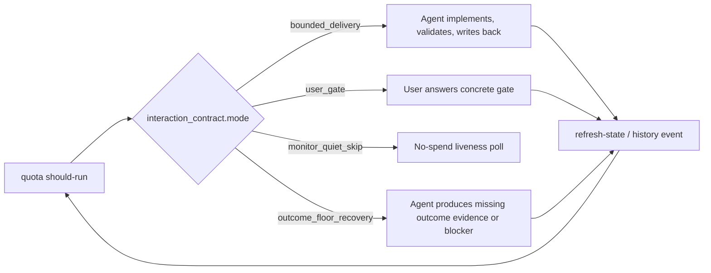

The blocked-priority fallback pattern deserves its own public demo because it
captures the product taste: do not idle on a gate, and do not hide the gate
while doing fallback work.

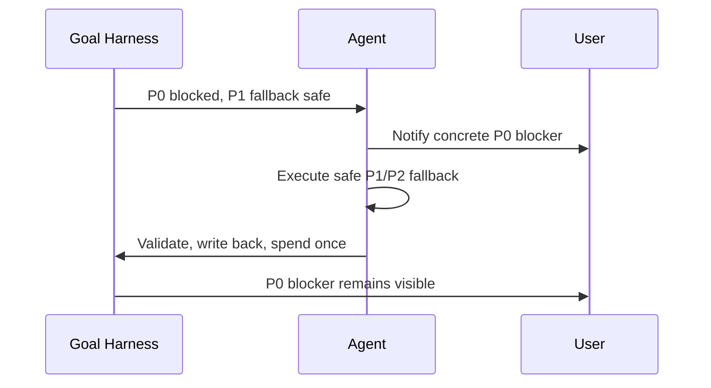

Future public surfaces can include:

- static SVG or Mermaid diagrams embedded in README/docs;
- a fake-data dashboard walkthrough for the first three patterns;
- a short animated video showing "P0 gate + safe fallback" with no private
  benchmark artifacts;
- a public demo script that can be narrated to potential collaborators.

## IP-001 Bounded Delivery

**Trigger**

- `quota should-run.should_run=true`;
- `interaction_contract.mode=bounded_delivery`;
- `interaction_contract.agent_channel.must_attempt=true`;
- no private, credential, production, destructive, or unprojected write-scope
  blocker applies.

**Expected behavior**

The agent chooses one bounded segment, performs the work, runs focused
validation, writes durable state or history, and spends exactly once after the
validated delivery.

**Visual Model**

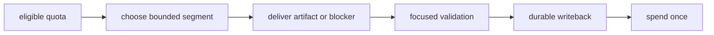

**Bad smell**

The agent sends a status update after reading only one file, or spends quota
without a validated artifact or blocker.

**Validation**

- `examples/work-lane-contract-smoke.py`
- `examples/heartbeat-quota-flow-smoke.py`
- `goal-harness check`

## IP-002 Blocked Priority With Safe Fallback

**Trigger**

- a higher-priority agent todo is blocked;
- a lower-priority todo is executable and safe;
- `blocked_priority_fallback.notify_user=true` or equivalent quota/status
  projection is present;
- user action may be useful, but the selected fallback does not require the
  user answer before proceeding.

**Expected behavior**

The user-facing message must preserve the blocked higher-priority item and the
reason the fallback is being used. The agent may continue the safe fallback, but
must not let the fallback become the main story silently.

Example shape:

```text
Core lane is blocked on <decision/resource>. I will continue <safe fallback>
now, and the pending user todo remains <concrete ask>.
```

**Visual Model**


**Bad smell**

The agent either freezes completely on a gate even though other safe work is
available, or silently works on lower-priority items while the user loses sight
of the P0 blocker.

**Validation**

- `examples/todo-first-open-summary-smoke.py`
- `docs/heartbeat-automation-prompt.md`

## IP-003 Scoped Gate With Safe Fallback

**Trigger**

- an open user todo is a real gate, not just advisory context;
- the gate can be scoped to one selected agent action, lane, resource, or
  boundary;
- another executable agent todo is independent of that gate;
- the fallback remains inside public/private, write-scope, resource, and quota
  boundaries.

**Expected behavior**

The user channel must still notify the concrete gate. The agent channel must
not execute the gated action, but should continue the independent fallback when
quota and safety allow it. This is a dual-channel state, not a contradiction:

```text
user_action_required=true
agent_action_required=true
agent_action=<independent fallback>
```

The controller should expose a durable field such as
`scoped_user_gate_fallback` with:

- the blocked user gate;
- the gated agent item(s);
- the selected fallback;
- a spend policy that permits spending only after validated fallback writeback.

The best long-term implementation is explicit scope metadata:
`user_todo.decision_scope` and `agent_todo.required_decision_scopes`. Runtime
text or `action_kind` inference is only a compatibility bridge for older goal
states.

**Visual Model**

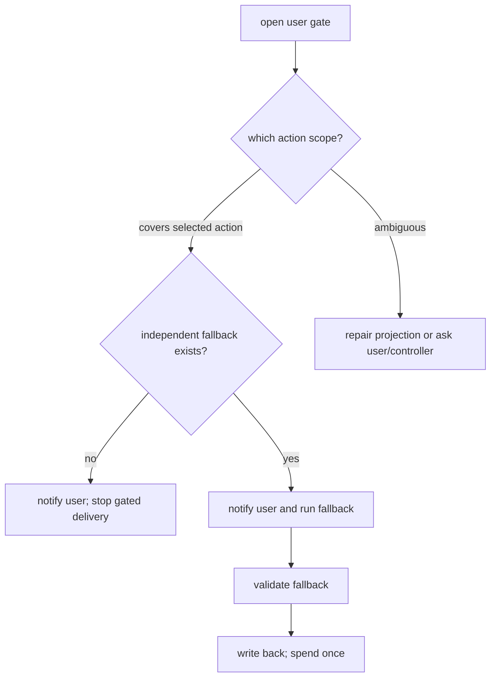

**Bad smell**

The payload says `must_attempt_work=true` and `do_not_cancel_on_block=true`,
but `interaction_contract.agent_channel.delivery_allowed=false` only because
`requires_user_action=true`. The agent then repeats the gate forever even
though another safe todo is available.

The opposite bad smell is also dangerous: the agent silently continues work
without naming the blocked user decision, so the fallback becomes the main
story and the human loses the critical gate.

**Validation**

- `regression/scoped-user-gate-fallback-contract.py`
- `examples/protocol-action-packet-smoke.py`
- `examples/work-lane-contract-smoke.py`

## IP-004 Concrete User Todo Projection

**Trigger**

- `interaction_contract.user_channel.action_required=true`; or
- `user_todo_summary.open_count > 0`.

**Expected behavior**

The heartbeat, status, dashboard, or review packet must name the concrete user
todo/question. It must not say only "owner gate" or "waiting on user". If the
payload says user action is required but no concrete todo/question is projected,
the correct message is a state projection bug:

```text
specific user todo is not projected; repair Goal Harness state projection
```

When `action_required=false` and `user_todo_summary.open_count=0`, the system
may say there is no user todo and should not imply a projection fault.

**Visual Model**

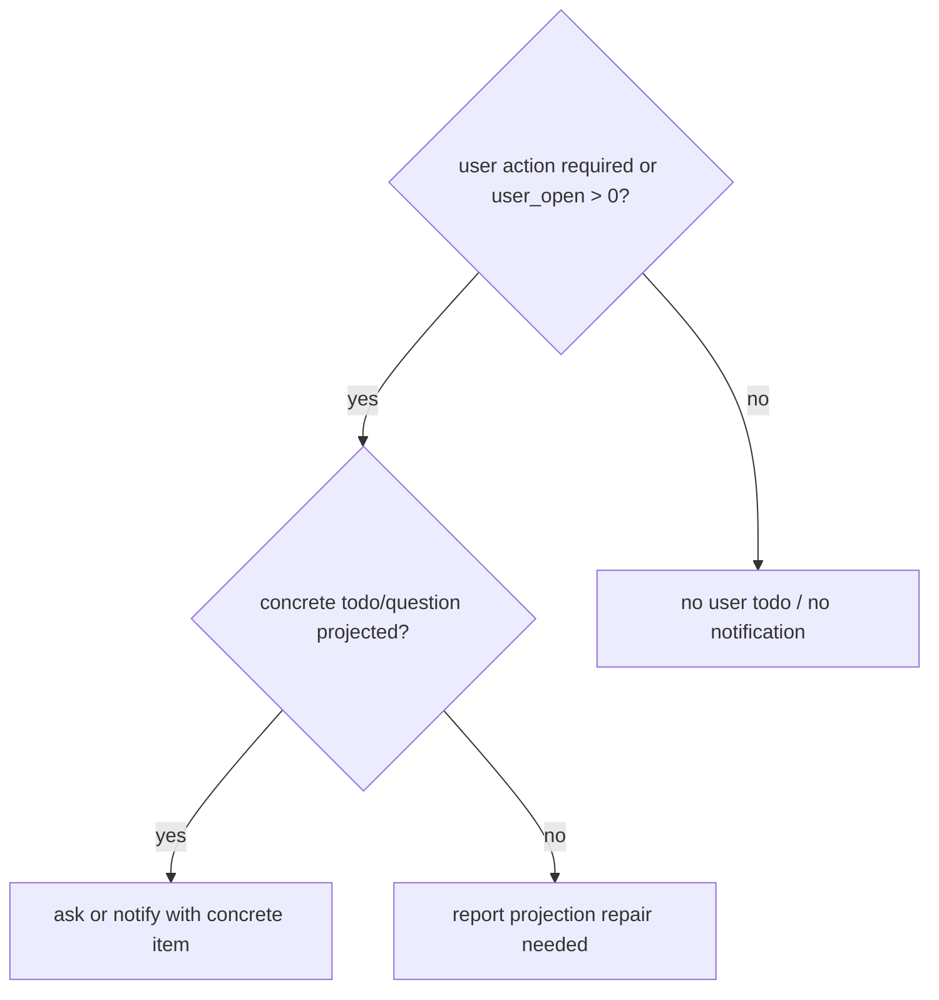

**Bad smell**

The user sees repeated vague gate messages and cannot tell what decision is
needed.

**Validation**

- `docs/heartbeat-automation-prompt.md`
- `examples/quota-plan-smoke.py`
- `examples/heartbeat-quota-flow-smoke.py`

## IP-005 State Projection Gap

**Trigger**

- quota says work is eligible or `must_attempt=true`;
- `agent_todo_summary.open_count=0` and `user_todo_summary.open_count=0`;
- `Next Action`, handoff prose, or recent run history still contains
  actionable work.

**Expected behavior**

The next step should become replan / todo expansion / blocker writeback rather
than normal delivery. Machine projection must be repaired before the controller
pretends there is no work.

**Visual Model**

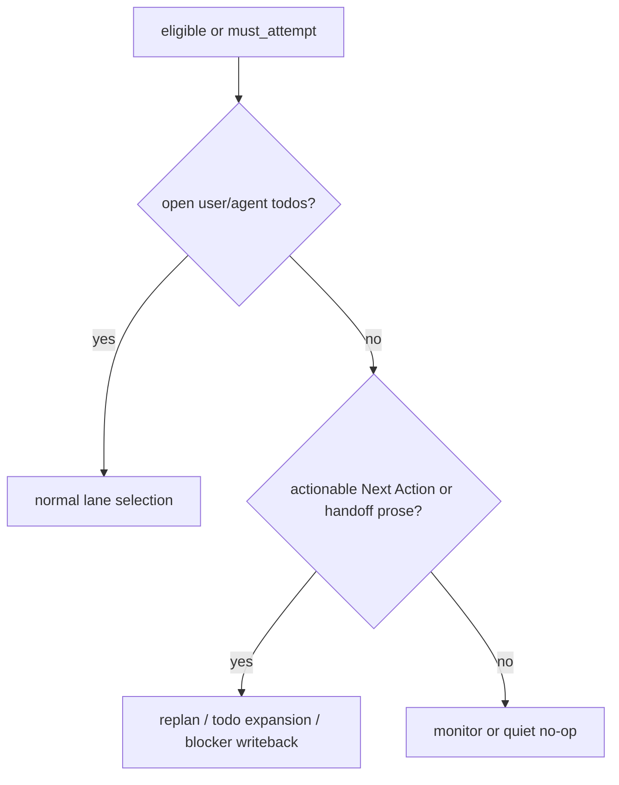

**Bad smell**

Humans can see a next action in prose, but the machine projection sees no open
todo and the automation drifts into monitor-only no-ops.

**Validation**

- `examples/state-projection-gap-smoke.py`
- `docs/project-agent-todo-contract.md`

## IP-006 Checkpointed Scope Mismatch

**Trigger**

- the selected todo or `recommended_action` requires writing a scope;
- `goal_boundary.write_scope` does not include that scope;
- a historical owner decision may exist, but it is not projected into the
  current boundary contract.

**Expected behavior**

Goal Harness should return boundary projection repair or a concrete
user/controller gate. The agent should not execute the write, and should not
spend turns on repo-only handoff if the real blocker is missing scope
projection.

Only structured checkpointed authority can extend the runtime boundary. A
historical approval written in prose is not enough. The registry may carry
`coordination.checkpointed_boundary_authority[]` entries with:

- `schema_version=checkpointed_boundary_authority_v0`;
- `write_scope`;
- `source` or equivalent public-safe provenance;
- `recorded_at`;
- optional `expires_at`;
- `decision=approve` and active status.

Fresh approved entries are compiled into `goal_boundary.write_scope` and
exposed under `goal_boundary.checkpointed_boundary_authority`. Expired,
rejected, missing-provenance, or missing-timestamp entries remain visible only
as diagnostics; they do not authorize writes.

**Visual Model**

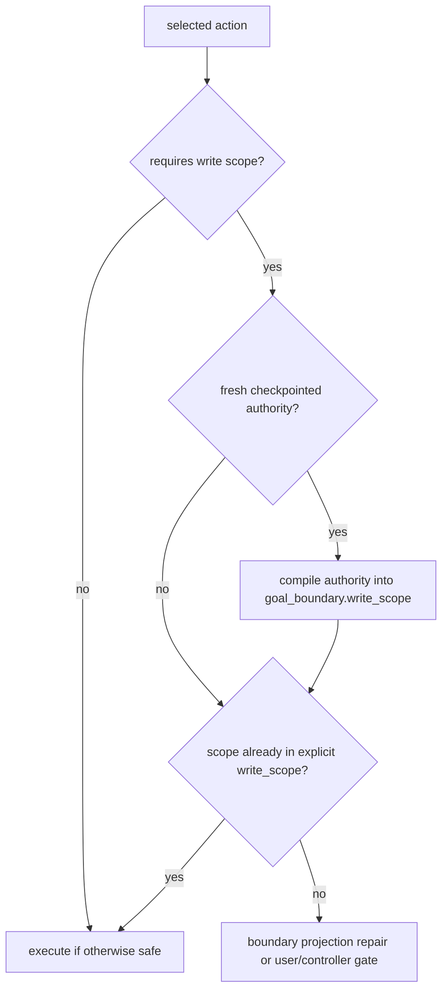

**Bad smell**

The control plane remembers that a user once approved a path, but the current
quota boundary blocks it, so agents loop on small handoffs instead of repairing
the checkpointed decision.

**Validation**

- `examples/quota-action-scope-guard-smoke.py`;
- `examples/configure-goal-smoke.py`;
- `docs/state-interaction-model.md` checkpointed decision sections.

## IP-007 Outcome Floor Recovery

**Trigger**

- repeated surface-only work has crossed the outcome floor;
- `safe_bypass_kind=outcome_floor_recovery` or
  `heartbeat_recommendation.recommended_mode=outcome_floor_recovery`;
- quota exposes a concrete `must_advance` target.

**Expected behavior**

The agent may do only the bounded recovery: produce the missing evidence named
by `must_advance`, or write the blocker explaining why that evidence cannot be
produced. Ordinary docs/status propagation should wait.

**Visual Model**

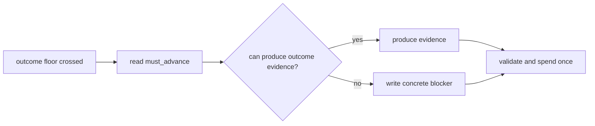

**Bad smell**

The system keeps improving wrappers, summaries, or queues while never producing
the evidence needed to decide whether the goal is working.

**Validation**

- `docs/archive/incidents/outcome-floor-safe-bypass-incident-20260606.md`
- `examples/quota-plan-smoke.py`
- `examples/upgrade-plan-smoke.py`

## IP-008 Monitor Quiet Skip

**Trigger**

- `should_run=false`;
- `effective_action=monitor_quiet_skip`;
- no user gate, user todo blocker, external handle observation, or self-repair
  obligation is active.

**Expected behavior**

The agent may append at most one no-spend monitor poll, rerun the guard, and
then stay quiet. The automation remains alive; monitor-only quiet skips are not
completion or deletion signals.

**Visual Model**

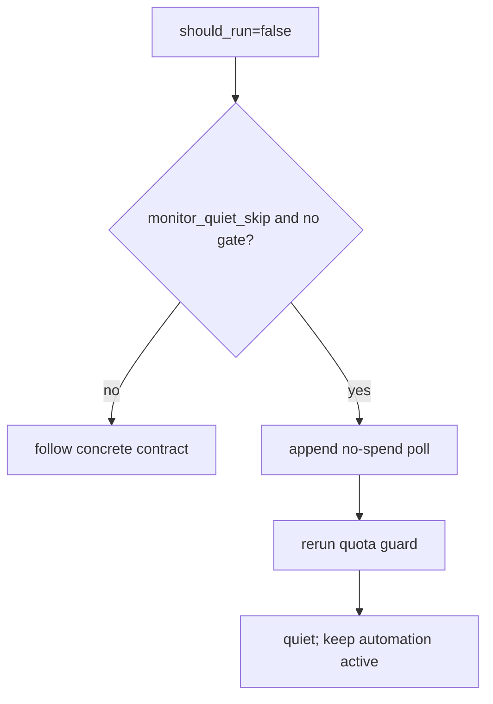

**Bad smell**

The heartbeat stops itself because nothing changed, or spends quota on a
no-op status repetition.

**Validation**

- `examples/heartbeat-quota-flow-smoke.py`
- `docs/heartbeat-automation-prompt.md`

## IP-009 Active User Assistance

**Trigger**

- the experiment or product lane explicitly enables active user assistance;
- an intervention budget/frequency policy exists;
- hidden tests, reward/pass/fail, expected solutions, and credentials remain
  hidden from the worker.

**Expected behavior**

The assistant or user simulator may provide bounded help through an audited
channel. Results must be labeled as assisted and must not be merged into
official autonomous score claims.

**Visual Model**

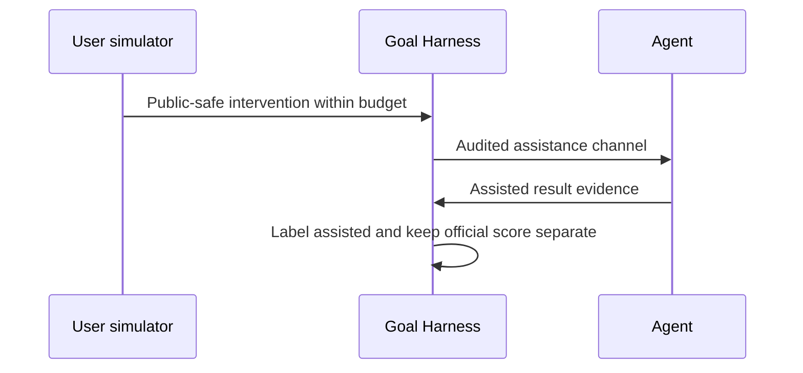

**Bad smell**

The system calls a run "Goal Harness uplift" when the treatment secretly saw
reward signals, oracle information, or unbounded human hints.

**Validation**

- `examples/worker-bridge-active-user-after-start-observation-smoke.py`
- `examples/worker-bridge-install-contract-smoke.py`
- benchmark active-user protocol docs.

## IP-010 Cadence Widening

**Trigger**

- recent eligible turns have a small-step streak;
- delivery repeatedly lands as `single_surface`, status-only, or shallow docs
  without a coherent artifact;
- no safety boundary prevents a larger segment.

**Expected behavior**

The controller widens the next eligible turn according to the configured
cadence preset. For the default `long` preset, a turn should usually include an
artifact, focused validation, and state writeback.

**Visual Model**

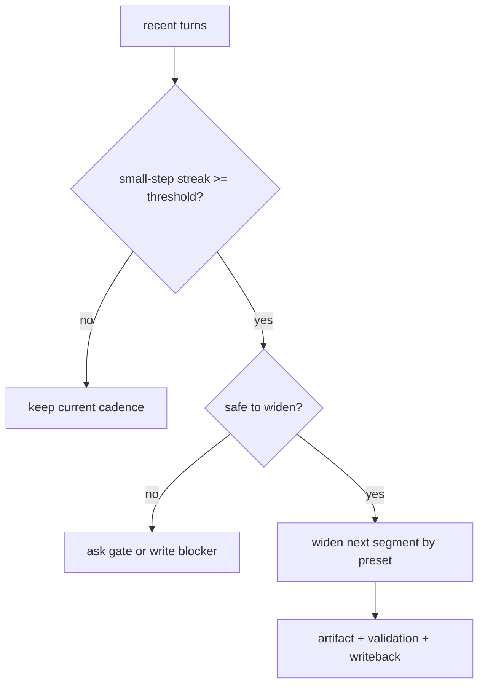

**Bad smell**

The agent's native long-task ability is degraded because the control plane keeps
asking it to do tiny heartbeat-shaped steps.

**Validation**

- `docs/long-task-cadence-policy.md`
- future status/quota preset projection smoke.

## IP-011 Authority Material Intake

**Trigger**

- a worker discovers or receives a durable design doc, research memo, owner
  packet, migration report, benchmark paper, external registry, or other source
  that future agents may need;
- the target project and `goal_id` are known;
- the material can be represented as public-safe metadata without storing raw
  URLs, document ids, local paths, source bodies, comments, credentials, or
  private logs.

**Expected behavior**

The agent should first identify the owning project, then register a compact
source contract in that project's authority surface. If the project has a
tracked `docs/meta/DOC_REGISTRY.yaml`, update that authority map first. If it
does not, use the project-local `.goal-harness/registry.json` through
`authority_registry.topic_authority` and `authority_registry.project_materials`.
This distinction is a storage/publication boundary, not two competing authority
systems: tracked `DOC_REGISTRY` files are project assets for review, while the
ignored `authority_registry` fallback is Goal Harness control-plane state.

The stored material should answer what it is, how fresh it is, which topic it
governs, whether owner review or read access is needed, and how conflicts are
resolved. It should not read or summarize the material body as part of the
registration step.

**Visual Model**

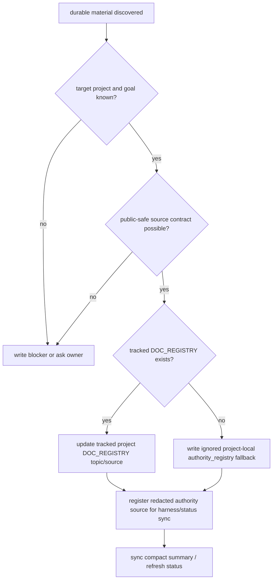

**Bad smell**

An agent remembers an important article or design only in chat, or registers it
into the meta controller because that is the current repo, even though the
material belongs to another connected project.

**Validation**

- `docs/authority-source-registration.md`
- `examples/register-authority-source-smoke.py`
- `examples/import-doc-registry-authority-smoke.py`
- `examples/platform-migration-material-registry-smoke.py`

## IP-012 External Evidence Observation

**Trigger**

- `waiting_on=external_evidence`, a launched external worker is being polled, or
  `interaction_contract.mode=external_evidence_observation`;
- the selected action is evidence observation, compact result ingest, or compact
  blocker writeback;
- benchmark/model/Docker/cloud execution is not explicitly authorized by the
  current guard.

**Expected behavior**

The agent must distinguish observing an external handle from launching new
external work. If a compact handle exists, it may poll or ingest compact
public-safe result files. If the required handle is missing, the correct action
is a compact blocker or projection repair, not a quiet no-op. Benchmark
execution, model calls, Docker, cloud jobs, uploads, and leaderboard paths stay
blocked unless the guard explicitly selects that work.

**Visual Model**

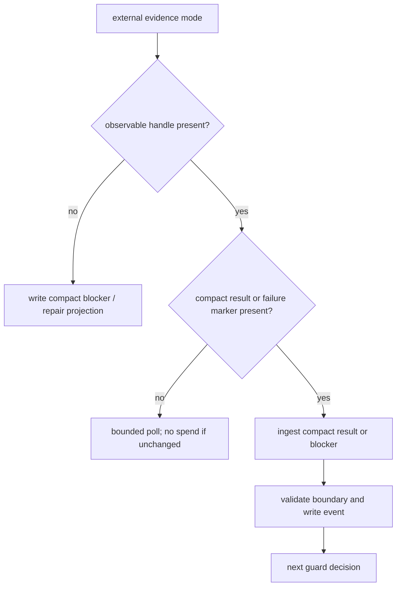

**Bad smell**

The heartbeat treats external-evidence waiting as a harmless quiet skip even
though the guard requires an observable handle, or it launches a benchmark run
from a meta/controller poll that was only authorized to observe.

**Validation**

- `regression/external-evidence-observation-real-codex.py`
- `examples/benchmark-lifecycle-state-smoke.py`
- `docs/state-interaction-model.md`

## IP-013 Autonomous Replan Vs Advisory Dreaming

**Trigger**

- no-progress streaks, repeated action loops, phase transitions, or periodic
  review thresholds make a blocking `autonomous_replan_obligation_v0` visible
  in active state, status, quota, or run history; or
- a background planning lane surfaces `dreaming_proposal_v0` /
  `server_managed_planning_contract_v0` as advisory context.

**Expected behavior**

An autonomous replan obligation is executable repair work: split, add, retire,
or re-rank todos so the next delivery segment can advance. A dreaming proposal
is advisory until promoted by an operator/controller decision and a normal
quota/boundary check. Dreaming proposals may be displayed alongside a blocking
replan obligation, but they stay a side lane: they can inform review or repair,
not enter promotion/execution until the blocking replan obligation is absent or
resolved. The two lanes must not collapse into each other.

**Visual Model**

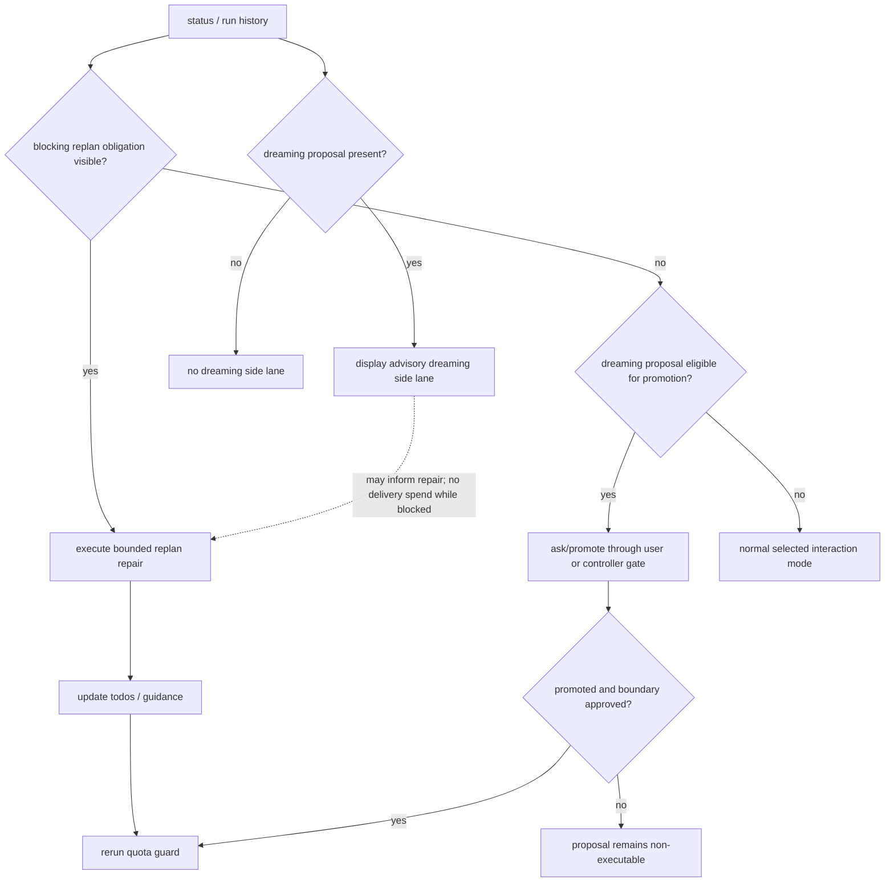

**Bad smell**

A proposal from the dreaming/planning lane carries an `agent_command` or spends
delivery quota before promotion. The opposite failure is also costly: repeated
no-progress evidence is treated as optional brainstorming instead of a required
state repair.

**Validation**

- `examples/autonomous-replan-obligation-smoke.py`
- `regression/autonomous-replan-vs-dreaming-contract.py`

## IP-014 Decision Write Preview And Append

**Trigger**

- the operator is recording a run-bound `human_reward`; or
- the operator/controller is recording an `operator_gate` decision;
- a dashboard or loopback server wants to write a decision event rather than
  only render status.

**Expected behavior**

Decision writes must be exact-target, compact, previewed when browser-originated,
and append-only. `human_reward` attaches to one selected run row. `operator_gate`
records a decision run and, for approvals, a resume contract that forces the
receiving agent to re-read current registry, active state, quota, repo status,
policy, and run state before executing.

Browser reward append requires an explicit local capability, loopback origin,
matching `preview_id`, unchanged selected run, unchanged payload, unchanged raw
index count, public-safe text, and exactly one overlay append. Dashboard gate
append remains disabled until a separate equivalent handshake exists.

**Visual Model**


**Bad smell**

The dashboard makes local reward/gate writes feel like ordinary form submission,
or an approved gate is treated as durable write authority without a fresh
decision-point re-read.

**Validation**

- `docs/reward-gate-direct-write-contract.md`
- `docs/dashboard-reward-write-boundary.md`
- `examples/reward-gate-direct-write-contract-smoke.py`
- `examples/reward-append-api-smoke.py`
- `examples/dashboard-reward-append-browser-smoke.mjs`
- `examples/operator-gate-resume-contract-smoke.py`

## IP-015 Benchmark Lifecycle Countability

**Trigger**

- a benchmark adapter, runner wrapper, or reducer observes preflight, launch,
  materialization, compact result, comparison, claim review, or learning-ledger
  evidence;
- a controller is deciding whether a process launch, case attempt, score,
  budget spend, rerun, or public claim is countable.

**Expected behavior**

Benchmark work should advance through compact lifecycle gates instead of raw
runner narratives. `process_started` alone is not case entry. Case entry starts
at `job_root_materialized` or later. Budget/counting and candidate selection
require compact result ingestion, claim boundary review, and learning-ledger
state where applicable. Terminal failure markers can close out a launched
attempt without making it a case attempt or benchmark-budget event.

**Visual Model**

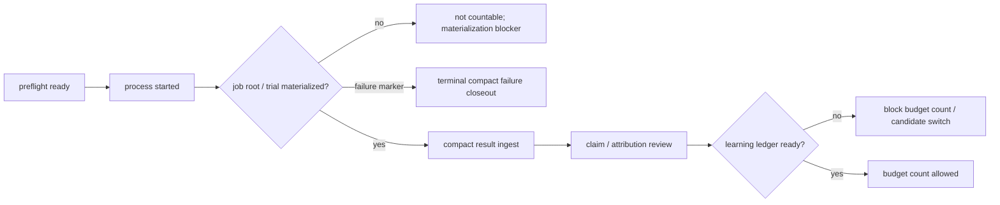

**Bad smell**

A runner PID, detached process, stale active job, or raw log tail is treated as
evidence of a benchmark case attempt or score claim before the compact lifecycle
state says it is countable.

**Validation**

- `docs/research/long-horizon-agent-benchmarks/benchmark-core-adapter-contract-v0.md`
- `docs/research/long-horizon-agent-benchmarks/terminal-bench-runner-mode-contract-v0.md`
- `examples/benchmark-lifecycle-state-smoke.py`
- `examples/benchmark-core-adapter-contract-smoke.py`
- `examples/terminal-bench-runner-mode-contract-smoke.py`

## IP-016 Task Lease Claim

**Trigger**

- multiple agents, heartbeats, child workers, or frontstage channel views may
  act on the same todo;
- the selected work has a bounded `task_id`, owner, TTL, write scope, and
  idempotency key;
- the system needs to prevent duplicate work, duplicate spend, or overlapping
  writes without moving truth into chat.

**Expected behavior**

A task claim should become `task_lease_v0`: an explicit, expiring claim over
one bounded work item. Status and future channel projections may render the
claim, but the lease remains a projection over the Goal Harness ledger and
does not override `goal_boundary`, user gates, quota, or write-scope checks.

When a lease is active and the selected action is inside its scope, the owner
may proceed. When a competing worker sees an active overlapping lease, it must
choose a non-overlapping fallback, wait, or surface a conflict. Expired leases
need cleanup or renewal before they authorize continued work.

**Visual Model**

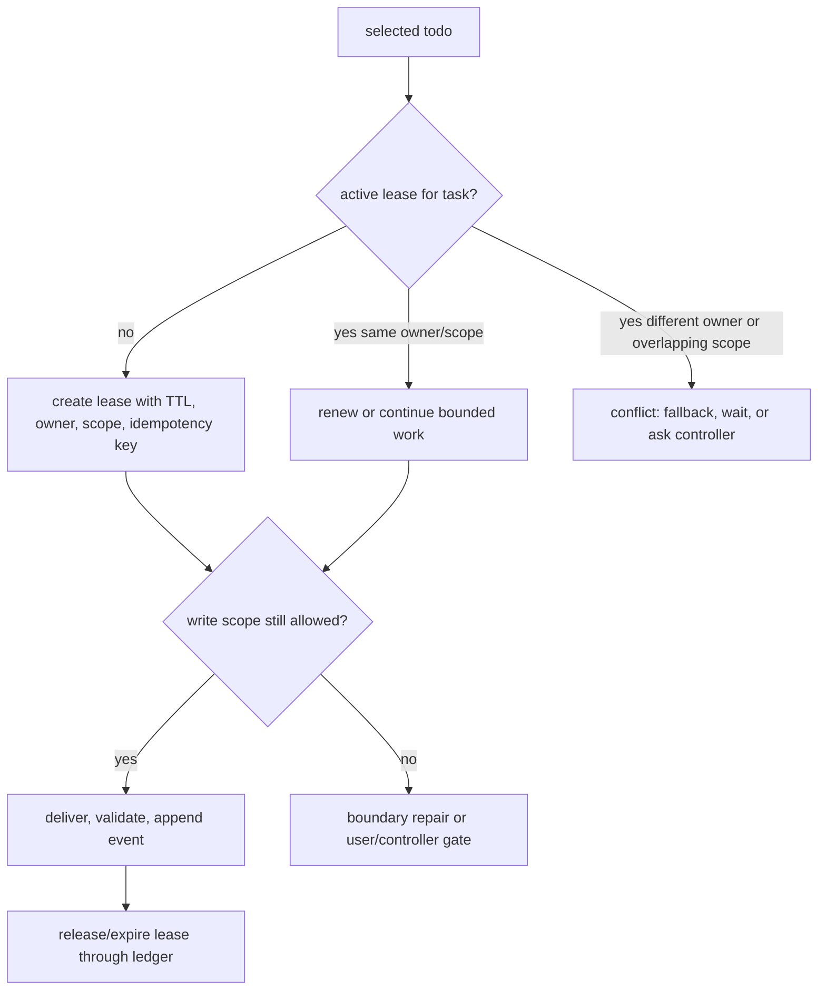

**Bad smell**

Two workers repeat the same task, double-spend quota, or write overlapping
files because the only ownership signal was a chat message or dashboard label.

**Validation**

- `docs/frontstage-channel-lease-roadmap.md`
- `docs/architecture.md` local server / daemon roadmap
- future `task_lease_v0` status and conflict smoke.

## IP-017 User Reward Lesson Promotion

**Trigger**

- the user explicitly corrects a product route, priority, benchmark protocol,
  safety boundary, or operating rule;
- the correction supersedes a current todo, `recommended_action`, route
  assumption, or benchmark adapter plan;
- future agents would be likely to repeat the old assumption if the correction
  remains only in chat.

**Expected behavior**

The agent must pause ordinary delivery selection and promote the correction
into durable state before continuing. The minimal durable promotion is one of:

- update active `Next Action` and the relevant open `Agent Todo`;
- append or prepare a run-bound `human_reward` / operating-lesson event;
- add a concrete successor todo for the product/runtime change;
- update this catalog or the self-repair pattern table if the situation is
  reusable.

The correction should record:

- corrected rule;
- scope, such as goal, project, benchmark family, route, or adapter;
- superseded assumption;
- owner of the next implementation step;
- validation that future `quota should-run` or posthoc parity checks can see
  the rule.

This is not the same as hidden model memory. The model may remember the
conversation, but Goal Harness must expose a replayable hook for future agents.

**Visual Model**

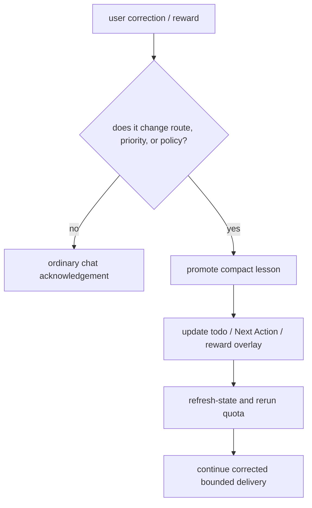

**Bad smell**

The user says "the three benchmarks should run on the remote development
machine, but Codex stays local and the remote host is only the execution
environment"; a later agent turn treats missing remote Codex/Codex-ACP as the
main blocker or keeps following a stale local-only benchmark staging todo.

**Validation**

- `skills/goal-harness-self-repair/references/repair-patterns.md`
- `docs/state-interaction-model.md`
- future `user_reward_lesson_projection_gap` status/quota smoke that checks
  explicit operating lessons are projected into `recommended_action`,
  active `Agent Todo`, or a state-projection repair warning.

## Maintenance Rules

Add or update a pattern when any of these happens:

1. a good case demonstrates a reusable product behavior;
2. a bad case or incident reveals a missing state projection;
3. a smoke encodes a behavior that is not yet explained to humans;
4. a dashboard/status field changes who owns the next action.

Every new pattern should link to at least one validation path. If validation
does not exist yet, mark it as a future smoke rather than hiding the gap.

When a pattern is useful for partner/user explanation, add a visual artifact or
explicitly mark the visual as future work. Good visuals should show ownership
and the allowed next action, not just boxes for implementation modules.

Do not let this catalog become a second source of truth. The source of truth is
still the runtime state, quota/status payloads, and event ledger. This catalog
is the human-maintained map of the situations those payloads must express.
