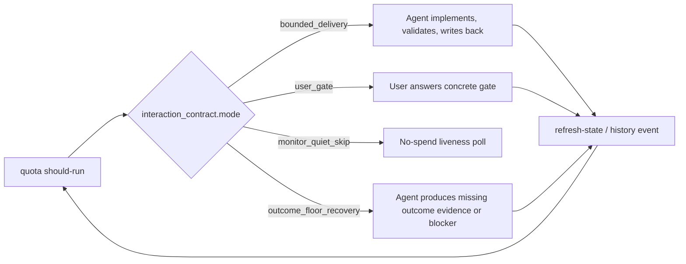
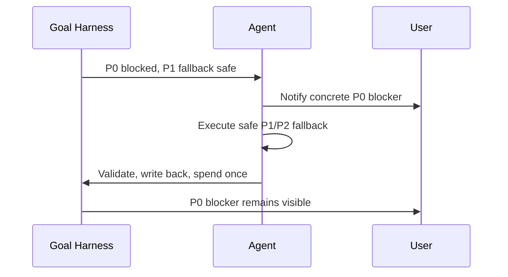

# Interaction Pattern Catalog

Goal Harness has accumulated many user / agent / state interaction lessons.
The state interaction model explains the architecture; this catalog records the
repeatable situations we want every controller, heartbeat, dashboard, and
benchmark runner to handle the same way.

Use this document when a good case, bad case, incident, or product insight
reveals a reusable interaction shape. Each pattern should be specific enough to
drive implementation, tests, and dashboard copy without requiring future agents
to mine chat history.

## Pattern Template

Each pattern should answer:

- **Trigger**: which status, quota, todo, run-history, or boundary signals make
  the pattern active;
- **User channel**: whether the user must be interrupted, only notified, or not
  contacted;
- **Agent channel**: what Codex must do, may do, or must not do;
- **State contract**: durable fields that prove the pattern is represented;
- **Bad smell**: how the system usually fails when the pattern is missing;
- **Validation**: smoke, fixture, or doc check that protects the behavior.

Keep examples public-safe. Do not copy raw benchmark tasks, raw trajectories,
private logs, verifier output tails, credentials, internal URLs, or local
machine paths.

## Catalog

| ID | Name | Primary Owner | User Channel | Agent Channel |
| --- | --- | --- | --- | --- |
| IP-001 | Bounded Delivery | Agent | no interruption | implement, validate, write back, spend once |
| IP-002 | Blocked Priority With Safe Fallback | Agent plus user-visible notification | notify without requiring an answer | continue safe fallback after exposing blocked higher-priority work |
| IP-003 | Concrete User Todo Projection | User | ask or notify with concrete todo/question | do not hide behind generic "owner gate" text |
| IP-004 | State Projection Gap | Agent | no user ask unless a user todo is missing | repair todo/state projection before ordinary delivery |
| IP-005 | Checkpointed Scope Mismatch | CLI/controller | ask or repair boundary projection | do not execute action whose write scope is not projected |
| IP-006 | Outcome Floor Recovery | Agent | usually no interruption | produce missing outcome-scale evidence or blocker only |
| IP-007 | Monitor Quiet Skip | CLI/controller | no notification | append at most one no-spend poll, then stay quiet |
| IP-008 | Active User Assistance | User simulator / operator | bounded intervention | inject audited user help without leaking reward/oracle signals |
| IP-009 | Cadence Widening | Agent/controller | no interruption by default | widen next work segment when turns become too small |

## Visual Model

The catalog should support partner and user-facing explanation, not only
implementation. Keep diagrams public-safe and generic. Prefer diagrams that
show actor boundaries, decision ownership, and fallback behavior without raw
project or benchmark evidence.

The smallest reusable diagram is the user / agent / Goal Harness routing loop:



The blocked-priority fallback pattern deserves its own public demo because it
captures the product taste: do not idle on a gate, and do not hide the gate
while doing fallback work.



Future public surfaces can include:

- static SVG or Mermaid diagrams embedded in README/docs;
- a fake-data dashboard walkthrough for the first three patterns;
- a short animated video showing "P0 gate + safe fallback" with no private
  benchmark artifacts;
- a public demo script that can be narrated to potential collaborators.

## IP-001 Bounded Delivery

**Trigger**

- `quota should-run.should_run=true`;
- `interaction_contract.mode=bounded_delivery`;
- `interaction_contract.agent_channel.must_attempt=true`;
- no private, credential, production, destructive, or unprojected write-scope
  blocker applies.

**Expected behavior**

The agent chooses one bounded segment, performs the work, runs focused
validation, writes durable state or history, and spends exactly once after the
validated delivery.

**Bad smell**

The agent sends a status update after reading only one file, or spends quota
without a validated artifact or blocker.

**Validation**

- `examples/work-lane-contract-smoke.py`
- `examples/heartbeat-quota-flow-smoke.py`
- `goal-harness check`

## IP-002 Blocked Priority With Safe Fallback

**Trigger**

- a higher-priority agent todo is blocked;
- a lower-priority todo is executable and safe;
- `blocked_priority_fallback.notify_user=true` or equivalent quota/status
  projection is present;
- user action may be useful, but the selected fallback does not require the
  user answer before proceeding.

**Expected behavior**

The user-facing message must preserve the blocked higher-priority item and the
reason the fallback is being used. The agent may continue the safe fallback, but
must not let the fallback become the main story silently.

Example shape:

```text
Core lane is blocked on <decision/resource>. I will continue <safe fallback>
now, and the pending user todo remains <concrete ask>.
```

**Bad smell**

The agent either freezes completely on a gate even though other safe work is
available, or silently works on lower-priority items while the user loses sight
of the P0 blocker.

**Validation**

- `examples/todo-first-open-summary-smoke.py`
- `docs/heartbeat-automation-prompt.md`

## IP-003 Concrete User Todo Projection

**Trigger**

- `interaction_contract.user_channel.action_required=true`; or
- `user_todo_summary.open_count > 0`.

**Expected behavior**

The heartbeat, status, dashboard, or review packet must name the concrete user
todo/question. It must not say only "owner gate" or "waiting on user". If the
payload says user action is required but no concrete todo/question is projected,
the correct message is a state projection bug:

```text
specific user todo is not projected; repair Goal Harness state projection
```

When `action_required=false` and `user_todo_summary.open_count=0`, the system
may say there is no user todo and should not imply a projection fault.

**Bad smell**

The user sees repeated vague gate messages and cannot tell what decision is
needed.

**Validation**

- `docs/heartbeat-automation-prompt.md`
- `examples/quota-plan-smoke.py`
- `examples/heartbeat-quota-flow-smoke.py`

## IP-004 State Projection Gap

**Trigger**

- quota says work is eligible or `must_attempt=true`;
- `agent_todo_summary.open_count=0` and `user_todo_summary.open_count=0`;
- `Next Action`, handoff prose, or recent run history still contains
  actionable work.

**Expected behavior**

The next step should become replan / todo expansion / blocker writeback rather
than normal delivery. Machine projection must be repaired before the controller
pretends there is no work.

**Bad smell**

Humans can see a next action in prose, but the machine projection sees no open
todo and the automation drifts into monitor-only no-ops.

**Validation**

- `examples/state-projection-gap-smoke.py`
- `docs/project-agent-todo-contract.md`

## IP-005 Checkpointed Scope Mismatch

**Trigger**

- the selected todo or `recommended_action` requires writing a scope;
- `goal_boundary.write_scope` does not include that scope;
- a historical owner decision may exist, but it is not projected into the
  current boundary contract.

**Expected behavior**

Goal Harness should return boundary projection repair or a concrete
user/controller gate. The agent should not execute the write, and should not
spend turns on repo-only handoff if the real blocker is missing scope
projection.

**Bad smell**

The control plane remembers that a user once approved a path, but the current
quota boundary blocks it, so agents loop on small handoffs instead of repairing
the checkpointed decision.

**Validation**

- future focused quota/status smoke for action-scope guard;
- `docs/state-interaction-model.md` checkpointed decision sections.

## IP-006 Outcome Floor Recovery

**Trigger**

- repeated surface-only work has crossed the outcome floor;
- `safe_bypass_kind=outcome_floor_recovery` or
  `heartbeat_recommendation.recommended_mode=outcome_floor_recovery`;
- quota exposes a concrete `must_advance` target.

**Expected behavior**

The agent may do only the bounded recovery: produce the missing evidence named
by `must_advance`, or write the blocker explaining why that evidence cannot be
produced. Ordinary docs/status propagation should wait.

**Bad smell**

The system keeps improving wrappers, summaries, or queues while never producing
the evidence needed to decide whether the goal is working.

**Validation**

- `docs/outcome-floor-safe-bypass-incident-20260606.md`
- `examples/quota-plan-smoke.py`
- `examples/upgrade-plan-smoke.py`

## IP-007 Monitor Quiet Skip

**Trigger**

- `should_run=false`;
- `effective_action=monitor_quiet_skip`;
- no user gate, user todo blocker, external handle observation, or self-repair
  obligation is active.

**Expected behavior**

The agent may append at most one no-spend monitor poll, rerun the guard, and
then stay quiet. The automation remains alive; monitor-only quiet skips are not
completion or deletion signals.

**Bad smell**

The heartbeat stops itself because nothing changed, or spends quota on a
no-op status repetition.

**Validation**

- `examples/heartbeat-quota-flow-smoke.py`
- `docs/heartbeat-automation-prompt.md`

## IP-008 Active User Assistance

**Trigger**

- the experiment or product lane explicitly enables active user assistance;
- an intervention budget/frequency policy exists;
- hidden tests, reward/pass/fail, expected solutions, and credentials remain
  hidden from the worker.

**Expected behavior**

The assistant or user simulator may provide bounded help through an audited
channel. Results must be labeled as assisted and must not be merged into
official autonomous score claims.

**Bad smell**

The system calls a run "Goal Harness uplift" when the treatment secretly saw
reward signals, oracle information, or unbounded human hints.

**Validation**

- `examples/worker-bridge-active-user-after-start-observation-smoke.py`
- `examples/worker-bridge-install-contract-smoke.py`
- benchmark active-user protocol docs.

## IP-009 Cadence Widening

**Trigger**

- recent eligible turns have a small-step streak;
- delivery repeatedly lands as `single_surface`, status-only, or shallow docs
  without a coherent artifact;
- no safety boundary prevents a larger segment.

**Expected behavior**

The controller widens the next eligible turn according to the configured
cadence preset. For the default `long` preset, a turn should usually include an
artifact, focused validation, and state writeback.

**Bad smell**

The agent's native long-task ability is degraded because the control plane keeps
asking it to do tiny heartbeat-shaped steps.

**Validation**

- `docs/long-task-cadence-policy.md`
- future status/quota preset projection smoke.

## Maintenance Rules

Add or update a pattern when any of these happens:

1. a good case demonstrates a reusable product behavior;
2. a bad case or incident reveals a missing state projection;
3. a smoke encodes a behavior that is not yet explained to humans;
4. a dashboard/status field changes who owns the next action.

Every new pattern should link to at least one validation path. If validation
does not exist yet, mark it as a future smoke rather than hiding the gap.

When a pattern is useful for partner/user explanation, add a visual artifact or
explicitly mark the visual as future work. Good visuals should show ownership
and the allowed next action, not just boxes for implementation modules.

Do not let this catalog become a second source of truth. The source of truth is
still the runtime state, quota/status payloads, and event ledger. This catalog
is the human-maintained map of the situations those payloads must express.
