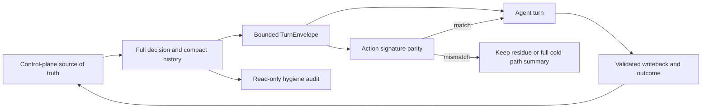

# LoopX Agent-facing 交互与轨迹质量工程

# 1. 当前判断

长程 Agent 的质量不仅取决于最终提交，也取决于每一轮实际看到了什么。

LoopX 需要同时保留两种不同形态的信息：

- 控制面保留完整状态、诊断、审计与兼容信息；
- Agent 每轮只接收当前动作、必要约束和完成本轮所需的最小上下文。

两者混在同一条热路径里，quota、scheduler、monitor、status 和兼容字段会反复进入 Agent 上下文。任务越长，控制事件越容易盖过任务动作。直接删字段同样危险，user gate、required read、write scope、workspace guard 或 spend rule 一旦丢失，短 payload 反而会产生错误执行。

当前采用的工程方向是：**完整事实留在 source of truth，Agent-facing 入口使用可校验的 bounded projection，轨迹质量由独立只读审计持续观察。**

## 2. 问题定义

这里的轨迹指长程任务中连续出现的任务动作、工具观察、人类决策、控制事件与结果写回。高质量轨迹应让读者回答四个问题：

1. 这一轮为什么运行或停止？
2. Agent 实际要完成哪个 todo？
3. 哪些 gate、scope、approval 和 validation 约束仍然有效？
4. 这一轮产生了什么结果，下一轮从哪里继续？

当前主要噪声来自三类重复。

### 宽诊断重复进入热路径

完整 `quota should-run` 需要服务排障、兼容和控制面审计，因此会携带多个 todo lane、frontier、readiness、warning 和历史字段。Agent 在正常执行轮次中通常只需要其中一小部分。

### 同一语义被多个 packet 重复表达

`interaction_contract`、`work_lane_contract`、`protocol_action_packet` 和 scheduler hints 可能从不同角度描述同一个动作。如果直接原样拼接，字段都正确，整体仍然冗余。

### 控制事件多于任务事件

quota spend、scheduler acknowledgement、unchanged monitor poll 和 state refresh 对审计有价值，但它们不等于新的任务进展。控制事件密度持续上升时，Agent-facing 上下文和 run history 都会变得难以阅读，action 与 outcome 的对应关系也更难追踪。

## 3. 三层质量架构



### Source of truth 层

Registry、active state、todo、gate、quota decision、run history 和可选 task lease 继续保留完整事实。该层服务排障、复现、兼容和审计，不因 Agent-facing 压缩而改写。

### Agent-facing 执行层

`loopx_turn_envelope_v0` 从已经计算完成的 quota decision 中投影：

- selected todo、claim 与 effective action；
- concrete user action 与 gate reason；
- required reads；
- write scope、approval、workspace/capability guard 与 stop rule；
- validation、writeback 与 quota spend policy；
- scheduler action 和必要的 cadence acknowledgement。

TurnEnvelope 是 additive read model，目前仍为 opt-in，不改变 quota selection、todo routing 或默认完整输出。协议见 [TurnEnvelope v0](../reference/protocols/turn-envelope-v0.md)。

### 质量审计层

`trajectory_hygiene_summary_v0` 只读取 public-safe compact run index，观察 controller density、non-material event density、重复 action 和 action/outcome attribution。它不打开 raw session、raw trajectory、task body、run artifact 或 verifier output。协议见 [Trajectory Hygiene v0](../reference/protocols/trajectory-hygiene-v0.md)。

## 4. 质量指标

### 语义完整性

压缩后的 Agent-facing 入口必须保留会改变行为的字段。当前通过 canonical `action_signature` 分别对 full decision 和 TurnEnvelope 计算 hash：

- `matches=true` 才能说明当前覆盖维度一致；
- 无法重建的字段保留 residue；
- 旧 packet 或 opaque packet 无法验证时，保留完整 summary；
- 任何 byte reduction 都不能替代 user gate、boundary 和 validation parity。

### 上下文效率

主要观察：

- full decision 与 envelope 的 JSON bytes；
- byte reduction ratio；
- 8 KiB TurnEnvelope budget；
- 大型 todo summary、warning collection 和诊断 lane 是否留在 cold path；
- 同一语义是否在多个 packet 中重复出现。

### 事件信噪比

主要观察：

- controller event ratio；
- compact controller character ratio；
- non-material event ratio；
- duplicate action ratio。

这些指标用于发现趋势，不直接代表任务成功率。Controller event 较多可能来自必要的安全控制；优化目标是让它们留在可审计层，并减少作为普通任务上下文的重复回放。

### Action/Outcome 可归因性

每个可执行轮次应尽量保留：

- 明确 action；
- 对应 delivery outcome；
- validation 或 blocker；
- todo/run/evidence 的稳定引用；
- successor、replan 或 no-follow-up 结论。

缺少 outcome 的 action、缺少 action 的结果、重复 action label，都应进入质量审计。

### 边界质量

Agent-facing 优化不能扩大读取或发布范围：

- 不读取 raw session、raw trajectory、task body 或 verifier output；
- 不把 credentials、private paths 和内部 source body 写入公共状态；
- 不用 summary 代替原始审计事实；
- 不让 compact projection 获得新的 write authority。

## 5. 当前落地

### 单一动作入口与热路径压缩

[PR #1651](https://github.com/huangruiteng/loopx/pull/1651) 将 `interaction_contract.agent_channel.primary_action` 收口为 quota turn 的单一可执行入口，并保留 compact resolution trace。

随后几次改动逐步把 display-heavy 信息移出 Agent 热路径：

- [PR #1694](https://github.com/huangruiteng/loopx/pull/1694) 压缩 quota todo summary，同时保留 counts 和 representative lane items；
- [PR #1712](https://github.com/huangruiteng/loopx/pull/1712) 压缩 quota execute response，完整 dry-run 诊断保持不变；
- [PR #1716](https://github.com/huangruiteng/loopx/pull/1716) 只压缩 agent-lane status 的 item detail，cold path 和 project asset 保持完整。

### 轨迹质量只读审计

[PR #1893](https://github.com/huangruiteng/loopx/pull/1893) 增加 `loopx history trajectory-hygiene`，在不读取原始会话和运行产物的前提下，给出 controller density、non-material density、重复 action 与 attribution coverage。

### Bounded TurnEnvelope

[PR #1894](https://github.com/huangruiteng/loopx/pull/1894) 增加 opt-in TurnEnvelope 和 8 KiB budget。它只投影已经完成的 quota decision，不改变默认执行路径。

[PR #1897](https://github.com/huangruiteng/loopx/pull/1897) 增加 Contract Capsule 与 action-signature parity，补回 execution obligation、work lane、automation liveness、vision/handoff 等容易在压缩中丢失的契约。

[PR #1898](https://github.com/huangruiteng/loopx/pull/1898) 让 TurnEnvelope 从结构化 contract 重建 `protocol_action_packet`。只有字段级 parity 成立时才省略重复 summary；不一致时保留 residue 或完整 summary。

### Claim 与 lease 的行为正确性

Agent-facing 质量也包含控制面给出的 ownership 是否可信。近期改动校正了几类“看起来可执行，实际约束不成立”的状态：

- [PR #1932](https://github.com/huangruiteng/loopx/pull/1932) 明确 soft claim 与 opt-in hard lease 的能力边界；
- [PR #1935](https://github.com/huangruiteng/loopx/pull/1935) 移除未生效的 soft-claim TTL 表象；
- [PR #1936](https://github.com/huangruiteng/loopx/pull/1936) 让非 open todo 的 hard lease 失效；
- [PR #1938](https://github.com/huangruiteng/loopx/pull/1938) 修复 glob scope 与具体子路径的冲突漏判；
- [PR #1939](https://github.com/huangruiteng/loopx/pull/1939) 拒绝 idempotency key 在变更 scope/TTL 后返回假成功；
- [PR #1940](https://github.com/huangruiteng/loopx/pull/1940) 让 soft claim 严格遵守 `Open -> Claimed` 状态迁移。

这些改动不追求更大的状态机，而是让 Agent-facing contract 与真实可执行状态一致。

## 6. 当前时点观测

以下数据来自 2026-07-12 对 `loopx-meta` 的一次 public-safe 本地观测，只说明当前状态，不作为跨项目 benchmark 或通用 SLO。

### TurnEnvelope

```text
full quota decision: 57,800 B
TurnEnvelope:         6,777 B
byte reduction:      88.28%
budget:              8,192 B
action signature:    match
```

这个结果说明当前 envelope 已显著减少重复信息，同时保留了已覆盖的 action dimensions。它不证明所有状态都已具备完整 parity，因此默认 quota output 仍保持不变。

### Compact history hygiene

最近 100 条 compact history row 中：

- controller event 50 条；
- outcome event 43 条；
- task event 7 条；
- controller character ratio 为 36.45%；
- non-material event ratio 为 55%；
- duplicate action ratio 为 10%；
- 当前样本的 action、outcome 和 decision-anchor coverage 均为 100%。

当前最明确的信号是：控制事件占比仍高，action/outcome 归因暂时完整。后续优化应优先减少控制语义在 Agent-facing 热路径中的重复，而不是删除审计事件。

## 7. 监控与优化闭环

### 观察

```bash
loopx history trajectory-hygiene \
  --goal-id <goal-id> \
  --limit 100

loopx quota should-run \
  --goal-id <goal-id> \
  --agent-id <agent-id> \
  --turn-envelope
```

第一条命令观察 compact history 的事件结构；第二条命令检查当前 Agent-facing envelope、byte budget 和 action signature。

### 分类

发现 payload 或轨迹膨胀后，先区分来源：

- 必须保留的 safety contract；
- 重复表达的 action contract；
- 仅排障需要的 cold-path diagnostics；
- 没有 material transition 的 controller event；
- 缺少 action/outcome attribution 的任务事件。

### 约束 parity

先定义不可丢失的行为维度，再做 compact projection。对同一语义的多份 summary，先建立结构化字段和重建规则，parity 成立后再删除重复文本。

### 小步优化

优先采用可回退的小改动：

1. 只压缩一个明确的 display-heavy lane；
2. 保留 full decision 或 cold-path reference；
3. 加 focused parity fixture；
4. 跑 quota/status/heartbeat 与 public-boundary canary；
5. 观察真实 goal 的 bytes 与 action signature；
6. 证据稳定后再扩大默认使用范围。

### 防回退

当前硬约束包括：

- TurnEnvelope 不得超过 8 KiB；
- source/envelope action signature 必须一致；
- mismatch 必须保留 residue 或完整 summary；
- compact view 不改变默认 quota decision；
- raw/private material 不进入 Agent-facing projection；
- claim、lease、gate 和 writeback 的非法状态必须 fail closed。

Controller density、non-material ratio 和 duplicate action ratio 暂时作为趋势指标，不设置脱离场景的统一硬阈值。

## 8. 当前缺口与路线图

### 短期

- 维护 delivery、monitor quiet-skip、user gate、capability gate、workspace
  guard、autonomous/successor replan、blocked 与 throttled 的 TurnEnvelope
  parity matrix；当前 9 类 synthetic fixture 的 envelope 为 4,866-5,602 B，
  action signature 全部一致；
- 给 trajectory hygiene 增加相邻窗口 delta，区分单次高值和持续恶化；
- 继续消除同一 action 在 packet、summary 和提示文本中的重复表达；
- 为 action、outcome、todo、run 与 evidence 补强稳定 lineage。

### 中期

- 保持 TurnEnvelope 默认关闭；完成至少一个真实 host integration 的 shadow
  parity、cold-path consumer regression 和兼容性确认后，再评估是否切换默认
  Agent-facing read；
- 将宽 diagnostics 统一迁移到可寻址 cold path，避免每个 connector 自行裁剪；
- 把 quality audit 接入 release canary，阻止 envelope 超预算、signature mismatch 和 attribution coverage 回退。

### 长期

- 形成跨 host 的统一 Agent-facing contract，使 Codex CLI、Claude Code、MCP 和 loopback server 消费相同动作语义；
- 将 controller event、task event、human decision 和 outcome event 建成可关联但不混淆的事件通道；
- 让轨迹质量成为长程任务控制面的常规工程指标，与 correctness、latency、cost 和 operator attention 一起观察。

## 9. 边界

这条能力线不做以下事情：

- 不修改 Agent executor 或任务求解逻辑；
- 不静默重写、删除或拼接原始审计记录；
- 不用短 summary 替代 user gate、write scope、approval 和 validation；
- 不把一次项目观测外推成通用效果结论；
- 不让 dashboard、host hook 或 compact projection 成为新的 source of truth。

LoopX 的目标是让长程任务每一轮都更容易执行、更容易解释，也更容易从上一轮可靠地继续。
