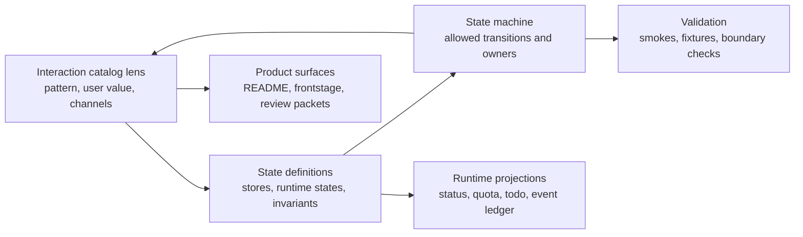

# Core Control-Plane Graphs

This folder keeps the three product diagrams that should move together when
LoopX learns a new long-running agent behavior:

- [Interaction catalog lens](interaction-catalog.md): what reusable
  human/agent pattern is happening?
- [State definitions](state-definitions.md): which durable state body or
  derived runtime state names the situation?
- [State machine](state-machine.md): which transition is legal next, and who
  owns it?
- [Bounded context layout](bounded-context-layout.md): where control-plane
  kernel code belongs as it moves out of flat status/projection modules.
- [Rule seam map](rule-seam-map.md): which runtime rule families should be
  characterized and extracted before moving code?
- [Smoke failure classification ledger](smoke-failure-classification-ledger.md):
  which red public smokes are product bugs, stale fixtures, release packaging
  gaps, or runner ergonomics issues?

The older detailed documents remain the canonical reference for full protocol
detail:

- [`docs/interaction-pattern-catalog.md`](../../interaction-pattern-catalog.md)
  is the complete interaction-pattern registry.
- [`docs/state-interaction-model.md`](../../state-interaction-model.md) is the
  architecture-level state model.

This folder is the shorter control-plane map. It exists so product surfaces,
runtime code, smokes, and agent instructions share one picture instead of
rediscovering state from chat history or private planning notes. The rule seam
map is intentionally behavior-preserving: it names extraction seams and parity
checks before the refactor branch moves control-plane code.

## Execution Ownership

These graphs describe Kernel state and legal transitions. The surrounding turn
uses four runtime responsibilities:

| Role | Responsibility |
| --- | --- |
| Agent | Plans and performs one bounded action through a host/runtime. |
| Provider | Returns external observations, effect results, and readback. |
| Capability | Normalizes provider output, validates it, and proposes a typed transition. |
| Kernel | Owns durable todo, gate, monitor, accepted writeback, quota, recovery, and scheduling. |

Domain state, evidence, receipts, and projections are exchanged or derived
artifacts, not additional owners. An extension may deliver a provider, but its
installation lifecycle does not grant Kernel authority. See the full
[runtime responsibility model](../../architecture.md#runtime-responsibility-model).

## Three-Lens Contract

Each lens answers a different question:

| Lens | Primary Question | Failure If Missing |
| --- | --- | --- |
| Catalog | What repeatable human-agent situation are we handling? | Every incident becomes a one-off prompt branch. |
| State definitions | What is the compact state name and source of truth? | Agents argue from prose instead of durable fields. |
| State machine | What transition is allowed and who owns it? | Automation either spins, stalls, or bypasses a real gate. |

## Refinement Rule

When a new good case, bad case, or product insight appears:

1. Add or refine the catalog pattern first. Name the user value, trigger,
   user channel, agent channel, state anchors, and validation.
2. Add a state definition only if the concept is reusable and observable from
   LoopX state or projection. Do not add a state just to label one incident.
3. Add a state-machine transition only when a runtime or operator surface can
   make the transition deterministically from public-safe state.
4. Add a focused smoke or fixture when the behavior protects a hot path,
   public/private boundary, scheduler decision, or projection invariant.

## Boundary

These files must remain public-safe. Do not copy private document links,
internal planning context, raw transcripts, raw benchmark logs, credentials,
local absolute paths, or one-off status narratives into this folder. Convert
private learning into general product language and compact state names before
committing it.
