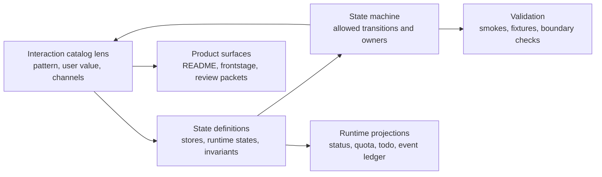

# 核心控制面图谱

> [English](README.md)

> 定位:LoopX 运行在多种 agent harness 之上,提供长程 state、语义决策、治理、恢复与人机协同;这些图谱映射了该承诺背后的控制面 state。参见[产品愿景](../vision.md)。

本目录存放三份应随 LoopX 学习到新长程 agent 行为而一起更新的产品图:

- [交互目录透镜](interaction-catalog.md):当前发生的是哪种可复用的人/agent 模式?
- [State 定义](state-definitions.md):哪个持久 state 体或派生的运行时 state 描述了当前情形?
- [状态机](state-machine.md):下一步哪个转换是合法的,由谁拥有?
- [有界上下文布局](bounded-context-layout.md):当控制面内核代码从扁平的 status/projection 模块迁出时,应放在哪里。
- [规则缝合线映射](rule-seam-map.md):哪些运行时规则族应在改动代码前先做表征与抽取?
- [Smoke 失败分类台账](smoke-failure-classification-ledger.md):哪些红色公开 smoke 是产品 bug、过时 fixture、发布打包缺口或 runner 易用性问题?

更早的详细文档仍是完整协议细节的规范参考:

- [`docs/concepts/interaction-pattern-catalog.md`](../../concepts/interaction-pattern-catalog.md)
  是完整的交互模式注册表。
- [`docs/state-interaction-model.md`](../../state-interaction-model.md) 是
  架构层级的 state 模型。

本目录是更简短的控制面地图。它存在的意义是让产品界面、运行时代码、smoke 与 agent 指令共享同一幅图,而不是从聊天历史或私有规划笔记中重新发现 state。规则缝合线映射刻意保持行为不变:它在重构分支移动控制面代码之前就命名了抽取缝合线与奇偶校验。

本目录中的状态机是 harness 效果解释器内部的一批解释表:

```text
effect request -> interpretation -> observation -> next effect
```

参见
[Agent Loop Effect Interpreter RFC](../../architecture/rfcs/agent-loop-effect-interpreter-v0.md)
与
[Harness Is the Effectful Program](../../development/control-plane-course/01-agent-loop-effectful-program.md)。
公开框架来自齐梦星空,
[主线一:Agent Loop 是 effectful program(1)](https://www.xiaohongshu.com/discovery/item/6a01d501000000003700c5de?source=webshare&xhsshare=pc_web&xsec_token=ABqpNuladcxhev099wLKw8M3ilhKBua0BQXNpxnBZEGkc=&xsec_source=pc_share)。

## 执行归属

这些图谱描述 Kernel state 与合法转换。外围的 Turn 使用四种运行时职责:

| 角色 | 职责 |
| --- | --- |
| Agent | 通过 host/runtime 规划并执行一个有边界的动作。 |
| Provider | 返回外部观察、效果结果与回读。 |
| Capability | 归一化 provider 输出,校验它,并提出类型化转换。 |
| Kernel | 拥有持久 todo、gate、monitor、已接受的写回、配额、恢复与调度。 |

领域 state、evidence、凭证和投影是交换或派生的产物,不是额外的所有者。扩展可以提供 provider,但其安装生命周期并不赋予 Kernel 权限。参见完整的
[运行时职责模型](../../architecture.md#runtime-responsibility-model)。

## 三透镜契约


```mermaid
flowchart LR
  C["Interaction catalog lens<br/>pattern, user value, channels"] --> D["State definitions<br/>stores, runtime states, invariants"]
  D --> M["State machine<br/>allowed transitions and owners"]
  M --> C
  C --> P["Product surfaces<br/>README, frontstage, review packets"]
  D --> R["Runtime projections<br/>status, quota, todo, event ledger"]
  M --> V["Validation<br/>smokes, fixtures, boundary checks"]
```

每个透镜回答一个不同的问题:

| 透镜 | 首要问题 | 缺失时的故障 |
| --- | --- | --- |
| 目录 | 我们正在处理哪种可重现的人/agent 情境? | 每个事件都变成一次性的提示词分支。 |
| State 定义 | 简洁的 state 名称与真相源是什么? | Agent 依据散文争论而不是持久字段。 |
| 状态机 | 允许哪种转换,由谁拥有? | 自动化要么空转,要么停滞,要么绕过真正的 gate。 |

## 精化规则

当出现新的好案例、坏案例或产品洞察时:

1. 先补充或精化目录模式。命名用户价值、触发条件、用户通道、agent 通道、state 锚点与校验。
2. 只有当概念可复用且能从 LoopX state 或投影中观察到时,才新增 state 定义。不要只为标记一次事件就新增 state。
3. 只有当运行时或运维者界面能从公开安全 state 确定性地做出转换时,才新增状态机转换。
4. 当行为保护热路径、公开/私有边界、调度决策或投影不变量时,才新增聚焦的 smoke 或 fixture。

## 边界

这些文件必须保持公开安全。不要把私有文档链接、内部规划上下文、原始转录、原始基准日志、凭据、本地绝对路径或一次性状态叙述复制进本目录。提交前先把私有学习转化为通用的产品语言与简洁 state 名称。
