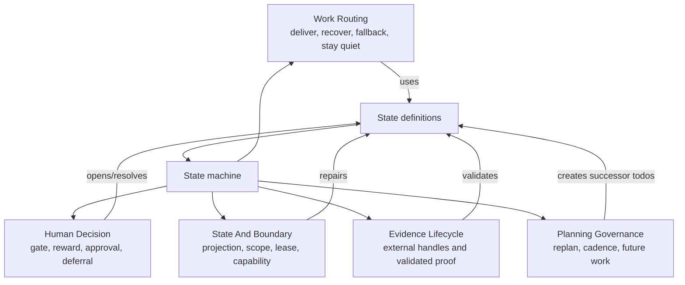

# Interaction Catalog Lens

The full interaction registry lives in
[`docs/interaction-pattern-catalog.md`](../../interaction-pattern-catalog.md).
This file is the core graph lens over that registry: it maps the hot-path
patterns to state definitions and state-machine transitions so a product
surface can explain the behavior without duplicating the entire catalog.

## Pattern Lens Schema

Every durable pattern should be expressible as:

```text
interaction_pattern_lens_v0 = {
  pattern_id,
  family,
  user_value,
  trigger,
  state_anchors[],
  transition_anchors[],
  user_channel,
  agent_channel,
  evidence_shape,
  bad_case,
  validation
}
```

The schema deliberately joins product and runtime language:

- `user_value` explains why a user, maintainer, or leader should care.
- `state_anchors` name the state definitions that make the pattern observable.
- `transition_anchors` name the state-machine edge that keeps the behavior
  deterministic.
- `user_channel` and `agent_channel` keep human interruption separate from
  agent execution.
- `evidence_shape` says what proof is enough without copying private raw data.

## Core Pattern Map

| ID | Pattern | User Value | State Anchors | Transition Anchors | Validation |
| --- | --- | --- | --- | --- | --- |
| IP-001 | Bounded Delivery | One agent turn creates a validated artifact, blocker, or state update instead of just narrating progress. | `Todo`, `Run Snapshot`, `Evidence Bundle`, `WritebackSpend` | `Eligible -> BoundedDelivery -> WritebackSpend -> Ready` | `examples/heartbeat-quota-flow-smoke.py` |
| IP-002 | Blocked Priority With Safe Fallback | A blocked P0 stays visible while safe P1/P2 value continues. | `Gate`, `Todo`, `ScopedUserGateFallback`, `Evidence Bundle` | `QuotaCheck -> ScopedUserGateFallback -> WritebackSpend` | `examples/showcase-0617-blocked-p0-safe-rotation-smoke.py` |
| IP-003 | Scoped Gate With Safe Fallback | A user decision blocks only the lane or action it actually governs. | `Gate`, `Decision Scope`, `Todo`, `ScopedUserGateFallback` | `GateOpen -> ScopeCheck -> RunIndependentFallback` | `examples/quota-agent-scoped-user-gate-smoke.py` |
| IP-004 | Concrete User Todo Projection | The user sees the exact question or action instead of a vague owner wait. | `Gate`, `Todo`, `Projection` | `QuotaCheck -> UserGate -> Ready` | `examples/user-todo-review-material-smoke.py` |
| IP-005 | State Projection Gap | The system repairs stale or missing machine state before ordinary delivery. | `Projection`, `ProjectionGap`, `Event Ledger` | `QuotaCheck -> Repair -> Ready` | `examples/state-projection-gap-smoke.py` |
| IP-007 | Outcome Floor Recovery | Repeated surface work is forced back to outcome-scale proof or a blocker. | `Run Snapshot`, `FocusWait`, `Evidence Bundle` | `QuotaCheck -> FocusWait -> BoundedRecovery` | `examples/blocker-push-runtime-smoke.py` |
| IP-008 | Monitor Quiet Skip | Watch-only work stays alive without spending quota on unchanged polls. | `Todo`, `MonitorQuietSkip`, `Run Snapshot` | `QuotaCheck -> MonitorQuiet -> Ready` | `examples/monitor-scheduler-contract-smoke.py` |
| IP-021 | Per-Todo Capability Gate | Missing runtime capability blocks only the affected candidate, not the entire goal. | `Todo`, `CapabilityGate`, `Projection` | `QuotaCheck -> CapabilityGate -> Repair/AskOwner/RunCandidate` | `examples/capability-gate-smoke.py` |
| IP-026 | Agent-Scoped No-Candidate Gap | A side agent with no in-scope work waits quietly instead of inventing delivery. | `Claim`, `AgentScopeWait`, `Projection` | `QuotaCheck -> AgentScopeWait -> Ready` | `examples/refresh-state-agent-lane-scope-smoke.py` |
| IP-029 | Handoff Todo Gate State | Cross-agent review and handoff become todo lifecycle, not hidden chat memory. | `Claim`, `Dependency / Resume`, `Handoff`, `Gate` | `OwnerRouteWait -> OwnerDecisionRecorded -> HandoffGateCleared -> SuccessorReplan/SuccessorRun` | `examples/quota-cleared-blocker-successor-gate-smoke.py` |

## Pattern Families As A Graph



## Refinement Guidance

Refine the catalog when a new case changes one of these things:

- A different user-visible value appears, such as saving review time,
  protecting a write boundary, or preserving long-running evidence.
- A pattern needs a new state anchor, such as `AgentScopeWait` or
  `ProjectionGap`, to be machine-visible.
- A state-machine edge changes, such as allowing a scoped fallback while a
  user gate remains open.
- Validation becomes possible with a public-safe smoke or fixture.

Do not create a new pattern only because a new UI card, PR packet, dashboard
row, or automation prompt needs different wording. First ask whether the row is
just a new projection of an existing pattern.
