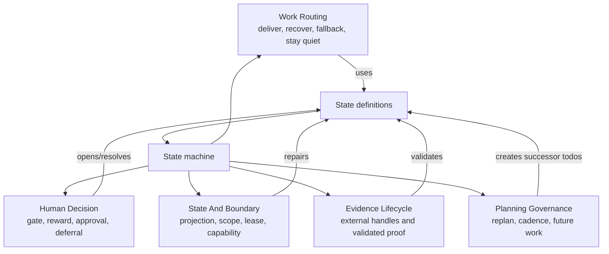

# 交互目录透镜

> [English](interaction-catalog.md)

完整的交互注册表位于
[`docs/concepts/interaction-pattern-catalog.md`](../../concepts/interaction-pattern-catalog.md)。
本文件是该注册表的核心图谱透镜:它把热路径模式映射到 state 定义与状态机转换,让产品界面无需复制整个目录就能解释行为。

## 模式透镜 Schema

每个持久模式都应可表达为:

```text
interaction_pattern_lens_v0 = {
  pattern_id,
  family,
  user_value,
  trigger,
  state_anchors[],
  transition_anchors[],
  user_channel,
  agent_channel,
  evidence_shape,
  bad_case,
  validation
}
```

该 schema 刻意把产品语言与运行时语言连接起来:

- `user_value` 解释用户、维护者或领导者为何应关心。
- `state_anchors` 命名使模式可观察的 state 定义。
- `transition_anchors` 命名保持行为确定性的状态机边。
- `user_channel` 与 `agent_channel` 把人为打断与 agent 执行分开。
- `evidence_shape` 说明何种证据足够,而无需复制私有原始数据。

## 核心模式图

| ID | 模式 | 用户价值 | State 锚点 | 转换锚点 | 校验 |
| --- | --- | --- | --- | --- | --- |
| IP-001 | Bounded Delivery | 一次 agent Turn 产生一个已验证的产物、阻碍或 state 更新,而不只是叙述进展。 | `Todo`, `Run Snapshot`, `Evidence Bundle`, `WritebackSpend` | `Eligible -> BoundedDelivery -> WritebackSpend -> Ready` | `examples/control_plane/heartbeat-quota-flow-smoke.py` |
| IP-002 | Blocked Priority With Safe Fallback | 被阻碍的 P0 保持可见,同时安全的 P1/P2 价值继续推进。 | `Gate`, `Todo`, `ScopedUserGateFallback`, `Evidence Bundle` | `QuotaCheck -> ScopedUserGateFallback -> WritebackSpend` | `examples/showcase-0617-blocked-p0-safe-rotation-smoke.py` |
| IP-003 | Scoped Gate With Safe Fallback | 用户决策只阻碍它真正管辖的车道或动作。 | `Gate`, `Decision Scope`, `Todo`, `ScopedUserGateFallback` | `GateOpen -> ScopeCheck -> RunIndependentFallback` | `examples/control_plane/quota-agent-scoped-user-gate-smoke.py` |
| IP-004 | Concrete User Todo Projection | 用户看到确切的问题或动作,而不是含糊的属主等待。 | `Gate`, `Todo`, `Projection` | `QuotaCheck -> UserGate -> Ready` | `examples/user-todo-review-material-smoke.py` |
| IP-005 | State Projection Gap | 系统在常规交付前修复陈旧或缺失的机器 state。 | `Projection`, `ProjectionGap`, `Event Ledger` | `QuotaCheck -> Repair -> Ready` | `examples/state-projection-gap-smoke.py` |
| IP-007 | Outcome Floor Recovery | 反复的表面工作被拉回结果尺度的证据或阻碍。 | `Run Snapshot`, `FocusWait`, `Evidence Bundle` | `QuotaCheck -> FocusWait -> BoundedRecovery` | `examples/blocker-push-runtime-smoke.py` |
| IP-008 | Monitor Quiet Skip | 只关注的工作保持存活,而不为未变化的轮询花费配额。 | `Todo`, `MonitorQuietSkip`, `Run Snapshot` | `QuotaCheck -> MonitorQuiet -> Ready` | `examples/control_plane/monitor-scheduler-contract-smoke.py` |
| IP-021 | Per-Todo Capability Gate | 缺失运行时能力只阻碍受影响的候选,而非整个 goal。 | `Todo`, `CapabilityGate`, `Projection` | `QuotaCheck -> CapabilityGate -> Repair/AskOwner/RunCandidate` | `examples/capability-gate-smoke.py` |
| IP-026 | Agent-Scoped No-Candidate Gap | 没有当前 agent 或无认领工作等的对等方等待或请求重新分配,而不是发明交付。 | `Claim`, `AgentScopeWait`, `Projection` | `QuotaCheck -> AgentScopeWait -> Ready` | `examples/control_plane/refresh-state-agent-lane-scope-smoke.py` |
| IP-029 | Handoff Todo Gate State | 跨 agent 评审与交接变成 todo 生命周期,而非隐藏的聊天记忆。 | `Claim`, `Dependency / Resume`, `Handoff`, `Gate` | `OwnerRouteWait -> OwnerDecisionRecorded -> HandoffGateCleared -> SuccessorReplan/SuccessorRun` | `examples/control_plane/quota-cleared-blocker-successor-gate-smoke.py` |

## 以图形式呈现的模式族


```mermaid
flowchart TB
  Work["Work Routing<br/>deliver, recover, fallback, stay quiet"]
  Human["Human Decision<br/>gate, reward, approval, deferral"]
  Boundary["State And Boundary<br/>projection, scope, lease, capability"]
  Evidence["Evidence Lifecycle<br/>external handles and validated proof"]
  Planning["Planning Governance<br/>replan, cadence, future work"]

  Work -->|uses| D["State definitions"]
  Human -->|opens/resolves| D
  Boundary -->|repairs| D
  Evidence -->|validates| D
  Planning -->|creates successor todos| D
  D --> M["State machine"]
  M --> Work
  M --> Human
  M --> Boundary
  M --> Evidence
  M --> Planning
```

## 精化指引

当新案例改变以下任一事项时精化目录:

- 出现不同的用户可见价值,例如节省评审时间、保护写入边界或保留长程 evidence。
- 模式需要新的 state 锚点,例如 `AgentScopeWait` 或 `ProjectionGap`,才能被机器可见。
- 状态机边发生变化,例如在用户 gate 仍打开时允许有范围的 fallback。
- 校验可以用公开安全的 smoke 或 fixture 实现。

不要仅仅因为新的 UI 卡片、PR 包、dashboard 行或自动化提示词需要不同措辞就创建新模式。先问:这一行是否只是现有模式的一个新投影?
