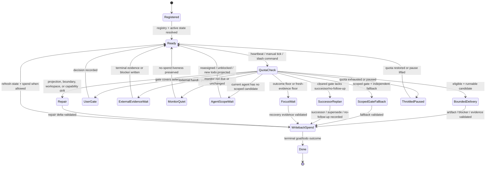
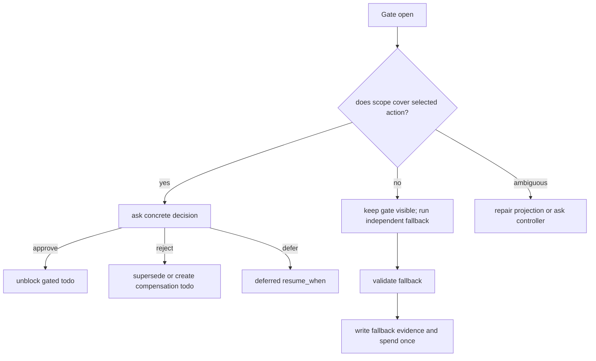
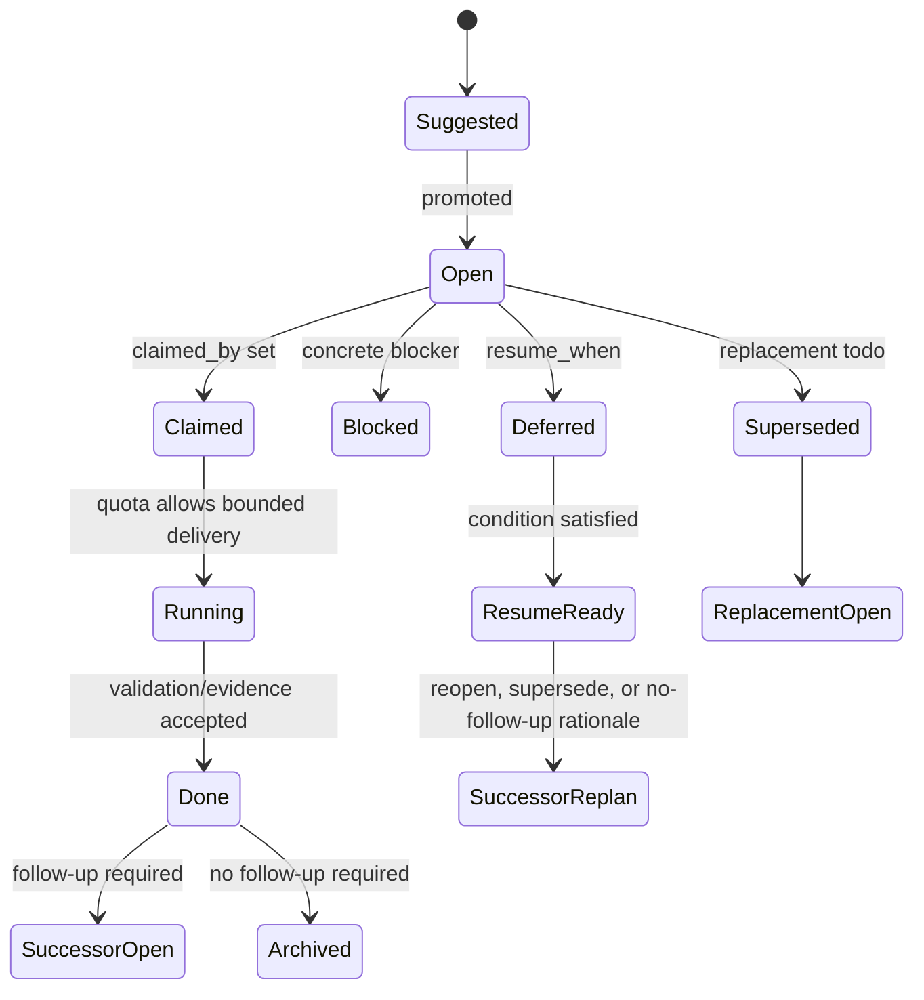
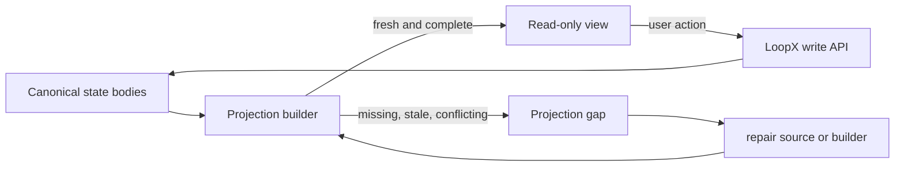

# State Machine

This is the product-level state machine for one LoopX heartbeat or manual tick.
It is not a new store. It is a deterministic view over registry, active state,
todos, gates, run history, quota, event ledger, and projections.

## Top-Level Machine

## Transition Table

| From | Guard | To | Required Writeback |
| --- | --- | --- | --- |
| `Registered` | Registry entry and active-state route resolve. | `Ready` | None, or registry repair event if resolution changed. |
| `Ready` | A host tick or user command asks whether work should run. | `QuotaCheck` | None before the guard. |
| `QuotaCheck` | Runnable candidate and no covering gate. | `BoundedDelivery` | Selected todo/run evidence after validation. |
| `QuotaCheck` | A gate is open but does not cover the selected fallback. | `ScopedGateFallback` | Gate remains visible; fallback evidence after validation. |
| `QuotaCheck` | Gate covers the selected action. | `UserGate` | Concrete user/controller decision, defer, rejection, or successor todo. |
| `QuotaCheck` | External evidence is pending or a launched handle must be observed. | `ExternalEvidenceWait` | Terminal evidence, compact observation, or blocker. |
| `QuotaCheck` | Monitor-only work is not due or unchanged. | `MonitorQuiet` | At most one no-spend monitor-poll event when contracted. |
| `QuotaCheck` | Current agent has no scoped candidate or waits on another owner. | `AgentScopeWait` | No spend; wait for todo lifecycle, reassignment, or unblock event. |
| `QuotaCheck` | A deferred or handoff gate has cleared, but no runnable successor, supersede link, or no-follow-up rationale is projected. | `SuccessorReplan` | Reopen, supersede, create successor todo, or record no-follow-up rationale; do not run ordinary delivery yet. |
| `QuotaCheck` | Outcome floor or fresh-evidence floor blocks ordinary delivery. | `FocusWait` | Recovery evidence or blocker. |
| `QuotaCheck` | Source/projection/boundary/workspace/capability is inconsistent. | `Repair` | Repair delta, blocker, or concrete gate. |
| `QuotaCheck` | Quota exhausted or explicitly paused. | `ThrottledPaused` | None until quota/pause changes. |
| `BoundedDelivery` | Work validated. | `WritebackSpend` | Artifact, code/doc ref, test result, blocker, or evidence ref. |
| `WritebackSpend` | Todo/goal terminal. | `Done` | Completion rationale and archive/successor state. |
| `WritebackSpend` | More work remains. | `Ready` | Refreshed projection and one spend when the contract allows it. |

## Gate Scope Submachine

The key rule: a gate is scoped authority, not a global boolean. If the scope is
ambiguous, the machine goes to repair; it does not guess from prose.

## Todo Lifecycle Submachine

`Running` is derived from quota and run history. It should not become a new
mandatory persistent todo status unless the event stream explicitly models it.

For handoff gates, `blocks_agent=<agent-id>` makes the todo lifecycle part of
the routing machine. A non-terminal handoff keeps the blocked agent in
`AgentScopeWait`; a done handoff with a concrete successor can route normally;
a done handoff without successor/no-follow-up enters `SuccessorReplan` before
ordinary delivery is allowed.

## Projection Sink Submachine

Frontstage, review packets, status cards, manager summaries, and external
kanban rows are projection sinks. They can make state understandable, but all
state-changing actions return through LoopX write APIs.

## Catalog Linkage

| Machine Edge | Catalog Patterns |
| --- | --- |
| `QuotaCheck -> BoundedDelivery` | IP-001 Bounded Delivery |
| `QuotaCheck -> ScopedGateFallback` | IP-002 Blocked Priority With Safe Fallback; IP-003 Scoped Gate With Safe Fallback |
| `QuotaCheck -> UserGate` | IP-004 Concrete User Todo Projection |
| `QuotaCheck -> Repair` | IP-005 State Projection Gap; IP-021 Per-Todo Capability Gate |
| `QuotaCheck -> FocusWait` | IP-007 Outcome Floor Recovery |
| `QuotaCheck -> MonitorQuiet` | IP-008 Monitor Quiet Skip |
| `QuotaCheck -> AgentScopeWait` | IP-026 Agent-Scoped No-Candidate Gap; IP-029 Handoff Todo Gate State for still-blocking handoffs |
| `QuotaCheck -> SuccessorReplan` | IP-027 Deferred Gate Resume; IP-029 Handoff Todo Gate State for cleared handoffs without a successor |

If a new interaction pattern cannot point to a state-machine edge, it is
probably a product note, a UI variant, or a private incident label rather than
a core control-plane pattern.
