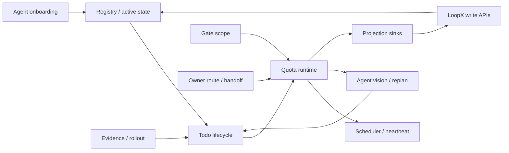
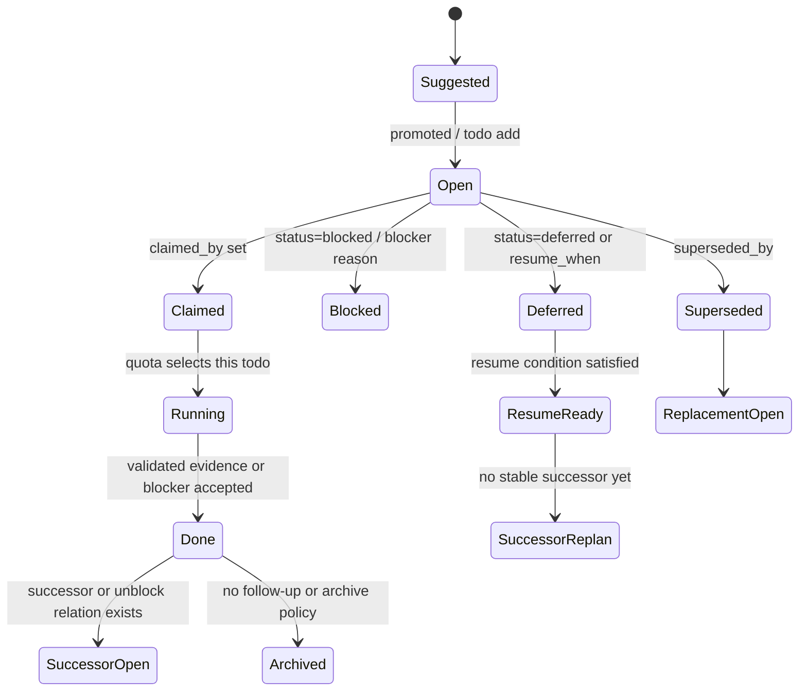
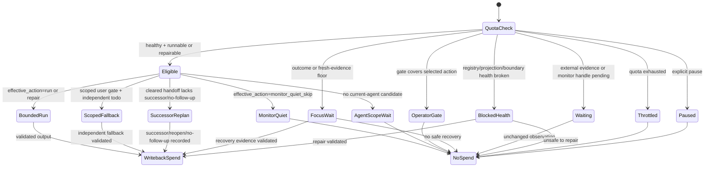
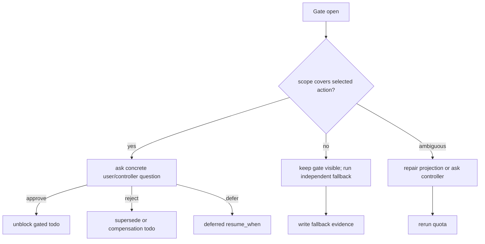
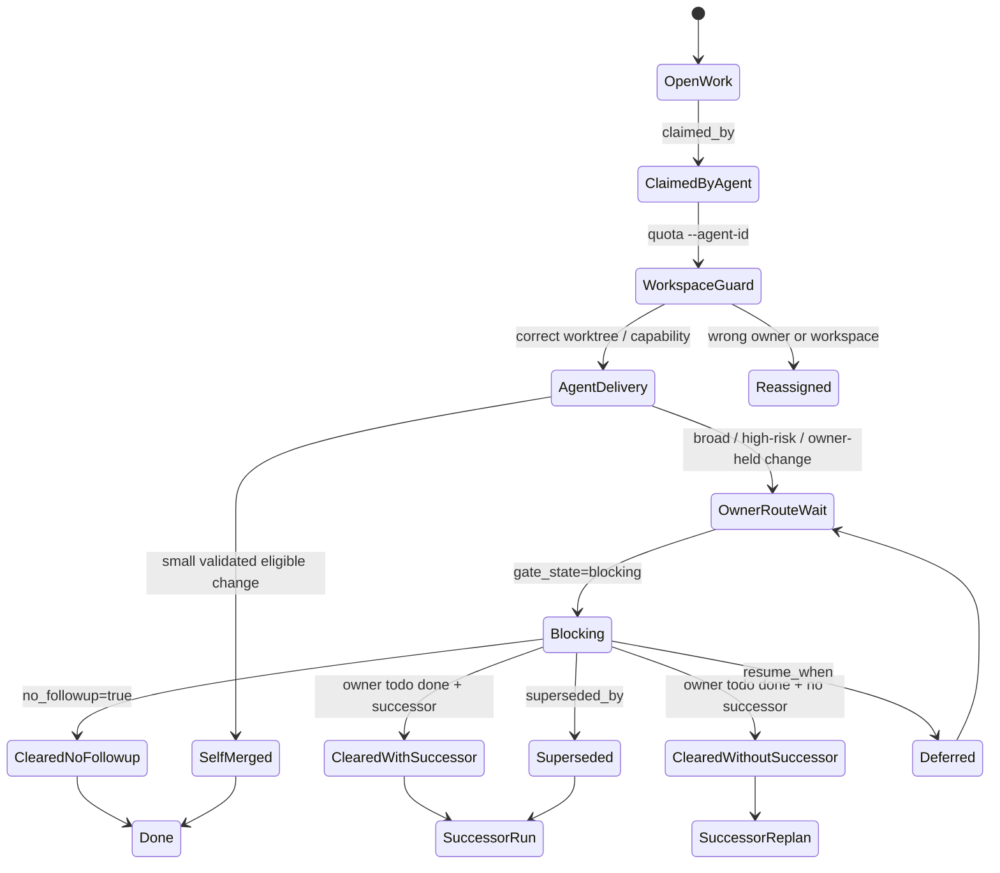
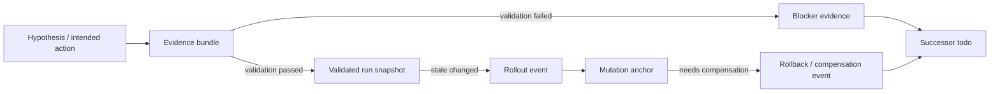
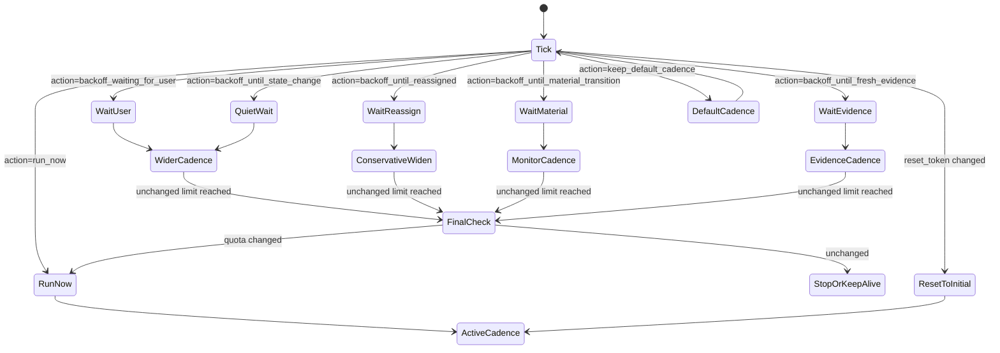
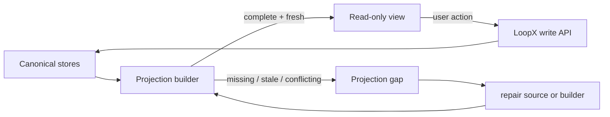
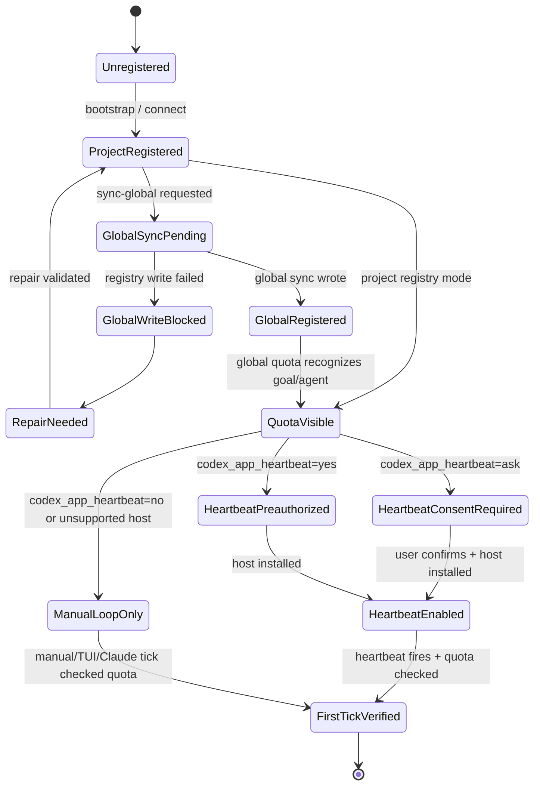
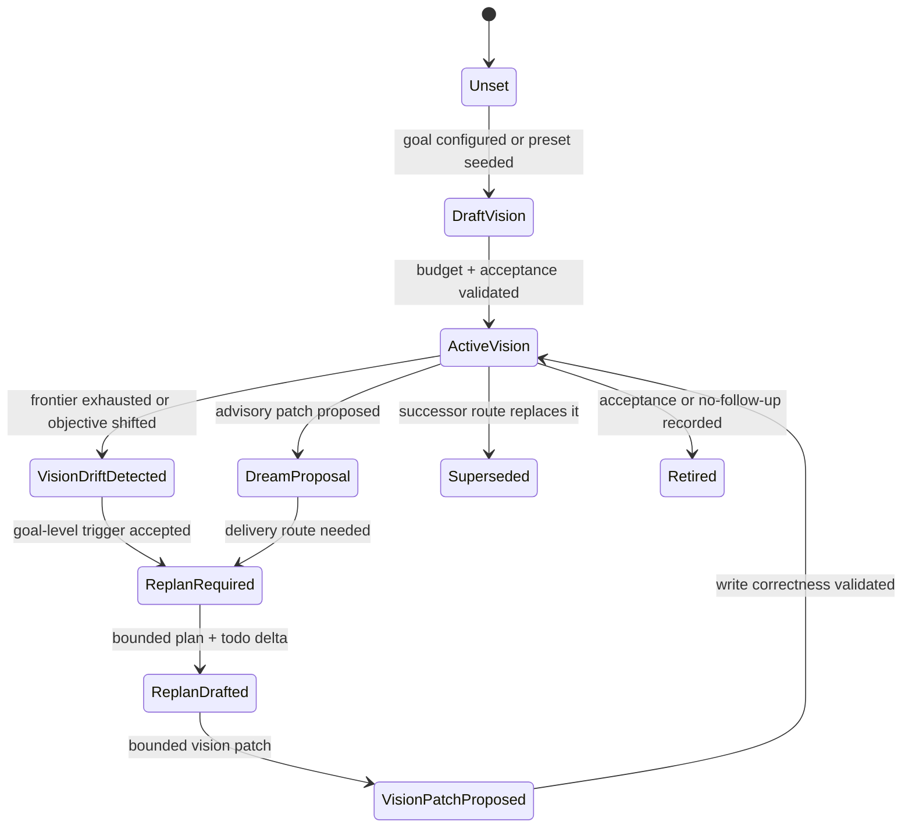

# State Machines

LoopX does not have one giant state machine. It has a small set of
cooperating machines that are projected from the same canonical state bodies:
registry entries, active state, todo metadata, run history, quota events,
operator gates, scheduler acknowledgements, and projection sinks.

This document is not a new store and not a private incident narrative. It is a
public-safe map over the current repository contracts, especially:

- [`state-definitions.md`](state-definitions.md) for source state bodies and
  derived runtime names;
- [`interaction-catalog.md`](interaction-catalog.md) for reusable interaction
  patterns;
- [`loopx/control_plane/todos/contract.py`](../../../loopx/control_plane/todos/contract.py) for todo status,
  task class, decision scope, resume, claim, and monitor metadata fields;
- [`loopx/quota.py`](../../../loopx/quota.py) for `quota should-run`, runtime
  states, `effective_action`, `interaction_contract`, spend, and monitor poll
  contracts;
- [`loopx/control_plane/scheduler/scheduler_hint.py`](../../../loopx/control_plane/scheduler/scheduler_hint.py)
  for cadence/backoff/reset-token behavior;
- [`goal_vision_replan_contract_v0`](../../reference/protocols/goal-vision-replan-contract-v0.md)
  for bounded per-agent vision, replan transitions, and goal-route projection;
- cross-agent handoff gate states in
  [`loopx/control_plane/todos/handoff_gate.py`](../../../loopx/control_plane/todos/handoff_gate.py);
- [`loopx/project_map.py`](../../../loopx/project_map.py) and
  [`loopx/bootstrap.py`](../../../loopx/bootstrap.py) for project registration,
  read-only-map opt-in, global sync, and host-loop activation.

## How The Machines Compose



The top-level loop is simple:

1. Resolve registry and active state.
2. Project todos, gates, evidence, and current agent identity.
3. Ask `quota should-run`.
4. Either run exactly one bounded segment, ask a concrete gate, observe a
   waiting handle, repair the control plane, or quiet no-op according to the
   projected machine state.
5. State changes return through LoopX write APIs, not through dashboard text or
   chat memory.

## 1. Todo Lifecycle Machine

Todo is the smallest executable or waiting unit. Current source fields include
`status`, `task_class`, `action_kind`, `claimed_by`, `blocks_agent`,
`global_gate`, `decision_scope`, `required_decision_scopes`,
`required_capabilities`, `unblocks_todo_id`, `resume_when`, `no_followup`,
`superseded_by`, monitor metadata, and evidence/reason fields.



| State | Source Fields | Runtime Meaning | Legal Exit |
| --- | --- | --- | --- |
| `Suggested` | Suggestion output or planning prompt | Candidate work that has not entered the durable todo list. | Promote to `Open` or drop it. |
| `Open` | `status=open` or unchecked Markdown item | Durable backlog item. | Claim, block, defer, supersede, or complete. |
| `Claimed` | `claimed_by=<agent_id>` | Soft ownership/routing signal. It is not a lock. | Run if quota selects it, reassign, block, or complete. |
| `Running` | Derived from `quota should-run` plus run history | A bounded turn is currently attempting this item. | Write evidence/blocker, then complete or reopen. |
| `Done` | `status=done` or checked item plus evidence | The item has a terminal outcome. | Archive, create successor, or expose handoff clearance. |
| `Blocked` | `status=blocked`, `reason`, capability/gate fields | Known blocker, not vague waiting. | Repair, ask owner, supersede, or reopen. |
| `Deferred` | `status=deferred`, `resume_when` | Waiting for a concrete condition. | `ResumeReady` when the condition is satisfied. |
| `Superseded` | `superseded_by` | Replaced without deleting history. | Follow `ReplacementOpen`. |

`Running` is deliberately derived. Adding a persistent todo status for it would
duplicate quota/run-history truth.

## 2. Quota / Runtime Machine

`quota should-run` is the compute gate. It decides whether the next automatic
tick should spend compute, but it does not grant protected permissions. The
current state order in `loopx/quota.py` is:

```text
blocked_health -> operator_gate -> focus_wait -> eligible -> waiting -> throttled -> paused
```

Additional fields such as `effective_action`, `safe_bypass_allowed`,
`capability_gate`, `workspace_guard`, `agent_scope_frontier`,
`heartbeat_recommendation`, `execution_obligation`, and
`interaction_contract` refine what the agent and host must do next.



| Runtime State / Action | Agent Behavior | Spend Rule |
| --- | --- | --- |
| `eligible` + runnable action | Attempt one bounded delivery, recovery, or repair. | Spend only after validated writeback. |
| `operator_gate` / user gate | Ask or surface the concrete payload. | No spend for asking. |
| `scoped_user_gate_fallback` | Surface the gate and run only an independent fallback. | Spend after fallback writeback. |
| `focus_wait` | Produce the named outcome/fresh-evidence recovery or write a blocker. | Recovery can spend after validation; passive waiting cannot. |
| `waiting` / `external_evidence_observe` | Observe a public-safe handle or write a compact blocker. | Follow the observation contract; unchanged waiting is usually no-spend. |
| `monitor_quiet_skip` | Preserve liveness, optionally append one no-spend monitor poll. | No spend. |
| `agent_scope_wait` | Stay active but quiet until reassignment, unblock, or scoped todo appears. | No spend. |
| `blocked_health` | Repair registry/projection/boundary/workspace/capability if allowed. | Spend only after validated repair writeback. |
| `throttled` / `paused` | Do not deliver. | No spend. |

## 3. Gate Decision Scope Machine

Gates are scoped authority, not a universal boolean. A gate blocks a selected
action only when its scope covers that action or agent. Current source fields
include `task_class=user_gate`, `global_gate`, `blocks_agent`,
`decision_scope`, `required_decision_scopes`, `operator_gate`, and
`interaction_contract.user_channel`.



| Transition | Required Evidence |
| --- | --- |
| Open gate -> Ask | Concrete payload todo/question, not only "owner gate". |
| Open gate -> Fallback | Proof that selected fallback is independent of the gate scope. |
| Open gate -> Repair | Explanation of missing or contradictory scope fields. |
| Approve/reject/defer | Decision event, todo update, or operator gate record. |
| Fallback complete | Artifact/blocker/evidence linked to the independent todo. |

This machine is why user and agent channels can intentionally disagree:

```text
user_channel.action_required = true
agent_channel.must_attempt = true
selected_action = independent_fallback
```

## 4. Owner Route / Multi-Agent Handoff Machine

Multi-agent routing is modeled with todo ownership and handoff gates. Review is
not a separate kernel state. It is a todo/gate relation that can block a named
agent until an owner route completes, reassigns, or records no follow-up.

`loopx/control_plane/todos/handoff_gate.py` currently projects `blocks_agent`
todos into:
`blocking`, `cleared_without_successor`, `cleared_with_successor`,
`cleared_no_followup`, `superseded`, and `deferred`.



| Handoff State | Meaning | Next Legal Action |
| --- | --- | --- |
| `blocking` | Another owner route blocks this agent. | Wait quietly or surface concrete gate. |
| `cleared_with_successor` | The blocker is done and a successor exists. | Route to successor. |
| `cleared_without_successor` | The blocker is done but no successor/no-follow-up is projected. | Enter successor replan before ordinary delivery. |
| `cleared_no_followup` | Owner explicitly says no follow-up. | Archive or continue unrelated work. |
| `superseded` | A replacement todo exists. | Follow replacement. |
| `deferred` | Resume condition is not yet satisfied. | Wait or observe condition. |

## 5. Evidence / Rollout / Rollback Machine

Evidence determines whether a state transition is trustworthy. Agent-declared
"done" is not enough. A transition should be backed by artifact refs, source
refs, validation results, blocker evidence, commit/PR/doc revision anchors, or
compact external observations.



| Evidence State | Can Change Control-Plane State? | Notes |
| --- | --- | --- |
| Hypothesis | No | Explains direction only. |
| Evidence bundle | Maybe | Must include enough refs and validation shape. |
| Validated run snapshot | Yes | Can drive todo completion, spend, or status projection. |
| Blocker evidence | Yes | Can justify blocked/deferred/successor states. |
| Rollout event | Yes | Append-only lifecycle fact. |
| Mutation anchor | Yes | Commit, PR, doc revision, Base row, automation version, or equivalent. |
| Rollback / compensation | Yes | Fix-forward and rollback remain part of history. |

Rollback should never mean deleting the evidence chain. It appends a new
compensating fact and usually creates or unblocks a successor todo.

## 6. Scheduler / Heartbeat Machine

`scheduler_hint` is waiting policy, not execution permission. It is derived
from quota payload fields such as `should_run`, `effective_action`,
`heartbeat_recommendation`, `execution_obligation`,
`automation_liveness`, and `interaction_contract`.



| Scheduler Action | Current Cadence Class | Typical Codex App Initial / Max | Meaning |
| --- | --- | --- | --- |
| `run_now` | `active_work` | 3 / 10 minutes | Work or repair must be attempted. |
| `backoff_waiting_for_user` | `human_gate` | 30 / 120 minutes | Concrete user/controller action is next. |
| `backoff_until_reassigned` | `agent_scope_wait` | 10 / 60 minutes, progression 10/20/30/60 | Handoff owner or reassignment may unblock this agent. |
| `backoff_until_material_transition` | `monitor_wait` | 15 / 60 minutes | Monitor-only liveness without compute spend. |
| `backoff_until_fresh_evidence` | `unchanged_noop` | 60 / 240 minutes | Wait for fresh mapped or post-handoff evidence. |
| `backoff_until_state_change` | `quiet_wait` | 30 / 120 minutes | No specific user/monitor path is projected. |
| `keep_default_cadence` | `default` | 3 / 30 minutes | No backoff condition is projected. |

The reset token is part of the machine. When identity, selected action,
recommended mode, user feedback, gate resolution, reassignment, material
evidence, or active work changes the token, hosts should return to the profile
initial cadence and acknowledge the scheduler state. Cadence changes do not
spend quota.

## 7. Projection Sink Machine

Status, review packet, frontstage, manager summary, Lark Kanban, and dashboard
rows are projection sinks. They make state readable; they do not own state.



| Projection State | Meaning | Required Behavior |
| --- | --- | --- |
| `Read-only view` | The sink matches current source fields closely enough to display. | It may guide a user/agent, but writes go through LoopX APIs. |
| `Projection gap` | Missing concrete todo, stale route, conflicting source, or collapsed user/agent channel. | Repair the source or projection builder before relying on it. |
| `Write API` | Todo update, gate decision, refresh-state, monitor poll, spend, scheduler ack, or event append. | Append durable facts; do not mutate the sink as truth. |

This machine protects the public/private boundary: a projection may render
public-safe summaries and evidence refs, but it must not become a dependency on
private raw docs, transcripts, credentials, local paths, benchmark logs, or
unredacted connector payloads.

## 8. Agent Onboarding / Automation Enablement Machine

Connecting a project is not the same as enabling long-running automation. The
current code separates project registration, global sync, quota visibility,
heartbeat opt-in, host-loop installation, and first tick verification.



| State | Source Fields / Commands | Product Meaning |
| --- | --- | --- |
| `ProjectRegistered` | Registry goal, adapter kind/status, active state path | LoopX knows the project. Automation is not implied. |
| `GlobalSyncPending` / `GlobalRegistered` | `global_sync` payload | Shared status/quota can discover the goal. |
| `GlobalWriteBlocked` / `RepairNeeded` | Registry writability probe or sync error | Produce a concrete repair/gate; do not silently downgrade. |
| `QuotaVisible` | `quota should-run` can resolve goal and agent | The scheduler can reason about the target. |
| `HeartbeatConsentRequired` | `codex_app_heartbeat=ask` | Ask before installing a recurring Codex App automation. |
| `HeartbeatPreauthorized` | `codex_app_heartbeat=yes` | Install/update the host loop before claiming automation is active. |
| `ManualLoopOnly` | `codex_app_heartbeat=no` or host unsupported | Manual, TUI, Claude, or on-demand loops remain valid. |
| `FirstTickVerified` | Run history or quota evidence from a real tick | The operating loop has actually been exercised. |

For read-only project maps, `adapter.status=planned` permits only a dry-run
preview until the `read_only_map_opt_in` operator gate approves it. Connected
read-only states such as `connected`, `connected-read-only`, and
`read-only-map-ready` can append a real read-only map.

## 9. Agent Vision / Replan Machine

Agent vision is compact executable routing state, not a scratchpad. Each agent
may have a bounded vision packet that describes its current role direction,
scope, acceptance summary, replan trigger, dreaming policy, and latest patch.
The CLI/write API must enforce those budgets before quota or status consumes
the projection.

Vision is per `agent_id`, including closeout checks. A material
`refresh-state` emits `vision_checkpoint_v0` for the current agent: patched,
unchanged with reason, retired/superseded, missing required, or not required.
Missing required checkpoints are preserved in compact run history, filtered by
the current agent, and can become goal-frontier acceptance gaps before local
quiet/wait decisions.



| State | Product Meaning | Legal Exit |
| --- | --- | --- |
| `DraftVision` | A compact packet is being seeded or rewritten. | Validate budget and acceptance. |
| `ActiveVision` | The role may use the packet for lane-local work. | Evidence, drift, dreaming proposal, supersession, or retirement. |
| `ReplanRequired` | Goal-level progress requires replan before quiet/wait. | Write a bounded vision/todo/acceptance delta. |
| `VisionPatchProposed` | Replan produced a bounded patch. | Apply through LoopX write APIs or reject as over budget. |

The important ordering is goal-level first: required replan is evaluated before
monitor quiet skip, scoped gate wait, or an individual agent's no-candidate
state. Those local states may remain visible, but they cannot clear a required
replan. An acknowledgement without a vision, todo, acceptance, or no-follow-up
delta is `replan_noop`. A future monitor `next_due_at` is scheduler metadata,
not a frontier delta, and cannot by itself suppress a monitor-only empty-frontier
replan.

The same ordering applies when an agent records a bounded
`replan_trigger_summary` in its vision packet. Status/quota exposes that trigger
as a goal-frontier `acceptance_gaps[]` entry. If no advancement frontier remains,
the gap becomes a replan trigger before the lane can quietly back off.

Long runnable lanes also pass through this machine. When the current agent can
select about 15 advancement todos, or about 20 open todos with advancement work
still present, quota should trigger a bounded vision replan before continuing
linearly. The replan reads the agent-scoped evidence log, uses bounded public
research when local evidence is insufficient for a public claim, then groups,
prunes, or reprioritizes the chain into the next high-value runnable slice.

The same ordering also applies to `vision_checkpoint_v0`: if a role records
material progress but omits both a vision patch and an unchanged/no-follow-up
decision, quota should project that role's `vision_checkpoint_missing` gap and
route that role back through replan.

See
[`goal_vision_replan_contract_v0`](../../reference/protocols/goal-vision-replan-contract-v0.md)
for the field budgets and projection contract.

## Catalog Linkage

| Machine | Representative Patterns |
| --- | --- |
| Todo lifecycle | IP-001 Bounded Delivery, IP-029 Handoff Todo Gate State |
| Quota / runtime | IP-001, IP-007 Outcome Floor Recovery, IP-008 Monitor Quiet Skip |
| Gate decision scope | IP-002 Blocked Priority With Safe Fallback, IP-003 Scoped Gate With Safe Fallback, IP-004 Concrete User Todo Projection |
| Owner route / handoff | IP-026 Agent-Scoped No-Candidate Gap, IP-029 Handoff Todo Gate State |
| Evidence / rollout | IP-001 Bounded Delivery, IP-007 Outcome Floor Recovery |
| Scheduler / heartbeat | IP-008 Monitor Quiet Skip, IP-026 Agent-Scoped No-Candidate Gap |
| Projection sink | IP-005 State Projection Gap |
| Agent onboarding | Project bootstrap/connect and read-only-map opt-in flows |
| Agent vision / replan | Autonomous replan, dreaming proposal promotion, successor replan |

If a new interaction pattern cannot be placed in one of these machines, first
check whether it is a UI variant, wording variant, or private incident label.
Only add a new machine when a source field, legal transition, owner, and
validation path are all observable from public-safe LoopX state.
