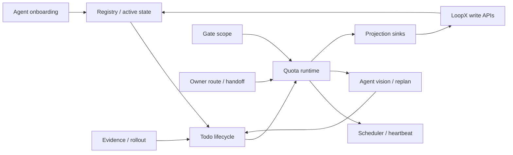
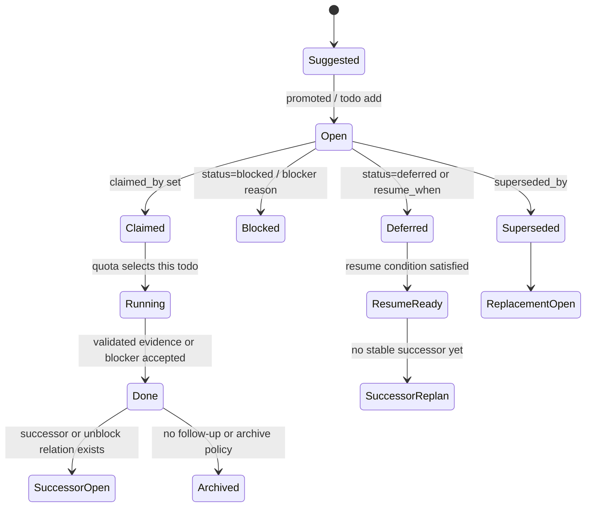
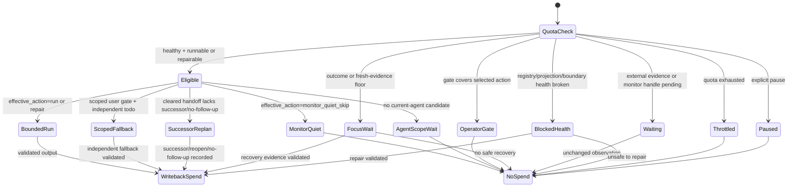
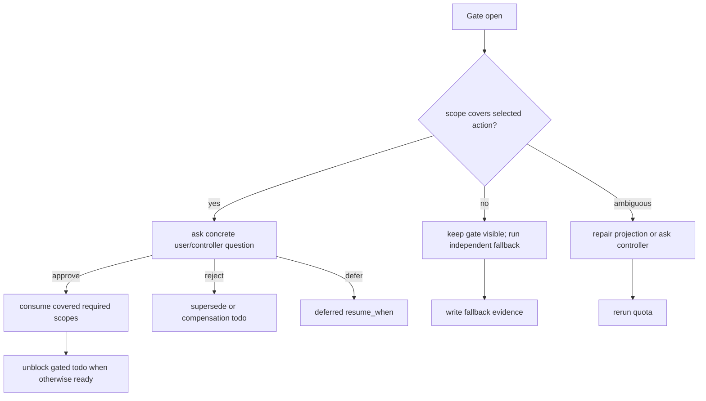
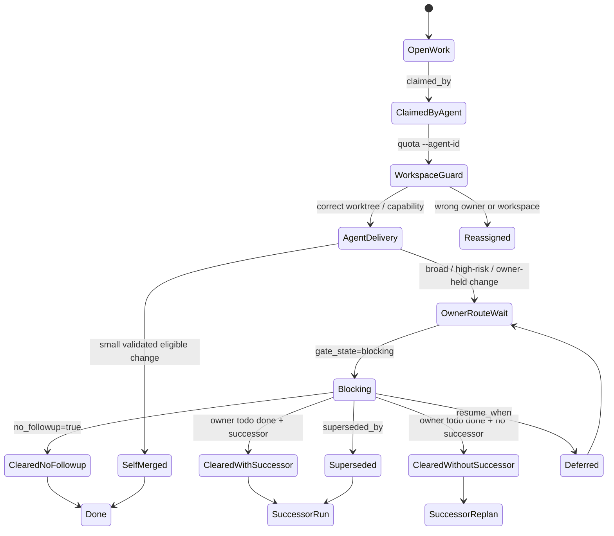
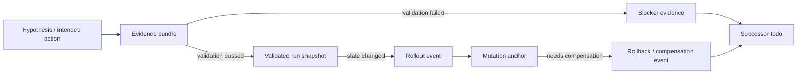
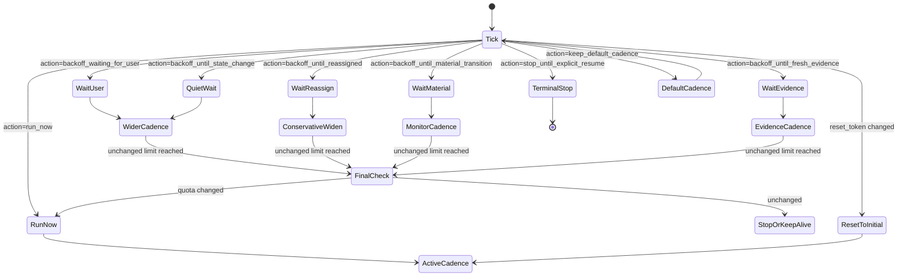
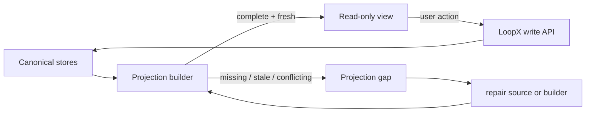
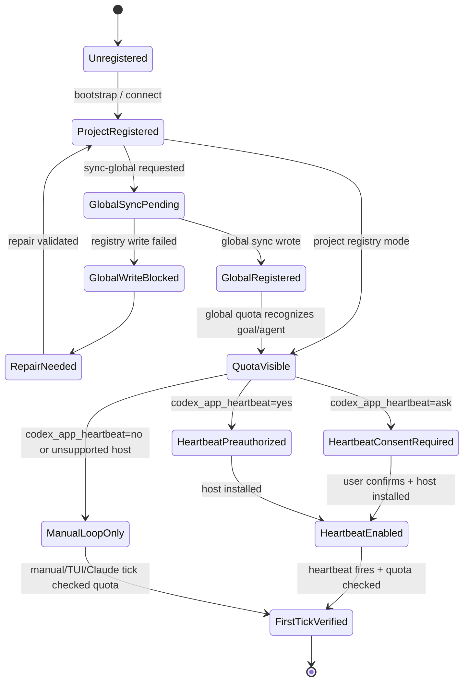
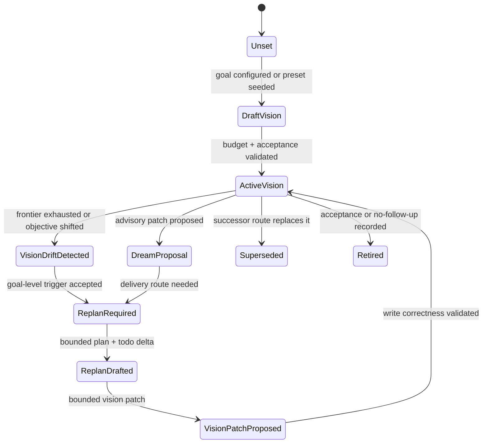

# 状态机


LoopX 没有一台巨型状态机。它有一小组协作机器,这些机器从相同的规范 state 体投影而来:注册表条目、active 状态、todo 元数据、运行历史、配额事件、运维者 gate、调度器确认与投影 sink。

本文不是新存储,也不是私有事件叙述。它是当前仓库契约之上的公开安全地图,尤其是:

- [`state-definitions.md`](state-definitions.md):源 state 体与派生的运行时名称;
- [`interaction-catalog.md`](interaction-catalog.md):可复用的交互模式;
- [`loopx/control_plane/todos/contract.py`](https://github.com/huangruiteng/loopx/blob/main/loopx/control_plane/todos/contract.py):todo 状态、任务类别、决策范围、恢复、认领与 monitor 元数据字段;
- [`loopx/quota.py`](https://github.com/huangruiteng/loopx/blob/main/loopx/quota.py):`quota should-run`、运行时状态、`effective_action`、`interaction_contract`、花费与 monitor 轮询契约;
- [`loopx/control_plane/scheduler/scheduler_hint.py`](https://github.com/huangruiteng/loopx/blob/main/loopx/control_plane/scheduler/scheduler_hint.py):节奏/退避/重置令牌行为;
- [`goal_vision_replan_contract_v0`](../../reference/protocols/goal-vision-replan-contract-v0.md):有界的逐 agent 愿景、重规划转换与 goal 路由投影;
- [`loopx/control_plane/todos/handoff_gate.py`](https://github.com/huangruiteng/loopx/blob/main/loopx/control_plane/todos/handoff_gate.py) 中的跨 agent 交接 gate 状态;
- [`loopx/project_map.py`](https://github.com/huangruiteng/loopx/blob/main/loopx/project_map.py) 与
  [`loopx/bootstrap.py`](https://github.com/huangruiteng/loopx/blob/main/loopx/bootstrap.py):项目注册、只读地图选择加入、全局同步与 host-loop 激活。

## 机器如何组合


```mermaid
flowchart LR
  Registry["Registry / active state"] --> Todo["Todo lifecycle"]
  Todo --> Quota["Quota runtime"]
  Gate["Gate scope"] --> Quota
  Owner["Owner route / handoff"] --> Quota
  Evidence["Evidence / rollout"] --> Todo
  Quota --> Scheduler["Scheduler / heartbeat"]
  Quota --> Vision["Agent vision / replan"]
  Vision --> Todo
  Quota --> Projection["Projection sinks"]
  Projection --> WriteAPI["LoopX write APIs"]
  WriteAPI --> Registry
  Onboard["Agent onboarding"] --> Registry
```

顶层 Loop 很简单:

1. 解析注册表与 active 状态。
2. 投影 todo、gate、evidence 与当前 agent 身份。
3. 询问 `quota should-run`。
4. 按投影的机器状态,或恰好运行一个有界分段,或询问具体 gate,或观察一个等待句柄,或修复控制面,或安静地空操作。
5. State 变更通过 LoopX 写 API 回传,而不是通过 dashboard 文本或聊天记忆。

## 作为效果解释表的状态机

以下每台状态机都可以用同一个透镜解读:

```text
input effect -> interpreter -> decision -> observation -> next effect
```

这是
[Agent Loop Effect Interpreter RFC](../../architecture/rfcs/agent-loop-effect-interpreter-v0.md)
描述的模型。Agent Loop 就是那个 Loop。Harness 是效果式程序。状态机不是产品;它是该效果解释器内部的决策表。这一框架遵循公开讲座
[主线一:Agent Loop 是 effectful program(1)](https://www.xiaohongshu.com/discovery/item/6a01d501000000003700c5de?source=webshare&xhsshare=pc_web&xsec_token=ABqpNuladcxhev099wLKw8M3ilhKBua0BQXNpxnBZEGkc=&xsec_source=pc_share)。

| State 族 | 输入效果 | 解释器 | 决策 | 观察 | 下一个效果 |
|---|---|---|---|---|---|
| Todo 生命周期 | Agent 提议工作、认领、完成或阻碍 | Todo 投影与权威规则 | `open` / `claimed` / `deferred` / `blocked` / `done` / `superseded` | Todo 摘要与前沿 | 下一个可运行 todo 或后继 |
| 配额运行时 | Agent 提议一个有界 Turn | `quota should-run` | `run` / `gate` / `wait` / `repair` / `quiet` | 配额包 + `interaction_contract` | 执行、询问 owner、观察、修复或空操作 |
| 调度器/心跳 | Host 询问何时再次唤醒 | 调度提示与 ACK 规则 | Host RRULE / 初始间隔 / 退避 | `scheduler_hint` 包 | 下一个心跳或 monitor 轮询 |
| Gate 与能力 | Agent 请求带外部权威的效果 | 能力与用户 gate 规则 | `repair_bridge` / `ask_owner` / 允许 / 阻止 | Gate 包与主动作 | 修复、询问、执行或停止 |
| 愿景与重规划 | Agent 关闭或继续一个有界阶段 | 重规划与愿景规则 | 继续 / 重规划 / 关注 / 关闭 | `goal_frontier_projection` + `vision_continuation_audit` | 下一个推进或后继 |
| Monitor | Host 轮询一个目标 | Monitor 调度与 evidence 规则 | 到期 / 未来 / 安静 / 外部观察 | Monitor 轮询事件与调度提示 | 下一次轮询或实质性转换 |

每行表项应回答:谁拥有源 state,谁可以解释效果,什么决策合法,返回什么观察,下一个效果应是什么。

## 1. Todo 生命周期机器

Todo 是最小的可执行或等待单元。当前源字段包括 `status`、`task_class`、`action_kind`、`claimed_by`、`blocks_agent`、
`global_gate`、`decision_scope`、`required_decision_scopes`、
`required_capabilities`、`unblocks_todo_id`、`resume_when`、`no_followup`、
`superseded_by`、monitor 元数据以及 evidence/原因字段。


```mermaid
stateDiagram-v2
  [*] --> Suggested
  Suggested --> Open: promoted / todo add
  Open --> Claimed: claimed_by set
  Claimed --> Running: quota selects this todo
  Running --> Done: validated evidence or blocker accepted
  Done --> SuccessorOpen: successor or unblock relation exists
  Done --> Archived: no follow-up or archive policy
  Open --> Blocked: status=blocked / blocker reason
  Open --> Deferred: status=deferred or resume_when
  Deferred --> ResumeReady: resume condition satisfied
  ResumeReady --> SuccessorReplan: no stable successor yet
  Open --> Superseded: superseded_by
  Superseded --> ReplacementOpen
```

| State | 源字段 | 运行时含义 | 合法退出 |
| --- | --- | --- | --- |
| `Suggested` | 建议输出或规划提示 | 尚未进入持久 todo 列表的候选工作。 | 提升为 `Open` 或丢弃。 |
| `Open` | `status=open` 或未勾选的 Markdown 项 | 持久积压项。 | 认领、阻碍、延迟、取代或完成。 |
| `Claimed` | `claimed_by=<agent_id>` | 软所有权/路由信号。它不是锁。 | 若配额选中则运行,或重新分配、阻碍、完成。 |
| `Running` | 由 `quota should-run` 加运行历史派生 | 一个有界 Turn 正在尝试此项。 | 写入 evidence/阻碍,然后完成或重开。 |
| `Done` | `status=done` 或已勾选项加 evidence | 项目已有终结结果。 | 归档、创建后继或暴露交接清除。 |
| `Blocked` | `status=blocked`、`reason`、能力/gate 字段 | 已知阻碍,而非含糊等待。 | 修复、询问 owner、取代或重开。 |
| `Deferred` | `status=deferred`、`resume_when` | 等待具体条件。 | 条件满足时进入 `ResumeReady`。 |
| `Superseded` | `superseded_by` | 在不删除历史的情况下被替换。 | 跟随 `ReplacementOpen`。 |

`Running` 是刻意派生的。为它新增持久 todo 状态会复制配额/运行历史的真相。

## 2. 配额/运行时机器

`quota should-run` 是算力 gate。它决定下一次自动 tick 是否应花费算力,但不授予受保护权限。`loopx/quota.py` 中当前的状态顺序是:

```text
blocked_health -> operator_gate -> focus_wait -> eligible -> waiting -> throttled -> paused
```

`effective_action`、`safe_bypass_allowed`、
`capability_gate`、`workspace_guard`、`agent_scope_frontier`、
`heartbeat_recommendation`、`execution_obligation` 与
`interaction_contract` 等额外字段细化了 agent 与 host 接下来必须做什么。


```mermaid
stateDiagram-v2
  [*] --> QuotaCheck
  QuotaCheck --> Eligible: healthy + runnable or repairable
  QuotaCheck --> OperatorGate: gate covers selected action
  QuotaCheck --> FocusWait: outcome or fresh-evidence floor
  QuotaCheck --> Waiting: external evidence or monitor handle pending
  QuotaCheck --> BlockedHealth: registry/projection/boundary health broken
  QuotaCheck --> Throttled: quota exhausted
  QuotaCheck --> Paused: explicit pause

  Eligible --> BoundedRun: effective_action=run or repair
  Eligible --> ScopedFallback: scoped user gate + independent todo
  Eligible --> MonitorQuiet: effective_action=monitor_quiet_skip
  Eligible --> AgentScopeWait: no current-agent candidate
  Eligible --> SuccessorReplan: cleared handoff lacks successor/no-follow-up

  BoundedRun --> WritebackSpend: validated output
  ScopedFallback --> WritebackSpend: independent fallback validated
  SuccessorReplan --> WritebackSpend: successor/reopen/no-follow-up recorded
  MonitorQuiet --> NoSpend
  AgentScopeWait --> NoSpend
  OperatorGate --> NoSpend
  FocusWait --> WritebackSpend: recovery evidence validated
  FocusWait --> NoSpend: no safe recovery
  Waiting --> NoSpend: unchanged observation
  BlockedHealth --> WritebackSpend: repair validated
  BlockedHealth --> NoSpend: unsafe to repair
  Throttled --> NoSpend
  Paused --> NoSpend
```

| 运行时 State / 动作 | Agent 行为 | 花费规则 |
| --- | --- | --- |
| `eligible` + 可运行动作 | 尝试一次有界交付、恢复或修复。 | 只在已验证写回后花费。 |
| `operator_gate` / 用户 gate | 询问或呈现具体 payload。 | 询问不花费。 |
| `scoped_user_gate_fallback` | 呈现 gate 并只运行独立的 fallback。 | Fallback 写回后花费。 |
| `focus_wait` | 产出命名的结果/新鲜 evidence 恢复或写阻碍。 | 恢复可以在校验后花费;被动等待不能。 |
| `waiting` / `external_evidence_observe` | 观察公开安全句柄或写紧凑阻碍。 | 遵循观察契约;未变化的等待通常无花费。 |
| `monitor_quiet_skip` | 保持存活,契约允许时追加一次无花费 monitor 轮询。 | 无花费。 |
| `agent_scope_wait` | 保持活跃但安静,直到重新分配、解除阻碍或出现范围 todo。 | 无花费。 |
| `blocked_health` | 若允许则修复注册表/投影/边界/工作区/能力。 | 只在已验证修复写回后花费。 |
| `throttled` / `paused` | 不要交付。 | 无花费。 |

## 3. Gate 决策范围机器

Gate 是有范围的权威,而非通用布尔值。只有当 gate 的范围覆盖所选动作或 agent 时,它才阻碍该动作。当前源字段包括 `task_class=user_gate`、`global_gate`、`blocks_agent`、
`decision_scope`、`required_decision_scopes`、`operator_gate` 与
`interaction_contract.user_channel`。


```mermaid
flowchart TD
  Open["Gate open"] --> Scope{"scope covers selected action?"}
  Scope -->|"yes"| Ask["ask concrete user/controller question"]
  Scope -->|"no"| Fallback["keep gate visible; run independent fallback"]
  Scope -->|"ambiguous"| Repair["repair projection or ask controller"]
  Ask -->|"approve"| Consume["consume covered required scopes"]
  Consume --> Unblock["unblock gated todo when otherwise ready"]
  Ask -->|"reject"| Supersede["supersede or compensation todo"]
  Ask -->|"defer"| Defer["deferred resume_when"]
  Fallback --> Write["write fallback evidence"]
  Repair --> Recheck["rerun quota"]
```

| 转换 | 必需 evidence |
| --- | --- |
| 打开 gate -> 询问 | 具体的 payload todo/问题,而非仅"owner gate"。 |
| 打开 gate -> Fallback | 所选 fallback 独立于 gate 范围的证明。 |
| 打开 gate -> 修复 | 缺失或矛盾的 scope 字段的解释。 |
| 批准 | 已完成、精确链接的 `user_gate`;只消耗被覆盖的目标 scope,保留其余。 |
| 拒绝 | 取代或补偿记录;绝不消耗决策权威。 |
| 延迟 | 带受支持的 `resume_when` 的决策事件。 |
| Fallback 完成 | 链接到独立 todo 的产物/阻碍/evidence。 |

这台机器正是用户与 agent 通道刻意不一致的原因:

```text
user_channel.action_required = true
agent_channel.must_attempt = true
selected_action = independent_fallback
```

## 4. Owner 路由/多 Agent 交接机器

多 agent 路由以 todo 所有权与交接 gate 建模。评审不是独立的内核 state。它是一个 todo/gate 关系,可以在 owner 路由完成、重新分配或记录不跟进之前阻碍具名 agent。

`loopx/control_plane/todos/handoff_gate.py` 当前把 `blocks_agent` todo 投影为:
`blocking`、`cleared_without_successor`、`cleared_with_successor`、
`cleared_no_followup`、`superseded` 与 `deferred`。


```mermaid
stateDiagram-v2
  [*] --> OpenWork
  OpenWork --> ClaimedByAgent: claimed_by
  ClaimedByAgent --> WorkspaceGuard: quota --agent-id
  WorkspaceGuard --> AgentDelivery: correct worktree / capability
  WorkspaceGuard --> Reassigned: wrong owner or workspace
  AgentDelivery --> SelfMerged: small validated eligible change
  AgentDelivery --> OwnerRouteWait: broad / high-risk / owner-held change
  OwnerRouteWait --> Blocking: gate_state=blocking
  Blocking --> ClearedWithSuccessor: owner todo done + successor
  Blocking --> ClearedWithoutSuccessor: owner todo done + no successor
  Blocking --> ClearedNoFollowup: no_followup=true
  Blocking --> Superseded: superseded_by
  Blocking --> Deferred: resume_when
  ClearedWithoutSuccessor --> SuccessorReplan
  ClearedWithSuccessor --> SuccessorRun
  ClearedNoFollowup --> Done
  Superseded --> SuccessorRun
  Deferred --> OwnerRouteWait
  SelfMerged --> Done
```

| 交接 State | 含义 | 下一合法动作 |
| --- | --- | --- |
| `blocking` | 另一 owner 路由阻碍此 agent。 | 安静等待或呈现具体 gate。 |
| `cleared_with_successor` | 阻碍已完成且存在后继。 | 路由到后继。 |
| `cleared_without_successor` | 阻碍已完成但未投影出后继/不跟进。 | 在常规交付前进入后继重规划。 |
| `cleared_no_followup` | Owner 明确表示不跟进。 | 归档或继续无关工作。 |
| `superseded` | 存在替换 todo。 | 遵循替换。 |
| `deferred` | 恢复条件尚未满足。 | 等待或观察条件。 |

## 5. Evidence/上线/回滚机器

Evidence 决定 state 转换是否可信。Agent 声明的"完成"不够。转换应由产物引用、来源引用、校验结果、阻碍 evidence、commit/PR/doc 修订锚点或紧凑的外部观察支撑。


```mermaid
flowchart LR
  Hypothesis["Hypothesis / intended action"] --> Evidence["Evidence bundle"]
  Evidence -->|"validation passed"| Snapshot["Validated run snapshot"]
  Evidence -->|"validation failed"| Blocker["Blocker evidence"]
  Snapshot -->|"state changed"| Event["Rollout event"]
  Event --> Anchor["Mutation anchor"]
  Anchor -->|"needs compensation"| Rollback["Rollback / compensation event"]
  Blocker --> Successor["Successor todo"]
  Rollback --> Successor
```

| Evidence State | 能改变控制面状态吗? | 说明 |
| --- | --- | --- |
| Hypothesis | 不能 | 只解释方向。 |
| Evidence bundle | 可能 | 必须包含足够引用与校验形态。 |
| 已验证的 run snapshot | 能 | 可驱动 todo 完成、花费或状态投影。 |
| 阻碍 evidence | 能 | 可证明 blocked/deferred/successor 状态。 |
| 上线事件 | 能 | 仅追加的生命周期事实。 |
| 变更锚点 | 能 | Commit、PR、doc 修订、Base 行、自动化版本或等价物。 |
| 回滚/补偿 | 能 | 前向修复与回滚都保留在历史中。 |

回滚绝不意味着删除 evidence 链。它追加一条新的补偿事实,通常会创建或解除阻碍一个后继 todo。

## 6. 调度器/心跳机器

`scheduler_hint` 是等待策略,不是执行许可。它由配额 payload 字段派生,如 `should_run`、`effective_action`、
`heartbeat_recommendation`、`execution_obligation`、
`automation_liveness` 与 `interaction_contract`。


```mermaid
stateDiagram-v2
  [*] --> Tick
  Tick --> RunNow: action=run_now
  Tick --> WaitUser: action=backoff_waiting_for_user
  Tick --> WaitReassign: action=backoff_until_reassigned
  Tick --> WaitMaterial: action=backoff_until_material_transition
  Tick --> WaitEvidence: action=backoff_until_fresh_evidence
  Tick --> QuietWait: action=backoff_until_state_change
  Tick --> TerminalStop: action=stop_until_explicit_resume
  Tick --> DefaultCadence: action=keep_default_cadence

  RunNow --> ActiveCadence
  WaitUser --> WiderCadence
  WaitReassign --> ConservativeWiden
  WaitMaterial --> MonitorCadence
  WaitEvidence --> EvidenceCadence
  QuietWait --> WiderCadence
  TerminalStop --> [*]
  DefaultCadence --> Tick

  WiderCadence --> FinalCheck: unchanged limit reached
  ConservativeWiden --> FinalCheck: unchanged limit reached
  MonitorCadence --> FinalCheck: unchanged limit reached
  EvidenceCadence --> FinalCheck: unchanged limit reached
  FinalCheck --> RunNow: quota changed
  FinalCheck --> StopOrKeepAlive: unchanged

  Tick --> ResetToInitial: reset_token changed
  ResetToInitial --> ActiveCadence
```

| 调度器动作 | 当前节奏类别 | 典型 Codex App 初始/最大 | 含义 |
| --- | --- | --- | --- |
| `run_now` | `active_work` | 3 / 10 分钟 | 必须尝试工作或修复。 |
| `backoff_waiting_for_user` | `human_gate` | 30 / 120 分钟 | 接下来是具体的用户/控制器动作。 |
| `backoff_until_reassigned` | `agent_scope_wait` | 10 / 60 分钟,进度 10/20/30/60 | 交接 owner 或重新分配可能解除阻碍此 agent。 |
| `backoff_until_material_transition` | `monitor_wait` | 15 / 60 分钟 | 仅 monitor 存活,不花费算力。 |
| `backoff_until_fresh_evidence` | `unchanged_noop` | 60 / 240 分钟 | 等待新鲜的映射或交接后 evidence。 |
| `backoff_until_state_change` | `quiet_wait` | 30 / 120 分钟 | 未投影出具体的用户/monitor 路径。 |
| `stop_until_explicit_resume` | `terminal_no_followup` | 停止 | LoopX 从完整 todo 源、不跟进 evidence 与空前沿推导出的收尾,停止周期性自动化直到恢复或新工作。 |
| `keep_default_cadence` | `default` | 3 / 30 分钟 | 未投影出退避条件。 |

重置令牌是机器的一部分。当身份、所选动作、推荐模式、用户反馈、gate 解决、重新分配、实质性 evidence 或活动工作改变令牌时,host 应回到配置初始节奏并确认调度器状态。节奏变更不花费配额。

## 7. 投影 Sink 机器

状态、评审包、前场、经理摘要、Lark Kanban 与 dashboard 行都是投影 sink。它们让 state 可读;它们不拥有 state。


```mermaid
flowchart LR
  Source["Canonical stores"] --> Builder["Projection builder"]
  Builder -->|"complete + fresh"| View["Read-only view"]
  Builder -->|"missing / stale / conflicting"| Gap["Projection gap"]
  Gap --> Repair["repair source or builder"]
  Repair --> Builder
  View -->|"user action"| WriteAPI["LoopX write API"]
  WriteAPI --> Source
```

| 投影 State | 含义 | 必需行为 |
| --- | --- | --- |
| 只读视图 | Sink 与当前源字段足够接近,可以展示。 | 它可以指引用户/agent,但写入必须经由 LoopX API。 |
| 投影缺口 | 缺失的具体 todo、陈旧路由、冲突源或折叠的用户/agent 通道。 | 依赖它之前先修复源或投影构建器。 |
| 写 API | Todo 更新、gate 决策、refresh-state、monitor 轮询、花费、调度 ACK 或事件追加。 | 追加持久事实;不要把 sink 当真相变更。 |

这台机器保护公开/私有边界:投影可以渲染公开安全摘要与 evidence 引用,但绝不能成为对私有原始文档、转录、凭据、本地路径、基准日志或未脱敏 connector payload 的依赖。

## 8. Agent 接入/自动化启用机器

连接项目与启用长程自动化不同。当前代码把项目注册、全局同步、配额可见性、心跳选择加入、host-loop 安装与首次 tick 验证分开。


```mermaid
stateDiagram-v2
  [*] --> Unregistered
  Unregistered --> ProjectRegistered: bootstrap / connect
  ProjectRegistered --> GlobalSyncPending: sync-global requested
  GlobalSyncPending --> GlobalRegistered: global sync wrote
  GlobalSyncPending --> GlobalWriteBlocked: registry write failed
  GlobalWriteBlocked --> RepairNeeded
  ProjectRegistered --> QuotaVisible: project registry mode
  GlobalRegistered --> QuotaVisible: global quota recognizes goal/agent
  QuotaVisible --> HeartbeatConsentRequired: codex_app_heartbeat=ask
  QuotaVisible --> HeartbeatPreauthorized: codex_app_heartbeat=yes
  QuotaVisible --> ManualLoopOnly: codex_app_heartbeat=no or unsupported host
  HeartbeatConsentRequired --> HeartbeatEnabled: user confirms + host installed
  HeartbeatPreauthorized --> HeartbeatEnabled: host installed
  HeartbeatEnabled --> FirstTickVerified: heartbeat fires + quota checked
  ManualLoopOnly --> FirstTickVerified: manual/TUI/Claude tick checked quota
  RepairNeeded --> ProjectRegistered: repair validated
  FirstTickVerified --> [*]
```

| State | 源字段/命令 | 产品含义 |
| --- | --- | --- |
| `ProjectRegistered` | 注册表 goal、适配器种类/状态、active 状态路径 | LoopX 知道该项目。不暗示自动化。 |
| `GlobalSyncPending` / `GlobalRegistered` | `global_sync` payload | 共享状态/配额可以发现该 goal。 |
| `GlobalWriteBlocked` / `RepairNeeded` | 注册表可写性探针或同步错误 | 产生具体的修复/gate;不要悄然降级。 |
| `QuotaVisible` | `quota should-run` 可解析 goal 与 agent | 调度器可以推理该目标。 |
| `HeartbeatConsentRequired` | `codex_app_heartbeat=ask` | 在安装周期性 Codex App 自动化前询问。 |
| `HeartbeatPreauthorized` | `codex_app_heartbeat=yes` | 在声称自动化活动之前安装/更新 host loop。 |
| `ManualLoopOnly` | `codex_app_heartbeat=no` 或 host 不受支持 | 手动、TUI、Claude 或按需 Loop 仍然有效。 |
| `FirstTickVerified` | 来自真实 tick 的运行历史或配额 evidence | 运行 Loop 实际被演练过。 |

对于只读项目地图,`adapter.status=planned` 只允许试运行预览,直到 `read_only_map_opt_in` 运维者 gate 批准。已连接的只读状态,如 `connected`、`connected-read-only` 与 `read-only-map-ready`,可以追加一个真实的只读地图。

## 9. Agent 愿景/重规划机器

Agent 愿景是紧凑的可执行路由状态,不是草稿纸。每个 agent 可以有一个有界的愿景包,描述其当前角色方向、范围、验收摘要、重规划触发、dreaming 策略与最新补丁。CLI/写 API 必须在配额或状态消费投影之前强制这些预算。

愿景按 `agent_id` 划分,包括收尾检查。一次实质性的 `refresh-state` 会为当前 agent 发出 `vision_checkpoint_v0`:已补丁、未变化且附原因、已退休/取代、缺失必需或不需要。缺失的必需检查点保存在紧凑运行历史中,按当前 agent 过滤,并可在本地安静/等待决策之前成为 goal 前沿验收缺口。


```mermaid
stateDiagram-v2
  [*] --> Unset
  Unset --> DraftVision: goal configured or preset seeded
  DraftVision --> ActiveVision: budget + acceptance validated
  ActiveVision --> VisionDriftDetected: frontier exhausted or objective shifted
  ActiveVision --> DreamProposal: advisory patch proposed
  VisionDriftDetected --> ReplanRequired: goal-level trigger accepted
  DreamProposal --> ReplanRequired: delivery route needed
  ReplanRequired --> ReplanDrafted: bounded plan + todo delta
  ReplanDrafted --> VisionPatchProposed: bounded vision patch
  VisionPatchProposed --> ActiveVision: write correctness validated
  ActiveVision --> Superseded: successor route replaces it
  ActiveVision --> Retired: acceptance or no-follow-up recorded
```

| State | 产品含义 | 合法退出 |
| --- | --- | --- |
| `DraftVision` | 紧凑包正在播种或重写。 | 校验预算与验收。 |
| `ActiveVision` | 角色可将该包用于车道局部工作。 | Evidence、漂移、dreaming 提议、取代或退休。 |
| `ReplanRequired` | Goal 级进度需要在安静/等待前重规划。 | 写入有界的愿景/todo/验收增量。 |
| `VisionPatchProposed` | 重规划产生了一个有界补丁。 | 通过 LoopX 写 API 应用,或作为超预算拒绝。 |

重要的顺序是 goal 级优先:必需的重规划在 monitor 安静跳过、有范围 gate 等待或单个 agent 的无候选状态之前评估。这些局部状态可以保持可见,但不能清除必需的重规划。没有愿景、todo、验收或不跟进增量的确认是 `replan_noop`。未来的 monitor `next_due_at` 是调度器元数据,不是前沿增量,本身不能抑制仅 monitor 的空前沿重规划。

当 agent 在其愿景包中记录一个有界的 `replan_trigger_summary` 时,同样顺序适用。Status/quota 将该触发暴露为 goal 前沿的 `acceptance_gaps[]` 条目。如果不再有推进前沿,该缺口在车道可以安静退避之前成为重规划触发。

长可运行车道也经过这台机器。当当前 agent 可以选择约 15 个推进 todo,或约 20 个仍含推进工作的打开 todo 时,配额应在继续线性推进之前触发有界愿景重规划。重规划读取 agent 范围的 evidence 日志,在本地 evidence 不足以支撑公开声明时使用有界公开研究,然后把链路分组、剪枝或重新排序为下一个高价值可运行切片。

同样的顺序也适用于 `vision_checkpoint_v0`:如果角色记录了实质性进展,但既没有愿景补丁也没有未变化/不跟进决策,配额应投影该角色的 `vision_checkpoint_missing` 缺口,并把该角色路由回重规划。

字段预算与投影契约参见
[`goal_vision_replan_contract_v0`](../../reference/protocols/goal-vision-replan-contract-v0.md)。

## 目录联动

| 机器 | 代表性模式 |
| --- | --- |
| Todo 生命周期 | IP-001 Bounded Delivery,IP-029 Handoff Todo Gate State |
| 配额/运行时 | IP-001,IP-007 Outcome Floor Recovery,IP-008 Monitor Quiet Skip |
| Gate 决策范围 | IP-002 Blocked Priority With Safe Fallback,IP-003 Scoped Gate With Safe Fallback,IP-004 Concrete User Todo Projection |
| Owner 路由/交接 | IP-026 Agent-Scoped No-Candidate Gap,IP-029 Handoff Todo Gate State |
| Evidence/上线 | IP-001 Bounded Delivery,IP-007 Outcome Floor Recovery |
| 调度器/心跳 | IP-008 Monitor Quiet Skip,IP-026 Agent-Scoped No-Candidate Gap |
| 投影 sink | IP-005 State Projection Gap |
| Agent 接入 | 项目 bootstrap/connect 与只读地图选择加入流程 |
| Agent 愿景/重规划 | 自主重规划、dreaming 提议提升、后继重规划 |

如果新的交互模式无法放入其中某台机器,先检查它是否是 UI 变体、措辞变体或私有事件标签。只有当源字段、合法转换、owner 与校验路径都能从公开安全的 LoopX state 观察到时,才新增机器。
