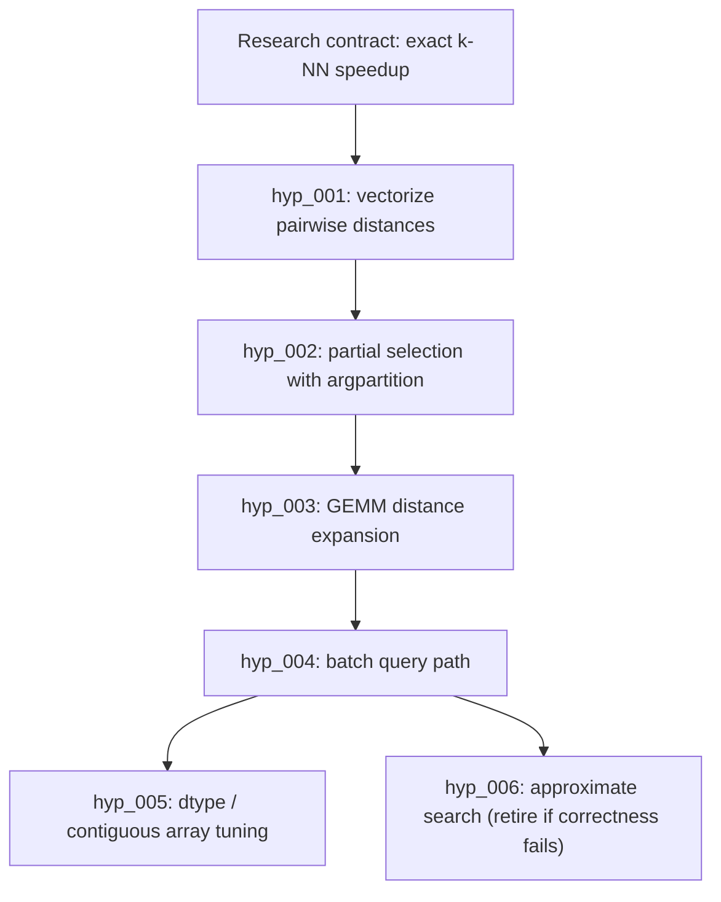

# Decentralized Auto-Research Showcase Blueprint

This note turns the Arbor review into a LoopX product path. Arbor's public
showcase is strong because it is concrete: a benchmark, a hypothesis tree,
dev/held-out scores, replayable events, and a final report. LoopX should aim
for the same clarity while keeping its own architecture: decentralized agents
over one shared control plane, not one leader Coordinator.

## What Arbor Demonstrates

Arbor's public materials show a repeatable autonomous research loop:

- a Research Contract that names objective, editable files, protected harness,
  metric, budget, and review mode;
- an Idea Tree where hypotheses record status, evidence, score, branch, retry
  status, grounding, and related-work audit;
- isolated executor worktrees for each experiment;
- a dev metric for iteration and a held-out metric for promotion;
- replay/report/export surfaces that make the run inspectable;
- a benchmark zoo, including `algotune_knn`, that is small enough for a user to
  watch end to end.

The Arbor `algotune_knn` demo is especially useful for LoopX because it is
public-safe, deterministic, CPU-only, and easy to explain: optimize a k-nearest
neighbors solver without editing the protected evaluator. Arbor reports an
example six-cycle improvement from roughly baseline speed to multi-x speedup,
with held-out validation.

## LoopX Adaptation

LoopX should reproduce the product value, not the topology.

| Arbor shape | LoopX version |
| --- | --- |
| Coordinator-mediated tree management. | Kernel-owned evidence graph plus per-agent frontier projections. |
| Executors receive ideas from Coordinator. | Agents claim todo-backed hypotheses through `quota should-run --agent-id`. |
| Idea Tree is the durable memory. | `research_hypothesis_v0` plus `research_evidence_event_v0` in the shared state graph. |
| Merge/prune decided by Coordinator. | Promotion policy, held-out evidence, operator gates, and todo lifecycle decide. |
| Dashboard shows one run. | Frontstage shows lanes, claims, evidence, promotion candidates, and blockers. |

The important product phrase is:

> LoopX lets multiple agents run an autonomous research search without a
> leader agent: hypotheses, evidence, retries, and promotion decisions live in
> the control plane, and each agent receives only the frontier it is allowed to
> attempt.

The executable product contract is split into three peer artifacts:

- `decentralized_auto_research_state_v0` defines the records and projections:
  contracts, todo-linked hypotheses, evidence events, frontier, evidence graph,
  and compact decision candidates.
- `auto_research_lane_contract_v1` defines decentralized lanes: curator,
  hypothesis proposer, executor, evaluator/promoter, and product narrator. Each
  lane contributes typed records through claims and gates; none owns the whole
  graph.
- `auto_research_role_state_machine_v0` defines the always-on digital employee
  role map, state vocabulary, transition evidence, gate handoff, and user
  takeover implications.
- [Auto-research product metrics](auto-research-product-metrics.md) defines
  which user-value metrics the product surface should show. It intentionally
  favors scored attempts, held-out lift, negative-evidence reuse, retry
  recovery, and human promotion decisions over implementation counters such as
  file count, smoke count, or dashboard row count.

## Showcase Candidate

**Title:** Decentralized Auto Research: k-NN Speedup

**Public task:** make a brute-force k-nearest-neighbors solver faster while
preserving exact output.

**Inputs:**

- editable: `solution.py`;
- protected: `eval.py`, `task.py`, generated dev/test data;
- metric: `speedup`, higher is better;
- dev command: `bash eval.sh dev`;
- held-out command: `bash eval.sh test`;
- starting result: baseline around `1.0x`;
- expected value metric: best held-out speedup, plus number of useful negative
  directions retained as future priors.

**LoopX surfaces to show:**

1. Research Contract card: objective, editable/protected scopes, metric, budget.
2. Decentralized frontier: which agent claimed which hypothesis, which ones are
   blocked or retired, and why.
3. Evidence timeline: attempts, dev score, held-out score, branch/ref, retry
   status.
4. Promotion decision: what got promoted, which alternatives were retired, and
   which evidence proves the boundary.
5. User gates and takeover controls: first-screen review, promotion approval,
   protected-scope stop, and real local-session launch must stay visible before
   agents can convert experimental evidence into public positioning or live
   process startup.
6. Product metrics: time to first scored attempt, useful hypotheses per active
   day, held-out lift, negative-evidence reuse, retry recovery, and human
   promotion decisions required.
7. Report: concise public-safe final summary with commands and artifacts.

## Candidate Hypothesis Graph

This graph is a fixture target, not a claim that LoopX has already achieved the
numbers. It gives the showcase a concrete shape to reproduce.



The user-facing point is not the exact technique. The point is that LoopX
retains the failed or bounded directions as explicit negative evidence, so the
next agent does not rediscover them from scratch.

## Minimal Reproduction Plan

New users should not have to learn the full command matrix first. The default
path previews a fresh demo-local goal surface and the visible Codex TUI lanes
that will work it:

```bash
loopx --format json auto-research demo-e2e \
  --agent-id auto-research-operator
```

When the preview is acceptable, launch the visible lanes:

```bash
loopx --format json auto-research demo-e2e \
  --agent-id auto-research-operator \
  --execute
```

This does not create a starter pack. The worker path now uses the built-in
lightweight metric kernel so the demo can prove the state loop without shipping
domain-specific problem code. The stable smoke metric still shows the product
shape: baseline `1.0`, dev evidence `[4.0, 4.8]`, holdout evidence
`[4.5, 5.2]`, two holdout improvements, and a clean public boundary.

The public line-count claim is intentionally narrower than the kernel. The
copyable recipe is one user command plus the four default auto-research role
specs; the reusable kernel still owns the runner, visible Codex TUI panes,
fixed wake prompt, pane-local A2A tick, todo/evidence/status protocol, and
public artifact routing.

```text
loopx auto-research start "<open question>" --execute
research-curator:research-curator:research_curator
hypothesis-proposer:hypothesis-proposer:hypothesis_proposer
research-executor:research-executor:research_executor
evaluator-promoter:evaluator-promoter:evaluator_promoter
```

That is the marketing-safe claim: a five-line declarative recipe can start
decentralized A2A communication because the generic LoopX kernel already knows
how to wake each pane and let each pane read its own quota/frontier.

The fixture-backed projection remains the read-only showcase state slice:

```bash
loopx --format json auto-research frontier \
  --fixture examples/fixtures/decentralized-auto-research-knn.public.json \
  --agent-id hypothesis-proposer
```

This renders `decentralized_research_frontier_v0`,
`research_evidence_graph_v0`, and compact decision candidates from a public
fixture. It does not launch experiments; it proves that the state shape can
present a per-agent frontier without one leader agent.

Public-safe evaluator outputs can also be converted into evidence records. A
minimal contract/eval pair is enough; the kernel does not require a shipped
domain pack:

```bash
loopx --format json auto-research evidence \
  --contract research-contract.public.json \
  --eval-result dev-result.public.json \
  --eval-result holdout-result.public.json \
  --hypothesis-id hyp_state_a2a_round \
  --todo-id todo_auto_research_demo_001 \
  --agent-id research-executor \
  --claimed-by research-executor \
  --mechanism-family state_a2a_iteration \
  --hypothesis "Use a small state-mediated handoff loop to improve the shared candidate." \
  --branch-ref codex/auto-research-evidence-writer
```

The command emits an `auto_research_evidence_packet_v0` containing one
`research_hypothesis_v0` and split-aware `research_evidence_event_v0` records.
It preserves `needs_retry`, negative evidence, protected-scope clean flags, and
branch/artifact refs while keeping raw logs, local paths, and private artifacts
out of the public payload.

Append the packet into LoopX's existing rollout event log when the evidence is
ready to become durable source state:

```bash
loopx --format json auto-research append-evidence \
  --packet auto-research-evidence-packet.public.json
```

The append step writes one `research_hypothesis` rollout event and one
`research_evidence` event per split. It skips existing event ids on retry, which
keeps heartbeat-driven lanes replayable.

After rollout evidence exists, the frontier read path exposes the compact
`research_evidence_graph_v0` plus promotion, retirement, and retry candidates.
That graph is the only durable research read model in the kernel; product
surfaces may consume it later, but they are not part of the auto-research
control loop.

```bash
loopx --format json auto-research frontier \
  --goal-id loopx-auto-research-demo \
  --agent-id hypothesis-proposer
```

For fixture rehearsals, use `--fixture` instead of `--goal-id`.

## Local Demo Supervisor

The short-term multi-agent demo should be inspectable before it launches
anything. The supervisor command therefore starts as a dry-run packet: it plans
a visible tmux layout for multiple Codex CLI lanes, but it does not start tmux,
launch Codex, read session files, write LoopX state, or spend quota.

```bash
loopx --format json auto-research demo-supervisor \
  --goal-id loopx-auto-research-demo
```

The packet has two important product properties:

- the supervisor is a host shell layout, not a leader agent;
- every lane receives its own `quota should-run` and `auto-research frontier`
  command, so work routing still comes from LoopX state, todo claims, gates,
  and evidence graph projections.
- every lane prints `auto_research_role_profile_v0` before quota/frontier/
  bootstrap, so the visible worker knows its role, skill section, write scope,
  protected scope, and stop conditions before it starts.
- the default "one-click" path is a dry-run rehearsal script: it checks the
  required environment variables and prints the tmux start, attach, and stop
  commands without starting tmux, launching Codex, writing LoopX state, or
  spending quota.
- the packet names user takeover controls up front: inspect the rehearsal
  output, paste the real start script only when ready, attach to tmux before
  accepting any Codex prompt, and use the stop command or terminal interrupt to
  take over.

Operators can pass explicit lanes when rehearsing a real local demo:

```bash
loopx --format json auto-research demo-supervisor \
  --goal-id loopx-auto-research-demo \
  --agent research-curator:research-curator:research_curator \
  --agent hypothesis-proposer:hypothesis-proposer:hypothesis_proposer \
  --agent research-executor:research-executor:research_executor \
  --agent evaluator-promoter:evaluator-promoter:evaluator_promoter
```

The third segment is optional for compatibility; when omitted, LoopX infers the
role from the lane name or from the default role order. The v0 default uses
four registered research-role agents: research curator, hypothesis proposer,
research executor, and evaluator/promoter. The explicit `--agent` form remains
the escape hatch for rehearsing a custom four-role layout.

When the dry-run packet is acceptable, the same command can launch visible
local Codex CLI TUIs. This is intentionally opt-in:

```bash
loopx auto-research demo-supervisor \
  --goal-id loopx-auto-research-demo \
  --agent research-curator:research-curator:research_curator \
  --agent hypothesis-proposer:hypothesis-proposer:hypothesis_proposer \
  --agent research-executor:research-executor:research_executor \
  --agent evaluator-promoter:evaluator-promoter:evaluator_promoter \
  --execute
```

`--execute` launches a tmux session. Use `--launcher tmux` to make the choice
explicit. With tmux, `--attach` immediately joins the session and
`--replace-existing` replaces a stale session with the same name. Takeover is
the normal pane interrupt, shell prompt, or session kill command.

The executed launcher still is not a leader. Each lane window first runs its
own role profile, then runs `quota should-run`, then renders its own
`auto-research frontier`, then prints the `codex-cli-bootstrap-message`, and
only then starts `codex` with that visible bootstrap prompt. The launcher
itself does not write LoopX state or spend LoopX quota; any writeback must
happen through the visible Codex lane's normal LoopX todo/evidence commands.
All lanes share the same LoopX goal surface: registry, runtime root, frontier,
todo projection, and evidence graph. Workspace isolation is not applied to
every pane by default; only mutating research-executor attempts need a claimed
git worktree or equivalent execution boundary.

The live worker path stays separate from the supervisor. The supervisor makes
lanes visible; `worker-loop` is the small state-mediated executor that polls
quota/frontier/todos and writes evidence through LoopX:

```bash
loopx --format json auto-research worker-loop \
  --goal-id loopx-auto-research-demo \
  --agent-id research-curator \
  --agent-id hypothesis-proposer \
  --agent-id research-executor \
  --agent-id evaluator-promoter \
  --max-rounds 4
```

When the dry-run selects safe runnable work, add `--execute` and
`--complete-selected-todo`. This keeps auto-research as a decentralized
state loop instead of growing a demo-specific leader workflow.

### Visible Operator Rehearsal Path

The first user-facing demo step is a single inspection command, not a hidden
launcher:

```bash
loopx --format json auto-research demo-supervisor \
  --goal-id loopx-auto-research-demo
```

The user should see four concrete things in the packet:

- `mode: dry_run`, plus a boundary block showing `starts_tmux`,
  `runs_codex`, `writes_loopx_state`, and `spends_loopx_quota` are all false;
- one pane plan per default digital worker lane, with that lane's own
  `auto_research_role_profile_v0`, `quota should-run`, `auto-research
  frontier`, and `codex-cli-bootstrap-message` commands;
- a shared goal-surface contract showing that all panes use the same LoopX
  registry/runtime/frontier/evidence graph, while mutation isolation is reserved
  for research-executor attempts;
- a `start_script` array that can be copied into the user's shell only after
  the user sets `LOOPX_PROJECT`, `LOOPX_REGISTRY`, and
  `LOOPX_RUNTIME_ROOT`;
- a `lane_timeline` for each lane, making the visible sequence explicit:
  role profile, quota guard, frontier projection, bootstrap prompt, then
  visible Codex TUI;
- explicit takeover controls: `tmux attach -t loopx-auto-research` to inspect
  every lane before accepting Codex prompts, and
  `tmux kill-session -t loopx-auto-research` to stop the rehearsal.

After `--execute`, the packet includes `launch_result` with the selected
launcher, started lanes, attach/stop command, and takeover instructions. For a
first live demo, prefer `--execute --attach` when tmux is installed.

The safe demo acceptance bar is that the user can inspect the plan, attach to
the visible tmux session before any Codex prompt is accepted, interrupt any
lane manually, and confirm that each lane still routes through LoopX quota,
todo claims, frontier projection, and normal evidence writeback. The
supervisor never becomes a leader agent; it is only a shell layout that makes
the decentralized workers visible and interruptible.

The launcher checklist is deliberately about observable behavior, not private
demo notes: each lane must show quota before frontier/bootstrap, attach and
stop controls must be visible, and dry-run boundary fields must show no tmux,
Codex, state, quota, credential, or session side effects.

The generated dry-run shell plan uses environment placeholders such as
`LOOPX_PROJECT`, `LOOPX_REGISTRY`, and `LOOPX_RUNTIME_ROOT` instead of embedding
local absolute paths. The executed path resolves those values locally and
injects them into the launched visible terminals without recording the local
paths in the public packet. Same-session prompt injection remains blocked until
visible-attach and idle evidence pass.

Next reproduction steps:

1. Keep `research_contract_v0`, `research_hypothesis_v0`, and
   `research_evidence_event_v0` as the public-safe record boundary.
2. Read `research_hypothesis` and `research_evidence` rollout events back into
   the evidence graph instead of depending on fixture-only evidence.
3. Keep one local smoke that proves:
   - protected files are not editable;
   - each hypothesis is todo-linked;
   - each evidence event names split and metric;
   - no leader agent owns the graph;
   - held-out promotion is required.
4. Build the showcase page from fixture evidence, then replace fixture numbers
   with a real run when available.

## Kernel/Capability Improvements

P0 candidates:

- **Research hypothesis ledger in core state.** Promote the existing
  `hypothesis_ledger_v0` idea from the ML domain pack into a generic,
  todo-linked research hypothesis shape.
- **Per-agent research frontier projection.** Extend status/quota projection so
  a current agent sees only claim-compatible hypotheses and promotion
  candidates, while other-agent claims remain visible context.
- **Retry semantics.** Add `needs_retry` as a reusable outcome for
  incomplete/unscored research attempts, preserving branch/evidence refs.
- **Split-aware evidence.** Make dev/held-out split labels first-class in
  evidence events and evidence graph projections.

P1 candidates:

- **Grounded ideation / novelty audit separation.** Add two explicit source
  lanes so research input and novelty checking cannot contaminate each other.
- **Benchmark-zoo-style pack.** Add a `loopx research scaffold` path that turns
  a small optimization task into a protected benchmark pack.
- **Replay/export surface.** Convert evidence graph events into a static HTML
  replay for public-safe showcases.

## Design Guardrails

- The control plane may select a frontier; it must not become a hidden leader.
- Agents may propose and execute hypotheses within their claim/scope.
- Promotion requires evidence and gate policy, not a persuasive chat summary.
- A user can inspect every branch of the research graph from source refs.
- Public showcase pages must distinguish "fixture target" from "achieved run".
- Private docs, non-public links, raw logs, credentials, local paths, and raw
  benchmark traces stay out of public artifacts.

## Suggested Public Narrative

LoopX does for autonomous research what it already does for long-running
engineering agents: it turns a noisy loop into a managed control plane. The
novel part is that research hypotheses become first-class work items with
claims, evidence, retry state, and promotion gates. The result can look like an
Arbor-style hypothesis tree to the user, while the implementation remains
LoopX-native and decentralized.
