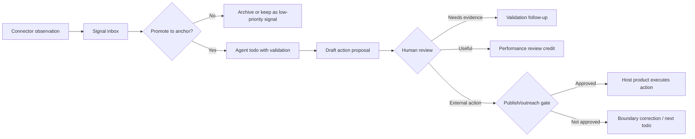

# Office Operations Connector Showcase

Status: product showcase design.

This note turns the office-operations connector idea into a public-safe LoopX
showcase. It is not a plan to build a social crawler, a publishing bot, or a
domain-specific office suite. The goal is narrower: prove that LoopX can manage
an always-running agent that receives external work signals, selects useful
anchors, drafts bounded next actions, and learns from human review without
crossing source, privacy, or publish boundaries.

## Product Claim

Many office workflows do not fail because there is no agent executor. They fail
because useful signals arrive across too many surfaces and no one can tell which
signals deserve follow-up.

LoopX should make this loop manageable:

```text
connector observation
  -> signal inbox
  -> selected anchor
  -> draft action or work proposal
  -> human review / scoring
  -> gated external action
  -> performance review and next improvement
```

The control-plane value is that every step has a source label, a boundary, an
owner decision, and evidence. The agent can keep working on safe preparation
while publishing, outreach, private-source reads, or production actions stay
behind explicit gates.

## Showcase User Story

A maintainer or operator wants to keep a long-running work loop moving while
they are not watching every channel. Example surfaces include public web
signals, issue or PR metadata, local chat/search tools, notes, tasks, and docs.

The operator does not want raw source dumps. They want a short review surface:

- which new signals appeared;
- which signals are worth turning into anchors;
- what the agent proposes to do next;
- why the proposal is backed by evidence;
- what needs human judgment before external action;
- whether the work was useful enough to continue.

The first showcase can use synthetic or consented inputs. Real connectors
should come later and keep raw retrieval outside public LoopX state.

## State Model

The showcase should reuse the generic LoopX substrate instead of adding a
new office-specific core object.

| Layer | Public-safe object | Purpose |
| --- | --- | --- |
| Source | `connector_observation_v0` | Compact facts from a browser, chat, issue, doc, or task connector; no raw private material. |
| Inbox | `signal_v0` | A work signal with source status, freshness, suggested effect, and boundary label. |
| Selection | `anchor_v0` | A small number of signals chosen as high-value proof paths. |
| Work | `todo_lifecycle_v0` | Concrete user/agent todo with validation and stop condition. |
| Review | `review_event_v0` / `feedback_signal_v0` | Useful/not useful, needs evidence, off-scope, risky, promote, or archive. |
| Evidence | `artifact_handle_v0` / `validation_surface_map_v0` | Observable handle and proof surface for the proposed action. |
| Boundary | `publish_boundary_v0` | External posting, outreach, production action, or private-source expansion gate. |
| Value | `performance_review_v0` | Output, quality, cost, attention cost, and next improvement. |

## Minimal Card Shape

Each signal or work product should become a card that a human can review fast.

Required fields:

- `title`: plain-language work signal or proposal;
- `source_status`: public, private-needs-review, synthetic, internal, or
  forbidden;
- `freshness`: when the signal was observed or last validated;
- `suggested_effect`: ignore, ask user, create todo, update evidence, create
  anchor, or schedule review;
- `evidence_pointer`: compact handle, not raw source text;
- `proposed_next_action`: bounded action the agent can take;
- `human_gate`: what cannot happen without user approval;
- `review_choices`: useful, not useful, needs evidence, off-scope, risky,
  promote to anchor, or archive.

Non-fields:

- raw chat messages;
- raw browsing traces;
- private docs;
- platform credentials;
- unpublished draft bodies;
- auto-publish commands.

## Example Flow



## Metrics

The showcase should not optimize for raw article count, message count, or
generated drafts. Better first metrics are:

- accepted signals: how many observed signals became useful anchors;
- qualified conversations: how many follow-ups created a real user or partner
  conversation;
- review quality: useful/not useful/needs evidence/off-scope ratios;
- evidence strength: how often proposals had enough public-safe proof;
- boundary correctness: how often the agent stopped before private or external
  action gates;
- attention cost: how many human decisions were needed per useful outcome;
- cost per useful signal: quota or token spend divided by accepted signals.

These metrics fit the broader Loop Agent value model:

```text
value ~= useful_output_quality / (compute_cost + user_attention_cost)
```

## Connector Boundary

Connectors are information sources, not authority sources. A connector can
observe, summarize, and point to a source handle. It should not silently turn a
private feed into public evidence or an external action.

| Connector class | Default action | Gate before |
| --- | --- | --- |
| Public web metadata | create compact signal | quoting bodies, claiming trend, outreach |
| Issue / PR metadata | create compact issue signal | patch generation, branch write, publication |
| Local chat search | project private-source gate | message-body ingestion, quoting, public docs |
| Notes / docs | source-status preview | copying private text, publishing excerpts |
| Task systems | compact task handle | changing external status or assigning owners |

The first public showcase should use synthetic or consented data and make the
gate labels visible. Real connector adapters should be implemented behind
capability gates and terms-of-use checks.

## PoC Acceptance

The showcase is useful when a maintainer can:

1. See at least five compact signals from synthetic or consented office
   surfaces.
2. Promote one signal into an anchor and leave the rest as signals, not todos.
3. Generate one bounded agent todo with validation and stop condition.
4. Review the agent output with at least four structured choices.
5. See the review update a draft feedback signal or performance-review note.
6. Confirm that external posting, outreach, production action, and private
   source expansion stay blocked without a human gate.

## Relationship To Other LoopX Surfaces

- The [intelligent management surface](intelligent-management-surface.md)
  renders the signal inbox, anchors, review feed, and performance-review
  summary.
- The [scenario capability gap map](scenario-capability-gap-map.md) ranks the
  reusable substrate that office operations shares with issue-fix, creator
  operations, benchmarks, and host integrations.
- The [content ops surface](../reference/protocols/content-ops-surface-v0.md)
  is a narrower creator/self-media state contract. Office operations should use
  the same source-status, feedback, and publish-gate discipline but avoid
  assuming that every signal becomes content.
- A future host product or partner connector may own real browser, chat, issue,
  document, or task execution. LoopX owns the compact control projection and
  reviewable writeback path.

## Non-Goals

- Do not build a generic crawler into LoopX core.
- Do not auto-publish, auto-message, or auto-outreach.
- Do not treat private chat or document content as public evidence.
- Do not optimize for volume-only metrics.
- Do not let every signal become an agent todo.
- Do not require a custom frontend before the compact state surface proves
  useful in status and review packets.
