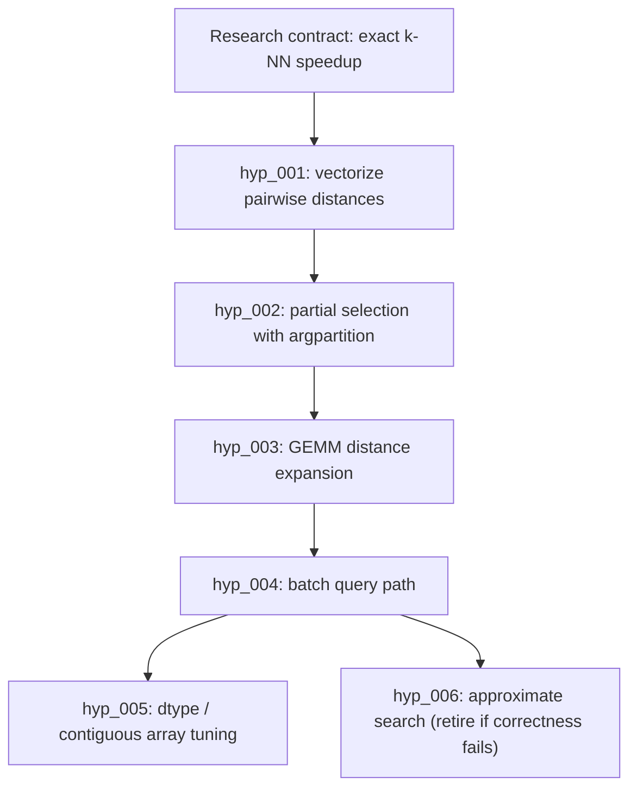

# 去中心化 Auto-Research Showcase 蓝图


本说明把 Arbor 评审变成 LoopX 产品路径。Arbor 的公开 showcase 很强，因为它具体：一个 benchmark、一棵假设树、dev/留出分数、可重放事件与一份最终报告。LoopX 应当追求同样的清晰度，同时保持自己的架构：一个共享控制面之上的去中心化 agent，而不是一个领导者 Coordinator。

## Arbor 演示了什么

Arbor 的公开资料展示了一个可重复的自主研究 loop：

- 一份 Research Contract，命名目标、可编辑文件、受保护 harness、指标、budget 与评审模式；
- 一棵 Idea Tree，假设记录状态、evidence、分数、分支、重试状态、grounding 与相关工作审计；
- 每次实验的隔离 executor worktree；
- 用于迭代的 dev 指标与用于晋升的留出指标；
- 让 run 可检查的重放/报告/导出 surface；
- 一个 benchmark 动物园，包括小到用户可以端到端观看的 `algotune_knn`。

Arbor 的 `algotune_knn` 演示对 LoopX 尤其有用，因为它 public-safe、确定性、纯 CPU 且容易解释：在不编辑受保护评估器的情况下优化 k 近邻求解器。Arbor 报告了一个示例六周期改进：从大约基线速度到多倍加速，并带留出验证。

## LoopX 适配

LoopX 应复现产品价值，而不是拓扑。

| Arbor 形态 | LoopX 版本 |
| --- | --- |
| Coordinator 调解的树管理。 | Kernel 拥有的 evidence graph 加每 agent frontier 投影。 |
| Executors 从 Coordinator 接收想法。 | Agent 通过 `quota should-run --agent-id` 认领 todo 支撑的假设。 |
| Idea Tree 是持久记忆。 | 共享状态图里的 `research_hypothesis_v0` 加 `research_evidence_event_v0`。 |
| Coordinator 决定合并/剪枝。 | 晋升策略、留出 evidence、operator gates 与 todo 生命周期决定。 |
| Dashboard 显示一个 run。 | Frontstage 显示泳道、claims、evidence、晋升候选与 blockers。 |

重要产品表述是：

> LoopX 让多个 agent 在没有 leader agent 的情况下运行自主研究搜索：假设、evidence、重试与晋升决策留在控制面，每个 agent 只收到它被允许尝试的 frontier。

可执行产品契约拆成三个 peer artifacts：

- `decentralized_auto_research_state_v0` 定义记录与投影：契约、todo 链接假设、evidence 事件、frontier、evidence graph 与紧凑决策候选。
- `auto_research_lane_contract_v1` 定义去中心化泳道：curator、hypothesis proposer、executor、evaluator/promoter 与 product narrator。每个泳道通过 claims 与 gates 贡献类型化记录；没有谁拥有整个图。
- `auto_research_role_state_machine_v0` 定义常开数字员工角色映射、状态词表、转变 evidence、gate handoff 与用户接管含义。
- [Auto-research 产品指标](auto-research-product-metrics.md) 定义产品 surface 应显示哪些用户价值指标。它刻意偏好评分尝试、留出提升、负向 evidence 复用、重试恢复与人类晋升决策，而不是文件数、smoke 数或 dashboard 行数等实现计数器。

## Showcase 候选

**标题：** 去中心化 Auto Research：k-NN 加速

**公开任务：** 在不改变精确输出的前提下加快暴力 k 近邻求解器。

**输入：**

- 可编辑：`solution.py`；
- 受保护：`eval.py`、`task.py`、生成的 dev/test 数据；
- 指标：`speedup`，越高越好；
- dev 命令：`bash eval.sh dev`；
- 留出命令：`bash eval.sh test`；
- 起始结果：基线约 `1.0x`；
- 期望价值指标：最佳留出加速，加上作为未来先验保留的有用负向方向数量。

**要展示的 LoopX surface：**

1. Research Contract 卡：目标、可编辑/受保护 scope、指标、budget。
2. 去中心化 frontier：哪个 agent 认领了哪个假设，哪些被阻塞或退役，为什么。
3. Evidence 时间线：尝试、dev 分数、留出分数、branch/ref、重试状态。
4. 晋升决策：晋升了什么、哪些替代品被退役、哪些 evidence 证明边界。
5. User gates 与接管控件：在 agent 能把实验 evidence 变成公开定位或实时进程启动之前，首屏评审、晋升批准、受保护 scope 停止与真实本地 session 启动必须保持可见。
6. 产品指标：首次评分尝试时间、每个活跃日有用假设、留出提升、负向 evidence 复用、重试恢复与所需人类晋升决策。
7. 报告：带命令与 artifacts 的简明 public-safe 最终摘要。

## 候选假设图

该图是夹具目标，不是 LoopX 已经达成这些数字的声明。它给 showcase 一个可以复现的具体形态。



用户面向的重点不是具体技术。重点是 LoopX 把失败或有界的方向作为显式负向 evidence 保留，让下一个 agent 不会从头再发现它们。

## 最小复现计划

新用户不应先学完整命令矩阵。默认路径预览一个新鲜的 demo 本地 goal surface 与将要处理它的可见 Codex TUI 泳道：

```bash
loopx --format json auto-research demo-e2e \
  --agent-id auto-research-operator
```

预览可接受后，启动可见泳道：

```bash
loopx --format json auto-research demo-e2e \
  --agent-id auto-research-operator \
  --execute
```

这启动产品路径：可见 Codex TUI 角色通过 LoopX 状态读取自己的 quota/frontier，然后从窗格内部编写 public-safe 研究 evidence 或后继 todos。窗格内 tick 是 guard/frontier 读取；它不杜撰研究契约、假设、dev 分数或留出分数。

公开的"行数"声明刻意比 kernel 窄。可复制配方是一个用户命令加四个默认 auto-research 角色规格；可复用 kernel 仍拥有 runner、可见 Codex TUI 窗格、固定唤醒 prompt、窗格内 A2A tick、todo/evidence/status 协议与公开 artifact 路由。

```text
loopx auto-research start "<open question>" --execute
research-curator:research-curator:research_curator
hypothesis-proposer:hypothesis-proposer:hypothesis_proposer
research-executor:research-executor:research_executor
evaluator-promoter:evaluator-promoter:evaluator_promoter
```

这就是 marketing-safe 声明：一个五行声明式配方可以启动去中心化 A2A 通信，因为通用 LoopX kernel 已经知道如何唤醒每个窗格并让每个窗格读取自己的 quota/frontier。

Fixture 支撑的投影保持为只读 showcase 状态切片：

```bash
loopx --format json auto-research frontier \
  --fixture examples/fixtures/decentralized-auto-research-knn.public.json \
  --agent-id hypothesis-proposer
```

这从公开夹具渲染 `decentralized_research_frontier_v0`、`research_evidence_graph_v0` 与紧凑决策候选。它不启动实验，也不声称提升；它证明状态形态可以在没有 leader agent 的情况下呈现每 agent frontier。

Public-safe 评估器输出也可以转换成 evidence 记录。一个最小契约/评估对足够；kernel 不要求随附领域包：

```bash
loopx --format json auto-research evidence \
  --contract research-contract.public.json \
  --eval-result dev-result.public.json \
  --eval-result holdout-result.public.json \
  --hypothesis-id hyp_state_a2a_round \
  --todo-id todo_auto_research_demo_001 \
  --agent-id research-executor \
  --claimed-by research-executor \
  --mechanism-family state_a2a_iteration \
  --hypothesis "Use a small state-mediated handoff loop to improve the shared candidate." \
  --branch-ref codex/auto-research-evidence-writer
```

该命令发出一个 `auto_research_evidence_packet_v0`，包含一个 `research_hypothesis_v0` 与 split 感知的 `research_evidence_event_v0` 记录。它保留 `needs_retry`、负向 evidence、受保护 scope 干净标志与 branch/artifact 引用，同时把原始日志、本地路径与私有 artifacts 排除在公开载荷外。

当 evidence 准备好成为持久来源状态时，把 packet 追加进 LoopX 既有 rollout 事件日志：

```bash
loopx --format json auto-research append-evidence \
  --packet auto-research-evidence-packet.public.json
```

追加步骤为每个 split 写入一个 `research_hypothesis` rollout 事件与一个 `research_evidence` 事件。重试时跳过已存在的 event id，这保持 heartbeat 驱动的泳道可重放。

Rollout evidence 存在后，frontier 读取路径暴露紧凑 `research_evidence_graph_v0` 加晋升、退役与重试候选。该图是 kernel 中唯一持久研究读模型；产品 surface 可以之后消费它，但它们不是 auto-research 控制 loop 的一部分。

```bash
loopx --format json auto-research frontier \
  --goal-id loopx-auto-research-demo \
  --agent-id hypothesis-proposer
```

夹具彩排用 `--fixture` 代替 `--goal-id`。

## 本地 Demo Supervisor

短期多 agent 演示在启动任何东西之前应当可检查。因此 supervisor 命令以 dry-run packet 开始：它为多个 Codex CLI 泳道规划可见 tmux 布局，但不启动 tmux、不启动 Codex、不读 session 文件、不写 LoopX 状态，也不 spend quota。

```bash
loopx --format json auto-research demo-supervisor \
  --goal-id loopx-auto-research-demo
```

该 packet 有两个重要产品属性：

- supervisor 是 host shell 布局，不是 leader agent；
- 每个泳道收到自己的 `quota should-run` 与 `auto-research frontier` 命令，所以工作路由仍来自 LoopX 状态、todo claims、gates 与 evidence graph 投影。
- 每个泳道在 quota/frontier/bootstrap 前打印 `auto_research_role_profile_v0`，让可见 worker 在开始前知道其角色、skill 区块、写范围、受保护 scope 与停止条件。
- 默认"一键"路径是 dry-run 彩排脚本：它检查必需环境变量并打印 tmux 启动、attach 与停止命令，而不启动 tmux、不启动 Codex、不写 LoopX 状态、不 spend quota。
- Packet 把用户接管控件放在最前：检查彩排输出、只在准备好时粘贴真实启动脚本、在接受任何 Codex prompt 前 attach 到 tmux，并用停止命令或终端中断接管。

Operator 彩排真实本地 demo 时可以传显式泳道：

```bash
loopx --format json auto-research demo-supervisor \
  --goal-id loopx-auto-research-demo \
  --agent research-curator:research-curator:research_curator \
  --agent hypothesis-proposer:hypothesis-proposer:hypothesis_proposer \
  --agent research-executor:research-executor:research_executor \
  --agent evaluator-promoter:evaluator-promoter:evaluator_promoter
```

第三段为兼容性可选；省略时，LoopX 从泳道名或默认角色顺序推断角色。v0 默认使用四个注册研究角色 agent：research curator、hypothesis proposer、research executor 与 evaluator/promoter。显式 `--agent` 形式保持为彩排自定义四角色布局的逃生舱。

当 dry-run packet 可接受时，同一命令可以启动可见本地 Codex CLI TUI。这刻意 opt-in：

```bash
loopx auto-research demo-supervisor \
  --goal-id loopx-auto-research-demo \
  --agent research-curator:research-curator:research_curator \
  --agent hypothesis-proposer:hypothesis-proposer:hypothesis_proposer \
  --agent research-executor:research-executor:research_executor \
  --agent evaluator-promoter:evaluator-promoter:evaluator_promoter \
  --execute
```

`--execute` 启动 tmux session。用 `--launcher tmux` 使选择显式。用 tmux 时，`--attach` 立即加入 session，`--replace-existing` 替换同名过期 session。接管是正常的窗格中断、shell 提示或 session kill 命令。

被执行后的启动器仍然不是 leader。每个泳道窗口先运行自己的角色档案，然后运行 `quota should-run`，再渲染自己的 `auto-research frontier`，接着打印 `codex-cli-bootstrap-message`，然后才用那个可见 bootstrap prompt 启动 `codex`。启动器本身不写 LoopX 状态、不 spend LoopX quota；任何写回必须通过可见 Codex 泳道的正常 LoopX todo/evidence 命令发生。所有泳道共享同一个 LoopX goal surface：registry、runtime root、frontier、todo 投影与 evidence graph。Workspace 隔离默认不应用到每个窗格；只有会变更的 research-executor 尝试需要认领的 git worktree 或等价执行边界。

实时 worker 路径与 supervisor 分开。Supervisor 让泳道可见；`worker-loop` 是小型状态中介执行器，轮询 quota/frontier/todos 并通过 LoopX 写 evidence：

```bash
loopx --format json auto-research worker-loop \
  --goal-id loopx-auto-research-demo \
  --agent-id research-curator \
  --agent-id hypothesis-proposer \
  --agent-id research-executor \
  --agent-id evaluator-promoter \
  --max-rounds 4
```

当 dry-run 选中安全可运行工作时，加 `--execute` 与 `--complete-selected-todo`。这让 auto-research 保持为去中心化状态 loop，而不是长成一个 demo 特定的 leader 工作流。

### 可见 Operator 彩排路径

第一个用户面向 demo 步骤是单条检查命令，而不是隐藏启动器：

```bash
loopx --format json auto-research demo-supervisor \
  --goal-id loopx-auto-research-demo
```

用户应看到四个具体事情：

- `mode: dry_run`，加一个显示 `starts_tmux`、`runs_codex`、`writes_loopx_state` 与 `spends_loopx_quota` 全为 false 的边界块；
- 每个默认数字 worker 泳道一个窗格计划，带该泳道自己的 `auto_research_role_profile_v0`、`quota should-run`、`auto-research frontier` 与 `codex-cli-bootstrap-message` 命令；
- 一个共享 goal-surface 契约，显示所有窗格使用同一 LoopX registry/runtime/frontier/evidence graph，而变更隔离只保留给 research-executor 尝试；
- 一个 `start_script` 数组，只在用户设置 `LOOPX_PROJECT`、`LOOPX_REGISTRY` 与 `LOOPX_RUNTIME_ROOT` 后才可以复制进用户 shell；
- 每个泳道一条 `lane_timeline`，让可见序列显式：角色档案、quota guard、frontier 投影、bootstrap prompt，然后可见 Codex TUI；
- 显式接管控件：`tmux attach -t loopx-auto-research` 用于接受 Codex prompt 之前检查每个泳道，`tmux kill-session -t loopx-auto-research` 用于停止彩排。

`--execute` 之后，packet 包含 `launch_result`，带选中的启动器、已启动泳道、attach/stop 命令与接管说明。首次实时 demo 在 tmux 已安装时优选 `--execute --attach`。

安全 demo 验收标准是：用户可以检查计划、在任何 Codex prompt 被接受前 attach 到可见 tmux session、手动中断任何泳道，并确认每个泳道仍通过 LoopX quota、todo claims、frontier 投影与正常 evidence 写回路由。Supervisor 从不变为 leader agent；它只是让去中心化 worker 可见且可中断的外壳布局。

启动器检查清单刻意关于可观察行为，而不是私有 demo 说明：每个泳道必须在 frontier/bootstrap 前显示 quota，attach 与停止控件必须可见，dry-run 边界字段必须显示无 tmux、Codex、状态、quota、凭据或 session 副作用。

生成的 dry-run shell 计划使用 `LOOPX_PROJECT`、`LOOPX_REGISTRY` 与 `LOOPX_RUNTIME_ROOT` 等环境占位符，而不是嵌入本地绝对路径。被执行路径在本地解析这些值并注入启动的可见终端，而不在公开 packet 中记录本地路径。Same-session prompt 注入在 visible-attach 与 idle evidence 通过前保持阻塞。

下一步复现步骤：

1. 保持 `research_contract_v0`、`research_hypothesis_v0` 与 `research_evidence_event_v0` 作为 public-safe 记录边界。
2. 把 `research_hypothesis` 与 `research_evidence` rollout 事件读回 evidence graph，而不是依赖仅夹具 evidence。
3. 保持一个本地 smoke 证明：
   - 受保护文件不可编辑；
   - 每个假设都 todo 链接；
   - 每个 evidence 事件命名 split 与指标；
   - 没有 leader agent 拥有图；
   - 需要留出晋升。
4. 从夹具 evidence 构建 showcase 页面，然后在可用时把夹具数字换成真实 run。

## Kernel/Capability 改进

P0 候选：

- **核心状态中的研究假设 ledger。** 把 ML 领域包中现有的 `hypothesis_ledger_v0` 想法提升为通用、todo 链接的研究假设形态。
- **每 agent 研究 frontier 投影。** 扩展 status/quota 投影，使当前 agent 只看到 claim 兼容的假设与晋升候选，而其他 agent 的 claims 保持可见上下文。
- **重试语义。** 添加 `needs_retry`，作为未完成/未评分研究尝试的可复用结果，保留 branch/evidence 引用。
- **Split 感知 evidence。** 让 dev/留出 split 标签在 evidence 事件与 evidence graph 投影中一等化。

P1 候选：

- **Grounded ideation / 新颖性审计分离。** 添加两个显式来源泳道，使研究输入与新颖性检查不能相互污染。
- **Benchmark 动物园风格 pack。** 添加 `loopx research scaffold` 路径，把小优化任务变成受保护 benchmark pack。
- **重放/导出 surface。** 把 evidence graph 事件转成静态 HTML 重放，供 public-safe showcase 使用。

## 设计护栏

- 控制面可以选择 frontier；它不得变成隐藏 leader。
- Agent 可以在其 claim/scope 内提出并执行假设。
- 晋升要求 evidence 与 gate 策略，而不是有说服力的聊天摘要。
- 用户可以从来源引用检查研究图的每个分支。
- 公开 showcase 页面必须区分"夹具目标"与"已达成 run"。
- 私有文档、非公开链接、原始日志、凭据、本地路径与原始 benchmark 轨迹远离公开 artifacts。

## 建议的公开叙事

LoopX 对自主研究做的事与它对长程工程 agent 做的事相同：把嘈杂 loop 变成受管理控制面。新颖之处在于研究假设变成一等工作项，带 claims、evidence、重试状态与晋升 gates。用户看到的可以是 Arbor 风格假设树，而实现保持 LoopX 原生且去中心化。
