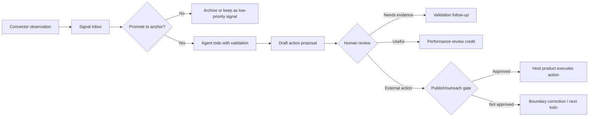

# Office Operations 连接器 Showcase


状态：产品 showcase 设计。

本说明把 office-operations 连接器想法变成 public-safe LoopX showcase。它不是构建社交爬虫、发布 bot 或领域特定办公套件的计划。目标更窄：证明 LoopX 能管理一个常开的 agent，接收外部工作信号、选择有用锚点、起草有边界的下一个动作，并在不越过来源、隐私或发布边界的情况下从人类评审中学习。

## 产品声明

许多办公工作流失败不是因为缺少 agent 执行器。它们失败是因为有用信号从太多 surface 到达，没人说得清哪些信号值得跟进。

LoopX 应让这个 loop 可管理：

```text
connector observation
  -> signal inbox
  -> selected anchor
  -> draft action or work proposal
  -> human review / scoring
  -> gated external action
  -> performance review and next improvement
```

控制面价值是每一步都有来源标签、边界、owner 决策与 evidence。Agent 可以继续做安全准备工作，而发布、外联、私有来源读取或生产动作保持显式 gates 之后。

## Showcase 用户故事

Maintainer 或 operator 想要在不盯每个 channel 的情况下保持长程工作 loop 前进。示例 surface 包括公开 web 信号、issue 或 PR 元数据、本地聊天/搜索工具、笔记、任务与文档。

Operator 不想要原始来源转储。他们想要一个简短评审 surface：

- 出现了哪些新信号；
- 哪些信号值得变成锚点；
- agent 提议接下来做什么；
- 为什么提案有 evidence 支撑；
- 外部动作前需要什么人类判断；
- 工作是否足够有用到可以继续。

第一个 showcase 可以使用合成或经同意的输入。真实连接器应稍后出现，并让原始检索留在公开 LoopX 状态之外。

## 状态模型

Showcase 应复用通用 LoopX 底板，而不是添加新的办公特定核心对象。

| 层 | Public-safe 对象 | 用途 |
| --- | --- | --- |
| 来源 | `connector_observation_v0` | 来自浏览器、聊天、issue、文档或任务连接器的紧凑事实；无原始私有资料。 |
| 收件箱 | `signal_v0` | 带来源状态、新鲜度、建议效果与边界标签的工作信号。 |
| 选择 | `anchor_v0` | 被选为高价值证明路径的少量信号。 |
| 工作 | `todo_lifecycle_v0` | 带验证与停止条件的具体 user/agent todo。 |
| 评审 | `review_event_v0` / `feedback_signal_v0` | 有用/没用、需要 evidence、越界、有风险、晋升或归档。 |
| Evidence | `artifact_handle_v0` / `validation_surface_map_v0` | 提议动作的可观察 handle 与证明 surface。 |
| 边界 | `publish_boundary_v0` | 外部发布、外联、生产动作或私有来源扩展 gate。 |
| 价值 | `performance_review_v0` | 输出、质量、成本、注意力成本与下一改进。 |

## 最小卡片形态

每个信号或工作产品都应变成人类可以快速评审的卡片。

必需字段：

- `title`：通俗语言的工作信号或提案；
- `source_status`：public、private-needs-review、synthetic、internal 或 forbidden；
- `freshness`：信号被观察或最后验证的时间；
- `suggested_effect`：忽略、询问用户、创建 todo、更新 evidence、创建锚点或安排评审；
- `evidence_pointer`：紧凑 handle，不是原始来源文本；
- `proposed_next_action`：agent 可以采取的有界动作；
- `human_gate`：未经用户批准不能发生的事；
- `review_choices`：有用、没用、需要 evidence、越界、有风险、晋升为锚点或归档。

非字段：

- 原始聊天消息；
- 原始浏览轨迹；
- 私有文档；
- 平台凭据；
- 未发布草稿正文；
- 自动发布命令。

## 示例流程



## 指标

Showcase 不应为原始文章数、消息数或生成草稿数优化。更好的首批指标是：

- 已接受信号：多少观察信号变成有用锚点；
- 合格对话：多少跟进创造了真实用户或伙伴对话；
- 评审质量：有用/没用/需要 evidence/越界比率；
- evidence 强度：提案有多少比例有足够 public-safe 证明；
- 边界正确性：agent 有多少比例在私有或外部动作 gates 前停止；
- 注意力成本：每个有用成果需要多少人类决策；
- 每有用信号成本：quota 或 token spend 除以已接受信号。

这些指标契合更广的 Loop Agent 价值模型：

```text
value ~= useful_output_quality / (compute_cost + user_attention_cost)
```

## 连接器边界

连接器是信息来源，不是 authority 来源。连接器可以观察、总结、指向来源 handle。它不应把私有 feed 悄悄变成公开 evidence 或外部动作。

| 连接器类别 | 默认动作 | 之前在 gate |
| --- | --- | --- |
| 公开 web 元数据 | 创建紧凑信号 | 引用正文、声称趋势、外联 |
| Issue / PR 元数据 | 创建紧凑 issue 信号 | Patch 生成、分支写入、发布 |
| 本地聊天搜索 | 项目私有来源 gate | 消息正文摄入、引用、公开文档 |
| Notes / 文档 | 来源状态预览 | 复制私有文本、发布摘录 |
| 任务系统 | 紧凑任务 handle | 改变外部状态或指派 owners |

第一个公开 showcase 应使用合成或经同意数据，并让 gate 标签可见。真实连接器 adapter 应在 capability gates 与使用条款检查之后实现。

## PoC 验收

当 maintainer 可以完成以下事项时，showcase 有用：

1. 从合成或经同意的办公 surface 看到至少五个紧凑信号。
2. 把一个信号晋升为锚点，其余保持为信号而非 todos。
3. 生成一个带验证与停止条件的有边界 agent todo。
4. 用至少四个结构化选择评审 agent 输出。
5. 看到评审更新草稿 feedback signal 或 performance-review 说明。
6. 确认外部发布、外联、生产动作与私有来源扩展在没有人类 gate 时保持阻塞。

## 与其他 LoopX Surface 的关系

- [智能管理 surface](../../surfaces/intelligent-management-surface.md) 渲染信号收件箱、锚点、评审 feed 与表现评审摘要。
- [场景 capability 缺口图](../../scenario-capability-gap-map.md) 排序 office operations 与 issue-fix、creator operations、benchmarks 及宿主集成共享的可复用底板。
- [Content ops surface](../../../reference/protocols/content-ops-surface-v0.md) 是更窄的 creator/自媒体状态契约。Office operations 应使用相同来源状态、反馈与发布 gate 纪律，但避免假设每个信号都变成内容。
- 未来宿主产品或伙伴连接器可以拥有真实浏览器、聊天、issue、文档或任务执行。LoopX 拥有紧凑控制投影与可评审写回路径。

## 非目标

- 不把通用爬虫建进 LoopX 核心。
- 不自动发布、自动发消息或自动外联。
- 不把私有聊天或文档内容当作公开 evidence。
- 不为纯量指标优化。
- 不让每个信号都变成 agent todo。
- 紧凑状态 surface 在 status 与 review packets 中证明有用之前，不要求定制前端。
