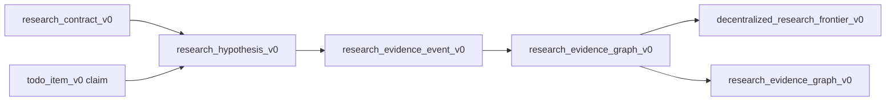

# auto_research_lane_contract_v1
> [English](auto-research-lane-contract-v1.md)

`auto_research_lane_contract_v1` 定义 LoopX 如何在共享控制面上用几个独立 agent lane 运行 auto research。它是角色与 capability 契约，不是新的协调者服务。

该契约回答一个产品问题：用户如何在 LoopX 保持去中心化的同时获得 Arbor 式研究 Loop？

## 设计原则

- 事实来源是 LoopX 图：todos、claims、rollout 事件、证据包、gates 与只读投影。
- Lane 贡献类型化记录。它们不拥有完整研究树。
- 选择对请求 agent 通过 `quota should-run --agent-id ...` 局部进行。
- 提升是证据之上的策略决策，不是有说服力的摘要。
- 咨询 lane 可以塑形假设，但只有证据 lane 能提升或退役假设。

## Lane 角色

| 角色 | Capability token | 主要贡献 | 写入 | 不得 |
| --- | --- | --- | --- | --- |
| Curator | `research_curator` | 定义或刷新公开安全的研究契约、指标、受保护 scope 与新颖性边界。 | `research_contract_v0`、grounding 引用。 | 选择赢家、编辑受保护 evaluator 或拥有 executor 队列。 |
| 假设提出者 | `hypothesis_proposer` | 提出有 grounding、有 todo 背书的假设与父子细化。 | `research_hypothesis_v0`、agent todos、grounding 引用。 | 从用于构思的同一物料声明新颖性。 |
| 执行者 | `research_executor` | 在隔离 worktree 中运行一个已认领假设，并产出切分感知结果。 | 分支引用、eval 结果投影、`auto_research_evidence_packet_v0`。 | 修改受保护 scope、提升结果或隐藏失败尝试。 |
| Evaluation / 提升者 | `evaluator_promoter` | 把已评分尝试转化为提升、重试或退役候选，然后在契约允许时记录显式终态决策。 | `research_evidence_event_v0`、提升或退役候选投影、`auto_research_terminal_decision_v0`、gate todos。 | 把仅 dev 的提升当作已提升证据、绕过 owner 关卡，或把自己的评审标注为独立。 |
| 产品叙述者 | `product_narrator` | 从终态决策与投影为下游产品界面渲染公开安全的案例故事。 | `research_evidence_graph_v0`、Explore 结果事件、公开文档、需要时首屏评审后的截图。 | 编造指标、把关候选认证为终态、读取私有源正文或修改研究证据。 |

没有 lane 有特权。当单个 Codex 会话有匹配的 todo claim 与边界时，它可以实现多个角色，但图仍须显示哪种 capability 产生了哪条记录。

## Lane Claim 包

每个 lane 动作都应可表示为紧凑 claim 包。该包可以存在于 todo 元数据投影、rollout 事件详情或未来内核 API 中，但必须保持公开安全。

```json
{
  "schema_version": "auto_research_lane_claim_v1",
  "goal_id": "loopx-auto-research-demo",
  "lane_role": "research_executor",
  "agent_id": "research-executor",
  "todo_id": "todo_auto_research_demo_001",
  "hypothesis_id": "hyp_state_a2a_round",
  "capability_token": "research_executor",
  "allowed_actions": ["run_dev_attempt", "run_holdout_attempt", "write_evidence_packet"],
  "write_scope": ["auto_research_evidence_packet_v0", "rollout_event_log"],
  "blocked_by": []
}
```

claim 包不是对完整图的锁。它只解释为什么该 agent 可以采取下一个有界动作。

## 来源与投影流程



图可以渲染为树，但它不被树管理者拥有。Lane 追加或更新它获准触碰的最小源记录；投影构建器随后派生前沿与产品视图。

Successor 工作应同样保持小。角色 profile 可以声明 `successor_todos` 规则，如「在 `run_dev_eval` 之后，若 dev 证据得到支持且不存在 holdout，则为 `research-executor` 添加 `run_holdout_eval`。」Pane 级 tick 通过写入一条带 `claimed_by`、`action_kind` 与 `unblocks_todo_id` 的普通 LoopX todo 来应用该声明。下一个 agent 仍通过自己的 `quota should-run` 与前沿重新进入；没有单独的继续投影器或中央研究管理者。

## Capability 规则

1. `research_curator` 只在允许的 docs/example scope 内、且显式指名受保护 scope 时才可创建或修订 `research_contract_v0`。
2. `hypothesis_proposer` 只有在假设有 agent todo 背书，且具备 `claimed_by`、`todo_id`、`mechanism_family` 与 grounding 引用或明确的无 grounding 原因时才可创建假设。
3. `research_executor` 只能运行当前 agent 作用域配额所选或显式认领的角色声明 successor todo 所对应的假设。
4. `evaluator_promoter` 只有在 dev 证据、held-out 证据、干净边界与必需关卡齐备时才能提升。
5. 已注册对等方只有在与假设生产者和终态决策 agent 都不同、绑定精确证据图修订、并记录 `approve`、`reject` 或 `needs_more_evidence` 时才可认领独立评审。评审不修改研究真相。
6. `product_narrator` 只能从 `research_evidence_graph_v0`、显式终态决策与当前评审投影发布；`confirmed` 或 `refuted` 发现需要独立批准。没有它，发现保持 `tentative`。相关证据必须保持公开安全，首屏公开界面变更仍遵守首屏评审关卡。

## 关卡

| 关卡 | 适用 | 所需信号 |
| --- | --- | --- |
| 受保护边界关卡 | Executor 与 promoter | `protected_scope_clean=true`，无受保护文件编辑。 |
| Held-out 关卡 | Promoter | held-out 指标按契约方向改进。 |
| 新颖性关卡 | Promoter 或 narrator | 声明研究新颖性时需独立新颖性审计引用。 |
| Owner 关卡 | Promoter 或公开 narrator | 当合并、发布或私有边界需要时，需显式用户/controller 关卡。 |
| 首屏关卡 | Product narrator | 变更首屏视口、hero、主 CTA 或打开导航前预览。 |

## 提升与退役

提升与退役都是有用结局：

- 提升候选：受支持或已提升的假设，带公开安全 dev 证据、必需 holdout/边界检查与 todo/分支/证据引用；
- 退役候选：被反驳或已退役的假设、负面证据、guardrail 失败或重复重试耗尽；
- 重试候选：未评分但可恢复的尝试，带分支/引用与 `needs_retry` 证据；
- 终态决策：一条独立的证据修订绑定 `promoted` 或 `retired` 记录；仅有候选状态从不产生它；
- 对等评审：当前终态决策之上的独立回执。同 agent 评审可见，但不能产生 confirmed 或 refuted 发现。

产品面板应展示全部三者。用户应看到哪个结果值得合并、哪个方向通过清晰失败省下了未来搜索时间、哪个尝试还需要另一轮有界 executor Turn。

## 验收检查

一个实现只有满足以下条件才符合本 lane 契约：

- 上述每个 lane 角色都作为命名 capability 存在；
- 每个可执行假设都有 `todo_id`、`claimed_by` 与 agent 作用域配额选择；
- 提升与退役候选从 `research_evidence_graph_v0` 推导，而非仅 fixture 措辞；
- 终态结果可按精确 hypothesis id 查询，包括历史，而无需加载原始 transcript；
- 过期证据修订与冲突终态决策失效关闭为 tentative 或阻塞投影；
- 独立评审 claim 要求不同的已注册对等方，且从不改写已评分证据或终态决策；
- 有 grounding 的构思与新颖性审计保持独立 lane；
- 任何公开界面都不需要 leader 或协调者 agent 来解释所有权；
- 公开文档与投影不包含原始日志、私有路径、凭据、内部文档或原始受保护 evaluator 物料。
