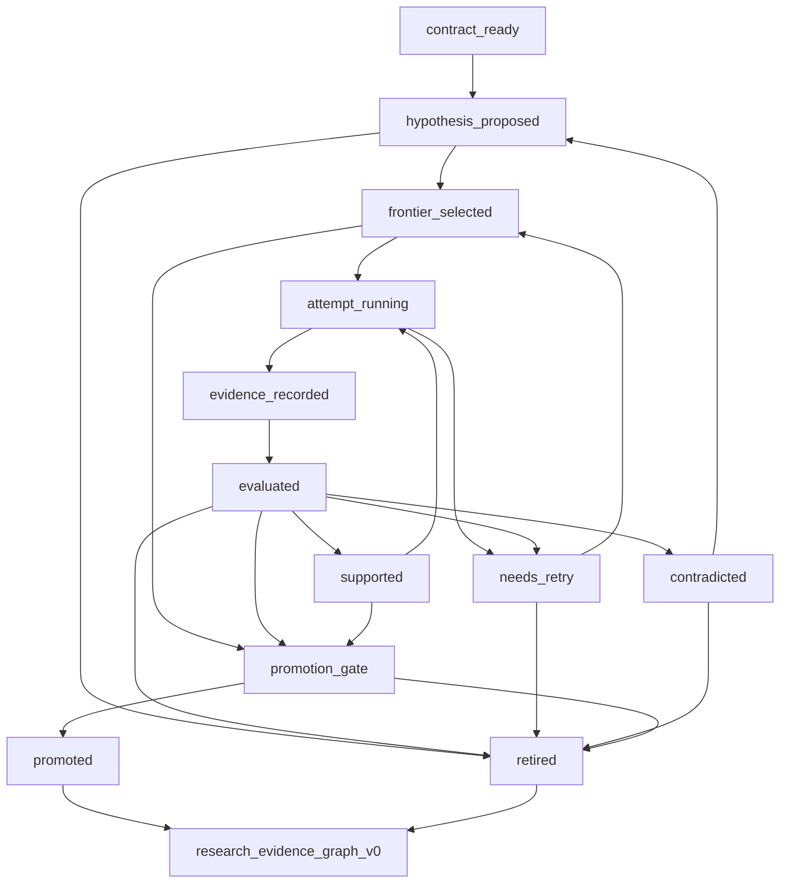

# auto_research_role_state_machine_v0

`auto_research_role_state_machine_v0` 定义 LoopX auto research 的常开数字员工模型。它把 Arbor 式研究角色映射到 LoopX 去中心化控制面上，而不添加 leader agent、scheduler 服务或第二事实来源。

本契约回答的问题比状态与 lane 契约更窄：哪个数字员工角色可以把研究项从一个状态移到下一个，以及在该转换对用户可见之前必须存在什么证据？

## 伴随契约

Auto-research 内核有意拆分为三个协议界面：

| 契约 | 拥有 | 不拥有 |
| --- | --- | --- |
| `decentralized_auto_research_state_v0` | 记录与投影形状：契约、todo 关联假设、证据事件、前沿、证据图、证据图投影。 | 哪个角色可以写入每个转换。 |
| `auto_research_lane_contract_v1` | Curator、proposer、executor、evaluator 与 narrator lane 的 capability 所有权。 | 有序状态机与转换证据。 |
| `auto_research_role_state_machine_v0` | 数字员工角色映射、状态转换规则、接管关卡与无 leader 恒等式。 | 运行时调度、模型 prompt 或隐藏编排。 |
| `auto_research_role_profile_v0` | 每 worker 身份包：`agent_id`、角色、相位、能力、写 scope、所需 skill 小节、AGENTS overlay 与停止条件。 | 研究来源记录、相位清单措辞，或 quota/frontier 之外的权限。 |

三个契约都是 `docs/reference/protocols/` 下的对等工件。它们共同构成 auto research 的公开安全控制面图。

## 数字员工角色映射

这些角色可以作为独立 LoopX agent todo、monitor 或 Codex 会话持续运行。没有一个拥有完整图。首个版本有意保持常开角色集小；gate 处理、公开叙述与前沿清理是转换职责而非独立常驻 worker。

| 角色 | Capability token | 主要工作 | 可写 | 不得 |
| --- | --- | --- | --- | --- |
| 研究 curator | `research_curator` | 保持目标、可编辑 scope、受保护 scope、指标、停止策略与操作员关卡显式。 | `research_contract_v0`、受保护边界笔记、owner gate todos、公开投影请求。 | 选择赢家、运行实验或发布无支持的主张。 |
| 假设提出者 | `hypothesis_proposer` | 把研究想法变成有 todo 背书的假设、父链接、机制家族与有界的退役/继任决策。 | `research_hypothesis_v0`、successor todos、grounding 引用、no-follow-up 理由。 | 用与构思相同的来源声明新颖性，或删除负面证据。 |
| 研究执行者 | `research_executor` | 在隔离 worktree 中执行所选假设并保留 dev 或 held-out 尝试证据。 | 分支引用、`research_evidence_event_v0`、重试包。 | 编辑受保护 scope、隐藏失败或提升结果。 |
| Evaluator/提升者 | `evaluator_promoter` | 把证据分类为 supported、contradicted、retry-needed、promotion-ready 或 retirement-ready，并只在必需关卡之后记录终态决策。 | 评估摘要、提升候选、退役候选、`auto_research_terminal_decision_v0`、gate todo、投影就绪证据。 | 把仅 dev 的提升当作已提升、覆盖缺失 held-out 证据，或自我认证独立评审。 |

角色名是面向产品的标签。单个 Codex 会话只有在具有对应 todo claim、capability 与写边界时才可执行多个角色；追加的记录仍须指名产生它的角色。

未来版本可以在演示证明这些职责需要独立所有权之后，把 gate 管理、公开叙述或前沿清理拆分到单独常开角色。在此之前，它们保持为上述四角色 v0 映射拥有的转换职责。

## 未来角色拆分

这些候选角色有意排除在 v0 常开角色集之外。它们被记录下来，使产品路线图可以在不重新引入 leader 或协调者 agent 的情况下扩展数字员工映射。

| 未来角色 | 当前 v0 职责 | 拆分触发 | 仍不得 |
| --- | --- | --- | --- |
| Gate 管理人 | 研究 curator 加证据验证器处理 `operator_gate` 与 `promotion_gate` 转换。 | gate 变得足够频繁，等待原因、owner 问题与解除阻塞证据需要独立监控。 | 批准自己的 gate、绕过 owner 决策或选择实验。 |
| 综合叙述者 | 只读投影构建器把证据图加终态决策与评审转换成可查询 Explore 结果。 | 用户需要一条持续更新的报告 lane，在不拖慢 runner 或验证器的情况下总结证据。 | 认证分数、隐藏负面证据或修改源记录。 |
| 前沿保洁员 | 假设映射器与证据验证器退役重复项、耗尽的 retry 与 no-follow-up 分支。 | 前沿增长到过大，过期假设挤占活动研究。 | 删除证据、改写 todo 所有权，或无公开理由地修剪。 |

提升任何未来角色都需要一次 smoke 更新，证明该角色是共享控制面之上的有界 lane，而非对完整图有权限的协调者。

## 状态词表

`auto_research_state_transition_v0` 使用以下持久化状态：

| 状态 | 含义 | 典型下一状态 |
| --- | --- | --- |
| `contract_ready` | 目标、可编辑/受保护 scope、指标、预算与提升策略公开安全且显式。 | `hypothesis_proposed` |
| `hypothesis_proposed` | 存在有 todo 背书的假设，但没有 agent 开始其尝试。 | `frontier_selected`、`retired` |
| `frontier_selected` | `quota should-run --agent-id ...` 为当前 agent 选中该假设。 | `attempt_running`、`operator_gate` |
| `attempt_running` | 一个已认领的证据 runner 正在隔离 worktree 中工作。 | `evidence_recorded`、`needs_retry` |
| `evidence_recorded` | 尝试证据存在，含切分、指标、分支/工件引用与边界事实。 | `evaluated` |
| `evaluated` | 验证器在研究契约下分类了证据。 | `supported`、`contradicted`、`needs_retry`、`promotion_gate`、`retired` |
| `supported` | Dev 证据支持该方向，但提升未完成。 | `promotion_gate`、`attempt_running`、`retired` |
| `needs_retry` | 尝试无定论，但从引用或明确有界 retry 可恢复。 | `frontier_selected`、`retired` |
| `contradicted` | 证据显示回归、正确性失败或 guardrail 失败。 | `retired`、`hypothesis_proposed` |
| `promotion_gate` | 提升需要 held-out 证据、owner 决策、合并关卡或公开边界评审。 | `promoted`、`retired`、`operator_gate` |
| `promoted` | 提升策略接受该结果进入当前最佳工件。 | 对等评审、Explore 结果投影 |
| `retired` | 该方向不再活动；负面证据仍可查询。 | 对等评审、Explore 结果投影 |

## 状态机



## 转换规则

| 转换 | 所需角色 | 所需证据 |
| --- | --- | --- |
| `contract_ready -> hypothesis_proposed` | 假设映射器 | `research_contract_v0`、`todo_id`、`claimed_by`、机制家族、grounding 引用或无 grounding 原因。 |
| `hypothesis_proposed -> frontier_selected` | LoopX 配额投影 | `quota should-run --agent-id ...` 选中该 todo 且写边界允许该尝试。 |
| `frontier_selected -> attempt_running` | 证据 runner | agent claim、隔离 worktree 或等价执行边界、受保护 scope 提醒。 |
| `attempt_running -> evidence_recorded` | 证据 runner | 切分标签、指标状态、分支/工件引用、受保护 scope clean 标志、原始私有工件标志。 |
| `evidence_recorded -> evaluated` | 证据验证器 | 把契约策略应用于已评分或未评分证据。 |
| `evaluated -> supported` | 证据验证器 | dev 证据改进或否则满足契约的支持阈值。 |
| `evaluated -> contradicted` | 证据验证器 | 回归、正确性失败、边界违反或新颖性失败。 |
| `evaluated -> needs_retry` | 证据验证器 | 未评分尝试，带可恢复引用或显式有界 retry 原因。 |
| `evaluated -> promotion_gate` | 证据验证器 | holdout 候选、干净边界、待决 owner/合并/发布决策。 |
| `promotion_gate -> promoted` | 研究 curator 加证据验证器 | 必需时的 held-out 证据、干净边界、适用的操作员关卡通过，以及显式的证据修订绑定终态决策。 |
| `supported|contradicted|needs_retry -> retired` | 假设映射器加证据验证器 | 负面证据、retry 耗尽、重复证明或 no-follow-up 理由加显式退役原因。 |
| `promoted|retired -> auto_research_peer_review_v0` | 声明独立性时与生产者和决策 agent 都不同的已注册对等方 | 精确终态决策引用、精确证据图修订、公开安全证据引用与 approve/reject/needs-more-evidence 判决。 |
| `promoted|retired -> loopx_explore_result_event_v0` | 只读投影构建器 | 仅当前证据图、终态决策与评审投影引用；不直接修改源记录。 |

## 无 Leader 恒等式

- 没有角色拥有完整图或可以改写全局研究真相。
- `quota should-run --agent-id ...` 只选择当前 agent 前沿。
- 每个可执行假设保持由 `todo_id` 与 `claimed_by` 背书。
- 提升是证据加关卡策略，不是有说服力的摘要。
- 提升或退役候选不是终态结果；终态决策显式且绑定到一个证据图修订。
- 对等评审是决策之上的回执。它不能改写假设或证据，同 agent 评审从不标注为独立。
- 单个已提升分支不会单独关闭多轮目标；当角色 profile 的继续目标未满足时，循环中的最后一个角色创建或链接下一个角色声明的 successor todo。
- 公开叙述读取 `research_evidence_graph_v0`；它不认证分数或修改源状态。
- Gate 处理是转换职责；没有角色可以绕过操作员关卡。
- 失败、被反驳与 retry 耗尽的尝试保持可见为负面证据，除非公开/私有边界要求脱敏。

## 演示与接管含义

可见 auto-research 演示只能首先作为用户可见的排演启动多个数字员工。默认包应保持 `dry_run`：它可以展示 tmux pane、命令与接管控件，但不得自行启动 Codex、写入 LoopX 状态或花费配额。

用户选择真实演示时，每个 lane 仍运行自己的：

```bash
loopx --format json --registry "$LOOPX_REGISTRY" \
  quota should-run --goal-id "$LOOPX_GOAL_ID" --agent-id "$LOOPX_AGENT_ID"
```

且每个 lane 读取自己的 auto-research 前沿。Shell 布局只是可见性与接管界面，不是协调者。

## 验收检查

一个实现只有满足以下条件才符合本角色/状态机契约：

- 数字员工角色映射对用户与文档可见；
- 状态转换指明前进所需的角色与证据；
- smoke 套件在状态与 lane 契约旁检查 `auto_research_role_state_machine_v0`；
- 生成的演示包在执行前暴露用户接管控件；
- 没有公开工件把图所有权集中在 leader、coordinator 或 supervisor 角色中。
