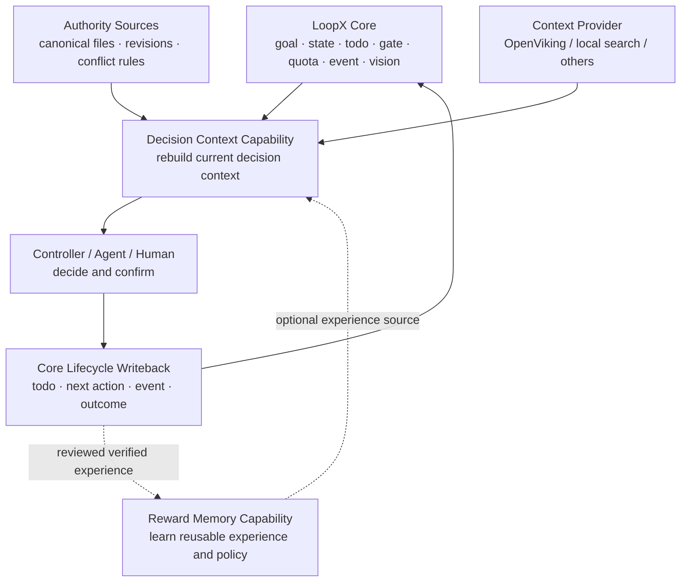
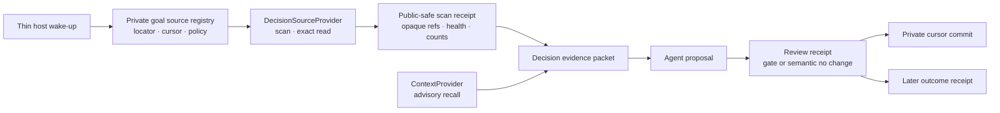

# Decision Context Architecture v0

Status: experimental contract

## Position

Decision Context is a built-in, default-off, goal-scoped LoopX capability. It
runs above LoopX Core, consumes Core truth, and does not enter
`loopx/control_plane/` or alter todo, gate, quota, or authority semantics.

The capability lives under `loopx/capabilities/decision_context/` and reuses
`loopx/capabilities/context_providers/`. OpenViking is one replaceable context
provider, never a global dependency or action authority.

## Boundary

LoopX Core owns cross-domain lifecycle and permission invariants: registry,
goal, state, todo, gate, quota, event, run, vision, scope, and validated
writeback. Decision Context improves decision quality through bounded recall,
exact read, freshness and conflict rebase, objective scoring, recommendations,
alternatives, stop lists, and provider fail-open.

This capability remains outside the default hot path and cannot create
authority. A goal owner must explicitly select the scenario, provider, and
agent lane.

## Relationship to Reward Memory

Reward Memory asks what reusable experience was learned in the past. Decision
Context asks which facts should be trusted for the current decision.

- Reward Memory follows candidate → review → activate → apply/retire.
- Decision Context follows recall → exact read → rebase → propose → review
  settlement → cursor commit → later outcome observation.
- Reward Memory may be one optional input to Decision Context.
- A verified Decision Context outcome may create a Reward Memory candidate, but
  the candidate still follows Reward Memory review and activation.
- Reward Memory stores policies, preferences, and procedural experience;
  Decision Context carries facts, judgments, assumptions, conflicts, decisions,
  and outcomes.
- Reward Memory accepts a write only after verification and authority review; a
  Decision Context decision and its result are appended as an auditable record.
- Neither capability creates action authority.

## Four packets

### `decision_evidence_packet_v0`

The deterministic evidence layer contains changed facts, recalled claims,
stale or rejected claims, conflicts, source revisions, and provider health. It
contains no recommendation, objective score, or next action. Accepted recalled
claims must retain exact-read and revision evidence. Provider failure produces
a health receipt and fails open to authority sources.

### `decision_proposal_v0`

The advisory reasoning layer contains objective scores, a recommended decision,
alternatives, next actions, and a stop list. It references the stable evidence
packet fingerprint and requires authority confirmation. It is not Core truth.

### `decision_review_receipt_v0`

The settlement layer records one of four dispositions:

- `approve`, `reject`, and `defer` exact-read an existing `user_gate` event whose
  scope is `direction:action:<proposal-packet-ref>`;
- `no_change` requires an explicit semantic rebase receipt and creates no gate.

The receipt proves that the evidence batch was reviewed or found immaterial. It
allows private source cursors to advance after validated lifecycle writeback,
but it is not an observed outcome and creates no action authority.

### `decision_outcome_receipt_v0`

The append-only result layer records the accepted decision, resulting
transitions, observed outcomes, invalidated assumptions, and review time. Only
a verified receipt with outcome evidence is eligible to create a Reward Memory
candidate.

`decision_outcome_feedback_v0` closes the boundary without making either
capability authoritative. It accepts only canonical, untampered evidence and
outcome packets, records aggregate retrieval telemetry, and may emit one
`procedural_experience` candidate when an exact-read-promoted claim has a
verified outcome linked to the same evidence packet. Rejected recall is
telemetry only. The adapter never ingests, reviews, persists, or activates the
candidate. A caller may pass the canonical public retrieval receipt to preserve
the distinction between aggregate rejection records and the actual number of
provider results rejected by exact read.

## Incremental source plane

Decision Context must not depend on a domain-specific automation prompt to know
which inboxes, people, documents, repositories, or external signals matter.
Instead, each goal owns a private source registry and exposes only a
`decision_source_manifest_v0` public projection:

- source id, kind, priority, evidence level, caller-defined objective tokens,
  freshness, and scan policy are explicit;
- provider locators and cursors stay in private goal state;
- a `DecisionSourceProvider` detects bounded changes and performs exact reads;
- `decision_source_scan_receipt_v0` retains opaque refs, revision refs, counts,
  health, and cursor fingerprints, never raw content or provider payloads;
- source-provider failure is fail-open and cannot create authority.

`DecisionSourceProvider` is distinct from `ContextProvider`. The former rebases
current authority from systems such as Lark, GitHub, documents, or mail. The
latter recalls advisory context from systems such as OpenViking. The evidence
assembler may consume both, but current authority wins conflicts.

This lets the steady-state automation prompt become generic: wake the goal,
follow the active capability route, and respect quota. Source selection,
incremental windows, exact-read policy, and writeback live in the capability
and goal configuration.

## Invariants

1. Every public packet is goal-scoped, public-safe, structured, and fingerprinted.
2. Evidence and proposal remain separate.
3. Providers never create authority.
4. Raw provider payloads, raw chat, tool output, and credentials never enter a
   packet.
5. Recall is bounded; accepted claims retain exact-read, revision, and conflict
   receipts.
6. Proposals remain advisory; transitions use existing todo, gate, quota, and
   writeback.
7. Provider failure is fail-open and does not block the Core lifecycle.
8. Review settlement, not a future outcome, is the cursor-commit boundary.
9. `no_change` requires explicit semantic proof and does not create a user gate.
10. Verified outcomes are recorded before any Reward Memory distillation.

## Delivery stages

### P0: contract

Define the four packets, stable fingerprints, public-safe field allowlists,
the provider-neutral incremental source contract, focused tests, and this
boundary document. Do not wire a concrete provider, CLI, or Core writeback.

### P0: evidence assembler

Read authority revisions, freshness, and conflict rules. Reuse
the private source registry and bounded incremental scan receipts. Reuse
`ContextProvider` for bounded retrieval and advisory recall. Emit
stale/rejected claims and provider fail-open receipts without capturing raw
context.

### P1: default-off entry point

Add a default-off goal profile, activation status, catalog, source-provider
adapters, and a thin CLI that orchestrates source scans, evidence, and proposals
without changing Core semantics. Domain adapters such as Lark remain optional
and credential-free in public state.

The first entry-point slice implements strict private profile loading,
goal-and-agent activation status, public-safe source manifests, and an explicitly
configured read-only `local-file` source adapter. That slice intentionally
stopped before source orchestration and private cursor checkpoints.

The second slice adds `assemble_profile_decision_evidence(...)` as the thin
host API and `decision-context prepare-evidence` as its read-only CLI preview.
The profile now resolves enabled source providers, performs bounded scans and
exact reads, and emits public-safe scan, revision, health, evidence, and cursor
checkpoint records. The host API accepts a domain rebase callback and returns
raw cursor proposals only in-process. The CLI intentionally performs no
semantic rebase: changed-source cursors remain at `preserve`, so merely scanning
or reading a source can never mark it absorbed. Sources marked `on_demand` are
excluded from automatic collection and require explicit source selection.

An explicitly activated profile may also select only an advisory context
provider. `decision-context recall-context` then accepts one provider-neutral
scope for that call and returns local-private transient results plus a nested
public-safe receipt. This path does not mutate the profile, scan authority
sources, access cursors, create pending settlement, or authorize execution. It
is the narrow entry point for a copied task locator; durable decision use still
requires the normal evidence rebase and lifecycle owners.

Private cursor commit remains a separate acceptance boundary. A review may
cross agent turns, so `prepare-review --execute` stores one private pending
settlement containing the public-safe assembly plus private cursor proposals;
it never mutates active cursor state. `settle-review` then exact-reads either a
matching existing user-gate event or the assembly's explicit semantic
`no_change` proof, appends a validation event, and performs cursor CAS.

The host API
`commit_profile_decision_cursors(...)` now performs that boundary explicitly:

- it verifies the assembly, evidence, review, and cursor-checkpoint packet
  chain, plus the proposal for gated dispositions;
- it supports the previous proposal/outcome chain as a compatibility read path;
- it exact-reads an existing LoopX rollout event whose `decision_id` and
  artifact refs bind the same packet chain;
- it rejects a changed private profile or a cursor value that no longer matches
  the assembly snapshot;
- it writes the private cursor file with a file lock, atomic replace, fsync, and
  readback verification;
- it returns only opaque cursor refs in a public-safe commit receipt.

Scanning, evidence preparation, proposal construction, and pending-settlement
creation still perform no active cursor write. A missing or generic boolean
"writeback succeeded" assertion is not sufficient to commit. An approved
decision's real-world outcome remains a later append-only observation and does
not block marking already reviewed source material as consumed.

Private hosts may bind a provider instance at runtime through
`source_provider_overrides`. The provider id must already be declared by the
private goal profile, and the instance identity must match that declaration.
This lets an MCP, inbox, document, or repository integration use the same
health, bounded scan, exact-read, rebase, and cursor-checkpoint path without
registering a private adapter in the public package. Activation projects only
`runtime-bound`; the adapter name, config, locator, payload, and cursor remain
private. Missing or mismatched runtime providers fail open without advancing a
cursor.

### P1: first dogfood

Use one private, redacted decision-assistant scenario. Let a domain adapter map
new facts to stable private theses; send only material proposals through the
existing user gate and keep explicit semantic no-change runs quiet. Settle the
source cursor after approve/reject/defer/no-change, then write later outcomes
through existing event/run history. Measure decision changes, rejected stale
evidence, reading saved, observed outcomes, and invalidated assumptions rather
than retrieval volume.

### P2: cross-domain validation and Core promotion gate

Validate a second independent domain and measure authority-source hits, stale
claim rejection, evidence-driven decision changes, and outcome calibration.
Only then consider promoting narrow generic mechanisms:

- decision-to-todo/outcome event links;
- compact source revision, freshness, and conflict read models;
- the generic decision outcome receipt;
- provider health and fail-open projection.

Objective scoring, cross-repository scanning, semantic recall, and decision
recommendations stay in the capability.

## Stop conditions

- Stop provider expansion when it raises retrieval volume without changing a
  decision or producing an outcome receipt.
- Revisit the capability boundary if integration requires changing Core
  authority semantics.
- Reject writes when raw or private context cannot be compacted and redacted
  before packet construction.
- Do not propose Core promotion until one scenario proves stale rejection and
  decision-to-outcome linkage, then a second domain reproduces the result.
