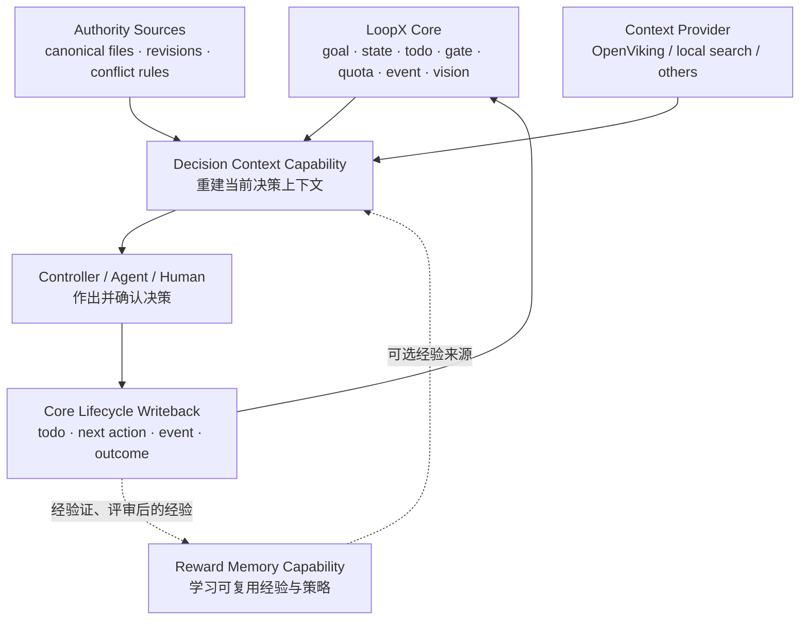
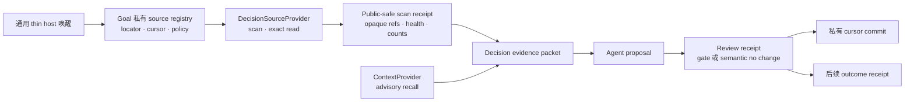

# Decision Context 架构 v0

状态：实验契约

## 定位

Decision Context 是 LoopX 内置、默认关闭、goal-scoped 的高层决策 capability。
它运行在 LoopX Core 之上，消费 Core truth，但不进入
`loopx/control_plane/`，也不改变 todo、gate、quota、authority 的语义。

代码位置：

- capability contract：`loopx/capabilities/decision_context/`
- provider contract：复用 `loopx/capabilities/context_providers/`
- lifecycle truth：继续由现有 Core 管理
- OpenViking：可替换的 context provider，不是全局依赖或 action authority

## 边界

LoopX Core 拥有跨领域的生命周期与权限边界：

- registry、goal、state、todo、gate、quota；
- event、run、vision 与 restartable next action；
- authority、scope 和 validated writeback。

Decision Context 负责的是决策质量：

- 跨源 bounded recall 与 exact read；
- freshness、revision 与 conflict rebase；
- objective scoring；
- recommendation、alternatives、next actions 与 stop list；
- provider health 与 fail-open。

这些能力不应进入每个 goal 的默认热路径，也不能自行创造权限。默认关闭使
goal owner 可以显式选择场景、provider 和 agent lane。

## 与 Reward Memory 的关系

二者是同级 intelligence capability，但解决不同问题：

| | Reward Memory | Decision Context |
|---|---|---|
| 核心问题 | 过去学到了什么可复用经验？ | 此刻决策需要相信哪些事实？ |
| 生命周期 | candidate → review → activate → apply/retire | recall → exact read → rebase → propose → review settlement → cursor commit → 后续 outcome |
| 主要对象 | policy、preference、procedural experience | fact、judgment、assumption、conflict、decision、outcome |
| 写入条件 | 经过验证和 authority review | 决策与结果作为可审计记录追加 |
| 动作权限 | 不创造 authority | 不创造 authority |
| 连接方式 | 可作为 Decision Context 的可选经验来源 | verified outcome 可产生 Reward Memory candidate |

## 四个 packet

### `decision_evidence_packet_v0`

确定性、可审计的证据层：

- `changed_facts`
- `recalled_claims`
- `stale_or_rejected_claims`
- `conflicts`
- `source_revisions`
- `provider_health`

它不包含 recommendation、objective score 或 next action。provider 返回内容必须
经过 exact read 和 source revision 校验后，才能成为 accepted recalled claim。
语义召回失败时保留 provider health receipt，并 fail open 到 authority sources。

### `decision_proposal_v0`

允许 Agent 推理的建议层：

- `objective_scores`
- `recommended_decision`
- `alternatives`
- `next_actions`
- `stop_list`

proposal 必须引用 evidence packet 的稳定指纹，并显式标记
`authority_confirmation_required=true`。它不能写成 Core truth。

### `decision_review_receipt_v0`

结算层记录四种 disposition：

- `approve`、`reject`、`defer` 必须精确回读现有 `user_gate` event，且 gate scope
  必须是 `direction:action:<proposal-packet-ref>`；
- `no_change` 必须有显式 semantic rebase 证明，不创建 gate。

该 receipt 只证明“这批证据已评审或没有实质影响”，允许在 lifecycle writeback
验证后推进私有 source cursor；它不是 outcome，也不创造动作权限。

### `decision_outcome_receipt_v0`

追加式结果层：

- `accepted_decision`
- `resulting_transitions`
- `observed_outcomes`
- `invalidated_assumptions`
- `review_at`

receipt 可由既有 event/run history 承载。只有
`verification_status=verified` 且有 outcome evidence 时，才可成为 Reward Memory
candidate；candidate 仍需经过 Reward Memory 自己的 review/activation 流程。

`decision_outcome_feedback_v0` 只接收 canonical、未被篡改的 evidence/outcome
packet，并输出聚合后的 retrieval telemetry。只有 exact read 提升的 claim 与同一
evidence packet 下的 verified outcome 直接关联时，才可生成一个
`procedural_experience` candidate。被拒绝的召回只进入 telemetry，不进入记忆；
适配层不会自动 ingest、review、persist 或 activate candidate。调用方可额外传入
canonical 的公开 retrieval receipt，以区分聚合后的 rejection record 数和被 exact
read 拒绝的真实 provider result 数。

## 增量信源层

Decision Context 不应依赖某个领域专用的 automation prompt，来记住应该读哪些群聊、
关键人、文档、仓库或外部信号。每个 goal 应维护一份私有 source registry，对外只投影
`decision_source_manifest_v0`：

- source id、类型、优先级、证据等级、调用方自定义 objective token、freshness
  和扫描策略显式声明；
- provider locator 和原始 cursor 只保留在 goal 私有状态；
- `DecisionSourceProvider` 负责 bounded change scan 和 exact read；
- `decision_source_scan_receipt_v0` 只保留 opaque ref、revision ref、计数、health 和
  cursor fingerprint，不保留正文或 provider 原始返回；
- provider 失败时 fail open，且不能创造 authority。

`DecisionSourceProvider` 与 `ContextProvider` 职责不同。前者从飞书、GitHub、文档、
邮箱等系统增量重建当前 authority；后者从 OpenViking 等系统召回 advisory context。
evidence assembler 可以同时消费两者，但冲突时当前 authority 优先。

这样 steady-state automation prompt 可以退化为通用唤醒：启动 goal、遵循 active
capability route、服从 quota。信源选择、增量窗口、exact-read 策略和写回全部由
capability 与 goal 配置承担。

## 不变量

1. 四个公开 packet 都是 goal-scoped、public-safe、稳定指纹化的结构化记录。
2. evidence 与 proposal 分离，模型建议不能伪装成事实。
3. provider 不创造 authority。
4. provider payload、raw chat、tool output、credentials 不进入 packet。
5. recall 必须有界；accepted claim 必须保留 exact-read、revision 与 conflict receipt。
6. proposal 只能建议，真实迁移继续经现有 todo、gate、quota 和 writeback。
7. provider 不可用时 fail open，不阻断 Core lifecycle。
8. cursor commit 的边界是 review settlement，而不是未来 outcome。
9. `no_change` 必须有显式语义证明，且不创建 user gate。
10. verified outcome 先进入可审计 receipt，再决定是否提炼为 Reward Memory。

## 分阶段交付

### P0：contract

- 固化四类 packet、稳定指纹、公共安全字段白名单和 provider-neutral
  增量信源契约；
- 建立能力边界文档与聚焦测试；
- 不接具体 provider、CLI 或 control-plane writeback。

### P0：evidence assembler

- 读取 authority revision、freshness 和 conflict rule；
- 加载私有 source registry，消费 bounded incremental scan receipt；
- 复用 `ContextProvider` 做 bounded retrieval 和 advisory recall；
- 输出 stale/rejected claim 和 provider fail-open receipt；
- 不采集 raw context。

### P1：默认关闭入口

- 增加默认关闭、goal-scoped 的 profile/activation status/catalog；
- 增加 source-provider adapter，提供薄 CLI 编排 source scan、evidence 与 proposal；
- 飞书等领域 adapter 保持可选，公开状态不含凭据和私有 locator；
- 不修改 Core todo、gate、quota 或 authority 语义。

首个入口切片已实现严格的私有 profile 加载、goal/agent activation 状态、公开安全的
source manifest，以及显式配置、只读的 `local-file` source adapter。该切片刻意
停在 source 编排和私有 cursor checkpoint 之前。

第二个切片增加薄 host API `assemble_profile_decision_evidence(...)`，以及只读的
CLI 预览 `decision-context prepare-evidence`。profile 会解析已启用的 source
provider，执行 bounded scan 与 exact read，并输出公开安全的 scan、revision、
health、evidence 和 cursor checkpoint 记录。host API 通过领域 rebase callback
消费瞬时正文，原始 cursor proposal 只留在进程内。CLI 则刻意不做语义 rebase：
只要 changed source 尚未被事实、拒绝项或冲突记录完整解释，cursor 就保持
`preserve`，避免把“扫描/读过”误记成“已吸收”。`on_demand` source 不进入自动
扫描，只有显式选择后才会读取。

显式激活的 profile 也可以只选择 advisory context provider。
`decision-context recall-context` 接受一个仅用于本次调用的 provider-neutral scope，
返回 local-private transient 结果及嵌套的 public-safe receipt。该路径不修改 profile、
不扫描 authority source、不访问 cursor、不创建 pending settlement，也不授予执行
权限。它是复制 task locator 的最窄入口；若召回结果需要进入 durable decision，仍须
回到标准 evidence rebase 和既有 lifecycle owner。

私有 cursor commit 仍是独立验收边界。Review 可能跨 Agent turn，所以
`prepare-review --execute` 会保存一份私有 pending settlement：其中包含公开安全的
assembly 和私有 cursor proposal，但绝不修改 active cursor。随后
`settle-review` 精确回读匹配的既有 user-gate event，或核验 assembly 中显式的
semantic `no_change`，追加 validation event，再执行 cursor CAS。

host API
`commit_profile_decision_cursors(...)` 现在显式执行这条边界：

- 验证 assembly、evidence、review 与 cursor checkpoint 的完整引用链；gated
  disposition 还必须验证 proposal；
- 保留原 proposal/outcome 链作为兼容读取路径；
- 精确回读既有 LoopX rollout event，并校验其 `decision_id` 与 artifact refs
  绑定同一组 packet；
- profile 已变化或当前 cursor 不再等于 assembly 快照时拒绝提交；
- 通过文件锁、原子替换、fsync 与回读校验写入私有 cursor 文件；
- public receipt 只包含不透明 cursor ref，不包含原始 cursor 或私有路径。

source scan、evidence preparation、proposal 构建和 pending settlement 创建仍不会
写 active cursor；调用方只传一个“writeback 成功”的布尔值，不足以触发提交。
被 approve 的决策仍需在未来单独记录真实 outcome，但这不阻塞把已经评审的信源
材料标记为已消费。

私有宿主可以通过 `source_provider_overrides` 在运行时绑定 provider 实例。provider
id 必须先由私有 goal profile 声明，实例身份也必须与声明一致。这样 MCP、收件箱、
文档或仓库集成可以复用同一套 health、bounded scan、exact-read、rebase 与 cursor
checkpoint 路径，而不必把私有 adapter 注册进公开包。activation 只投影
`runtime-bound`；adapter 名称、配置、locator、payload 和 cursor 均留在私有边界。
provider 缺失或身份不匹配时 fail open，且不会推进 cursor。

### P1：首个 dogfood

- 在一个私有、脱敏的决策助手场景，由领域 adapter 把新事实映射到稳定私有论点；
- 只有实质 proposal 进入现有 user gate，显式 semantic no-change 保持 quiet；
- approve/reject/defer/no-change 后结算 source cursor，后续再通过既有 event/run
  history 写入 outcome receipt；
- 以“判断修正、过时证据拒绝、人工阅读量下降、真实结果、失效假设”而非召回条数验收。

### P2：跨域验证与下沉门槛

在第二个独立领域复用，测量：

- authority source 命中；
- stale claim rejection；
- 因新证据发生的决策改变；
- outcome 校准质量。

双场景验证后，才考虑把以下窄机制下沉 Core：

- `decision_id → todo/next_action → outcome` 的通用事件关联；
- source revision、freshness 与 conflict 的紧凑 read model；
- 通用 `decision_outcome_receipt_v0`；
- provider health/fail-open 公共投影。

目标评分、跨仓扫描、语义召回和推荐决策继续留在 capability。

## 停止条件

- 若只能提高召回数量，不能改变决策或产生 outcome receipt，停止扩展 provider。
- 若需要修改 Core authority 语义才能接入，回退并重新划分 capability 边界。
- 若 raw context 或私有来源无法在 packet 前被压缩和脱敏，拒绝写入。
- 若单场景无法证明 stale rejection 与 decision-to-outcome 关联，不推进 Core 下沉。
