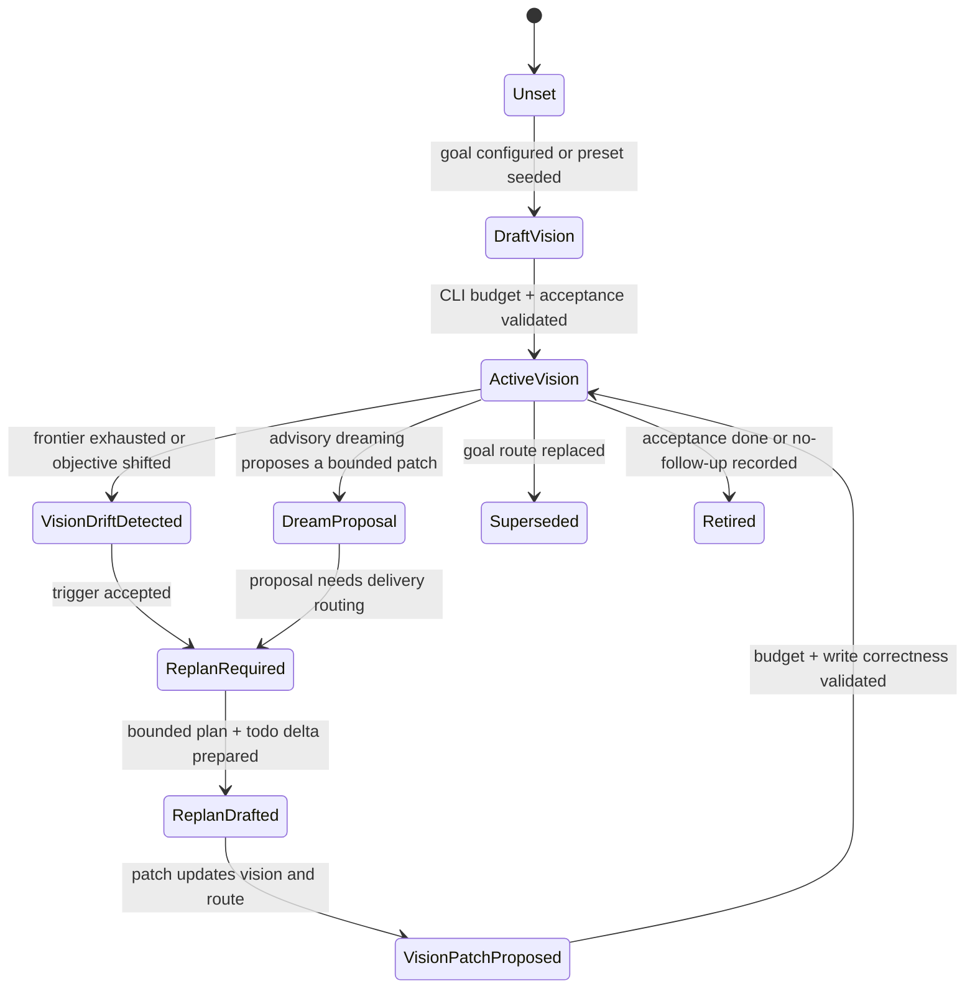

# goal_vision_replan_contract_v0

`goal_vision_replan_contract_v0` defines the small per-agent contract that
connects bounded agent vision, autonomous replan, dreaming proposals, and
goal-routing projection. It is a kernel contract, not an auto-research preset.

The purpose is to keep both the user layer and the product preset thin:

- the user supplies intent and small overrides;
- the preset supplies domain defaults and handoff hints;
- the kernel owns bounded per-agent vision, replan state transitions, and the
  read/write protocol used by quota and status.

Every vision packet and checkpoint is scoped by `agent_id`. Goal-level
projection may aggregate the resulting gaps, but it must not let one role's
vision drift or missing closeout satisfy, block, or wake another role.

## Ownership Boundary

| Layer | Owns | Must Not Own |
| --- | --- | --- |
| User | Objective, optional role overrides, and optional data/eval entrypoint. | Vision state-machine transitions, replan recovery policy, quota routing, or raw agent scratchpads. |
| Preset | Domain roles, handoff hints, metric/evidence adapters, and compact default acceptance text. | Long-lived replan mechanics, pane-local tick policy, generic successor routing, or product-specific forks of the kernel state machine. |
| Kernel | CLI-enforced vision budgets, vision/replan state transitions, goal-route projection, todo/evidence/status protocol, and compact default prompts. | Domain-specific research logic, benchmark scoring, support triage semantics, or sales workflow semantics. |

`loopx/quota.py` should consume the final `goal_route_projection` or
`goal_frontier_projection`. It should not grow per-agent vision storage,
budgeting, dreaming, or product-specific replan logic.

## CLI Budget

Per-agent vision is an executable control-plane field, so the CLI/write API must
enforce a hard size budget before the state reaches quota, status, or a visible
agent pane. Long reasoning belongs in evidence artifacts or design docs.

| Field | Max chars | Purpose |
| --- | ---: | --- |
| `vision_summary` | 420 | Current role-specific direction and success shape. |
| `role_scope` | 280 | What this agent owns and must not own. |
| `acceptance_summary` | 420 | Compact completion contract for this agent. |
| `advancement_policy` | 32 | `as_needed` or `repeat_until_closed`. |
| `replan_trigger_summary` | 240 | Why the latest replan is required. |
| `dreaming_policy` | 240 | Whether advisory dreaming can propose a patch. |
| `last_patch_summary` | 240 | What changed in the latest bounded vision patch. |
| `total_agent_vision` | 1200 | Aggregate budget for one agent's active vision packet. |

Required write-path behavior:

1. Reject over-budget writes with `vision_budget_exceeded`, including the
   current character count, field limit, and a compact suggested replacement
   when the offending field is known.
2. Do not silently truncate fields; truncation hides control-plane intent.
3. Store verbose rationale as evidence and reference it by id.
4. Keep the latest bounded packet visible in status/quota so agents can reason
   without reading private scratchpads or chat history.

The normal lightweight CLI write boundary is `loopx refresh-state` with inline
vision patch fields:

```bash
loopx refresh-state \
  --goal-id <goal-id> \
  --agent-id <agent-id> \
  --vision-summary "<bounded direction>" \
  --vision-acceptance "<bounded acceptance>" \
  --vision-advancement-policy repeat_until_closed \
  --vision-replan-trigger "<why the frontier is insufficient>"
```

`advancement_policy` is a small machine-readable frontier rule, not a domain
label. It defaults to `as_needed`, which preserves bounded external waits: an
implicit open-acceptance gap may remain quiet when a monitor lane has recorded
an exact `watch_lane_continuation` ACK. Use `repeat_until_closed` for campaigns,
iterative research, sweepers, and other visions whose open acceptance requires
another advancement iteration whenever the runnable advancement frontier is
empty. In that mode, monitor successors and a watch ACK remain useful evidence,
but cannot satisfy advancement continuation by themselves. A runnable
advancement successor, blocker or scoped gate, or a closed/superseding vision
still prevents duplicate replan churn.

For machine-generated or multi-field patches, the same command also accepts
`--agent-vision-json <packet.json>`. The two forms are mutually exclusive and
both pass through the same budget validation. When paired with
`--autonomous-replan-recorded`, a valid packet counts as the machine-visible
`goal_vision_patch` repair delta. An invalid or over-budget packet fails the
command instead of recording a partial ACK.

Inline vision writes require `--agent-id`. JSON packets must also resolve to
the same `agent_id` as the refresh run. This keeps `research-executor`,
`evaluator-promoter`, and other roles from overwriting or satisfying each
other's active vision.

`state` is a lower `snake_case` lifecycle token. Domain-specific states remain
extensible and are treated as open. The write path canonicalizes closure aliases
such as `closed`, `satisfied`, and `vision_satisfied` to `vision_closed`, and
`closed_no_followup` to `no_followup`. Quota/status use the same centralized
closure predicate when reading older persisted packets, so a legacy alias cannot
silently reopen a satisfied vision. Prose or malformed state values fail at the
write boundary with an actionable error.

When a valid packet includes `replan_trigger_summary`, status/quota projects it
as `goal_frontier_projection.acceptance_gaps[]`. If no runnable advancement
frontier remains, that gap is evaluated before monitor quiet skip and can
produce `autonomous_replan_required`. This is the intended self-discovery path:
an agent records the bounded reason the current vision is still incomplete, and
LoopX turns that reason into the next replan obligation without relying on chat
memory or owner reminders.

## Vision Checkpoint

`refresh-state` is the normal closeout boundary for a LoopX turn. When a turn
records a material delivery outcome, records an autonomous replan ACK, or
updates the durable `## Next Action`, it emits a per-agent
`vision_checkpoint_v0`:

```json
{
  "schema_version": "vision_checkpoint_v0",
  "agent_id": "research-executor",
  "required": true,
  "satisfied": false,
  "decision": "missing_required",
  "triggers": [{"kind": "material_delivery_outcome"}],
  "required_resolution": ["write_agent_vision_patch", "record_unchanged_reason"]
}
```

Valid checkpoint decisions are:

- `patched`: the refresh wrote a bounded `agent_vision` packet for the same
  `agent_id`;
- `unchanged_with_reason`: the current per-agent vision still applies, with a
  compact public-safe reason;
- `retired_or_superseded`: the frontier was explicitly closed, superseded, or
  given a no-follow-up rationale;
- `missing_required`: the turn was material but did not make a per-agent vision
  decision; and
- `not_required`: no material closeout trigger was present.

`missing_required` is not a chat reminder. Status keeps it in compact run
history, quota filters it by current `agent_id`, and goal-frontier projection
turns it into `acceptance_gaps[]`. If the current agent has no runnable
advancement frontier, that gap can trigger `autonomous_replan_required`.
For the same `agent_id`, a newer satisfied checkpoint with `patched`,
`unchanged_with_reason`, or `retired_or_superseded` supersedes older
`missing_required` checkpoints; `not_required` does not.

Checkpoint and autonomous-replan ACK packets are protocol records, not semantic
completion proof. A future monitor schedule is also not completion proof; it
only says when to poll. A recent same-agent ACK may suppress duplicate
monitor-only replan requests only after it carries a frontier delta such as
runnable work, successor/supersede, blocker, watch-lane continuation,
no-follow-up, or a vision patch, and after the current per-agent vision has no
projected acceptance gap. An ACK from another agent lane must not clear this
lane's empty-frontier obligation. If evidence, successor state, blocker state,
or a superseding vision packet still shows the vision is unmet, the acceptance
gap remains authoritative and quota must continue to project replan work.

## Vision Continuation Audit

Every selected todo is a bounded step toward the active per-agent vision, not a
replacement for that vision. Before an agent records `todo complete`, a
no-follow-up rationale, `--vision-unchanged-reason`, or an autonomous replan
ACK, it must audit the current evidence against the active
`acceptance_summary`:

1. Derive the explicit requirements from the active vision, current todo,
   user correction, and protected scope.
2. Name the authoritative evidence for each requirement: changed files,
   public-safe evidence records, public web research findings, evaluation
   outputs, successor state, blocker state, or a superseding vision packet.
3. Treat weak, indirect, stale, or protocol-only evidence as incomplete.
4. If local evidence remains weak and the acceptance question depends on public
   facts, run bounded public research from primary or authoritative sources and
   write back the confirmed/refuted finding.
5. If any requirement remains unproven, keep the vision active by creating a
   successor todo or writing a compact `--vision-replan-trigger`.

Quota/status expose this as `vision_continuation_audit_v0` in the CLI payload
and `interaction_contract`. This mirrors the `/goal` continuation rule: goal
state persists across turns until evidence proves the requested end state. It
prevents a role from declaring success merely because it consumed the currently
selected todo, recorded a checkpoint, or observed that another lane is quiet.

The audit also exposes a compact deterministic `vision_gap_judge_v0`
instruction packet for the agent. It borrows the strict done-judge stance used
by autonomous goal loops without calling an LLM: the agent is told to compare
the active vision `acceptance_summary` with projected evidence, using
projected required reads, an explicit agent-scoped `loopx evidence-log
--goal-id <goal> --agent-id <agent> --thin` read when available, and bounded
public web research when local evidence is missing or stale and the gap depends
on public facts. `done=true` is only valid
when the response or state clearly provides one of these outcomes:

- explicit completion with authoritative evidence;
- final deliverable or evaluation output satisfying the acceptance summary;
- a projected blocker/user gate that makes the goal unachievable without input;
- a superseding vision or no-follow-up rationale that explicitly closes the
  frontier.

Otherwise the judge remains `continue` and quota should keep projecting either
the runnable successor or the replan trigger. This is intentionally stricter
than todo lifecycle status: a completed todo is only evidence input, not the
judge result.

## State Machine



| State | Meaning | Required Exit Evidence |
| --- | --- | --- |
| `Unset` | No per-agent vision packet exists. | Goal configuration or preset seed. |
| `DraftVision` | A bounded packet is being prepared. | CLI budget validation and acceptance text. |
| `ActiveVision` | Agents may use the packet for lane-local work. | Progress, evidence, replan trigger, or retirement. |
| `VisionDriftDetected` | Current vision no longer explains the frontier. | Concrete trigger, not vague "needs planning". |
| `DreamProposal` | Advisory planning suggests a patch. | Explicit proposal id and public-safe summary. |
| `ReplanRequired` | The next bounded work is replan, not quiet wait. | Replan obligation in goal-route/frontier projection. |
| `ReplanDrafted` | A concrete route/todo/acceptance delta exists. | Bounded patch packet. |
| `VisionPatchProposed` | The patch is ready to apply. | Budget check and local-state write correctness. |
| `Superseded` | Another route replaces this packet. | `superseded_by` or successor id. |
| `Retired` | The route is complete or intentionally closed. | Acceptance evidence or no-follow-up evidence. |

The canonical stored close states are `vision_closed`, `retired`,
`retired_or_superseded`, `superseded`, and `no_followup`. A state such as
`completed_current_slice` intentionally remains open because completing one
slice is not evidence that the per-agent vision acceptance is satisfied.

## Replan Triggers

A replan trigger is goal-level and should be evaluated before lane-local quiet
or agent-scope wait decisions:

- normalized progress shows no remaining advancement frontier;
- monitor-only lanes have no material transition and acceptance remains open;
- a cleared handoff has no successor or no-follow-up rationale;
- the current agent lane has a long selectable todo chain, such as 15 or more
  advancement todos or roughly 20 open todos with advancement work still present;
- a periodic autonomous replan obligation is due;
- the user objective or acceptance contract changed;
- an approved dreaming proposal requires a delivery route.

The replan decision must not be disturbed by monitor quiet skip, scoped gate
waiting, or a single agent having no runnable todo. Those may explain local
lane state, but they cannot erase a required goal-level replan.

## Replan Output

A valid replan writes at least one bounded delta:

```json
{
  "schema_version": "goal_vision_replan_contract_v0",
  "goal_id": "example-goal",
  "agent_id": "research-curator",
  "state": "vision_patch_proposed",
  "vision_patch": {
    "vision_summary": "Map the next evidence frontier and hand off one runnable claim.",
    "role_scope": "Owns research framing; does not run evaluation.",
    "acceptance_summary": "One concrete successor todo plus evidence refs.",
    "replan_trigger_summary": "Frontier exhausted while acceptance remains open."
  },
  "todo_delta": ["create_successor", "retire_stale_monitor"],
  "validation": {
    "budget_checked": true,
    "write_correctness_checked": true
  }
}
```

An acknowledgement without a vision, todo, acceptance, or no-follow-up delta is
a `replan_noop` and must not clear the obligation.

### Bad Case: ACK Hidden By Scheduler Accounting

Observed failure: a monitor-only lane correctly projected
`autonomous_replan_required`, then a worker recorded a replan ACK with a
frontier delta. The next quota check became quiet, but a later neutral spend or
accounting run replaced the latest status record. Because quota only saw the
latest run, the same monitor lane was projected as `autonomous_replan_required`
again, causing a scheduler/replan loop.

Root cause: replan ACK state was treated as latest-run detail instead of a
durable goal-frontier projection. Scheduler/accounting records are useful
history, but they are not material frontier changes.

Repair rule: status must project the newest durable replan ACK across neutral
accounting and monitor-poll runs until a real material transition appears.
Quota then consumes that compact projection and does not duplicate the history
scan or let scheduler backoff override the replan state machine.

## Projection Contract

Status, quota, diagnose, and visible multi-agent panes should expose the same
compact goal-route facts:

- `normalized_progress`: how far the goal has moved relative to acceptance;
- `remaining_frontier`: runnable or replanable next edges;
- `monitor_only_lanes`: lanes that are waiting without advancement;
- `deferred_successors`: successors blocked by handoff, resume, or gate;
- `acceptance_gaps`: missing evidence or contract fields;
- `autonomy_blockers`: concrete blockers to autonomous progress;
- `vision_budget`: current character usage and any rejected overage reason.

These fields are projections. Writeback still goes through LoopX write APIs,
not through dashboards, Lark mirrors, or chat text.

When quota requires an autonomous replan, the required evidence read is scoped
to the current agent's recent public-safe evidence ledger. A todo-specific
evidence read may be useful as drill-down, but it is not sufficient as the
decision basis for watch-lane continuation, no-follow-up, or successor choice.
If local evidence is empty, stale, or contradictory, the agent may use bounded
public-safe search as supporting evidence and write back source references.

## Write / Correction Mechanism

Vision correction is a normal state-machine transition, not only a
self-repair fallback. Agents should write a bounded vision patch when:

- a normal progress turn changes the role's acceptance target;
- a user correction narrows or redirects the goal;
- a replan discovers that the current frontier no longer satisfies the
  acceptance summary;
- a monitor-only lane should remain a watch lane but needs an explicit
  continuation or expiry condition; or
- a product bottleneck is real but no current todo/frontier projection exposes
  it.

The inline flags keep the common path small. A role can update only the fields
it knows, while the CLI still enforces field budgets and projects the resulting
`agent_vision` through status/quota. JSON packets are for generated patches,
tests, or multi-field updates where a file is clearer than a long command.

When no patch is needed, the agent should still close a required checkpoint with
`--vision-unchanged-reason`. That reason is per-agent and must explain why the
existing acceptance and route still cover the material closeout.

## Acceptance

A change satisfies this contract only when:

- per-agent vision fields are rejected or compacted at the CLI/write boundary;
- inline vision writes require a concrete `--agent-id`;
- material `refresh-state` closeouts emit a per-agent `vision_checkpoint_v0`;
- missing per-agent checkpoints can become agent-scoped replan gaps instead of
  global goal-level noise;
- quota/status and `interaction_contract` expose a
  `vision_continuation_audit_v0` before todo closeout, no-follow-up,
  `--vision-unchanged-reason`, or replan ACK;
- ordinary `refresh-state` calls can write bounded vision corrections without a
  separate self-repair-only path;
- replan state is decided from goal-level projection before local quiet/wait
  classifications;
- replan can clear an obligation only by writing a bounded delta;
- durable replan ACKs survive neutral scheduler/accounting runs until material
  frontier state changes;
- `quota.py` consumes the resulting projection instead of storing vision logic;
- auto-research remains a thin preset over the reusable kernel; and
- public docs and smokes cover the budget, state machine, and `quota.py`
  boundary without private material.
