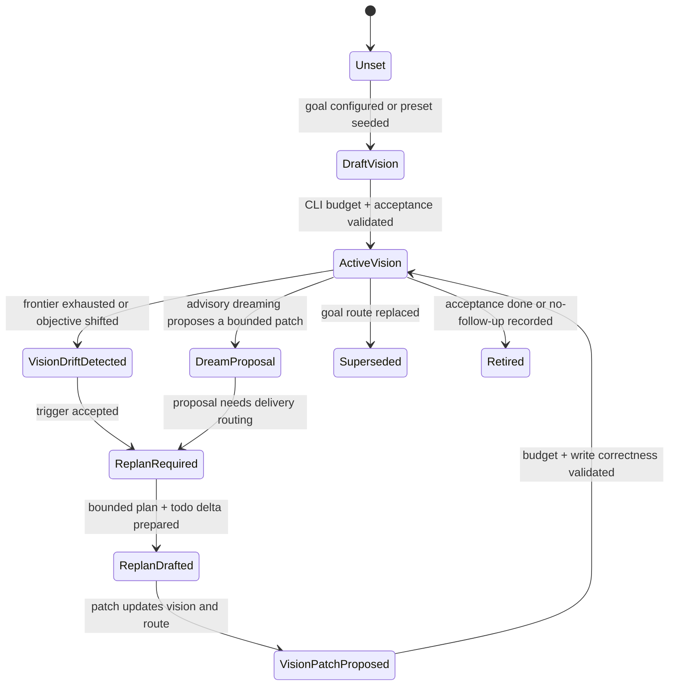

# goal_vision_replan_contract_v0

`goal_vision_replan_contract_v0` defines the small per-goal contract that
connects bounded agent vision, autonomous replan, dreaming proposals, and
goal-routing projection. It is a kernel contract, not an auto-research preset.

The purpose is to keep both the user layer and the product preset thin:

- the user supplies intent and small overrides;
- the preset supplies domain defaults and handoff hints;
- the kernel owns bounded per-agent vision, replan state transitions, and the
  read/write protocol used by quota and status.

## Ownership Boundary

| Layer | Owns | Must Not Own |
| --- | --- | --- |
| User | Objective, optional role overrides, and optional data/eval entrypoint. | Vision state-machine transitions, replan recovery policy, quota routing, or raw agent scratchpads. |
| Preset | Domain roles, handoff hints, metric/evidence adapters, and compact default acceptance text. | Long-lived replan mechanics, pane-local tick policy, generic successor routing, or product-specific forks of the kernel state machine. |
| Kernel | CLI-enforced vision budgets, vision/replan state transitions, goal-route projection, todo/evidence/status protocol, and compact default prompts. | Domain-specific research logic, benchmark scoring, support triage semantics, or sales workflow semantics. |

`loopx/quota.py` should consume the final `goal_route_projection` or
`goal_frontier_projection`. It should not grow per-agent vision storage,
budgeting, dreaming, or product-specific replan logic.

## CLI Budget

Per-agent vision is an executable control-plane field, so the CLI/write API must
enforce a hard size budget before the state reaches quota, status, or a visible
agent pane. Long reasoning belongs in evidence artifacts or design docs.

| Field | Max chars | Purpose |
| --- | ---: | --- |
| `vision_summary` | 420 | Current role-specific direction and success shape. |
| `role_scope` | 280 | What this agent owns and must not own. |
| `acceptance_summary` | 420 | Compact completion contract for this agent. |
| `replan_trigger_summary` | 240 | Why the latest replan is required. |
| `dreaming_policy` | 240 | Whether advisory dreaming can propose a patch. |
| `last_patch_summary` | 240 | What changed in the latest bounded vision patch. |
| `total_agent_vision` | 1200 | Aggregate budget for one agent's active vision packet. |

Required write-path behavior:

1. Reject over-budget writes with `vision_budget_exceeded`, or require an
   explicit compacting command before writeback.
2. Do not silently truncate fields; truncation hides control-plane intent.
3. Store verbose rationale as evidence and reference it by id.
4. Keep the latest bounded packet visible in status/quota so agents can reason
   without reading private scratchpads or chat history.

## State Machine



| State | Meaning | Required Exit Evidence |
| --- | --- | --- |
| `Unset` | No per-goal vision packet exists. | Goal configuration or preset seed. |
| `DraftVision` | A bounded packet is being prepared. | CLI budget validation and acceptance text. |
| `ActiveVision` | Agents may use the packet for lane-local work. | Progress, evidence, replan trigger, or retirement. |
| `VisionDriftDetected` | Current vision no longer explains the frontier. | Concrete trigger, not vague "needs planning". |
| `DreamProposal` | Advisory planning suggests a patch. | Explicit proposal id and public-safe summary. |
| `ReplanRequired` | The next bounded work is replan, not quiet wait. | Replan obligation in goal-route/frontier projection. |
| `ReplanDrafted` | A concrete route/todo/acceptance delta exists. | Bounded patch packet. |
| `VisionPatchProposed` | The patch is ready to apply. | Budget check and local-state write correctness. |
| `Superseded` | Another route replaces this packet. | `superseded_by` or successor id. |
| `Retired` | The route is complete or intentionally closed. | Acceptance evidence or no-follow-up evidence. |

## Replan Triggers

A replan trigger is goal-level and should be evaluated before lane-local quiet
or agent-scope wait decisions:

- normalized progress shows no remaining advancement frontier;
- monitor-only lanes have no material transition and acceptance remains open;
- a cleared handoff has no successor or no-follow-up rationale;
- a periodic autonomous replan obligation is due;
- the user objective or acceptance contract changed;
- an approved dreaming proposal requires a delivery route.

The replan decision must not be disturbed by monitor quiet skip, scoped gate
waiting, or a single agent having no runnable todo. Those may explain local
lane state, but they cannot erase a required goal-level replan.

## Replan Output

A valid replan writes at least one bounded delta:

```json
{
  "schema_version": "goal_vision_replan_contract_v0",
  "goal_id": "example-goal",
  "agent_id": "research-curator",
  "state": "vision_patch_proposed",
  "vision_patch": {
    "vision_summary": "Map the next evidence frontier and hand off one runnable claim.",
    "role_scope": "Owns research framing; does not run evaluation.",
    "acceptance_summary": "One concrete successor todo plus evidence refs.",
    "replan_trigger_summary": "Frontier exhausted while acceptance remains open."
  },
  "todo_delta": ["create_successor", "retire_stale_monitor"],
  "validation": {
    "budget_checked": true,
    "write_correctness_checked": true
  }
}
```

An acknowledgement without a vision, todo, acceptance, or no-follow-up delta is
a `replan_noop` and must not clear the obligation.

## Projection Contract

Status, quota, diagnose, and visible multi-agent panes should expose the same
compact goal-route facts:

- `normalized_progress`: how far the goal has moved relative to acceptance;
- `remaining_frontier`: runnable or replanable next edges;
- `monitor_only_lanes`: lanes that are waiting without advancement;
- `deferred_successors`: successors blocked by handoff, resume, or gate;
- `acceptance_gaps`: missing evidence or contract fields;
- `autonomy_blockers`: concrete blockers to autonomous progress;
- `vision_budget`: current character usage and any rejected overage reason.

These fields are projections. Writeback still goes through LoopX write APIs,
not through dashboards, Lark mirrors, or chat text.

## Acceptance

A change satisfies this contract only when:

- per-agent vision fields are rejected or compacted at the CLI/write boundary;
- replan state is decided from goal-level projection before local quiet/wait
  classifications;
- replan can clear an obligation only by writing a bounded delta;
- `quota.py` consumes the resulting projection instead of storing vision logic;
- auto-research remains a thin preset over the reusable kernel; and
- public docs and smokes cover the budget, state machine, and `quota.py`
  boundary without private material.
