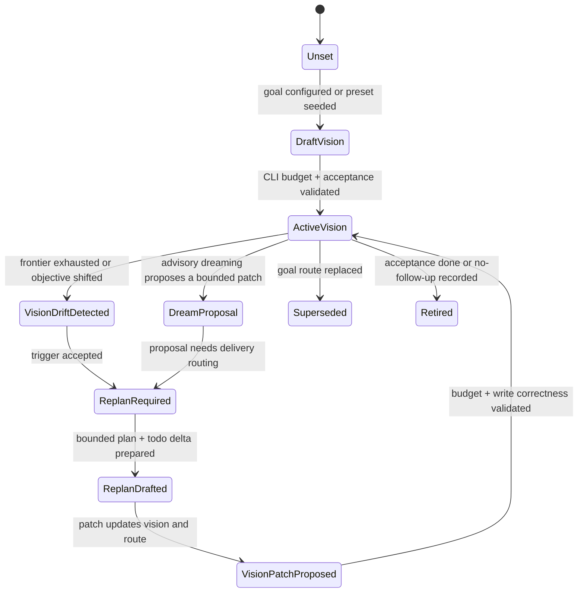

# goal_vision_replan_contract_v0

`goal_vision_replan_contract_v0` 定义连接有界 agent vision、自主 replan、dreaming 建议与 goal 路由投影的小型每 agent 契约。它是内核契约，不是 auto-research preset。

目的是保持用户层与产品 preset 都薄：

- 用户提供意图与小量覆盖；
- preset 提供领域默认值与交接提示；
- 内核拥有有界每 agent vision、replan 状态转换与 quota 和 status 使用的读/写协议。

每个 vision 包与检查点按 `agent_id` 作用域。Goal 级投影可以聚合所得缺口，但它不得让一个角色的 vision 漂移或缺失 closeout 满足、阻塞或唤醒另一角色。

## 所有权边界

| 层 | 拥有 | 不拥有 |
| --- | --- | --- |
| 用户 | 目标、可选角色覆盖与可选数据/评估入口点。 | Vision 状态机转换、replan 恢复策略、quota 路由或原始 agent 草稿。 |
| Preset | 领域角色、交接提示、指标/证据适配器与紧凑默认验收文本。 | 持久化 replan 机制、pane 级 tick 策略、通用 successor 路由或内核状态机的产品特定分叉。 |
| 内核 | CLI 强制的 vision 预算、vision/replan 状态转换、goal 路由投影、todo/evidence/status 协议与紧凑默认 prompt。 | 领域特定研究逻辑、benchmark 评分、支持分类语义或销售工作流语义。 |

`loopx/quota.py` 应消费最终 `goal_route_projection` 或 `goal_frontier_projection`。它不应增长每 agent vision 存储、预算、dreaming 或产品特定 replan 逻辑。

## CLI 预算

每 agent vision 是可执行控制面字段，因此 CLI/写 API 必须在状态到达 quota、status 或可见 agent pane 前强制硬大小预算。长推理属于证据工件或设计文档。

| 字段 | 最大字符 | 用途 |
| --- | ---: | --- |
| `vision_summary` | 420 | 当前角色特定方向与成功形状。 |
| `role_scope` | 280 | 该 agent 拥有且不得拥有什么。 |
| `acceptance_summary` | 420 | 该 agent 的紧凑完成契约。 |
| `advancement_policy` | 32 | `as_needed` 或 `repeat_until_closed`。 |
| `replan_trigger_summary` | 240 | 为何需要最新 replan。 |
| `dreaming_policy` | 240 | 咨询性 dreaming 是否可以建议补丁。 |
| `last_patch_summary` | 240 | 最新有界 vision 补丁改变了什么。 |
| `total_agent_vision` | 1200 | 一个 agent 活动 vision 包的聚合预算。 |

必需写路径行为：

1. 以 `vision_budget_exceeded` 拒绝超预算写入，包括当前字符数、字段限制，以及已知违规字段时的紧凑建议替换。
2. 不静默截断字段；截断隐藏控制面意图。
3. 把冗长理由存储为证据并按 id 引用。
4. 让最新有界包在 status/quota 中可见，使 agent 无需读取私有草稿或聊天历史即可推理。

正常轻量 CLI 写边界是带内联 vision 补丁字段的 `loopx refresh-state`：

```bash
loopx refresh-state \
  --goal-id <goal-id> \
  --agent-id <agent-id> \
  --vision-summary "<bounded direction>" \
  --vision-acceptance "<bounded acceptance>" \
  --vision-advancement-policy repeat_until_closed \
  --vision-replan-trigger "<why the frontier is insufficient>"
```

`advancement_policy` 是小机器可读前沿规则，不是领域标签。它默认为 `as_needed`，只在该等待属于当前 vision、当前阻塞 Todo 或其一显式 successor 血统时保留有界外部等待。无关的推迟 Todo 或历史 ACK 不能抑制验收缺口。对 campaigns、迭代研究、清扫器与其他开放验收在可运行推进前沿为空时需要另一次推进迭代的 vision，使用 `repeat_until_closed`。该模式下，monitor 观察保持有用证据，但不能单独满足推进继续。新鲜证据链接的 vision 路径结局、新具体 blocker、覆盖背书终态结果或关闭/取代的 vision 解决该义务。

对于机器生成或多字段补丁，同一命令还接受 `--agent-vision-json <packet.json>`。两种形式互斥，且都经过同一预算验证。当 vision 派生 replan 义务开放时，有效包只在其携带被共享语义写 gate 接受的新鲜证据链接路径结局时计数。无效、超预算或无路径包失败，而不是记录部分关闭。匹配的类型化语义 ACK 结清 vision 派生义务，即使原始验收缺口在源投影中保持可见。

内联 vision 写入要求 `--agent-id`。JSON 包还必须解析为与 refresh 运行相同的 `agent_id`。这防止 `research-executor`、`evaluator-promoter` 与其他角色覆盖或满足彼此的 active vision。

### 路径增量

机器生成的 vision 包可以包含一个可选 `goal_path_delta_v0`。它使有界 loop 的回看显式，而不增加更多内联 CLI 标志或展开 heartbeat prompt。包通过既有 `--agent-vision-json` 边界写入，并保留在同一 agent 作用域 run 历史与共享运行时 vision 投影中：

```json
{
  "schema_version": "goal_path_delta_v0",
  "outcome": "replan",
  "prior_assumption": "The current monitor lane would produce acceptance evidence.",
  "observed_reality": "Two bounded polls produced no material transition.",
  "retained": ["Keep the verified monitor target and evidence refs."],
  "changed": ["Create one runnable advancement successor."],
  "stopped": ["Stop treating future polling as completion evidence."],
  "unresolved_questions": ["Which successor can falsify the new path?"],
  "reentry_condition": "Resume the monitor-only wait after successor evidence lands.",
  "evidence_refs": ["evidence:monitor-poll-02", "todo:successor-01"]
}
```

`outcome` 是 `continue`、`replan`、`wait`、`no_change`、`ask_human` 或 `stop` 之一。对象存在时 `prior_assumption` 与 `observed_reality` 必需，连同至少一个 `retained`、`changed` 或 `stopped` 项。剩余可选列表保留未解决疑问与公开安全证据 id。外包 vision 包的 `agent_id` 记录谁做了对比；`evidence_refs` 指向证据而不复制长理由或原始工件。

路径增量共享既有 1,200 字符 `total_agent_vision` 预算。标量字段限 180-220 字符；keep/change/stop 列表至多三个 120 字符项、未解决疑问至多两个 140 字符项、证据引用至多四个 140 字符项。写路径拒绝超额数据，而非静默截断。这是紧凑审计/读模型，不是第二规划器或新状态机。观察现实不证明不同路径时，诚实的 `no_change` 仍有效。

`state` 是更低层 `snake_case` 生命周期 token。领域特定状态保持可扩展并视为开放。写路径把 `closed`、`satisfied` 与 `vision_satisfied` 等关闭别名规范化为 `vision_closed`，把 `closed_no_followup` 规范化为 `no_followup`。Quota/status 读取旧持久化包时使用同一中央关闭谓词，因此遗留别名不能静默重新打开已满足 vision。散文或畸形状态值在写边界以可行动错误失败。

有效包包含 `replan_trigger_summary` 时，status/quota 把它投影为 `goal_frontier_projection.acceptance_gaps[]`。若无剩余可运行推进前沿，该缺口在 monitor 静默跳过前被评估，可以产生 `autonomous_replan_required`。这是预期的自发现路径：agent 记录当前 vision 仍不完整的有界原因，LoopX 把该原因变成下一 replan 义务，而不依赖聊天记忆或 owner 提醒。

## Vision 检查点

`refresh-state` 总是发出每 agent `vision_checkpoint_v0`，并默认为 `semantic_closeout` 投递边界。该边界的物化投递结局或持久化 `## Next Action` 更新要求显式 vision 决策：

```json
{
  "schema_version": "vision_checkpoint_v0",
  "agent_id": "research-executor",
  "required": true,
  "satisfied": false,
  "decision": "missing_required",
  "delivery_boundary": "semantic_closeout",
  "triggers": [
    {"kind": "material_delivery_outcome", "delivery_outcome": "outcome_progress"}
  ],
  "required_resolution": ["write_vision_patch", "record_unchanged_reason"]
}
```

进行中投递存在一个显式例外。Quota 准入开放推进 Todo 正常投递时，其结算指引可以添加下面的边界。在所得 `delivery_outcome=outcome_progress` 之后，下一 heartbeat 在其类型化事实保持有效期间单独优先该同一 Todo：

```bash
loopx refresh-state \
  --goal-id <goal-id> \
  --agent-id <agent-id> \
  --todo-id <selected-open-todo-id> \
  --delivery-outcome outcome_progress \
  --delivery-boundary in_flight_continuation \
  ...
```

该边界只在所选 agent 绑定或未认领开放推进 Todo 仍在飞行中时有效。它拒绝 Todo 完成、持久化 Next Action 更新、自主 replan writeback 与 `outcome_progress` 之外的任何结局。其检查点有 `decision=not_required`、`required=false` 与携带 Todo id 的类型化 `in_flight_continuation` 触发。下一 quota 决策因此可以保留因果所有权，而不因 scheduler 唤醒就制造另一个 vision 决策。Agent 必须从 `interaction_contract.cli_channel.next_cli_actions[0]` 开始并保留其投影边界与身份标志；重建通用 `semantic_closeout` 命令会丢弃该连续性契约。

省略 `--delivery-boundary` 保持严格 `semantic_closeout`。Todo 完成、`outcome_gap`、`primary_goal_outcome`、持久化路由变更、replan 与终态/no-follow-up 决策必须使用该边界。这是 vision/Todo 领域转换，不是更轻的 Effect Program 或结算：验证、持久化 writeback、回执与配额记账仍在每个 heartbeat 上运行。

有效检查点决策：

- `patched`：refresh 为同一 `agent_id` 写入了有界 `agent_vision` 包；
- `unchanged_with_reason`：已持久化的当前每 agent vision 仍适用，带紧凑公开安全原因。原因不能创建首个 vision 基线；无基线时检查点保持 `missing_required` 并要求 `write_vision_patch`。TypeScript 通过 `continuity_basis` 把决策绑定到该 vision 的精确 `generated_at` 修订；
- `missing_required`：Turn 是物化的，但没有做出每 agent vision 决策；以及
- `not_required`：无物化 closeout 触发，包括有效类型化 in-flight 继续。

`missing_required` 不是聊天提醒。Status 把它保留在紧凑 run 历史中，quota 按当前 `agent_id` 过滤它，goal-frontier 投影把它变成 `acceptance_gaps[]`。若当前 agent 无可运行推进前沿，该缺口可以触发 `autonomous_replan_required`。对同一 `agent_id`，带 `patched` 或 `unchanged_with_reason` 的更新满足检查点取代旧 `missing_required` 检查点；`not_required` 不取代。

满足的检查点协议完整，但物化 closeout 还要界定其与最终结局的关系。Patched 检查点必须指名活动 `acceptance_summary`、附加公开安全 `goal_path_delta_v0.evidence_refs`，并记录以下决策之一：

- 新证据支持最终结局路径且投递未报 `outcome_gap` 时的 `continue` 或 `no_change`；或
- 证据反驳或使路径保持开放时的 `replan`。类型化路径结局本身就是 vision 决策；它不依赖遗留 autonomous-replan ACK 标志。

`unchanged_with_reason` 检查点只在其类型化 `continuity_basis` 匹配精确当前 vision 修订、且持久化路径已携带验收主张、证据引用与合法路径结局时可复用该证据链接路径。缺失或不匹配 basis、无证据先验路径或新近缺失检查点打开新结局缺口。这关闭被接受的修订，而不抑制后续物化 vision/检查点变更。

更旧路径增量、unchanged-with-reason 决策或无关可运行 todo 不使物化 closeout 合格。Quota 在记录新鲜证据链接继续或 replan 前，把 `vision_outcome_checkpoint_required` 投影在普通可运行工作之前。同一规则适用于同 agent 推进 todo 在最新合格检查点后被完成时。因此 Todo 完成是检查点时序信号，不是最终验收契约已完成的证明；证据决定的是继续、replan/接替还是关闭。

检查点包、上下文投递回执、手动证据读取与历史 autonomous-replan ACK 是协议记录，不是语义完成证明。未来 monitor 计划也不是完成证明；它只说何时轮询。若证据、successor 状态、blocker 状态或接替 vision 包仍显示 vision 未满足，验收缺口保持权威，quota 必须继续投影 replan 工作。写时 gate 从 goal-frontier reducer 派生同一义务，因此维护分类或更早周期义务的 ACK 不能绕过新轮换的 vision 义务。

### 语义历史连续性

`run_history.goals[].latest_runs` 是严格有界的近时下钻。它不得超出请求的显示限制增长，以保留更早控制记录。长程 goal 语义改用 `goal_semantic_history_v0`，一种每 agent 读模型，其大小随参与 agent 而非 heartbeat 数增长。

每个 agent lane 独立选择最新活动 vision（或显式退役）、最新检查点、最新结局相关检查点、最新 autonomous-replan ACK 与最新物化里程碑。goal 还保留最新紧凑人类奖励作为 owner 修正槽。重复配额花费、monitor 轮询、提升就绪与普通 refresh 行不消耗这些语义槽。

结局检查点槽保留其同 run 合格 vision。更新的普通 refresh 可能成为最新通用检查点，但不能隐藏更早物化检查点，也不能借用后续路径增量。同样，另一 agent 的合格检查点不能满足所选 lane。Goal-frontier 读取器优先该语义上下文，只在承载新读模型的旧 status 载荷缺失时才回退到 `latest_runs`。

Agent 作用域 status 热路径只保留所选 agent 的语义 lane 加紧凑 owner 修正槽。Whole-goal、全 agent 历史可通过无作用域 status/history 诊断获得。这使最终结局连续性保持权威，而不把长 heartbeat 线程变成不断增长的 CLI 载荷。

## Vision 继续审计

每个所选 todo 是活动每 agent vision 的有界步骤，不是该 vision 的替代。Agent 记录 `todo complete`、no-follow-up 理由、`--vision-unchanged-reason` 或自主 replan ACK 前，必须对照活动 `acceptance_summary` 审计当前证据：

1. 从活动 vision、当前 todo、用户修正与受保护 scope 推导显式要求。
2. 为每项要求指名权威证据：变更文件、公开安全证据记录、公开 web 研究发现、评估输出、successor 状态、blocker 状态或接替 vision 包。
3. 把弱、间接、过期或仅协议证据视为不完整。
4. 外部研究前，检查所选 goal 的 registry 声明 `topic_authority` 与 `project_materials`，优先 host 投影的 replan 覆盖 ledger、`agent_material_frontier` 与投影的必需读取。使用角色、新鲜度、修订、边界、gate 状态与冲突规则选择允许引用。注册指引发现；它既不授予访问也不证明验收。
5. 若投影证据与允许 registry 引用仍弱，且验收问题依赖公开事实，从主要或权威来源运行有界公开 web 研究，并写回 confirmed/refuted 发现。
6. 若任何要求仍未证明，通过创建 successor todo 或写紧凑 `--vision-replan-trigger` 使 vision 保持活动。

Quota/status 在 CLI 载荷与 `interaction_contract` 中把它暴露为 `vision_continuation_audit_v0`。这镜像 `/goal` 继续规则：goal 状态跨 Turn 持续，直到证据证明请求的终态。它防止角色仅因消费了当前所选 todo、记录了检查点或观察到另一 lane 安静就宣布成功。

带 `result_class=no_followup` 的类型化进展观察是覆盖证据，不是 Todo 生命周期结算。writeback 只在该包以 `state=no_followup` 关闭 agent vision 并记录 `path_delta.outcome=stop` 时可使用其 `coverage_backed_no_followup` 结局。若完成的推进 Todo 仍缺 successor，agent 必须先经 `loopx todo complete --no-follow-up` 结算该 Todo（或添加/链接 successor）。语义 ACK 不能替代该持久化继续，且修复路径不得在没有真实外部权限时发明人类 gate。

审计还为 agent 暴露紧凑确定性 `vision_gap_judge_v0` 指令包。它借鉴自主 goal loop 使用的严格 done-judge 立场而不调用 LLM：agent 被告知把活动 vision `acceptance_summary` 与 host 投影覆盖 ledger、然后允许的 registry 声明物料引用对比。Agent 作用域 `loopx evidence-log` 保持操作员诊断，而非强制模型仪式。当那些来源缺失或过期且缺口依赖公开事实时，有界公开 web 研究是下一回退。`done=true` 只在响应或状态明确提供以下结局之一时有效：

- 带权威证据的显式完成；
- 满足验收摘要的最终交付物或评估输出；
- 使 goal 在无输入时不可达的投影 blocker/用户 gate；
- 显式关闭前沿的接替 vision 或 no-follow-up 理由。

否则 judge 保持 `continue`，quota 应继续投影可运行 successor 或 replan 触发。这有意比 todo 生命周期状态更严格：完成的 todo 只是证据输入，不是 judge 结果。

## 状态机


```mermaid
stateDiagram-v2
  [*] --> Unset
  Unset --> DraftVision: goal configured or preset seeded
  DraftVision --> ActiveVision: CLI budget + acceptance validated
  ActiveVision --> VisionDriftDetected: frontier exhausted or objective shifted
  ActiveVision --> DreamProposal: advisory dreaming proposes a bounded patch
  VisionDriftDetected --> ReplanRequired: trigger accepted
  DreamProposal --> ReplanRequired: proposal needs delivery routing
  ReplanRequired --> ReplanDrafted: bounded plan + todo delta prepared
  ReplanDrafted --> VisionPatchProposed: patch updates vision and route
  VisionPatchProposed --> ActiveVision: budget + write correctness validated
  ActiveVision --> Superseded: goal route replaced
  ActiveVision --> Retired: acceptance done or no-follow-up recorded
```

| 状态 | 含义 | 必需退出证据 |
| --- | --- | --- |
| `Unset` | 无每 agent vision 包存在。 | Goal 配置或 preset 种子。 |
| `DraftVision` | 有界包正在准备。 | CLI 预算验证与验收文本。 |
| `ActiveVision` | Agent 可以按包做 lane 局部工作。 | 进展、证据、replan 触发或退役。 |
| `VisionDriftDetected` | 当前 vision 不再解释前沿。 | 具体触发，而非模糊「需要规划」。 |
| `DreamProposal` | 咨询性规划建议补丁。 | 显式建议 id 与公开安全摘要。 |
| `ReplanRequired` | 下一有界工作是 replan，而非安静等待。 | goal 路由/前沿投影中的 replan 义务。 |
| `ReplanDrafted` | 存在具体路由/todo/验收增量。 | 有界补丁包。 |
| `VisionPatchProposed` | 补丁已就绪可应用。 | 预算检查与本地状态写正确性。 |
| `Superseded` | 另一路由取代此包。 | `superseded_by` 或 successor id。 |
| `Retired` | 路由完成或有意关闭。 | 验收证据或 no-follow-up 证据。 |

规范存储关闭状态是 `vision_closed`、`retired`、`retired_or_superseded`、`superseded` 与 `no_followup`。`completed_current_slice` 这类状态有意保持开放，因为完成一个切片不是每 agent vision 验收满足的证据。

这些关闭状态并非都有相同继任含义。`vision_closed` 意为当前有界阶段通过其验收；而 registry goal 保持 `active`（包括 `active-*` 变体）时，quota 必须投影 `vision_successor_required` 并在普通推进或 monitor 安静前运行有界 replan。Agent 必须写下一个有界 vision，或选择显式终态 lane 语义 `retired`、`superseded` 或 `no_followup`。已完成/归档 registry goal 不需要 successor vision。这防止阶段完成静默终止长程 goal。

### 精确阻塞 successor 等待

当 lane 已有精确当前 agent 或未认领推进 successor，其支持 `resume_when` 条件被投影为 `resume_ready=false` 时，开放 agent vision 不需要另一次 replan。无其他可选推进时，quota/status 暴露带等待 todo id、`resume_when`、紧凑 `resume_condition` 与 `automatic_resume=true` 的 `goal_vision_wait_state_v0`。该读模型活动期间普通 `vision_acceptance_gap` 被推迟，使 agent 可以保持安静，而不是发明重复 successor 工作。

这是读模型，不是存储的 vision 或 todo 生命周期状态。条件就绪时，普通开放 todo 或推迟 successor 路由自动恢复，活动 vision 保持可用于验收审计。它不能抑制 `vision_checkpoint_missing`、`vision_successor_required`、缺乏精确投影证据的恢复条件，或对被常驻连续 monitor 错误关卡的推进 todo 的专门修复。

## Replan 触发

Replan 触发是 goal 级的，应在 lane 局部安静或 agent 作用域等待决策前评估：

- 规范化进展显示无剩余推进前沿；
- 纯 monitor lane 无物化转换且验收保持开放；
- 已清理交接无 successor 或 no-follow-up 理由；
- 当前 agent lane 有长可选 todo 链，如 15 个以上推进 todos 或约 20 个开放 todos 且仍有推进工作；
- 周期性自主 replan 义务到期；
- 用户目标或验收契约变更；
- 已批准的 dreaming 建议需要投递路由。

Replan 决策不得被 monitor 静默跳过、作用域 gate 等待或单个 agent 无可运行 todo 干扰。那些可以解释局部 lane 状态，但不能抹除必需的 goal 级 replan。

## Replan 输出

有效 replan 至少写一个有界增量：

```json
{
  "schema_version": "goal_vision_replan_contract_v0",
  "goal_id": "example-goal",
  "agent_id": "research-curator",
  "state": "vision_patch_proposed",
  "vision_patch": {
    "vision_summary": "Map the next evidence frontier and hand off one runnable claim.",
    "role_scope": "Owns research framing; does not run evaluation.",
    "acceptance_summary": "One concrete successor todo plus evidence refs.",
    "replan_trigger_summary": "Frontier exhausted while acceptance remains open."
  },
  "path_delta": {
    "schema_version": "goal_path_delta_v0",
    "outcome": "replan",
    "prior_assumption": "The existing frontier could satisfy acceptance.",
    "observed_reality": "No runnable advancement remains.",
    "retained": ["Keep verified evidence and the acceptance boundary."],
    "changed": ["Route one new bounded successor."],
    "stopped": ["Stop repeating the exhausted action."],
    "evidence_refs": ["evidence:frontier-review-01"]
  },
  "todo_delta": ["create_successor", "retire_stale_monitor"],
  "validation": {
    "budget_checked": true,
    "write_correctness_checked": true
  }
}
```

无义务接受类型化语义增量的确认是 `replan_noop`，不得结清义务。视义务而定，接受的结局可以是新证据支撑的界面、假设或 probe 家族；可运行 successor；新具体 blocker；覆盖背书的探索耗尽或 no-follow-up；或新鲜证据链接的 vision 路径结局。类型化 `goal_vision_patch` 修复增量是结清 vision successor/检查点缺口的 vision 派生 ACK，即使原始验收缺口在源投影中保持可见。`refresh-state` 不把分类散文、`--autonomous-replan-recorded` 或调用方提供的修复种类当作证明。新 writeback 使用 `typed_progress_observation_v0`：变更界面、假设或 probe 标识与义务基线对比；successor id 必须解析为当前可运行推进 Todo；blockers 必须新且证据背书；终态结果要求覆盖 scope 与证据。Vision 派生义务只接受其声明的 vision 结局。历史修复 ACK 不被语义 replan reducer 接受；它们保持惰性历史，而非兼容关闭路径。

紧凑 `autonomous_replan_ack` 投影在 `semantic_delta` 中保留聚合 `fresh_vision_path_outcome`，且该结局位于已验证 `outcomes` 列表时，把同一 run 的 `agent_vision.path_delta.outcome` 作为顶层 `path_disposition` 添加。只有 `continue`、`no_change` 与 `replan` 被投影。该字段是增量和观察性的：它不改变结算，且对非 vision、遗留或无效路径包省略。消费者应检查 `outcomes` 而非仅 `satisfying_outcomes`，因为一个接受 ACK 可能把一个 vision 路径观察与不同义务满足结局结合。

### 坏例：被 Scheduler 记账隐藏的 ACK

观察到的失败：一个纯 monitor lane 正确投影 `autonomous_replan_required`，随后 worker 记录带前沿增量的 replan ACK。下一次 quota 检查变安静，但后续中性花费或记账 run 替换了最新 status 记录。因为 quota 只看到最新 run，同一 monitor lane 又被投影为 `autonomous_replan_required`，造成 scheduler/replan 循环。

根因：replan ACK 状态被当作最新 run 详情，而非持久化 goal-frontier 投影。Scheduler/记账记录是有用历史，但不是物化前沿变更。

修复规则：status 必须跨中性记账与 monitor 轮询 run 投影最新持久化 replan ACK，直到真实物化迁移出现。Quota 随后消费该紧凑投影，不重复历史扫描，也不让 scheduler 退避覆盖 replan 状态机。

## 投影契约

Status、quota、diagnose 与可见多 agent pane 应暴露同一紧凑 goal 路由事实：

- `normalized_progress`：goal 相对验收移动了多少；
- `remaining_frontier`：可运行或可 replan 的下一边缘；
- `monitor_only_lanes`：无推进的等待 lane；
- `deferred_successors`：被交接、恢复或 gate 阻塞的 successors；
- `acceptance_gaps`：缺失证据或契约字段；
- `autonomy_blockers`：对自主进展的具体 blockers；
- `vision_budget`：当前字符用量与任何拒绝的超额原因。

这些字段是投影。Writeback 仍经 LoopX 写 API，而非 dashboard、Lark 镜像或聊天文本。

Quota 需要自主 replan 时，host 把当前 agent 的近期公开安全证据 ledger 投影进 `replan_context_v0`；弱的协议遵循模型不需要发现并执行单独读仪式。Todo 特定证据读取仍有用作下钻，但其回执只证明上下文访问。投影证据为空、过期或矛盾时，agent 可以使用有界公开安全搜索，并把来源引用随类型化观察写回。

## 写/修正机制

Vision 修正是正常状态机迁移，不只是自修复回退。Agent 应在以下情况写有界 vision 补丁：

- 正常进展 Turn 改变了角色的验收目标；
- 用户修正收窄或重定向 goal；
- replan 发现当前前沿不再满足验收摘要；
- 纯 monitor lane 应保持 watch lane，但需要显式继续或过期条件，包括显式 monitor successors 与 watch ACK；或
- 产品瓶颈真实，但当前 todo/frontier 投影不暴露它。

内联标志保持普通路径小。角色可以只更新它知道的字段：内联写入把这些字段合并进该 agent 的最新活动 vision，保留省略的持久化主线字段与当前状态。Todo、PR、capability 或 monitor 等待通常应更新自身 todo 加 `replan_trigger_summary` 或 `last_patch_summary`；它不得仅因该依赖是当前的就替换角色更宽 `vision_summary`。

JSON 包是完整生成更新。满足当前 vision 派生 replan 义务时，改变既有 `vision_summary`、`role_scope`、`acceptance_summary` 或 `advancement_policy` 需要带 `outcome=replan` 的 `goal_path_delta_v0`，无论更新经 JSON 还是内联标志到达。这使真实主线变更可行，同时让先前假设、观察现实与 retained/changed/stopped 路由机器可审计。未变更完整包、非 replan 内联编辑与初始基线不需要路径增量。

无需补丁时，agent 仍应用 `--vision-unchanged-reason` 关闭必需检查点。该原因按 agent，必须解释既有验收与路由为何仍覆盖物化 closeout。

## 验收

一项变更只有满足以下条件才符合本契约：

- 每 agent vision 字段在 CLI/写边界被拒绝或压缩；
- 内联 vision 写入要求具体 `--agent-id`；
- 物化 `refresh-state` closeout 发出每 agent `vision_checkpoint_v0`；
- 缺失每 agent 检查点可以成为 agent 作用域 replan 缺口，而非全局 goal 级噪声；
- quota/status 与 `interaction_contract` 在 todo closeout、no-follow-up、`--vision-unchanged-reason` 或类型化 replan writeback 前暴露 `vision_continuation_audit_v0`；
- 普通 `refresh-state` 调用可写有界 vision 修正，而无需单独自修复路径；
- replan 状态在局部安静/等待分类之前从 goal 级投影决定；
- replan 只能通过写当前 goal-frontier 义务接受的类型化语义增量结清义务；
- 持久化 replan ACK 在物化前沿状态变更前存活中性 scheduler/记账 run；
- `quota.py` 消费所得投影，而非存储 vision 逻辑；
- auto-research 保持可复用内核之上的薄 preset；并且
- 公开文档与 smokes 在无私有物料的情况下覆盖预算、状态机与 `quota.py` 边界。
