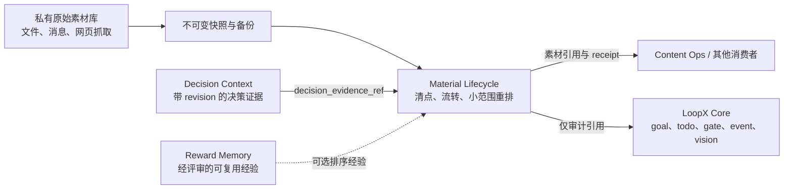

# Material Lifecycle 架构 v0

## 定位

Material Lifecycle 是 LoopX 内置、默认关闭、goal-scoped 的素材生命周期
capability。它管理可审计的素材引用状态：清点、备份安全迁移、候选/归档
流转和小范围重排；不拥有原始文档、私有来源位置、provider 凭据，也不创造
Core goal authority。

它与 Decision Context、Reward Memory 同级，但职责不同：

- Decision Context 判断当前决策应相信哪些事实；
- Material Lifecycle 判断哪些素材处于候选、活跃、归档、carryover 状态，
  以及哪些条目可以被小范围重排；
- Reward Memory 保存经过评审、可复用的策略和经验；
- Content Ops 等能力消费选中的素材，不拥有候选/归档真值。

## Stage-0 契约

`material_store_inventory_v0` 是只读、公开安全的素材库清点结果，只记录
不透明的快照、备份、digest、revision、数量、解析错误和验证引用，不携带
原始素材或私有位置。

`material_migration_plan_v0` 固定迁移顺序：

1. 建快照；
2. 清点；
3. 双读；
4. 对账；
5. owner gate；
6. apply；
7. 保持 rollback 可用。

迁移计划本身不授权修改原始素材库。

`material_lifecycle_receipt_v0` 记录 `unread`、`candidate`、`active`、
`carryover`、`archived` 之间带 authority 引用的流转。authority 可以是经
评审的 goal policy、Decision Context outcome 或人工 gate。归档和重新激活
都保留稳定的 material/archive 引用，不把原始内容复制回新队列。

`material_rerank_proposal_v0` 只表达受限增量：

- 一个目标窗口；
- 最大移动条数；
- 最大位移；
- 受保护条目；
- 带 revision 的 Decision Context 证据；
- 显式 no-change。

`material_rerank_apply_receipt_v0` 与 proposal 分离。真正 apply 必须记录
owner gate、验证引用、前后 revision；发生修改时还必须有 rollback 引用。

`material_ranked_entry_rebuild_plan_v0` 负责小范围 rank move 无法表达的结构
修复。超过成员预算的 ranked entry 必须拆成两个或更多可以独立排序的条目，
不能把 overflow 隐藏到 supporting-only index。调用方在 exact read 后提供语义
分组，provider-neutral builder 统一执行以下硬门禁：

- 每个重建条目最多包含 `max_materials_per_entry` 个素材引用；
- 每个源素材引用在完整结果中恰好出现一次；
- child entry 保留精确 source-entry 成员关系，但 exact-read 语义分组可以替换
  旧存储中的偶然顺序；
- 完整 ranked set 的 target rank 唯一且从 1 连续；
- 未拆分条目保留原引用，拆分 child 根据 source entry 与有序成员生成确定性引用；
- 可选的 material-level rank anchor 必须留在受保护的 target rank。

完整 ranked set 可以大于活跃窗口。窗口外条目进入显式 ranked backlog，仍属于
排序系统，而不是“隐藏材料”。`material_ranked_entry_rebuild_apply_receipt_v0`
记录 owner-gated cutover、验证、前后 revision、数量与 rollback 引用。两个 packet
均不携带标题、正文、来源位置或凭据。

## 迁移边界

旧 Markdown、数据库、inbox 等存储在以下条件满足前始终是 authority：

- 已建立不可变快照和可验证备份；
- material ID 与来源引用稳定；
- 解析错误可计数；
- 新旧双读的总量和生命周期状态一致；
- rerank proposal 可确定性回读；
- cutover 与 rollback 都经过 owner gate。

通用 capability 不内置某种 Markdown parser 或私有目录结构。provider
adapter 可以与旧存储长期共存，直到完成对账。

## 只读准备路径

`MaterialInventoryProvider` 是 legacy store 的私有 adapter 边界。它只返回
瞬态元数据 `MaterialStoreSnapshot`：不透明 snapshot/backup 引用、revision、
digest、生命周期计数、解析错误引用，以及三个显式验证结果：

- stable material ID 已验证；
- backup 已验证；
- 清点前后的 source digest 一致。

`prepare_material_migration` 把瞬态 snapshot 转成既有的
`material_store_inventory_v0`。只有三个验证均通过且没有解析错误时，才生成
`material_migration_plan_v0`；否则只返回确定性的 readiness blocker，不生成
计划。provider contract 没有 apply 方法，两个 packet 也始终保持
`source_mutation_authorized=false`。

具体 provider 与私有文件布局留在通用 capability 之外。本地 host adapter 可以
解析 Markdown、数据库或其他来源，但必须证明同一组只读与 backup invariant，
LoopX 才会准备迁移。

## Owner-Gated Apply 与回滚

`MaterialMigrationApplyProvider` 是私有写 adapter 边界。通用 capability 不接收原始
材料或私有位置，只编排五个显式步骤：

1. 用准备阶段的 source revision 对当前 authority 做 compare-and-swap；
2. 以原子写入和读回验证生成 staged store；
3. staging 后再次检查 source authority revision；
4. 双读对账 stable ID、item count、lifecycle count 与 content parity；
5. 携带显式 owner-gate reference，原子切换 authority pointer。

`material_migration_apply_receipt_v0` 记录 before/after revision、target digest、item 与
lifecycle count、reconciliation reference、authority reference、rollback reference，
以及已验证的 CAS、原子写入和读回不变量。Receipt 仍保持 public-safe，不携带正文。

回滚复用同一个 authority-pointer CAS。只有当前 authority 仍等于已应用的 target
revision 时才继续，且需要独立 owner-gate reference，最终生成
`material_migration_rollback_receipt_v0`。Provider 负责文件系统、数据库或对象存储的
具体机制；capability 负责顺序、不变量和可审计 receipt。

## 决策驱动的排序与探索

provider-neutral 的决策规划路径接收 Decision Context 产出的、经过验证且
公开安全的 `decision_evidence_packet_v0`。可替换 policy 可以据此生成既有的
`material_rerank_proposal_v0`，以及可选的 `material_explore_intent_v0`。

explore intent 只携带不透明 topic/evidence 引用，并限定 topic 数、
provider 调用数、新增候选数与显式 stop condition。它仅用于分析：创建 intent
不会调用 provider，也不会推进 source cursor。policy 不可用或输出非法时，
规划会 fail open 为可审计的 no-change proposal，并丢弃不完整的探索输出。

`execute_material_explore_intent(...)` 是显式的只读执行边界。私有宿主提供
瞬时 query、已配置的 `ContextProvider` 与 execution-authority 引用。执行器
强制 intent 的调用与候选预算，query、资源位置与正文都留在进程内，只输出
含不透明结果引用与紧凑 telemetry 的 `material_explore_execution_receipt_v0`。
Provider 失败时 fail open。

该 receipt 不能授权重排、插入候选、推进 cursor 或任何源改动。任何命中都只是
候选，必须经过独立的 managed-material exact read 对照当前 authority 验证后
才会生效。

搜索引擎、联网客户端、消息和仓库 scanner 仍是可替换 provider；其 raw query、
输出、凭据和私有位置都不能进入公开 packet。

因此 recurring automation 最终只负责唤醒 goal 和调用 capability。
来源清单、增量 cursor、排序规则与探索预算应位于 ignored 的 goal-scoped
配置和受验证 receipt 中，而不是写进 automation prompt。

## 阶段边界

当前 capability 交付确定性契约、provider-neutral 的只读准备路径、owner-gated
apply/rollback 编排、受限决策规划与探索执行、catalog 可见性、架构 CLI、聚焦
测试和公开 smoke，不交付：

- 内置 legacy 素材 parser 或私有写 adapter；
- 原始素材持久化；
- 内置决策 policy；
- 联网探索 provider；
- 群聊/关键联系人 source profile；
- 自动重排、provider 调用、自动归档或自动推进 cursor。

这些能力必须经过私有只读 adapter、精确双读对账和显式 owner gate。
