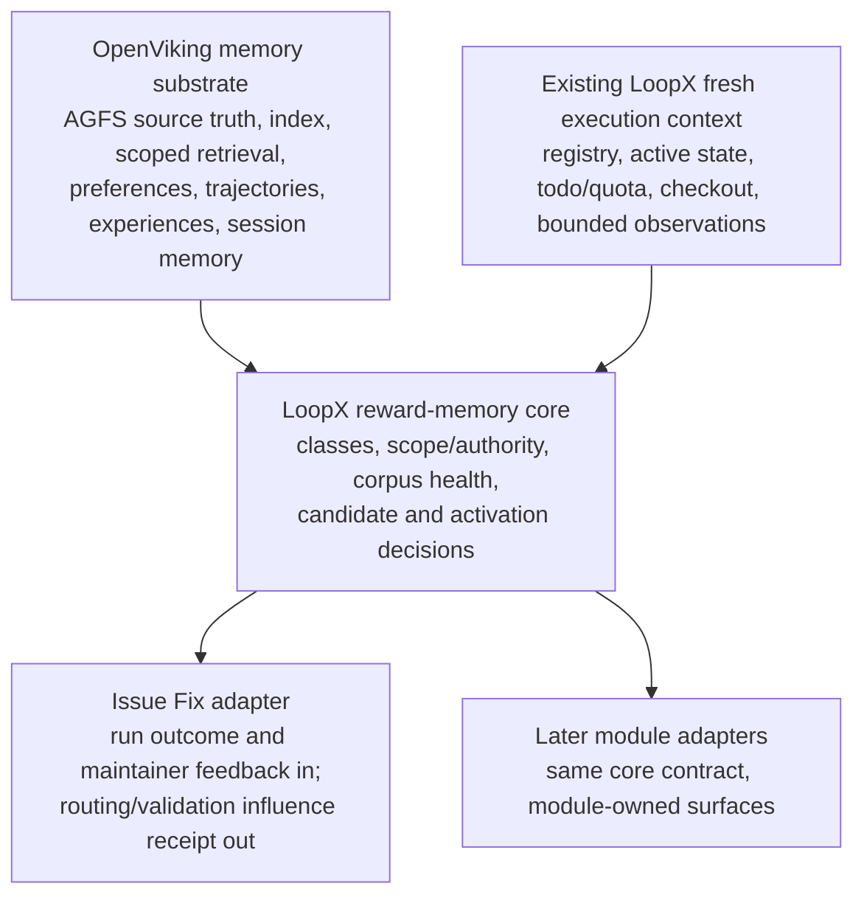

# Reward Memory Architecture v0

[中文版](reward-memory-architecture-v0.zh-CN.md)

LoopX separates feedback evidence, policy content, and action authority so a
useful judgment does not silently become a universal personal profile or create
permissions that the actor never held. Feedback from a verified repository
owner or core contributor may still derive durable policy content inside that
actor's independently verified repository scope. The distinction is between
inferring what the contributor wants and inventing what the contributor is
authorized to permit.

This Stage-0 contract defines five memory classes, guarded precedence, and the
pilot/meta delegation boundary. Stage 1 adds the corpus registry and health
read model. Neither stage adds a second memory store, candidate scheduler,
provider write, cross-module recall, evaluation harness, or rollout.

The machine-readable contract is available through:

```bash
loopx reward-memory architecture --format json
```

## Five first-class classes

| Class | Source and scope | Authority and use | Lifecycle |
| --- | --- | --- | --- |
| `run_bound_reward` | Explicit human judgment attached to one exact goal/run. | Evidence about that outcome only. Future influence requires compact candidate derivation and an activation policy; the overlay itself is not a standing instruction. | Append-only overlay; corrections and revocations append references instead of rewriting the judged run. |
| `hard_policy` | Explicit user/repository/operator authority, or policy content inferred from verified owner/core-contributor evidence and bound to an existing project/action authority scope. | Constraint or veto inside the verified scope. Reasoning may infer policy meaning from rewards, preferences, current-artifact-verified experience, selected options, accepted/rejected outcomes, and maintainer corrections; it may not infer credentials, new publish/production scope, or cross-user/repository authority. | Active records retain actor, evidence, scope, and derivation provenance until superseded, revoked, or expired; temporary or weakly reinforced inference should expire or return to review. |
| `soft_preference` | Explicit feedback, selected options, or later reviewed candidates scoped to a workspace/project and module-owned surface. | Advisory ranking or rewrite only. It cannot grant publish, merge, write, credential, or production authority. | Durable only after explicit review; editable, rejectable, supersedable, revocable, and retireable. |
| `procedural_experience` | Revision-stamped trajectories, distilled experiences, maintainer corrections, accepted/rejected changes, and reviewed architectural learning, with repository/module/revision/applicability scope. | Advisory diagnosis, scope, routing, or validation guidance only after current-artifact verification. A training/evaluation case is evidence, not an executable instruction. Retrieval alone has zero patch authority. | Trajectories may be add-only; distilled or architectural experiences are supersedable. New source truth can stale, quarantine, refute, or retire them. |
| `working_context` | Either fresh execution state (`fresh_execution_context`) or a revisioned session-continuation summary (`session_working_memory`). | Supports only the current execution/session continuation. Neither subtype becomes reusable policy or grants action authority. Fresh source-of-truth reads outrank recalled material. | `fresh_execution_context` already exists in LoopX registry/state/todo/quota/checkout observations and is reused, not rebuilt. Session context remains bound to its session/archive revision. |

Every durable record must name `source`, `scope`, `authority`, `confidence`,
`lifecycle_state`, `supersession`, `revocation`, `expiry`, and `privacy` in
addition to the class. Confidence describes evidence quality; it never
increases authority. Confidence is `low`, `medium`, or `high` with a required
basis; source names kind/ref/actor/time, scope names user/workspace,
project/repository, module/surface, and revision/time boundaries. Lifecycle
records state plus supersession, revocation, expiry, and retirement references.
Privacy names visibility, retention class, and whether raw content was captured.

## Policy content versus authority

Hard policy has two independent questions:

1. **What is the policy?** LoopX may infer compact policy content from explicit
   feedback, reviewed preferences, current-artifact-verified experience,
   selected options, repeated accepted or rejected outcomes, and maintainer
   corrections.
2. **Where does that policy have force?** Actor identity and repository/action
   authority must come from an independently verified source. Memory confidence
   cannot create or widen that scope.

For a verified repository owner or core contributor, an unambiguous inferred
policy may become active without asking the same question after every run when
all of these hold: actor and authority scope are verified, provenance is
compact and inspectable, no higher-authority source conflicts, and the record
is reversible through edit, supersede, revoke, retire, or expiry. Ambiguous
meaning, unclear scope, identity uncertainty, or a conflict returns the item to
review. Inference never creates credentials, external-write capability,
production permission, cross-agent authority, or authority in another
repository.

Inference may derive a reusable boundary or gate policy, but it cannot fabricate
the current state transition of a concrete operator gate or authority
checkpoint. A current approve/reject/consume receipt still comes from that
gate's source of truth.

## Guarded precedence and model reasoning

The following order is a safety and attention envelope, not an exhaustive
decision table:

1. explicit action authority and privacy boundaries;
2. active in-scope hard policy;
3. fresh working context and current source of truth;
4. current-artifact-verified procedural experience;
5. active in-scope soft preference;
6. run-bound reward as evidence only.

Deterministic code should reject illegal states: unverified authority, wrong
project or surface, revoked/expired material, privacy violations, unresolved
same-authority conflicts, and missing current-artifact verification. Within the
remaining allowed action set, the model keeps responsibility for interpreting
feedback, judging relevance and evidence sufficiency, balancing trade-offs,
and deciding to apply, ignore, or seek more evidence. Its compact receipt names
the reasoning summary, memory references, artifact verification, and
authority/scope check.

Prefer explicit provenance when evidence is otherwise equal, but do not turn
that preference into a hard-coded router that suppresses useful inference. Raw
chat, transcripts, tool logs, credentials, and local paths are not
reward-memory records.

`loopx reward-memory route-check` is a deterministic regression fixture for
obvious safety/escalation conditions such as PR #3237. It is not the live Issue
Fix decision engine and does not replace model reasoning.

## Architecture layers and reuse



OpenViking owns memory storage, indexing, scoped retrieval, and session-memory
building blocks. LoopX owns action semantics: class, scope, authority,
lifecycle, candidate derivation, activation, and application receipts. The
Issue Fix adapter maps issue/PR evidence into the shared core and consumes its
decisions; it must not grow a parallel memory store, policy schema, or ranking
pipeline. Other modules join only after this reuse seam is proven.

### Issue Fix as the first adapter

Issue Fix contributes only domain mapping:

- exact run reward, maintainer correction, selected fix direction, and durable
  issue/PR outcome become compact inputs to the shared candidate contract;
- repository identity, contributor role, current checkout, issue/PR state, and
  active LoopX gates supply current authority and execution context;
- OpenViking supplies scoped preference or experience retrieval when the
  module asks for it;
- the shared core returns apply, ignore, seek-evidence, or review, together
  with a compact influence receipt;
- Issue Fix still verifies any recalled technical claim against current code
  and tests before it can affect a patch.

The adapter does not own candidate lifecycle, contributor-policy semantics,
retrieval health, or provider persistence. Those stay reusable core concerns.
This keeps the issue-fix scenario valuable without letting it define the whole
memory product.

## OpenViking alignment

The five classes are provider-neutral, but the Stage-0 boundary was checked
against OpenViking's current public architecture and code:

- OpenViking is a context database, not an action-authority system. AGFS
  content is its source of truth; the vector index stores retrieval references.
- OpenViking `preferences` can supply reviewed `soft_preference` candidates.
  They never become permission.
- OpenViking `trajectories` are add-only operation contracts distilled from one
  execution. OpenViking `experiences` are upserted, executable-looking
  generalizations that may explicitly `supersede` an older experience. Both map
  to advisory `procedural_experience`, subject to current-revision verification.
- OpenViking `cases` explicitly define a task and rubric for training or
  evaluation; they are not experience instructions and cannot be injected as
  policy.
- OpenViking Working Memory is a seven-section archive overview used for
  session continuation. It maps to `working_context/session_working_memory`,
  not long-term policy. LoopX's fresh registry/todo/checkout observations map to
  the separate `fresh_execution_context` subtype.
- OpenViking `soul.md` or another provider record may contain policy evidence,
  but it becomes LoopX `hard_policy` only when the actor and repository/action
  authority scope are independently verified. The content may be inferred; the
  authority may not.
- Account, user, peer, session, and repository-revision boundaries remain part
  of scope and privacy. A peer label does not grant cross-user or cross-agent
  authority.

Provider health is intentionally decomposed into `corpus_present`,
`index_present`, `retrieval_query_succeeded`, `result_readback_verified`, and
`memory_applied_with_receipt`. These states must not be collapsed. In
particular, the current OpenViking Codex auto-recall path configures the
`experiences` quota to zero, so an experience corpus can exist without being
automatically recalled. Stage 1 owns that inventory and health proof; Stage 0
does not claim it.

Grounding references: OpenViking
[architecture](https://docs.openviking.ai/en/concepts/01-architecture),
[session management](https://docs.openviking.ai/en/concepts/08-session),
[multi-tenant and peer isolation](https://docs.openviking.ai/en/concepts/11-multi-tenant),
and source revision
[`ba46491`](https://github.com/volcengine/OpenViking/tree/ba46491af0a79467ea268ef370e35b68f86abf73).

## Pilot/meta delegation

The pilot may take a fix only when behavior is a confirmed bug, scope is one
bounded surface, the change does not alter a semantic contract or place
product-specific policy in a generic boundary, reproduction and validation are
named, edge-case complexity is low or medium, and all relevant evidence is
present. Meta design review is required for by-design or uncertain semantics,
a semantic-contract change, cross-surface change, generic-boundary leakage, or
high edge-case complexity.

Evidence requirements are relevance-gated instead of using a blanket
"core-component" rule: effect evidence is always required; UX evidence is
required for a user-visible behavior change; performance evidence is required
for a hot-path or storage-behavior change; benchmark evidence is required only
when retrieval or memory quality is claimed. Missing required evidence without
a meta trigger produces `hold_for_evidence`. This allows a bounded bug inside a
core module to remain pilot-sized while still escalating a deceptively small
change that alters a public or storage contract.

This is guarded routing, not cross-agent authority. The live agent still
reasons about semantics and evidence inside the guards. The meta lane does not
edit or claim the pilot's todos, and the pilot cannot bypass the design gate
with a memory hit.

## PR #3237 regression

[OpenViking PR #3237](https://github.com/volcengine/OpenViking/pull/3237) is the
negative regression. It tried to make generic directory listing reflect
session-specific activity across backend and Web Studio surfaces even though
the maintained directory-mtime behavior was by design. The resulting patch
changed a generic filesystem/session contract for one product-specific edge
case, crossed backend and Web Studio surfaces, and added metadata reads on a
listing/storage path. It lacked product-effect, UX, and performance evidence.
Benchmark evidence is not required by this regression because it made no
retrieval or memory-quality claim.

The stable expectation is `meta_design_gate`, not `pilot_fix`. Meta may narrow
the product behavior to a session-specific presentation boundary or close the
change; a prior memory result cannot authorize the generic-layer patch.

```bash
loopx reward-memory route-check --case pr-3237 --format json
```

## Staged ownership

- Stage 0: this classification, precedence, and delegation contract.
- Stage 1: the implemented provider-neutral
  [corpus registry and health contract](reward-memory-corpus-registry-v0.md),
  including ownership, authority, freshness, retirement, scope isolation, and
  retrieval-health distinctions. Its `fresh_execution_context` entry describes
  an existing LoopX capability; it is not a request for another context system.
- Stage 2: one thin candidate and activation-decision seam over existing
  LoopX/OpenViking evidence. It adds no second store, scheduler, automatic
  recall, or raw-content retention. Issue Fix is the first adapter and reuses
  the generic record/decision shape.
- Stage 3: opt-in cross-module recall with model reasoning inside deterministic
  scope, authority, privacy, freshness, and conflict guards, plus compact
  application receipts.
- Stage 4: evaluation harness and release gate.
- Stage 5: bounded cross-module dogfood and operator edit/retire controls.

Later stages must extend this contract rather than collapsing these classes,
duplicating existing context/provider capabilities, or turning provider
availability into a user gate. Stage 1 remains a stateless read model and
performs no provider or external write.
