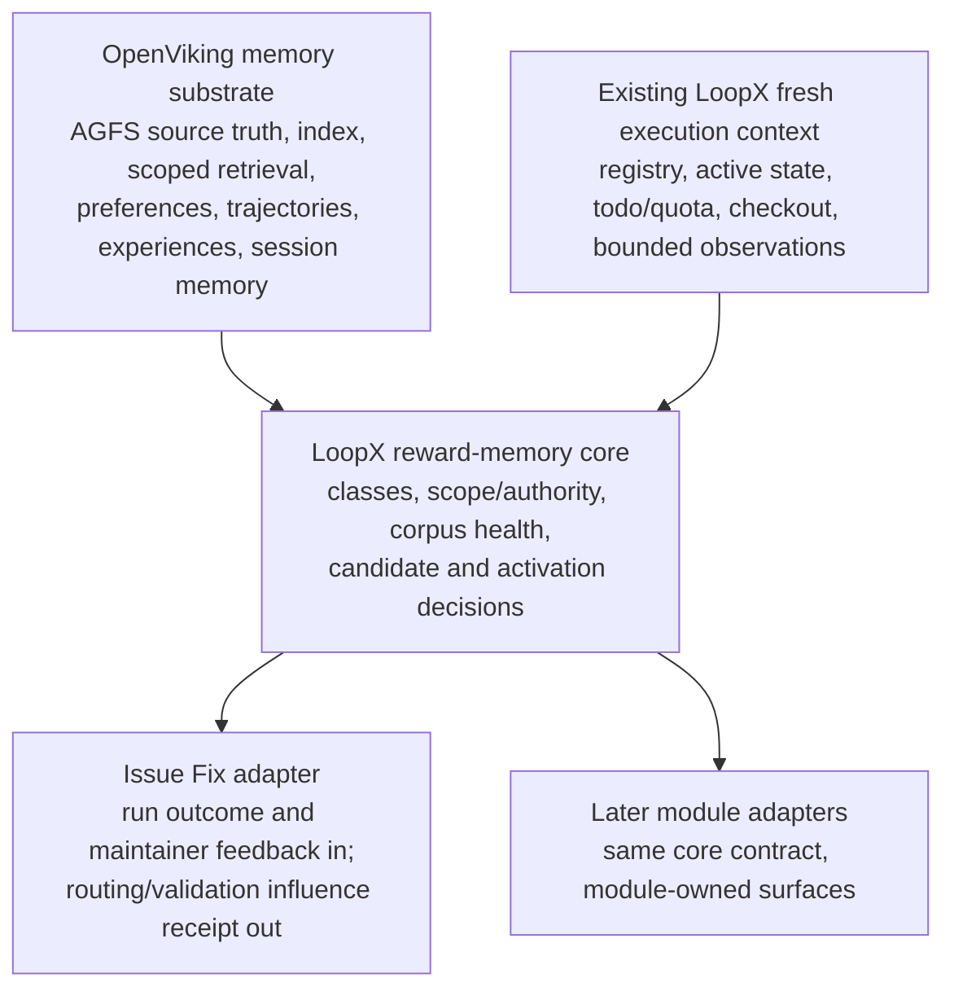

# Reward Memory Architecture v0

[中文版](reward-memory-architecture-v0.zh-CN.md)

LoopX separates feedback evidence, policy content, and action authority so a
useful judgment does not silently become a universal personal profile or create
permissions that the actor never held. Feedback from a verified repository
owner or core contributor may still derive durable policy content inside that
actor's independently verified repository scope. The distinction is between
inferring what the contributor wants and inventing what the contributor is
authorized to permit.

This contract defines five memory classes, guarded precedence, and the
pilot/meta delegation boundary. Stage 1 adds the corpus registry and health
read model. Stage 2 adds the stateless candidate/review seam. Stage 3 adds
explicit recall/application. The minimal ingest loop only composes those seams
into one corpus-owner-authorized provider write and exact readback. It adds no
second memory store, candidate scheduler, semantic router, evaluation harness,
or rollout. The opt-in runtime hooks reuse these seams at module-owned
boundaries; they do not create a background learner.

The machine-readable contract is available through:

```bash
loopx reward-memory architecture --format json
loopx reward-memory candidate-review --case issue-fix-verified-contributor --decision accept --format json
loopx reward-memory ingest-event --input full-public-fixture.json --format json
```

## Experimental activation

Reward Memory is a provider-neutral, default-off experimental goal capability.
It is enabled for named registered agent lanes, not for a whole LoopX install:

```bash
# Preview first; add --execute only after checking the boundary change.
loopx configure-goal --goal-id <goal> \
  --reward-memory-config .loopx/config/reward-memory/experiment.json \
  --reward-memory-agent <registered-agent>

loopx reward-memory experiment-status \
  --goal-id <goal> --agent-id <registered-agent> --format json
```

The registry retains only `enabled`, `experimental`, an ignored repo-relative
config pointer, and the explicit agent allowlist. Provider-specific choices
therefore stay local and private. OpenViking is the first provider used by the
Issue Fix pilot, but it is not a global LoopX feature flag or mandatory
dependency; another provider can satisfy the same binding contract.

Config v1 declares one `project_provider_binding`, its exact per-corpus scope
references, the project corpus set, module-owned surfaces, and an automation
policy. A surface explicitly lists its compatible `corpus_ids`, selects one
`ingest_corpus_id`, and owns its `recall_profile`. LoopX never discovers routes
by scanning all corpora. Corpora assigned to one surface must have the same
memory class, authority, privacy, freshness, and lifecycle. Scope digests and
provider/corpus identity are still checked independently for every corpus.

```json
{
  "schema_version": "reward_memory_experiment_config_v1",
  "project_provider_binding": {
    "provider_id": "openviking",
    "namespace": "reward_memory",
    "corpus_scopes": [
      {"corpus_id": "review_policy", "scope_ref": "viking://.../review-policy"}
    ]
  },
  "corpora": [
    {"corpus": {"corpus_id": "review_policy"}, "standing_policy": {}}
  ],
  "surfaces": [
    {
      "surface_id": "reviewer_artifact.summary",
      "adapter": "scoped_feedback",
      "corpus_ids": ["review_policy"],
      "ingest_corpus_id": "review_policy",
      "recall_profile": {
        "profile_id": "review_summary_v1",
        "mode": "function_boundary",
        "max_queries": 1,
        "limit": 4
      }
    }
  ],
  "automation": {
    "automatic_recall": false,
    "automatic_ingest": false,
    "fail_open": true
  }
}
```

The abbreviated corpus and standing-policy objects above represent the full
existing record contracts. `experiment-status` reports the v1 config schema,
corpus/surface counts, recall-profile ids, and the effective automatic policy
without exposing scope refs. Agent-scoped `quota should-run` and `status
--agent-id` resolve that policy through the same invoked registry and config
reader; they do not copy automation flags into registry summaries. Their compact
`config_runtime_route` names the registry role and project/shared runtime scope,
and marks exact config readback without exposing either local path. The runtime accepts only
`reward_memory_experiment_config_v1`; local ignored configs must be migrated
explicitly before rollout. Setting a flag only authorizes a compatible runtime
hook; it does not create a scheduler, infer a query, widen authority, or bypass
the exact surface/corpus guards.

`automatic_recall=true` lets a predeclared module boundary call the shared
runtime hook. The module still supplies its surface query, current-artifact
checks, and reasoning callback. The hook follows the configured corpus order,
stops at the first exact readback hit, allows exactly one query at a
`function_boundary` or at most three at a bounded-agentic boundary, and emits
provider-call telemetry plus an application receipt. A provider or application
failure preserves the module's base output and is never a user gate.

`automatic_ingest=true` lets a module pass one already-distilled compact event
to the configured adapter and ingest corpus. The adapter and standing policy
remain responsible for exact actor/project/surface/action scope. The shared
hook reuses deterministic candidate identity, activation, provider sync, exact
readback, and an ingest receipt. It does not collect chats, parse tool logs,
store raw content, or infer new authority. Repeated events remain idempotent.
Both flags default to false, and the explicit `ingest-event` command remains an
explicit operator/caller path rather than a compatibility fallback.

An allowlisted agent supplies only the compact event at runtime:

```bash
loopx reward-memory ingest-event \
  --goal-id <goal> --agent-id <registered-agent> \
  --input compact-event.json --execute --format json
```

Real provider writes require this configured goal-and-agent route. The legacy
full-packet form remains available only as a no-write evaluation fixture.
Config loading alone does not capture feedback or authenticate a provider.
Automatic hooks run only when both the flag and a real module-owned callsite
are present. Issue Fix `reviewer_artifact.summary` is the first recall callsite;
other surfaces remain explicit until separately wired and verified. Issue Fix
continues normally when the experiment is disabled, unavailable, rejected by
guards, or fails exact readback. Invalid or non-v1 configuration resolves
unavailable with both automatic flags false.

## Five first-class classes

| Class | Source and scope | Authority and use | Lifecycle |
| --- | --- | --- | --- |
| `run_bound_reward` | Explicit human judgment attached to one exact goal/run. | Evidence about that outcome only. Future influence requires compact candidate derivation and an activation policy; the overlay itself is not a standing instruction. | Append-only overlay; corrections and revocations append references instead of rewriting the judged run. |
| `hard_policy` | Explicit user/repository/operator authority, or policy content inferred from verified owner/core-contributor evidence and bound to an existing project/action authority scope. | Constraint or veto inside the verified scope. Reasoning may infer policy meaning from rewards, preferences, current-artifact-verified experience, selected options, accepted/rejected outcomes, and maintainer corrections; it may not infer credentials, new publish/production scope, or cross-user/repository authority. | Active records retain actor, evidence, scope, and derivation provenance until superseded, revoked, or expired; temporary or weakly reinforced inference should expire or return to review. |
| `soft_preference` | Explicit feedback, selected options, or later reviewed candidates scoped to a workspace/project and module-owned surface. | Advisory ranking or rewrite only. It cannot grant publish, merge, write, credential, or production authority. | Durable only after explicit review; editable, rejectable, supersedable, revocable, and retireable. |
| `procedural_experience` | Revision-stamped trajectories, distilled experiences, maintainer corrections, accepted/rejected changes, and reviewed architectural learning, with repository/module/revision/applicability scope. | Advisory diagnosis, scope, routing, or validation guidance only after current-artifact verification. A training/evaluation case is evidence, not an executable instruction. Retrieval alone has zero patch authority. | Trajectories may be add-only; distilled or architectural experiences are supersedable. New source truth can stale, quarantine, refute, or retire them. |
| `working_context` | Either fresh execution state (`fresh_execution_context`) or a revisioned session-continuation summary (`session_working_memory`). | Supports only the current execution/session continuation. Neither subtype becomes reusable policy or grants action authority. Fresh source-of-truth reads outrank recalled material. | `fresh_execution_context` already exists in LoopX registry/state/todo/quota/checkout observations and is reused, not rebuilt. Session context remains bound to its session/archive revision. |

Every durable record must name `source`, `scope`, `authority`, `confidence`,
`lifecycle_state`, `supersession`, `revocation`, `expiry`, and `privacy` in
addition to the class. Confidence describes evidence quality; it never
increases authority. Confidence is `low`, `medium`, or `high` with a required
basis; source names kind/ref/actor/time, scope names user/workspace,
project/repository, module/surface, and revision/time boundaries. Lifecycle
records state plus supersession, revocation, expiry, and retirement references.
Privacy names visibility, retention class, and whether raw content was captured.

## Policy content versus authority

Hard policy has two independent questions:

1. **What is the policy?** LoopX may infer compact policy content from explicit
   feedback, reviewed preferences, current-artifact-verified experience,
   selected options, repeated accepted or rejected outcomes, and maintainer
   corrections.
2. **Where does that policy have force?** Actor identity and repository/action
   authority must come from an independently verified source. Memory confidence
   cannot create or widen that scope.

For a verified repository owner or core contributor, an unambiguous inferred
policy may become active without asking the same question after every run when
all of these hold: actor and authority scope are verified, provenance is
compact and inspectable, no higher-authority source conflicts, and the record
is reversible through edit, supersede, revoke, retire, or expiry. Ambiguous
meaning, unclear scope, identity uncertainty, or a conflict returns the item to
review. Inference never creates credentials, external-write capability,
production permission, cross-agent authority, or authority in another
repository.

Inference may derive a reusable boundary or gate policy, but it cannot fabricate
the current state transition of a concrete operator gate or authority
checkpoint. A current approve/reject/consume receipt still comes from that
gate's source of truth.

## Guarded precedence and model reasoning

The following order is a safety and attention envelope, not an exhaustive
decision table:

1. explicit action authority and privacy boundaries;
2. active in-scope hard policy;
3. fresh working context and current source of truth;
4. current-artifact-verified procedural experience;
5. active in-scope soft preference;
6. run-bound reward as evidence only.

Deterministic code should reject illegal states: unverified authority, wrong
project or surface, revoked/expired material, privacy violations, unresolved
same-authority conflicts, and missing current-artifact verification. Within the
remaining allowed action set, the model keeps responsibility for interpreting
feedback, judging relevance and evidence sufficiency, balancing trade-offs,
and deciding to apply, ignore, or seek more evidence. Its compact receipt names
the reasoning summary, memory references, artifact verification, and
authority/scope check.

Prefer explicit provenance when evidence is otherwise equal, but do not turn
that preference into a hard-coded router that suppresses useful inference. Raw
chat, transcripts, tool logs, credentials, and local paths are not
reward-memory records.

`loopx reward-memory route-check` is a deterministic regression fixture for
obvious safety/escalation conditions such as PR #3237. It is not the live Issue
Fix decision engine and does not replace model reasoning.

## Architecture layers and reuse



OpenViking owns memory storage, indexing, scoped retrieval, and session-memory
building blocks. LoopX owns action semantics: class, scope, authority,
lifecycle, candidate derivation, activation, and application receipts. The
Issue Fix adapter maps issue/PR evidence into the shared core and consumes its
decisions; it must not grow a parallel memory store, policy schema, or ranking
pipeline. Other modules join only after this reuse seam is proven.

### Issue Fix as the first adapter

Issue Fix contributes only domain mapping:

- exact run reward, maintainer correction, selected fix direction, and durable
  issue/PR outcome become compact inputs to the shared candidate contract;
- repository identity, contributor role, current checkout, issue/PR state, and
  active LoopX gates supply current authority and execution context;
- OpenViking supplies scoped preference or experience retrieval when the
  module asks for it;
- the shared core returns apply, ignore, seek-evidence, or review, together
  with a compact influence receipt;
- Issue Fix still verifies any recalled technical claim against current code
  and tests before it can affect a patch.

The adapter does not own candidate lifecycle, contributor-policy semantics,
retrieval health, or provider persistence. Those stay reusable core concerns.
This keeps the issue-fix scenario valuable without letting it define the whole
memory product.

## Implemented Stage-2 seam

Stage 2 accepts a model-proposed compact candidate: target class, content
summary, source actor and evidence reference, workspace/project/surface scope,
reasoning summary, confidence, and any requested action scopes. The model owns
interpretation and the proposed policy meaning. Deterministic code only checks
the public-safe shape, scope binding, raw-content boundary, source freshness,
unresolved conflicts, current-artifact proof where required, and authority
checkpoint.

For `hard_policy`, the checkpoint must independently bind the same actor, role,
project, and action scopes. A verified core-contributor correction can
therefore produce an activation-ready policy candidate directly, but only for
the subset of action scopes already present in that checkpoint. An unverified,
mismatched, or wider request remains inspectable as `guard_blocked`; an
attempted `accept` or `edit` becomes `no_write` instead of gaining authority.
Advisory preference and experience candidates cannot request action authority.

The review contract exposes five decisions:

- `accept` emits an active record;
- `edit` emits a revised candidate linked to the prior candidate;
- `reject` closes the candidate as rejected;
- `retire` closes an already active reviewed record;
- `no_write` records that no provider write should occur.

These are decision records, not persistence operations. `accept` and `retire`
only return a next-step instruction for the caller to use the declared corpus
write authority and verify readback. The seam itself writes no LoopX state,
OpenViking corpus, index, receipt, or external system. It also does not ingest
raw chat or tool transcripts.

`issue_fix_reward_memory_candidate_adapter_v0` is deliberately a field-mapping
adapter. It maps a compact issue reference, repository revision, module-owned
surface, contributor evidence, and model reasoning into
`reward_memory_candidate_v0`; all guards and lifecycle decisions remain in the
shared core. This is the first reuse proof, not an Issue Fix-specific memory
implementation.

## Minimal ingest loop

`loopx reward-memory ingest-event` is a thin atomic orchestration, not another
memory product layer. The configured experiment explicitly selects an adapter.
`issue_fix_maintainer_feedback` remains the Issue Fix compatibility adapter;
`scoped_feedback` accepts a generic `scoped_feedback_reward_memory_event_v0`
for any module-qualified surface. Both adapters only map strict compact fields
into the same `reward_memory_candidate_v0`; neither owns a second lifecycle,
store, scheduler, recall path, or semantic router. LoopX neither retains raw
feedback bodies nor uses keywords to decide which feedback deserves memory.
The model or calling module first distils an event containing only a source
reference, verified actor/role, exact workspace/project/surface/revision,
compact summary, reasoning, and current-artifact evidence.

A `reward_memory_standing_policy_v0` predeclares the corpus owner, reviewer,
authority source, exact project/surfaces, one memory class, source kinds,
verified actor roles, and action scopes. This replaces per-comment approval
with one approval of an exact boundary. It cannot create credentials,
repository write authority, publish/production scope, or cross-project
authority. Out-of-scope, conflicted, stale, raw, or unmodelled input is
`guard_blocked` before any provider call.

The command then composes deterministic `candidate_ref` deduplication, standing
policy acceptance, active-envelope construction, declared-provider `sync`, and
one exact-corpus/surface function-boundary recall. A
`reward_memory_ingest_receipt_v0` reports `activated` and
`memory_available_for_recall=true` only when resource ref, candidate ref, and
canonical content digest all match. Provider unavailability, pending commit,
or readback mismatch fails open and does not block the caller's normal work.
`observed_at` is the immutable first-observed event timestamp and must be reused
on retries. The provider target binds both standing-policy and candidate
digests so a policy revision cannot silently reuse an older activation.
`--execute` is off by default; dry-run returns only `planned`. Execute also
requires the goal id and allowlisted agent id, so a caller cannot bypass the
default-off experiment policy by supplying a provider binding directly.

The caller still explicitly invokes its existing Stage-3 function-boundary
recall hook. Issue Fix keeps `run_issue_fix_patch_planning_reward_memory`; other
modules use their own surface-owned hook. The model decides apply, ignore, or
refute and reuses the shared application receipt. The ingest seam adds no
deterministic semantic routing or background scheduler.

## OpenViking alignment

The five classes are provider-neutral, but the Stage-0 boundary was checked
against OpenViking's current public architecture and code:

- OpenViking is a context database, not an action-authority system. AGFS
  content is its source of truth; the vector index stores retrieval references.
- OpenViking `preferences` can supply reviewed `soft_preference` candidates.
  They never become permission.
- OpenViking `trajectories` are add-only operation contracts distilled from one
  execution. OpenViking `experiences` are upserted, executable-looking
  generalizations that may explicitly `supersede` an older experience. Both map
  to advisory `procedural_experience`, subject to current-revision verification.
- OpenViking `cases` explicitly define a task and rubric for training or
  evaluation; they are not experience instructions and cannot be injected as
  policy.
- OpenViking Working Memory is a seven-section archive overview used for
  session continuation. It maps to `working_context/session_working_memory`,
  not long-term policy. LoopX's fresh registry/todo/checkout observations map to
  the separate `fresh_execution_context` subtype.
- OpenViking `soul.md` or another provider record may contain policy evidence,
  but it becomes LoopX `hard_policy` only when the actor and repository/action
  authority scope are independently verified. The content may be inferred; the
  authority may not.
- Account, user, peer, session, and repository-revision boundaries remain part
  of scope and privacy. A peer label does not grant cross-user or cross-agent
  authority.

Provider health is intentionally decomposed into `corpus_present`,
`index_present`, `retrieval_query_succeeded`, `result_readback_verified`, and
`memory_applied_with_receipt`. These states must not be collapsed. In
particular, the current OpenViking Codex auto-recall path configures the
`experiences` quota to zero, so an experience corpus can exist without being
automatically recalled. Stage 1 owns that inventory and health proof; Stage 0
does not claim it.

Grounding references: OpenViking
[architecture](https://docs.openviking.ai/en/concepts/01-architecture),
[session management](https://docs.openviking.ai/en/concepts/08-session),
[multi-tenant and peer isolation](https://docs.openviking.ai/en/concepts/11-multi-tenant),
and source revision
[`ba46491`](https://github.com/volcengine/OpenViking/tree/ba46491af0a79467ea268ef370e35b68f86abf73).

## Pilot/meta delegation

The pilot may take a fix only when behavior is a confirmed bug, scope is one
bounded surface, the change does not alter a semantic contract or place
product-specific policy in a generic boundary, reproduction and validation are
named, edge-case complexity is low or medium, and all relevant evidence is
present. Meta design review is required for by-design or uncertain semantics,
a semantic-contract change, cross-surface change, generic-boundary leakage, or
high edge-case complexity.

Evidence requirements are relevance-gated instead of using a blanket
"core-component" rule: effect evidence is always required; UX evidence is
required for a user-visible behavior change; performance evidence is required
for a hot-path or storage-behavior change; benchmark evidence is required only
when retrieval or memory quality is claimed. Missing required evidence without
a meta trigger produces `hold_for_evidence`. This allows a bounded bug inside a
core module to remain pilot-sized while still escalating a deceptively small
change that alters a public or storage contract.

This is guarded routing, not cross-agent authority. The live agent still
reasons about semantics and evidence inside the guards. The meta lane does not
edit or claim the pilot's todos, and the pilot cannot bypass the design gate
with a memory hit.

## PR #3237 regression

[OpenViking PR #3237](https://github.com/volcengine/OpenViking/pull/3237) is the
negative regression. It tried to make generic directory listing reflect
session-specific activity across backend and Web Studio surfaces even though
the maintained directory-mtime behavior was by design. The resulting patch
changed a generic filesystem/session contract for one product-specific edge
case, crossed backend and Web Studio surfaces, and added metadata reads on a
listing/storage path. It lacked product-effect, UX, and performance evidence.
Benchmark evidence is not required by this regression because it made no
retrieval or memory-quality claim.

The stable expectation is `meta_design_gate`, not `pilot_fix`. Meta may narrow
the product behavior to a session-specific presentation boundary or close the
change; a prior memory result cannot authorize the generic-layer patch.

```bash
loopx reward-memory route-check --case pr-3237 --format json
```

## Staged ownership

- Stage 0: this classification, precedence, and delegation contract.
- Stage 1: the implemented provider-neutral
  [corpus registry and health contract](reward-memory-corpus-registry-v0.md),
  including ownership, authority, freshness, retirement, scope isolation, and
  retrieval-health distinctions. Its `fresh_execution_context` entry describes
  an existing LoopX capability; it is not a request for another context system.
- Stage 2: the implemented stateless candidate and activation-decision seam
  over existing LoopX/OpenViking evidence. It adds no second store, scheduler,
  automatic recall, or raw-content retention. Issue Fix is the first adapter
  and reuses the generic record/decision shape.
- Stage 3: the implemented opt-in cross-module recall/application seam. Model
  reasoning stays inside deterministic scope, authority, privacy, freshness,
  and conflict guards; Issue Fix patch planning and the non-Issue-Fix semantic
  preference module share the same core and compact application receipt. The
  minimal ingest seam reuses Stages 2/3 and the declared provider to atomically
  write and exactly read back compact events inside a standing-policy boundary;
  it does not choose the event, corpus, or consumer module.
- Stage 4: evaluation harness and release gate.
- Stage 5: bounded cross-module dogfood and operator edit/retire controls.

Later stages must extend this contract rather than collapsing these classes,
duplicating existing context/provider capabilities, or turning provider
availability into a user gate. Stage 1 remains a stateless read model and
performs no provider or external write.

## Stage 3 recall and application seam

Stage 3 accepts only an explicit `reward_memory_recall_request_v0` naming one
registered corpus and one module-owned surface. The request carries a matching
read-authority checkpoint and current freshness/conflict observations. A
project, surface, authority, revision, lifecycle, or provider-binding mismatch
stops before the provider is called. This is deterministic safety validation,
not a semantic router.

The caller/model owns the query and interpretation. `function_boundary` allows
one query at a named function boundary. `bounded_agentic_search` allows at most
three caller/model-authored queries. LoopX does not choose a module, infer a
corpus from similarity, scan every corpus, schedule a later recall, or grant
action authority from a hit.

An accepted `reward_memory_candidate_review_v0` may be wrapped as a
`reward_memory_active_record_v0`; only the declared corpus owner may persist
that envelope. Recall accepts only active envelopes from the exact selected
corpus and surface. Private summaries remain transient in-process. Public
packets expose opaque provider references and compact lineage; application
receipts contain hashed memory references, the model-owned reasoning summary,
and current-artifact verification, never raw provider content.

Provider unavailability returns setup guidance and preserves the base output.
It is an agent/runtime condition, not a user gate. Invalid or failed model
application also preserves the base output. An `applied` receipt requires both
attribution to an item returned by this recall and current-artifact
verification. Issue Fix uses the fixed `issue_fix.patch_planning` surface;
`semantic_preference` is the second, non-Issue-Fix module consumer.
An OpenViking binding whose scope is under `/peers/<peer>/` must carry that
exact `actor_peer_id`. LoopX forwards it only to scoped provider operations and
never infers an actor identity from an arbitrary target URI.

## Stage 4 evaluation and release gate

Stage 4 is one bounded contract suite over the existing shared core. It does
not add another evaluator, store, provider, scheduler, or semantic router:

```bash
loopx reward-memory evaluate --format json
```

The runner executes the real candidate, recall, application, Issue Fix adapter,
and route-guard code for eight cases: compact/restart survival; project and
module isolation; supersede/revoke rejection; stale-source rejection;
multi-person authority matching; gate non-override; verified candidate-ranking
influence; and protection against a large patch for the PR #3237 edge case.

`evaluation.py` owns case orchestration, assertions, metrics, and the release
gate. Reusable setup and provider doubles live in `evaluation_fixtures.py` with
neutral fixture identities; OpenViking appears there only through the explicitly
named PR #3237 Issue Fix regression fixture. Project identity is fixture data,
not evaluator policy.

`reward_memory_evaluation_v0` reports task outcome plus exact local runner
latency, public evidence bytes, model-token count, provider/storage writes,
false applications, maintainer interruptions, and user gates. Zero model tokens
means this deterministic contract suite did not invoke a model; it is not a
token-cost estimate for later dogfood. The release gate passes only when every
case passes and all write, false-application, interruption, and user-gate counts
remain zero.

A pass yields `ready_for_bounded_dogfood`, not production release. It proves
core contract invariants only, does not claim semantic uplift, and does not
authorize production rollout. Stage 5 must use a corpus-owner-approved record,
exact provider readback, and real module outcomes before making an uplift claim.

## Stage 5 dogfood receipts and operator controls

Stage 5 adds one thin evidence layer over the Stage 3 application receipt. It
does not add a store, scheduler, semantic router, automatic recall path, or
another evaluator. A caller supplies a compact real-module observation whose
artifact reference matches the application receipt:

```bash
loopx reward-memory dogfood-evaluate \
  --input compact-observations.json --format json
```

`reward_memory_dogfood_receipt_v0` derives `hit`, `miss`, or `refute` from the
existing application outcome instead of trusting a caller-provided label. A
hit or refute is invalid unless the selected provider result was read back
exactly and the current artifact was verified. The receipt retains only opaque
or hashed memory references, a compact verified outcome summary, latency,
model-token and provider-call counts, intervention count, and optional compact
bot feedback. It retains no raw provider content and grants no new action
authority.

`reward_memory_dogfood_batch_v0` becomes
`ready_for_bounded_issue_fix_pilot` only when the Stage 4 gate still passes and
the bounded batch contains at least one Issue Fix result, two distinct LoopX
domain results, all three hit/miss/refute classes, and both operator controls.
This is a trial-readiness statement. Semantic-uplift and production-rollout
claims remain false.

The edit/retire control is similarly narrow:

```bash
loopx reward-memory operator-control \
  --input reviewed-record.json --action retire \
  --control-ref control:example:retire \
  --reasoning-summary 'Current source truth supersedes this record.' \
  --format json
```

An edit checkpoint must match the corpus owner; a retirement checkpoint must
match `maintenance.retirement_authority`. Both checkpoints are also bound to
the exact corpus, project, and action. Edit produces a replacement
candidate linked to the active record. Retire produces a retired decision.
Neither command writes provider state. The declared corpus owner still performs
the write and exact readback, so operator control cannot silently become a
publish, production, or cross-project authority expansion.
