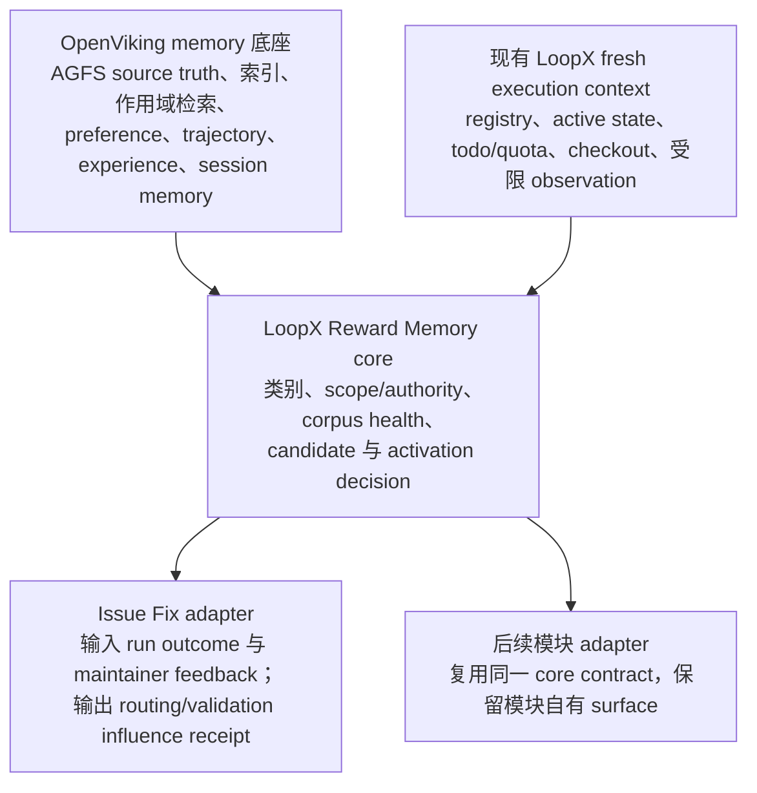

# Reward Memory Architecture v0（中文版）

[English](reward-memory-architecture-v0.md)

Reward Memory 的核心边界是把反馈证据、策略内容和动作 authority 分开。一条有价值的
判断可以沉淀成后续策略，但不能因此变成跨场景的个人画像，也不能创造反馈者原本没有的
权限。经过验证的仓库 owner 或核心贡献者反馈，可以在其独立验证过的仓库作用域内推导出
持久策略。这里需要区分的是“贡献者希望系统怎么做”和“贡献者有权允许系统做什么”。

这份合同定义五类一等记忆、带护栏的优先级和 pilot/meta 分工；Stage 1 增加 corpus
registry 与健康状态 read model；Stage 2 增加无状态 candidate/review 薄缝；Stage 3 增加
显式 recall/application。最简 ingest 闭环只把这些既有薄缝串成一次 corpus-owner 授权的
provider 写入与精确读回；它不新增第二套 memory store、候选调度器、后台 recall、
语义路由器、评测框架或 rollout。可选 runtime hook 只在模块自有边界复用这些薄缝，
不会变成后台学习器。

机器可读合同通过下面的命令查看：

```bash
loopx reward-memory architecture --format json
loopx reward-memory candidate-review --case issue-fix-verified-contributor --decision accept --format json
loopx reward-memory ingest-event --input full-public-fixture.json --format json
```

## 实验能力的开启方式

Reward Memory 是 provider-neutral、默认关闭的 goal 级实验能力。它按已登记 agent lane
显式开启，而不是对整套 LoopX 全局开启：

```bash
# 先 preview；确认边界变化后再追加 --execute。
loopx configure-goal --goal-id <goal> \
  --reward-memory-config .loopx/config/reward-memory/experiment.json \
  --reward-memory-agent <registered-agent>

loopx reward-memory experiment-status \
  --goal-id <goal> --agent-id <registered-agent> --format json
```

Registry 只保存 `enabled`、`experimental`、一个指向 repo 内 ignored config 的相对路径，
以及显式 agent allowlist，因此 provider 选择留在本地私有配置里。OpenViking 是 Issue Fix
pilot 当前使用的首个 provider，但不是 LoopX 的全局 feature flag 或强制依赖；任何满足
同一 binding contract 的 provider 都可以替换它。

Config v1 只登记一次 `project_provider_binding`，同时列出每个 corpus 的精确 provider
scope、项目 corpus 集合、模块自有 surface 和 automation policy。每个 surface 显式列出
兼容的 `corpus_ids`，指定唯一 `ingest_corpus_id`，并拥有自己的 `recall_profile`。LoopX
不会通过扫描全部 corpus 猜路由。同一 surface 下的 corpus 必须具有相同 memory class、
authority、privacy、freshness 和 lifecycle；每个 corpus 的 scope digest、provider identity
和 corpus identity 仍逐一精确校验。

```json
{
  "schema_version": "reward_memory_experiment_config_v1",
  "project_provider_binding": {
    "provider_id": "openviking",
    "namespace": "reward_memory",
    "corpus_scopes": [
      {"corpus_id": "review_policy", "scope_ref": "viking://.../review-policy"}
    ]
  },
  "corpora": [
    {"corpus": {"corpus_id": "review_policy"}, "standing_policy": {}}
  ],
  "surfaces": [
    {
      "surface_id": "reviewer_artifact.summary",
      "adapter": "scoped_feedback",
      "corpus_ids": ["review_policy"],
      "ingest_corpus_id": "review_policy",
      "recall_profile": {
        "profile_id": "review_summary_v1",
        "mode": "function_boundary",
        "max_queries": 1,
        "limit": 4
      }
    }
  ],
  "automation": {
    "automatic_recall": false,
    "automatic_ingest": false,
    "fail_open": true
  }
}
```

上例省略的 corpus 和 standing policy 字段仍使用既有完整记录 contract。
`experiment-status` 会报告 v1 config schema、corpus/surface 数量、recall profile id 和生效的
automatic policy，但不会泄露 scope ref。Agent-scoped `quota should-run` 与
`status --agent-id` 使用同一个 invoked registry 和 config reader 解析该 policy，不会把
automation flag 手工复制进 registry summary。它们输出的紧凑 `config_runtime_route` 只说明
registry role、project/shared runtime scope 和精确配置读回状态，不暴露本地路径。运行时只接受
`reward_memory_experiment_config_v1`；本地 ignored config 必须在 rollout 前显式迁移。打开
flag 只授权兼容的 runtime hook；它不会新建 scheduler、替模型推导 query、扩大 authority
或绕过精确 surface/corpus guard。

`automatic_recall=true` 允许已声明的模块边界调用通用 runtime hook。Surface query、当前
artifact 校验和推理回调仍由模块提供。Hook 按配置的 corpus 顺序读取，遇到第一个精确
读回命中即停止；`function_boundary` 必须只有一个 query，bounded-agentic 边界最多三个，
并输出 provider call telemetry 与 application receipt。Provider 或 application 失败时保留
模块原始输出，而且永远不形成 user gate。

`automatic_ingest=true` 允许模块把一条已经提炼好的紧凑事件交给已配置 adapter 与 ingest
corpus。精确 actor/project/surface/action scope 仍由 adapter 和 standing policy 校验；通用
hook 只复用确定性的 candidate identity、activation、provider sync、精确读回与 ingest
receipt。它不采集聊天、不解析 tool log、不保存 raw content，也不推导新 authority；重复
事件保持幂等。两个 flag 默认都是 false；显式 `ingest-event` 命令继续是调用方主动路径，
不是旧配置兼容 fallback。

Allowlist 内的 agent 在运行时只提交紧凑事件：

```bash
loopx reward-memory ingest-event \
  --goal-id <goal> --agent-id <registered-agent> \
  --input compact-event.json --execute --format json
```

真实 provider 写入必须经过这条 goal + agent 配置路由。原有 full-packet 形式只保留为
no-write 评测夹具。仅加载配置不会采集反馈或代替 provider 认证；只有 flag 已开且存在经过
验证的模块真实调用点时，automatic hook 才运行。Issue Fix 的
`reviewer_artifact.summary` 是首个自动 recall 调用点，其他 surface 在分别接线和验证前仍走
显式调用。实验关闭、provider 不可用、guard 拒绝或精确读回失败时，Issue Fix 都继续正常
工作。非 v1 或无效配置会以 unavailable fail-open，并把两个 automatic flag 置为 false。

## 五类一等记忆

| 类别 | 来源与作用域 | Authority 与用途 | 生命周期 |
| --- | --- | --- | --- |
| `run_bound_reward` | 人对某个精确 goal/run 给出的显式评价。 | 只描述该次结果。若要影响后续行为，必须先形成紧凑候选并经过 activation policy；reward overlay 本身不是长期指令。 | Overlay 只追加；修正和撤销通过引用追加，不回写被评价的原始 run。 |
| `hard_policy` | 显式的用户、仓库或 operator authority，或者从已验证的 owner/核心贡献者证据中推导、并绑定到既有 project/action authority scope 的策略内容。 | 在已验证作用域内形成约束或否决。模型可以从 reward、preference、经过当前 artifact 验证的 experience、选项选择、接受/拒绝结果和 maintainer correction 中推导策略含义；不能推导 credential、新的 publish/production scope 或跨用户、跨仓库 authority。 | Active record 保留 actor、evidence、scope 和 derivation provenance，直到被 supersede、revoke 或 expire。临时或证据较弱的推导应当过期或回到 review。 |
| `soft_preference` | 显式反馈、用户选择，或者后续经过 review 的候选；作用域绑定到 workspace/project 和模块自有 surface。 | 只用于 advisory ranking 或 rewrite，不能授予 publish、merge、write、credential 或 production authority。 | 只有经过显式 review 才能持久化；支持 edit、reject、supersede、revoke 和 retire。 |
| `procedural_experience` | 带 revision 的 trajectory、distilled experience、maintainer correction、接受/拒绝变更和经过 review 的架构经验；同时带 repository/module/revision/applicability scope。 | 只有经过当前 artifact 验证，才能作为诊断、范围判断、路由或验证建议。训练/评测 case 是证据，不是可执行指令；单次 retrieval 对 patch 没有 authority。 | Trajectory 可以只追加；distilled 或 architectural experience 支持 supersede。新的 source truth 可以把旧经验标记为 stale、quarantine、refute 或 retire。 |
| `working_context` | 包含 fresh execution state（`fresh_execution_context`）和带 revision 的 session continuation 摘要（`session_working_memory`）。 | 只服务当前执行或 session 延续，不能自动升级成可复用 policy，也不能授予动作 authority。当前 source-of-truth 读取始终高于 recall 内容。 | `fresh_execution_context` 已存在于 LoopX 的 registry/state/todo/quota/checkout observation 中，本设计直接复用。Session context 继续绑定对应 session/archive revision。 |

每条持久记录除了类别，还必须包含 `source`、`scope`、`authority`、`confidence`、
`lifecycle_state`、`supersession`、`revocation`、`expiry` 和 `privacy`。
`confidence` 只表示证据质量，不会提高 authority。它取 `low`、`medium` 或 `high`，
并附带判断依据。`source` 记录 kind/ref/actor/time；`scope` 记录 user/workspace、
project/repository、module/surface 和 revision/time 边界；lifecycle 记录当前状态及
supersession、revocation、expiry、retirement 引用；privacy 记录可见范围、保留类别和
是否捕获 raw content。

## 策略内容与 authority

Hard policy 包含两个相互独立的问题：

1. **策略内容是什么？** LoopX 可以从显式反馈、经过 review 的 preference、经过当前
   artifact 验证的 experience、选项选择、重复的接受/拒绝结果和 maintainer
   correction 中推导紧凑策略。
2. **策略在哪个范围内生效？** Actor identity 和 repository/action authority 必须来自
   独立验证的来源。Memory confidence 不能创造或扩大作用域。

当仓库 owner 或核心贡献者身份已经验证，一条含义明确的推导策略可以直接进入 active，
无需在每次 run 后重复询问，但需要同时满足以下条件：actor 与 authority scope 已验证；
provenance 紧凑且可检查；不存在更高 authority 的冲突来源；记录可以通过 edit、
supersede、revoke、retire 或 expiry 逆转。含义含糊、作用域不清、身份不确定或存在冲突
时，候选回到 review。推导过程不能创造 credential、external-write capability、
production permission、cross-agent authority，也不能扩展到另一个仓库。

系统可以推导可复用的边界或 gate policy，但不能编造某个具体 operator gate 或
authority checkpoint 的当前状态迁移。一次 approve、reject 或 consume receipt 仍然必须
来自该 gate 自己的 source of truth。

## 带护栏的优先级与模型推理

下面的顺序定义安全与注意力边界，不是一张穷举式决策表：

1. 显式 action authority 与 privacy boundary；
2. 当前有效、作用域匹配的 hard policy；
3. fresh working context 与当前 source of truth；
4. 经过当前 artifact 验证的 procedural experience；
5. 当前有效、作用域匹配的 soft preference；
6. 只作为证据的 run-bound reward。

确定性代码负责拒绝非法状态：authority 未验证、project/surface 不匹配、材料已
revoked/expired、privacy 违规、同级 authority 冲突未解决，或者缺少当前 artifact
验证。进入合法动作集合后，模型继续负责理解反馈含义、判断相关性与证据充分性、权衡
取舍，并决定 apply、ignore 或 seek more evidence。紧凑 receipt 需要记录 reasoning
summary、memory reference、artifact verification 和 authority/scope check。

当证据质量接近时，优先使用 provenance 更明确的记录；这条偏好不能演化成压制有效
推理的 hard-coded router。Raw chat、transcript、tool log、credential 和本地路径都不是
Reward Memory record。

`loopx reward-memory route-check` 是确定性回归夹具，用于覆盖 PR #3237 一类明显的
安全或升级条件。它不是线上 Issue Fix 决策引擎，也不替代模型推理。

## 架构分层与能力复用



OpenViking 负责 memory storage、index、scoped retrieval 和 session-memory 基础能力。
LoopX 负责动作语义：class、scope、authority、lifecycle、candidate derivation、
activation 和 application receipt。Issue Fix adapter 把 issue/PR evidence 映射到共享
core，再消费 core 返回的决策；它不能新增平行的 memory store、policy schema 或 ranking
pipeline。其他模块只在这条复用路径被证明后接入。

### Issue Fix 是首个 adapter

Issue Fix 只增加领域映射：

- 精确 run reward、maintainer correction、选定的修复方向和持久 issue/PR outcome，
  转成共享 candidate contract 的紧凑输入；
- repository identity、contributor role、当前 checkout、issue/PR state 和 active LoopX
  gate，提供当前 authority 与 execution context；
- 模块显式请求时，由 OpenViking 提供作用域匹配的 preference 或 experience retrieval；
- 共享 core 返回 apply、ignore、seek-evidence 或 review，并附带紧凑 influence receipt；
- recalled technical claim 仍需在当前代码与测试中验证，才能影响 patch。

Candidate lifecycle、contributor-policy semantics、retrieval health 和 provider
persistence 归共享 core 所有，不由 adapter 重复实现。Issue Fix 可以充分发挥场景价值，
但不会反过来把整个 memory 产品做成 Issue Fix 特化方案。

## 已实现的 Stage 2 薄缝

Stage 2 接收模型提出的紧凑候选：target class、content summary、source actor 与 evidence
reference、workspace/project/surface scope、reasoning summary、confidence，以及请求影响的
action scopes。候选的含义、策略内容和权衡继续由模型推理；确定性代码只检查公共安全
shape、scope binding、raw-content boundary、source freshness、未解决冲突、必要的当前
artifact proof 和 authority checkpoint。

对于 `hard_policy`，checkpoint 必须独立绑定同一个 actor、role、project 和 action
scopes。因此，经过验证的核心贡献者 correction 可以直接形成 activation-ready policy
candidate，但只能约束 checkpoint 已有 action scope 的子集。checkpoint 未验证、actor 或
project 不一致、或者候选要求更大 scope 时，候选仍可检视，但状态为 `guard_blocked`；此时
即使请求 `accept` 或 `edit`，有效决策也会收敛为 `no_write`，不会扩大 authority。
Advisory preference 与 experience candidate 不允许请求 action authority。

Review contract 暴露五个一等决策：

- `accept`：产出 active record；
- `edit`：产出带 prior-candidate lineage 的修订候选；
- `reject`：关闭并拒绝候选；
- `retire`：关闭一个已经 active 的 reviewed record；
- `no_write`：明确记录本次不应写 provider。

这些只是 decision record，不是 persistence 操作。`accept` 与 `retire` 只返回下一步提示：
调用方必须使用 corpus 声明的 write authority，再完成 readback 验证。薄缝自身不写 LoopX
state、OpenViking corpus、index、receipt 或外部系统，也不摄取 raw chat 或 tool transcript。

`issue_fix_reward_memory_candidate_adapter_v0` 刻意保持为字段映射 adapter：把紧凑 issue
reference、repository revision、模块自有 surface、contributor evidence 和模型 reasoning
映射到 `reward_memory_candidate_v0`。所有 guard 与 lifecycle decision 仍由共享 core 所有。
这是第一条复用证据，不是 Issue Fix 专用 memory 实现。

## 最简写入闭环

`loopx reward-memory ingest-event` 是一条薄的原子编排，而不是新的 memory 产品层。配置好的
实验显式选择 adapter。`issue_fix_maintainer_feedback` 继续作为 Issue Fix 兼容适配器；
`scoped_feedback` 则接受通用的 `scoped_feedback_reward_memory_event_v0`，可用于任意模块限定
surface。两者都只把严格、紧凑的字段映射到同一个 `reward_memory_candidate_v0`，不拥有第二套
lifecycle、store、scheduler、recall path 或 semantic router。LoopX 不读取或保存原始 feedback
body，也不会根据关键词自动判断“哪条反馈值得记忆”。模型或调用模块先把材料压缩成只包含
source ref、已验证 actor/role、精确 workspace/project/surface/revision、内容摘要、reasoning
和当前 artifact 证据的 event。

一个 `reward_memory_standing_policy_v0` 预先声明 corpus owner、reviewer、authority source、
精确 project/surface、唯一 memory class、允许的 source kind、已验证 actor role 和 action
scope。它把“每条 comment 重复审批”收敛成“一次批准精确边界”；它不能创造 credential、
仓库写权限、publish/production scope 或跨项目 authority。任何越界、冲突、非 current source
或 raw/unmodelled 字段都会在 provider 调用前 `guard_blocked`。

同一命令按顺序执行：确定性 `candidate_ref` 去重、standing-policy accept、active envelope、
声明 provider 的 `sync`、同一 exact corpus/surface 的 function-boundary recall，以及
resource ref、candidate ref、canonical content digest 三重读回校验。只有三项都一致时，
`reward_memory_ingest_receipt_v0` 才返回 `activated` 和
`memory_available_for_recall=true`。Provider 不可用、commit pending 或读回不一致都 fail open，
不阻塞调用方的正常工作。`observed_at` 是事件第一次被观察到的不可变时间，retry 必须复用它；
provider target 同时绑定 standing-policy 与 candidate digest，避免策略换版误复用旧激活。
`--execute` 缺省关闭，dry-run 只返回 `planned`。Execute 还必须同时提供 goal id 和 allowlist
内 agent id，调用方不能通过直接传 provider binding 绕过默认关闭的实验策略。

调用方仍然显式调用自己现有的 Stage 3 function-boundary recall hook。Issue Fix 保留
`run_issue_fix_patch_planning_reward_memory`，其他模块使用各自 surface 所有的 hook。模型决定
apply、ignore 或 refute，并复用共享 application receipt；ingest seam 不增加确定性语义路由
或后台 scheduler。

## 与 OpenViking 的对齐关系

五类记忆保持 provider-neutral；Stage 0 的边界已经结合 OpenViking 当前公开架构和代码
进行校验：

- OpenViking 是 context database，不是 action-authority system。AGFS content 是
  source of truth，vector index 保存 retrieval reference。
- OpenViking `preferences` 可以提供经过 review 的 `soft_preference` 候选，但不会转成
  permission。
- OpenViking `trajectories` 是从一次执行中提炼的只追加 operation contract；
  `experiences` 是支持 upsert、看起来可以执行的泛化经验，也可以显式 `supersede` 旧
  experience。两者都映射成 advisory `procedural_experience`，使用前需要验证当前
  revision。
- OpenViking `cases` 显式定义训练或评测任务与 rubric，不是 experience instruction，
  也不能作为 policy 注入。
- OpenViking Working Memory 是用于 session continuation 的七段式 archive overview，
  映射到 `working_context/session_working_memory`，不属于长期 policy。LoopX 当前的
  registry/todo/checkout observation 映射到另一个 subtype：
  `fresh_execution_context`。
- OpenViking `soul.md` 或其他 provider record 可以包含 policy evidence；只有 actor 与
  repository/action authority scope 被独立验证后，内容才能成为 LoopX `hard_policy`。
  内容可以推导，authority 不能推导。
- Account、user、peer、session 和 repository-revision boundary 始终属于 scope 与
  privacy。Peer label 不授予 cross-user 或 cross-agent authority。

Provider health 拆成 `corpus_present`、`index_present`、
`retrieval_query_succeeded`、`result_readback_verified` 和
`memory_applied_with_receipt`，这些状态不能合并。当前 OpenViking Codex auto-recall path
把 `experiences` quota 配置为 0，因此 experience corpus 可以存在，但不会自动 recall。
Stage 1 负责 inventory 与 health proof；Stage 0 不声明这项能力已经可用。

公开依据包括 OpenViking
[架构](https://docs.openviking.ai/en/concepts/01-architecture)、
[Session Management](https://docs.openviking.ai/en/concepts/08-session)、
[Multi-Tenant and Peer Isolation](https://docs.openviking.ai/en/concepts/11-multi-tenant)，
以及源码 revision
[`ba46491`](https://github.com/volcengine/OpenViking/tree/ba46491af0a79467ea268ef370e35b68f86abf73)。

## Pilot/meta 分工

Pilot 只有在以下条件同时成立时才能直接接手 fix：行为已经确认是 bug；范围限定在一个
surface；变更不会修改 semantic contract，也不会把产品特定 policy 放进通用边界；
reproduction 与 validation 已明确；edge-case complexity 为 low 或 medium；相关证据
完整。以下情况需要 meta design review：by-design 或语义不确定；semantic-contract
change；跨 surface 变更；generic-boundary leakage；edge-case complexity 为 high。

证据要求按照相关性启用，不使用笼统的“core-component”规则：effect evidence 始终必需；
用户可见行为变化需要 UX evidence；hot path 或 storage behavior 变化需要 performance
evidence；只有声明 retrieval 或 memory quality 时才需要 benchmark evidence。缺少必需
证据、同时又没有 meta trigger 时，结果是 `hold_for_evidence`。这样既允许 core module
内部的受限 bug 保持 pilot scope，也能升级那些表面很小、实际修改公开或存储合同的变更。

这是一套 guarded routing，不产生 cross-agent authority。Live agent 继续在护栏内推理
语义与证据。Meta lane 不编辑或认领 pilot todo，pilot 也不能凭一次 memory hit 绕过
design gate。

## PR #3237 回归样例

[OpenViking PR #3237](https://github.com/volcengine/OpenViking/pull/3237) 是当前的负向回归
样例。它尝试让通用 directory listing 跨 backend 与 Web Studio surface 反映
session-specific activity，但维护中的 directory-mtime 行为原本就是 by design。该 patch
为了一个产品特定 edge case 修改通用 filesystem/session contract，跨越 backend 与 Web
Studio，并在 listing/storage path 增加 metadata read；同时缺少 product-effect、UX 和
performance evidence。因为它没有声明 retrieval 或 memory-quality 收益，所以不需要
benchmark evidence。

稳定预期是 `meta_design_gate`，不是 `pilot_fix`。Meta 可以把产品行为收窄到
session-specific presentation boundary，也可以关闭这项变更；已有 memory result 不能
授权 generic-layer patch。

```bash
loopx reward-memory route-check --case pr-3237 --format json
```

## 分阶段职责

- Stage 0：五类记忆、优先级和分工合同。
- Stage 1：已实现的 provider-neutral
  [corpus registry 与 health contract](reward-memory-corpus-registry-v0.md)，覆盖 ownership、
  authority、freshness、retirement、scope isolation 和 retrieval-health 区分。其中的
  `fresh_execution_context` 描述 LoopX 已有能力，不要求建设另一套 context system。
- Stage 2：已实现的无状态 candidate 与 activation-decision seam，建立在现有
  LoopX/OpenViking evidence 之上。不新增第二套 store、scheduler、automatic recall 或
  raw-content retention；Issue Fix 是首个 adapter，复用通用 record/decision shape。
- Stage 3：已实现 opt-in cross-module recall/application seam。模型在确定性的
  scope、authority、privacy、freshness 和 conflict guard 内推理；Issue Fix 的
  patch planning 与非 Issue-Fix 的 semantic preference 模块复用同一核心和紧凑
  application receipt。最简 ingest seam 复用 Stage 2/3 与声明 provider，把 standing-policy
  范围内的紧凑事件原子写入并精确读回；不自动选择事件、corpus 或模块。
- Stage 4：evaluation harness 与 release gate。
- Stage 5：受限的 cross-module dogfood，以及 operator edit/retire control。

后续阶段必须在这份合同上扩展，不能合并五类记忆、重复建设 context/provider 能力，也
不能把 provider availability 变成 user gate。Stage 1 继续保持 stateless read model，
不执行 provider 或 external write。

## Stage 3 recall 与 application seam

Stage 3 只接受显式的 `reward_memory_recall_request_v0`：调用方必须准确指定一个已登记
corpus 和一个 module-owned surface，同时提供匹配的 read-authority checkpoint、当前
freshness 与 conflict observation。project、surface、authority、revision、lifecycle 或
provider binding 任一不匹配，都会在调用 provider 前停止。这里是确定性安全校验，不是
确定性语义路由器。

查询与解释仍由调用模块/模型负责。`function_boundary` 只允许在命名函数边界执行一次
查询；`bounded_agentic_search` 最多允许三次由调用方/模型给出的查询。LoopX 不会按
similarity 自行选择模块或 corpus，也不会扫描全部 corpus、调度后续 recall，或从命中
结果推导新的 action authority。

通过 review 的 `reward_memory_candidate_review_v0` 可以封装成
`reward_memory_active_record_v0`，但只有 corpus 声明的 owner 可以执行持久化。Recall
只接受准确 corpus 与 surface 下的 active envelope。私有 summary 仅在进程内交给模型；
公共 packet 只保留 opaque provider ref 与紧凑 lineage。Application receipt 保存哈希
memory ref、模型给出的 reasoning summary 和 current-artifact verification，不保存原始
provider content。

Provider 不可用时，seam 返回 setup guidance 并保留原输出；这是 agent/runtime 条件，
不会自动变成 user gate。模型 application 无效或异常也 fail open。只有同时归因到本次
召回项并验证当前 artifact，才能产生 `applied` receipt。Issue Fix 使用固定的
`issue_fix.patch_planning` surface；`semantic_preference` 是第二个非 Issue-Fix consumer。
当 OpenViking binding 的 scope 位于 `/peers/<peer>/` 下时，必须显式携带完全一致的
`actor_peer_id`。LoopX 只将它传给 scoped provider 操作，不会从任意目标 URI 推导或冒用
actor 身份。

## Stage 4 评估与发布门禁

Stage 4 只在现有共享核心之上增加一套受限 contract suite，不新增另一套 evaluator、
store、provider、scheduler 或 semantic router：

```bash
loopx reward-memory evaluate --format json
```

Runner 会直接执行真实的 candidate、recall、application、Issue Fix adapter 与 route guard
代码，覆盖八类 case：compact/restart 后存活；project/module scope isolation；
supersede/revoke 拒绝；stale source 拒绝；多人 authority 匹配；gate 不被覆盖；在验证当前
artifact 后影响 candidate ranking；以及避免为 PR #3237 这类 edge case 生成大 patch。

`evaluation.py` 只负责 case 编排、断言、指标与 release gate。可复用的 setup 和 provider
double 放在 `evaluation_fixtures.py`，并使用中性的 fixture identity；OpenViking 只出现在
显式命名的 PR #3237 Issue Fix 回归 fixture 中。项目身份属于 fixture data，不属于
evaluator policy。

`reward_memory_evaluation_v0` 同时汇报 task outcome、真实本地 runner latency、公共证据
字节数、model token 数、provider/storage write、false application、maintainer interruption
与 user gate。model token 为零表示这套确定性 contract suite 没有调用模型，不代表后续
dogfood 的 token 成本估算。只有全部 case 通过，且 write、false application、
interruption 和 user gate 计数均为零，release gate 才能通过。

通过后的状态是 `ready_for_bounded_dogfood`，不是 production release。它只证明 core
contract invariant，不声明 semantic uplift，也不授权 production rollout。Stage 5 必须
使用经 corpus owner 批准的 record、精确 provider readback 和真实模块结果，才能讨论收益。

## Stage 5 dogfood receipt 与 operator control

Stage 5 只在 Stage 3 application receipt 上增加一层薄的证据合同，不新增 store、scheduler、
语义路由器、automatic recall 或第二套 evaluator。调用方传入紧凑的真实模块 observation，
其中 artifact reference 必须与 application receipt 一致：

```bash
loopx reward-memory dogfood-evaluate \
  --input compact-observations.json --format json
```

`reward_memory_dogfood_receipt_v0` 根据已有 application outcome 推导 `hit`、`miss` 或
`refute`，不接受调用方自行声明结果类型。`hit` 或 `refute` 必须同时满足精确 provider
result readback 与 current-artifact verification。Receipt 只保留 opaque/hashed memory ref、
紧凑的已验证结果摘要、latency、model token、provider call、intervention count，以及可选的
紧凑 bot feedback；不保留 raw provider content，也不授予新的 action authority。

只有 Stage 4 gate 仍然通过，并且受限 batch 同时包含至少一个 Issue Fix 结果、两个不同的
LoopX domain 结果、hit/miss/refute 三类结果，以及 edit/retire 两类 operator control，
`reward_memory_dogfood_batch_v0` 才会进入 `ready_for_bounded_issue_fix_pilot`。这只是
试用就绪声明，semantic uplift 与 production rollout 仍然为 false。

Edit/retire control 同样保持克制：

```bash
loopx reward-memory operator-control \
  --input reviewed-record.json --action retire \
  --control-ref control:example:retire \
  --reasoning-summary 'Current source truth supersedes this record.' \
  --format json
```

Edit checkpoint 必须匹配 corpus owner；retire checkpoint 必须匹配
`maintenance.retirement_authority`；两者还必须绑定到准确的 corpus、project 与 action。
Edit 生成一个引用旧 active record 的 replacement
candidate，retire 生成 retired decision。两个命令都不写 provider state；真正的 write 与
精确 readback 仍由声明的 corpus owner 执行，因此 operator control 不会悄悄扩大成
publish、production 或跨项目 authority。
