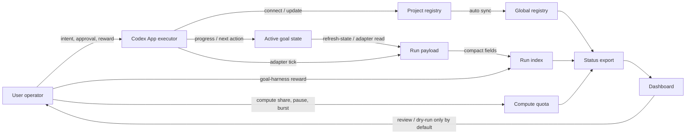

# State Interaction Model

Goal Harness should not grow by adding commands one at a time. New capabilities
must fit a clear state model between the goal, the Codex App executor, the
human operator, and the dashboard.

This document is the design gate for future controller, dashboard, reward, and
multi-project work. If a proposed feature cannot name the state it reads, the
state it writes, the owner of that write, and how the dashboard proves it, the
feature is not ready.

For concrete recurring situations, maintain
[Interaction Pattern Catalog](interaction-pattern-catalog.md). The state model
defines actor boundaries and stores; the pattern catalog records good cases,
bad cases, expected user/agent channels, and validation references.

## Actors

### Goal

A goal is the durable work object. It owns the objective, current state,
authority sources, safety guards, validation surfaces, run history, and next
handoff condition.

A goal is not a chat thread. A thread can execute a goal, but the goal must
survive thread reloads, network interruptions, and multiple project agents.

Goal-owned state:

- project-local registry entry,
- active goal state file,
- compact run index,
- private run payloads,
- optional human reward overlays attached to exact runs,
- optional compute quota and spend ledger for this goal.

### Codex App Executor

The Codex App executor is an actor that can read goal state, run commands, edit
files, spawn or coordinate child work, and write new state through Goal Harness
commands.

The executor is ephemeral. It should not be the source of truth. Its job is to
convert current context into bounded transitions:

- connect a project,
- inspect or map read-only state,
- perform one verified work segment,
- append a refresh run after state-only work,
- append a compact run after adapter work,
- update active state with progress, critic, and next action.

Executor-owned state should be minimal: current conversation context, local
tool outputs, and temporary execution decisions. Durable state belongs in the
goal stores above.

### User

The user is the operator and reward source. The user supplies high-quality
judgment that the executor cannot infer safely:

- whether a route, result, or tradeoff was good,
- whether a controller may move from observation to advice,
- whether write or production actions are allowed,
- whether a project should stay active, pause, or archive,
- whether a goal should receive more compute quota, less compute quota, or a
  temporary burst.

The user's feedback should be recorded close to the run being judged. A
structured `human_reward` overlay is better than burying the judgment in chat,
because later controller ticks and dashboards can see exactly which decision
was rewarded.

User intent can authorize a transition, but it should still be persisted as a
goal event, state update, or reward overlay before future agents rely on it.

### Dashboard

The dashboard is a local control-plane view. It is not the source of truth.
It is the human-facing product surface, not a dressed-up CLI dump.

By default it reads the status export and optional loopback status server:

- global registry scope,
- attention queue,
- contract health,
- compact run history,
- controller readiness,
- human reward summaries,
- compute quota state,
- artifact availability.

The dashboard can help the user review, filter, and dry-run feedback. Direct
writes from the dashboard must remain opt-in and gated. Browser-side writes
need an explicit capability, preview handshake, exact run target, and loopback
server boundary.

The dashboard should translate agent-facing status fields into operator
questions: "do I need to judge this?", "is an agent ready to work?", "are we
waiting on evidence?", and "is a controller handoff safe yet?" Raw
classifications, paths, and adapter terms should be secondary drill-down
details.

The dashboard may eventually look like a channel workspace: one goal timeline,
agent/member presence, task claims, approvals, and artifacts in one place. That
frontstage view must remain a projection over durable Goal Harness events. A
channel message can help a person collaborate, but the event ledger decides
what is current, who owns a task, which lease is active, and whether a later
agent may resume work.

The first user-facing view should also make TODO ownership explicit. Before the
operator reads a full action card or run history, the dashboard should surface
the first open `user_todos` item and the highest-priority open `agent_todos`
item per goal. This protects both sides of the loop: the user can see which
human/owner action blocks progress, and the next agent can see the compact
work item without re-reading stale thread context. Detailed action packets,
review materials, run history, and raw adapter fields remain drill-down
surfaces.

## Three-Actor Interaction Protocol

The current failure mode is not lack of prompt detail. It is ambiguity about
which actor owns the next transition. When that boundary is implicit, an agent
can wait for a thread that was never launched, ask the user for small public
gates, stop a healthy automation because the top lane is blocked, or spend a
turn on a monitor that had no material transition.

Goal Harness should therefore expose one machine-readable interaction contract
per selected goal:

```text
goal-harness --format json quota should-run --goal-id <goal-id>
```

The guard's `interaction_contract` is the first-class protocol. Older fields
such as `execution_obligation`, `heartbeat_recommendation`,
`work_lane_contract`, `external_evidence_observation`, `goal_boundary`, and
`protocol_action_packet` remain compatibility and drill-down fields.

### Actor Boundaries

| Actor | Owns | Must not own |
| --- | --- | --- |
| User/operator | Boundary decisions, reward, private material, credentials, paid/cloud resources, destructive git, production actions, public submissions/claims, explicit product-direction changes. | Routine public reads, task-row access, todo splitting, local state writeback, public-safe validation, or choosing among already-authorized P1/P2 work. |
| Agent/Codex executor | One bounded transition per turn: inspect current state, choose the highest safe lane, implement or observe, validate, write back, and spend only after delivery. | Durable truth, implicit approval, unrecorded reward, hidden long-term memory, silent cancellation, or credential copying. |
| Goal Harness CLI | Projection of goal truth, waiting owner, quota, interaction mode, machine obligations, spend policy, liveness, and compatible next commands. | Human judgment, private evidence interpretation beyond compact projections, or project-specific branching inside automation prompts. |
| Skill | Procedural operator/agent manual for using the CLI safely. | Runtime routing authority or a second state machine that overrides `quota should-run`. |
| Automation prompt | Thin bootstrap: wake, preflight, run the CLI guard, use the skill if available, follow `interaction_contract`, and stop for global safety boundaries. | Long project-specific control flow, stale TODO memory, or handwritten exceptions. |

Agent-visible follow-up work belongs in `Agent Todo`, not in prompt branches.
When the agent knows whether a todo is executable work or watch-only work, it
should register that fact through `goal-harness todo add --task-class ...`
and optional `--action-kind ...`. The active-state metadata then feeds status,
quota, dashboard, and review-packet consumers through the same CLI projection.
Legacy todo text classification exists only to keep older states readable.

### Interaction Modes

`interaction_contract.mode` should make these patterns explicit:

- `bounded_delivery`: Codex owns one validated work segment. It should run the
  steering audit, choose a P0/P1/P2 lane, implement, validate, write back, and
  spend exactly once after delivery.
- `user_gate`: the user/controller owns the next decision. The agent asks a
  concise question and does not run the gated path. If the CLI exposes safe
  bypass, a later turn may do unrelated bounded P1/P2 work after the gate has
  been surfaced.
- `user_todo_blocker_push`: the user owns an open todo. The agent notifies,
  does not spend, and should not describe the turn as "no user action".
- `external_evidence_observation`: Codex does not run benchmark/model/Docker
  delivery. It must first verify an observable handle such as a thread id, job
  id, marker, or compact writeback channel. This applies both to explicit
  `waiting_on=external_evidence` goals and to already-launched long-running
  work whose current action is compact-result polling. If no handle exists,
  write a compact blocker instead of quiet waiting.
- `monitor_quiet_skip`: no material transition is present. The agent may append
  at most one no-spend monitor-poll event, rerun the guard, then stay quiet.
  The automation stays active.
- `autonomous_replan`: repeated no-progress evidence has crossed the self-repair
  threshold. Codex must run one bounded replan/repair segment or write a
  concrete blocker before another quiet no-op.
- `outcome_floor_recovery`: the current path is allowed only to recover the
  missing outcome-scale evidence or write the blocker; surface-only work is not
  allowed.
- `mapped_noop_if_unchanged` and `quota_throttled`: quiet no-op is allowed only
  after checking the contract's preconditions; it is not an automation cancel
  signal.

### Long-Running Todo Execution

Long-horizon execution should be a series of compact transitions, not an
unbounded "continue the last thing" loop:

1. Run `quota should-run`.
2. Follow `interaction_contract` first.
3. If the contract allows agent work, choose one lane from active `agent_todos`,
   the priority stack, and current blockers.
4. If the top P0 lane is blocked, record or surface the blocker, then continue
   with a verifiable P1/P2 lane only when the CLI contract permits safe
   bypass, recovery, self-repair, or another bounded obligation. Otherwise keep
   automation active without spend, or let the global scheduler pick another
   eligible goal.
5. Validate and write durable state before spending.
6. Spend exactly once after validated delivery, blocker writeback, or material
   transition.
7. Refresh state after spend when the dashboard/control plane needs the new
   compact truth.

This keeps the user's role high-value: the user resolves real boundaries and
reward judgments, while Goal Harness prevents the agent from stalling on
routine routing choices.

## State Stores

| Store | Owner | Reader | Writer | Purpose |
| --- | --- | --- | --- | --- |
| Project registry | Project goal | CLI, executor, status | `connect`, `bootstrap`, narrow project setup | Declares goal identity, repo, adapter, authority, guards. |
| Active goal state | Project goal | Executor, adapters, user review | Executor or project controller | Durable context, latest progress, next action, validation surfaces. |
| Shared global registry | Local control plane | Status, dashboard, any project shell | `connect`, `refresh-state`, `sync-global` | Multi-project discovery without manually copying registry entries. |
| Run payloads | Goal runtime | Executor, local reviewer | Adapters, `refresh-state`, `read-only-map` | Rich private evidence for one run. |
| Compact run index | Goal runtime | Status, dashboard, heartbeats | Adapters, reward overlay writer | Public-safe timeline and latest status. |
| Compute quota / spend ledger | Goal runtime or registry | Status, dashboard, automations | `quota` commands, controller writeback, operator decisions | Local duty-cycle or weighted-share policy for automatic agent turns. |
| Status export | CLI/status layer | Dashboard, pre-tick, heartbeats | `goal-harness status` | Agent-facing machine contract and dashboard input. |
| Dashboard UI state | Browser session | User | Browser URL/search state | Filters, selected goal, selected run; not durable goal truth. |

## Event Ledger Contract

Goal Harness should treat the compact run index plus reward / quota overlays as
the append-only event ledger for long-running work. Chat threads, browser
filters, and local tool outputs may help a worker decide what to do in the
moment, but they are not the durable source of truth.

The control plane should preserve these event classes:

- **work events**: `refresh-state`, read-only maps, adapter ticks, and progress
  classifications that say what changed and how it was validated;
- **decision events**: operator gates, checkpointed resume contracts,
  approvals, deferrals, and `human_reward` overlays tied to exact runs;
- **accounting events**: quota spend rows such as `quota_slot_spent`;
- **evidence events**: eval, CI, artifact, blocker, failure, done, or
  read-only evidence-poll observations.

Current state is a projection over those events plus the active goal state and
registry policy. That projection may compact old detail for prompts and
dashboards, but it should not silently replace or rewrite the event that made a
decision auditable.
`goal-harness status` exposes this boundary through `event_ledger_summary`: a
compact count of sampled accounting, decision, evidence, state, and work events.
Dashboards and heartbeat prompts can use that projection to understand recent
control-plane shape while still drilling into `run_history` for exact events.

This gives Goal Harness a durable-execution boundary:

- Codex threads are replaceable workers. They execute bounded transitions, then
  write validated events.
- The Goal Harness control plane orchestrates task dispatch, quota, gates, and
  latest-state projections from the event ledger.
- Heartbeat prompts should stay thin. They should query status, quota, review
  packets, and active state rather than carrying project-specific history.
- Spend, validation, artifacts, blockers, handoffs, and read-only evidence polls
  should become durable events before later agents rely on them.
- Side-bypass and main-control workers should coordinate through the same
  ledger so they cannot double-spend, hide blockers, or race on stale state.

## Derived Task Graph Projection

Some complex goals need a graph-shaped view: independent deliverables, ordered
dependencies, acceptance gates, repair loops, and handoff points are easier to
reason about as nodes and edges than as a flat todo list. Goal Harness should
support that view as a derived projection over durable goal truth, not as a
second source of truth.

The durable owner remains the event ledger, active goal state, todos, gates,
leases, quota policy, and run history. A task graph may be rendered from those
stores when it helps an agent or operator answer:

- which deliverables can proceed independently;
- which gate blocks downstream work;
- which failure invalidates later pending work;
- which repair or verification node should run before close-out;
- which user decision or lease owns the next transition.

The projection should also preserve a useful distinction between durable
control state and transient work state:

- **Control state** belongs to Goal Harness: objective, constraints, task
  dependencies, gates, leases, run summaries, accepted evidence, and current
  dispatch state.
- **Work state** belongs to an executor turn or child worker: code snippets,
  raw tool output, temporary hypotheses, local implementation details, and
  verbose logs.

This lets Goal Harness borrow graph-native recovery where it matters without
forcing every goal into a multi-agent DAG. Small or linear goals can stay as
ordinary todos. Multi-stage goals can project a graph for dispatch, review, and
repair, while the append-only ledger still decides what happened and which
worker may resume.

The first implementation should be read-mostly: expose an optional compact
`task_graph_projection_v0` from status or review packets, backed by existing
todo ids, gate ids, run ids, and lease ids. Writes should continue through the
existing lifecycle commands until a server-backed lease/graph API exists.

Old user decisions need freshness checks. A reward, steering note, or approval
from seven days ago can remain valuable, but a worker should apply it only after
replaying or rechecking the newer event window that could make it stale. The
current checkpointed gate contract is the first version of that rule: use the old
decision as an audit anchor, then rebase at the decision point against current
registry, active state, quota, policy, repo/run status, and recent evidence.

## Priority Stack And Next Action Selection

`Next Action` should be derived from a goal priority stack, not from the last
thing the previous executor happened to touch.

For the v0.1 control-plane milestone, use this default priority stack:

| Priority | Meaning | Typical surfaces |
| --- | --- | --- |
| P0 | Make the multi-project control loop reliable. | registry, global registry, active state, run history, authority coverage, public/private boundary, operator gate, human reward, project-agent packet, compute quota, real adapter proof |
| P1 | Make the product easier to understand and use. | todo-focus dashboard, dashboard interaction, operator copy, share documents, launch copy, exploration lane design |
| P2 | Extend the platform after the loop works. | deeper scheduling, richer dreaming, refactor proposals, more adapters, benchmark expansion |

Within P0, choose work in this order:

1. state truth and safety;
2. human decision loop;
3. project-agent execution loop;
4. multi-project allocation through compute quota;
5. real adapter proof.

This order prevents two common failures. First, a compute quota planner should
not spend time on a goal whose status is stale, unsafe, or built from the wrong
authority source. Second, dashboard polish should not replace the durable
reward or operator-gate state that later project agents need.

A controller tick should record why its selected next action won over nearby
P0/P1/P2 candidates. The reason can be compact, but it should name the priority
level and the stale-state or operator-cost failure it prevents.

### Steering Audit

`quota should-run` is a compute guard, not a strategy selector. It answers
"may this goal spend another automatic turn now?" It does not answer "is this
topic still the best use of attention?"
Its `heartbeat_recommendation` can cover generic lifecycle mechanics such as
the first saved read-only map or an unchanged mapped no-op, but it still does
not replace the priority-stack steering audit for real delivery work.

Before writing a new `Next Action`, an autonomous goal tick should run a small
steering audit:

1. list at least three plausible candidates from different lanes when they
   exist, such as state/safety, human decision, project-agent execution,
   compute allocation, real adapter proof, product/communication, or
   exploration;
2. choose by the priority stack above, not by the previous tick's adjacent
   critic alone;
3. apply a continuation check when the same topic has consumed several recent
   delivery slices. Large topics may continue, but the tick must re-rank them
   against other P0/P1/P2 candidates and state why continuing is still the
   highest-priority move;
4. separate compute quota from focus quota. Compute quota controls how many
   turns a goal may spend; focus quota controls whether one subtopic deserves
   the next turn at all;
5. include a product bottleneck lens: ask whether the core goal is currently
   bottlenecked by user experience, agent capability, evidence quality, adapter
   readiness, or priority-rule gaps, and promote one concrete bottleneck
   candidate when it should outrank the nearest local TODO;
6. record the losing high-value candidate when it matters, so the next tick can
   resume the broader milestone instead of rediscovering only the nearest
   local gap.

This prevents a chain of individually-correct, easy-to-verify slices from
crowding out a more important milestone such as real project adapter proof,
human reward quality, or dashboard attention reduction.

## State Flow



The CLI status export is for agents and local tools. The dashboard reads that
derived surface, then presents a user-facing interpretation. It should not
reach behind the status layer to reinterpret private files, and it should not
directly mutate goal state unless a future explicit write boundary is enabled.

## Core Transitions

### Connect

Purpose: make a project visible to the local control plane.

Writer: executor through `goal-harness connect` or `bootstrap`.

Writes:

- project registry,
- initial active state if missing,
- global registry sync.

Dashboard effect: a connected goal appears in global status. If there is no
run yet, status should surface `connected_without_run` so the next action is
clear.

### Read-Only Map

Purpose: turn a generic connection into a useful project map without granting
write authority.

Writer: executor through `goal-harness read-only-map`.

Writes:

- private map payload,
- compact `read_only_project_map` run.

Dashboard effect: the goal moves from "connected but not inspected" to "Codex
can use the map or build a project-specific adapter." This is a handoff state,
not proof that the project is fully automated.

### State Refresh

Purpose: make state-only work visible when no adapter ran.

Writer: executor through `goal-harness refresh-state`.

Writes:

- private refresh payload,
- compact `state_refreshed` run.

Dashboard effect: latest dashboard state catches up with active state changes.
This prevents a project from looking stale after the user or executor updated
the goal document, ledger, or next action.

### Compute Quota

Purpose: decide how much automatic agent compute a goal may consume.

Writer: user-authorized `quota` command, controller state writeback, or a
derived status planner.

Writes:

- per-goal compute quota such as `1.0`, `0.5`, `0.3`, or `0`,
- optional spend ledger entries for automatic ticks or agent turns,
- compact allocation state such as `eligible`, `throttled`, `waiting`,
  `operator_gate`, `paused`, or `blocked_health`.

Dashboard effect: the operator can see why a project is active, throttled,
waiting, paused, or asking for a burst. Automations should treat timer cadence
as an execution detail and read Goal Harness compute quota before running work.

See [quota-allocation.md](quota-allocation.md).

### Adapter Tick

Purpose: inspect project-specific evidence and emit a compact decision surface.

Writer: project adapter or executor-controlled pre-tick.

Writes:

- private project evidence payload,
- compact run index row with classification and one recommended action.

Dashboard effect: the goal enters the appropriate lane: user/controller,
Codex-ready, external-watch, or blocked health.

### Human Reward

Purpose: capture high-quality operator judgment near the decision being judged.

Writer: user-authorized `goal-harness reward`.

Writes:

- compact overlay row in the run index.
- coordination hints for active-state summary and project-agent history lookup.
- optional active-state `Progress Ledger` summary when the operator explicitly
  requests `--write-active-state-summary`.

Dashboard effect: selected runs show whether human judgment exists and what
class of decision it judged. This is the main improvement over bare goal-mode
chat, where feedback is easy to lose.

## Dashboard Architecture

The dashboard should optimize for operator decisions, not decorative reporting.
It should not expose the CLI status contract as the primary mental model.

First screen:

- compute quota summary: which goals are eligible, throttled, waiting, paused,
  or over budget;
- user actions that need the operator before auxiliary source controls or raw
  status drill-down,
- selected action share controls next to those actions, so review links,
  user judgment, project-agent instructions, and dry-run preview are visible in
  one canonical packet without hunting through the page,
- contract health and global registry health,
- lanes by `waiting_on`: user/controller, Codex-ready, external evidence,
  blocking health,
- a user review map that translates lifecycle phases into "needs first run",
  "state changed", "agent inspected", "reward recorded", and "controller
  readiness or controller-gated" states;
- compact goal rows with user-facing phase, latest classification as a
  secondary detail, last run time, recommended action, reward presence, and
  controller readiness.

Goal detail:

- goal identity and authority sources,
- operator decision: review or authorize, let Codex continue, wait for
  evidence, or fix health first,
- active state freshness,
- run timeline,
- controller readiness gates,
- human reward timeline,
- artifact availability,
- project map or adapter-specific compact panels.

User review surface:

- show first-screen operator actions before raw goal detail: reward gates,
  controller opt-ins, compute quota changes, evidence watches, Codex handoffs,
  and blocking health items,
- include the safe local CLI path or reward-draft hint on first-screen action
  cards when it helps the user move from judgment to an agent-facing command,
- allow local action-kind focus such as reward, controller, Codex, evidence,
  or health while treating that filter as dashboard UI state rather than
  durable goal truth,
- keep that action-kind focus URL-backed when useful, so a human can reload or
  share the current review lane without mutating goal, run, or status state,
- keep selected goal detail URL-backed when useful, while treating it as
  browser review state rather than a durable goal transition,
- expose a compact review link affordance for the current action-kind focus,
  selected goal, status source, and queue filters; copying that link is still
  dashboard UI state, not reward, approval, or controller opt-in,
- expose one copyable Review Packet for the selected action rather than several
  competing copy formats. The packet should combine the review link, Chinese
  agree/disagree/reason/next-step prompt, project-agent instructions,
  reward/default hint, and local dry-run preview. For reward actions, the
  project-agent section should provide the history lookup for a recorded
  run-bound reward rather than asking the project agent to write reward. It is
  for user-to-agent collaboration and must not be parsed as durable reward,
  approval, controller opt-in, or write-control,
- show the run being judged,
- show why the system thinks a human decision is needed,
- show the selected goal's current operator stance before raw run history,
- show a safe CLI path for the stance: status/history inspection,
  read-only-map or refresh-state dry-run, or reward dry-run through the Reward
  CLI Draft,
- generate a CLI reward draft or dry-run request whose defaults derive from
  the selected operator stance and missing gates,
- never imply that reward equals write authorization.
- keep schemas, routes, and component structure stable in English, but allow
  operator-facing review summaries and handoff judgments to be localized for
  the human reviewer.

Executor surface:

- show the next allowed transition,
- show whether the goal is eligible under compute quota,
- show missing gates,
- show whether the next action is read-only, state refresh, adapter tick,
  reward capture, controller opt-in, or explicit write approval.

CLI surface:

- keep fields terse, stable, and machine-readable;
- prefer classifications, lifecycle phases, gate ids, and one recommended
  action over user-facing prose;
- avoid local private evidence and UI-only copy.

## Invariants

- The active goal state is the durable context; chat is only execution context.
- The compact run index is the dashboard timeline; private payloads are not the
  dashboard contract.
- Every meaningful state-only update needs a refresh run if the dashboard is
  expected to reflect it.
- A read-only map does not authorize mutation, decision advice, or production
  control.
- Human reward does not authorize writes unless the reward explicitly records a
  separate approval and the target transition supports it.
- Durable reward belongs in the run-bound `human_reward` overlay. Active goal
  state can summarize that a reward was recorded, but it should not become the
  only reward source that other project agents rely on.
- The global registry is synced from project-local registries; agents should
  not manually paste project entries into a separate queue.
- Automation cadence is not the compute quota source of truth. It may wake an
  executor, but Goal Harness should decide whether the goal is eligible,
  throttled, paused, or waiting.
- UI filters and selected rows are browser state, not goal state.
- Unknown status fields are additive; changing the meaning of existing compact
  fields requires a contract update.
- Public examples and docs must stay sanitized even when local status exports
  contain private machine paths.

## Feature Gate Checklist

Before adding a new command, dashboard widget, adapter field, or controller
stage, answer:

- Which actor owns the state being changed?
- Which store is the source of truth after the transition?
- Is the transition read-only, advisory, reward capture, or write control?
- What compact field will status export?
- What should the dashboard show on the first screen?
- Does this transition spend or change compute quota?
- What private evidence must stay out of compact history?
- What validation proves the state changed correctly?
- What stale-state failure does this prevent?

If these answers are unclear, improve the design before adding the capability.

## Near-Term Product Implication

The next milestone should not be another isolated adapter command. It should
make the dashboard and status contract reflect this model:

- show whether a goal is merely connected, mapped, refreshed, adapter-inspected,
  reward-judged, controller-gated, or controller-ready;
- make the user/controller lane distinct from Codex-ready work;
- make human reward capture a first-class review action;
- make compute quota visible so project priority is not hidden inside
  automation intervals;
- make stale dashboard state obvious and recoverable;
- make multi-project management possible without asking each project agent to
  manually maintain a global queue.
