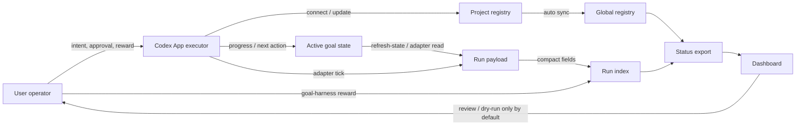

# State Interaction Model

Goal Harness should not grow by adding commands one at a time. New capabilities
must fit a clear state model between the goal, the Codex App executor, the
human operator, and the dashboard.

This document is the design gate for future controller, dashboard, reward, and
multi-project work. If a proposed feature cannot name the state it reads, the
state it writes, the owner of that write, and how the dashboard proves it, the
feature is not ready.

## Actors

### Goal

A goal is the durable work object. It owns the objective, current state,
authority sources, safety guards, validation surfaces, run history, and next
handoff condition.

A goal is not a chat thread. A thread can execute a goal, but the goal must
survive thread reloads, network interruptions, and multiple project agents.

Goal-owned state:

- project-local registry entry,
- active goal state file,
- compact run index,
- private run payloads,
- optional human reward overlays attached to exact runs.

### Codex App Executor

The Codex App executor is an actor that can read goal state, run commands, edit
files, spawn or coordinate child work, and write new state through Goal Harness
commands.

The executor is ephemeral. It should not be the source of truth. Its job is to
convert current context into bounded transitions:

- connect a project,
- inspect or map read-only state,
- perform one verified work segment,
- append a refresh run after state-only work,
- append a compact run after adapter work,
- update active state with progress, critic, and next action.

Executor-owned state should be minimal: current conversation context, local
tool outputs, and temporary execution decisions. Durable state belongs in the
goal stores above.

### User

The user is the operator and reward source. The user supplies high-quality
judgment that the executor cannot infer safely:

- whether a route, result, or tradeoff was good,
- whether a controller may move from observation to advice,
- whether write or production actions are allowed,
- whether a project should stay active, pause, or archive.

The user's feedback should be recorded close to the run being judged. A
structured `human_reward` overlay is better than burying the judgment in chat,
because later controller ticks and dashboards can see exactly which decision
was rewarded.

User intent can authorize a transition, but it should still be persisted as a
goal event, state update, or reward overlay before future agents rely on it.

### Dashboard

The dashboard is a local control-plane view. It is not the source of truth.
It is the human-facing product surface, not a dressed-up CLI dump.

By default it reads the status export and optional loopback status server:

- global registry scope,
- attention queue,
- contract health,
- compact run history,
- controller readiness,
- human reward summaries,
- artifact availability.

The dashboard can help the user review, filter, and dry-run feedback. Direct
writes from the dashboard must remain opt-in and gated. Browser-side writes
need an explicit capability, preview handshake, exact run target, and loopback
server boundary.

The dashboard should translate agent-facing status fields into operator
questions: "do I need to judge this?", "is an agent ready to work?", "are we
waiting on evidence?", and "is a controller handoff safe yet?" Raw
classifications, paths, and adapter terms should be secondary drill-down
details.

## State Stores

| Store | Owner | Reader | Writer | Purpose |
| --- | --- | --- | --- | --- |
| Project registry | Project goal | CLI, executor, status | `connect`, `bootstrap`, narrow project setup | Declares goal identity, repo, adapter, authority, guards. |
| Active goal state | Project goal | Executor, adapters, user review | Executor or project controller | Durable context, latest progress, next action, validation surfaces. |
| Shared global registry | Local control plane | Status, dashboard, any project shell | `connect`, `refresh-state`, `sync-global` | Multi-project discovery without manually copying registry entries. |
| Run payloads | Goal runtime | Executor, local reviewer | Adapters, `refresh-state`, `read-only-map` | Rich private evidence for one run. |
| Compact run index | Goal runtime | Status, dashboard, heartbeats | Adapters, reward overlay writer | Public-safe timeline and latest status. |
| Status export | CLI/status layer | Dashboard, pre-tick, heartbeats | `goal-harness status` | Agent-facing machine contract and dashboard input. |
| Dashboard UI state | Browser session | User | Browser URL/search state | Filters, selected goal, selected run; not durable goal truth. |

## State Flow

The CLI status export is for agents and local tools. The dashboard reads that
derived surface, then presents a user-facing interpretation. It should not
reach behind the status layer to reinterpret private files, and it should not
directly mutate goal state unless a future explicit write boundary is enabled.

## Core Transitions

### Connect

Purpose: make a project visible to the local control plane.

Writer: executor through `goal-harness connect` or `bootstrap`.

Writes:

- project registry,
- initial active state if missing,
- global registry sync.

Dashboard effect: a connected goal appears in global status. If there is no
run yet, status should surface `connected_without_run` so the next action is
clear.

### Read-Only Map

Purpose: turn a generic connection into a useful project map without granting
write authority.

Writer: executor through `goal-harness read-only-map`.

Writes:

- private map payload,
- compact `read_only_project_map` run.

Dashboard effect: the goal moves from "connected but not inspected" to "Codex
can use the map or build a project-specific adapter." This is a handoff state,
not proof that the project is fully automated.

### State Refresh

Purpose: make state-only work visible when no adapter ran.

Writer: executor through `goal-harness refresh-state`.

Writes:

- private refresh payload,
- compact `state_refreshed` run.

Dashboard effect: latest dashboard state catches up with active state changes.
This prevents a project from looking stale after the user or executor updated
the goal document, ledger, or next action.

### Adapter Tick

Purpose: inspect project-specific evidence and emit a compact decision surface.

Writer: project adapter or executor-controlled pre-tick.

Writes:

- private project evidence payload,
- compact run index row with classification and one recommended action.

Dashboard effect: the goal enters the appropriate lane: user/controller,
Codex-ready, external-watch, or blocked health.

### Human Reward

Purpose: capture high-quality operator judgment near the decision being judged.

Writer: user-authorized `goal-harness reward`.

Writes:

- compact overlay row in the run index.

Dashboard effect: selected runs show whether human judgment exists and what
class of decision it judged. This is the main improvement over bare goal-mode
chat, where feedback is easy to lose.

## Dashboard Architecture

The dashboard should optimize for operator decisions, not decorative reporting.
It should not expose the CLI status contract as the primary mental model.

First screen:

- user actions that need the operator before auxiliary source controls or raw
  status drill-down,
- selected action share controls next to those actions, so review links,
  user judgment, project-agent instructions, and dry-run preview are visible in
  one canonical packet without hunting through the page,
- contract health and global registry health,
- lanes by `waiting_on`: user/controller, Codex-ready, external evidence,
  blocking health,
- a user review map that translates lifecycle phases into "needs first run",
  "state changed", "agent inspected", "reward recorded", and "controller
  readiness or controller-gated" states;
- compact goal rows with user-facing phase, latest classification as a
  secondary detail, last run time, recommended action, reward presence, and
  controller readiness.

Goal detail:

- goal identity and authority sources,
- operator decision: review or authorize, let Codex continue, wait for
  evidence, or fix health first,
- active state freshness,
- run timeline,
- controller readiness gates,
- human reward timeline,
- artifact availability,
- project map or adapter-specific compact panels.

User review surface:

- show first-screen operator actions before raw goal detail: reward gates,
  controller opt-ins, evidence watches, Codex handoffs, and blocking health
  items,
- include the safe local CLI path or reward-draft hint on first-screen action
  cards when it helps the user move from judgment to an agent-facing command,
- allow local action-kind focus such as reward, controller, Codex, evidence,
  or health while treating that filter as dashboard UI state rather than
  durable goal truth,
- keep that action-kind focus URL-backed when useful, so a human can reload or
  share the current review lane without mutating goal, run, or status state,
- keep selected goal detail URL-backed when useful, while treating it as
  browser review state rather than a durable goal transition,
- expose a compact review link affordance for the current action-kind focus,
  selected goal, status source, and queue filters; copying that link is still
  dashboard UI state, not reward, approval, or controller opt-in,
- expose one copyable Review Packet for the selected action rather than several
  competing copy formats. The packet should combine the review link, Chinese
  agree/disagree/reason/next-step prompt, project-agent instructions,
  reward/default hint, and local dry-run preview. It is for user-to-agent
  collaboration and must not be parsed as durable reward, approval, controller
  opt-in, or write-control,
- show the run being judged,
- show why the system thinks a human decision is needed,
- show the selected goal's current operator stance before raw run history,
- show a safe CLI path for the stance: status/history inspection,
  read-only-map or refresh-state dry-run, or reward dry-run through the Reward
  CLI Draft,
- generate a CLI reward draft or dry-run request whose defaults derive from
  the selected operator stance and missing gates,
- never imply that reward equals write authorization.
- keep schemas, routes, and component structure stable in English, but allow
  operator-facing review summaries and handoff judgments to be localized for
  the human reviewer.

Executor surface:

- show the next allowed transition,
- show missing gates,
- show whether the next action is read-only, state refresh, adapter tick,
  reward capture, controller opt-in, or explicit write approval.

CLI surface:

- keep fields terse, stable, and machine-readable;
- prefer classifications, lifecycle phases, gate ids, and one recommended
  action over user-facing prose;
- avoid local private evidence and UI-only copy.

## Invariants

- The active goal state is the durable context; chat is only execution context.
- The compact run index is the dashboard timeline; private payloads are not the
  dashboard contract.
- Every meaningful state-only update needs a refresh run if the dashboard is
  expected to reflect it.
- A read-only map does not authorize mutation, decision advice, or production
  control.
- Human reward does not authorize writes unless the reward explicitly records a
  separate approval and the target transition supports it.
- Durable reward belongs in the run-bound `human_reward` overlay. Active goal
  state can summarize that a reward was recorded, but it should not become the
  only reward source that other project agents rely on.
- The global registry is synced from project-local registries; agents should
  not manually paste project entries into a separate queue.
- UI filters and selected rows are browser state, not goal state.
- Unknown status fields are additive; changing the meaning of existing compact
  fields requires a contract update.
- Public examples and docs must stay sanitized even when local status exports
  contain private machine paths.

## Feature Gate Checklist

Before adding a new command, dashboard widget, adapter field, or controller
stage, answer:

- Which actor owns the state being changed?
- Which store is the source of truth after the transition?
- Is the transition read-only, advisory, reward capture, or write control?
- What compact field will status export?
- What should the dashboard show on the first screen?
- What private evidence must stay out of compact history?
- What validation proves the state changed correctly?
- What stale-state failure does this prevent?

If these answers are unclear, improve the design before adding the capability.

## Near-Term Product Implication

The next milestone should not be another isolated adapter command. It should
make the dashboard and status contract reflect this model:

- show whether a goal is merely connected, mapped, refreshed, adapter-inspected,
  reward-judged, controller-gated, or controller-ready;
- make the user/controller lane distinct from Codex-ready work;
- make human reward capture a first-class review action;
- make stale dashboard state obvious and recoverable;
- make multi-project management possible without asking each project agent to
  manually maintain a global queue.
