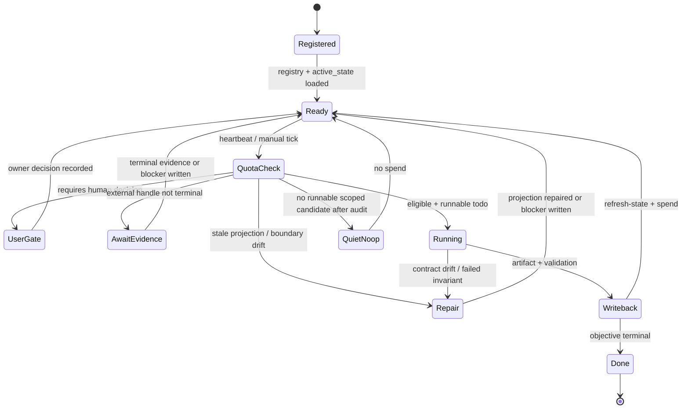
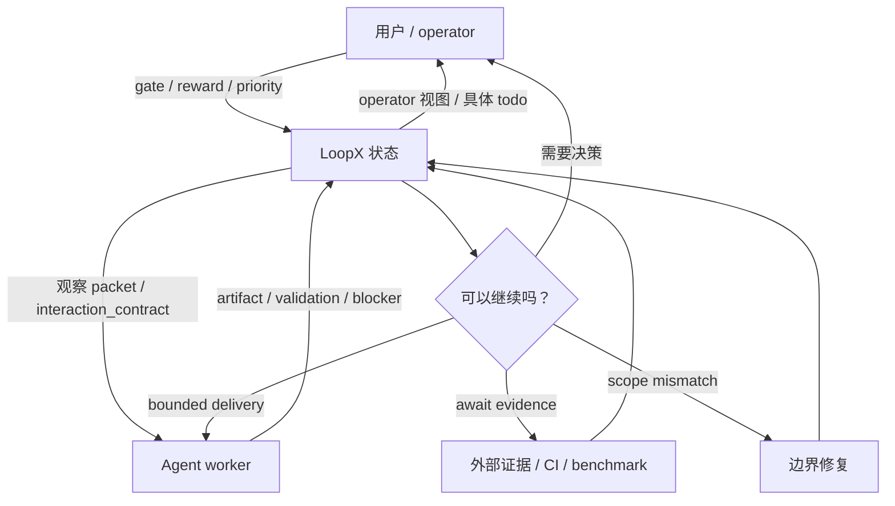
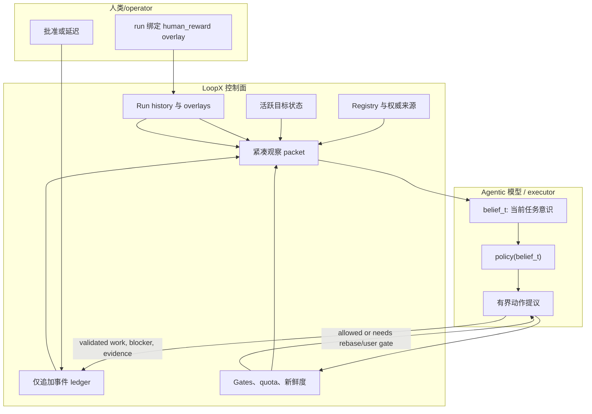
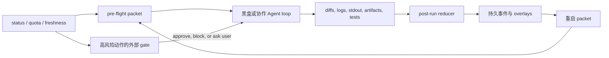
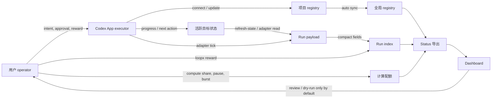

# State 交互模型

> [English](state-interaction-model.md)

LoopX 不应靠一次添加一个命令来成长。新能力必须契合目标、Codex App executor、
人类 operator 与 dashboard 之间的清晰状态模型。

本文档是未来 controller、dashboard、reward 与多项目工作的设计关卡。
如果一个提议的功能不能点名它读的状态、写的状态、该写的 owner，
以及 dashboard 如何证明它，则该功能还不就绪。

具体重复出现的情形，维护
[交互模式目录](concepts/interaction-pattern-catalog.md)。状态模型定义 actor
边界与存储；模式目录记录好用例、坏用例、预期用户/Agent 通道与验证参考。

该关系的紧凑产品图位于
[`docs/product/core-control-plane/`](product/core-control-plane/)。它把交互目录
透镜、状态定义与状态机放在一起，使新模式可以细化而不创建第二套控制面词汇。

## Actors

### Goal

目标是持久工作对象。它拥有 objective、当前状态、权威来源、安全 guard、
验证面、run history 与下一个 handoff 条件。

目标不是聊天线程。线程可以执行目标，但目标必须活过线程重载、网络中断与多个
项目 Agent。

对高层产品语言，这就是**终身目标**对象：可能活过任何特定 todo、计划、run 或
执行者持久的意图。终身目标拥有连续性，而非无限自主。它应保持当前权威、边界、
证据轨迹与人类纠正可见，让未来 Agent 重新解释下一个有界步骤，
而不是依赖私有模型记忆。

Goal 拥有的状态：

- 项目本地 registry 条目，
- 活跃目标状态文件，
- 紧凑 run 索引，
- 私有 run payload，
- 附着到确切 run 的可选人类奖励 overlay，
- 该目标的可选计算配额与 spend ledger。

### Codex App Executor

Codex App executor 是可以读目标状态、运行命令、编辑文件、生成或协调子工作，
并通过 LoopX 命令写新状态的 actor。

执行者是临时的。它不应是真相源。它的工作是把当前上下文转换成有界转移：

- 连接项目，
- 检查或映射只读状态，
- 执行一个验证过的工作片段，
- 状态-only 工作后追加 refresh run，
- adapter 工作后追加紧凑 run，
- 用进度、critic 与下一动作更新 active state。

执行者拥有的状态应最小：当前对话上下文、本地工具输出与临时执行决策。持久状态
属于上面的目标存储。

### User

用户是 operator 与奖励源。用户提供执行者无法安全推断的高质量判断：

- 路线、结果或权衡是否好，
- 一个纠正是否应成为未来 Agent 的持久运维教训，
- controller 是否可以从观察转向建议，
- 写或生产动作是否允许，
- 项目应保持活跃、暂停还是归档，
- 一个目标应获得更多计算配额、更少计算配额还是临时突发。

用户反馈应记录在接近被判断的 run 处。结构化 `human_reward` overlay 优于把判断
埋进聊天，因为后续 controller tick 与 dashboard 可以确切看到哪个决策被奖励。

用户意图可以授权转移，但在未来 Agent 依赖它之前，仍应持久化为目标事件、
状态更新或奖励 overlay。当用户纠正路线、优先级、benchmark 协议或产品假设时，
纠正不应只活在聊天或模型记忆里。把它当作候选运维教训：写进 active state 或
紧凑 run 绑定/用户奖励事件，添加或更新使该教训可执行的具体 agent todo，
并刷新状态使 `quota should-run` 能投影纠正后的规则。模型仍可用更丰富的对话
上下文解释该教训，但 LoopX 必须携带未来 Agent 能看到的持久钩子。

### Dashboard

Dashboard 是本地控制面视图。它不是真相源。它是人类面向的产品面，
不是打扮过的 CLI 转储。

默认它读取 status 导出与可选 loopback status server：

- 全局 registry 范围，
- attention queue，
- 契约健康，
- 紧凑 run history，
- controller 就绪，
- 人类奖励摘要，
- 计算配额状态，
- 产物可用性。

Dashboard 可以帮助用户评审、过滤与 dry-run 反馈。来自 dashboard 的直接写必须
保持 opt-in 且有 gate。浏览器侧写需要显式能力、预览握手、确切 run 目标与
loopback server 边界。

Dashboard 应把 Agent 面向的 status 字段翻译成 operator 问题："我需要判断这个吗？"、
"Agent 准备好工作了吗？"、"我们在等证据吗？"、"controller handoff 现在安全吗？"
原始分类、路径与 adapter 术语应是次级下钻细节。

Dashboard 最终可能看起来像通道工作区：一个目标时间线、Agent/成员在场、任务声明、
批准与产物汇聚一处。该 frontstage 视图必须保持为持久 LoopX 事件上的投影。
通道消息可以帮人协作，但事件 ledger 决定什么当前、谁拥有任务、哪个租约活跃，
以及后来的 Agent 是否可恢复工作。

第一个用户面向视图还应显式 TODO 归属。在 operator 阅读完整动作卡片或 run history
前，dashboard 应显示每个目标第一个开放 `user_todos` 条目与最高优先级开放
`agent_todos` 条目。这保护 loop 两侧：用户可以看到哪个人类/owner 动作阻塞进度，
下一个 Agent 可以看到紧凑工作条目而无需重读过期线程上下文。详细动作 packet、
评审材料、run history 与原始 adapter 字段保持下钻面。

在多 Agent 目标中，每个开放用户 todo 有显式响应绑定：`bound_agent=<registered-agent>`
把提醒与响应后延续路由到一个 Agent lane，而 `goal_bound=true` 让条目刻意对目标内
每条 lane 可见。这个关系独立于 gating。`user_action` 保持非阻塞；
`user_gate` 单独用 `blocks_agent` 或 `global_gate=true` 停止工作。`claimed_by`
保持 agent todos 的执行者归属，且不得编码用户 todo 绑定。Agent 作用域 quota 投影
把其他 lane 用户 todos 保留为诊断，但把它们排除在当前 lane 的 `open_count` 与
用户通知通道之外。

## 三角 Actor 交互协议

当前失败模式不是缺少提示细节。它是关于哪个 actor 拥有下一个转移的含糊。
当该边界隐式时，Agent 可以等待从未启动的线程、为小的公共 gate 询问用户、
因顶层 lane 被阻塞而停止健康自动化，或在没有实质转移的 monitor 上花一个 turn。

LoopX 因此应为每个所选目标暴露一个机器可读交互契约：

```text
loopx --format json quota should-run --goal-id <goal-id>
```

guard 的 `interaction_contract` 是一等协议。`execution_obligation`、
`heartbeat_recommendation`、`work_lane_contract`、`external_evidence_observation`、
`goal_boundary` 与 `protocol_action_packet` 等更旧字段保持兼容与下钻字段。
执行者应把 `interaction_contract.agent_channel.primary_action` 当作当前 turn 的
单一动作入口。如果它携带 `resolution_trace`，该 trace 只是紧凑解释：
primary action 匹配了哪个投影信号、`Next Action` / latest-run 漂移是否存在；
它不是第二动作源，也不单独授权状态同步。
当最终契约是阻塞用户 gate 时，它还携带紧凑 `interaction_response_plan_v0`：
`kind=surface_user_gate`、`decision=ask_user`、有序
`action_sequence=[notify, wait]` 与 `silent_wait_allowed=false`。同一计划被投影进
TurnEnvelope，使真实执行者与模型行为资格 actor 消费一个 typed 行为源。
自动化提示保持薄调度器；它不以散文复制该 gate 规则。
对注册 Agent，`interaction_contract.cli_channel.next_cli_actions` 中的作用域状态
与记账命令保留同一 quota 决策的归一化有效 `--available-capability` 信封。
能力描述观察到的执行支持；它们不授予权威，也不替代用户、仓库策略或生产 gate。
Owner 持有的权威标签（如凭据与生产访问）被排除在该 CLI 投影外。
相邻 `task_scope=goal_all_read_claimed_run_global_read_v0` 契约定义任务发现，
而不把可见性变成权威。peer 读取当前目标的普通 todo 积压，只选择自己的声明或
合格未声明候选，并在执行前声明。其他 Agent 声明保持诊断。跨目标清单只能通过
显式只读 global-manager 命令获得，不能进入目标本地执行队列。
Legacy Markdown 解析权威更低：它是 `Next Action` 中未投影散文的确定性 lint，
不是 gate 真相源。热路径不应调用 LLM 判断用户是否被 gate，
因为那给 `quota should-run` 增加延迟、成本、非确定性、提示注入面与私有文本处理
风险。如果 LLM 有用，把它留在冷提议 lane，为稍后的确定性晋升步骤建议结构化
`User Todo`、`decision_scope` 或 `Agent Todo` 编辑。

### Actor 边界

| Actor | 拥有 | 不得拥有 |
| --- | --- | --- |
| 用户/operator | 边界决策、奖励、私有材料、凭据、付费/云资源、破坏性 git、生产动作、公开提交/声明、显式产品方向变更。 | 常规公共读、任务行访问、todo 拆分、本地状态写回、public-safe 验证，或在已授权 P1/P2 工作中选择。 |
| Agent/Codex executor | 每 turn 一次有界转移：检查当前状态、选择最高安全 lane、实现或观察、验证、写回，并只在 delivery 后 spend。 | 持久真相、隐式批准、未记录奖励、隐藏长期记忆、静默取消或凭据复制。 |
| LoopX CLI | 目标真相投影、等待 owner、quota、交互模式、机器义务、spend 策略、存活性与兼容下一步命令。 | 人类判断、超出紧凑投影的私有证据解释，或自动化提示中的项目特定分支。 |
| Skill | 安全使用 CLI 的程序性 operator/Agent 手册。 | 运行时路由权威或覆盖 `quota should-run` 的第二状态机。 |
| 自动化提示 | 薄引导：唤醒、预检、运行 CLI guard、可用时使用 skill、遵循 `interaction_contract`，并在全局安全边界停止。 | 长项目特定控制流、过期 TODO 记忆或手写例外。 |

Agent 可见的后续工作属于 `Agent Todo`，不在提示分支。当 Agent 知道 todo 是可执行
工作还是仅 watch 工作，它应通过 `loopx todo add --task-class ...` 与可选
`--action-kind ...` 注册该事实。active-state 元数据随后通过同一 CLI 投影喂入
status、quota、dashboard 与 review-packet 消费方。遗留 todo 文本分类只存在
让更旧状态可读。

对更大功能，优先 todo succession 而非生命周期膨胀。Goal Harness 不需要许多功能
状态来知道工作是否剩余。Agent 应完成当前实现切片，然后立即为上线、产品路径审计、
文档、遥测、benchmark 证明或 operator 决策创建下一个具体 todo。如果无需后续，
完成说明应说明原因。这让 LoopX 负责持久清单真相，而把"下一步该做什么"的语义
判断留给模型/执行者。

### 运营控制循环

可复用产品循环是用户 / Agent / state，而不是单独的 Agent / chat。
LoopX 拥有共享控制状态；operator 提供决策、奖励与优先级；Agent worker 把观察
packet 变成有界工作；外部系统提供证据；guard 决定下一个转移是 delivery、决策、
证据等待还是边界修复。

该循环背后的产品品味很简单：安全工作存在时不要让 Agent 空转，
没有验证转移可用时不要让它在原地打转，也不要让人类从聊天历史中重新发现重要
gate。Human-in-the-loop 意为人类控制边界、奖励与路线决策；它不意味着每个有界
Agent 步骤都等手动批准。

运行时生命周期刻意小。LoopX 先解析 registry 与 active state，然后每次 heartbeat
或手动 tick 在任何 Agent delivery 前运行 quota guard。guard 在人类决策、
外部证据等待、有界工作、quiet no-op 或修复之间选择。只有验证 writeback 能改变
持久状态或花配额。


```mermaid
stateDiagram-v2
    [*] --> Registered
    Registered --> Ready: registry + active_state loaded
    Ready --> QuotaCheck: heartbeat / manual tick
    QuotaCheck --> UserGate: requires human decision
    QuotaCheck --> AwaitEvidence: external handle not terminal
    QuotaCheck --> Running: eligible + runnable todo
    QuotaCheck --> QuietNoop: no runnable scoped candidate after audit
    QuotaCheck --> Repair: stale projection / boundary drift
    Running --> Writeback: artifact + validation
    Running --> Repair: contract drift / failed invariant
    AwaitEvidence --> Ready: terminal evidence or blocker written
    UserGate --> Ready: owner decision recorded
    Writeback --> Ready: refresh-state + spend
    Writeback --> Done: objective terminal
    Repair --> Ready: projection repaired or blocker written
    QuietNoop --> Ready: no spend
    Done --> [*]
```


```mermaid
flowchart TB
  U["用户 / operator"] -->|"gate / reward / priority"| GH["LoopX 状态"]
  GH -->|"operator 视图 / 具体 todo"| U
  GH --> C{"可以继续吗？"}
  C -->|"需要决策"| U
  GH -->|"观察 packet / interaction_contract"| A["Agent worker"]
  C -->|"bounded delivery"| A
  A -->|"artifact / validation / blocker"| GH
  C -->|"await evidence"| E["外部证据 / CI / benchmark"]
  E --> GH
  C -->|"scope mismatch"| B["边界修复"]
  B --> GH
```

该图是 dashboard 与 heartbeat 面背后的紧凑契约：

- 运行时状态机说明允许哪个生命周期转移；
- 如果 `can continue?` 解析为 `bounded_delivery`，Agent 必须在 spend 前产出
  验证产物、blocker 或状态写回；
- 如果解析为 `needs decision`，用户面向面必须显示具体问题或 todo，
  而不是含糊 owner 等待；
- 如果解析为 `await evidence`，Agent 可以执行有界只读轮询，但不得发明 delivery 工作；
- 如果解析为 `scope mismatch`，旧批准或奖励只是审计锚点，
  直到新鲜边界投影授予所需写作用域。

### 交互模式

`interaction_contract.mode` 应显式表达这些模式：

- `bounded_delivery`：Codex 拥有一个验证过的工作片段。它应运行 steering audit、
  选择 P0/P1/P2 lane、实现、验证、写回，并恰好在 delivery 后 spend 一次。
- `user_gate`：用户/operator 拥有下一个决策。Agent 问简洁问题且不运行被 gate
  的路径。如果 CLI 暴露安全绕过，gate 表露后的后续 turn 可以做无关的有界 P1/P2 工作。
- `scoped_user_gate_fallback`：具体用户 gate 拥有一个动作作用域，但非依赖
  fallback 可执行。用户通道保持 `NOTIFY/action_required`；Agent 通道对所选的
  fallback 保持 `must_attempt`；被 gate 的动作本身不得运行。
- `user_todo_blocker_push`：用户拥有一个开放 todo。Agent 通知、不 spend，
  不应把 turn 描述为"no user action"。在多 Agent 目标中只适用于
  `bound_agent` 选择的 lane，或 `goal_bound=true` 时每条 lane。
- `successor_replan_required`：延迟 todo 的恢复 gate 已满足，但条目仍延迟。
  Agent 不立即运行普通 delivery；它重新打开 todo、用当前 successor 替代它，
  或记录 public-safe 无后续理由，然后重跑 guard。这是 gate-resume 模式，
  不是 Agent 作用域无候选等待。
- `external_evidence_observation`：Codex 不运行 benchmark/model/Docker delivery。
  它必须先验证可观察 handle，如线程 id、作业 id、标记或紧凑 writeback 通道。
  这既适用于显式 `waiting_on=external_evidence` 目标，
  也适用于已启动长时工作而当前动作是紧凑结果轮询的目标。如果无 handle，
  写紧凑 blocker 而不是安静等待。
- `monitor_quiet_skip`：无实质转移。HEartbeat 的 turn 作用域 `quota should-run`
  guard 幂等提交一个收据及其无 spend 停滞观察，然后返回后续决策。重试复用
  同一 turn id 并修复部分写；后续 heartbeat 用新 id。自动化保持活跃。
- `autonomous_replan`：重复的无进展证据已越过自修复阈值。Codex 必须在另一次
  quiet no-op 前运行一个有界 replan/修复片段或写具体 blocker。
- `outcome_floor_recovery`：当前路径只允许恢复缺失的 outcome 规模证据或写 blocker；
  不允许 surface-only 工作。
- `mapped_noop_if_unchanged` 与 `quota_throttled`：只在检查契约前置条件后允许
  quiet no-op；它们不是自动化取消信号。

### 长时 Todo 执行

长 horizon 执行应是一系列紧凑转移，而不是无界的"继续上一件事"循环：

1. 运行 `quota should-run`。
2. 先遵循 `interaction_contract`。
3. 如果契约允许 Agent 工作，从活跃 `agent_todos`、优先级栈与当前 blockers
   选择一条 lane。
4. 如果顶层 P0 lane 被阻塞，记录或表露 blocker，然后仅在 CLI 契约允许安全
   绕过、恢复、自修复或另一个有界义务时继续可验证的 P1/P2 lane。否则保持自动化
   活跃不 spend，或让全局 scheduler 选另一个合格目标。
5. 验证并写持久状态再 spend。
6. 在验证后的 delivery、blocker 写回或实质转移后恰好 spend 一次。
7. 当 dashboard/控制面需要新紧凑真相时，spend 后刷新状态。

这让用户角色高价值：用户解决真实边界与奖励判断，而 LoopX 阻止 Agent
在常规路由选择上停滞。

## Agentic RL 边界模型

LoopX 应作为 agentic RL 风格 worker 的外围控制面，而不是策略本身。
它的工作是把部分、长时项目历史变成当前、可审计的观察 packet。模型的工作是把
该 packet 加现场工作区上下文变成内部信念状态，并选择下一个有界动作。

运行时划分是：

```text
observation_t = project(
  registry,
  active_goal_state,
  event_ledger,
  run_history,
  todos,
  gates,
  quota,
  authority_sources,
  decision_freshness
)

belief_t = model.update(
  observation_t,
  system_prompt,
  current_thread_context,
  current_tool_observations,
  model_memory,
  uncertainty
)

action_t = model.policy(belief_t)
checked_action_t = loopx.guard(action_t, observation_t)
event_or_reward_t+1 = append_after_validation(checked_action_t, outcome_t)
```

在该模型中，`event replay` 是 `observation_t` 的输入材料，`human_reward`
是后来的评估信号。二者都不是模型的完整执行状态。执行状态是模型当前信念，
它允许比 LoopX 投影更丰富，但不得静默覆盖 LoopX 边界、权威、新鲜度警告或用户 gate。

| 层 | 拥有 | 不得拥有 |
| --- | --- | --- |
| LoopX 控制面 | 持久事实、事件 ledger、active-state 投影、权威来源注册、决策新鲜度、quota、gate、可重启性、公共/私有边界检查、run 绑定奖励 overlay。 | 语义规划、隐藏偏好学习、任务特定策略、未记录批准或模型内部信念。 |
| Agentic 模型 / executor | 信念综合、不确定性处理、动作选择、对当前证据的旧决策语义重基准、有界实现、验证选择，以及歧义真实时询问用户。 | 持久真相源、隐式写授权、目标事件之外的永久用户偏好存储，或把聊天记忆当作比当前 status 更强。 |
| 人类/operator | 奖励、批准、私有材料访问、生产/破坏性/外部资源决策与高层权衡判断。 | 常规公共读、普通本地验证，或当 LoopX 能投影状态时手工重建当前状态。 |

这让 checkpoint 决策保持窄。Checkpoint 批准、奖励或恢复契约是带有效性检查的
审计锚点，不是重放旧聊天的指令。worker 复用前，LoopX 应指出决策点是否需要
对照当前 registry、active state、quota、策略、repo/run 状态与更新证据重新基准。
模型随后解释旧决策是否仍适用、答案含糊时询问用户，并把结果转移记录为新事件。

对写权威，checkpoint 必须在执行前变成边界投影。
`coordination.checkpointed_boundary_authority[]` 是该投影的紧凑机器形状：
新鲜批准的、带 public-safe 出处、`recorded_at` 与 `write_scope` 的条目被编译进
`goal_boundary.write_scope`。Handoff、聊天记忆或旧批准 run 中的散文可以促使
Agent 修复投影，但它本身不授予写权威。如果所选 todo 声明 `required_write_scopes`
且编译边界不覆盖它们，`quota should-run` 必须路由到 `boundary_projection_repair`
或具体用户/controller gate，而不是让 Agent 执行受保护写。


```mermaid
flowchart TB
  subgraph Harness["LoopX 控制面"]
    Registry["Registry 与权威来源"]
    ActiveState["活跃目标状态"]
    Ledger["仅追加事件 ledger"]
    Runs["Run history 与 overlays"]
    Gates["Gates、quota、新鲜度"]
    Observation["紧凑观察 packet"]
  end

  subgraph Model["Agentic 模型 / executor"]
    Belief["belief_t: 当前任务意识"]
    Policy["policy(belief_t)"]
    Action["有界动作提议"]
  end

  subgraph Operator["人类/operator"]
    Approval["批准或延迟"]
    Reward["run 绑定 human_reward overlay"]
  end

  Registry --> Observation
  ActiveState --> Observation
  Ledger --> Observation
  Runs --> Observation
  Gates --> Observation
  Observation --> Belief
  Belief --> Policy
  Policy --> Action
  Action --> Gates
  Gates -->|"allowed or needs rebase/user gate"| Action
  Action -->|"validated work, blocker, evidence"| Ledger
  Approval --> Ledger
  Reward --> Runs
  Runs --> Observation
```

### Agent Loop Adapter 深度

深度 Agent loop 集成是上界，不是前置条件。当 worker 是黑盒 CLI、托管 Agent、
benchmark runner 或无法修改的第三方 loop 时，Goal Harness 仍必须增值。
因此控制面应支持三种 adapter 深度：

| 模式 | 何时可用 | LoopX 责任 |
| --- | --- | --- |
| `in_loop` | worker 可以在自己 loop 中调用 LoopX API 或工具。 | 注入观察 packet、动作前暴露新鲜度/gate/quota 检查、验证转移后要求写回，并让 worker 把当前 status 用作一等上下文。 |
| `wrapper` | LoopX 可以启动或包装 worker 命令、提示、工作区或环境，但不能改变内部 loop。 | 运行预检状态/新鲜度检查、前置或挂载紧凑状态 packet、在有 hook 处保护高风险外部动作、收集 stdout/artifact/diff，并把结果归约为持久事件。 |
| `passive_posthoc` | LoopX 不能启动或拦截 worker；它只能事后检查可观察输出。 | 读仓库 diff、日志、run artifact、benchmark 输出或用户笔记；分类工作/证据/blocker/决策目标；追加紧凑事件；为下次 run 产生重启 packet。 |

跨三种深度的不变量相同：无论 loop 原生是否协作，LoopX 都产生并验证 Agent loop
周围的控制面上下文。如果 loop 不能信任为在边界停下，边界必须向外移到 wrapper、
提交路径、PR gate、benchmark 上传、云作业启动器、生产命令或 operator 批准面。


```mermaid
flowchart LR
  Status["status / quota / freshness"] --> Preflight["pre-flight packet"]
  Preflight --> Worker["黑盒或协作 Agent loop"]
  Worker --> Artifacts["diffs, logs, stdout, artifacts, tests"]
  Artifacts --> Reducer["post-run reducer"]
  Reducer --> Events["持久事件与 overlays"]
  Events --> Restart["重启 packet"]
  Restart --> Preflight
  Status --> Guard["高风险动作的外部 gate"]
  Guard -->|"approve, block, or ask user"| Worker
```

这让 passive 与 wrapper 模式成为一等产品面，而不是 fallback。Passive 基线应证明：
在深度 Agent loop 协作被视为必需之前，即使非协作 worker 也从 LoopX 获得更好的
可重启性、过期状态规避、证据纪律与奖励归因。

## 状态存储

| 存储 | Owner | Reader | Writer | 用途 |
| --- | --- | --- | --- | --- |
| 项目 registry | 项目 goal | CLI、executor、status | `connect`、`bootstrap`、窄项目设置 | 声明目标身份、仓库、adapter、权威、guard。 |
| 活跃目标状态 | 项目 goal | Executor、adapters、用户评审 | 合格 peer 或 operator | 持久上下文、最新进度、下一动作、验证面。 |
| 共享全局 registry | 本地控制面 | Status、dashboard、任何项目 shell | `connect`、`refresh-state`、`sync-global` | 多项目发现，无需手动复制 registry 条目。 |
| Run payload | 目标运行时 | Executor、本地评审者 | Adapters、`refresh-state`、`read-only-map` | 一次 run 的丰富私有证据。 |
| 紧凑 run 索引 | 目标运行时 | Status、dashboard、heartbeats | Adapters、reward overlay writer | public-safe 时间线与最新 status。 |
| 计算配额 / spend ledger | 目标运行时或 registry | Status、dashboard、automations | `quota` 命令、controller 写回、operator 决策 | 自动 Agent turn 的本地占空比或加权份额策略。 |
| Status 导出 | CLI/status 层 | Dashboard、pre-tick、heartbeats | `loopx status` | Agent 面向机器契约与 dashboard 输入。 |
| Dashboard UI 状态 | 浏览器会话 | User | 浏览器 URL/搜索状态 | 过滤器、所选目标、所选 run；不是持久目标真相。 |

## 事件 Ledger 契约

LoopX 应把紧凑 run 索引加奖励/quota overlay 当作长时工作的仅追加事件 ledger。
聊天线程、浏览器过滤器与本地工具输出可以帮助 worker 决定当下做什么，
但它们不是持久真相源。

Todo/history 迁移契约见
[`event_sourced_state_contract_v0`](reference/protocols/event-sourced-state-contract-v0.md)：
`ACTIVE_GOAL_STATE.md` 保持人类/Agent 工作台，而 canonical todo/history 状态
移到仅追加事件，带确定性重放、幂等追加、隐私分区与 Markdown 兼容投影。

控制面应保留这些事件类别：

- **工作事件**：`refresh-state`、只读映射、adapter ticks 与说明什么变了、
  如何验证的进度分类；
- **决策事件**：operator gate、checkpoint 恢复契约、批准、延迟与绑定到确切
  run 的 `human_reward` overlays；
- **记账事件**：如 `quota_slot_spent` 的 quota spend 行；
- **证据事件**：eval、CI、artifact、blocker、失败、done 或只读证据轮询观察。

当前状态是这些事件加活跃目标状态与 registry 策略的投影。该投影可以为提示与
dashboard 压缩旧细节，但不应静默替换或重写使决策可审计的事件。
`loopx status` 通过 `event_ledger_summary` 暴露该边界：对采样记账、决策、证据、
状态与工作事件的紧凑计数。Dashboard 与 heartbeat 提示可以用该投影理解近期
控制面形状，同时下钻 `run_history` 获取确切事件。

这给 LoopX 一个持久执行边界：

- Codex 线程是可替换 worker。它们执行有界转移，然后写验证事件。
- LoopX 控制面从事件 ledger 编排任务分发、quota、gate 与最新状态投影。
- Heartbeat 提示应保持薄。它们应查询 status、quota、review packet 与 active
  state，而不是携带项目特定历史。
- Spend、验证、产物、blocker、handoff 与只读证据轮询应在后续 Agent 依赖前变成
  持久事件。
- Side-bypass 与 main-control worker 应通过同一 ledger 协调，
  使它们不能双倍 spend、隐藏 blocker 或在过期状态上竞速。

## 派生任务图投影

一些复杂目标需要图形视图：独立交付物、有序依赖、接受 gate、修复 loop 与 handoff
点比平面 todo 列表更容易作为节点与边推理。LoopX 应支持该视图作为持久目标真相上的
派生投影，而不是第二真相源。

持久 owner 仍是事件 ledger、active goal state、todos、gates、leases、quota 策略
与 run history。当它帮助 Agent 或 operator 回答以下问题时，任务图可以从那些存储
渲染：

- 哪些交付物可以独立进行；
- 哪个 gate 阻塞下游工作；
- 哪个失败使后续待决工作失效；
- 哪个修复或验证节点应在收尾前运行；
- 哪个用户决策或租约拥有下一个转移。

投影还应保留持久控制状态与临时工作状态之间的有用区分：

- **控制状态**属于 LoopX：objective、约束、任务依赖、gate、租约、run 摘要、
  被接受证据与当前分发状态。
- **工作状态**属于一个 executor turn 或子 worker：代码片段、原始工具输出、
  临时假设、本地实现细节与冗长日志。

这让 LoopX 在重要处借用图形原生的恢复，而不强制每个目标进入多 Agent DAG。
小或线性目标可以保持普通 todos。多阶段目标可以投影图供分发、评审、修复、审计与
延续，而仅追加 ledger 仍决定发生了什么、哪个 worker 可恢复。

首个实现应只读为主：从 status 或 review packet 暴露可选紧凑
`task_graph_projection_v0`，由现有 todo id、gate id、run id 与 lease id 支撑。
写应继续通过现有生命周期命令，直到存在服务器支撑的租约/图形 API。初始协议与
公共 fixture 位于
[`docs/reference/protocols/task-graph-projection-v0.md`](reference/protocols/task-graph-projection-v0.md)。

旧用户决策需要新鲜度检查。七天的奖励、steering note 或批准仍可宝贵，
但 worker 只应在重放或重查可能使其过期的更新事件窗口后应用它。
当前 checkpoint gate 契约是该规则的第一版：把旧决策当作审计锚点，
然后在决策点对照当前 registry、active state、quota、策略、repo/run 状态与
近期证据重新基准。

## 优先级栈与 Next Action 选择

`Next Action` 应从一个目标优先级栈派生，而不是从上一个执行者碰巧触到的东西。

对 v0.1 控制面里程碑，使用这个默认优先级栈：

| 优先级 | 含义 | 典型面 |
| --- | --- | --- |
| P0 | 让多项目控制循环可靠。 | registry、全局 registry、active state、run history、权威覆盖、公共/私有边界、operator gate、human reward、项目 Agent packet、计算配额、真实 adapter 证明 |
| P1 | 让产品更易理解与使用。 | todo 聚焦 dashboard、dashboard 交互、operator 文案、分享文档、发布文案、探索 lane 设计 |
| P2 | 在 loop 正常后扩展平台。 | 更深调度、更丰富 dreaming、重构提议、更多 adapter、benchmark 扩展 |

在 P0 内，按此顺序选工作：

1. 状态真相与安全；
2. 人类决策 loop；
3. 项目 Agent 执行 loop；
4. 通过计算配额的多项目分配；
5. 真实 adapter 证明。

该顺序防止两个常见失败。第一，计算配额规划器不应把时间花在 status 过期、不安全
或built from错误权威来源的目标上。第二，dashboard 打磨不应替代后续项目 Agent
需要的持久奖励或 operator gate 状态。

Controller tick 应记录为何其选中的下一动作胜过相邻 P0/P1/P2 候选。理由可以紧凑，
但应点名优先级层次与它防止的过期状态或 operator 成本失败。

### Steering Audit

`quota should-run` 是计算 guard，不是策略选择器。它回答"该目标现在可以再花一个
自动 turn 吗？"它不回答"这个主题还是注意力的最佳用途吗？"
它的 `heartbeat_recommendation` 可以覆盖通用生命周期机制，如第一次保存的只读映射
或未变化映射 no-op，但它仍不替代真实 delivery 工作的优先级栈 steering audit。

在写新 `Next Action` 前，自主目标 tick 应运行小 steering audit：

1. 当候选存在时，列出至少三个来自不同 lane 的合理候选，如 state/safety、
   人类决策、项目 Agent 执行、计算分配、真实 adapter 证明、产品/沟通或探索；
2. 按上面的优先级栈选择，而不是只凭上一 tick 的相邻 critic；
3. 当同一主题已消耗多个最近 delivery 切片时应用延续检查。大主题可以继续，
   但 tick 必须把它们与其他 P0/P1/P2 候选重新排序，并说明为何继续仍是最高优先级
   动作；
4. 把 compute quota 与 focus quota 分开。Compute quota 控制目标可花多少 turn；
   focus quota 控制一个子主题是否值得下一个 turn；
5. 包含产品瓶颈视角：询问核心目标当前是否被用户体验、Agent 能力、证据质量、
   adapter 就绪或优先级规则缺口卡住，并在一个具体瓶颈候选应胜过最近本地 TODO
   时提升它；
6. 有价值时记录落选高价值候选，使下一 tick 可以恢复更广里程碑，
   而不是只重新发现最近的本地缺口。

这防止一连串各自正确、易于验证的切片挤掉更重要的里程碑，如真实项目 adapter 证明、
人类奖励质量或 dashboard 注意力减少。

## 状态流


```mermaid
flowchart LR
  User["用户 operator"] -->|"intent, approval, reward"| Executor["Codex App executor"]
  Executor -->|"connect / update"| Registry["项目 registry"]
  Executor -->|"progress / next action"| ActiveState["活跃目标状态"]
  Registry -->|"auto sync"| GlobalRegistry["全局 registry"]
  ActiveState -->|"refresh-state / adapter read"| RunPayload["Run payload"]
  Executor -->|"adapter tick"| RunPayload
  RunPayload -->|"compact fields"| RunIndex["Run index"]
  User -->|"loopx reward"| RunIndex
  User -->|"compute share, pause, burst"| Quota["计算配额"]
  GlobalRegistry --> Status["Status 导出"]
  RunIndex --> Status
  Quota --> Status
  Status --> Dashboard["Dashboard"]
  Dashboard -->|"review / dry-run only by default"| User
```

CLI status 导出是给 Agent 与本地工具的。Dashboard 读取该派生面，
然后呈现用户面向解读。它不应越过 status 层重新解释私有文件，
也不应在未来显式写边界启用前直接改动目标状态。

## 核心转移

### Connect

用途：让项目对本地控制面可见。

Writer：executor 通过 `loopx connect` 或 `bootstrap`。

写入：

- 项目 registry，
- 缺失时的初始 active state，
- 全局 registry 同步。

Dashboard 效果：已连接目标出现在全局 status。如果还没有 run，
status 应表露 `connected_without_run`，使下一动作清楚。

### 只读映射

用途：不授予写权威地把通用连接变成有用的项目映射。

Writer：executor 通过 `loopx read-only-map`。

写入：

- 私有映射 payload，
- 紧凑 `read_only_project_map` run。

Dashboard 效果：目标从"已连接但未检查"移到"Codex 可以使用映射或构建项目特定
adapter"。这是 handoff 状态，不是项目已全自动化的证明。

### 状态刷新

用途：无 adapter 运行时让仅状态工作可见。

Writer：executor 通过 `loopx refresh-state`。

写入：

- 私有刷新 payload，
- 紧凑 `state_refreshed` run。

Dashboard 效果：最新 dashboard 状态追上 active state 变化。
这防止用户在用户或 executor 更新目标文档、ledger 或下一动作后项目看起来过期。

对可问责、Turn 绑定的刷新，成功 writeback 与满足的 vision checkpoint 是不同事实。
`ok=true` 不意味着缺乏的 vision 决策被提供了。检查 `vision_checkpoint.satisfied`。

如果 checkpoint 是 `missing_required`，用**相同** Goal、Agent、Todo/obligation、
Turn 与 delivery 字段重试原始刷新命令，只添加一个 vision 决策：

- 持久 vision 真实保持适用时，
  `--vision-unchanged-reason 'Existing scope and acceptance still apply.'`；
- vision 需要更新时，合法 `--agent-vision-json` packet，或内联 `--vision-*`
  修补字段。文件输入必须对 CLI 进程可见；远程/沙箱 bridge 拥有搬运其内容。

`refresh_recovery.decision=supplement_checkpoint` 在原始结算身份下追加一个验证
checkpoint，而不重写原始产物或重新归因其 delivery 工作区。相同重试返回带已保存
checkpoint 的 `replay`；它不再追加。变化的满足决策、变化的 delivery payload，
或被后来同 Agent vision 替代的缺失 checkpoint 被拒绝且无写。Dry-run 预览不修复
收据也不追加历史。无先前 refresh/checkpoint 的收据绑定材料 monitor 轮询可能通过
正常 vision/replan 验证，与 next-action 和 vision 一起完成其缺失工作区 writeback。
这 first-closeout 兼容路径保留 poll 结局并拒绝无关变更；后续重试用相同严格
replay/conflict 规则。其他缺失工作区修复先于 checkpoint 补充。

不要重复实现、制造 successor，或为了修复这个 checkpoint 再开一个 Turn。
保持普通一次 spend 结算顺序。该恢复不证明接受、不关闭其他 Todos、
不绕过 replan、身份或终态 gate。实质性新 vision 仍可创建真实规划义务。

### 计算配额

用途：决定一个目标可消耗多少自动 Agent 计算。

Writer：用户授权的 `quota` 命令、controller 状态写回或派生 status 规划器。

写入：

- 每目标计算配额，如 `1.0`、`0.5`、`0.3` 或 `0`，
- 自动 ticks 或 Agent turns 的可选 spend ledger 条目，
- 紧凑分配状态，如 `eligible`、`throttled`、`waiting`、`operator_gate`、
  `paused` 或 `blocked_health`。

Dashboard 效果：operator 可以看到项目为何活跃、节流、等待、暂停或请求突发。
Automations 应把定时器 cadence 当作执行细节，并在运行工作前读取 LoopX 计算配额。

见 [quota-allocation.md](quota-allocation.md)。

### Adapter Tick

用途：检查项目特定证据并发出紧凑决策面。

Writer：项目 adapter 或 executor 控制的 pre-tick。

写入：

- 私有项目证据 payload，
- 带分类与一个推荐动作的紧凑 run 索引行。

Dashboard 效果：目标进入合适 lane：用户/controller、Codex-ready、外部关注或
受阻健康。

### 人类奖励

用途：在被判断决策附近捕获高质量 operator 判断。

Writer：用户授权的 `loopx reward`。

写入：

- run 索引中的紧凑 overlay 行。
- active-state 摘要与项目 Agent 历史查找的协调提示。
- operator 显式请求 `--write-active-state-summary` 时可选的 active-state
  `Progress Ledger` 摘要。

Dashboard 效果：所选 runs 显示人类判断是否存在及判断了什么决策类别。
这是对裸 goal-mode 聊天的主要改进，那里的反馈容易丢。

人类奖励还覆盖显式运维纠正，而不只是数字评分式批准。像"Codex stays local;
the remote host is only the execution substrate"这样的纠正应在下一次 benchmark 或
adapter turn 依赖前提升为持久运维教训。最小 writeback 是：

- 被纠正规则的紧凑摘要；
- 其适用范围，如 benchmark 族、路线、项目或目标；
- 它替代的旧假设；
- 使规则可执行的下一个 agent todo；
- 将证明未来投影的验证或新鲜度检查。

如果纠正改变安全边界，在授权受保护写或资源动作前它仍必须经过 checkpoint 边界
投影路径。

## Dashboard 架构

Dashboard 应优化 operator 决策，而不是装饰性报告。它不应把 CLI status 契约暴露为
主要心智模型。

首屏：

- 计算配额摘要：哪些目标合格、节流、等待、暂停或超预算；
- 在辅助源控制或原始 status 下钻前的用户动作，
- 所选动作份额控制紧邻那些动作，使评审链接、用户判断、项目 Agent 指令与 dry-run
  预览在一个 canonical packet 中可见，而不必翻找页面，
- 契约健康与全局 registry 健康，
- 按 `waiting_on` 的 lane：用户/controller、Codex-ready、外部证据、受阻健康，
- 把生命周期阶段翻译为"needs first run"、"state changed"、"agent inspected"、
  "reward recorded" 与 "controller readiness or controller-gated" 状态的用户评审
  映射；
- 带用户面向阶段的紧凑目标行，最新分类作为次级细节、最后 run 时间、推荐动作、
  奖励存在与 controller 就绪。

Goal 细节：

- 目标身份与权威来源，
- operator 决策：评审或授权、让 Codex 继续、等待证据或先修健康，
- active state 新鲜度，
- run 时间线，
- controller 就绪 gate，
- 人类奖励时间线，
- 产物可用性，
- 项目映射或 adapter 特定紧凑面板。

用户评审面：

- 在原始 goal 细节前显示首屏 operator 动作：奖励 gate、controller opt-in、
  计算配额变更、证据关注、Codex handoff 与阻塞健康条目，
- 当它帮助用户从判断转向 Agent 面向命令时，在首屏动作卡片上包含安全本地 CLI
  路径或奖励草稿提示，
- 允许本地 action-kind 聚焦，如 reward、controller、Codex、evidence 或 health，
  同时把该过滤器当作 dashboard UI 状态而非持久目标真相，
- 有用时把该 action-kind 聚焦保持在 URL 支撑，使人可重载或分享当前评审 lane，
  而不改动 goal、run 或 status 状态，
- 有用时把所选 goal 细节保持在 URL 支撑，同时把它当作浏览器评审状态而非持久目标
  转移，
- 为当前 action-kind 聚焦、所选目标、status 来源与队列过滤器暴露紧凑评审链接
  入口；复制该链接仍是 dashboard UI 状态，不是奖励、批准或 controller opt-in，
- 为所选动作暴露一个可复制 Review Packet，而不是几个竞争复制格式。packet 应组合
  评审链接、中文同意/不同意/理由/下一步提示、项目 Agent 指令、奖励/默认提示与本地
  dry-run 预览。对奖励动作，项目 Agent 部分应提供已记录 run 绑定奖励的历史查找，
  而不是要求项目 Agent 写奖励。它是供用户到 Agent 协作的，不得解析为持久奖励、
  批准、controller opt-in 或 write-control，
- 显示被判断的 run，
- 显示系统为何认为需要人类决策，
- 在原始 run history 前显示所选目标当前 operator 立场，
- 为该立场显示安全 CLI 路径：status/history 检查、read-only-map 或 refresh-state
  dry-run，或通过 Reward CLI Draft 的 reward dry-run，
- 生成 CLI 奖励草稿或 dry-run 请求，其默认从所选 operator 立场与缺失 gate 派生，
- 绝不暗示奖励等于写授权。
- 保持 schema、路线与组件结构英文稳定，但允许 operator 面向的评审摘要与 handoff
  判断为人类评审者本地化。

Executor 面：

- 显示下一个允许转移，
- 显示目标在计算配额下是否合格，
- 显示缺失 gate，
- 显示下一个动作是只读、状态刷新、adapter tick、奖励捕获、controller opt-in
  还是显式写批准。

CLI 面：

- 保持字段简洁、稳定、机器可读；
- 优先分类、生命周期阶段、gate id 与一个推荐动作，而非用户面向散文；
- 避免本地私有证据与仅 UI 文案。

## 不变量

- 活跃目标状态是持久上下文；聊天只是执行上下文。
- 紧凑 run 索引是 dashboard 时间线；私有 payload 不是 dashboard 契约。
- 每次有意义的状态-only 更新需要 refresh run，才能让 dashboard 反映它。
- 只读映射不授权变更、决策建议或生产控制。
- 人类奖励不授权写，除非奖励显式记录单独批准且目标转移支持它。
- 持久奖励属于 run 绑定 `human_reward` overlay。Active goal state 可以摘要记录了
  奖励，但不应成为其他项目 Agent 依赖的唯一奖励源。
- 改变运维策略的显式用户纠正应在未来 Agent 依赖前提升为持久运维教训、
  successor todo 或紧凑奖励/gate 事件。仅聊天记忆不是可重放控制面信号。
- 全局 registry 从项目本地 registry 同步；Agent 不应手工把项目条目粘贴进单独队列。
- 自动化 cadence 不是计算配额真相源。它可以唤醒执行者，但 LoopX 应决定目标是否
  合格、节流、暂停或等待。
- UI 过滤器与所选行是浏览器状态，不是目标状态。
- 未知 status 字段是附加的；改变现有紧凑字段的含义需要契约更新。
- 即使本地 status 导出包含私有机器路径，公共示例与文档仍必须保持脱敏。

## 功能 Gate 清单

在添加新命令、dashboard widget、adapter 字段或 controller 阶段前，回答：

- 哪个 actor 拥有被改状态？
- 转移后哪个存储是真相源？
- 转移是只读、建议、奖励捕获还是写控制？
- Status 将导出什么紧凑字段？
- Dashboard 首屏应显示什么？
- 该转移花费还是改变计算配额？
- 什么私有证据必须留在紧凑历史外？
- 什么验证证明状态正确改变？
- 这防止什么过期状态失败？

如果这些答案不清楚，在添加能力前改进设计。

## 近期产品含义

下一个里程碑不应是另一个孤立 adapter 命令。它应让 dashboard 与 status 契约
反映该模型：

- 显示目标只是 connected、mapped、refreshed、adapter-inspected、reward-judged、
  controller-gated 还是 controller-ready；
- 让用户/controller lane 与 Codex-ready 工作分开；
- 让人类奖励捕获成为一等评审动作；
- 让计算配额可见，使项目优先级不藏在自动化间隔里；
- 让过期 dashboard 状态明显且可恢复；
- 让多项目管理无需要求每个项目 Agent 手动维护全局队列。
