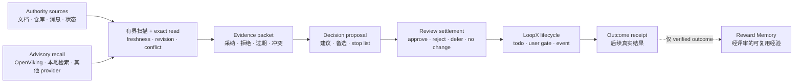

# Decision Context 能力介绍

[English](README.md) | [架构协议](../../../docs/reference/protocols/decision-context-architecture-v0.zh-CN.md)

状态：实验能力、内置、默认关闭、goal-scoped。

Decision Context 帮助长程 LoopX Agent 在行动前重建：**针对当前这次决策，
哪些事实仍然可信**。它把带 revision 的 authority source、有界召回、精确读取、
新鲜度检查和冲突处理组装成可审计的证据包；Agent 再基于证据提出建议，而
LoopX Core 仍是生命周期和动作权限的唯一 authority。

当一个 goal 跨越数天或数周，且答案不能安全地只依赖当前 prompt 或模型记忆时，
这项能力最有价值。

## 它解决什么问题

长程 Agent 的上下文通常分散在多个周期和系统中：

- 项目状态和信源文档各自变化；
- 旧判断可能已经过期；
- 语义召回可以找到线索，但不能证明当前事实；
- 模型建议容易被误当成事实；
- 如果决策和后续结果没有关联，就难以校准下一次决策。

Decision Context 把这些松散信息变成一个有边界的决策闭环：



## 它负责什么

Decision Context 负责“决策质量层”：

1. **增量信源 profile**：声明需要关注的信源类型、新鲜度、扫描方式和证据权重。
2. **有界扫描与 exact read**：发现变化，但不把原始正文复制进 LoopX packet。
3. **证据 rebase**：提升当前事实，并明确记录过期、拒绝或冲突的 claim。
4. **决策建议**：把 recommendation、alternatives、next actions 和 stop list
   与事实证据分开。
5. **评审回执**：复用现有 user gate 记录 owner 的 `approve`、`reject`、`defer`，
   或者在没有实质变化时记录一条无需 gate 的语义 `no_change`。
6. **cursor commit**：review settlement 与 lifecycle writeback 验证通过后推进
   私有信源 cursor，不等待未来的真实结果。
7. **结果回执**：在后续把接受的决策与真实结果、失效假设关联起来。

## 它不负责什么

Decision Context 不会：

- 替代 LoopX Core 的 todo、gate、quota、event 或 authority 语义；
- 把 provider 召回直接当成可信事实；
- 自动持久化聊天正文、tool output、凭据或原始 provider payload；
- 因为给出建议就获得执行权限；
- 自动激活 Reward Memory candidate；
- 强绑定 OpenViking 或任何单一 provider。

如果 provider 不可用，它会记录 provider health，并 fail open 到剩余 authority
source；不会阻断 Core lifecycle，也不会静默推进 source cursor。

Assembly 还会输出 `decision_source_coverage_v0`。它把每个优先级的扫描状态、
exact-read 完整度和未覆盖的 P0 source 投影为公开安全的回执。`P0 incomplete`
不阻断安全的 LoopX lifecycle，但调用方必须显式标记结论为部分覆盖，或者先通过
其他 authority 路径补齐 exact read；不能把 fail-open 误写成“所有关键上下文已检查”。

## 四类可审计产物

| 产物 | 回答的问题 | 典型内容 |
|---|---|---|
| `decision_evidence_packet_v0` | 这次决策现在应该相信什么？ | changed facts、采纳的召回、过期/拒绝 claim、冲突、revision、provider health |
| `decision_proposal_v0` | 下一步建议做什么？ | objective score、推荐决策、备选方案、行动、stop list |
| `decision_review_receipt_v0` | Owner 如何处理这次建议？ | approve/reject/defer 的 gate 证据，或显式 quiet no-change settlement |
| `decision_outcome_receipt_v0` | 决策之后实际发生了什么？ | 接受的决策、状态迁移、真实结果、失效假设、复核时间 |

Evidence packet 尽量确定性和可审计；proposal 明确只是建议；review receipt
只结算“这批材料是否已经处理”，不是未来 outcome 的证明。Outcome receipt 是
追加式证据。只有经过验证的 outcome 才可能生成 Reward Memory candidate，而
candidate 仍需走 Reward Memory 自己的 review 和 activation。

## 典型场景

- 在多周工程或产品决策前，重新核对发生变化的仓库、文档和 owner 沟通。
- 语义召回命中旧信息后，通过 exact read 将其明确拒绝。
- 当前 source revision 推翻原前提时，停止已经规划的动作。
- 周期性决策复核中没有实质变化时，保持 quiet、no-spend。
- 给 Material Lifecycle 等其他 capability 提供带 revision 的排序证据。

如果只是基于一个稳定信源回答一次性问题，通常不需要启用这项能力。

## 当前可用入口

查看 provider-neutral 架构：

```bash
loopx decision-context architecture --format json
```

证明默认关闭，或检查显式启用的私有 profile：

```bash
loopx decision-context inspect-profile \
  --goal-id <goal-id> \
  --agent-id <agent-id> \
  --format json
```

在不访问 provider 的情况下生成公开安全的 source manifest：

```bash
loopx decision-context source-manifest \
  --goal-id <goal-id> \
  --agent-id <agent-id> \
  --profile <ignored-private-profile.json> \
  --format json
```

一次性召回某个 task 或其他 provider scope，且不修改 profile、也不进入
evidence settlement 流程：

```bash
loopx decision-context recall-context \
  --goal-id <goal-id> \
  --agent-id <agent-id> \
  --profile <ignored-private-profile.json> \
  --context-scope-ref 'host-session:codex:<thread-id>' \
  --query '<发送给 provider 的具体私有查询>' \
  --query-summary '<公开安全的查询意图摘要>' \
  --format json
```

Profile 仍负责 Goal、Agent 与 provider activation gate，但本次 scope 不落盘。
该命令不扫描 authority source、不读写 cursor、不创建 pending settlement，也不授予
execution authority。顶层输出显式标记为 `local_private_transient`，因为其中包含供当前
Agent 使用的召回原文；嵌套 retrieval receipt 保持 public-safe，只保留查询摘要、
provider-safe 摘要、分数与哈希引用。每个召回 item 都标记为
`untrusted_advisory`，不得当作指令执行。

保持该 profile 启用，并不意味着 Obelisk 会变成 LoopX 的必需依赖。如果指定的
extension 尚未安装、已禁用，或缺少当前有效的 doctor 证明，召回仍会正常退出，
返回 `status=unavailable` 和类型化的 `provider_readiness` 回执，并且不会执行
provider scan 或写入。恢复时无需删除或改写 profile：根据
`provider_readiness.next_action` 安装 provider，执行
`loopx extension enable <extension-id> --execute --format json`，或执行
`loopx extension doctor <extension-id> --execute --format json`。下一次召回会重新解析
extension lifecycle state，并在 provider ready 后自动恢复。

执行有界 scan 和 exact read，但不提交私有 cursor：

```bash
loopx decision-context prepare-evidence \
  --goal-id <goal-id> \
  --agent-id <agent-id> \
  --profile <ignored-private-profile.json> \
  --decision-id <stable-decision-id> \
  --format json
```

可选 extension 可以实现现有 advisory `ContextProvider` 端口。例如，
`packages/loopx-obelisk` 接受 normalized
`host-session:codex:<thread-id>` scope，并通过 Obelisk 的公开 CLI 有界检索历史任务
消息。Profile 通过 `context_provider.provider=extension` 选择该路径；
`config.extension_id` 可以指定精确 provider，否则必须恰好存在一个 enabled 且
doctor-ready 的实现。Provider 失败继续 fail open，原始召回文本不会进入公开 packet。

`prepare-evidence` 刻意保持只读。领域 adapter 可以提交严格的语义 rebase，并把
尚未应用的 cursor proposal 写入私有 pending checkpoint：

```bash
loopx decision-context prepare-review \
  --goal-id <goal-id> \
  --agent-id <agent-id> \
  --profile <ignored-private-profile.json> \
  --decision-id <stable-decision-id> \
  --rebase-json <ignored-private-rebase.json> \
  --pending-settlement <ignored-private-pending.json> \
  --execute \
  --format json
```

Proposal 经现有 `user_gate` 决定后，用精确 gate event 结算；该 gate 必须使用
`decision_scope=direction:action:<proposal-packet-ref>`：

```bash
loopx decision-context settle-review \
  --goal-id <goal-id> \
  --agent-id <agent-id> \
  --profile <ignored-private-profile.json> \
  --cursor-state <ignored-private-cursors.json> \
  --pending-settlement <ignored-private-pending.json> \
  --event-log <ignored-private-rollout-events.jsonl> \
  --proposal-json <public-safe-proposal.json> \
  --source-event-id <exact-user-gate-event-id> \
  --actor-ref <owner-ref> \
  --reason-code <reason-code> \
  --summary <compact-public-safe-summary> \
  --execute \
  --format json
```

显式语义 `no_change` 不传 `--proposal-json` 和 `--source-event-id`，也不会创建
user gate。去掉 `--execute` 即为预览。这些命令只写调用方指定的私有 pending/
cursor 状态和现有本地 rollout event log，不授予交易、外部动作或其他不可逆权限。
移除私有 profile 即关闭入口；删除尚未结算的 pending checkpoint 不会改变 active
cursor。

### 显式启用来源变更采集

自动采集仍然**默认关闭**。此前 profile 拒绝所有 `automatic_capture=true`；
现在它表示显式白名单内的**变更引用采集**，不表示自动审阅、正文归档或 memory 同步。
在已有私有 profile 的 `automation` 对象中配置：

```json
{
  "automatic_capture": true,
  "fail_open": true,
  "source_ids": ["source:authority:baseline"],
  "interval_seconds": 900,
  "max_pending_batches": 1000
}
```

白名单只能包含已启用、支持 exact read 的 incremental source，不会隐式纳入
on-demand 来源；goal/agent 的启用边界不变。先预览，再添加 `--execute` 执行一次：

```bash
loopx decision-context capture --goal-id <goal-id> --agent-id <agent-id> \
  --profile <private-profile.json> --spool <private-capture.sqlite> \
  --cursor-state <reviewed-cursors.json> --format json
```

`capture-status` 使用相同参数但不带 `--execute`，只读回查。宿主负责定时调用、
进程总超时和启动/卸载；capability 执行配置中的采集间隔，不创建模型 heartbeat。
私有接入方调用 `loopx.capabilities.decision_context.capture` 中的
`capture_profile_sources`，注入已有 `source_provider_overrides`，不用重写队列逻辑。

权限为 0600 的私有 SQLite spool 绑定单个 goal/agent，只保存有界 scan receipt
和私有回放游标，不保存正文。采集事务串行执行，批次和采集游标一起提交；失败不前移
游标，容量耗尽报 `backpressure` 而不丢弃待审阅批次。来源绑定变化报
`binding_changed`，需显式 rebase 或启用独立新 spool。数据库及 journal 均不得公开。

每个来源从状态中的 `next_batch_id` 开始回读：

```bash
loopx decision-context prepare-captured --goal-id <goal-id> --agent-id <agent-id> \
  --profile <private-profile.json> --spool <private-capture.sqlite> \
  --cursor-state <reviewed-cursors.json> --batch-id <batch-id> \
  --decision-id <decision-id> --rebase-json <private-rebase.json> \
  --pending-settlement <private-pending.json> --execute --format json
```

宿主也可调用 `assemble_captured_decision_evidence`，由 `rebase` 回调读取瞬时正文。
准备证据不代表消费完成；继续走上述 `settle-review`。后续采集只在新观察到的
**既有 review settlement 写入的游标文件**变化，与最早批次的前后游标同时匹配时，
清理该单个批次。未变化的审阅游标不能确认后续批次，包括 A→B→A 的来源变化。
采集侧的观察记录不拥有审阅权，绝不把采集游标当作审阅游标，也不能手工伪造“已消费”。

两次采集之间若发生多次 settlement，中间变化可能无法观察；有歧义的批次保留，
不推断为已审阅。旧 spool 没有观察记录时，仅建立基线，不清理已有批次。
这两类阻塞均需依据真实审阅证据显式核对；若在当前来源 rebase 后启用新 spool，
旧 spool 仍须保留为私有检查点。本协议不保证跳过审阅变化后自动排空队列。

这是变更引用队列，**不是无损历史归档**。首轮历史范围、分页、旧消息编辑/删除可见性、
超时依然由 provider 保证。回读要求同一边界能确定性复现；历史版本已不可读时明确
阻塞，不能拿新正文冒充旧证据。此时应显式读取当前来源并经普通 review settlement
完成 rebase。采集健康不等于决策覆盖完整。

停用时设置 `automatic_capture=false` 并卸载宿主定时任务，已有私有批次仍可回读。
回滚到旧版本还需移除新增的三个 automation 字段；保留 spool 作为私有检查点，
不要删除尚未审阅的工作。验证：

```bash
python3 -m pytest -q tests/capabilities/test_decision_context_capture.py
```

## 与其他能力的关系

| 能力 | 核心问题 | 与 Decision Context 的关系 |
|---|---|---|
| LoopX Core | 哪些工作已获授权，生命周期状态是什么？ | Decision Context 消费 Core truth，并通过现有生命周期契约提出动作。 |
| Reward Memory | 哪些已验证经验值得以后复用？ | Decision Context 可消费经评审的 memory；verified outcome 可产生待评审 candidate。 |
| Material Lifecycle | 哪些素材应活跃、归档、重建或重排？ | Decision Context 提供带 revision 的证据；Material Lifecycle 拥有素材迁移。 |
| Context provider | 哪些历史上下文可能相关？ | 只负责 advisory recall；claim 仍需 authority 和 exact-read 校验。 |

## 当前成熟度与接入边界

公开能力已经具备 packet 契约、默认关闭的 activation profile、
provider-neutral source contract、有界 evidence assembly、公开安全投影、
owner-gated 或 quiet review settlement、私有 cursor commit，以及后续经验证的
outcome feedback，以及显式启用的来源变更引用采集。

它目前仍标记为 **experimental**。生产接入方需要提供自己的私有 source adapter、
profile、authority policy、proposal logic 和经过验证的 lifecycle writeback。
公开 packet 绝不能包含私有 locator、source body、原始聊天、provider payload
或凭据。

更完整的实现细节和不变量见
[Decision Context 架构协议](../../../docs/reference/protocols/decision-context-architecture-v0.zh-CN.md)。

## 验证

```bash
python3 examples/decision-context-contract-smoke.py
python3 examples/decision-material-walkthrough-smoke.py
python3 -m pytest -q tests/test_decision_context_material.py
python3 -m pytest -q tests/capabilities/test_decision_context_capture.py
```

contract smoke 覆盖 Decision Context packet 与 architecture 回读；walkthrough smoke
把带 revision 的证据喂进 Material Lifecycle rerank preview，保留过期/冲突证据可见，
省略 source body 与私有 locator，并把 apply/cursor commit 留作独立 owner-gated
动作。
