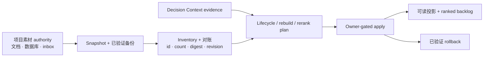

# Material Lifecycle 能力介绍

[English](README.md) | [架构协议](../../../docs/reference/protocols/material-lifecycle-architecture-v0.zh-CN.md)

状态：实验能力、内置、默认关闭、goal-scoped。

Material Lifecycle 帮助受 LoopX 管理的项目，在优先级持续变化时，让大型素材库保持
**无损、可排序、可阅读、可回滚**。它治理 inventory、备份安全迁移、生命周期流转、
ranked-entry 重建、有界重排、可读投影、owner-gated apply 和 rollback。

它不拥有原始文档或私有信源位置。完成验证过的 cutover 之前，项目已有素材库始终是
authority。

## 它解决什么问题

素材会逐渐散落在候选列表、归档、文档、书签、消息和调研工具中。时间一长：

- shortlist 不再反映当前 goal；
- 一个排名条目变成装着许多无关素材的大桶；
- 归档或迁移可能静默丢失正文、记录或引用；
- 可读 Markdown 与受管 catalog 逐渐漂移；
- 搜索 provider 不受预算和停止条件约束地持续加材料；
- 重排被直接应用，却没有保留旧状态，也说不清为什么调整。

Material Lifecycle 把这些变化变成显式、可审计的流程：



## 它负责什么

1. **Snapshot 与 inventory**：记录 source revision、digest、stable reference、
   lifecycle count、parse error 和已验证备份。
2. **生命周期 receipt**：显式记录 `unread`、`candidate`、`active`、
   `carryover`、`archived` 之间的迁移。
3. **Ranked-entry rebuild**：把过大的素材桶拆成可独立排序的条目，同时保持
   exact membership。
4. **有界 rerank proposal**：保护 pinned entry、限制移动范围；证据不足时输出
   no-change。
5. **可读投影**：从受管 catalog 生成便于人阅读的视图，但不把视图变成 authority。
6. **Owner-gated apply 与 rollback**：执行 compare-and-swap、原子写入、读回、
   双读对账、cutover receipt 和可逆恢复。
7. **有界 Explore intake**：必须从明确的 evidence gap 出发，并声明 provider
   预算、候选预算和 stop condition。

## 核心不变量

- 完成验证过的 cutover 前，原始 source 始终是 authority。
- 每次迁移都从不可变 snapshot 和已验证备份开始。
- Stable material reference 在生命周期和排序变化后仍然保留。
- 完整 ranked set 中，每个入选素材恰好出现一次。
- 默认每个 ranked entry 最多包含 3 条 primary material。
- Overflow 必须变成新的、可独立排序的条目，不能藏入 supporting index。
- 可见 Top-N 之外保留显式 ranked backlog。
- Recall 只是线索；影响排序的证据必须经过 exact read。
- Proposal 与 apply receipt 必须分离。
- Apply 与 rollback 都需要显式 owner gate 和 revision 校验。

## 典型场景

- 重建已经膨胀成主题大桶的阅读 Top-N。
- 在不丢字节、记录、引用和恢复能力的前提下，迁移旧 Markdown 或数据库队列。
- Decision Context 证明优先级变化后，只重排一个小窗口。
- 保留完整 ranked backlog，同时输出一份简洁、可读的视图。
- 把素材从 candidate 提升到 active，或携带稳定来源引用进行归档。
- 针对一个明确 evidence gap 做有预算的探索，而不是无限收集。

普通的一次性阅读、摘要或网页调研不需要启用这项能力，除非项目已经显式激活了
受管素材库。

## 项目级 Skill 安装

LoopX 发布 canonical `loopx-material` skill，但刻意不安装到用户的全局 skill
目录。已连接的项目可以为一个或多个 Agent host 安装受管的项目级副本：

```bash
loopx project-skill install \
  --project . \
  --skill loopx-material \
  --surface codex \
  --execute
```

目前支持：

- `codex` -> `.agents/skills/loopx-material/`
- `claude-code` -> `.claude/skills/loopx-material/`
- `opencode` -> `.opencode/skills/loopx-material/`

重复传入 `--surface`，可以在一个 transaction 中安装多份 host-native 副本。
安装前后可检查状态：

```bash
loopx project-skill status \
  --project . \
  --skill loopx-material \
  --surface codex \
  --format json
```

项目级 skill 只让工作流可发现，**不会**自动授权修改素材库，也不会扩大 goal
authority。选中的 goal 仍需显式声明 Material Lifecycle profile、source adapter、
write scope 和 owner gate。

## 端到端工作流

1. **连接并授权 goal。**
   确认 goal、agent、source authority、写边界和项目级 skill。
2. **Snapshot 与 inventory。**
   验证 stable ID、source digest、backup digest、count 和 parse health。
3. **Exact-read 决策证据。**
   只提升当前且权威的证据；拒绝过期、不可读或只有二手来源的 claim。
4. **选择最小有效变化。**
   把 lifecycle transition、bounded rerank 和 structural rebuild 作为三种不同操作。
5. **Preview 与验证。**
   证明 exact coverage、unique membership、protected rank、可读投影和 rollback
   readiness。
6. **通过 owner gate apply。**
   再次校验 revision，原子写入、读回、对账，然后切换 authority pointer。
7. **记录 receipt。**
   保留 before/after revision、count、verification ref 和 rollback ref。

## 当前可用入口

查看 provider-neutral 契约：

```bash
loopx material-lifecycle architecture --format json
```

检查项目级受管 skill：

```bash
loopx material-lifecycle skill-status \
  --project . \
  --surface codex \
  --format json
```

公开 Python capability 已提供确定性的 builder 和编排逻辑，覆盖 inventory、
migration preparation、lifecycle receipt、ranked-entry rebuild、bounded rerank、
readable projection、Explore intent、apply 与 rollback。具体 legacy parser、私有
storage adapter、source profile 和 provider credential 仍由项目拥有。

## 与其他能力的关系

| 能力 | 核心问题 | 与 Material Lifecycle 的关系 |
|---|---|---|
| Decision Context | 当前哪些证据足以支持优先级变化？ | 提供带 revision 的证据，但不修改素材。 |
| Reward Memory | 哪些经过验证的排序或工作流经验值得复用？ | 经评审后可影响 policy，但不能覆盖当前 source authority。 |
| Content / Notes workflow | 应该写作或发布什么 artifact？ | 消费选中的素材，不拥有 lifecycle 或 ranking truth。 |
| Research provider | 可能有哪些新候选？ | 提供有界候选，不能自行推进 lifecycle、ranking 或 cursor。 |
| LoopX Core | 哪些工作和写入已获授权？ | 保持 goal、todo、gate、event、quota 和 write authority。 |

## 当前成熟度与接入边界

Material Lifecycle 目前仍是 **experimental**。通用 contract、项目级 skill
delivery、无损 rebuild 规则、有界 decision planning、readable projection，以及
owner-gated apply/rollback 编排已经实现并有测试覆盖。

真实项目仍需提供私有 source parser 或 adapter、备份实现、authority pointer、
领域排序策略、display record 和 owner 批准的 cutover。公开 LoopX packet 和
commit 不能包含原始素材、私有路径、私有链接、provider payload 或凭据。

Packet schema 和详细不变量见
[Material Lifecycle 架构协议](../../../docs/reference/protocols/material-lifecycle-architecture-v0.zh-CN.md)。

## 验证

```bash
python3 examples/material-lifecycle-contract-smoke.py
python3 examples/decision-material-walkthrough-smoke.py
python3 -m pytest -q tests/test_decision_context_material.py
```

contract smoke 覆盖 Material Lifecycle packet 与 architecture 回读；walkthrough smoke
消费带 revision 的 Decision Context 证据并喂进 rerank preview，保留过期/冲突证据可见，
省略 source body 与私有 locator，并把 apply/cursor commit 留作独立 owner-gated
动作。
