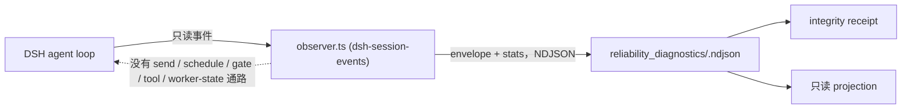

# Reliability Diagnostics 能力介绍

[English](README.md) | [RFC](../../../docs/architecture/rfcs/long-running-agent-reliability-diagnostics-governed-delivery-v0.md)

状态：实验能力、内置、默认关闭、按 goal 与 session 限定。本包实现 RFC 路线图
**P0 阶段所描述的原型组件**：L1 shadow-observer 合约与第一个 DSH 事件源适配器。
这里不宣称已经通过 P0 退出门槛；仍需 C0 adapter fidelity、一次合格的 C1 observer
实跑，以及明确的开销报告。

L1 observer 观察一个长时运行的 Agent 会话，并写下独立的诊断记录；它**永远不能**
影响该会话。本能力把这条承诺做成机器合约而不是口头规范：envelope schema 无法表达
命令，receipt 记录 outbound endpoint 为空集，observer 故障被计数并让证据进入
quarantined，projection 携带 `mode: read_only` 与 `authority: none`。



虚线边表示一条被断言不存在的路径：observer 通过独立 Cordis 插件入口装载，不注入
Driver 或 Agent，只消费 session log 的发布事件，并且不进入 Driver 与包根 bundle。测试会
拒绝带控制字段的 envelope；一旦出现 outbound endpoint、worker context 或 scheduler input
通路，receipt 即为 `invalid`。这里证明的是模块与 hook 隔离，不宣称 OS 进程隔离。

## 放置理由

- **能力 id `reliability-diagnostics`**（内置，provider `loopx-core`）。调用方结果是
  "这次运行是否可作为被动证据，它对 stage / stall / repetition / recovery 说了什么"。
  没有现有能力拥有"无权威的诊断"这一结果。session runtime 是运行时权威投影，因此诊断
  ledger 与 projection 是它的**同级**，绝不合并进去。id 与其它 catalog 条目一样使用
  kebab-case；包目录为 `reliability_diagnostics`。
- **Provider id `dsh-session-events`**（origin `extension`）。由 npm 包
  `packages/dsh-loopx-plugin` 的显式 `dsh-loopx-plugin/observer` 入口和独立
  `loopx-shadow-observer` Cordis 行交付，与 `driver.ts` 分离。
  npm 插件没有 Python `extension.toml` 生命周期，因此由能力在 catalog entry 上声明该
  provider，registry 报告 `declared=true`、`installed=enabled=ready=false`。先例是
  `repository_change_window` 声明其 `git-hook` provider 的方式。
- **辅助逻辑留在本包内。** ledger、receipt、projection reducer 都在本包。仅共享
  public-safe 值校验器与 `SOURCE_ID_KEYS` 身份键；刻意不复用 session-runtime 的子串分类器。

## 与 RFC 的关系

- [Long-Running Agent Reliability Diagnostics](../../../docs/architecture/rfcs/long-running-agent-reliability-diagnostics-governed-delivery-v0.zh-CN.md)
  拥有这个 capability。本切片是其路线图中记录的 P0 contract checkpoint；`dsh` event source 是
  owner decision 2 的记录答案，C1 run、overhead 报告与 retention profile 在 P0 exit 前仍未完成。
- [Desktop Execution Frontends](../../../docs/architecture/rfcs/desktop-execution-frontends-v0.zh-CN.md)
  的 Mode B 是这个 observer 面向的 managed runtime：Desktop-owned runtime supervisor 可以把
  receipt 与 projection 作为诊断输入消费，observer 不持有任何 supervisor authority。

## 合约

### Observer envelope（`reliability_observer_envelope_v0`）

| 字段 | 类型 | 规则 |
| --- | --- | --- |
| `schema_version` | 字面量 | `reliability_observer_envelope_v0` |
| `capability_id` | 字面量 | `reliability-diagnostics` |
| `provider_id` | identity token | 例如 `dsh-session-events` |
| `observer_id` | identity token | 单个 observer 实例内稳定，并与 stats 关联 |
| `goal_id`、`session_id` | identity token | `^[A-Za-z0-9][A-Za-z0-9_.:-]{0,120}$` |
| `agent_id` | identity token，可选 | |
| `sequence` | 整数 >= 0 | observer 分配、每会话单调；缺口计为丢失 |
| `observed_at` | 带时区的 ISO-8601 | |
| `clock.source` | 枚举 | `harness_event_time`、`observer_wall_clock`、`fixture` |
| `clock.uncertainty_ms` | 整数 >= 0 | 显式声明，绝不推断 |
| `event_kind` | 枚举 | `session_started`、`turn_started`、`turn_ended`、`step_started`、`step_ended`、`user_message`、`tool_called`、`tool_completed`、`agent_status`、`agent_pre_step`、`agent_error`、`session_disposed`、`unsupported` |
| `summary` | 对象 | 仅允许 `turn`、`step`（整数）与 `reason`、`status`、`tool_name`、`error_class`、`source_event_type`、`message_source_kind`（紧凑 token） |
| `source_refs` | 对象 | 仅允许 id 键：`event_id`、`event_seq`、`tool_call_id`、`message_id`、`outcome_id`、`gate_id`、`approval_id`、`artifact_id`、`run_id`、`ref_id` |

其它任何字段都会被拒绝并带上类型化原因：`control_field_rejected`（`command`、`send`、
`prompt`、`schedule`、`retry`、`stop`、`resume`、`gate`、`tool_call`、`worker_state` 等）、
`raw_material_field_rejected`（`transcript`、`messages`、`content`、`text`、`arguments`、
`output`、`stdout`、`stderr`、`log`、`cwd`、`token` 等）或 `unsupported_field_rejected`。
每个 provider 都必须在**首次 append 前**执行等价的递归 public-safe 值契约，LoopX ingest
还会再次校验。绝对本地路径与凭据样式 token 会 fail closed，不会进入 ledger bytes；
producer 会把它们计为 `public_safety_violation`。

### Observer stats（`reliability_observer_stats_v0`）

每个 observer 实现都会把它写在 envelope 旁边。`run_identity` 固定 `worker_id`、
`model_id`、`task_id`、`environment_id`、`tools_id`、`budget_id`、`adapter_revision`、
`observer_revision`；同时声明 `event_sources` 和 `source_fields_consumed`，并记录时间、
接受/拒绝计数、类型化拒绝原因、buffer 上限、丢弃、故障、峰值 buffer、flush 次数、
时钟源、outbound endpoints，以及是否进入 worker context / scheduler inputs。计数必须满足
`observed = accepted + rejected + dropped`，时间必须带时区，每个接受的 envelope 必须与
provider/observer stats 精确关联。stats 按 observer 实例累计；receipt 取每个
`observer_id` 的最新记录并跨实例求和。

### Integrity receipt（`reliability_integrity_receipt_v0`）

| 字段 | 含义 |
| --- | --- |
| `status` | `valid`、`degraded`、`quarantined`、`invalid`（全覆盖、有序） |
| `reason_codes` | 类型化列表；仅 `valid` 时为空 |
| `observed_event_count`、`accepted_event_count`、`persisted_event_count` | 事件尝试数、stats 接受数、ledger 中关联的 envelope 数 |
| `lost_event_count`、`duplicate_sequence_count` | 每会话 sequence 缺口与重复 |
| `ledger_invalid_record_count` | ledger 中损坏或异类记录 |
| `rejected_event_count`、`rejected_by_reason` | observer 报告的拒绝 |
| `buffer_bound`、`backpressure_drop_count`、`observer_failure_count` | 有界失败证据 |
| `clock.sources`、`clock.max_uncertainty_ms` | 声明的时钟；> 1000 ms 时降级 |
| `outbound_endpoints`、worker/scheduler influence flags | 必须为 `[]` / `false` / `false` |
| `run_identities`、`event_sources`、`source_fields_consumed` | 固定的 treatment identity 与适配器声明覆盖 |
| `event_kinds_consumed`、`summary_fields_consumed` | 实际持久化的事件种类与紧凑 summary 字段 |

状态规则：无观测、stats 缺失或不能与持久化 envelope 精确关联、身份被拒绝、ledger
存在无效输入、任一 outbound endpoint，或观测进入 worker context / scheduler inputs 时
为 `invalid`。否则 observer 故障、控制形态输入或 producer 侧
`public_safety_violation` 为 `quarantined`；事件缺口、丢弃、重复、原始/不支持字段或时钟
不确定度超阈值为 `degraded`；其它情况才是 `valid`。

### Diagnostic projection（`reliability_diagnostic_projection_v0`）

| 字段 | 含义 |
| --- | --- |
| `mode`、`authority`、`write_scope`、`worker_influence` | `read_only`、`none`、`diagnostic_ledger_only`、`none` |
| `stage` | 由最后一个事件种类得出：`unknown`、`idle`、`running`、`tool_running`、`errored`、`disposed` |
| `counts` | turn 开始/结束、step、tool 调用、错误 |
| `stall` | 仅在活跃且相对 `--as-of` 静默达 `threshold_ms`（默认 300000）时判定 |
| `repetition` | 连续相同 `tool_name` 的最长 run；达 3 判定 |
| `recovery` | 错误之后出现完成的 step 或非错误的 turn end 计为已恢复 |
| `signals` | `stall_suspected`、`repetition_suspected`、`unrecovered_error`、`event_loss`、`integrity_not_valid` |
| `integrity` | receipt 的 status 与 reason codes |

## 使用方式

```bash
# 只为一个预先声明的 goal 和一个准确的 DSH session 启用 provider。
export LOOPX_DSH_SHADOW_OBSERVER_GOAL_ID=<goal-id>
export LOOPX_DSH_SHADOW_OBSERVER_SESSION_ID=<session-id>
export LOOPX_DSH_SHADOW_OBSERVER_RUN_IDENTITY_JSON='{"worker_id":"<worker>","model_id":"<model>","task_id":"<task>","environment_id":"<environment>","tools_id":"<tools>","budget_id":"<budget>","adapter_revision":"<adapter-revision>","observer_revision":"<observer-revision>"}'
# 可选：LOOPX_DSH_SHADOW_OBSERVER_LEDGER_DIR、LOOPX_DSH_SHADOW_OBSERVER_BUFFER_BOUND

loopx reliability-diagnostics receipt --goal-id <goal-id> --format json
loopx reliability-diagnostics status  --goal-id <goal-id> --format json
loopx reliability-diagnostics ingest  --goal-id <goal-id> --input observer.ndjson --format json
```

ledger 位于 `<runtime-root>/reliability_diagnostics/<goal-id>.ndjson`；默认 runtime root
与 LoopX 其它部分一致，CLI 只打印相对的 `ledger_ref`。`ingest` 会重新校验每一行；干净的
ingest 是透明拷贝。任何损坏或被拒绝的输入都会追加持久化
`reliability_ingest_violation_v0` 标记，让后续 receipt 成为 `invalid`，而不是在进程退出后
丢失门禁失败。

三个必需变量未全部有效时，observer 行不注册任何 hook、不写任何文件（feature-off
parity）。启用后，`observer.ts` 只观察 `session/created`、`session/event`、
`session/disposed`。其它 session 的事件一律以 `identity_invalid` 拒绝，因此不会静默归属
到配置的 goal。token 级 `assistant/chunk` 不被消费。

## 验证

```bash
python3 examples/reliability_diagnostics/dsh-shadow-observer-fixture-smoke.py
python3 -m pytest tests/capabilities/test_reliability_diagnostics.py tests/capabilities/test_reliability_diagnostics_dsh_provider.py -q
cd packages/dsh-loopx-plugin && pnpm typecheck && pnpm test -- observer
```

fixture 是一条固定的 DSH 形态事件流：缺一个 sequence、一个事件带 1500 ms 时钟不确定度、
一条带原始材料的记录、以及一段撑爆 20 条缓冲的突发。其 receipt 为 `degraded`，原因恰为
`sequence_gap`、`backpressure_drop`、`raw_material_rejected`、`clock_uncertainty_exceeded`；
projection 报告 `read` 上的重复、一次已恢复的错误、无 stall。

## 本切片的非目标

不做 dashboard、不做 L2 建议、不做自动恢复、不回写 goal / todo / gate / session runtime、
不改 `loopx status` 首屏。适配器要求外部固定 goal/session/run identity；不会通过 Driver
或 LoopX CLI 发现绑定。本原型也不提供 matched native/L1 执行、observer CPU/I/O/延迟/
存储开销测量，或一次合格 C1 实跑。
