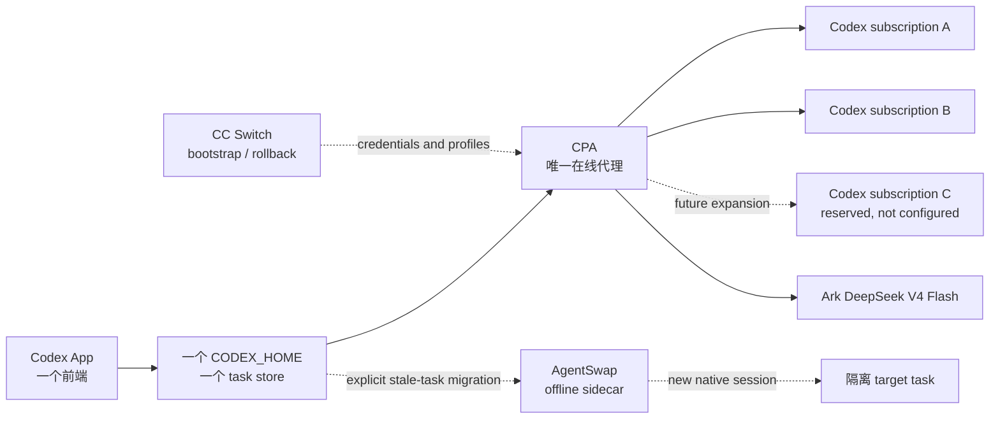

# Codex App 多订阅与多 Provider 切换 Runbook

## 定位

这是 LoopX 维护的 public-safe integration runbook 与 qualification contract。它描述如何在
同一个 Codex App 中暴露多个 Codex 订阅与第三方 Responses provider，并把手动模型
选择、额度耗尽后的自动切换、轨迹兼容、SSH 复用和离线迁移放在清晰的责任边界内。
它还不是一个已注册的 LoopX built-in capability：CPA 继续执行在线请求，Codex App 继续
拥有 task store，LoopX 只拥有公开维护面、资格矩阵和变更门禁。

LoopX 只记录目标、门禁、证据和回滚状态。它不保存 OAuth token，不成为模型请求代理，
也不接管 Codex 的 session store。

## 结论先行

采用 **CPA + AgentSwap**，但不要把两者串成双层代理：

| 组件 | 唯一职责 | 不负责 |
| --- | --- | --- |
| [CLIProxyAPI（CPA）](https://github.com/router-for-me/CLIProxyAPI) | 唯一在线 data plane：多账号选择、请求路由、同一任务的 provider-specific 轨迹投影、首字节前 failover、Responses/SSE 兼容 | 写 Codex 本地 rollout、跨 harness 搬运 session |
| [AgentSwap](https://github.com/bojieli/agentswap) | 离线 sidecar：显式 `teleport` / `handoff`、超长轨迹机械压缩、隔离迁移与灾难恢复 | 每次请求的热切换、第二层 retry / health / sticky routing |
| [CC Switch](https://github.com/farion1231/cc-switch) | 登录引导、凭据/profile 导入、升级前快照和回滚入口 | 每 turn 替换 `config.toml`、重启 App、在线路由 |

如果只能保留一个核心组件，保留 CPA。没有 AgentSwap，日常在线切换仍可运行；没有 CPA，
同一 App 内的多订阅选择和透明额度 failover 无法成立。

## LoopX 统一维护面

本文件是这套集成的 canonical public owner。不要再创建一份平行的“当前配置”文档；运行时
私有事实保留在 operator-owned receipt，只有经过脱敏的版本、能力契约、资格结论和公共 PR
状态回写到这里。SSH 网络桥的通用实现与恢复方法由
[Reliable SSH Reverse Egress Proxy](../../docs/integrations/ssh-reverse-egress-proxy.md) 维护，本文件只
定义它与 Codex App、CPA 的组合契约。

每次变更必须一起维护以下四个面：

| 维护面 | 本文件中的 owner | 更新条件 |
| --- | --- | --- |
| 版本与路由契约 | qualification baseline、模型表 | CPA / Codex / AgentSwap pin、模型 slug、能力或默认值变化 |
| 已验证事实 | qualification snapshot、compatibility matrix | 新故障复现、修复完成、升级或回滚后 |
| 公共贡献 | public PR lineage、上游 PR 规划 | PR 创建、head 变化、review、merge、close 或 supersede 后 |
| 私有运行状态 | 只记录 public-safe 摘要 | 私有 receipt、端口、账号、日志与 task 细节不得投影进仓库 |

### Public PR lineage

以下是截至 2026-09-01 与这套能力直接相关的完整公共 PR 索引。LoopX PR 记录 runbook 与
SSH 运行面的演进；CPA PR 承载进入在线 data plane 的通用修复。

| Repository | PR | 状态 | 沉淀内容 |
| --- | --- | --- | --- |
| LoopX | [#3011](https://github.com/huangruiteng/loopx/pull/3011) | merged | 建立 Codex App 多 provider switching runbook |
| LoopX | [#3132](https://github.com/huangruiteng/loopx/pull/3132) | merged | 补齐 context window 与 compaction parity |
| LoopX | [#3265](https://github.com/huangruiteng/loopx/pull/3265) | merged | 将文档归位到 capability / guide ownership 结构 |
| LoopX | [#3462](https://github.com/huangruiteng/loopx/pull/3462) | merged | 多 App 隔离、工具生态与演进方向 |
| LoopX | [#3563](https://github.com/huangruiteng/loopx/pull/3563) | merged | 明确 CPA、AgentSwap、CC Switch 的在线/离线边界 |
| LoopX | [#3573](https://github.com/huangruiteng/loopx/pull/3573) | merged | 记录 provider routing qualification |
| LoopX | [#3575](https://github.com/huangruiteng/loopx/pull/3575) | merged | 提供 SSH reverse egress supervisor、恢复语义和 offline smoke |
| LoopX | [#3576](https://github.com/huangruiteng/loopx/pull/3576) | merged | 记录 CPA upstream qualification |
| LoopX | [#3585](https://github.com/huangruiteng/loopx/pull/3585) | merged | 固化 pinned CPA self-use routing 与回滚边界 |
| LoopX | [#3665](https://github.com/huangruiteng/loopx/pull/3665) | merged | 沉淀 CPA + Codex App 分层重试与延迟门禁 |
| LoopX | [#3711](https://github.com/huangruiteng/loopx/pull/3711) | merged | 将 runbook、脚本迁移清单、无密配置和资格 contract 升级为独立 extension |
| LoopX | [#3737](https://github.com/huangruiteng/loopx/pull/3737) | merged | 增加 Luna，并把 A/B 选择收敛为同一账号环的首选入口 |
| LoopX | [#3804](https://github.com/huangruiteng/loopx/pull/3804) | merged | 将宿主身份、路由选择、额度与真实 attempt chain 投影为无密运行状态 |
| LoopX | [#3805](https://github.com/huangruiteng/loopx/pull/3805) | merged | 生成显式 Fast sibling rows，固化 `fast/` request normalization、默认 tier 与 A/B-only fallback |
| LoopX | [#3828](https://github.com/huangruiteng/loopx/pull/3828) | merged | 把多 PR 整合候选、exact-head 漂移检测与可回滚部署顺序纳入 extension |
| CLIProxyAPI | [#5211](https://github.com/router-for-me/CLIProxyAPI/pull/5211) | merged | 被动观测 per-auth quota header 与最近请求计数；management 原始身份字段仍须由 operator adapter 脱敏 |
| CLIProxyAPI | [#5410](https://github.com/router-for-me/CLIProxyAPI/pull/5410) | open / review required | provider-bound Responses history、`additional_tools` 与 Ark SSE normalizer；替代被自动关闭且无法 reopen 的 #5220 |
| CLIProxyAPI | [#5261](https://github.com/router-for-me/CLIProxyAPI/pull/5261) | open / review required | ChatGPT uTLS HTTP/2 连接池、TLS session resumption 与异常重建 |
| CLIProxyAPI | [#5336](https://github.com/router-for-me/CLIProxyAPI/pull/5336) | open / review required | per-route credential priority；同一 A/B 账号环支持 Prefer A 与 Prefer B 两个入口 |
| CLIProxyAPI | [#5435](https://github.com/router-for-me/CLIProxyAPI/pull/5435) | open / review required | 透传 OpenAI-compatible `Retry-After`；仅对明确 TPM 限流补一分钟有界等待，普通 429 不猜窗口 |

这个索引只收录直接改变本能力契约、运行面或上游实现的 PR，不扩张成作者的全部 PR 列表。
新 PR 创建后要在同一 PR 内登记；merge 后把状态和锁定 head/merge commit 一起刷新。

### 更新协议

1. 从公开 GitHub readback 获取 PR state、review decision、base、exact head 和 checks；不要从
   私有 task 或本机日志推断公共状态。
2. 把新现象先写成 compatibility matrix 的可复现 failure，再更新 qualification snapshot；
   单次 happy-path 成功不能覆盖一个已复现的 negative-path 缺口。
3. 上游 PR 合并后锁定 merge commit，在隔离环境重跑受影响矩阵；通过前不把 upstream
   release、公共 candidate 和 self-use build 写成同一个版本。
4. 文档变更至少运行 `git diff --check`、`loopx check --scan-path` 和 public/private boundary
   scan；SSH supervisor 变化还要运行它的 offline smoke。
5. 私有证据只回写错误类型、能力边界、结果和可公开的版本；不回写原始 prompt、账号、
   task ID、路径、端口、header、响应体或日志片段。

### 持久整合候选

四个公开 PR 与两个 operator-owned public-safe compatibility patches 通过
[`codex/integrated-dev`](https://github.com/huangruiteng/CLIProxyAPI/tree/codex/integrated-dev)
按依赖顺序组合：history/SSE → uTLS transport → modality admission/normalizer → route fallback
→ delimiterless SSE / orphan host-output repair → bounded rate-limit waits。当前锁定 base 为
`origin/dev@18e01a7`，候选 head 为 `b005af16b8049bfbcc70b5a592c557ec9387b47d`。这只是可回滚的 self-use candidate，不是
upstream release。

`reconcile_integration_candidate` 保存 source order、exact heads、required seams、current
observation 与 last-sync receipt，并把 Git 合并输入交给 LoopX core `integration-branch`。任何
base/source/head 漂移都只产生 `sync_required`；monitor 不自动合并或 push。显式同步后必须重新
执行 build、changed-seam matrix、字段级配置 diff 与 App Server readback，才允许更新部署指针。

## A/B/C 与 Astra 的可执行维护入口

`abc-sol-astra` preset 与独立 `loopx-cpa-operator` CLI 已在本 package 中维护。
它把本机进程控制、账号元数据、模型目录生成及脱敏观测收拢到同一实现；
私有配置通过显式路径传入，managed extension 仍只读。完整的三账号路由、
Fast/Ark 边界、重试范围、部署与回滚操作见 [Local CPA operator](OPERATOR.md)。
旧 A/B qualification 默认值保留；新 readback 显式指定 `routing_preset: abc-sol-astra`。

## 锁定的 qualification baseline

在升级前锁定 commit，不直接跟随上游 `main`：

| 项目 | 锁定版本 | 本 runbook 使用的边界 |
| --- | --- | --- |
| CPA self-use build | operator-owned private receipt；当前公共整合候选为 `codex/integrated-dev@b005af16b8049bfbcc70b5a592c557ec9387b47d` | 多 Codex OAuth、provider-bound history、`additional_tools`、保留语义的宿主控制输出投影、commit-before-failover、Ark Responses/SSE normalizer 与有界 rate-limit wait；二进制 digest 与安装位置不进入公共仓库 |
| CPA upstream release baseline | [`a7e3596b7e351d800e58ed29529fbca3d1c18737`](https://github.com/router-for-me/CLIProxyAPI/commit/a7e3596b7e351d800e58ed29529fbca3d1c18737) | `fill-first`、priority、prefix、session affinity、stream bootstrap buffering、OpenAI-compatible provider 的原始基线 |
| CPA public history candidate | [PR #5410 head `566da3b43011ac3305385737288abd8a0f317d1c`](https://github.com/router-for-me/CLIProxyAPI/pull/5410) | 当前 `dev` 上的 provider-history / SSE candidate；仅把已确认、无 `call_id`、无 matching call 且有语义内容的宿主控制输出投影为 `role=user`，未知或损坏的 tool history 仍 fail closed；CI 已通过，等待 review，不等于 upstream release |
| ChatGPT uTLS transport candidate | [PR #5261 head `c8e76e1e76aba4cc2206cec9d2a6444c9f527998`](https://github.com/router-for-me/CLIProxyAPI/pull/5261) | 复用 HTTP/2 transport、TLS session resumption、draining/异常连接重建；CI 已通过且 mergeable，仍在等待 review |
| OpenAI-compatible rate-limit candidate | [PR #5435 head `6f16121554df25c9f9ab8de41e7b8157ef2d3c35`](https://github.com/router-for-me/CLIProxyAPI/pull/5435) | 透传 delta-seconds / HTTP-date `Retry-After`；只有明确 TPM 429 且 header 缺失时才使用一分钟 fallback；CI 与自动 review 通过，等待 maintainer review |
| Passive quota observation | [PR #5211 merge `ca601db05d858472b25e7c56580555ab62b90e68`](https://github.com/router-for-me/CLIProxyAPI/pull/5211) | management API 暴露 bounded quota signal 与 200 分钟 recent-request buckets；原始 auth identity 只在 operator adapter 内使用 |
| AgentSwap | [`c9b76f4a4adae81274eb8f52d428bba925a1a7ef`](https://github.com/bojieli/agentswap/commit/c9b76f4a4adae81274eb8f52d428bba925a1a7ef) | `teleport` / `handoff`、`--dry-run`、`--compact`、`--budget` |
| Codex protocol reference | [`40b7560169c7274147a47f9b0c75db89fe016d34`](https://github.com/openai/codex/commit/40b7560169c7274147a47f9b0c75db89fe016d34) | `ResponseItem::Reasoning`、history normalization 和 remote compaction 行为的源码参照 |
| SSH host Codex baseline | `codex-cli 0.150.1` | Remote App Server、受控 model catalog、图片 admission 与现有 task resume 的当前验证版本 |
| CC Switch | [`43eaf07355af145aebfee301801779e824d4c221`](https://github.com/farion1231/cc-switch/commit/43eaf07355af145aebfee301801779e824d4c221)（v3.19.2） | 只作为 bootstrap / rollback 基线，不进入请求链路 |

锁定 commit 只是可复现实验起点，不等于四个项目已经共同承诺兼容。每次升级都重新运行
本文的 compatibility matrix；通过后再修改 pin。

## 当前 qualification snapshot

当前参考部署只有两个有效 Codex 订阅，记为 A、B；C 是未来扩容保留位，不应出现在
当前生产 selector 或 failover 队列中。目标态仍允许增加 C，但配置和验收必须以“实际
存在的 credential”为准，不能用空 profile 假装第三个可用账号。

锁定 CPA baseline 上形成的 candidate 已 forward-port 到当前 `dev`，原 PR #5220 被 stale-base
guard 自动关闭后由 [CLIProxyAPI PR #5410](https://github.com/router-for-me/CLIProxyAPI/pull/5410)
替代。当前 self-use 二进制由 operator-owned private receipt 锁定，公共 history candidate head
为 `566da3b`；它覆盖 provider-neutral `additional_tools`、保留指令语义的孤儿宿主控制输出投影与当前 review fixes。
上游 merge 仍是升级与公共分发渠道，不再是本机自用的前置条件。上游合并后仍须锁定
merge commit，并重新运行本文矩阵。
当前证据边界如下：

| Surface | 当前进展 | 证据边界 |
| --- | --- | --- |
| A → B credential failover | loopback 与 live 均通过 | `fill-first`、priority、session affinity 与 commit 前 stream failover 已验证；live auto 请求在 A 建连失败后由 B 完成 |
| Provider-bound history normalization | candidate、stale-task 与 `additional_tools` 回归通过 | 同 provider 的 A → B 也视为 scope 变化；跨 scope 时移除异源 identity / opaque state，保留可移植 summary、namespace/tool schema 与 tool call/result 因果链；仅对 allowlist 中无 `call_id`、无 matching call 且有非空语义的宿主控制输出移除 tool identity 并投影为 `role=user`，unknown / paired / empty 与 unsupported item 仍返回 typed `409`；还必须验证下一动作服从注入指令，HTTP 200 不能单独通过 |
| Ark Responses SSE lifecycle normalizer | candidate 与真实 endpoint 通过 | 只对显式 `is-compat: true` 的模型启用；原生 Codex stream 保持原字节路径；真实 Ark HTTP/SSE 返回完整 lifecycle |
| A/B 环 → Ark 组合路径 | loopback 与分层 live 证据通过 | A → B、Prefer B → A 与隔离 A/B 后的 Ark tail 均已在 integrated self-use candidate 通过；公共分发仍依赖 CPA PR #5336 |
| Route traversal readback | public contract 与 self-use live 均通过 | qualification 同时读回 entrypoint、ordered candidates、terminal tail 与 `max_cycles = 1`；只看到正确 selector 标签不能通过 |
| Codex App selector projection | 本机与 SSH App Server readback 通过 | `model/list` 暴露三组 Standard/Fast Sol 行、Luna、Ark 共八个可见 selector，并保留隐藏 `gpt-5.6-sol` 兼容 alias；C 不存在 |
| 图片能力投影 | 正向 E2E 通过，Auto 负向路径有已复现缺口 | Auto、Prefer A、Prefer B、Luna 声明 `text + image`，Ark 保持 `text`；健康 A/B 下图片到达 Codex。A/B 失败后，当前 Auto affinity 可能错误粘到 Ark，尚未做到 modality-aware fail closed |
| 模型切换快照 | 已复现设置落盘与新 turn 启动竞态 | UI 显示已选择 B 不足以证明正在运行或重试的 turn 已采用 B；旧 turn 可能继续携带 Auto 快照。需要 durable settings revision / readback 后再启动新 turn |
| Provider incident 恢复 | 真实故障链已复现；in-memory restart 已恢复，待 CPA 固化 | incident 期间 Ark affinity 粘住后，Code Mode exec 以 incompatible payload 失败；恢复后必须先失效 incident cooldown、完成 bounded probe 并清 degraded affinity；Ark HTTP 200 不能作为 native 已恢复的证据 |
| Fast tier 投影 | 本机与 SSH App Server readback 通过 | Auto、Prefer A、Prefer B 各有显式 `fast/` sibling 行，默认 tier 为 `fast` 并在请求规整时强制 `priority`；普通行与 Luna 保持 `default`，Fast 行不进入 Ark |
| SSH CPA 远端 | reverse-loopback 与 App Server 通过 | 远端只连接 loopback tunnel，不保存本机 OAuth/Ark secret；同一 SSH alias 与同一远端 `CODEX_HOME` 可继续原 task，新建 task 不删除旧 session |
| CPA upstream review | quota PR 已合并；四个分发 PR 等待 maintainer review | #5211 merge `ca601db0`；#5410 head `566da3b`、#5261 head `c8e76e1`、#5336 head `cc16e38`、#5435 head `6f16121` 的 CI 已通过 |
| 上游回归 | 候选与当前 `dev` 已集成验证 | changed packages、race 与 server build 通过；全仓仅命中既有 `internal/home` 一秒同步 flake，同一失败在干净 `origin/dev` 上 50 次复现 2 次，PR 未改该目录，也不声称该测试通过 |
| 真实 Ark endpoint qualification | 基础 Responses 与 auto fallback 已通过 | source-built candidate 经隔离 CPA 调用真实 OpenAI-compatible endpoint：HTTP 200、唯一 terminal，output item 严格 `added/done` 配对；额度分类由公开安全的黑盒 fixture 覆盖 |
| Ark 限流等待与大上下文重放 | candidate 与真实 endpoint 回归通过 | Codex App 保留 30/30 外层恢复预算；Ark provider 只允许一个附加 round，`Retry-After` 受 65 秒 ceiling 约束；明确 TPM 且无 header 时只补一个 60 秒窗口，普通 429 不臆造窗口 |
| 当前 Codex App | self-use 配置已安装并完成 CLI / App Server readback | 主 App 与 SSH host 都指向 loopback CPA；模型目录变化需要重启或重连对应 App Server 才能刷新 UI cache，旧 task store 不复制、不删除 |

这张表刻意区分“adapter 证据”“provider 基础连通证据”和“live 路由证据”。真实 A → B
来自 commit 前网络失败；A/B → Ark 来自隔离 auth 状态故障注入；真实 quota 耗尽仍由同一
错误分类的 loopback black-box 覆盖。三层证据合在一起才支持 self-use 灰度，不能把其中
任意一层单独扩写成所有生产故障都已验证。

## 总体架构



硬规则：

1. Codex App 只连接一个本地 CPA endpoint。
2. CPA 不再转发到 AgentSwap proxy；AgentSwap 也不反向代理 CPA。
3. 在线切换优先保持同一个逻辑 task；无法无损投影时才 fork，不覆盖源 task。
4. 不在两个生产 `CODEX_HOME` 之间复制 rollout 文件或 SQLite 行。
5. 凭据只进入本机 secret store 或权限受限的 auth 文件，不进入仓库、日志和轨迹。

## 用户看到的模型

建议在 Codex App 模型下拉框中暴露稳定的虚拟模型 ID：

| 模型 ID | 行为 | 输入能力 | Fast |
| --- | --- | --- | --- |
| `auto/gpt-5.6-sol` | 同一 A/B 账号环；已有 task 尊重 affinity，冷启动从 A 开始；A/B 都不可用且尚未提交输出时，兼容文本请求可转 Ark | `text, image`；图片只由 A/B 承担 | Standard，默认行 |
| `fast/auto/gpt-5.6-sol` | 与 Auto 共享同一 route；只保留 A/B Fast-capable candidates | `text, image` | Fast，强制 `priority` |
| `codex-a/gpt-5.6-sol` | Prefer A：A → B → Ark；不是 hard pin | `text, image` | Standard，默认行 |
| `fast/codex-a/gpt-5.6-sol` | Prefer A：A → B；不落 Ark | `text, image` | Fast，强制 `priority` |
| `codex-b/gpt-5.6-sol` | Prefer B：B → A → Ark；不是 hard pin | `text, image` | Standard，默认行 |
| `fast/codex-b/gpt-5.6-sol` | Prefer B：B → A；不落 Ark | `text, image` | Fast，强制 `priority` |
| [`gpt-5.6-luna`](https://developers.openai.com/codex/models) | Luna；复用同一个 A/B 账号环，只在 Codex A/B 间路由，不异构降级到 Ark | `text, image`；推理档位为 `low` 至 `max`，不声明 `ultra` | Standard；不生成重复 Fast alias |
| `codex-c/gpt-5.6-sol` | 预留；只有第三个订阅真实接入并通过矩阵后才暴露 | 由真实 credential 决定 | 不预声明 |
| `ark/deepseek-v4-flash` | 手动固定到 Ark DeepSeek V4 Flash | `text` | 不支持 |
| `gpt-5.6-sol` | 隐藏 compatibility alias；处理 App / host 继承裸 model metadata 的旧 task，实际行为与 Auto 一致 | `text, image` | 可选，默认关闭 |

模型 ID 是路由契约，不是上游真实 model slug。显示名可本地化，但 ID 一经上线应保持稳定，
否则已有 task 的 model metadata 会产生第二种方言。

当前 self-use build 已完成 Codex 多账号、prefix 路由和 Codex → Ark heterogeneous
failover 的分层资格验证，因此 `auto/...` 可以在该锁定 commit 上灰度。升级到其他 commit
时不能继承这个结论，必须重跑后文矩阵。不要用第二层 AgentSwap proxy 假装补齐缺口。

能力声明必须反映 route 的安全上限。Auto 可以接受图片，是因为 A/B 都支持图片；Ark
仍是文本模型。图片请求在 A/B 都不可用时应返回明确错误，不能剥离图片后静默降级，也不能
为了让 selector 看起来统一而把 Ark 标成 `text, image`。当前 self-use build 的正向图片
路径已通过，但 affinity 的负向 modality recheck 尚有已复现缺口；在该修复通过前，不能把
“Auto 支持图片”扩写成“所有 Auto failover 路径都支持图片”。

Fast 在语义上仍是一次 turn 的 service tier，不是第二个上游模型；但桌面 App 对 custom
provider 的原生 Fast 按钮还受宿主 ChatGPT 身份投影约束，不能作为唯一入口。catalog compiler
因此从显式声明 `fast_selector` 的普通 route 生成 `fast/<route>` sibling 行：普通行使用
`default_service_tier = "default"`，Fast 行使用 `default_service_tier = "fast"`。CPA adapter/plugin
必须在 alias 映射前读取原始 selector；命中 `fast/` 时去掉前缀并强制请求
`service_tier = "priority"`。普通 selector 不改调用方传入的 tier；若原生 Fast
入口已经传入 `priority`，normalizer 仍会按有效 Fast 状态收窄到 A/B
Fast-capable candidates，不能落到 Ark。

Fast sibling 的候选不是复制普通 route，而是按 `supports_fast` 过滤。A/B 支持 Fast，Ark 不支持，
所以 Fast 行只能在 A/B 环内切换；没有 Fast-capable provider 时必须在首个输出前 fail closed。
Luna 仍保持普通行：若同一个 Luna upstream 再生成重复 alias，某些 CPA/App catalog 路径会去重
并使普通 Luna 消失。`features.fast_mode = true` 可以保留给支持原生按钮的 host，但这套显式行
不依赖该按钮，顶层默认仍是 `service_tier = "default"`。

### Fast sibling 配置与发布方法

在无密 catalog source 的普通 route 上声明 Fast 行；slug 由 compiler 固定生成，不允许另写
一份平行 route：

```json
{
  "slug": "auto/gpt-5.6-sol",
  "supports_fast": true,
  "fast_selector": {
    "display_name": "Auto · Fast · Codex A → B",
    "fallback_policy": "fast_capable_only"
  }
}
```

完整字段与 A/B/Ark profile 见 [`examples/request.json`](examples/request.json)。发布顺序是：

1. 对真实支持 Fast 的 profile 设置 `supports_fast: true`；不支持的 provider 保持 false。
2. 只在需要额外菜单行的普通 route 上声明 `fast_selector`；Luna 当前不声明。
3. 运行 `compile_catalog`，确认八个可见 `selector_rows`、普通行 tier 为 `default`、三条 Fast
   行 tier 为 `fast`，且 Fast candidates 只有 A/B。
4. App catalog adapter 写入这些 selector rows；CPA adapter/plugin 必须在 alias mapping 前执行
   [`normalize_selector_request`](examples/normalize-request.json) 的同构规则。
5. 在隔离 App Server 读回 `model/list` 与 normalizer active 状态，再切换本机/SSH 的受控 catalog
   指针；不要覆盖唯一可回滚版本。
6. 重启或重连同一个 App Server 以刷新目录 cache。保留原 `CODEX_HOME` 和 task store；目录升级
   不需要删除、新建或复制 session。
7. 任一逐行 tier、normalizer、A/B traversal 或 commit-barrier 检查失败时，恢复旧 catalog 与旧
   adapter/plugin 指针，并重新 readback；不要只隐藏 Fast 行后继续运行不一致的 normalizer。

## 身份与路由状态双投影

Codex App Server 的 `account/read` 与 `chatgptAuthTokens` 都是单一活动身份接口；自定义
provider 下 `requiresOpenaiAuth = false`，因此不能根据模型 route 同时伪造 A/B 两个 App 原生
账户。运行面采用两个互不覆盖的状态：

- host identity 只表示 ChatGPT 登录凭据仍由宿主保留，但当前 custom provider 不投影它，
  且永远不绑定 A/B route；
- route identity 来自 CPA 的实际选择观测，只用 `codex-a`、`codex-b`、`ark-text` 等符号 ID，
  同时给出 attempt chain、最终选择、fallback 和脱敏额度窗口。

`project_runtime_status` 校验 attempt chain 必须是 catalog 法定顺序的前缀。Auto 可以从账号环
任意 affinity 入口开始，所以直接命中 B 不等于 fallback；只有发生第二次 provider attempt
才记为 fallback。原始 management 响应、auth filename、email、请求内容和 task/session ID
不得进入 LoopX 仓库或 extension 输入。

额度采集由 operator adapter 通过宿主支持的 account/rate-limit 只读接口完成，再把窗口映射为
symbolic profile observation。不要为了查询额度抢占正在运行的 App IPC 单客户端连接，也不要把
宿主 auth token 交给 LoopX extension。若必须启动隔离的 App Server probe，probe 应使用独立
socket、只读方法和有界生命周期；extension 最终只接收 `used_percent`、窗口长度、reset 时间与
recent activity。reset 本身仍是 operator-owned effect，成功后交给 `qualify_quota_recovery`
验证 cooldown 失效与 reprobe 顺序。

这里的“开启自动切换开关”不是修改 CPA 的一个全局布尔值，而是让 App selector 暴露并
允许选择 `auto/...` 虚拟模型。A/B 也不再表示 hard pin，而是同一账号环的两个首选入口；
只有显式 Ark 仍固定单一 provider。CPA 只按已验收的 provider pool 执行自动路由。

## CPA：唯一在线 data plane

### 从锁定 candidate 构建

```sh
git clone https://github.com/router-for-me/CLIProxyAPI.git
cd CLIProxyAPI
git remote add self-use https://github.com/huangruiteng/CLIProxyAPI.git
git fetch self-use codex/integrated-dev
git checkout --detach b005af16b8049bfbcc70b5a592c557ec9387b47d
go build -o ./bin/cliproxyapi ./cmd/server
```

把二进制 checksum、commit 和本机安装时间写入私有运维记录。升级使用新的隔离目录构建，
验证通过后原子切换 symlink；不要覆盖唯一可回滚的旧二进制。上面的整合 commit 只在
`reconcile_integration_candidate` 与 core `integration-branch status` 都无漂移、完整 changed-seam
matrix 通过后才可安装；不能因为各来源 PR 分别 CI 通过就直接替换运行版本。

### 基础配置

以下是公开安全的配置形状，尖括号内容必须由本地 secret/bootstrap 流程注入：

```yaml
host: "127.0.0.1"
port: <CPA_PORT>
auth-dir: "<CPA_AUTH_DIR>"

remote-management:
  allow-remote: false
  secret-key: ""

force-model-prefix: false
request-retry: 0
max-retry-credentials: 0
max-retry-interval: 0

routing:
  strategy: "fill-first"
  session-affinity: true
  session-affinity-ttl: "1h"

codex:
  stream-bootstrap-buffering: true
  optimize-multi-agent-v2: false
```

`fill-first` 与 auth 记录中的 `priority` 决定冷启动顺序。已建立的 session binding
优先于恢复后的高优先级账号，避免同一 task 在每个 turn 抖动；当前账号不可用时才重绑。
该最小 self-use 形状只监听 loopback，且关闭 remote management。若部署环境需要本地 bearer
auth，CPA 与 Codex provider 必须同时配置同一个由 secret store 注入的 token；不要只在一侧
声明 `api-keys`，否则 App 请求会被拒绝。

首轮 qualification 使用 `request-retry / max-retry-credentials / max-retry-interval =
0 / 0 / 0`。这不等于“完全不 failover”：round 0 仍会把每个 eligible credential 最多
尝试一次；它只禁止一次 A/B 环遍历与可选 Ark tail 之后再开启额外 retry round，也不等待 cooldown。这样
可以先证明一条有限、可解释的路由链，避免同一 credential 被重复尝试。需要额外 round
时必须单独增加参数并重跑提交边界测试。

### 从 qualification 基线切到长期运行配置

`0 / 0 / 0` 用来证明路由语义，不是网络不稳定环境的长期运行建议。当前 self-use 在完整
compatibility matrix 通过后使用下面的高韧性 profile：

```yaml
# CPA：上游 credential / provider 重试层
request-retry: 10
max-retry-credentials: 0
max-retry-interval: 65

openai-compatibility:
  - name: "<OPENAI_COMPATIBILITY_TEXT_FALLBACK>"
    request-retry: 1
    # base-url、models 与 api-key-entries 由 operator-owned secret/bootstrap
    # 流程注入，不进入公共模板。
```

```toml
# Codex App：外层 request / stream 恢复上限
request_max_retries = 30
stream_max_retries = 30
```

当前 self-use 还启用了 `codex.optimize-multi-agent-v2: true`。这是 qualification matrix
通过后的显式选择，不应回填成 CPA 通用默认值；升级 Codex、CPA 或 tool schema 后，仍要
重新验证 spawn、wait、tool result、`additional_tools` 和 provider 切换。

这些数字是当前故障分布下的**上限**，不是所有部署都应照抄的通用默认值。全局 `10`
保留 Codex credential 环的快速恢复余量；`max-retry-credentials: 0` 表示每轮不再人为截断
eligible credential。OpenAI-compatible text fallback 用 provider override 收紧为 `1`：首轮
失败后最多再尝试一次，避免同一大上下文在分钟限流窗口内被快速重放。`65` 只允许 CPA
等待一个 provider 声明的分钟窗口及少量调度抖动，不是固定 sleep；没有 `Retry-After`
且错误未明确声明 TPM 限流时，不臆造一分钟 cooldown。App 的 `30 / 30` 是 CPA 之外的
最后恢复余量，不代表每个 provider 都固定调用三十次。任何一层都必须服从请求取消、
提交边界和端到端 wall-clock budget。

把重试分层，不能只把三个数字相乘：

| 层 | 主要职责 | 允许恢复的边界 |
| --- | --- | --- |
| ChatGPT uTLS transport | 复用 HTTP/2 连接和 TLS session；连接已失效时重建 | 响应头之前；只有幂等请求，或带 idempotency key 且 body 可重建的请求，才允许一次快速重放 |
| CPA | credential / provider 分类、A/B 单圈遍历与可选 Ark tail、首个生成事件前的 in-band 错误吸收 | HTTP 403/408/429/500/502/503/504 与明确的 quota / overload；提交后禁止切换 |
| Codex App | CPA endpoint 的 request / stream 外层恢复 | 只消费 CPA 最终暴露的失败；不能把已可见的文本、tool call 或 tool result 当成全新请求重放 |
| LoopX | 记录资格证据、pin、回滚与运维状态 | 不代理模型请求，也不新增第四层 retry |

错误处理顺序如下：

1. DNS、TCP、TLS 或空闲 HTTP/2 连接失效：优先重用连接池；确需重拨时使用已有 TLS
   session。连接级第一次安全重拨立即执行，不先 sleep。
2. 401：只刷新一次对应 credential；仍失败则标记该 credential 不健康并进入下一项。
3. quota、overload、429 或可恢复 5xx：只在首个可见生成事件前遍历一次 A/B 环，再按 route 决定是否进入 Ark tail。OpenAI-compatible 响应带 `Retry-After` 时保留其 delta-seconds 或 HTTP-date；header 缺失时只有明确 TPM 限流才补一分钟窗口，普通 429 继续走通用 bounded backoff。
4. schema / lifecycle 破坏、foreign compaction barrier、不可恢复 4xx：fail closed，不用高
   retry 上限掩盖协议错误。
5. 已发送文本 delta、tool call 或 tool result：返回明确错误和恢复入口，禁止透明重放。

### 在不削减重试保障的前提下降低延迟

- 本机 Codex App → loopback CPA 默认直连。SSH 只属于远端 devbox / 项目访问面，不应成为
  本机模型请求的必要依赖；CPA `proxy-url` 默认留空。只有直连的错误率或 TTFB 经对照实验
  显著更差时，才保留独立代理，并记录其健康检查和回滚方式。
- 重试之前先消除重复握手。ChatGPT uTLS 使用按 proxy scope 有界缓存的 HTTP/2 transport
  和 TLS session cache；缓存淘汰时关闭 idle connection。对应公共实现见
  [CLIProxyAPI PR #5261](https://github.com/router-for-me/CLIProxyAPI/pull/5261)。
- 第一条连接级安全重拨立即执行；后续外层重试使用 bounded exponential backoff + jitter。
  CPA 的 `max-retry-interval: 65` 只给已分类的 cooldown 一个上限；无等待的 eligible
  credential 仍可快速轮转，但不能取消 health / cooldown 分类后反复敲击同一个已失败
  provider。
- 给整次 turn 设置 wall-clock budget，而不是在 CPA 已建立上游连接后增加固定响应 timeout。
  budget 耗尽就返回可恢复错误；不要因为 `10` 和 `30 / 30` 都未用完而继续等待。
- 至少观测 DNS、TCP connect、TLS handshake、TLS resumed、HTTP/2 reused、TTFB、首个可见
  event、每层 attempt、credential/provider 切换和最终错误分类。没有这些维度，不能判断
  “慢”来自网络、重复握手、provider 排队还是重试放大。

变更 retry 数值、代理路径或 provider 顺序时，只改一个变量并在 stale task 上做故障注入：
正常请求、空闲连接断开、TLS 重拨、A 失败转 B、A/B 失败转 Ark、首个 delta 后断流都要
覆盖。比较 p50/p95 TTFB、成功率、总 wall-clock 和实际 attempt 数；成功率不下降且尾延迟
改善后再更新 self-use pin。

`stream-bootstrap-buffering` 只允许在首个生成事件提交前吸收 in-band overload / rate-limit
错误。`multi_agent_v2` 不是这里的默认依赖；只有 compatibility matrix 覆盖 spawn、wait、
tool result 和 provider 切换后才单独开启。

### Codex 账号记录

每个 Codex OAuth auth 文件使用唯一 prefix 和递减 priority。示意形状如下，不要复制
token、email 或真实文件名到公共配置：

```json
{
  "type": "codex",
  "prefix": "codex-a",
  "priority": 300
}
```

当前第二个账号使用 `codex-b / 200`。`codex-c / 100` 只是未来约定；没有第三个有效
credential 时不要创建空 auth 记录。无 prefix 的自动模型路由与手动 prefix 路由必须
分别测试；不要依赖文件名字典序表达账号优先级。

### Ark provider

```yaml
openai-compatibility:
  - name: "ark-deepseek"
    prefix: "ark"
    base-url: "<ARK_RESPONSES_BASE_URL>"
    request-retry: 0
    api-key-entries:
      - api-key: "<ARK_API_KEY>"
    models:
      - name: "<ARK_DEEPSEEK_V4_FLASH_ENDPOINT_ID>"
        alias: "deepseek-v4-flash"
        display-name: "Ark DeepSeek V4 Flash"
        is-compat: true
        input-modalities: [text]
        output-modalities: [text]
        thinking:
          levels: ["low", "medium", "high"]
```

`is-compat: true` 是模型级兼容声明，不是“宽松解析所有错误”的开关。它让 handler 对该
次实际选中的 attempt 启用 Ark lifecycle normalizer；retry 选中另一个模型时必须用新的
attempt metadata 重置 validator，不能把 Ark 兼容状态泄漏给原生 Codex。

Ark qualification 还要覆盖两类 Responses 方言差异：

- 请求侧移除上游不接受的 `reasoning.summary` 字段；
- SSE 创建事件补齐 Codex 所需的空数组：reasoning item 的 `summary`、message item 的
  `content`、output-text part 的 `annotations` 与 `logprobs`。

候选 normalizer 还处理缺失的 lifecycle envelope：为孤立 reasoning / output-text delta
补出配对的 `response.output_item.added` / `done`，在 reasoning → message 转换时关闭前一
item，并抑制迟到的重复 added/done。遇到同时存在两个 active item、closed item 又收到
delta、缺少 terminal，或需要凭空完成 tool/function item 时必须 fail closed，不能猜测
tool 因果链。

修复只能补 schema 默认值，不能改写 item ID、文本、tool call ID 或事件顺序。若锁定的
CPA commit 尚未包含这些修复，就使用带可审计补丁的构建并保持 Ark 自动 fallback 关闭，
直到补丁进入可锁定的 upstream commit。

### Codex App 只指向 CPA

```toml
model_provider = "local-cpa"
model = "auto/gpt-5.6-sol"
model_catalog_json = "<CONTROLLED_MODEL_CATALOG_JSON>"
service_tier = "default"

[features]
fast_mode = true

[model_providers.local-cpa]
name = "Local CPA"
base_url = "http://127.0.0.1:<CPA_PORT>/v1"
wire_api = "responses"
requires_openai_auth = false
supports_websockets = false
request_max_retries = 30
stream_max_retries = 30
```

受控 model catalog 同时描述三条普通 Sol route、它们生成的三条 Fast sibling、Luna 与 Ark，
共八个可见 selector；未配置的 C 不写入 catalog。
App 的原生模型下拉框就是唯一手动切换入口。`30 / 30` 只保留 CPA 之外的外层恢复余量；
credential 遍历、provider 选择和 commit barrier 仍由 CPA 独占。两层都必须遵守前文的
提交边界和 wall-clock budget，不能无界相乘。不要再让 CC Switch 在 App 运行期间替换
这份 provider 配置。

受控 catalog 至少要同时验证四类字段：

1. `slug / visibility / priority`：八个可见 selector 与一个隐藏 bare compatibility alias；
2. `input_modalities`：Standard/Fast Sol 与 Luna 为 `text, image`，Ark 为 `text`；
3. `supported_reasoning_levels`：Sol 与 Luna 都只声明已验证的 `low / medium / high / xhigh / max`；
4. `selector_default_service_tiers`：普通行、Luna、Ark 为 `default`，三条 `fast/` 行为 `fast`；
5. `request_normalizer`：`fast/` 在 alias mapping 前强制 `priority`；普通行保持原请求，
   但原请求为 `priority` 时同样启用 Fast-capable-only admission；readback 必须报告
   `effective_priority_admission = fast_capable_only`；
6. `route_traversal`：普通 Sol 允许一次 A/B 环后接 Ark，Fast Sol 只允许一次 A/B 环。

App Server 的 `model/list` readback 是 catalog 验收面。只检查 JSON 文件内容不够，因为旧
App Server 可能仍缓存升级前的目录。

## SSH host：复用本机 CPA，不复制凭据

SSH 远端的目标不是部署第二套 CPA，而是让远端 Codex App Server 通过 loopback reverse
tunnel 使用本机 CPA：

```text
Codex App
  -> SSH host Codex App Server
  -> remote 127.0.0.1:<REMOTE_CPA_PORT>
  -> SSH reverse tunnel
  -> local 127.0.0.1:<LOCAL_CPA_PORT>
  -> CPA A / B / Ark
```

远端 `config.toml` 使用同一组 model ID 和受控 catalog：

```toml
model = "gpt-5.6-sol"
model_provider = "local-cpa"
model_catalog_json = "<REMOTE_CONTROLLED_MODEL_CATALOG_JSON>"
service_tier = "default"

[features]
fast_mode = true

[model_providers.local-cpa]
name = "CPA · Codex A/B ring → Ark"
base_url = "http://127.0.0.1:<REMOTE_CPA_PORT>/v1"
wire_api = "responses"
requires_openai_auth = false
supports_websockets = false
request_max_retries = 30
stream_max_retries = 30
```

远端默认使用隐藏 `gpt-5.6-sol` compatibility alias，避免旧 task 或跨 host metadata 只保存
裸 model slug 时回落到未知模型；模型下拉框显示三组 Standard/Fast Sol 行、Luna 与 Ark。

SSH host 的 session 安全边界：

- 同一个 SSH alias、同一个远端用户和同一个远端 `CODEX_HOME` 下，重启或重连 App Server
  不删除已有 task；重新打开原 task 即可继续。
- 新建 SSH task 只增加一条独立历史，不会覆盖旧 task，也不会自动继承旧 task 上下文。
- 不要为了刷新模型目录删除远端 `.codex`、复制 SQLite 行或搬运 rollout 文件。
- Handoff 只用于显式跨 host 搬迁 task 与 Git state；普通升级、catalog 刷新和 CPA 重连不需要
  Handoff。

远端升级按以下顺序验收：

1. `ssh <host-alias>` 能正常进入，远端 login shell 可以找到 `codex`；
2. `codex --version` 达到锁定版本；
3. reverse tunnel 两端都只监听 loopback；
4. App Server `model/list` 返回八个可见 selector、隐藏 bare alias、逐行默认 tier 与正确图片能力；
5. Fast selector 的 request-normalizer active，`fast/` 强制 `priority` 且候选不含 Ark；
6. Auto 发送一张公开安全的测试图片，模型实际返回成功；
7. 打开一个已有 task，确认历史仍在，再验证 A/B 切换；
8. 最后才在真实工作 task 上使用。

模型目录或 Codex CLI 更新后，已有 App Server 可能继续使用旧 cache。优先重启或重连同一个
SSH host，再打开原 task；不要先删除 host、项目或 session store。

## 模型切换与重试的快照边界

模型下拉框改变的是后续 turn 的目标设置，不是对已经启动请求的在线改道。一个 turn 一旦
捕获了 model/provider snapshot，App 级 reconnect 或 retry 通常仍会重放同一个请求。此时
即使 UI 已显示 B，旧 turn 也可能继续按 Auto 执行。

已复现的失败链是：含图片历史的 Auto turn 先选择 Codex；Codex 网络或额度错误使 CPA 沿
failover 队列前进；session affinity 随后粘到 text-only Ark；App 又对同一个旧 snapshot
重试，于是 Ark 对历史中的图片返回确定性错误。这个问题由两个边界共同造成：

1. Codex App 的 settings apply 与 turn start 缺少可验证的原子顺序；
2. CPA 在复用 Auto affinity 和选择 fallback 时，没有按本次完整输入重新过滤 modality。

根修复需要同时满足：

- App 在启动 turn 前持久化并 read back 新的 settings revision；turn receipt 能指出自己使用
  的 revision。正在运行的旧 turn 不能被 UI 切换伪装成新模型。
- CPA 每个 attempt 都从完整输入推导 required modalities；affinity 只是一条候选提示。绑定
  目标不满足能力时必须失效并重新选择 eligible provider。
- Auto 的图片请求只能在 A/B 之间 failover。A/B 都不可用时，在首字节前返回 typed
  `no_eligible_provider` 或等价错误，不能继续进入 Ark。
- App retry、CPA retry 与 provider failover 都复用同一个 commit barrier；任何层已经提交
  delta 或 tool call 后都不得改道。

“停止旧 turn，选择 B，等待设置 readback，再发送一条新消息”只是当前恢复方法，不是
资格通过标准。AgentSwap 也不参与这条在线路径；它无法修复 settings race 或
modality-blind affinity。

### Provider incident 结束后的恢复边界

2026-09-03 的公开 ChatGPT/Codex incident 暴露了一个与图片无关的等价失败链：

1. native A/B 在 provider incident 中全部返回 4xx/5xx（`model_not_found` 或
   `no healthy upstream`），CPA 因此把 session 粘到 text-only Ark tail；
2. incident 结束、native 上游恢复后，Ark affinity 仍被当作普通 1h 亲和保留；
   native 账号在 incident 中进入的 cooldown 也没有 half-open 探测；
3. 文本请求经 Ark 返回 HTTP 200，看起来已经恢复，但需要 Code Mode
   `custom_tool_call`（如 exec）的请求仍走 Ark，最终以 incompatible payload
   失败；新的冷 session 又优先撞在已耗尽配额的 native 账号上。

结论与图片路径一致：affinity 只是 hint，fallback binding 必须标记 degraded。
一旦观察到晚于 cooldown 来源的 recovery signal，先失效 incident cooldown 并
执行 bounded probe，再把 native-capability 请求重绑到 A/B。fallback 返回的
HTTP 200 不能作为 native 已恢复的证据。

`qualify_outage_recovery` 用 symbolic、content-free 观察固化这条恢复顺序；
手工重启 in-memory runtime 只是 operator remedy，不是资格通过标准。要根治需要
CPA 在在线 selector 中实现 incident 错误分类、恢复后自动失效/probe 与 degraded
affinity 重绑，LoopX 只维护 contract 和验收门。

## 一键切模型时如何切轨迹

“切轨迹”不应理解成修改或覆盖本地 rollout。安全的抽象是：一个逻辑 task 保留一份
append-only 历史，CPA 针对本次目标 provider 生成 derived projection。

这里实际包含两个不同动作：

1. 历史可移植时，App 只切模型，CPA 在同一个 task 内投影历史；用户仍停留在原 task。
2. 遇到 compaction barrier 时，必须创建新 task 并导航过去。没有 Codex App / App Server
   hook 时系统仍能工作，但会退化为 CPA 返回明确错误，再由用户或外层编排显式 fork；
   不能承诺 selector 点击本身原子完成“切模型 + 切 task”。

### 可原地投影的历史

Provider 边界上的 reasoning item 按以下规则转换：

1. 保留 `summary`、普通消息、tool call/result、call ID、可移植 media，以及
   provider-neutral `additional_tools` namespace / tool schema。
2. 移除异源 provider 生成的 response item `id`。
3. 移除异源 `encrypted_content`；它是 provider-bound continuation state，不是通用推理文本。
4. 不要默认删除整条 reasoning。只有 `summary` 缺失、损坏或目标协议明确拒绝该 item 时才丢弃。
5. 目标是 OpenAI 时，可以在规范化后让 `remote_compaction_v2` 重新 compact；该协议本身
   不负责翻译异源 item。

Provider scope 必须至少包含 `provider + credential identity`，不能只记录 provider 名称。
因此 Codex A → B 也需要 normalization，而不仅是 GPT → Ark。实现只在 scope 变化时改写
请求；同 scope 续跑保持原始 bytes，不为“统一格式”重复损伤历史。

scope 的提交点与输出提交边界一致：首个 payload 交付前失败，不改变 session 的已记忆
scope；已经交付 payload 后即使 stream 随后失败或取消，也要记住本次 scope，因为 App
可能已经持久化部分 provider item。`generate=false` 等不产生模型输出的请求不更新 scope。

示意转换：

```text
reasoning {
  id: <foreign-id>,
  encrypted_content: <foreign-opaque-state>,
  summary: <portable-summary>
}

=>

reasoning {
  summary: <portable-summary>
}
```

CPA 必须通过 typed provenance 记录 item / compact window 的来源；不要仅靠 `rs_` 等字符串
前缀猜 provider。每个投影都应可重放、可审计，但不得把原始轨迹或凭据写入公共日志。

tool 历史必须在投影时验证：每个 `function_call` 恰好对应一个
`function_call_output`，call ID 不得重复、丢失或跨 scope 猜配。unsupported item、损坏
history 或不成对的 tool 链应返回 request-scoped `409`，而不是把坏历史继续发给下一个
provider。

### 孤儿宿主控制输出

Codex App 可能把宿主主动注入的 `automation_update` 或
`send_message_to_thread` 控制负载编码成没有模型 `function_call`、也没有 `call_id` 的
`function_call_output`。这不是普通工具返回；直接按坏 history 拒绝会触发外层重复 `409`，
但静默丢弃又会让任务恢复后继续执行旧工作。

CPA 只能在以下条件全部满足时恢复：tool name 在显式 allowlist 中、`call_id` 缺失、history
中没有同名 matching call、output 有非空语义内容。恢复动作必须删除 tool name 和
provider-bound identity，把原 output 无损重类型为 `type=message, role=user`。unknown name、
存在 matching call、带悬空 `call_id` 或空 output 都继续返回 typed `409`，不得猜配。

资格验证不能止于 HTTP 200 或“下一次工具可调用”。测试负载必须指定一个可观察的下一动作，
并证明投影后的新动作服从该指令；若任务仍继续旧 todo，即使不再报 `409` 也判定失败。
LoopX 的 `qualify_host_control_recovery` 只接收 content-free 观察值，用于固化这条验收契约；
它不读取原始控制负载，也不在 data plane 中做投影。

Codex App 新版本会把动态 namespace 作为 `type: "additional_tools"` 的 history item
带回 Responses 请求。它描述的是当前可用的 provider-neutral tool schema，不是上一个
provider 的 continuation state。normalizer 应保留 namespace、tool name、description 与
input schema，只移除 item 自身可能携带的异源 `id / encrypted_content /
provider_item_id`。把 `additional_tools` 当成 unsupported item 会导致可安全重放的 A/B
切换误报 `unsupported_history_item`。

### Compaction barrier

异源 provider 生成的 opaque compaction item 不是普通摘要，而是只对原 provider 有意义的
加密 continuation state。目标 provider 没有对应密钥、服务端 item 或内部版本，不能靠
base64 decode、字段改名或开启 `remote_compaction_v2` 来翻译。

它在短任务里不常见；在接近 context window、tool output 很多、multi-agent 或显式触发
compaction 的长任务里会成为常态。更换 provider 前应主动保留 neutral checkpoint，
不要等请求里只剩 foreign blob 后再尝试恢复早期历史。

遇到 barrier 时：

1. 停止原地投影，不向目标 provider 发送明知无效的 blob；
2. 从仍可读的原始事件，或切换前保存的 neutral checkpoint，重建可移植历史；
3. 让目标 provider 生成它自己的 compact item；如果原始事件已不可用，则 fork 新 task；
4. 记录 parent task、源 provider、目标 provider 和 barrier 原因；
5. 源 task 保持只读且可回滚。

如果 foreign compaction 之前仍有完整的 provider-neutral history，投影可以丢弃 opaque
blob，并让目标 provider 从 neutral prefix 重新 compact；如果请求里只剩 foreign blob，
必须返回 `foreign_compaction_requires_rehydration` 一类显式错误。静默丢弃此 blob 会让
请求看似恢复、实则遗失被压缩的上下文。

普通情况可以做到“模型下拉框一键切换并留在同一 task”。要在 barrier 情况下也一键完成
“fork + 跳转到新 task”，还需要一个很薄的 Codex App / host hook；CPA 只看到 API 请求，
没有本地 task 创建与导航权限。这个 hook 只编排本地 task，不取得模型路由或 LoopX
控制面 authority。

## AgentSwap：只做离线 sidecar

AgentSwap 用于以下情况：

- 显式把 stale task 迁移到另一种 harness；
- compaction barrier 无法由在线投影解决；
- 超长历史需要机械压缩并保留可读 archive；
- 生产 task 损坏后的隔离恢复演练。

先 dry-run，再写 target：

```sh
agentswap teleport codex claude \
  --session <SOURCE_SESSION_ID> \
  --cwd <PROJECT_DIR> \
  --dry-run

agentswap teleport codex claude \
  --session <SOURCE_SESSION_ID> \
  --cwd <PROJECT_DIR> \
  --compact \
  --budget 80k
```

`teleport` 的 source 与 target 不能是同一种 harness，因此它不是 Codex provider picker 的
实现。目标应写入隔离 session store；验收后通过摘要或显式 handoff 返回生产工作流，
不要复制 SQLite 行。

AgentSwap 的 Codex writer 还必须满足一个结构不变量：同一个 `call_id` 的 multipart tool
result 在目标 Codex rollout 中只能写成一个逻辑 `function_call_output`。若锁定 commit 的
实现未通过“calls 数量等于唯一 results 数量”的 round-trip test，只允许 `--dry-run`，
不要把迁移结果恢复到生产任务。

## 自动 failover 的提交边界

透明 retry 只允许发生在下游尚未观察到任何不可撤销事件之前：

| 状态 | 是否允许透明切换 | 原因 |
| --- | --- | --- |
| 尚未发送生成事件 | 允许 | 下游没有可见输出或副作用 |
| 只收到可缓冲的 handshake，随后 in-band quota / overload | 允许 | CPA 可丢弃缓冲并重试 |
| 已发送文本 delta | 禁止 | 重试会重复或分叉可见回答 |
| 已发送 tool call | 禁止 | 工具可能已产生外部副作用 |
| tool result 已提交 | 禁止 | call/result 因果链已进入轨迹 |

提交边界之后失败时，返回明确错误并创建可恢复 checkpoint。不要静默换账号或换模型。

路由器应把“选择下一个 credential/provider”和“历史 scope 提交”放在同一个 attempt
状态机里。pre-commit attempt 可以换目标并重新生成 derived projection；post-commit
attempt 只能向当前 task 报错，不能继续沿 failover 队列。这个原则同时约束 HTTP error、
in-band SSE error、客户端取消和 handler 自己补出的 lifecycle event。

## 运行时恢复与兼容门

在把异构 provider 纳入自动 fallback 前，还要过四类独立恢复门。它们不能被“HTTP 200”
或“进程已经启动”替代：

| 故障面 | 必须观察 | fail-closed 行为 |
| --- | --- | --- |
| 桌面补丁升级 | 当前构建只有一个已应用锚点；所有改动文件的 ASAR integrity 匹配；header digest 与 bundle metadata 匹配；签名、启动、heartbeat readback 均成功 | 停留在旧 runtime 或回滚，不把未知构建投入使用 |
| quota reset | reset receipt 晚于 cooldown 来源；旧 cooldown 已失效；目标账号先完成一次 bounded probe | probe 前不得因旧 cooldown 直接选择 fallback；新 probe 明确 quota-limited 后才允许新 cooldown |
| provider incident 结束 | recovery signal（官方状态恢复或 bounded probe success）晚于 cooldown 来源；旧 incident cooldown 已失效；目标账号先完成一次 bounded probe；degraded fallback affinity 已清或按能力重绑 | 未完成 probe 前不得继续 fallback；native-capability 请求（Code Mode `custom_tool_call`、图片、Fast）不得留在只支持文本的 degraded binding 上，无 eligible native 时 fail closed |
| Code Mode 工具 | selector normalization 声明 `required_tool_transport=custom_tool_call`；实际响应仍为 `custom_tool_call`；host dispatch 完成 | function-only provider 在遍历前被过滤；适配层若降级 item type，qualification 失败 |

这四类证据分别由 `qualify_desktop_patch`、`qualify_quota_recovery`、
`qualify_outage_recovery`、`qualify_tool_transport` 接收。它们只处理 symbolic、
content-free observation。
本机 bundle 路径、账号身份、task ID、原始日志、OAuth 和 reset token 都不得进入
LoopX state 或公开 PR。

`tool_transports` 是 profile capability，不是根据模型名字猜测的路由规则。字段缺失时，
包括 0.6.x 生成的原生 Codex profile 在内，一律保守视为只支持 `function_call`。只有适配器
已经实现并验证 custom item 保真时，才可显式声明 `custom_tool_call`。这样升级旧 catalog
不会扩大隐式 authority；text-only Ark 可以继续作为普通文本回答的 terminal tail，却不会
接住会触发 Code Mode `exec` 的 turn。

## Compatibility matrix

全面升级前至少在 stale、可回滚 task 上验证：

| 场景 | 验收条件 |
| --- | --- |
| A/B 单账号环 | Auto/Prefer A/Luna 可走 A → B，Prefer B 可走 B → A；单次最多一圈，每个账号最多一次；同一 turn 不重复输出 |
| Sol terminal fallback | 只有 A/B 都不可用、请求仍在 commit barrier 前且 modality/tier 兼容时才进入 Ark tail；Ark 不回跳 Codex |
| GPT → Ark | 消息、reasoning summary、tool call/result 可继续；无 active-item / delta 生命周期警告 |
| Ark → GPT | 异源 reasoning identity 被剥离；保留 summary；`remote_compaction_v2` 可成功重建窗口 |
| A/B + `additional_tools` → 另一 scope | namespace 与 tool schema 保留；provider-bound id / opaque state 被剥离；不误报 `unsupported_history_item` |
| foreign compact → 任意目标 | 明确识别 barrier 并 fork；不发送 opaque foreign blob |
| 模型下拉框手动切换 | Prefer A/B 表示首选入口而非 hard pin；显式 Ark 才固定 provider；切换后路由与显示一致，不需要 CC Switch 重启 App |
| settings apply → turn start | 新 turn 的 receipt 使用已持久化的新 settings revision；并发启动不能捕获旧 Auto snapshot |
| hidden bare alias | 旧 task 或跨 host metadata 使用 `gpt-5.6-sol` 时按 Auto 路由，不在 selector 重复显示 |
| Auto / A / B 图片输入 | App admission 通过，图片实际到达 A/B；A/B 均不可用时明确失败，不降级为 Ark 文本请求 |
| Auto affinity + 图片 + Codex 故障 | 每个 attempt 重算 required modalities；旧 Ark affinity 失效；A/B 无 eligible target 时首字节前返回 typed error |
| Provider incident 结束 | recovery signal 晚于 cooldown 来源；incident cooldown 已失效；bounded probe 完成；degraded Ark affinity 不得用于 Code Mode / 图片 / Fast；text-only 只在 still-outage probe 后保留 |
| Ark 图片输入 | App 或 provider 明确拒绝；不把 Ark catalog 伪装为 image-capable |
| Fast selector rows | Auto/Prefer A/Prefer B 各有 Standard 与 Fast 行；普通行和 Luna 默认 `default`，Fast 行强制 `priority`；Fast A/B 都失败时不落 Ark |
| Fast request normalization | 在 alias mapping 前捕获原始 `fast/` selector；剥离前缀后保持同一底层 route；普通 selector 的 model/tier 不被误改 |
| SSH host 重连 | 同 alias、同远端 `CODEX_HOME` 下旧 task 可继续；catalog/CLI 刷新不删除或复制 session store |
| 首字节前 quota / overload | CPA 可重试下一 eligible auth；客户端只看到一条回答 |
| OpenAI-compatible 429 | delta-seconds / HTTP-date `Retry-After` 原样进入 cooldown；明确 TPM 且无 header 时最多等待一个 60 秒窗口；普通 429 不臆造窗口；Ark lane 最多一个附加 round |
| 空闲 HTTP/2 连接断开 | 下一条安全请求自动重建连接；TLS session 恢复；不重复已提交输出 |
| 高 retry profile | 故障注入下成功率不低于 qualification baseline；attempt 有界；p50/p95 TTFB、总 wall-clock 和分层错误可解释 |
| 文本或 tool call 后失败 | 不透明重试；返回可恢复错误 |
| multipart tool result round trip | 每个唯一 `call_id` 恰好一个逻辑 result，无重复 |
| 孤儿宿主控制输出恢复 | allowlist / 无 `call_id` / 无 matching call / 非空语义时重类型为 `role=user`，并证明下一动作服从注入指令；silent drop、unknown、paired、empty 均不得通过 |
| `multi_agent` | spawn / wait / result 在每个 provider 上保持结构一致 |
| `multi_agent_v2`（可选） | 单独 opt-in；通过相同矩阵后才开启 `optimize-multi-agent-v2` |

记录结构化统计和错误分类，不保存真实 prompt、原始轨迹、token、内部路径或完整响应体。

## 上游 PR 规划与非目标

| Upstream | 计划 | 合并门槛 |
| --- | --- | --- |
| CPA | **公共分发 PR**：[history / SSE normalization #5410](https://github.com/router-for-me/CLIProxyAPI/pull/5410) head `566da3b`；[ChatGPT uTLS HTTP/2 连接复用与 TLS session resumption #5261](https://github.com/router-for-me/CLIProxyAPI/pull/5261) head `c8e76e1`；[route priority #5336](https://github.com/router-for-me/CLIProxyAPI/pull/5336) head `cc16e38`；[OpenAI-compatible bounded rate-limit waits #5435](https://github.com/router-for-me/CLIProxyAPI/pull/5435) head `6f16121` | 截至 2026-09-03，四者 CI 均通过并等待 review；self-use 锁定 integrated fork SHA，但不得把它表述为 upstream release |
| CPA modality-aware Auto + incident recovery | **待提交公共 PR**：required-modality / required-tool-transport admission、affinity invalidation、incident 错误分类与恢复后自动失效/probe/重绑、无 eligible provider 的 typed error | 先用 text-only fallback + image history 与 2026-09-03 provider incident 恢复链复现；验证 A/B 正常、B 网络失败、A/B 全不可用、旧 Ark affinity 与官方故障结束后 stale cooldown 五类路径；不得把图片剥离后继续文本请求，也不得让 Code Mode exec 走 text-only degraded binding |
| AgentSwap | **条件 PR**：只有 locked commit 的 Codex writer 不能保持 multipart tool-result 1:1，或需要 provider-neutral checkpoint export 时才提交 | round-trip test 先复现真实缺口；不增加在线 retry、模型选择或第二 data plane |
| Codex App / App Server | **待验证上游 seam**：settings revision 持久化/readback 与 turn-start 原子顺序；compaction barrier 仍只需要 fork + navigate host hook | 新 turn 必须证明采用新 revision；旧 turn 的 retry 不得被 UI 显示伪装为新模型；hook 不获得 provider 路由、凭据或 LoopX authority |
| CC Switch | 当前无 PR | 只保留 bootstrap、credential import、snapshot 和 rollback；不重新进入 per-turn 在线切换 |
| LoopX | 维护本 runbook、pin、门禁和脱敏 evidence contract | 不实现代理、不保存 credential、不接管 Codex session store |

所以近期技术选型不是 CPA 或 AgentSwap 二选一，而是 **CPA online + AgentSwap offline**，
同时保持单一在线 authority。当前自用运行锁定 operator-owned private receipt，公共 history
候选跟踪 #5410 head `566da3b`，都不等待 upstream review 才能做本机资格验证；上游合并后再把 merge
commit 作为升级候选并重跑 qualification。#5261 已进入 integrated self-use candidate 并完成连接
复用、异常重建、session resumption 与安全重放矩阵；上游合并版本仍需重新资格化。AgentSwap 只有在独立、可复现的迁移
缺口出现时才改。Codex App PR 不阻塞日常切换，只决定 barrier case 能否“一键 fork
并跳转”。

## 分阶段上线与回滚

1. **影子验证（已完成）**：保持现有 App 不变，在隔离 home、loopback fault server 和 stale
   task 上跑完整矩阵。
2. **单 App / 显式路由（self-use 已完成）**：App 指向固定 CPA；开放 Standard/Fast A/B、Luna、
   Ark，未配置的 C 不出现在 selector；A/B 是同一环的两个 Prefer 入口，公共分发依赖 #5336。
3. **Codex 账号环（self-use 已完成）**：priority + fill-first + affinity 已通过 A → B 与
   Prefer B → A；上游 #5336 合并后仍需对 exact merge commit 重跑资格验证。
4. **跨 provider 自动切换（self-use 已启用）**：固定 build 已通过 history projection、
   `additional_tools`、Ark SSE、commit barrier、真实 Ark 与故障注入矩阵，文本请求可由
   `auto/...` 降级到 Ark；foreign compaction barrier 仍 fail closed 并走显式 fork。
5. **本机与 SSH selector（self-use 已完成）**：八个可见 selector、hidden bare alias、图片
   能力、逐行 tier 与 Fast request-normalizer contract 已在两端 App Server readback 通过；
   上游 release 升级仍要重启对应 App Server 并重复 readback。
6. **Provider incident 恢复与多模态 Auto 负向路径（待修复）**：健康 A/B 的图片
   E2E 已通过；2026-09-03 incident 复现了 provider incident 结束后 stale
   cooldown + degraded Ark affinity 的失败链。modality-aware affinity、incident
   错误分类与恢复后自动失效/probe/重绑、A/B 全不可用时的 typed fail-closed，以及
   settings revision / turn-start 竞态仍要修复并重跑矩阵。在此之前不宣称 Auto
   failover 已完整资格化。
7. **连接复用升级（self-use 已完成，上游待 review）**：#5261 已通过公共 CI 与 integrated
   self-use matrix，覆盖 HTTP/2 reuse、TLS resumed、draining transport close、异常重建和
   已提交输出不重放；上游合并后仍要以 merge commit 重新验证。
8. **Ark 限流等待（self-use 已完成，上游待 review）**：#5435 已通过公共 CI、自动 review
   与 integrated self-use 回归。App 仍保留 30/30；CPA 只为 Ark provider 代等一个明确窗口，
   避免快速重放大上下文。上游合并后仍要以 merge commit 重新验证。

回滚时停止新 CPA，恢复升级前的 Codex provider 配置和旧二进制 symlink。不要回滚 session
数据库，不删除新 task，也不要把新旧 `CODEX_HOME` 合并。CC Switch 在这里提供 profile
快照和人工恢复入口，而不是重新进入在线切换路径。

## 公开与私有边界

公开 runbook 可以包含架构、字段形状、虚拟模型 ID、commit pin 和验收规则。不得包含：

- OAuth token、API key、cookie、账号 email；
- 真实 `HOME` / `CODEX_HOME` / auth 目录和本机端口；
- session ID、SQLite 内容、原始 rollout、raw SSE 或完整代理日志；
- 私有 endpoint、内部链接、组织身份或可反推个人账号的 quota 数据。

当前由 LoopX 维护 integration contract、public PR lineage、qualification matrix 和脱敏门禁，
运行安装与 secret lifecycle 仍由 operator 拥有。如果以后加入 LoopX-managed install、doctor、
upgrade 和 rollback CLI，应交付为 optional extension，并在拥有真实入口、catalog entry 与
durable smoke 后再注册成 capability；无论如何都不能让 LoopX 变成第二个代理或凭据 authority。
